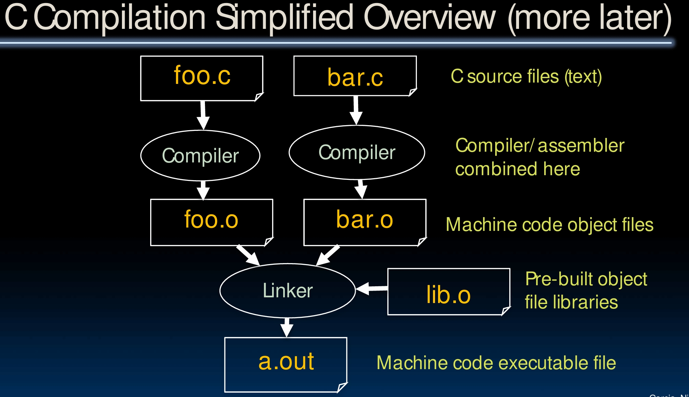
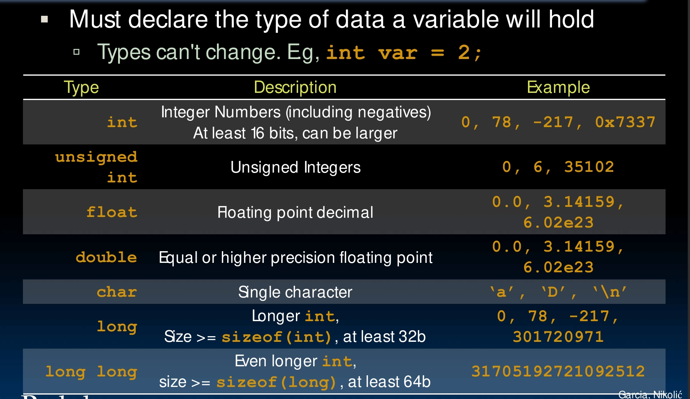
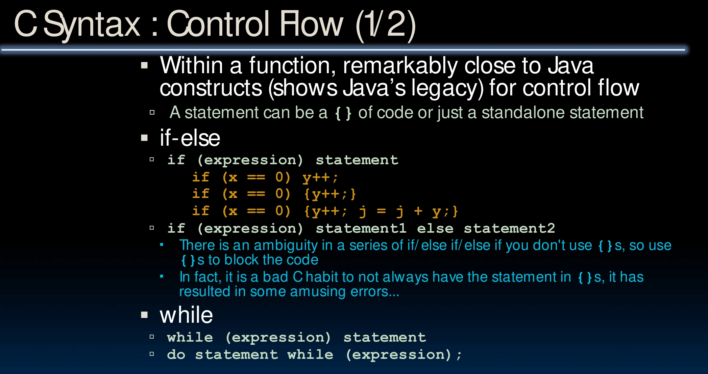
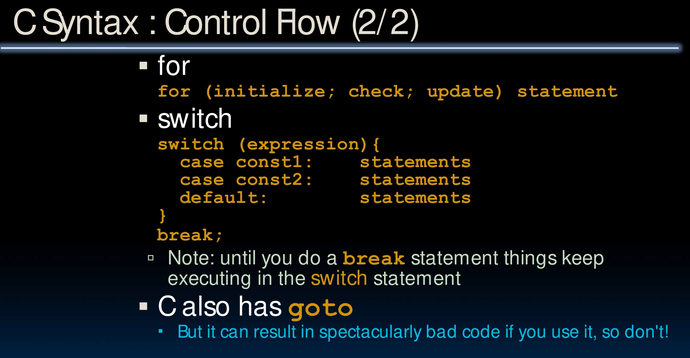
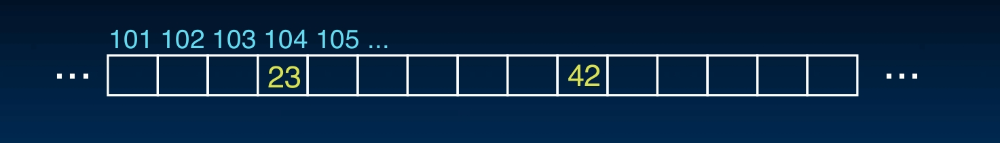
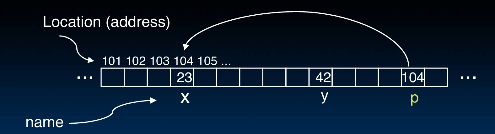
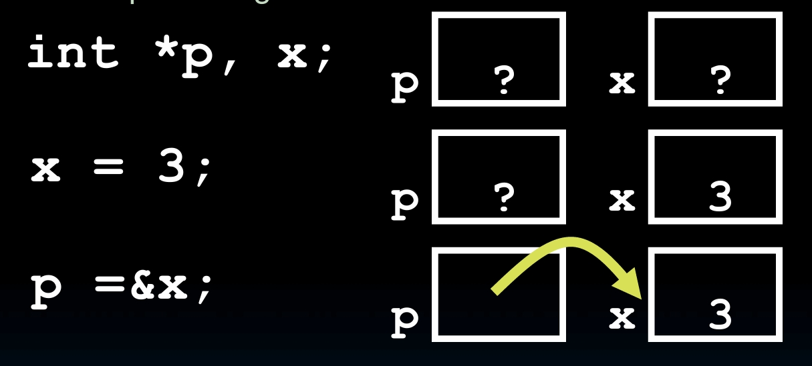
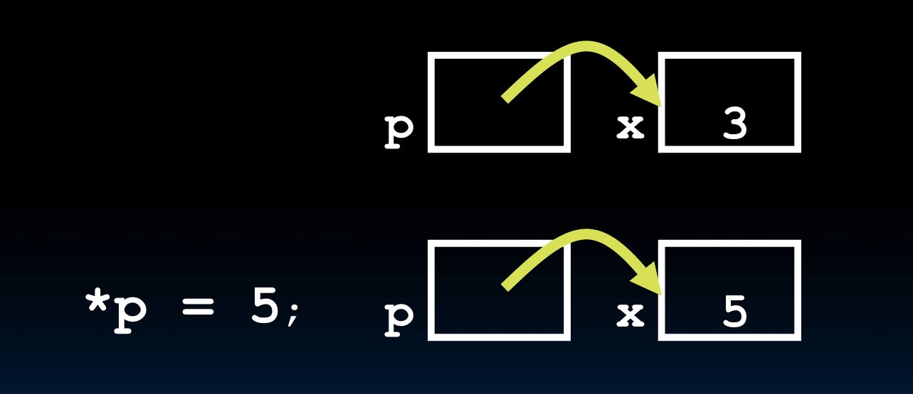
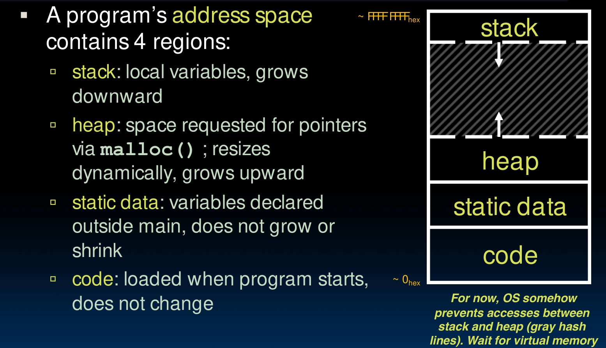
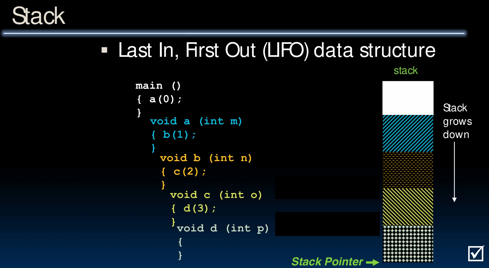

# C Language

You remember the abstraction we used to talk about?


The top layer is the high level language program, and C is one of them.

The reason we choose to learn C for further study in computer architecture is that C is a low level language, and it is close to the machine language. We can exploit a lot of underlying features of architecture, things like memory management, special instructions, parallelism, etc.

For this course, understanding pointers, array and how they implicate memory management is important.

## Compile vs. Interpret

C language does compile. The C compiler will directly map C program to machine language, which is strings of 1s and 0s.

You might know Python, which does another thing called interpret. It read code line by line, and interpret it into byte code at runtime, then execute it.

And if you've done CS61B or something, you might also know Java. It does a mix of both. It first interpret the code into byte code, then use the JIT compiler to compile the byte code into machine language at runtime.

And that's why C is fast as fuck.



This is a simplified big picture of C compilation. You see we have two C programs here, they might have some reference with each other, so we kind of need to link them before execution. We first let them pass the compiler respectively, and the assembler actually which we didn't specifically show here. And we got two `.o` files, which is the object files already in machine code. Then we use linker to link them together and a pre-built `lib.o` file. Finally we got a `.out` file, which is the executable file.

So the compile is so good because it's really fast at running. Does it have any disadvantages?

Sure it does. Obviously, though it's fast at running, but it would take much more time during development. And the final executable file is for specific platform, so it's not portable.

For simplicity, we let the C program directly go to the complier above, but it's not. Firstly, the `foo.c` go through something called **C Pre-processor (CPP)** and got `foo.i` file, basically only replace all the comments with a single space. Then it go through the compiler and assembler to get `foo.o` in machine code.

## Basic Syntax

### main

To make the `main` function to be able to accept arguments, we need to use this.

```c
int main(int argc, char *argv[])
```

The `argc` is 'argument count', which includes the name of executable file itself.

For example, for `unix% sort myFile`, the `argc` is 2, the argument `myself` and file name `sort` itself.

The `argv` is 'argument vector', which is an array of strings. `argv[0]` is always the file name, `argv[1]` is the first argument, and so on.

### bool logic

Only **0**, **NULL** and the bool type itself are false, everything else is true.

### Typed Variables



See this table above.

One thing to notice is that in Java, int is 32 bits, but in C it depends on the specific computer. Only guarantee is that `sizeof(long long) >= sizeof(long) >= sizeof(int) >= sizeof(short)`. Also, `short >= 16` bits, `long >= 32` bits. All could be 64 bits.

If you want to make your code can be used anywhere, you are recommanded to use `intN_t` and `uintN_t`.

### Consts and Enums

Constant is a declaration of a variable that cannot be changed during the execution.

```c
const float golden_ratio = 1.618;
const int days_in_week = 7;
const double the_law = 2.99792458e8;
```

Enum is a group of integer constants.

```c
enum cardsuit {CLUBS,DIAMONDS,HEARTS,SPADES};
enum color {RED, GREEN, BLUE};
```

### Typed Functions

You need to declare the type of function's return value.

```c
int number_of_people () {return 3;}
float dollars_and_cents () {return 10.33;}
```

Or you can declare it as `void`, basically means there's nothing to return.

Variables that are passed to functions also need to be declared. Both functions and variables must be declared before they are used.

### Structs

You can define your own new types with `typedef`.

```c
typedef uint8_t BYTE;
BYTE b1, b2;
```

Sometimes you want to define a new type with a group of variables, then you use structs.

```c
typedef struct {
    int length_in_seconds;
    int year_recorded;
} SONG;
```

In this SONG type, we have two variables, `length_in_seconds` and `year_recorded`. For every song you can store and use its length and year recorded.

```c
SONG song1;
song1.length_in_seconds = 180;
song1.year_recorded = 1999;
```

### Control Flow

Basically the same thing as Java. See these pictures if not clear.





## Pointers

We are hitting the real tricky part.

See this program.

```c
void addOne(int x) {
    x = x + 1;
}

int main() {
    int y = 3;
    addOne(y);
    return y;
}
```

If you run the main function, you think you get 4, but actually you would find that it's still 3.

The reason is that in C and Java, variables are **passed by value**. This means the function actually got a copy of the variable, and change the copy, with the original one remains unchanged.

So the super big problem would be, how do we really change the variable if we insist to do that?

To do that, you need to first understand how memory works.

### Address vs. Value

For simplicity, just regard the memory as a single very big array. **Address** is something referring to one position, while **value** is what really stored in that position. Never confuse them.

If you see it as an array, address is the index, and value is the element in that box.



### Pointers

A pointer is just the address, to be specific, is a variable that stores the address referring to a location.



### Pointer syntax

Basically, `p` is the pointer variable, then `*p` means the value stored in the address `p` points to, and `&y` means the address of variable `y`.

So we have

```c
int *p;
```

which declares that the variable stored at that address is an integer.

And we have

```c
p = &y;
```

which stores the address of `y` to `p`. So that `p` would be the pointer that points to the location that stores `y`.

Also, we have

```c
z = *p;
```

which stores the value stored in the address `p` points to to `z`.

By

```c
int *p, x;
x = 3;
p = &x;
```

You can create a pointer.



And to change the variable pointed to

```c
*p = 5;
```



Now we can fix the program above.

```c
void addOne(int *p) {
    *p = *p + 1;
}

int main() {
    int y = 3;
    addOne(&y);
    return y;
}
```

Pointers are wonderful. When you want to pass, like a very big struct, it would be much more convenient to only pass a pointer to it.

But it's also dangerous. In C program, probably most of the bugs are caused by pointers. Just be careful.

### Efficency

Usually one pointer can point to one type of variables, as you declared. But you can also use `void *` to point to any type of variables. Just need to be very careful.

And you can even have pointers towards functions.

```c
int (*fn)(void *, void *) = &foo;

(*fn)(x, y);
```

To deal with structs, you can use `.` or `->` to access the variables.

```c
typedef struct {
int x;
int y;
} Point;

Point p1;
Point p2;
Point *paddr;

/* dot notation */
int h = p1.x;
p2.y = p1.y;

/* arrow notation */
int h = paddr->x;
int h = (*paddr).x;

/* This works too */
p1 = p2
```

NULL pointers are bad, whose value is an address of all zeros. If you write or read it, your program would crash.

You can deal with it by simply

```c
if(!p) {/* P is a null pointer */}
if(q) {/* Q is not a null pointer */}
```

since 0 is false.

### Arrays

Array is basically the same thing as pointer. The array variable is just a pointer that points to the first element of the array.

So `a[0]` is just `*a`, and `a[i]` is just `*(a + i)`.

### Pointer to Pointer

By the way, when you want to change a pointer, if you do

```c
void IncrementPtr(int *p) {
    p = p + 1;
}

int A[3] = {50, 60, 70};
int *q = A;
IncrementPtr(q);
printf("*q = %d\n", *q);
```

You would find that `q` is still the same, 50. It's the same problem as we discussed before. You only change a copy of the pointer, not the original one.

So this is the changing pointer done right.

```c
void IncrementPtr(int **p) {
    *p = *p + 1;
}

int A[3] = {50, 60, 70};
int *q = A;
IncrementPtr(&q);
printf("*q = %d\n", *q);
```

## Memory

### Manage the heap

C language is difficult because it kind of needs you to manage the memory yourself. Like when you got something new to point to, you do

```c
ptr = (int *) malloc (sizeof(int));
```

The `malloc` function will allocate a block memory for you, with a specific size you passed in. Here it's `sizeof(int)`. It's not recommended to write a number yourself, because you might need the program to work on different platforms. `sizeof` is safe.

By the way, `(int *)` is simply telling the compiler what is going in. You need to do this casting because `malloc` returns a `void *` pointer default.

You don't usually use `malloc` for a single variable.

```c
ptr = (int *) malloc (n * sizeof(int));
```

This will allocate an array of n integers.

Once you call `malloc`, the computer fills in some garbage values to the memory location, existing until you actually set its value.

So you manually allocate the memory location, then you would have to also manually free it.

```c
free(ptr);
```

This is necessary, but got to be careful. If you free a memory twice or free a memory that you didn't allocate, your program would crash and it would be a bug that really hard to figure out.

The runtime needs to be really fast, so it just run it, won't check anything for you. There's no god, got to make effort yourself.

Sometimes we might need to resize an allocated memory, like an array with dynamic size. We have this `realloc(p, size)` function.

If the p is NULL, it will be the same as `malloc(size)`. If the size is 0, it will free the memory. Otherwise, it will re-allocate the memory and return the new address.

```c
int *ip;
ip = (int *) malloc(10*sizeof(int));
/* always check for ip == NULL */

ip = (int *) realloc(ip,20*sizeof(int));
/* always check NULL, contents of first 10
elements retained */

realloc(ip,0);
/* identical to free(ip) *
```

### Memory Locations

You might have noticed that last part was named as 'Manage the heap'. Yes, all these management, the malloc, free, realloc things are actually managing the heap.

C has three pools of memory. The **static storage** is basically about the global variables, permanent, declared outside of any procedure. The **stack** stores local variables, parameters, and return addresses. And the **heap** is about data lives until programer deallocates it.



So see this picture, showing four regions of one program's address space. Stack, heap, static data and the code. For now, just think OS somehow prevents accesses between stack and heap, we will get to it later, something about the virtual memory.

For variables, if it's declared outside of a procedure, it's global and being in the static. If it's declared inside a procedure, it's local and being in the stack.

```c
int myGlobal; /* static */
main() {
    int myLocal; /* stack */
}
```

The stack is talked about in Data Structure, you know it's basically just Last In First Out (LIFO).



You see it grows down like this. The stack pointer will move automatically as the program runs, no worry, no need for management.

The heap, is a large pool of unallocated, contiguous memory. To manage it, we keep all our free memory blocks in a freelist.

There are different implementations. We have best fit, which means always find the smallest block that can fit the request. We have first fit, which means always find the first block that can fit the request. We have next fit, which is similar to first fit, but it starts from the last block that was allocated.

Sometimes, when we do free, we see nearby trying to do some merging.

But all these depends on the implementation.

### Bugs

C is fast, but it's also dangerous.

As it doesn't check the boundary of arrays for you, if you write off the end of arrays, you might change something in other variables. This is the **buffer overflow** problem.

And you need to allocate and deallocate yourself, so use after free, double free, free wrong things, forgetting reallocate, all causes serious problems.

**Memory leak** means you allocate memory, but never free it. This will cause the program to run out of memory.

**Dangling pointer** means you free a memory, but still use the pointer to it. This will cause a very hard to find bug.
