# Caches

I learn this from these lectures:

[Lec24](https://www.learncs.site/resource/cs61c/lectures/lec24.pdf)  
[Lec25](https://www.learncs.site/resource/cs61c/lectures/lec25.pdf)  
[Lec26](https://www.learncs.site/resource/cs61c/lectures/lec26.pdf)  
[Lec27](https://www.learncs.site/resource/cs61c/lectures/lec27.pdf)

All the pictures are from the slides.

## Illusion: Memory Hierarchy

### Processor-DRAM Gap

We have done a pretty good job with the CPU itself in the previous notes. However, the performance of the CPU is not only impacted by itself, but also the memory.

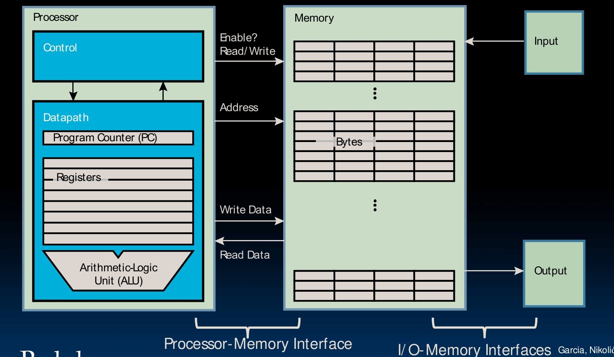

Now you are more than familiar with the register is fast but memory is slow thing. So the register is very very fast for CPU to use, good. But it's also small, while the memory is much larger.

Basically, things with larger space tend to be slower. It's like a library, the larger, the more time you take to look up and get the book. For memory stuff, the larger, the more time it takes to address and fetch data.

This is bad, since fetch the data from memory impacts the performance of the CPU, like a lot.

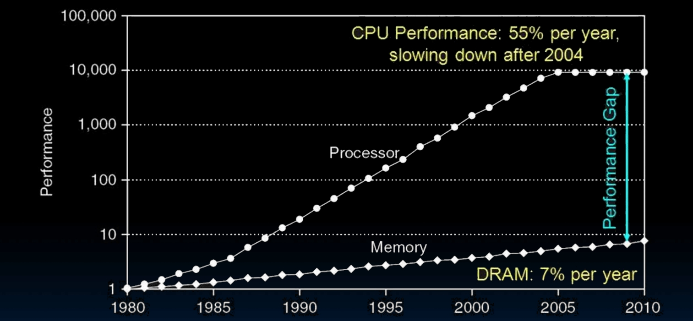

You see, in the past few decades, the performance of the CPU is improving really fast, while the improvement of DRAM is quite slow. At the 1980s, the CPU can execute one instruction during the time of DRAM return the data. Now, it can execute 1000 instructions during the time. This is what we call the **Processor-DRAM Gap**.

So if the CPU is always need to fetch the data from memory, there will be a very very big waste of time.

Our big goal, is to make something that is both fast and large. How do we do that?

### Memory Hierarchy, Cache

If something is more near the CPU, it's faster, but it will also be expensive and with tiny capacity. If something is further away, it could be cheaper and with larger capacity, but slower.

Our trick is using the memory hierarchy, to present an illusion to the CPU, that it has a large, cheap and fast enough memory.

To do that, we add a new level to the memory hierarchy, called **Cache**. It would be very near, to the processor, built by the same IC processing technology as the CPU so pretty expensive.

It would be a copy of a subset of main memory.

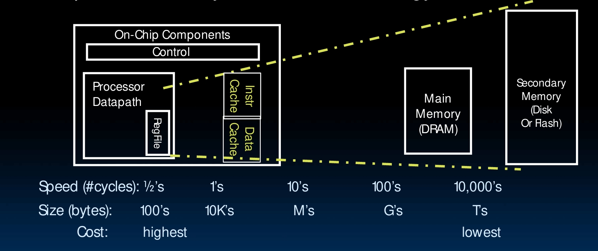

But why it works? It's all about the idea of locality.

### Locality

So the basic idea of memory hierarchy is that, memory has copy of data on disk that are being used, while cache has copy of data on memory that are being used.

What copy do we have in the memory, that is clear. The instructions and data of the current running program, of course. But what should we copy to the cache?

Go back to the big library problem. If you are writing the paper, you might get 10 books that are most likely to be used, put them on the table. So it's very possible that you can write this paper with really fast speed of finding data, though you only get a little part of the library.

Well, so we have the idea of locality. Actually, two ideas, the **Temporal Locality** and **Spatial Locality**.

Temporal Locality means that if a memory location is referenced, it tends to be referenced again soon. So we might want to keep the most recently referenced data in the cache.

Spatial Locality means that if a memory location is referenced, the locations with nearby addresses tend to be referenced soon. So we might want to keep blocks consisting of contiguous words in the cache.

### Management

The management of the memory hierarchy is important. I mean we knew there are these things to do, but we also got to know who does each.

We already talked about that the compiler would decide what to put in the registers.

Today we have this new cache thing, and the management would be done automatically by hardware, the **cache controller hardware**.

And how the memory has a copy of the disk, that will be done by the Operating System, via the **Virtual Memory**. We will talk about this later.

Anyway, with cache, we provide an illution to the processor that the memory is infinite large and infinite fast!

## Design the Cache

So that's really design the cache. By design, I mean solve this big problem.

When CPU needs data of some certain address, where should we put it in the cache?

Here is one way, the **Direct-Mapped Cache**.

### Direct-Mapped Cache

It's pretty like a function. The big idea is that each memory address is associated with one possible block within the cache.

We design it like this because it make it easy to check whether we have something in the cache or not, since you only need to look in one location.

Sounds simple? No, it got lots of problems.

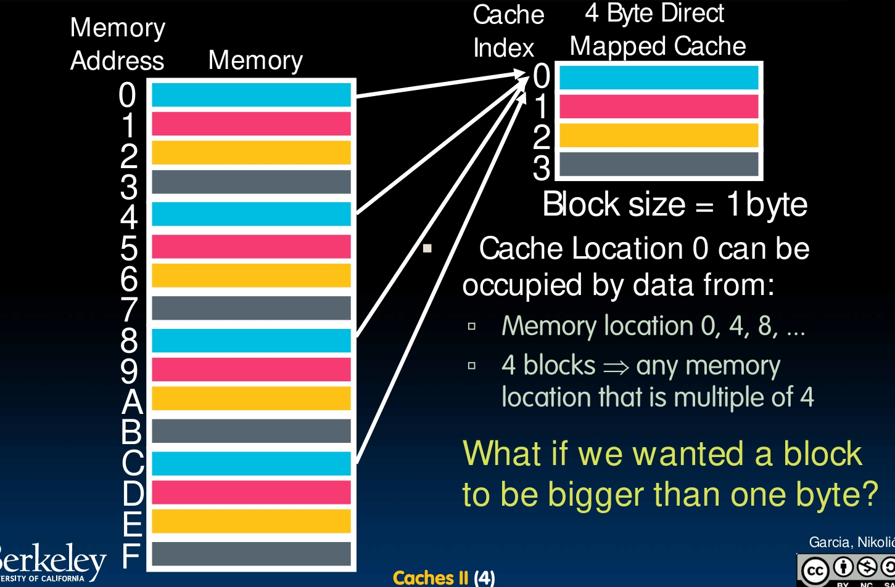

See we have 4 blocks in this cache, and each block is 1 byte. So we use modulo to do the mapping.

Cache location 0 can be occupied by data from memory location 0, 4, 8... Actually, any memory location that is multiple of 4!

And in real life, remember the spatial locality thing? We will want a block to be bigger than one byte.

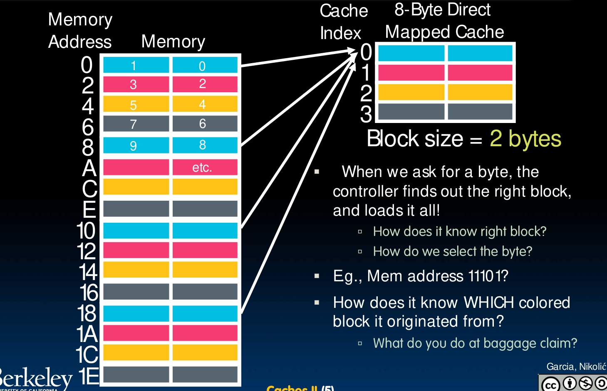

So still 4 blocks, but now each block is 2 bytes. When we ask for a byte, the controller finds out the right block, and loads it all.

How does it know the right block? And how do we select the byte?

Furthermore, how does it know which block it originated from?

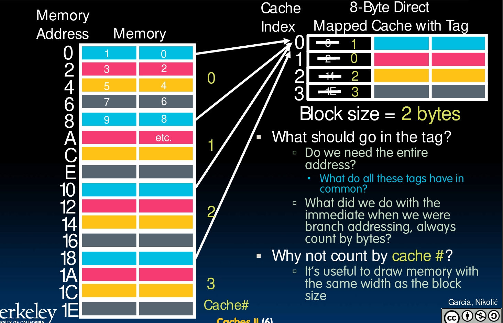

Well, the last problem can be solved by also storing some information about the original block. But there will be also more problems.

Do we need the entire address? Or what else do we need?

So to summarize these issues up.

- Since multiple memory addresses map to the same cache index, how do we tell which one is in there?

- What do we do if we have a block larger than 1 byte?

To solve them, we have this big idea, which is dividing memory address into 3 fields. The **TIO**, tag, index and offset.

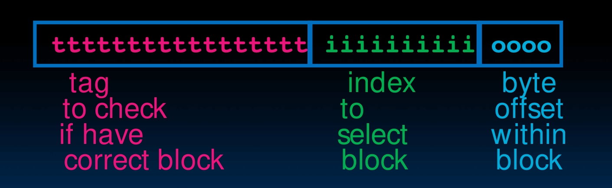

The tag is used to check is it the correct block that we want from the memory.

The index is used to select block of the cache.

The offset is used when there are more than 1 byte in a block, to tell which byte it is.

All fields are read as unsigned integers.

Obviously, how many bits the index and offset need is decided by the cache itself. Then the remaining bits are for the tag.

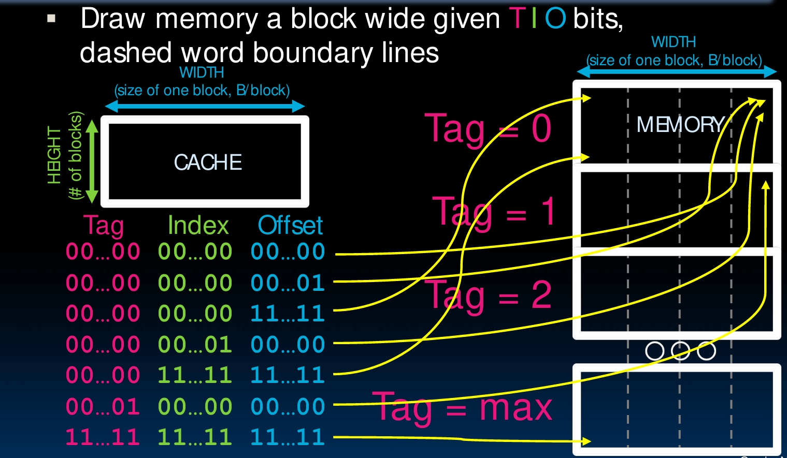

### Direct-Mapped Example

Just use the 8-byte direct-mapped cache with block size 2 bytes as the example.

So the Offset is used to specify correct byte in block. Since there are only two bytes in a block, so we need 1 bit.

Then the Index, is used to specify correct block within the cache. Since there are 4 blocks, so we need 2 bits.

32 bits in total, so the tag is 32 - 1 - 2 = 29 bits. The leftmost 29 bits, to be specific.

### Memory Access with Cache

So now we can access the memory with cache.

Before, when we do some loading. The CPU send the address to the memory, the memory check the address and output the data, sending back to the CPU, and the CPU write it back to the register.

This is slow, because you have to do the memory thing. Now, we have cache.

So when the CPU have the address, the processor check the cache first. See if there is what we want. If so, cachi hit! Everything will be extremely fast. If not, it's a cache miss. We still to the old things.

### Cache Terminology

Just see these pictures.

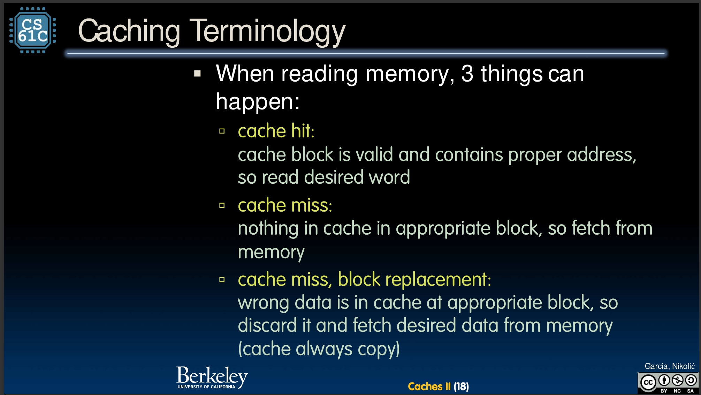

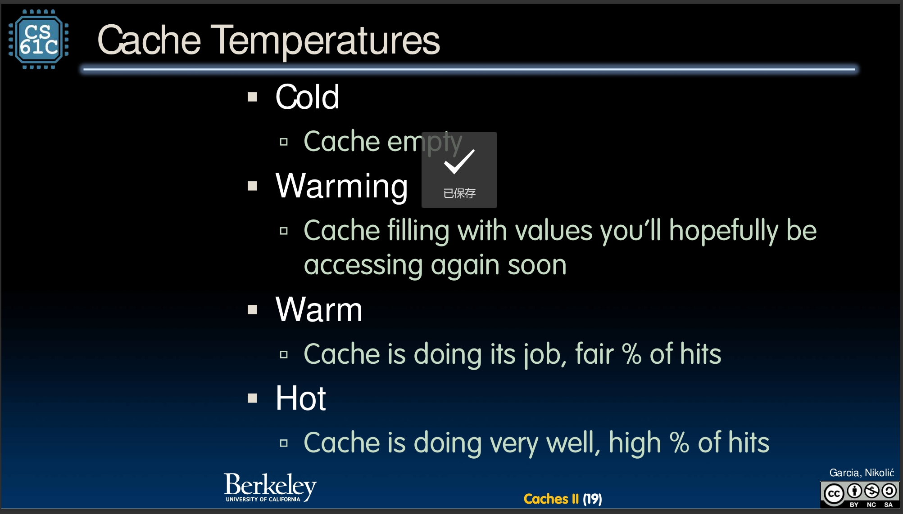

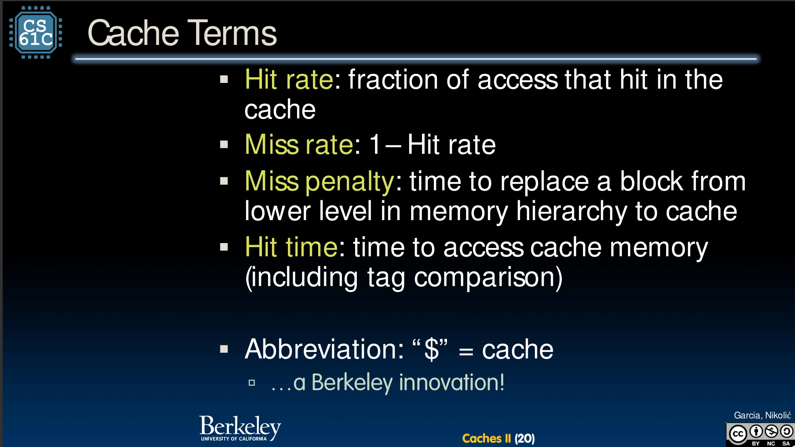

### Valid Bit

Just one more detail.

When start a new program, cache does not have valid information for this program. But it does have something in it.

What if, unfortunately, the leftmost certain bits happen to be the same as the tag of what we want? Then we incorrectly think we can just use it.

The solution is add a valid bit to the tag. When it's 0, cache miss even match.

And they will be all 0 when the computer is just power up.

### Write Hit

By the way, we were basically focus on the read hit to understand the whole thing. But sometimes hit happens when you doing a write, this cause a problem.

Since now we are handling the data in cache, and it's only a copy of part of memory, so when we write to it we change the data in cache, but how do we update the memory?

There are two approaches.

The **Write-Through** approach is to update both cache and memory.

The **Write-Back** approach is to only update the data in cache, and add a 'dirty bit' to each block to tell that this need to be updated to the memory when block is replaced.

The write-through is simple but slow, while the write-back is complex but fast. Gotta trade off.

Actully, there are a lot of things that need to trade off.

## The Trade-Off

### Types of Cache Misses

There is a big example in the slide of Lec 26, check if out if you need. Anyway, since we want the performance of cache to be good, we need to discuss the cache misses a little bit.

There are 3 types of them.

First is called **Compulsory Misses**. It's basically that the valid bit is 0. Can't be avoid easily, won't go deep.

Second is called **Conflict Misses**. Big old problem, multiple memory addresses map to the same cache location. Probably the largest problem in Direct-Mapped Caches.

There might be two main solutions to deal with this. One is to make this cache supper big, so that the conflict happens less. Another is to allow the same index to have multiple distinct blocks. We will talk about these solutions later.

Third one is the **Capacity Misses**. Since the cache got a limited size, so something would be kicked out anyway, even without conflict. I know, just a sketchy definition, get the general idea.

### Fully Associative Cache

So the biggest problem of the direct-mapped cache is conflict misses, we got to deal with it.

Why not just push right to the opposite side? Build something without conflict misses at all!

So we have the **Fully Associative Cache**.

We still have tag, we still have offset, but index? No need anymore.

This means all blocks can go anywhere in the cache, and we must compare with all tags to see if data is there.

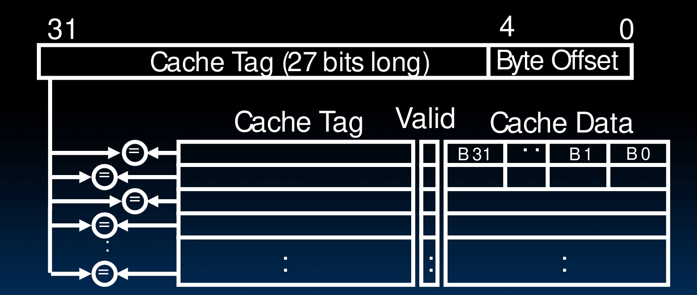

But there are also some drawbacks. Very complex hardware, a lot of comparators.

### Trade-Off

So this is actually another extreme, no conflict at all but very complicated and expensive.

It needs a comparator for each 'row'.

At the same time, Direct-Mapped Cache is very simple and cheap, only one comparator. However, it got conflict, conflict and conflict.

The real solution must be a trade-off between these two.

### Set Associative Cache

So here we have this super big wonderful solution in between.

It's actually pretty like what we did with hash table. Just make it a bucket.

We now don't use index to select the 'row', but the set. Each set can contain multiple blocks. Once we found correct set, we must compare with all tags in it.

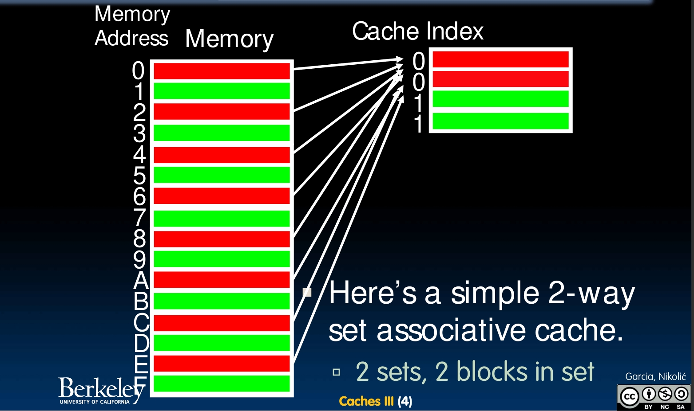

You see why it's in between? Cache is direct-mapped with respect to sets, but each set is fully associative with N blocks in it. You know, for a N-way set associative cache.

Actually, for a M blocks cache, direct-mapped is actually a 1-way set associative, while fully associative is a M-way set associative.

So the workflow now is, we got a memory address, we use the index to find the right set, and we compare the tag with all tags in it. If one match, cache hit! Otherwise, cache miss. If hit, we use the offset to find the correct byte.

This is just so great, it not only avoid a lot of conflict misses, but also need N comparators.

Here is a 4-way set associative cache circuit.

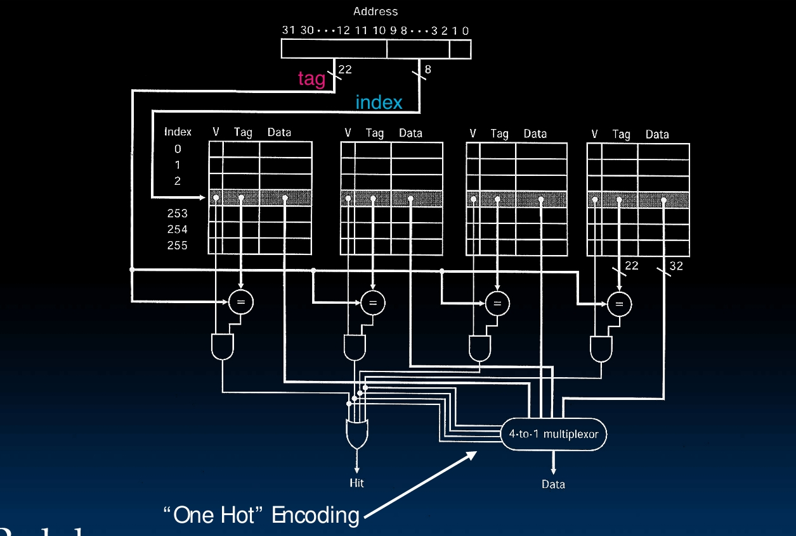

### Block Replacement

But this introduces a new problem. So now we have multiple blocks in a set, with the same index. When we need to store a new block with this index, which one should we kick out? This is the **block replacement** problem.

I mean, of course, if there is invalid blocks, just write into the first invalid block. But if they are all valid, then we need to pick a relacement policy.

One possible choice is the **Least Recently Used (LRU)**. It's just find out which of them has been accessed (read or write) the least recently, and cache it out when miss.

This is obviously pro Temporal Locality, but it could be pretty complex especially for a large N.

We can also do **First In First Out (FIFO)** or **Random**. But they have nothing to do with the Locality.

Here is an example of LRU.

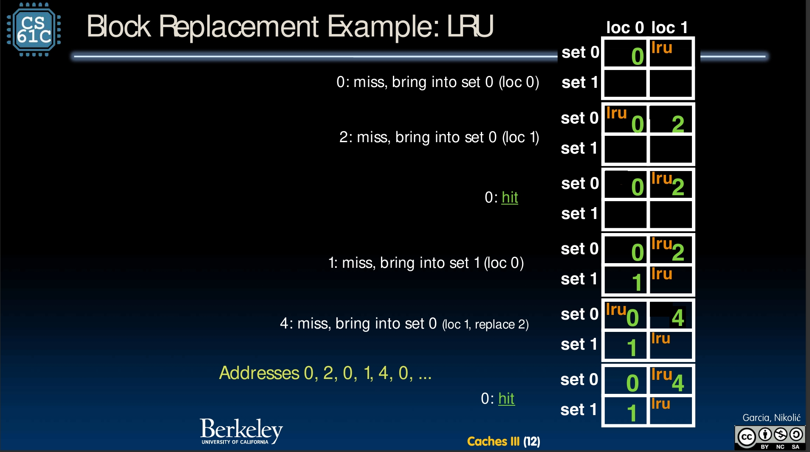

## AMAT, the Performance

### Average Memory Access Time (AMAT)

So to design a good cache, we need to trade off a lot about the associativity, the replacement policy, the block size, etc. The main goal, is to improve the performance.

But what is the performance? We got to define it first.

Well, it means minimizing the **Average Memory Access Time (AMAT)**.

$$
AMAT = Hit Time + Miss Penalty \times Miss Rate
$$

To make this small, we can make an illusion of a memory that is cheap, large and fast.

### Miss Penalty, Level Cache

We have did a lot to reduce the Miss Rate, why not thing of how can we reduce the Miss Penalty?

So, it takes a lot of time to access the memory when cache miss, huh? Funny, remember we build this cache to solve the problem of CPU take a lot of time to access the memory?

Call me crazy, but what about build another cache between cache and the memory to solve the same problem?

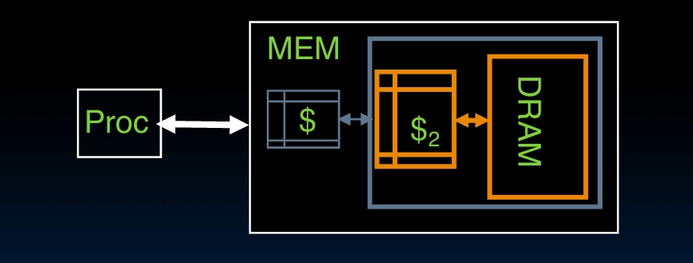

So that now the Miss Penalty of L1 cache can be seen as the AMAT of L2 cache.

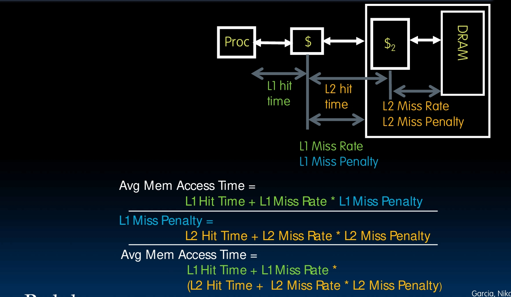

So that's calculate an example. Assume the L1 Hit time is 1 cycle, and the L2 Hit time is 5 cycles. The L1 Miss Rate is 5%, and the L2 Miss Rate is 15%, would be this much higher since it is fraction of L1 miss that also miss in L2. And say the L2 Miss Penalty is 200 cycles.

So the AMAT of L1 is

$$
1 + 0.05 \times (5 + 0.15 \times 200) = 1 + 0.05 \times 35 = 2.75
$$

It's only 2.75 cycles!

Without the L2 cache, it would be $1 + 0.05 \times 200 = 11$ cycles.

Yes, I am that faster.

## Summary

We got cache.

It's 4 in the morning. Fuck you computer architecture.
