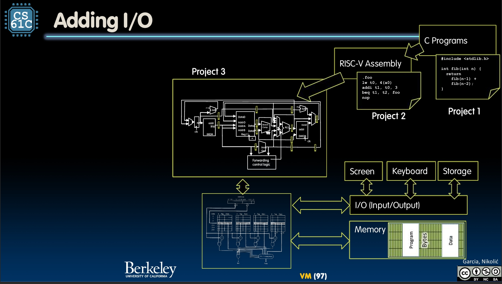
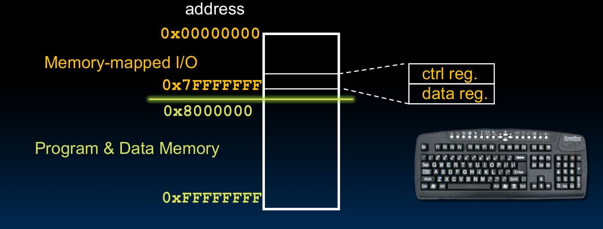
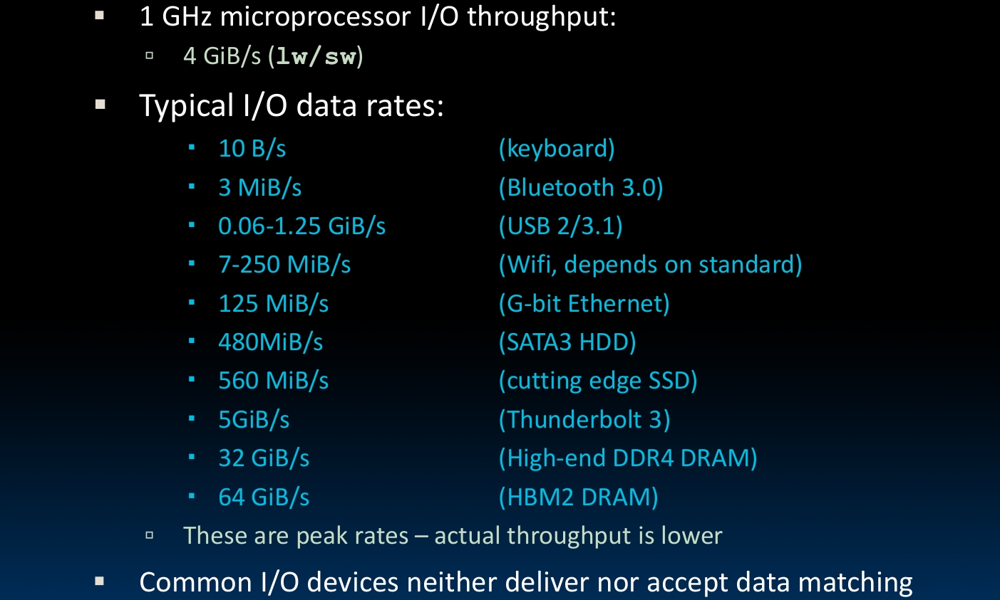
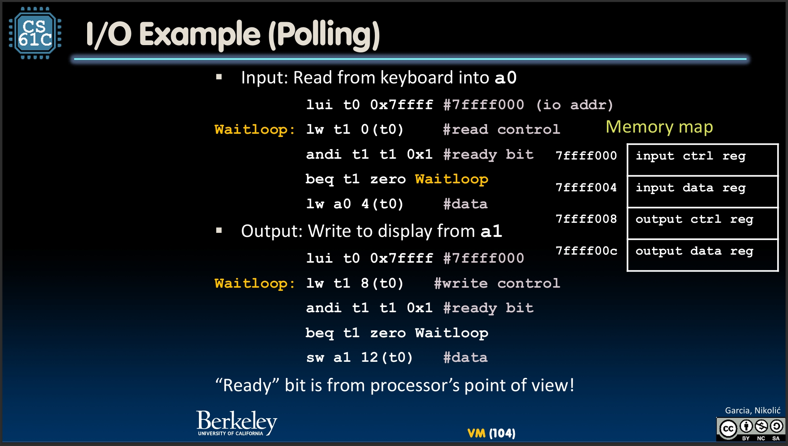
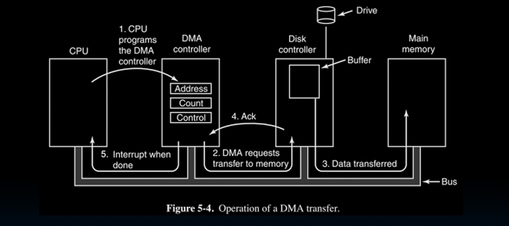
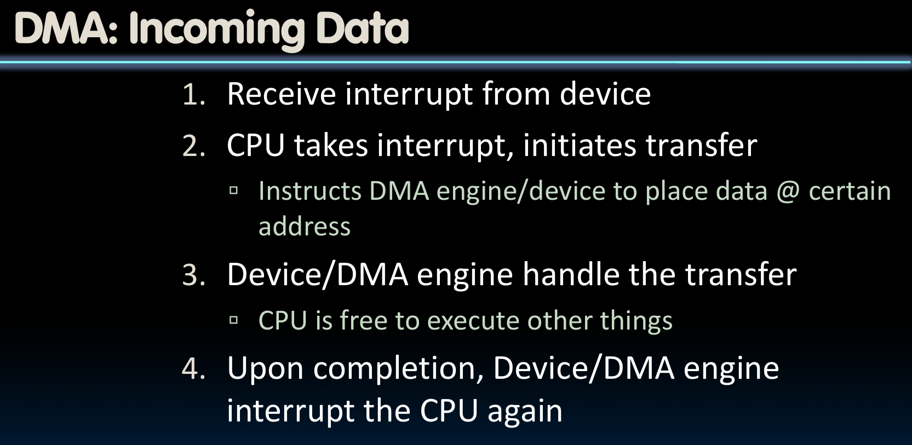
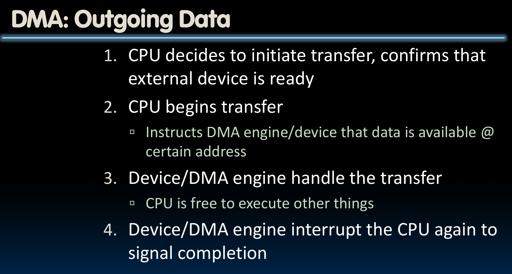

# I/O

I learn this from this lecture:

[Lec31](https://www.learncs.site/resource/cs61c/lectures/lec31.pdf)

All the pictures are from the slides.

## Intro

So remember we mentioned that the OS also manage the **I/O (Input/Output)** to let the programs running on CPU interact with devices? Let's talk about this now.

For input, we have keyboard, mouse, etc. For output, we have screen and shits. And we got storage and network and stuff.

The OS needs to manage all of them, presenting a useful abstraction to the programs. But this is not what we care about now.

We will focus on how the CPU interact with the I/O devices. How can our ISA support these operations?

One naive approach is to add some special input/output instructions and hardware. But this is just not simple enough.

What most ISAs really use is the **Memory Mapped I/O (MMIO)**.

So in the good old days, the address space is just about the memory. The big idea of MMIO is that portion of address space is dedicated to I/O. To be specific, there are some certain addresses are not 'regular memory', but some registers in I/O devices.

In this way, we can just use the old `lw/sw` instructions to read/write some sequence of bytes.

Wait, is that it? Problem solved? This note is ending?

Certainly not. There are still this big problem that we are facing, which is the the **Processor-I/O Speed Mismatch**.

You can see that the say 1 GHz microprocessor I/O throughput is 4GiB/s, which is much faster than most of the I/O devices. And the I/O devices data are even peak rates.

The key point of I/O is basically dealing with this mismathch.

## Polling

Those I/O devices registers got two types, the **control registers** and **data registers**. Control register tells that whether the I/O device is ready to read/write or not. Data register is literally data.

The **polling** approach means the processor reads from control register in loop. See the 'ready bit' in it. If it is ready, then we can read or write. If not, we keep looping.

This is without doubt a simple and even naive approach. The problem of this simplicity is that it is with pretty large cost.

Let's say we have a 1 GHz CPU, and take 400 clock cycles for a polling operation.

For a mouse, which is a pretty slow device, it takes maybe 30 times of polling per second to make it smooth.

Then it's 12k clock cycles per second.

$$
\frac {12 \times 10^3}{1 \times 10^9} = 0.0012\%
$$

So it takes 0.0012% of the CPU time as cost, actually not bad.

But what if it's a little faster? Like a hard disk?

The frequency of polling disk would be

$$
16 [MB/s] \div 16 [B/poll] = 1M [poll/s]
$$

So clock cycles per second would be

$$
1M [poll/s] \times 400 [cycles/poll] = 400M [cycles/s]
$$

So it takes **40%!!!** of the CPU time.

I think everyone can agree this is totally not acceptable.

## Interrupts

So we are trying to find smarter approach to deal with the mismatch.

The polling means the CPU ask the I/O devices 'are you ready?' in loop, got huge cost. What if, don't ask, but let the devices be able to tell the CPU they are ready when they are ready?

This approach is called **Interrupts**.

So when the I/O device is ready, it interrupt the current program, and it transfer control to the trap handler in the OS.

This is good because when there are not I/O operations, the CPU can just keep running, no cost. However, if you got lots of I/O operations, the cost would be huge, since everytime you need to save the current program state, jump, run the trap handler, and then restore the program state...

If you think about some essential problems, you might notice that up til now, we are still letting the CPU spend time doing this getting data from I/O devices to main memory job. It takes lots of time that could be used to do the real job of CPU, compute.

This is what we called **Programmed I/O**.

But it doesn't have to be.

## DMA (Direct Memory Access)

Big idea, we just allow the I/O devices to directly read/write the main memory!

To do that, requiring new hardware, the DMA Engine.

DMA Engine contains registers written by the CPU, including memory address, number of bytes, I/O devices number, direction of transfer, unit of transfer and amount to transfer per burst.

Here are the procedures:

## Policy

How do we decide which approach to use?

For low data rate devices, interrupt is fine. Most of the time nothing to do at all, once interrupt, the cost won't be very high.

But for high data rate devices, we start with interrupt, but once data comes, we switch to DMA.

## Summary

I have done Computer Architecture, at least for those what I currently need.
