# Introduction and Data Representation

I learn this from these lectures:

[Lec1](https://www.learncs.site/resource/cs61c/lectures/lec01.pdf)
[Lec2](https://www.learncs.site/resource/cs61c/lectures/lec02.pdf)
[Lec6](https://www.learncs.site/resource/cs61c/lectures/lec06.pdf)

All the pictures are from the slides.

## Introduction

This is a course about the hardware-software interface. Or we can just say, what a programmer needs to know to let its program use the hardware the most efficiently.

I am going to let you know about everything from the digital logic to the operation system you are using.

You can see that the machine structure is layers and layers, from the hardware stuffs to the software stuffs. Our course is going to focus on how the software and hardware interact with each other, which is the middle part of the picture above. We have operation system, compiler and assembler in the software side, and we have processor, memory, I/O system, datapath & control and digital design in the hareware part. They use this instruction set architecture to interact with each other.

In the passed few decades, a lot of smart people come up with a lot of great ideas so that we can make this.

**Abstraction** is definitely one. When a system comes to very complicated, nobody can and want to understand every detail. So we make it layers, each layer provide a simplified service for upper layer to use, which the upper layer don't need to know how it's implemented.

You see you write some C language code, pretty readable. Then this guy called compiler suddenly turn it into assembly language, has data and instruction, not that readable by human, but everything can be represented as a number. So that this guy called assembler can turn it into a bunch of 0s and 1s. And finally the machine can read, the hardware can work on it. This is a kind of abstraction, you write your very readable code, no need to deal with instructions, binary code and stuff.

Another great is the **Moore's Law**. A guy probably named Moore said that there would be two times of transistors per chip every two years. So that no need for architecture creation, we can just wait for more cheap, small and fast computers.

However, the speed is slow down these years though it works fine the first 50 years, so we might still need to create something new.

**Principle of Locality and Memory Hierarchy** is also very great idea. The problem is that the data is too far, cpu runs fast but it takes a lot of time to get to the data. Regard the CPU as your mind, the register is right in your mind, but go to the memory is like going to another city, go to the disk is like going to Pluto or something like that. Imagine that!

We can improve this through the principle of locality, which tells us that the CPU usually duplicately goes to recently used data, or goes to the data that near the recently used data. The solution is to automatically load these data to somewhere closer to the CPU, so that the CPU can get to the data faster.

We need a memory hierarchy to do this, at top are registers and cache which are very fast but small, at bottom are disk which is big but slow.

**Parallelism** is also a great idea of course. It's basiclally just let more people do the job together, since the single person can't do the job faster. Parallelism is everywhere in the computer, instruction level parallelism, data level parallelism, thread level parallelism, etc.

To be clear, it's not like you can keep doing this and make things faster and faster. The limit is about those things that must be done by one person. This is the Amdahl's Law.

Next one great idea is the **Performance Measurement and Improvement**. We need to know how to measure the performance of a computer, and how to improve it. Basically just latency and throughput.

The last one is **Dependability via Redundancy**. Things can be broken suddenly, so we might put some extra ones there in case.

## Number Representation

All the tasks that we want the computer to do is basically analog this world. And we've talked about the abstraction, finally the hardware is dealing with those 1s and 0s, so we need to turn everything into numbers, binary numbers to be specific.

Bits are digits, each has two possibility, 1 and 0. The big idea is that bits can represent anything.

You have 26 letters to represent? If you got 4 bits, you can represent $2^4 = 16$ different things, which is not enough. But if you got 5 bits, you can represent $2^5 = 32$ different things, which is enough.

ASCII use 7 bits to represent all the letters, upper or lower case, and all the punctuation. Unicode use 8, 16 or 32 bits to cover all the languages in the world.

Anyway, for N bits you got at most $2^N$ different things can be represented, so you can represent anything, color, logical values, etc.

### Binary, Decimal and Hex

What we use every day is called decimal, the base is 10. For example, how much is 3271 under decimal?

$$3271_{10} = (3 \times 10^3) + (2 \times 10^2) + (7 \times 10^1) + (1 \times 10^0) = 3271$$

Binary use the same algorithm, but the base is 2, and there are only two digits, 0 and 1. By the way, 'bits' actually get 'bi' from 'binary' and 'ts' from 'digits'.

For example, how much is 1101 under binary?

$$1101_2 = (1 \times 2^3) + (1 \times 2^2) + (0 \times 2^1) + (1 \times 2^0) = 13$$

I believe even no need to tell you about Hexadecimal, the base is 16, and there are 16 digits, 0-9 and A-F.

For example, how much is A5 under hexadecimal?

$$A5_{16} = (10 \times 16^1) + (5 \times 16^0) = 165$$

To be clear, we are still more used to decimal, so every base is base 10. This is pretty fun to say, isn't it?

We might need to convert a decimal number into a binary one, what do we do?

Here is a simple way. We first write down the columns of binary, like `16, 8, 4, 2, 1`. To convert 13 to binary, we find that 16 is larger than 13, and 8 is the first one that not larger than 13. we start with this one, each column if it's not larger than the curret number, we put that column a 1, and subtract the column from the number. If it's larger, we put a 0 in the column and move forward.

For example, convert 13 to binary. We put the column of 8 a 1, and get 5 from 13 - 8. Then 4 is smaller than 5, we put it a 1 and get 1 from 5 - 4. Now 2 is larger than 1, we put it a 0 and move forward. Finally 1 is not larger than 1, we put it a 1 and get 0 from 1 - 1. So the result is `1101`.

Quite simple, isn't it?

Convert a decimal to hexadecimal is really the same algorithm, just the columns might be something like `4096, 256, 16, 1`.

Funny thing is, convert between binary and hexadecimal is actually extremely easy. To convert a binary to hexadecimal, you just add some 0s to the left so that it would be full 4-bit values. To conver a hexadecimal to binary, you just delete some 0s from the left.

Of course, you may need to do some lookup to map those letters in hexadecimal to binary.

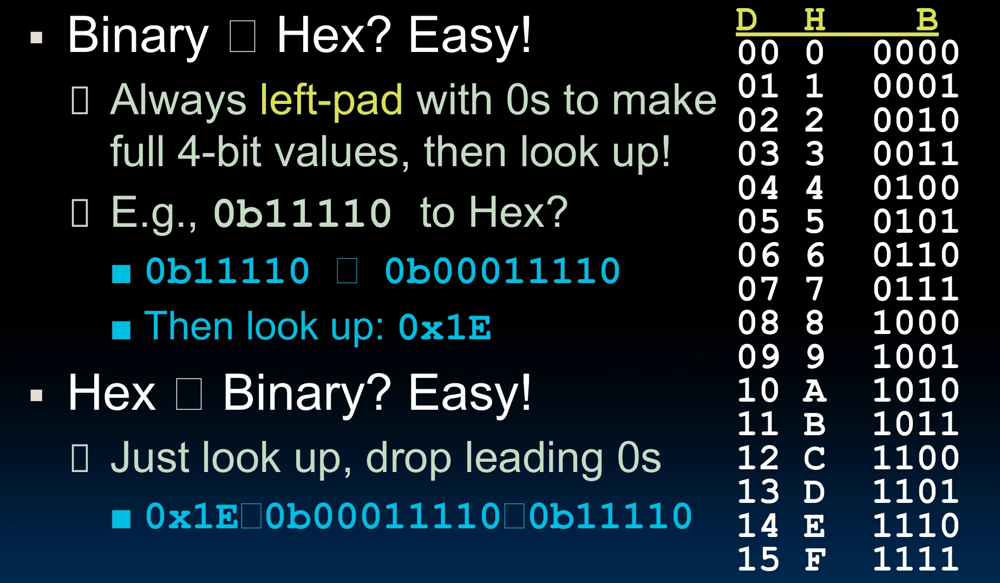

We called 4 bits a **nibble** and 8 bits a **byte**. A nibble is one hex digit, representing 16 things. A byte is 2, representing 256 things.

For the computer, numbers are alway binary. Hexadecimal is easier for human to see a long-string binary number. And decimal is just for our daily use.

### Number Representations

With the representations, we can do a lot of things to them. Add them, subtract them, multiply them, divide them, compare them, etc.

There is a infinity, a lot of 1s or 0s. Problem might come when result of these operation can't be represented by the same number of bits, we say it's **overflow**. This is serious.

Another big problem is how do we represent **negative numbers**?

Naive approach, we just use the first bit as the sign bit, 0 for positive, 1 for negative. We call it **Sign and Magnitude**.

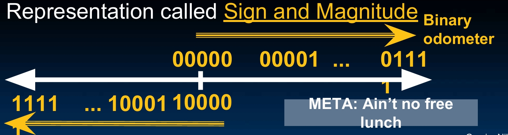

But this got problems, it's complicated to deal with it, you need to see the first bit to decide what way to use. Also, there are two 0s, +0 and -0.

And we now don't seem to count from small to big! You see the odometer goes two directions.

So we actually only use it in signal processors.

Another approach is **One's Complement**. We just flip all the bits when the number is negative. Turn the 1s into 0s, and 0s into 1s.

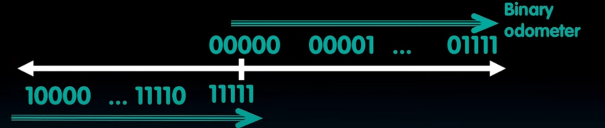

Only improment is now we finally got the right direction. But still complicated to deal with, still got two 0s.

This once used for a while, but no longer used now. We got this new much better approach, called **Two's Complement**.

We don't want all 1s to be zero, we want it to be -1. This is the big idea.

So when we see what it represents, we normally do the bit values times a power of 2 thing, but for the first digit, we times a minus power of 2.

For example, 1101.

$$1101_2 = (1 \times -2^3) + (1 \times 2^2) + (0 \times 2^1) + (1 \times 2^0) = -3$$

You can also see that in a different way, we can just flip all the bits and add 1. 1101 to 0010, and add 1 to get 0011, which is 3. So we have exactly -3.

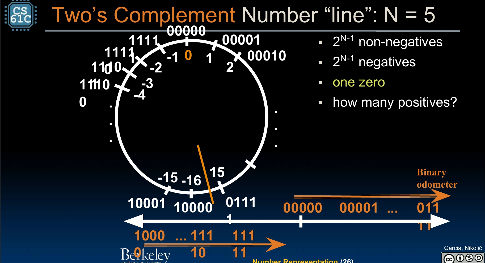

This is cool, no more two 0s. But there is still a strange thing happens when, like you go from 01111 to 10000, you suddenly go from 15 to -16, and then you get to 11110, 11111 which is -2, -1, and once again 00000 which is 0.

But could we not let this strange thing happen? Certainly, what we need is called **bias encoding**. This means we need to add a bias to the number. The strange thing still happens, but we can not let them happen near 0 if we want stuff to be cool near 0.

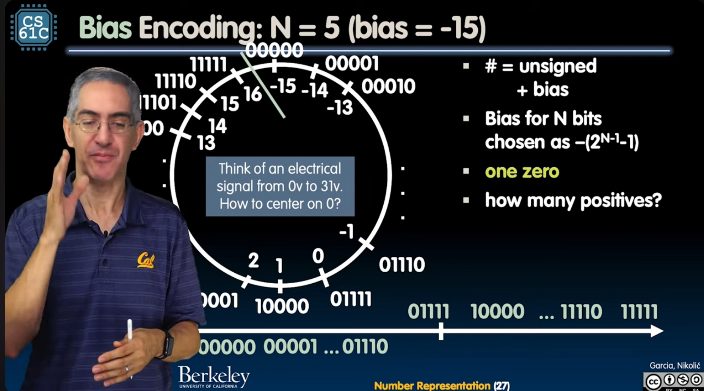

## Floating Point

### Fixed Point

So we have some ways to represent integers. With N bits, we can do unsigned integers from 0 to $2^N - 1$. We can do signed integers from $-2^{N-1}$ to $2^{N-1} - 1$.

However, we can't do very large number, nor very small number. We even can't do very simple fractional number like 1.5!

So we need some way to represent all these numbers, not just fixed number of integers.

Let's consider the fractions. In decimal world, we use decimal points to set the bounary between integer and fractional part. Can we do similar thing in binary?

This is a naive approach called **Fixed Point**. For example, for a 6-bits representation, we say the first 2 digits are the integer part, and the last 4 digits are the fractional part.

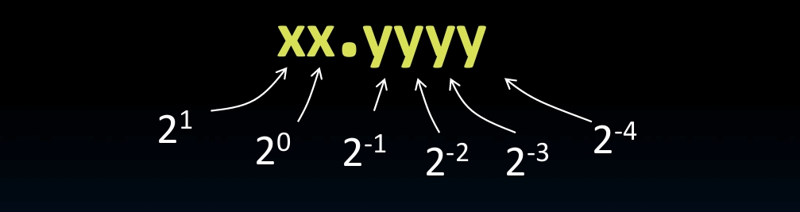

Then we can represent 2.625 as 10.1010.

$$2.625_{10} = (1 \times 2^1) + (0 \times 2^0) + (1 \times 2^{-1}) + (0 \times 2^{-2}) + (1 \times 2^{-3}) + (0 \times 2^{-4}) = 10.1010_2$$

But this can represent only from 0 to 3.9375. If you want to do larger numbers, you need to give more digits to integer part, then the precision will be lost. If you want to do more precise fractional numbers, you need to give more digits to fractional part, then the range of integer will be smaller.

### Floating Point

If we want to do very large numbers and very small numbers at the same time, the fixed point is not going to make it.

How do we improve? Well, since we don't want the point to be fixed, why not let it float?

I believe you have been to high school. Hope I am not wrong. You must have seen the scientific notation, in decimal of course. This is where our super smart idea comes from. We are going to do the same thing in binary.

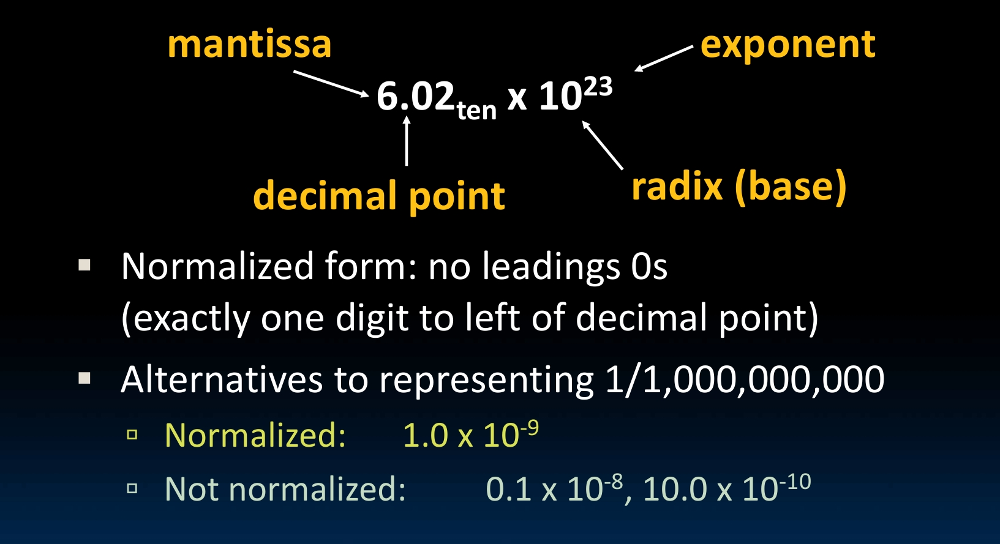

We have this mantissa (significand), the `6.02` in above picture. The decimal point is right there, always only one digit to left of it. And we have this radix (base) `10` for decimal. Also, we have a exponent `23` to tell us how many digits to shift the decimal point. So that we know it's actually `602000000000000000000000` in decimal.

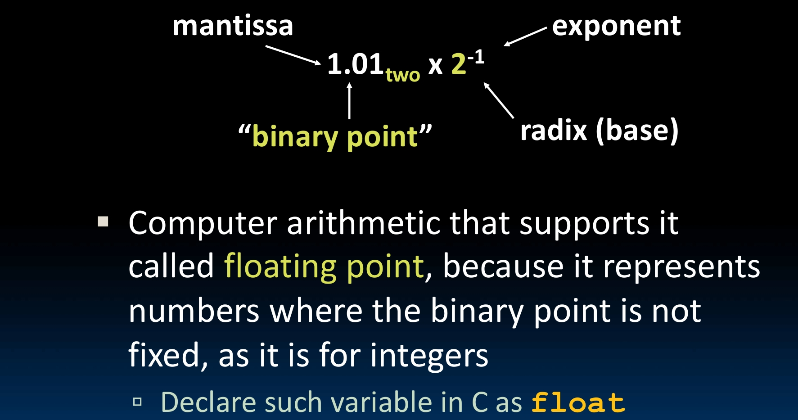

In binary, it's pretty similar. Just check the picture above. We have this $1.01_{2} \times 2^{-1}$, which is actually $0.101_{2}$. So

$$0.101_2 = (1 \times 2^{-1}) + (0 \times 2^{-2}) + (1 \times 2^{-3}) = 0.625_{10}$$

Computer arithmetit supports this is called **floating point**.

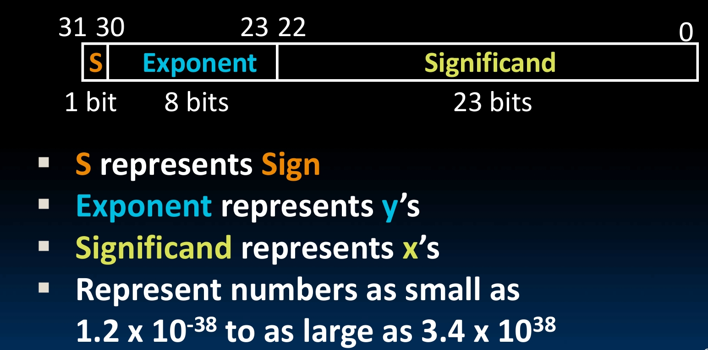

Now if we gave it 32 bits, which the first bit for the sign, then next 8 for the exponent, and the rest 23 bits for the significand, we can represent numbers from $1.2 \times 10^{-38}$ to $3.4 \times 10^{38}$. And their minus of course.

However, if the number is too large or too small, we will still have **overflow** or **underflow**.

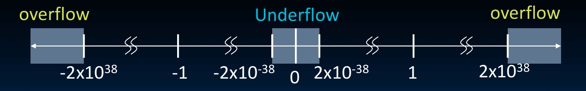

We must do something to deal with this, at least reduce the possibility.

### IEEE 754

To make all computers process the floating point numbers in the same way, we have a standard called **IEEE 754**.

The arrangement of 32 bits are just like what we talked above. One for the sign, 8 for the exponent, and 23 for the significand.

For the sign, 1 means negative, 0 means positive.

A interesting trick is, since in binary, the significand is always `1.xxxx`, we don't actually need to store the `1`, so we have one more bit to use! Just let the 1 be implicit.

Then the exponent, we have a problem with two's complement. You remember that count from binary odemeter 00...00 up to 11...11 goes from 0 to +Max to -Max to 0? Negative numbers are actually larger than positive numbers!

That's why we need to use the '**biased exponent**'. IEEE 754 uses 127 as the bias. We subtract 127 from the exponent field to get the real exponent value.

So we can get the real number in decimal by doing

$$(-1)^s \times (1 + significand) \times 2^{(exponent - 127)}$$

### Special Numbers

Firstly, infinity and negative infinity. When divide by 0, you should get infinity, not overflow.

We reserved the largest exponent for infinity, just all 1s. And the significand is all 0s. The sign bit would decide if it's positive or negative.

$$+\infty = 0 \ 11111111 \ 00000000000000000000000$$

$$-\infty = 1 \ 11111111 \ 00000000000000000000000$$

Furthermore, we must deal with zero. We reserve the smallest exponent for zero, just all 0s. And the significand is all 0s. For the sign bit, both valid. So there are two zeros, positive zero and negative zero.

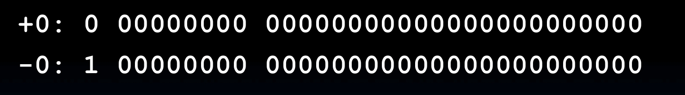

Sometimes people do stupid math with computers, like $\sqrt{-4.0}$ or $\frac{0}{0}$. At this point we should not get error either, so we need this **Not a Number (NaN)**. We reserve the largest exponent for NaN, just all 1s. And the significand can be anything nonzero.

Last problem, we found that there are gaps around 0. The smallest positive representable number is $1.0 \times 2^{-126}$.The second positive representable number is $1.00000001 \times 2^{-126} = 2^{-126} + 2^{-149}$. So the distance between them is $2^{-149}$, much smaller than the gap between 0 and the smallest positive number.

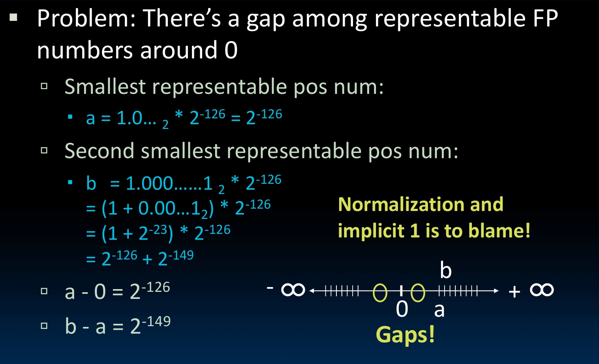

We reserve the smallest exponent for denormalized numbers, just all 0s. And the significand is anything nonzero.

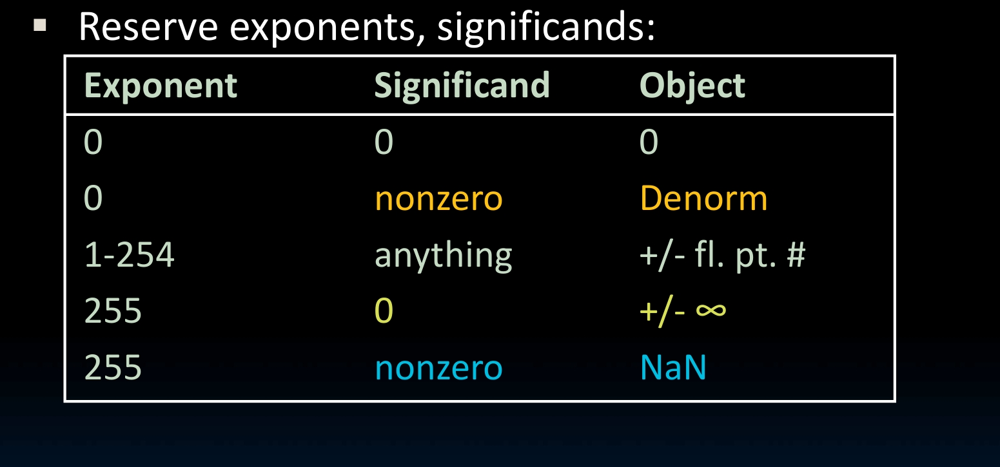
