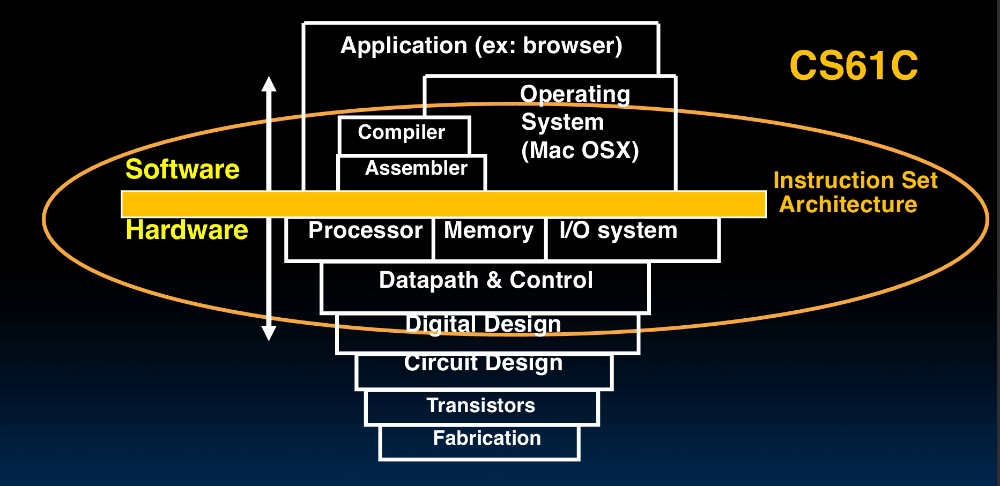
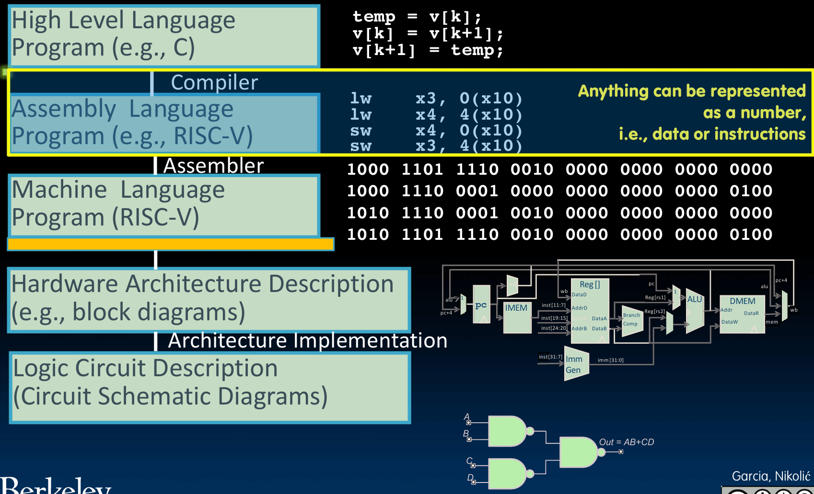
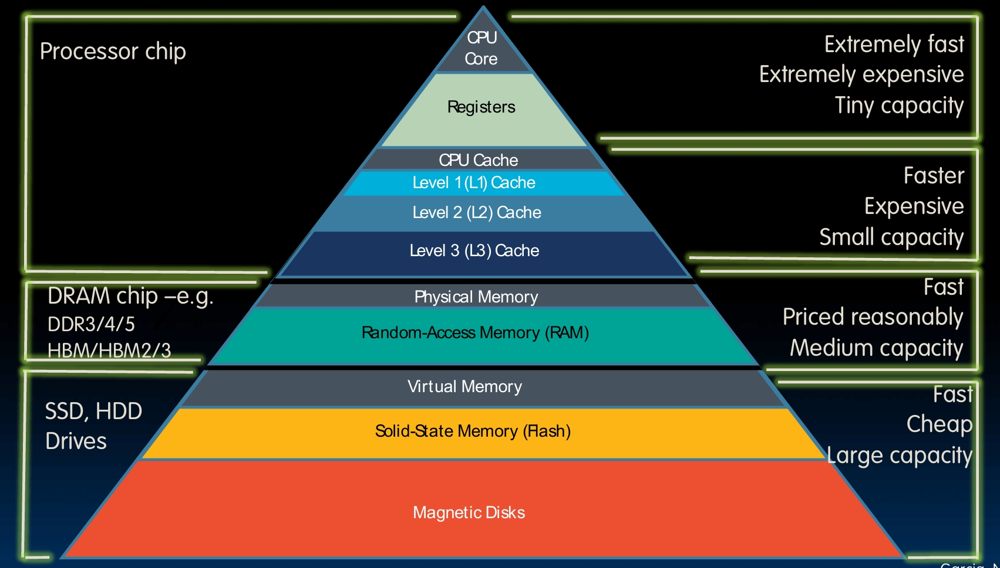

# Introduction and Data Representation

I learn this from these lectures:

[Lec1](https://www.learncs.site/resource/cs61c/lectures/lec01.pdf)
[Lec2](https://www.learncs.site/resource/cs61c/lectures/lec02.pdf)
[Lec6](https://www.learncs.site/resource/cs61c/lectures/lec06.pdf)

All the pictures are from the slides.

## Introduction

This is a course about the hardware-software interface. Or we can just say, what a programmer needs to know to let its program use the hardware the most efficiently.

I am going to let you know about everything from the digital logic to the operation system you are using.

You can see that the machine structure is layers and layers, from the hardware stuffs to the software stuffs. Our course is going to focus on how the software and hardware interact with each other, which is the middle part of the picture above. We have operation system, compiler and assembler in the software side, and we have processor, memory, I/O system, datapath & control and digital design in the hareware part. They use this instruction set architecture to interact with each other.

In the passed few decades, a lot of smart people come up with a lot of great ideas so that we can make this.

**Abstraction** is definitely one. When a system comes to very complicated, nobody can and want to understand every detail. So we make it layers, each layer provide a simplified service for upper layer to use, which the upper layer don't need to know how it's implemented.

You see you write some C language code, pretty readable. The this guy called compiler suddenly turn it into assembly language, has data and instruction, not that readable by human, but everything can be represented as a number. So that this guy called assembler can turn it into a bunch of 0s and 1s. And finally the machine can read, the hardware can work on it. This is a kind of abstraction, you write your very readable code, no need to deal with instructions, binary code and stuff.

Another great is the **Moore's Law**. A guy probably named Moore said that there would be two times of transistors per chip every two years. So that no need for architecture creation, we can just wait for more cheap, small and fast computers.

However, the speed is slow down these years though it works fine the first 50 years, so we might still need to create something new.

**Principle of Locality and Memory Hierarchy** is also very great idea. The problem is that the data is too far, cpu runs fast but it takes a lot of time to get to the data. Regard the CPU as your mind, the register is right in your mind, but go to the memory is like going to another city, go to the disk is like going to Pluto or something like that. Imagine that!

We can improve this through the principle of locality, which tells us that the CPU usually duplicately goes to recently used data, or goes to the data that near the recently used data. The solution is to automatically load these data to somewhere closer to the CPU, so that the CPU can get to the data faster.

We need a memory hierarchy to do this, at top are registers and cache which are very fast but small, at bottom are disk which is big but slow.

**Parallelism** is also a great idea of course. It's basiclally just let more people do the job together, since the single person can't do the job faster. Parallelism is everywhere in the computer, instruction level parallelism, data level parallelism, thread level parallelism, etc.

To be clear, it's not like you can keep doing this and make things faster and faster. The limit is about those things that must be done by one person. This is the Amdahl's Law.

Next one great idea is the **Performance Measurement and Improvement**. We need to know how to measure the performance of a computer, and how to improve it. Basically just latency and throughput.

The last one is **Dependability via Redundancy**. Things can be broken suddenly, so we might put some extra ones there in case.

## Number Representation

All the tasks that we want the computer to do is basically analog this world. And we've talked about the abstraction, finally the hardware is dealing with those 1s and 0s, so we need to turn everything into numbers, binary numbers to be specific.

Bits are digits, each has two possibility, 1 and 0. The big idea is that bits can represent anything.

You have 26 letters to represent? If you got 4 bits, you can represent $2^4 = 16$ different things, which is not enough. But if you got 5 bits, you can represent $2^5 = 32$ different things, which is enough.

ASCII use 7 bits to represent all the letters, upper or lower case, and all the punctuation. Unicode use 8, 16 or 32 bits to cover all the languages in the world.

Anyway, for N bits you got at most $2^N$ different things can be represented, so you can represent anything, color, logical values, etc.

### Binary, Decimal and Hex

What we use every day is called decimal, 