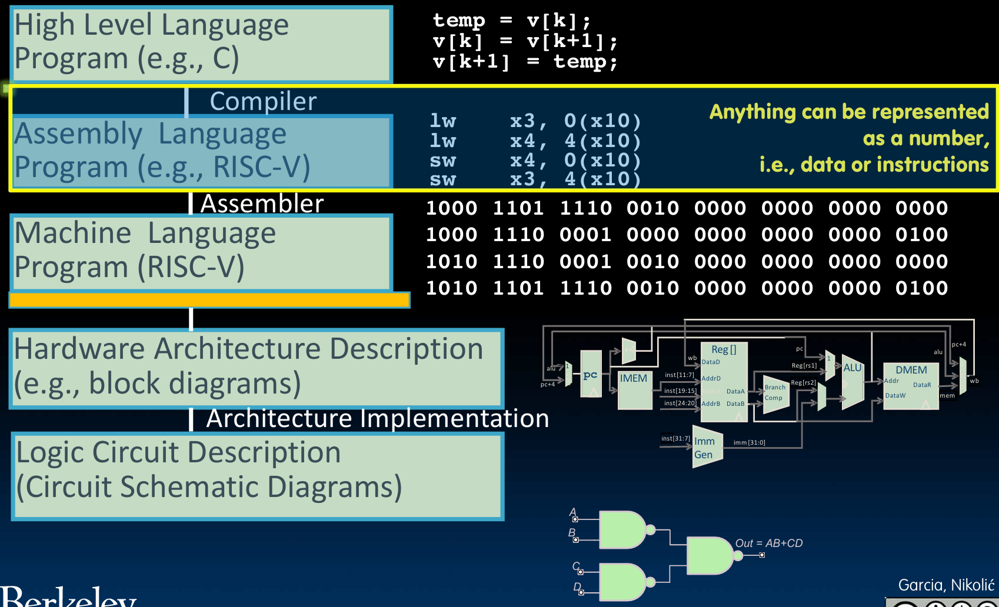

# Number Representation

I write this note based on the slide from UCB CS61C:

[Lec2](https://www.learncs.site/resource/cs61c/lectures/lec01.pdf)
(Not official link, the official one can't be accessed outside of UCB now.)

## Number is everything

Let's first see this picture, basically about the levels of representation and interpretation, which is super important.

You can see how our C, Java or Python code are executed. There is this compiler, which compile our code into assemply language, and then the assembler, which translate the assembly language into machine language, which is the language that the computer can understand.

To be specific, high level languages are translated into assembly language, which have instructions and data. Then the assembler translate it into machine language, which have only 0 and 1.

So after all, the number is everything.
Actually, a '0' or a '1' is a 'bit' in the memory of the computer.
So we can also say bits are everything.

## How many bits do we need?

What do we need to represent probably?
Let's start with characters in English.
I believe there are 26 of them, that means need to be able to have at least 26 different cases.
If we got 4 bits, there are $2^4=16$ different cases, which is not enough.
However, if we got 5 bits, there are $2^5=32$ different cases.
