# Pipelining

I learn this from these lectures:

[Lec21](https://www.learncs.site/resource/cs61c/lectures/lec21.pdf)  
[Lec22](https://www.learncs.site/resource/cs61c/lectures/lec22.pdf)  
[Lec23](https://www.learncs.site/resource/cs61c/lectures/lec23.pdf)

All the pictures are from the slides.

## Motivation: the Performance

I believe the previous note has given you a great understanding of a single-cycle CPU. At the end, we talked a little about the performance of that. The `lw` instruction requires the most time, which is about 800ps. So one clock cycle must be at least 800ps, which means the frequency can only be at most 1.25GHz. In plain English, one instruction per 800ps.

The big question, which push our human kind forward and forward, is whether we can do this better.

But to answer whether we can or not, first we need to make it clear that, what do you mean by better?

I mean, sports car is faster than bus, but a bus carries much more people. If you want one car to get some place faster, sports car is better. But if you want to carry a lot of people to some place faster, bus might be better.

I believe you got my point. For a CPU performance, do we mean running one instruction in less time? Or do we mean running more instructions in the same time? Or something else?

Basically, we consider three things: the **Latency**, the **Throughput**, and the **Energy Efficiency**.

### Iron Law

We have this Iron Law of Processor Performance:

$$
\frac{\text{Time}}{\text{Program}} =
\frac{\text{Instructions}}{\text{Program}} \times
\frac{\text{Cycles}}{\text{Instruction}} \times
\frac{\text{Time}}{\text{Cycle}}
$$

First, about the instructions per program, it has nothing to do with the processor. Right? It might be determined by the task, the algorithm, the ISA and stuff. So, pass.

The next two parts, the cycles per instruction (average by the way) and the time per cycle, are both related to the processor implementation. So I guess they are more what the performance about.

### Energy Efficiency

For a long time, people are working on the time per cycle. Or in plain English, the frequency.

However, the increasing frequency is not free. It always means more energy consumption. And that is the problem.

You see, there is something called **Power Wall**. It means if there's too much energy consumption, the temperature will be too high, and the chip will be damaged.

$$
\frac{\text{Energy}}{\text{Program}}
= \frac{\text{Instructions}}{\text{Program}}
\times \frac{\text{Energy}}{\text{Instruction}}
$$

$$
\frac{\text{Energy}}{\text{Program}}
\propto \frac{\text{Instructions}}{\text{Program}} \times C V^2
$$

The energy efficiency is basically determined by the Capacitance and the Voltage.

So as the frequency getting higher, we need to reduce either or both of them to maintain the energy consumption under the Power Wall.

About the capacitance, you have known it, the Moore's Law. Smaller the transistor, smaller the capacitance. However, the problem is at some point, the transistor can hardly get smaller.

And the voltage, is also hitting a point where it can hardly get lower. Lower would cause some problems.

You can see clearly in the above chart that though the transistors are still getting more and more, the frequency and the typical power is slower down or even not increasing.

It's the end of an era. The reducing time per cycle stuff won't work anymore.

What we should now work on is the cycles per instruction. Or should I say, the CPI? I believe some economic people use that too, I don't know what that is, but probably not the same thing.

### Intro to Pipelining

So we can't do every single thing faster, then what? Can we do a lot of things at the same time? Just like the bus, huh?

Let's use another metaphor to understand the big idea of pipelining. Doing laundry.

Long, long ago, people do laundry in 4 steps. The wash, the dry, the fold, and the put away. That was a pretty strange era, since every step takes exactly 30 minutes, no matter who or how you do that.

By the way, it was also an era that people are very poor. There are only one washer, one dryer, one 'folder' and one 'stasher'.

One special night that you can't see the sun, four people want to do their laundry.

How would they do? Well, let's see the stupid way first.

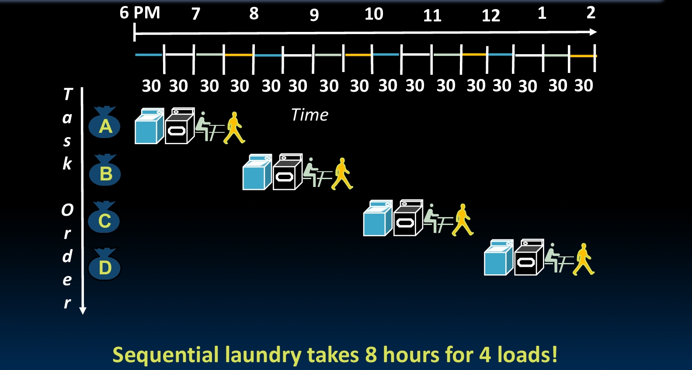

They do that sequentially, which means one person start the first step after the previous one finished the last step.

It takes 8 hours in total.

What? People can't be that stupid, right? So this must be a fake story.

But think, what is the most clever way to do this? So that four people can all finish in the shortest time.

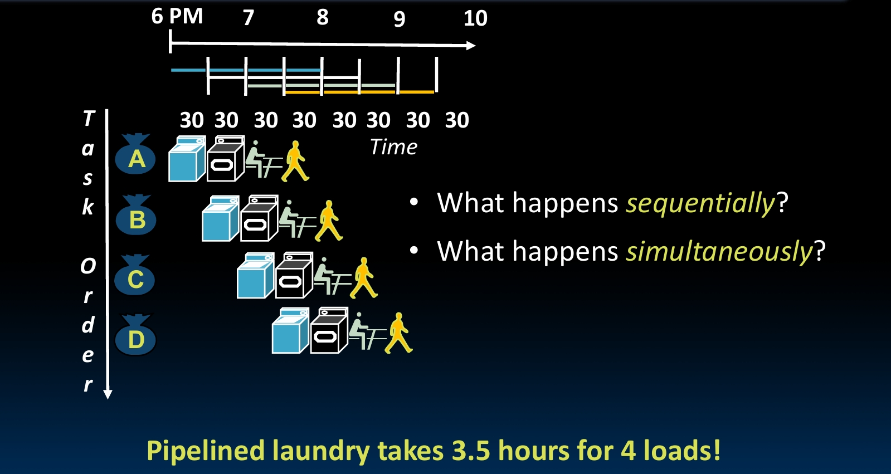

Certainly, you should let the second person use the washer, right after the first one finished it and start using the dryer. Once someone move on, the next one go for it.

When A finishes dryer, goes to the folder. B goes to the dryer from the washer. And C starts using the washer. Just like this.

In this way, people can finish in 3.5 hours!

And that, is what I mean by pipelining. Pipelining has nothing to do with the latency, but the throughput. You still do every single thing with the same time, but in the same time you can do much more things.

## Implementing Pipeline

### Pipelinging RISC-V

Okay, no more metaphor. Let's see what really means by pipelining in RISC-V.

So what we already have, the single-cycle CPU, is 'sequential'.

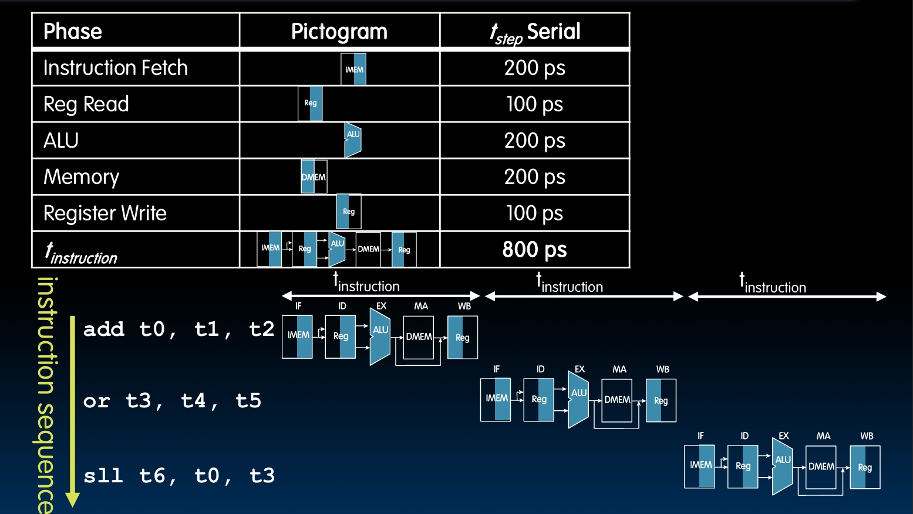

It's pretty clear, instruction by instruction, and one instruction per cycle. This is slow.

Just like the laundry has 4 steps, we have the 5 stages in runing a RISC-V instruction. IF, ID, EX, MEM, WB, see previous notes for the detail.

Anyway, can't we do the same thing? After running the IF of one instruction, we can run the ID of it and the IF of the next instruction at the same time!

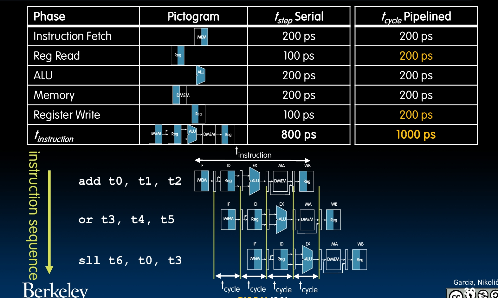

Since the stages each takes at most 200ps, that would be the new time per cycle. Now running a instruction takes 1000ps, which is slower then before. But if we run a lot of instructions at the same time, it would be fast as fuck!

The frequency is now 5GHz, the relative speed is 4 times of before.

### Pipelining Datapath

So how exactly do we make it?

Let me first remind you the datapath.

And we partition the datapath into 5 stages.

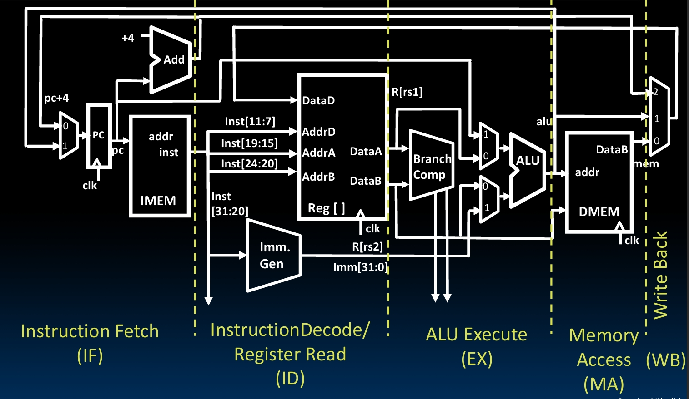

To make this pipelining thing work, we change it into this.

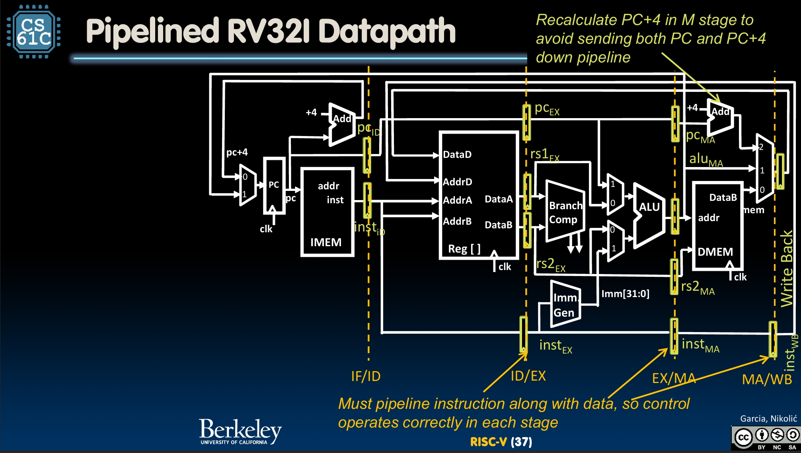

First, there is a big difference from the single-cycle CPU. At the stage that need to use the `PC+4`, like M, the PC may have been recalculated for a few times. So you might need to send both PC and PC+4 down pipeline. Here we do a little change to avoid this, which is adding an adder in MEM stage to recalculate the PC+4.

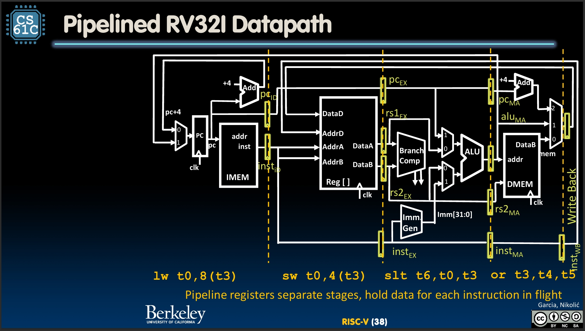

We add a lot of things at the edges between the stages. Those things are **pipelined registers**, used to store the data of each instruction that needs to move to the next stage.

And there are also some pipelined registers are used to pipeline instructions, so control operates correctly in each stage.

Now, different stages run different instructions at the same time!

About the Control, the see the instruction and give the control signals are not changed. Just the information is stored in pipeline registers for later stages to use.

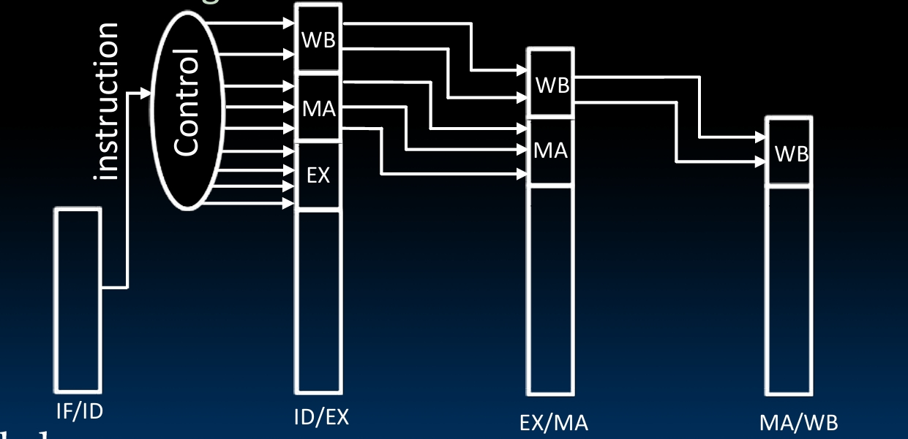

## Pipeline Hazards

Those things above do sounds simple and elegant, but it actually got us into a lot of trouble. We call them **Pipeline Hazards**, which means situations that prevents starting the next instruction in the next clock cycle.

When we run two instructions at the same time, they might require the same resource, like the same memory or register. This is what we called **Structural Hazard**.

There might be data dependency between instructions, like this one can be run only when the previous one finished its read/write or something. This is what we called **Data Hazard**.

Sometimes, even what is the next instruction depends on the result of the previous one, like branch, jump, or something. This is what we called **Control Hazard**.

To make our sweet pipelining really work, we got to nail them so good one by one.

### Structural Hazards

So our problem is, there may be two or more instructions in the pipeline compete for access to a single physical resource.

Logically, there are only two solutions. Either we let them use it in turn, that means some of them got to wait in line, or we add more resources.

Make people wait in line is obviously against our big pipelining dream. So we almost always try to add things, and you can always solve problems by that.

One important structural hazard is the **regfile structual hazard**. When someone is doing the ID stage, it might need to read up to two operands. And when someone is doing the WB stage, it might need to write one value.

To make these can be done at the same time, we add seperate 'ports' to the regfile. Three accesses can happen simultaneously.

Besides this, **memory access** is also a big one. It's possible that one is doing IF when another is doing MEM.

So we make the memory of instructions and data separate. We already did it when we made the datapath, remember? IMEM and DMEM.

But in real life they are kind of in the same memory. So what we really do is, we have two seperate caches in the CPU, the instruction cache and data cache.

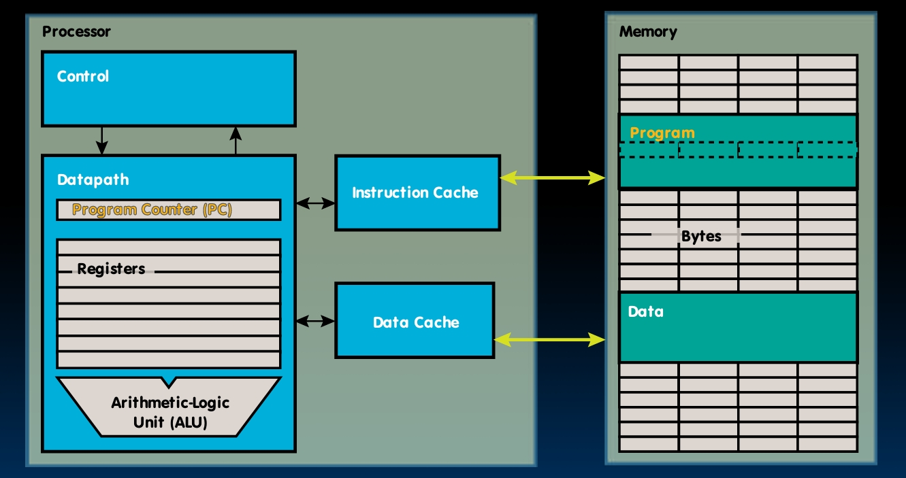

### Data Hazards

We used separete ports on regfile so that two instructions can read/write at the same time. But there could still be problem.

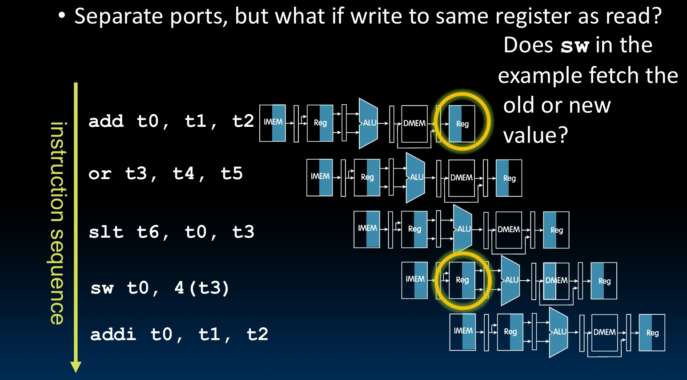

See this for an example. This `add` is during its WB stage, while at the same time, this `sw` is during its ID stage. So if write to same register as read, does this `sw` fetch the old or new value?

You know since that `add` is executed earlier, people write this program must expect the `sw` to fetch the value that had been changed by the `add`. We must ensure this, so that our big pipelining thing could work.

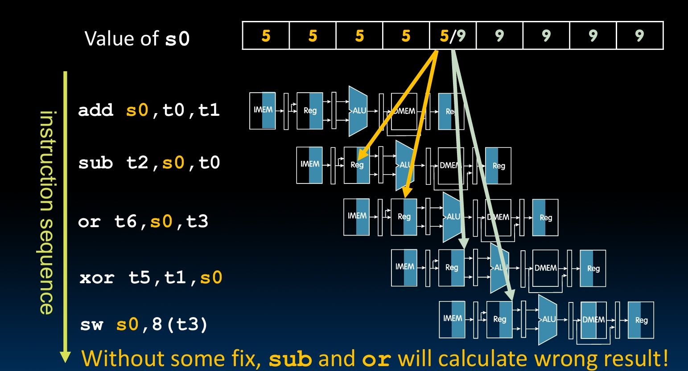

See this as another example. This is an ALU, and you see the `add` will update the value of register `s0`. And then, `sub`, `or` and `xor` will use this `s0` as the operand.

However, with this origin naive pipeline, the `sub` and `or` will be already done ID stage before `add` actually doing its WB stage. So if we don't fix it, those two baby are gonna get wrong, and the whole program will work like shit.

So, what is our big solution?

A naive solution is **stalling**, which is adding some 'bubble' instructions. So that we can make the instruction that requires updated data be executed after the data is updated.

These instructions means nothing or would not make any real difference, like `addi x0, x0, 0`.

So the compiler will do this job, reading the program and detect these data dependencies, and insert these bubbles.

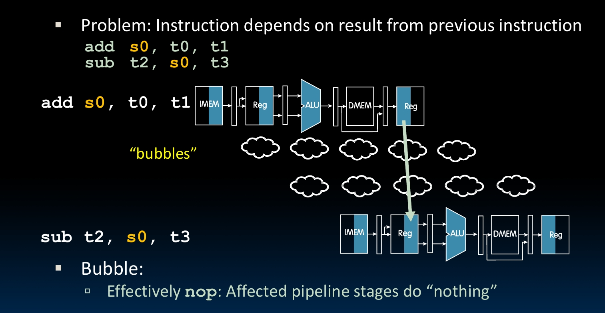

This can guarantee correct result, if you do the insertion well. But, it sacrifices the performance. That is bad, right?

So what is the real good solution, the one that real smart people like me would do?

Well, the big problem is, though the result has been calculated, it is not yet write back. So during this period, we can do no shits.

Then what if, we cheat a little bit, not wait until the result is write back, but use it immediately? What if, right after the calculation has been done, we just stole it anyway?

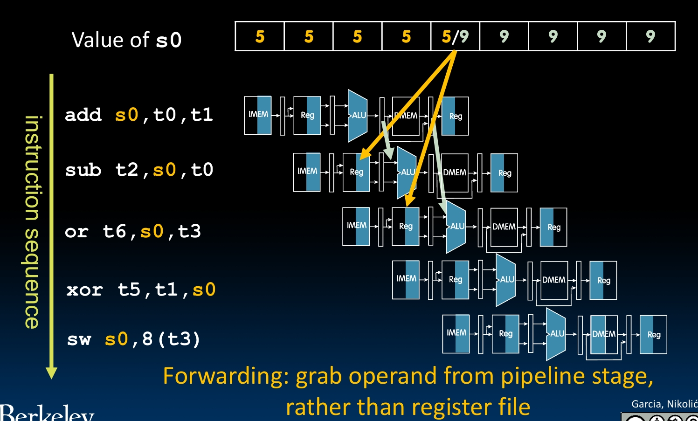

So here you are the real big solution, the **Forwarding**, or **Bypassing**. What you need is only a few more datapath connections.

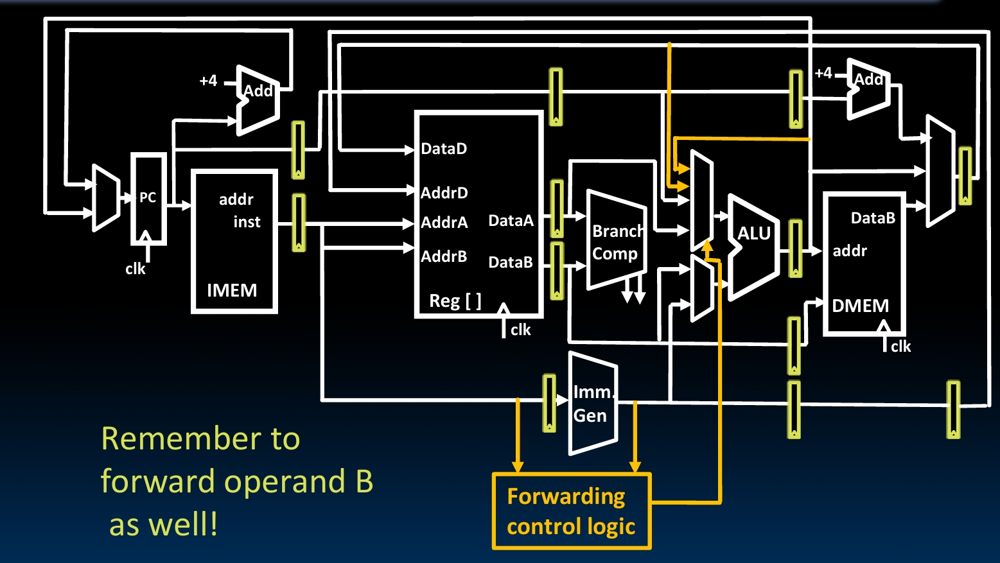

See, there are these two new paths to stole the ALU result and the MEM result. And by the way, there are this forwarding control logic to send a signal to the MUX before ALU to tell whether forwarding or not.

However, forwarding itself can actually not solve all the problems. There is this special case, the **Load Data Hazard**.

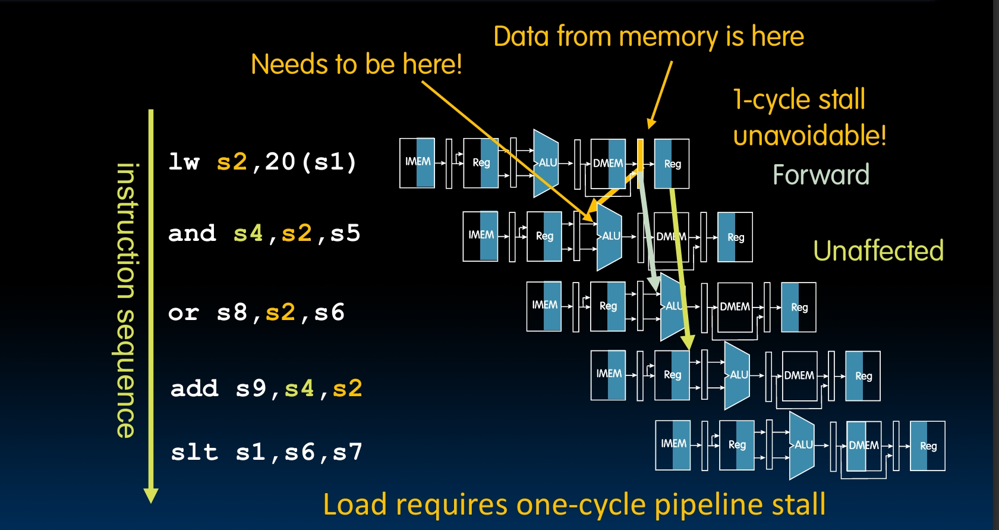

For other instructions, you get the result from the EX stage, and the next instruction probably actually use the new data to do calculation in EX stage. So, you can stole it right after the last instruction's EX stage and do yours.

But if it's the `lw` instruction, you get the data in your MEM stage, out of DMEM. At that time, the next instruction would be already done its EX stage, so too late.

Therefore, when it's loading, there is one clock cycle unavoidable stall.

So there would be a slot, we call it **load delay slot**. That is ugly, bad for performance.

Fun idea, let the compiler do its best to do some reorder, try fill that stupid slot with some other instructions. If this instruction has nothing to do with the data, and won't cause some other problem, then it's a good idea.

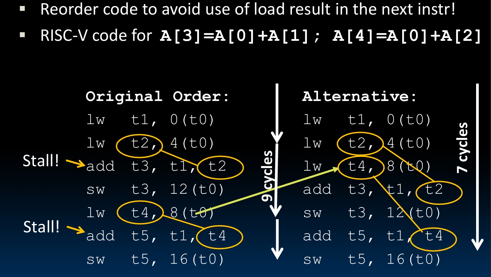

### Control Hazards

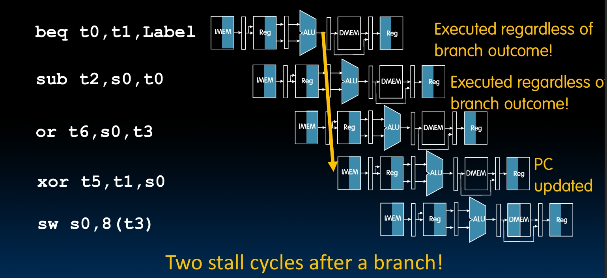

So the problems are caused by the branch instructions or shit. Like this `beq` above.

At the EX stage, the decision of whether the branch or jump is taken is made. However, at that time, the pipeline have already do two more instruction fetching in order.

Well, if the branch or jump is not taken, then this is certainly correct. But if it is taken, then we are in big trouble.

We would have to flush these wrong instructions by converting to nops. So every taken branch cause two dead cycles, big waste!

Our solution is, guess? Yes, guess. What do you mean what do I mean? I mean guess. Oh, you were guessing. No, I mean the solution is guessing.

So we got to do this **'branch prediction'**, guessing whether the branch is taken or not. If we doing good, we can reduce the dead cycles happening.

You can always guess one choice, or use some complex algorithm to guess due to branching history. Anyway, even fifty fifty is better than always two dead cycles.

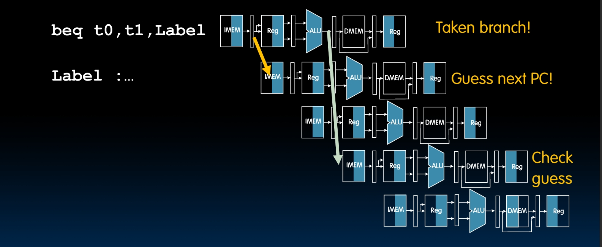

## Summary

We use pipeline to improve the performance of the single-cycle CPU. And we fix all the hazards to make it really work.

Wow, it was cool to so calmly say that.
