# RISC-V I: Basics & Control Flow

I learn this from these lectures:

[Lec7](https://www.learncs.site/resource/cs61c/lectures/lec07.pdf)
[Lec8](https://www.learncs.site/resource/cs61c/lectures/lec08.pdf)
[Lec9](https://www.learncs.site/resource/cs61c/lectures/lec09.pdf)
[Lec10](https://www.learncs.site/resource/cs61c/lectures/lec10.pdf)

All the pictures are from the slides.

## Intro

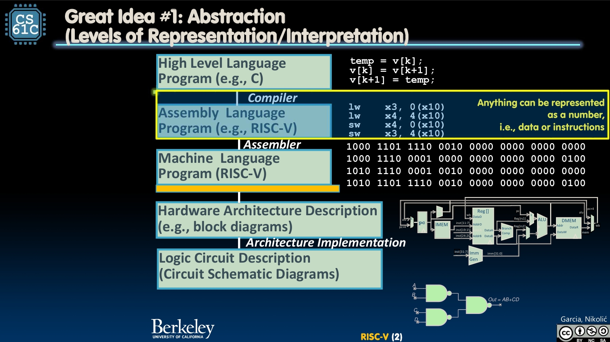

You remember the abstraction? On the top is the high level language program such as C, which we talked about a lot in the previous note. But though C is a programming language that is very close to the hardware, it is still more for humans mindset and quite far from the machine mindset. So the compiler doesn't compile it right into 1s and 0s. Instead, it compiles it into **assembly language**, which is easier for the machine to understand. After that, we have the assembler to actually turn it into the machine language program.

So what CPU does is actually executing a lot of **instructions**, which are basically verbs of assembly language. And different CPUs have different instructions, for a certain CPU, we can say there is a certain **Instruction Set Architecture (ISA)**.

We have ARM for most cell phones, and Intel x86, IBM Power, IBM/Motorola PowerPC, MIPS, etc. Today we are going to use **RISC-V** to learn about this topic.

In the earlier years, actually, people tend to make these ISAs as complex as possible. There were even some instructions to do things like multiply polynomials. But soon some smart feels that we might want to kind of making it easier, just some simple instructions and do complex stuff by combining them. So they invented the **Reduced Instruction Set Computer (RISC)** architecture, which already beat the **Complex Instruction Set Computer (CISC)** for a long time.

## Registers

So to represent these instructions, we use the assembly language. Every line of assembly language contains exactly one instruction.

The problem is, to make hardware simple, we won't let the assembly language use variables like C. Instead, it can only apply the instructions to stuffs in the **registers**. For stuffs I actually mean operands.

Registers are just right in the processor, so that it will be fast as fuck.

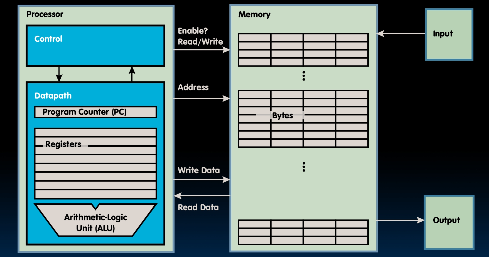

You remember the memory hierarchy?

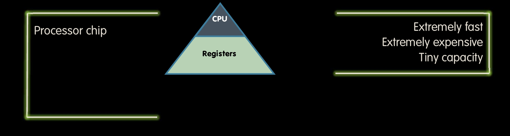

It is on the top, right under the CPU.

Of course, there is also a flaw which is that it has fixed number of registers since it's in the hardware. For RISC-V, it has **32 registers**. Assembly language code must be very carefully put together to use them efficiently.

For RV32, each register is 32 bits wide, so we call it a word.

Registers are numbered from 0 to 31, the `x0, x1, ..., x31`. But we can actually only change the value of 31 of them, the `x0` is always 0, fixed. You will see this is smart.

By the way, assembly language got no types. And you can use `#` to comment out the line.

## Add and Sub

Okay, wtf, there's no reason to hit me. Though I know I have let you wait up enough. I am giving you the instructions and code now.

You will love this, the syntax of assembly language, it's so simple that perfect for your brain to understand.

Only four things.

```
add x1, x2, x3
```

The first shit is the operation, or the instruction, whatever, such as `add`. Then it's the result register, `x1`, where it goes after the operation. Then it's the two operands, `x2` and `x3`, where it gets the operands from.

So do the addition is like

```
add x1, x2, x3
```

If `x1 for a, x2 for b, x3 for c`. In C, it's `a = b + c`.

And the subtraction is like

```
sub x1, x2, x3
```

If `x1 for d, x2 for e, x3 for f`. In C, it's `d = e - f`.

I have told you that by combining these easy stuffs we can do complex stuffs.

Try the `a = b + c + d - e;` as an example.

```
add x10, x1, x2
add x10, x10, x3
sub x10, x10, x4
```

Try another, `f = (g + h) - (i + j);`

```
add x5, x20, x21
add x6, x22, x23
sub x19, x5, x6
```

By the way, there are immediates. For example, in C, you might do `f = g + 10`. We have an `addi` instruction to do this.

```
addi x1, x2, 10
```

But notice, there is no `subi`, since we must make it as simple as possible. The `addi` can already do the job, so we say fuck it `subi` go away.

```
addi x1, x2, -10
```

And the zero register, almost forgotten. Very useful, because a lot of `f = g` sort of stuffs in C code.

```
add x1, x2, x0
```

would be convenience.

Since it's set to zero in hardware, I know you try very hard but you mean to not be able to change it. Shits like

```
add x0, x1, x2
```

does nothing, don't do that, makes you even look more like a fool.

## Store and Load

What we got so far is

- **Addition/subtraction**
  - `add rd, rs1, rs2`
    - `R[rd] = R[rs1] + R[rs2]`
  - `sub rd, rs1, rs2`
    - `R[rd] = R[rs1] - R[rs2]`
- **Add immediate**
  - `addi rd, rs1, imm`
    - `R[rd] = R[rs1] + imm`

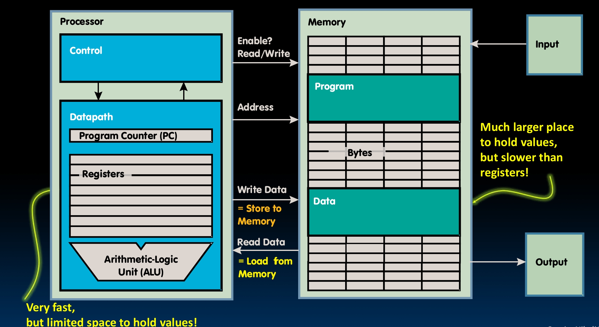

Let's go back to this picture. You see we can do a lot of shits with registers and those instructions inside the processor. But we talked about this, the registers are of fixed number. So we kind of need to load data from the memory and store it back after using. There, the memory, got much larger space to hold values, but very slow though.

Since data is typically smaller than 32 bits, but rarely smaller than 8 bits. So the memory addresses are actually in bytes, not words.

We have the big-endian and little-endian. Which means the order to outline the bytes in a word. For big-endian, the least significant byte is the first one, `BYTE0, BYTE1, BYTE2, BYTE3`. For little-endian, the least significant byte gets the smallest address, `BYTE3, BYTE2, BYTE1, BYTE0`.

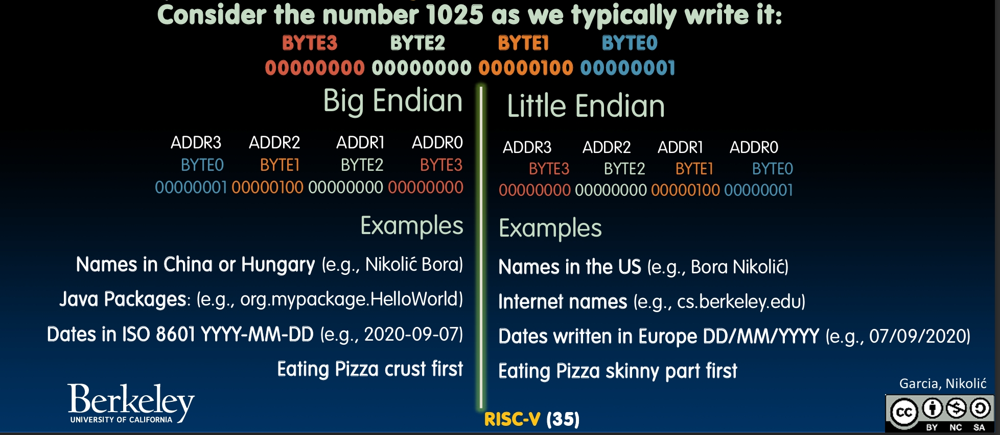

But it's all about the bytes, bits in the byte are always stored normally.

So in the memory, we actually use the little-endian convention.

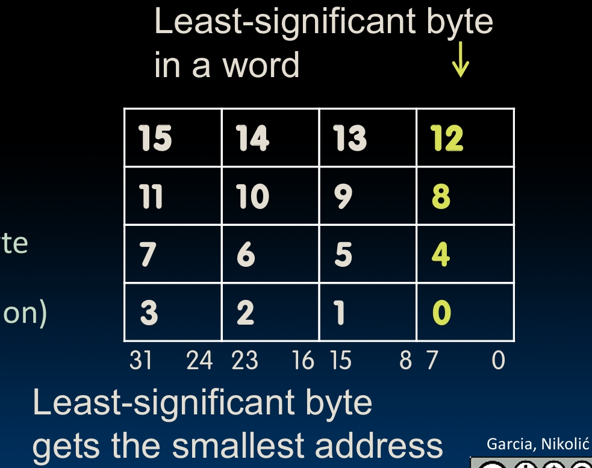

The least-significant byte gets the smallest address, right at the rightmost.

So the memory, how slow would it be? Actually, about 50-500 times slower than the registers.

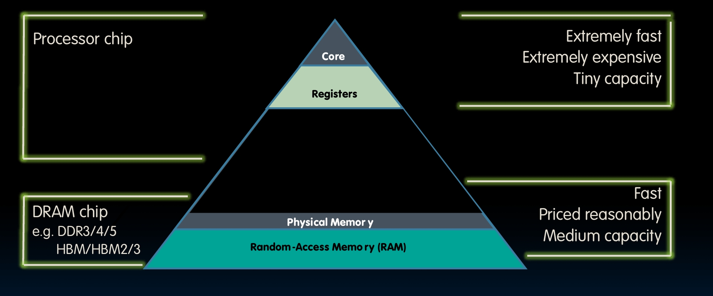

Anyway, it's large, most of our stuffs are there. We got to do the transfer.

Now we wanna run this C code

```c
int A[100];
g = h + A[3];
```

We need to get the value of `A[3]` into something like `x10`. Let's say we got a `x15`, which is a base register, or a pointer to `A[0]`.

In RISC-V, we do

```
lw x10, 12(x15)   # Reg x10 gets A[3]
add x11, x12, x10 # g = h + A[3]
```

You see we do `12(x15)`, the offset must be known at assembly time.

If we do this C code

```c
int A[100];
A[10] = h + A[3];
```

Now you got to store shits back to the memory, since you are changing the value of `A[10]`.

We do

```
lw x10, 12(x15)   # Temp reg x10 gets A[3]
add x10, x12, x10 # Temp reg x10 gets h + A[3]
sw x10, 40(x15)   # A[10] = h + A[3]
```

Same as the 12, the 40 is also offset in bytes. Things like `x15 + 12` or `x15 + 40` got to be multiples of 4.

No need to guess, lw and sw stand for 'load word' and 'store word'. Actually we also got **lb** and **sb** for 'load byte' and 'store byte'.

```
lb x10, 3(x11)
```

Contents of memory location with `address = sum of '3' + contents of register x11` is copied to the low byte position of register x10.

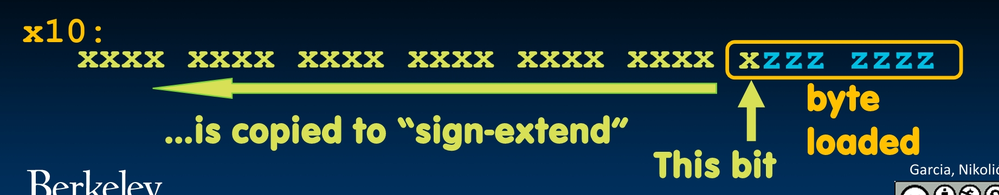

Notice that the rest of bits are 'sign-extend'ed, which means fill all of them with the first bit of the loaded byte.

We got a **lbu (load byte unsigned)** to just do zero extend. No sbu, you must know why. You just copy the part to the memory, there's no filling job.

So what we got so far is

- **Addition/subtraction**
  - `add rd, rs1, rs2`
  - `sub rd, rs1, rs2`
- **Add immediate**
  - `addi rd, rs1, imm`
- **Load/store**
  - `lw rd, rs1, imm`
  - `lb rd, rs1, imm`
  - `lbu rd, rs1, imm`
  - `sw rs1, rs2, imm`
  - `sb rs1, rs2, imm`

## Decision Making

So what do we have in C that we can still not do? Those `if-else` stuff, or shits called loops like `for` and `while`.

So the if statement instruction is

```
beq reg1, reg2, L1
```

means go to statement `L1` if  
`(value in reg1) == (value in reg2)`.

Otherwise, go to the next statement.

`beq` stands for 'branch if equal', while there is also `bne` for 'branch if not equal'. For branches, we have also branch if less than (**blt**) and branch if greater than or equal to (**bge**). Also, we got their unsigned versions, **bltu** and **bgeu**.

And the unconditional branch is `jump (j)`, which means go right to the statement.

Let's see some examples.

The translation is here:

f - x10, g - x11, h - x12, i - x13, j - x14

Now we compile this `if` block.

```c
if (i == j) {
  f = g + h;
}
```

In RISC-V, it's

```
    bne x13, x14, Exit
    add x10, x11, x12
Exit:
```

And we compile this `if-else` block.

```c
if (i == j) {
  f = g + h;
} else {
  f = g - h;
}
```

In RISC-V, it's

```
    bne x13, x14, Else
    add x10, x11, x12
    j Exit
Else:
    sub x10, x11, x12
Exit:
```

And we can do loops. See this picture below for an example.

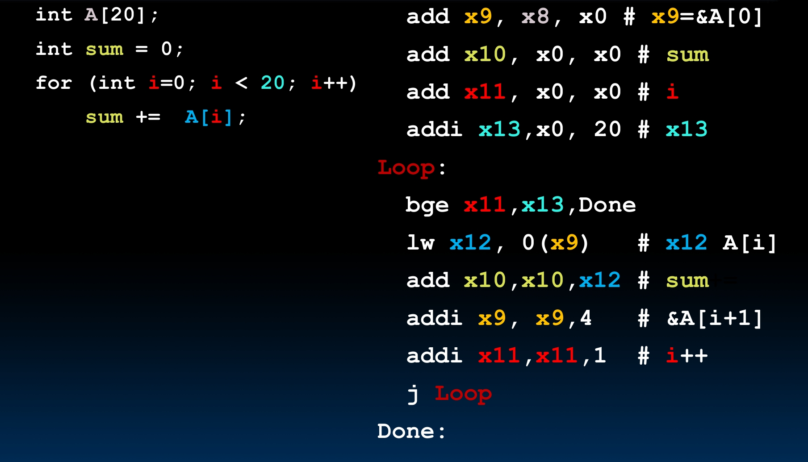

So what we got so far is

- **Add/sub**
  - `add rd, rs1, rs2`
  - `sub rd, rs1, rs2`
- **Add immediate**
  - `addi rd, rs1, imm`
- **Load/store**
  - `lw rd, rs1, imm`
  - `lb rd, rs1, imm`
  - `lbu rd, rs1, imm`
  - `sw rs1, rs2, imm`
  - `sb rs1, rs2, imm`
- **Branching**
  - `beq rs1, rs2, Label`
  - `bne rs1, rs2, Label`
  - `bge rs1, rs2, Label`
  - `blt rs1, rs2, Label`
  - `bgeu rs1, rs2, Label`
  - `bltu rs1, rs2, Label`
  - `j Label`

## Logical Instructions

Sometimes we kind of need to operate on fields of bits within a word. So we need operations to pack or unpack bits into words, which is logical operations.

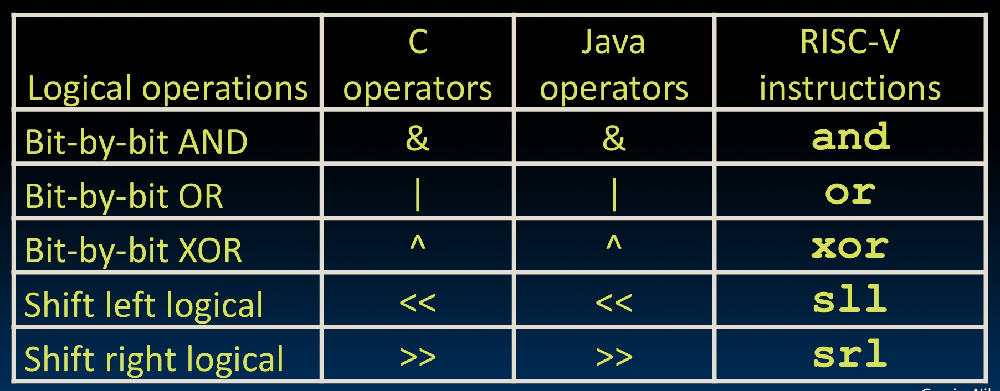

See this picture, we have some of the logical operations in C, Java and RISC-V.

You always have two variants for it.

```
and x5, x6, x7    # x5 = x6 & x7
andi x5, x6, 3    # x5 = x6 & 3 (immediate)
```

An usage example is masking. Like you got some shit in x6, and wanna get the last 8 bits of it.

```
andi x5, x6, 0xFF    # 000011111111
```

You might see that there is not a NOT in RISC-V. Because we can simply do it with other stuff.

```
xori x5, x6, -1    # all 1s
```

Making things simple, yeah you just saw it.

And we have the logical shifting.

Shift Left Logical (**sll**) and immediate (**slli**). We have

```
slli x11, x12, 2
```

This store in x11 the value of x12 shifted by 2 bits to the left (fall off end) and insert 0s on right.

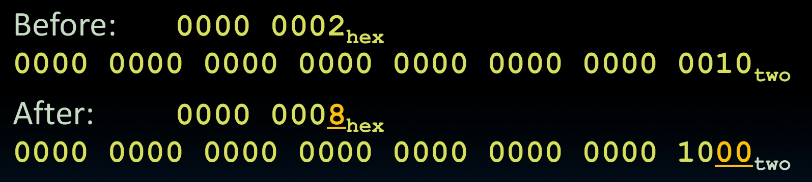

This is actually arithmetically equivalent to $x11 = x12 \times 2^{n}$, n is 2 here of course.

And shift right logical (**srl**) and immediate (**srli**) are similar stuffs.

We also have arithmetic shifting here. The Shift Right Arithmetic (**sra**) and immediate (**srai**) move n bits to the right and insert high-order sign bit into empty bits.

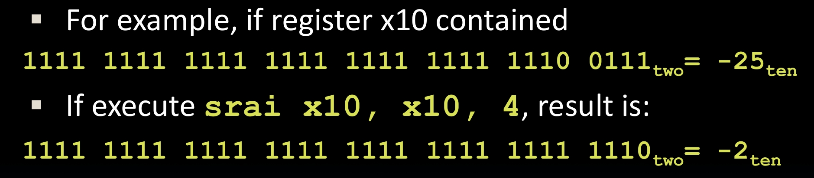

## Program Execution

Though this should be talked about later, we would see a bit now. You see the assembler convert the human readable assembly language into machine language, and it stores it in the memory.

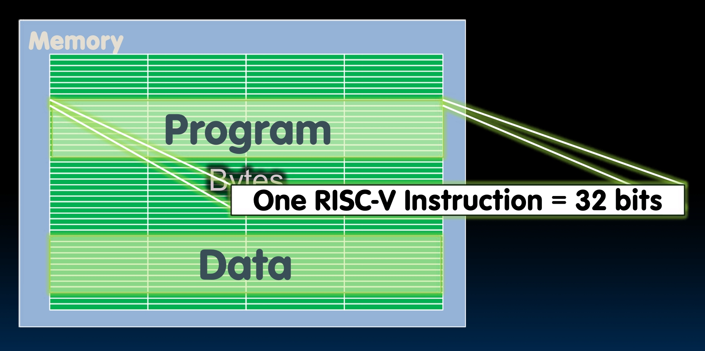

The control unit is the part that actually executes the instructions, when it does that it uses the datapath and the memory. In the datapath, we have registers, and a thing called **Program Counter (PC)**.

PC stores the byte address of the next instruction to be executed. So the Control unit run the current instruction using datapath and memory, then update the PC to the next instruction. Defaultly it just add 4 bytes, unless it's a jump or branch.

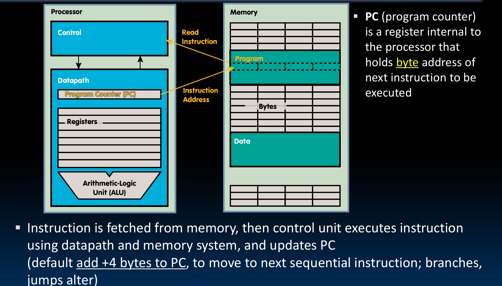

## Function Call

Let's now move on to an a little bit high level topic, the Function Call.

So functions, in other words, you pass some shits in and get some shits out. The big problems are, what should we keep track of when we compile it into assembly language, and what instructions do we need.

Here is a function calling walkthrough. We put arguments somewhere the function can access. We transfer control to the function. Then we aquire local storage for the function. We actually run the function. And we put the return value somewhere the calling code can access, restore used registers and release local storage. Last but not least, we transfer control back to the origin place, we got to remember that since a function could be called from multiple places.

To have all these done, RISC-V has its **Function Call Conventions**.

Registers `a0-a7 (x10-x17)` are used for passing arguments and `a0-a1 (x10-x11)` are used for passing return values.

`ra` (x1) is used for the return address.

`s0-s1 (x8-x9)` and `s2-s11 (x18-x27)` are saved registers, we will talk about them later.

Let's see a example.

For simplicity, we use these pseudo-instructions.

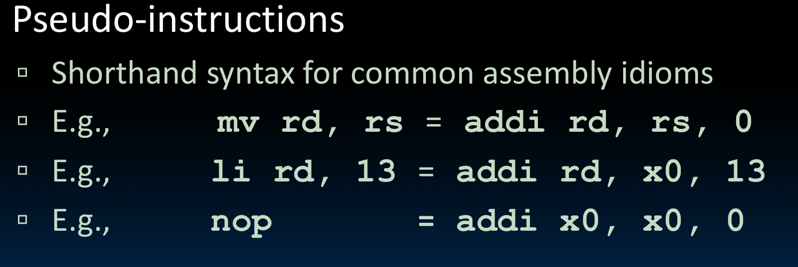

```c
{
  ...
  sum(a, b);  /* a,b: s0, s1 */
  ...
}

int sum(int x, int y) {
    return x + y;
}
```

In assembly language, it's

```
Address (in decimal)
1000  mv a0, s0 # x = a
1004  mv a1, s1 # y = b
1008  addi ra, zero, 1016 # return address
1012  j sum # jump to sum
1016  ...
...
2000  sum: add a0, a0, a1 # return x + y
2004  jr ra # return
```

Here `jr` is a new instruction means **jump register**, it jumps to the address in the register. We don't use `j` because the reason we talked about, functions can be called from multiple places.

And for

```
1008  addi ra, zero, 1016 # return address
1012  j sum # jump to sum
```

We can actually do it by a single instruction, `jal` (**jump and link**). It's a common case to do jal, so we don't always do it with two instructions for simplicity, but have this new one to make it fast.

```
Address (in decimal)
1000  mv a0, s0 # x = a
1004  mv a1, s1 # y = b
1008  jal sum # ra = 2012; goto sum
1012  ...
...
2000  sum: add a0, a0, a1 # return x + y
2004  jr ra
```

And we have `jalr` (**jump and link register**).

```
jalr rd, rs, imm
```

This links and then jumps to address `rs + imm`.

`jr ra` is actually pseudo-instruction, it's actually `jalr x0, ra, 0`.

And we even have a `ret` (**return**) just for `jalr x0, ra, 0`.

By the way, `j Label` is also a pseudo-instruction, it's actually `jal x0, Label`.

To summarize, we only got two new instructions, `jal` and `jalr`. And `j`, `jr` and `ret` are all pseudo-instructions.

### Old Values

Here is a problem: How do we deal with the old values of the registers? Obviously, we need some shit to save them before function calling, and restore them after the function calling, and delete.

Ideal is **stack**, you remember it? The LIFO shit?

That's why we need this stack pointer register `sp` (x2) to point to the stack in the memory.

The convention is growing the stack from high addresses to low addresses. So when you `push`, you decrement the `sp`, and when you `pop`, you increment the `sp`. The `sp` is always pointing to the bottom of the stack.

Every running function got its own piece in the stack, which is its **stack frame**.

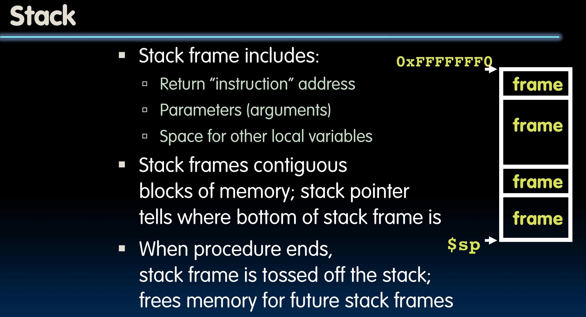

In the stack frame, there would be the return address of this function, if it is calling another function. And the saved registers, of course. By the way, remember the registers for arguments and local variables are of fixed number? If they are not enough, we can use the stack frame.

Let's see this example.

```c
int Leaf (int g, int h, int i, int j) {
    int f;
    f = (g + h) - (i + j);
    return f;
}
```

Parameter variables g, h, i, j are in `a0-a3`, and local variable f is in `s0`. Assume that we need one temporary register `s1`.

So in RISC-V, it's

```
Leaf:   addi sp, sp, -8   # adjust stack for two items
        sw s1, 4(sp)      # save s1
        sw s0, 0(sp)      # save s0

        add s0, a0, a1    # f = g + h
        add s1, a2, a3    # s1 = i + j
        sub a0, s0, s1    # return value (g + h) - (i + j)

        lw s0, 0(sp)      # restore s0
        lw s1, 4(sp)      # restore s1
        addi sp, sp, 8    # pop two items
        jr ra
```

I think you can see it pretty clearly. We create two boxes in the stack, and store the old values of `s0` and `s1` in them. Then we use these two registers to do the job, and finally restore the old values. Last, we pop them from the stack.

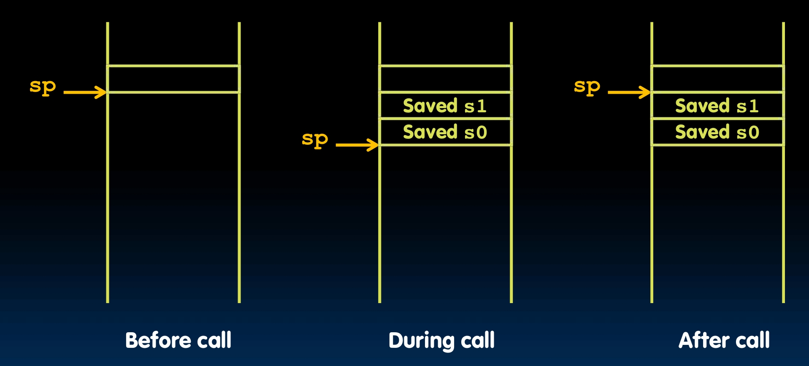

### Nested Calls

Sometimes functions call functions, even themselves. Remember in data structure we always do those recursive shits?

So how do we deal with this? `a0-a7` and `ra` will got a lot of problems.

Simple example:

```c
int sumSquare (int x, int y) {
    return mult(x, x) + y;
}
```

When you call `sumSquare`, you got some shit in `ra` which is where it wants to jump back to. But then `sumSquare` calls `mult`, and `mult` will overwrite this by it's own return address.

So obviously, same job as before, we need to save the old values. Still using the stack.

But the problem is, who need to do this saving job? This must be clear since it would be no one saving if both of them regard this as each other's responsibility.

For this, we got the **register conventions**.

So we have **caller**, which is the calling function, and the **callee**, which is the function being called. The caller needs to know, after the callee returns, which registers stay the same and which are changed.

The register conventions are some rules that everybody follows about during a calling procedure, which will be unchanged and which might be changed or not.

Basically, it just divides registers into two categories.

- **Preserved across function call**

  - Callers can rely on values being unchanged.
  - `sp, gp, tp`
  - `s0-s11` the saved registers

- **Not preserved across function call**
  - Callers cannot rely on values being unchanged.
  - `a0-a7`, `ra`, `t0-t6`

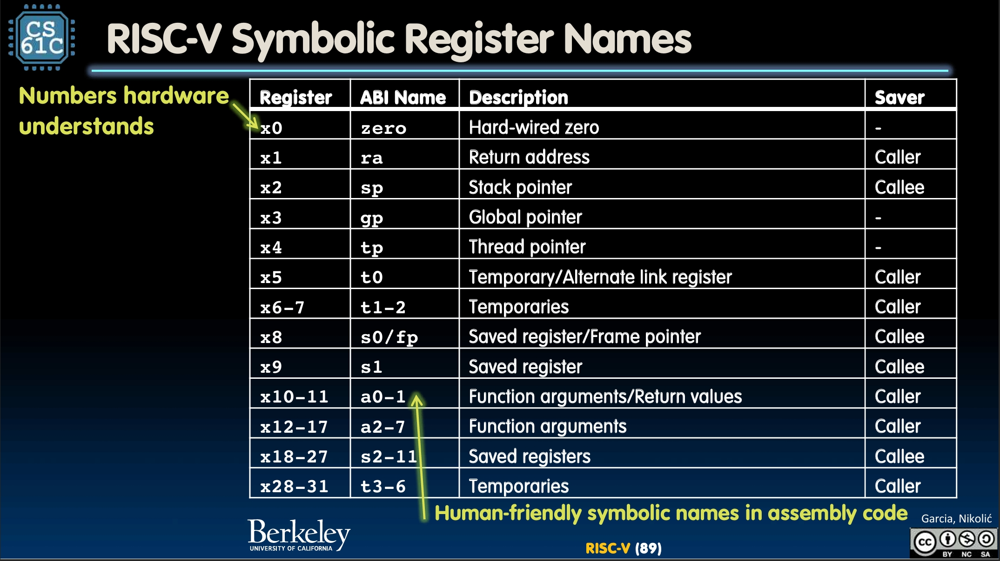

So the example in RISC-V is

```
sumSquare:
    addi sp, sp, -8
    sw ra, 4(sp)
    sw a1, 0(sp)
    mv a1, a0
    jal mult
    lw a1, 0(sp)
    add a0, a0, a1
    lw ra, 4(sp)
    addi sp, sp, 8
    jalr ra
mult:
```

## Memory Allocation

Let's go back to the memory allocation for a while.

You might remember there are static, heap and stack. And today we know much more about the stack.

In RV32, the stack grows down from the high addresses of the memory to the low addresses. Stacks must be aligned to 16-byte boundaries, not in the examples above for simplicity.

We have the global pointer `gp` (x3) to point to the static. RV32 `gp` = 1000_0000 hex.

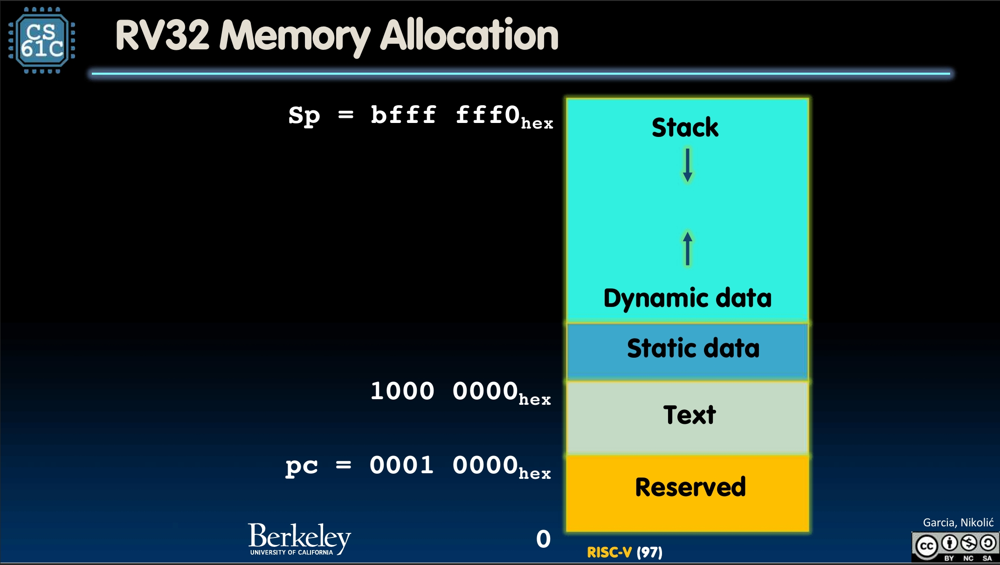

And the RV32 so far:

- **Arithmetic/logic**

  - `add rd, rs1, rs2`
  - `sub rd, rs1, rs2`
  - `and rd, rs1, rs2`
  - `or rd, rs1, rs2`
  - `xor rd, rs1, rs2`
  - `sll rd, rs1, rs2`
  - `srl rd, rs1, rs2`
  - `sra rd, rs1, rs2`

- **Immediate**

  - `addi rd, rs1, imm`
  - `subi rd, rs1, imm`
  - `andi rd, rs1, imm`
  - `ori rd, rs1, imm`
  - `xori rd, rs1, imm`
  - `slli rd, rs1, imm`
  - `srli rd, rs1, imm`
  - `srai rd, rs1, imm`

- **Load/store**

  - `lw rd, rs1, imm`
  - `lb rd, rs1, imm`
  - `lbu rd, rs1, imm`
  - `sw rs2, rs1, imm`
  - `sb rs2, rs1, imm`

- **Branching/jumps**
  - `beq rs1, rs2, Label`
  - `bne rs1, rs2, Label`
  - `bge rs1, rs2, Label`
  - `blt rs1, rs2, Label`
  - `bgeu rs1, rs2, Label`
  - `bltu rs1, rs2, Label`
  - `jal rd, Label`
  - `jalr rd, rs, imm`
