# RISC-V II: Instruction Formats and Running a Program

I learn this from these lectures:

[Lec11](https://www.learncs.site/resource/cs61c/lectures/lec11.pdf)
[Lec12](https://www.learncs.site/resource/cs61c/lectures/lec12.pdf)
[Lec13](https://www.learncs.site/resource/cs61c/lectures/lec13.pdf)

All the pictures are from the slides.

## Instruction Formats

Today, we are gonna get down a layer in the abstraction hierarchy. Let's talk about the machine language program.

Anyway, the hardware only knows 1s and 0s, and we did use assembler to trun the assembly code into machine code. However, how does machice know that what part of the 1s and 0s string is an instruction or something?

We need some sort of pattern, some sort of format, to make sure the machine code is understood. Since most data we work with is in 32-bit words, RISC-V uses 32-bit words to represent instructions.

For one 32-bit word, we divide it into **fields** to represent different things.

For simplicity, there's no need to have a format for every single instruction, so there are only six basic formats.

- **R-format** for **register-register** arithmetic operations
- **I-format** for **register-immediate** arithmetic operations and **loads**
- **S-format** for **stores**
- **B-format** for **branches** (minor variant of S-format)
- **U-format** for **20-bit upper immediate** instructions
- **J-format** for **jumps** (minor variant of U-format)

### R-format Layout

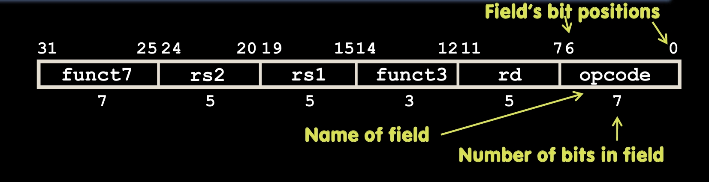

This is for operations that only about registers.

`opcode` is used to recognize what instruction it is, and for all R-format it's `0110011`.

With `funct7` and `funct3`, we can recognize what exactly this instruction is. Like `add` and `sub` have the same opcode but different funct7.

`rd` is the destination register, `rs1` and `rs2` are the source registers. There are 32 registers in total, so they are all 5 bits to cover it up.

See this for an example:

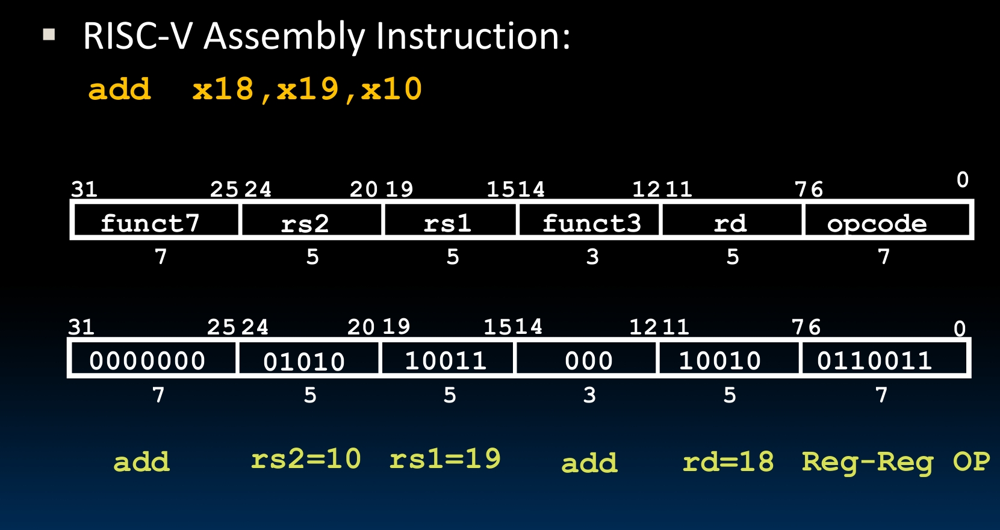

Here are funct 7 and funct 3 for some operations.

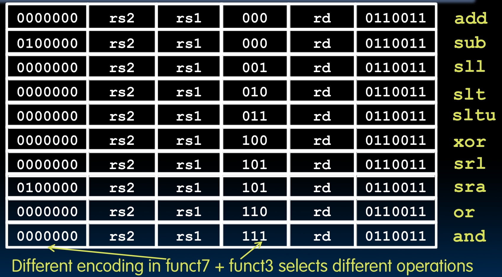

### I-format Layout

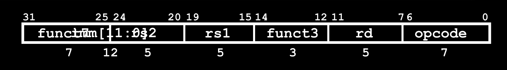

Since we only need two registers now, and there are not that many instructions with immediate, we replace `funct7` and `rs2` with a 12-bit signed `imm[11:0]` to represent the immediate value. This can represent immediate from -2048 to 2047, we will talk about others later.

`rs1`, `rd`, `funct3` and `opcode` are the same as before.

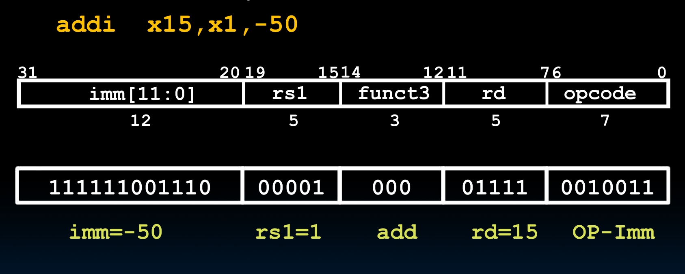

Here are all I-format arithmeticinstructions.

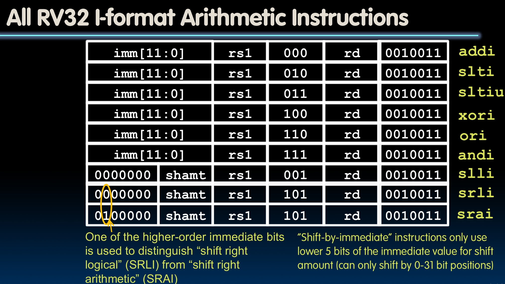

You might notice that when doing shift by immediate, we only use the lower 5 bits of the immediate. Well, in a word, you can mostly shift by 31, right? And one of the higher-order immediate bits is used to distinguish from shift right logical and shift right arithmetic.

Besides these arithmetic instructions, we also use I-format for loads. The `imm[11:0]` here would be `offset[11:0]`.

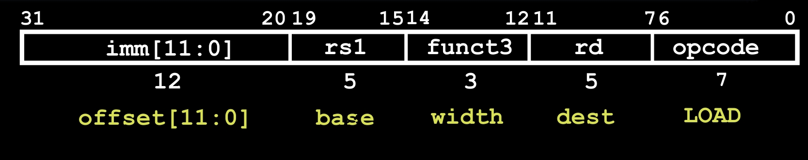

We also add the offset to the base address to get the result address. Pretty similar to the immediate ones, right?

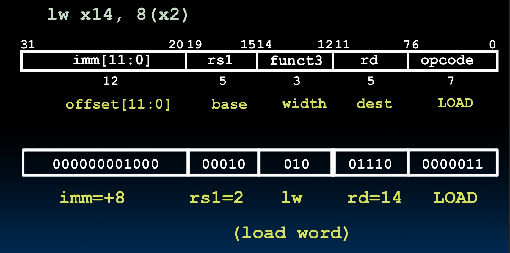

And here are all load instructions.

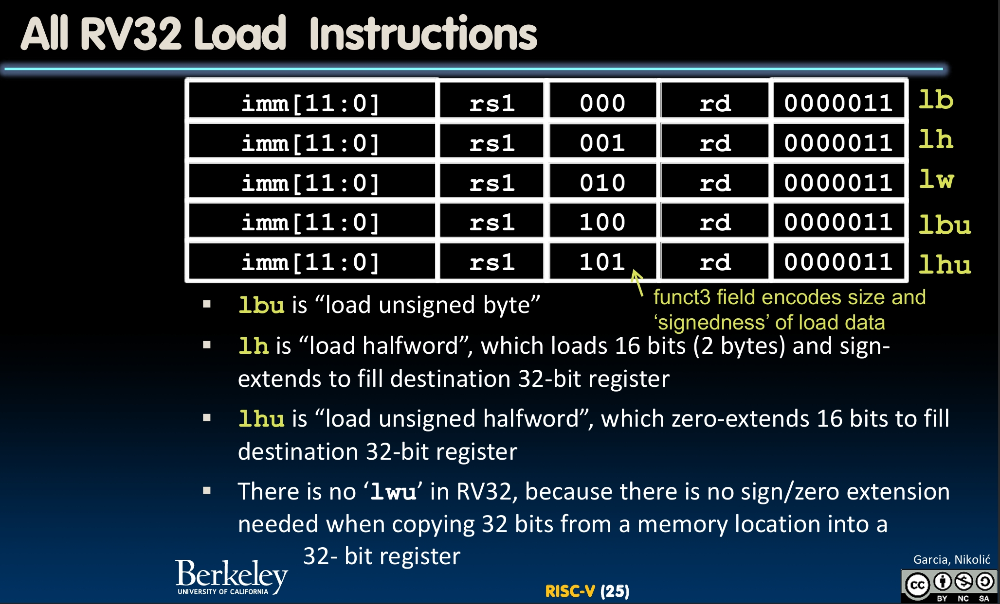

You see `funct3` here encodes size and 'signedness' of the load data.

### S-format Layout

So we knew about loading, but what about storing? We can't do it with I-format this time, since store needs two source registers, and an immediate.

But good news, it doesn't need a destination register. So insdead of replacing `funct7` and `rs2` with `imm[11:0]`, we replace `funct7` and `rd` with `imm[11:5]` and `imm[4:0]`.

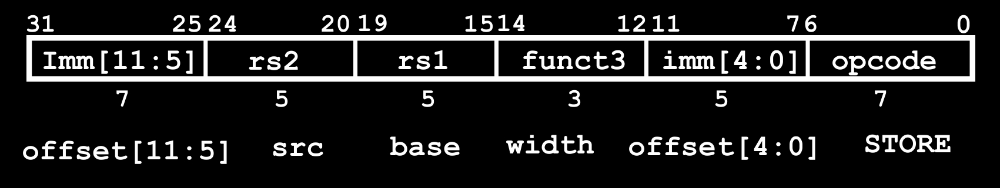

See this for an example:

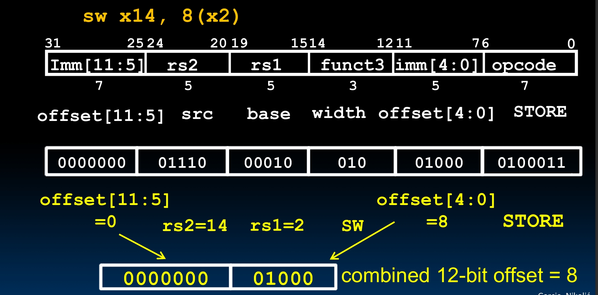

And here are all store instructions.

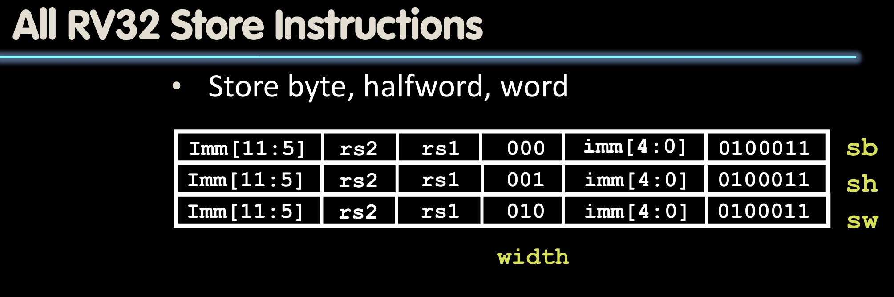

### B-format Layout

Conditional branches! What do we do? We need to compare two registers, but no need to write to one. And we need to encode the label to branch to.

How do we encode the label to branch to? Maybe we can just use the address of the instruction to branch to. Well, obviously not good idea. If the program once gets to a different place in the memory, you fuck up.

The good approach is the **PC-relative addressing**. We talked about PC the program counter, remember? It always stores the address of the executing instruction.

So what we need to store is the offset from the PC to the label. Since loops and if statements are commonly not jump very far, this could be pretty efficient and position-independent.

If we use the 11-bit immediate field to store the two's complement of the offset, we can branch to $\pm 2^{11}$ 'units' of addresses from the PC.

What is the unit? Byte? No, a word is 4 bytes and we will never branch to the middle of a word. So we certainly use a 32-bit word as the unit. For practice, we always multiply the immediate by 4 before adding it to the PC.

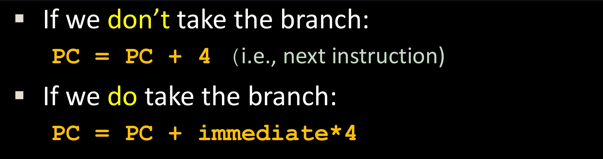

But this is the ideal, actually RISC-V only multiply the immediate by 2. This is because its extensions support 16-bit instructions. So actually, we can only branch to $\pm 2^{10}$ instructions from the PC. You know, because half of the addresses we can branch to are in the middle of a word.

So here is the B-format layout.

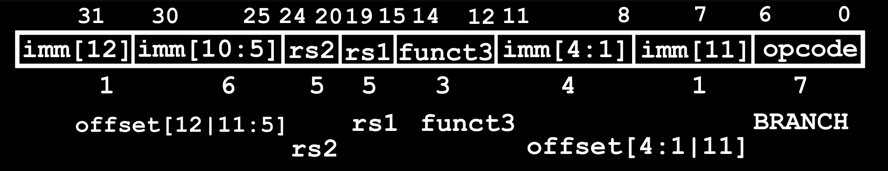

You can see that here we have 12 bits in total for this immediate, which can actually stores a 13-bit signed immediate. Like if we are going to store 16, like we just talk about, we actually store 8 as the immediate. So when we multiply it by 2, we always just add an 0 at the end. `000000001000` the 8 actually means `0000000010000` the 16, you understand?

See this for an example:

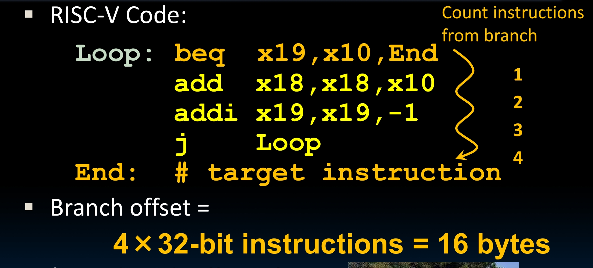

So we need to branch 4 instructions from PC, which is 16 bytes. So the offset is 16. To a 13-bit signed immediate, it's `0000000010000`, but we actually store `000000001000` as the immediate.

And you encode it like this.

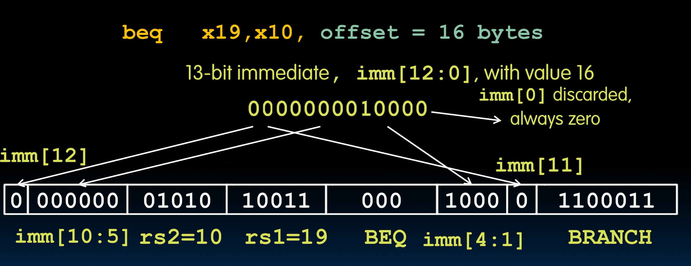

Here is all branch instructions.

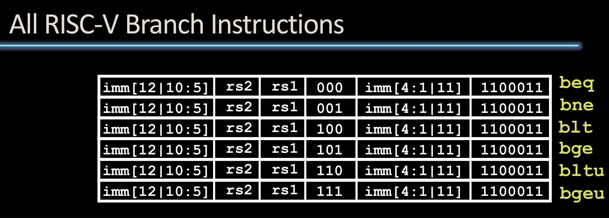

### Long Immediate, U-format and J-format

I said we are going to talk about it later, and I was not lying. How do we deal with the immediate that is longer than 12 bits?

We need this U-format.

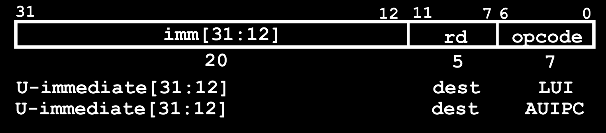

This is literally just a 20-bit immediate, a `rd` and a `opcode`. What it does is to put the 20-bit immediate to the upper 20 bits of the destination register, and clears the lower 12 bits.

Btw, new instructions, `lui` to load upper immediate and `auipc` to add upper immediate to PC.

So combine this with an `addi`, we can form any 32-bit immediate.

There is a corner case that is supper complicated, which is the `addi` does sign extension and causes some problem. And we need to do some tricky things to avoid things going wrong. But good news is, we have `li` the pseudo instruction to do this `lui + addi` thing and deal with this corner case automatically.

```
li x10, 0xDEADBEEF
```

About J-format, nothing much to say. It's used to do the `jal`.

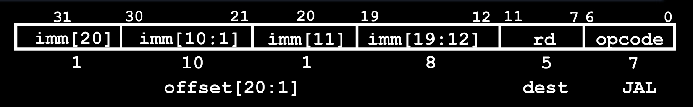

It's also a 20-bit immediate, for the long distance PC-relative addressing.

### Summary of RISC-V Instruction Formats

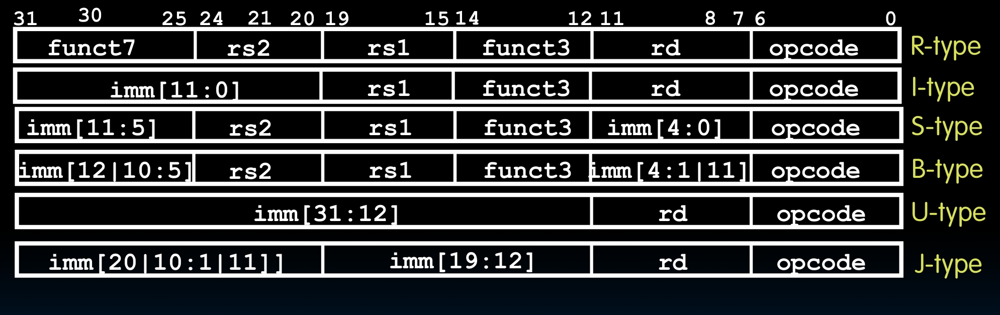

## Running a Program Walkthrough

Tired. We have totally done RISC-V so bad. Now, what about a walkthrough of running a program? The compiling, assembling, linking and loading.

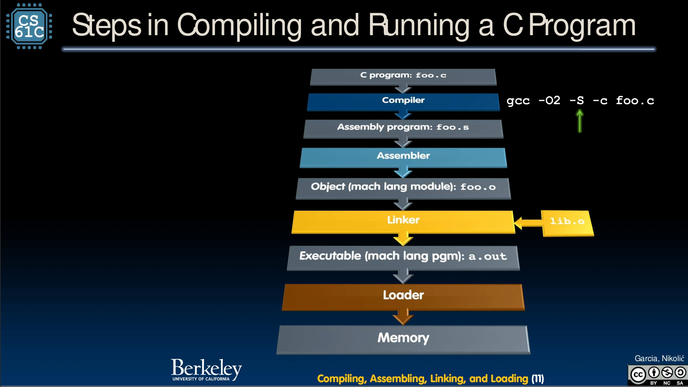

### Compiling

So your C program `foo.c` got input to the compiler, and have an assembly program `foo.s` as an output. For RISC-V, which you should be familiar with now. Btw, this output might contain some pseudo instructions like `mv`.

### Assembling

The `foo.s` as an input, the assembler need to convert it into machine code and output a `foo.o` file.

This is a very tricky part.

Firstly, must turn all pseudo instructions into real instructions, because though the assembler knows about them, the machine does not.

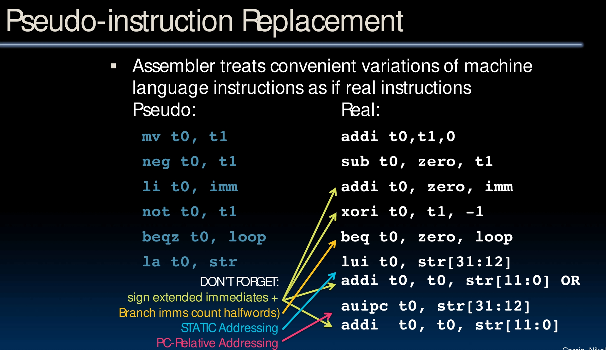

After that, we produce machine language.

For most cases, we just simply turn them into 1s and 0s. But there are some special cases called **forward references**.

You might need to branch to a instruction that is forward in the program that you don't know when you scan to the current branch instruction. Well, the solution is quite simple, just scan twice. The first time you remember addresses of labels, and producing code the second time.

That can be handled fine because it's relative addressing. But sometimes we do need the address of static data, the 32-bit full address. We might call a function from outside the current file or something. At this part of assembling, we have no chance to know that address exactly. So we need to maintain two tables.

The **symbol table** is about items in this file that might be used by others. Basically labels and data.

The **relocation table** is about the items whose addresses we need.

### Linking

After assembling, we have a bunch of `foo.o` files, and the libraries they used like `libc.o`. We need to link them together to get a executable file `a.out`.

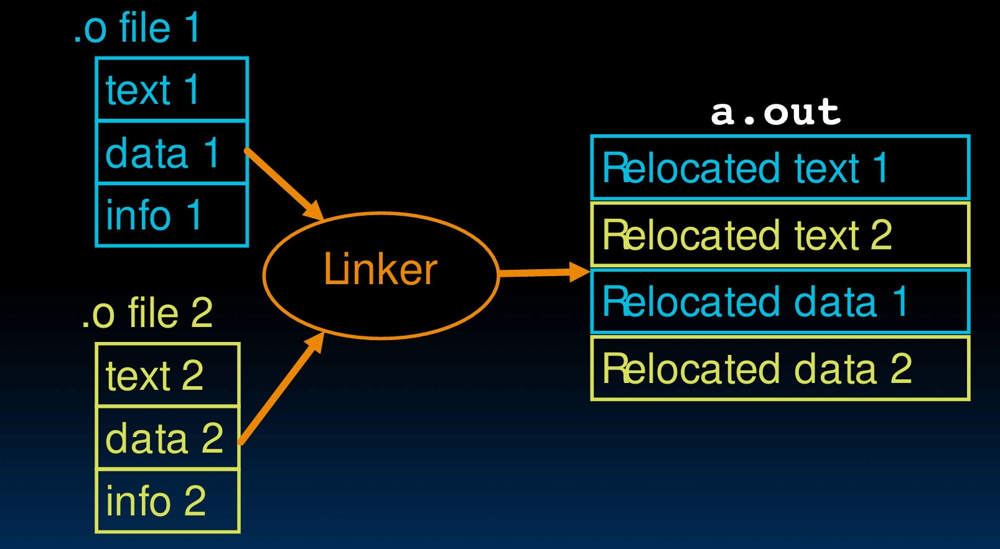

Every file there are text segment, data segment and info segment (symbol and relocation table). We need to put all the text segments together, and put all the data segments together and concatenate to the end of the text segment. Lastly, we can handle all these relocation table, since we can now know all the absolute addresses.

So it just calculates them, and fill them in.

### Loading

Basically, it's just the OS uses this loader to load the executable file from the disk to the memory, get ready to run.

It reads the header to see the size of text and data, then allocate the memory for them. Copying shits into the memory, putting arguments to the stack, initializing the registers and setting up PC, things like that.

### Example

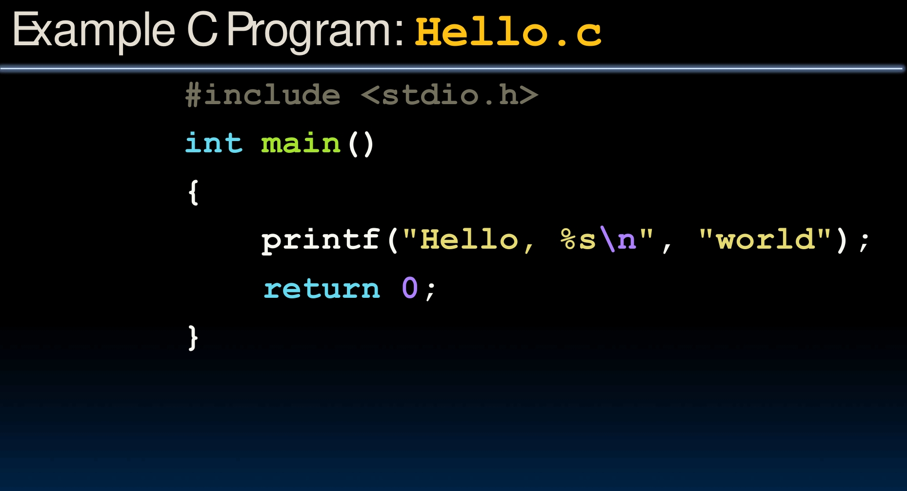

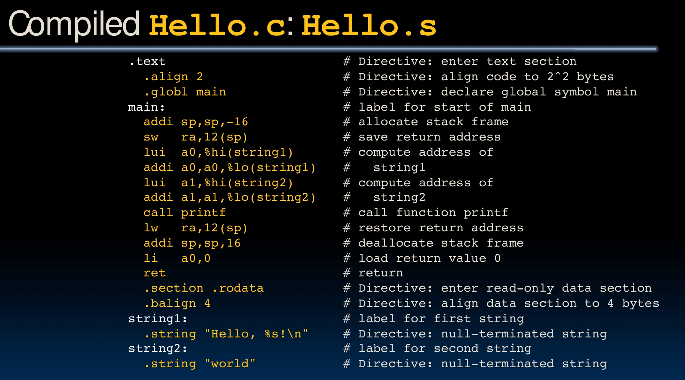

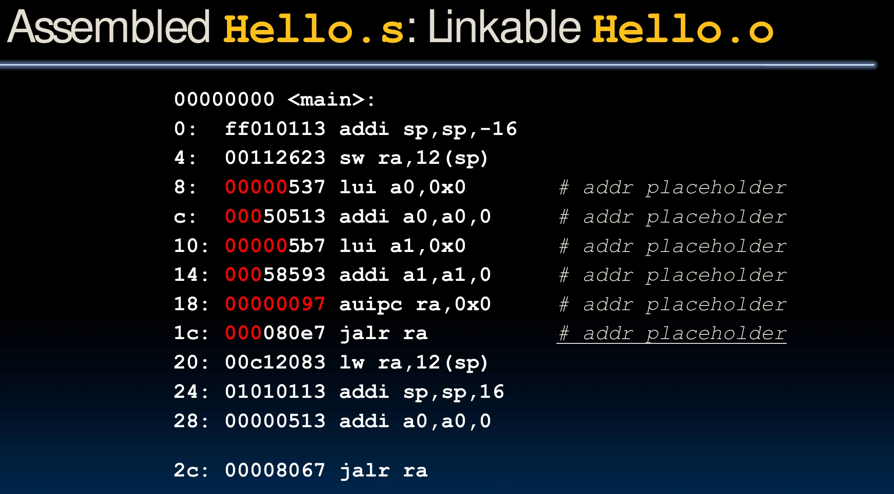

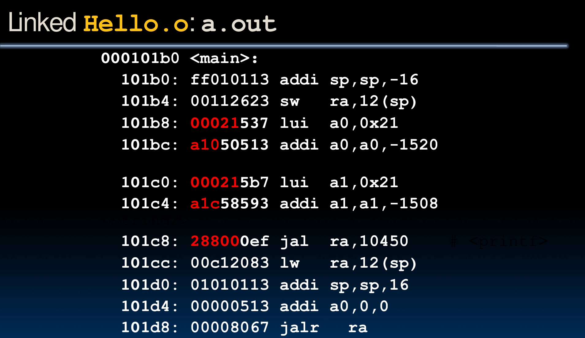

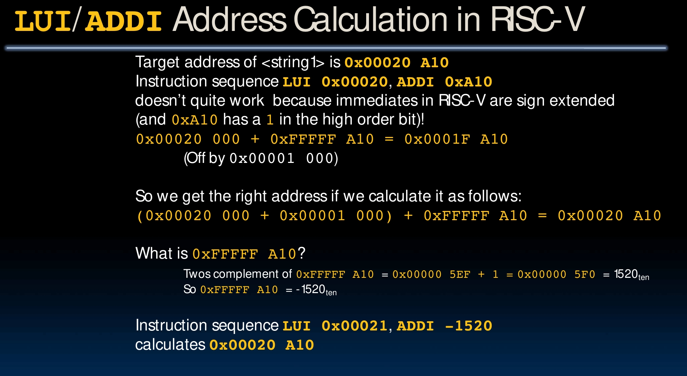

### Summary

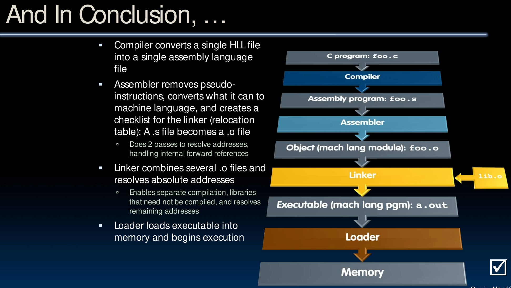
