# Single-cycle CPU

I learn this from these lectures:

[Lec18](https://www.learncs.site/resource/cs61c/lectures/lec18.pdf)  
[Lec19](https://www.learncs.site/resource/cs61c/lectures/lec19.pdf)  
[Lec20](https://www.learncs.site/resource/cs61c/lectures/lec20.pdf)

All the pictures are from the slides.

## Intro

So in the previous few notes, we got everything about SDS, combinational logic and shits. Those are all aiming at making our hardware able to run every single RISC-V instruction. But to really do that, we need to design something more complicated with them, the **CPU (Central Processing Unit)**.

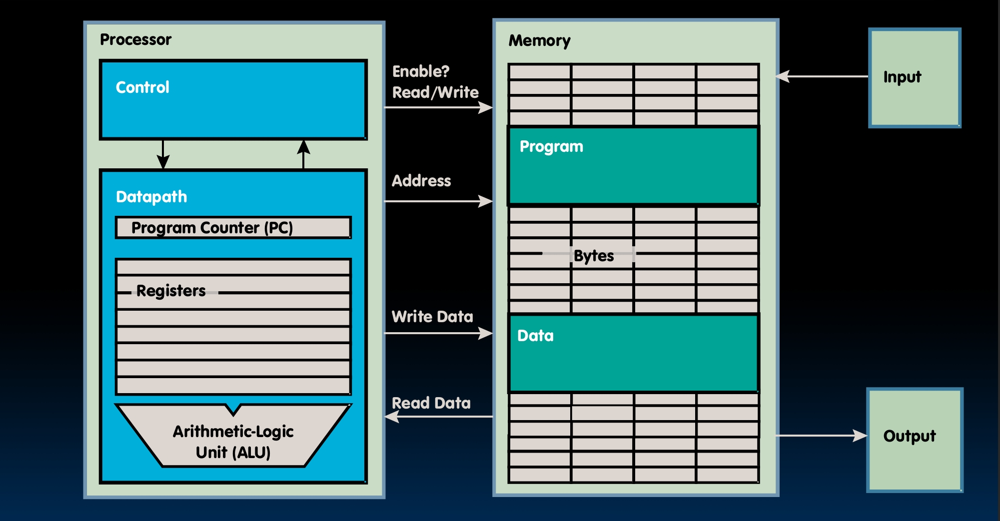

Let me break it down for you. The **processor** is the core part, who actually does all those work, manipulating data and making decisions. Inside the precessor, there is this **datapath** that actually does every single operation. And there is also this **control** that tells the datapath what needs to be done. The final goal is being able to run all the RISC-V instructions.

In this note, we will build all them up from scratch.

## Datapath

### Five Stages

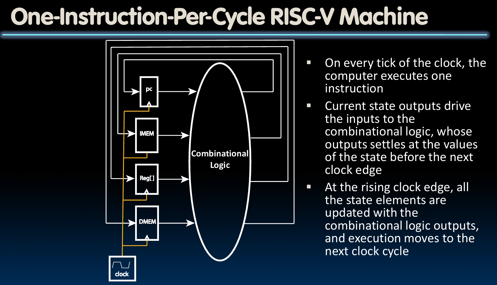

The big idea is that every clock we execute one instruction. Current state outputs drive the inputs to the CL, whose outputs settles at the values of the state before the next clock. At the rising clock edge, all the state elements are updated with the CL outputs, and execution moves to the next clock cycle.

This is why we call it **single-cycle**.

However, this got problem. The one instruction is just too much, so it would be super difficult to design the datapath. So we need to break it up into stages. Attention, we still run it in one clock cycle, just different part of digital logic for different stages and then link them up.

With these stages, we can easily design each small part, and when we do some optimization to a certain part, we only mind our own business without affecting the other parts. Some sort of abstraction, isn't it?

So the big concept, the **Five Stages:**

- Stage 1: Instruction Fetch (IF)
- Stage 2: Instruction Decode (ID)
- Stage 3: Execute (EX) - ALU (Arithmetic Logic Unit)
- Stage 4: Memory Access (MEM)
- Stage 5: Write Back to Register (WB)

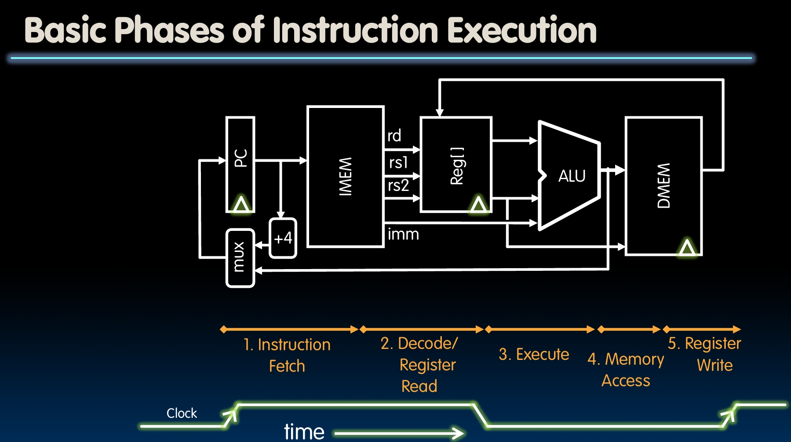

### Datapath Components

We have combinational elements like Adder, MUX and ALU. They doesn't really care about the clock, they just do their job.

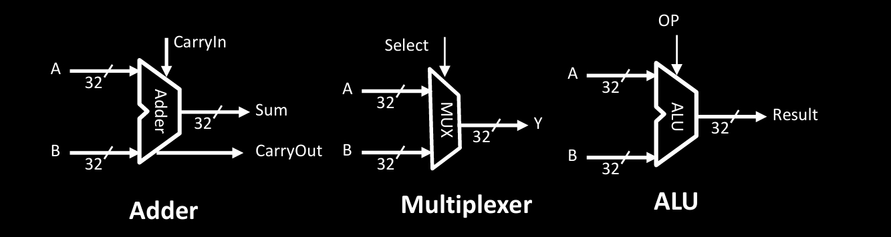

And we have storage components, basically the same thing as state elements that we talked about, or sequential elements. You know, registers, memory and shits.

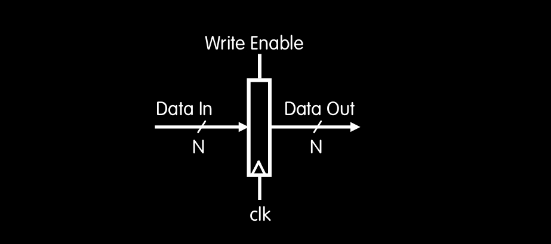

You can see that the register has a clock signal and a **Write Enable (WE)** signal. When WE is 0, the Data Out is not updated. When WE is 1, the Data Out will be the Data In on positive edge of the clock.

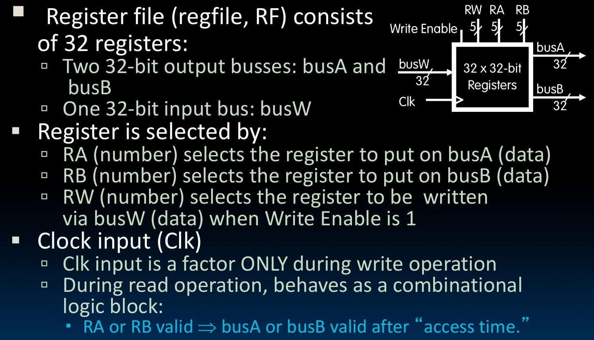

The **register file (regfile, RF)** consists of 32 registers. It got two 32-bit output busses busA and busB, and one 32-bit input bus busW.

And it also got 5-bit RA, RB and RW. RA, RB select the register to but on busA and busB, and RW select the register to be written via busW.

Clk the clock input only have something to do with write operation. Duiring the read operation, the whole thing acts like a combinational logic.

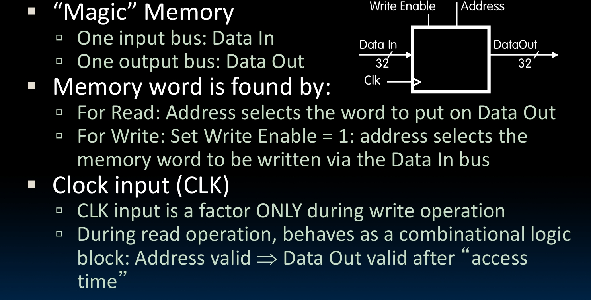

Let's just regard the memory as a black box. It got an input bus and an output bus. When WE is 0, the read operation, we have an Address to selects the word to put on Data Out. When WE is 1, the write operation, we have an Address to select the memory word to be written via the Data In bus. And Clk is also only have something to do with the write operation.

So every time we execute an instruction, it reads and updates the state of these three things: **registers**, **program counter (PC)** and **memory**.

We have known regs and PC pretty well, so let's focus on the memory (MEM). The memory holds both the instruction and the data, 32-bit byte-addressed space. We will use separate memory for instruction and data, the **IMEM** and **DMEM**.

### R-Type Datapath

God damn the warmup is long. Now let's do some real work.

Firstly, let's try to build the datapath for the R-Type instructions.

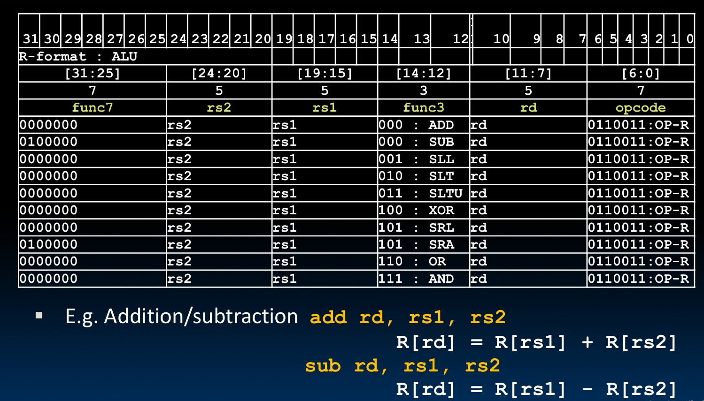

To be specific, we will implement the `add` instruction.

When we doing

```
add rd, rs1, rs2
```

It actually makes two changes to the machine's states.

```
reg[rd] = reg[rs1] + reg[rs2]
```

and

```
PC = PC + 4
```

So we build the datapath to do these two things.

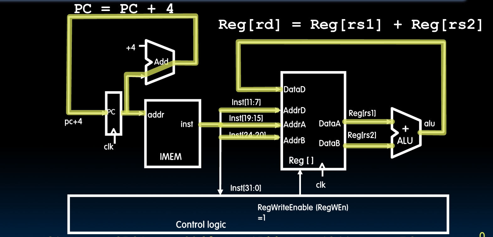

Let's break it down with our sweet five stages.

The **IF**, you see that the special register PC got the address of the next instruction, sending to the IMEM, and the IMEM will output the instruction.

At the same time we have this adder, it will add 4 to the PC, and the result will be the address of the next instruction. It goes back to the PC input. PC will update it next clock cycle.

Then the **ID**, the regfile got the RA, RB and RW from the IMEM, which are actually the indexes of rs1, rs2 and rd. So the regfile do its work.

It regards the rd as the one that will hold the input and output the value of rs1 and rs2.

Then the **EX**, the ALU got the rs1 and rs2 values from the regfile, and the ALU will do the addition.

Theoretically, the next stage would be the **MEM**, but actually not. Because this whole R-Type thing has nothing to do with the DMEM, all the data are in registers. Though in IF and ID we access the IMEM, but that counts as, well, IF and ID. So you see, by MEM, we actually mean access the DMEM.

So then the **WB**, the ALU outputs the result of the addition, getting to the input of the regfile. And the regfile write it back, to the rd!

And we done the work, aren't we great? We always would love to add numbers so bad.

Here's the timing diagram.

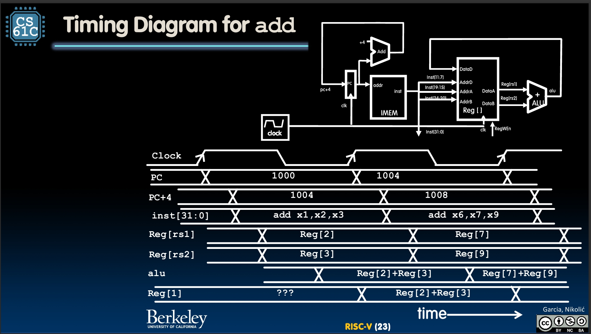

After that, let's consider how do we do other instructions of R-Type. Say the `sub` instruction?

Do we need a brand new datapath? No, we certainly don't. Because the only thing that is different is the operation that ALU does.

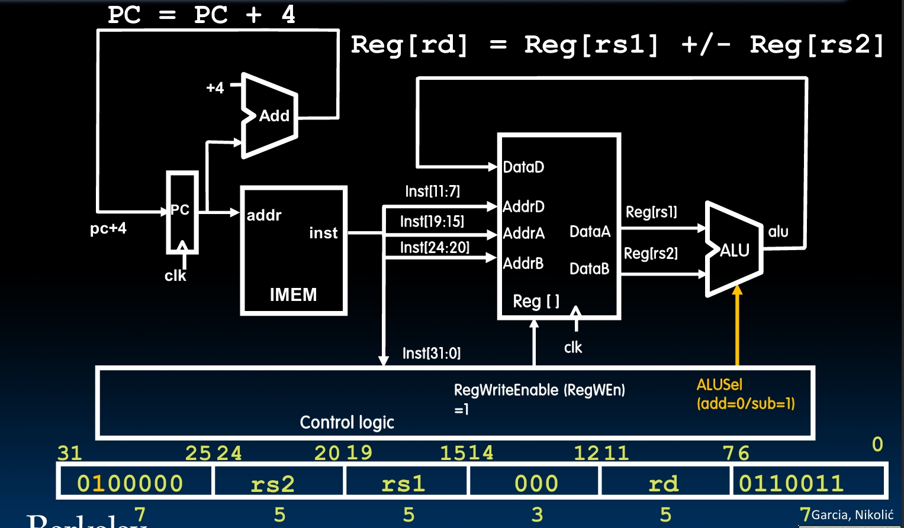

So the thing is, when the IMEM send some parts of instruction to regfile, at the same time it send a full copy to the Control. The Control see it and know what it is, actually the inst[30] bit tells if its add or sub. So the control send some signal to the ALU to tell it what operation to do.

Same thing for other instructions of R-Type. Same datapath, just the control see the funct3 and funct7 to tell which it is and tell everybody what to do.

We won't go deep about the Control right now, just imagine there is a god, or me, sitting there and say things.

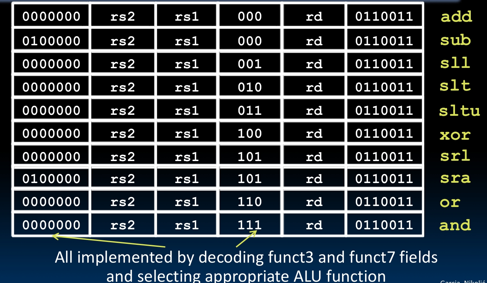

### Adding immediates to the Datapath

So we can do `add`, what about `addi`? Let's make it support the I-Type instructions.

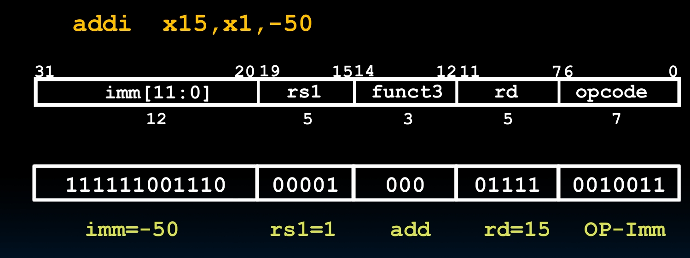

The only defference between `addi` and `add` is that the second operand of `addi` is not stored in rs2, but is an immediate value that is written in the instruction.

So we need to add a 2-to-1 MUX, at the position between regfile and ALU, to decide to give the rs2 value or the immediate value to the ALU.

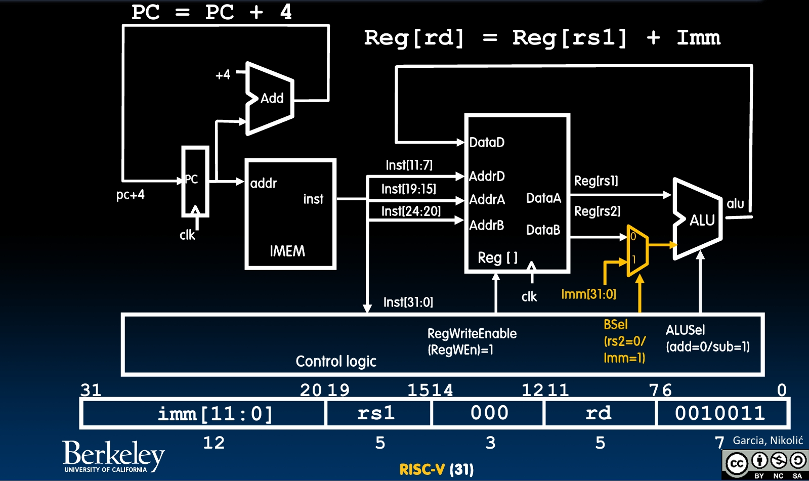

Of course, there will be a Bsel signal from Control to tell it.

But well the immediate value comes from? We need this immediate generator (Imm. Gen) between IMEM and the MUX that we mentioned above. The IMEM give the inst[31:20] the 12-bit immediate part to the Imm. Gen, and it generates the 32-bit immediate value.

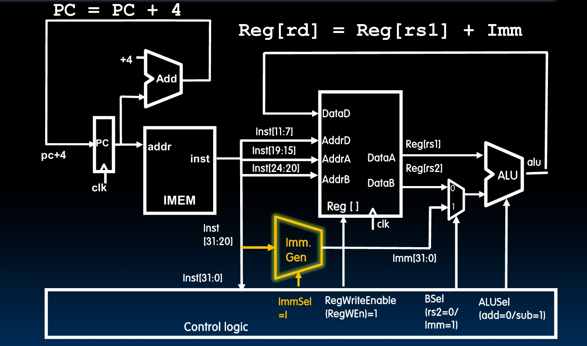

What it really does is put the inst[30:20] to the lowest position of the 32-bit immediate, and fill the rest with the sign bit of inst[31].

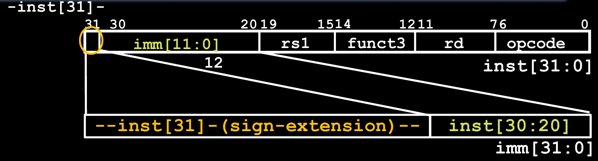

So the whole Datapath currently looks like this.

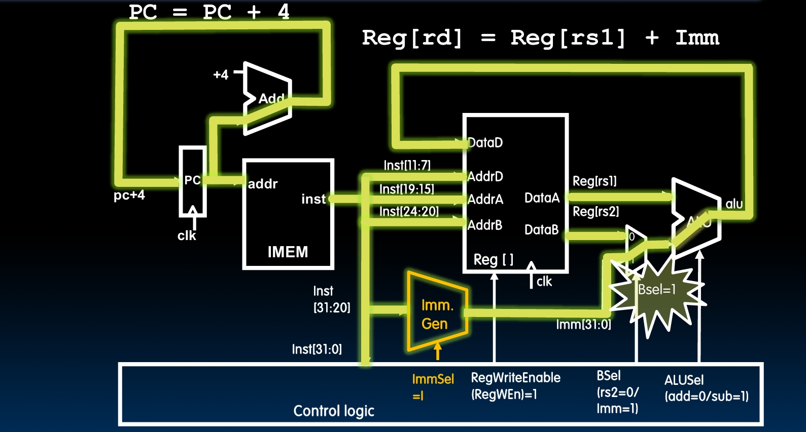

It simply works for all other instructions with immediates. Just change the ALUSel.

### Supporting Loads

So our datapath now can deal with all the R-Type and I-Type instructions. But it can still only do things with registers. The data is either in register or the instruction. The whole thing is like an isolated island that has nothing to do with the rest of the world.

But connecting is necessary, for the people live on the island. Actually I don't know their thoughts, I just assume that. Anyway, it's a metaphor. My point is, the datapath got to interact with the memory or something.

Let's start from `lw` the load word instruction.

```
lw rd, offset(rs1)
```

It's actually still I-Type, having this immediate offset. What it does is pretty like `addi`, but to form an address not the final result.

So it firstly add the 12-bit offset to the rs1 value, getting the target memory address. Then it accesses the DMEM, and got the word stored there. Finally, put it into rd.

So the `Reg[rs1] + Imm` part can actually be done already, like I said, with the same datapath of `addi`. What needs to be added is the accessing DMEM part.

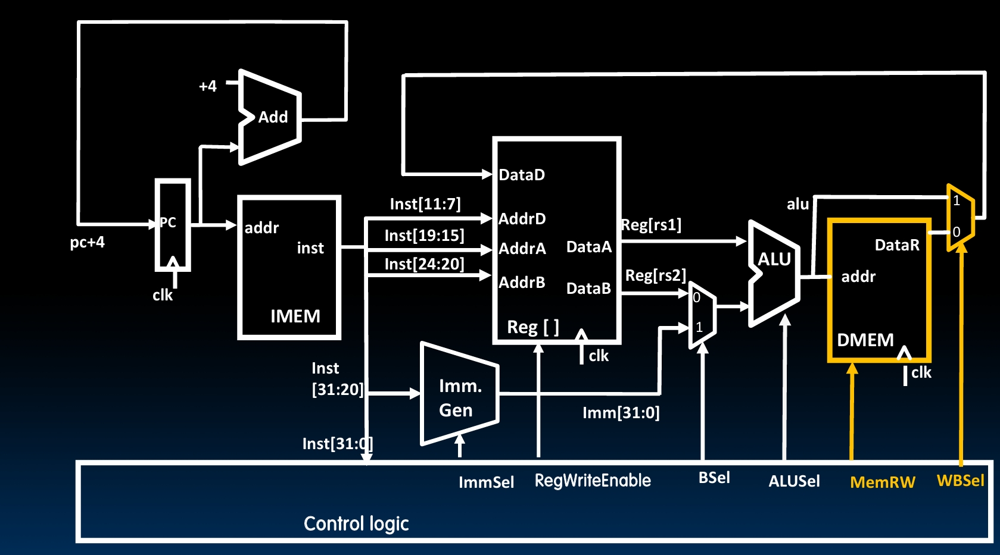

So the output of ALU goes to the DMEM. There is this MemRW signal from Control to tell the DMEM to read it. Then we need a 2-to-1 MUX to decide to use the DMEM output or the ALU output directly. Of course, there is this WBSel signal that tells it what to do.

The datapath currently looks like this.

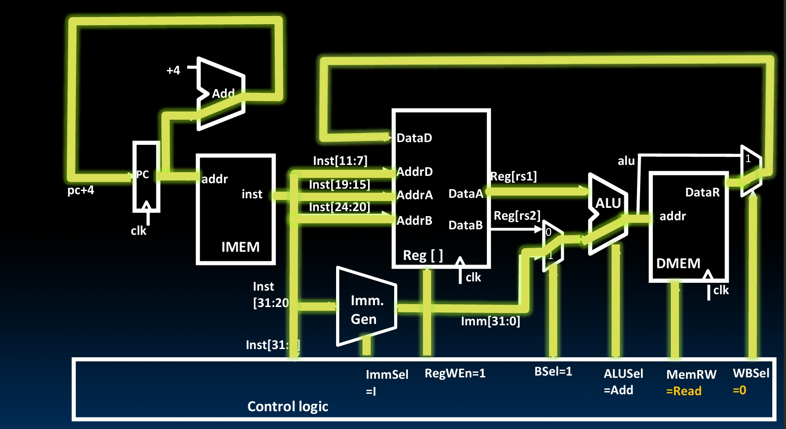

This datapath can deal with all the load instructions.

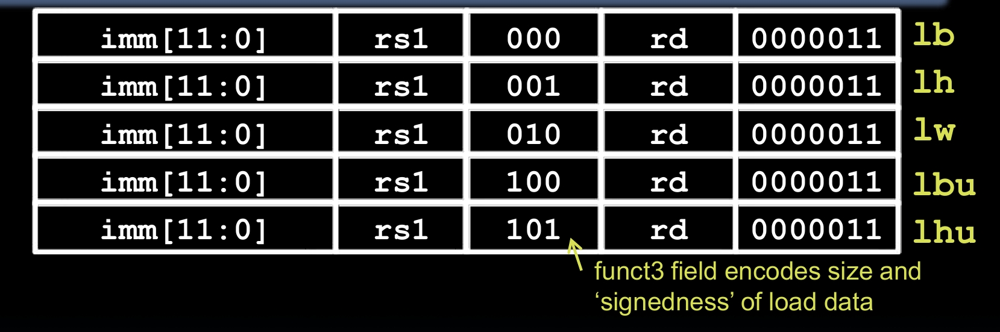

These other loads got some data width or how to extend differences. We actually need to add a circuit after DMEM core logic and before output to make them all supported. It's only a MUX and some more gates, but we won't go deep. Understand the core idea is enough.

### Stores

So we load, what about store? This is the most natural question ever.

Let's do `sw`!

```
sw rs2, offset(rs1)
```

Still, calculating the address with `Reg[rs1] + Imm` is done already. What we need to do is to write the rs2 value to the DMEM, right in the address that we calculated.

You might remember that not like loads, stores are not I-Type but S-Type. Basically, the immediate (offset) are still 12-bit, but in two parts.

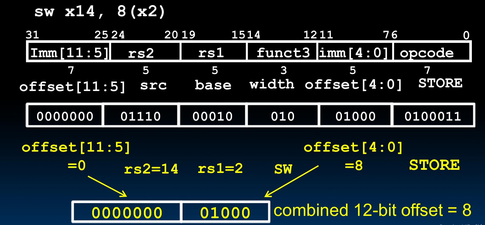

So when we do the `Reg[rs1] + Imm` thing, the Imm. Gen must do it in another way. There will be this signal ImmSel from the control to tell it what way to use.

When it's I-Type, get the inst[31:20], but if S-Type, combine the inst[31:25] and inst[11:7]. Then do the extending job. Actuall, inside the Imm. Gen, we have a MUX.

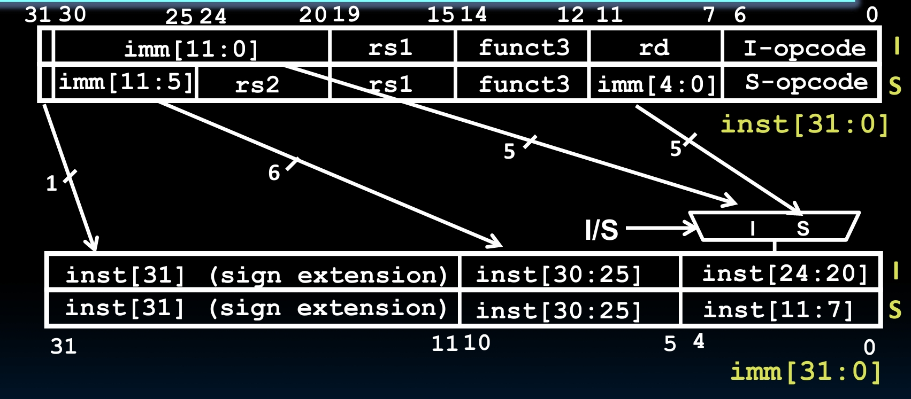

Anyway, we need only to add a path from the regfile rs2 output (DataB) to the DMEM data input (DataW). And with the datapath we already have, the rs1 output go through the ALU and the DMEM address input. Then the DMEM stores the data to that address.

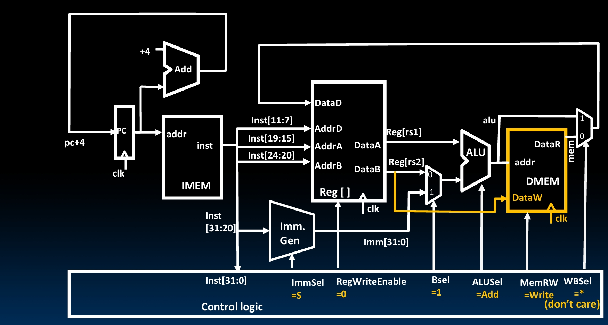

Now the MemRW signal will be 'write', not 'read'. And the WBSel will tell the MUX, eh, nothing need to be done.

The datapath currently looks like this.

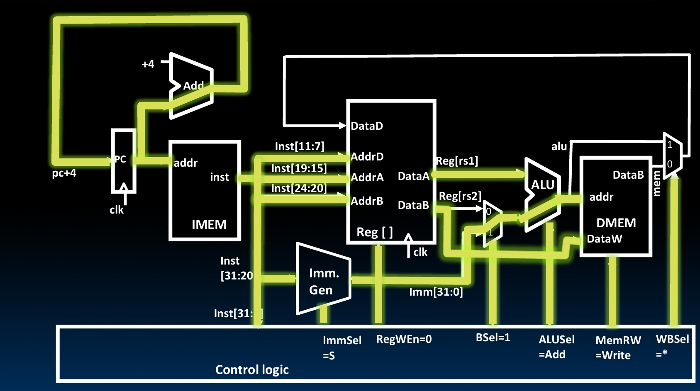

This can also deal with all the store instructions.

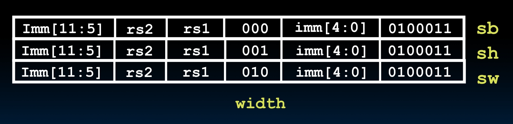

Also need some extra circuit inside the DMEM to deal with the differences.

### Implementing Branches

You might notice that in the current datapath, we just simple do $PC = PC + 4$.

This is not enough. Only execute things in order don't do a lot of great job. What really make programming so great is if-else, loops and functions. For what we are building, the branches!

So our goal, is that no longer just doing

$$
PC = PC + 4
$$

But

$$
\text{PC}_{next} =
\begin{cases}
PC + 4, & \text{if branch not taken} \\
PC + imm, & \text{if branch taken}
\end{cases}
$$

So let's see the branch instructions, they got their own format, the B-Type.

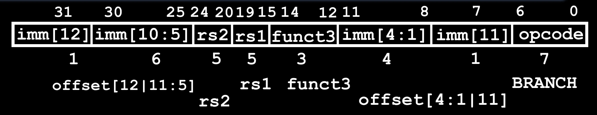

It's actually pretty similar to the S-Type, but looks a little strange. Since the lowest bit must be 0 for the reason we talked about when we were on that topic, we don't need to store it. So we use that position for one more higher bit. Pretty cool, with 12 bits it can actually do a 13 bits job. So from -4096 to +4096 in a 2-byte increment.

Anyway, the branch instructions do two jobs. First, compare the value of rs1 and rs2 and see if the branch should be taken. Then calculate the target address by doing `Reg[rs1] + Imm`, adding to PC if the branch is taken.

Wow, looks like someone has a lot of things to add to the datapath ~

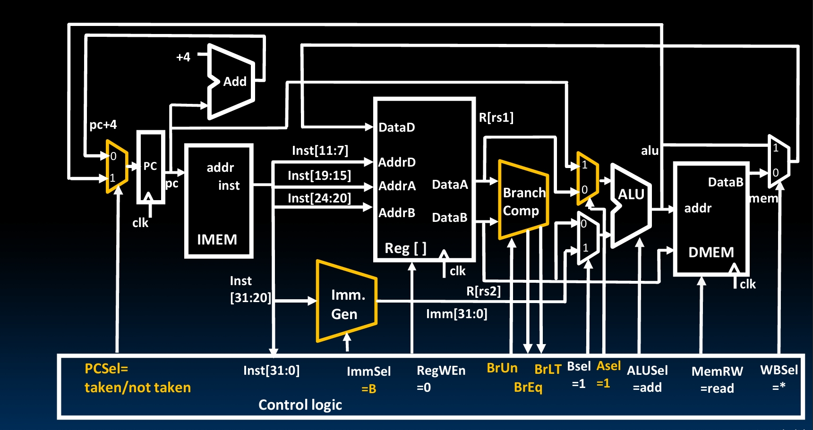

So when regfile output the rs1 and rs2 values, we have this Branch Comparator to compare them.

The output will go to the Control to decide whether the branch is taken or not. Since it's a little more complex, we use two signals to send it to the Control.

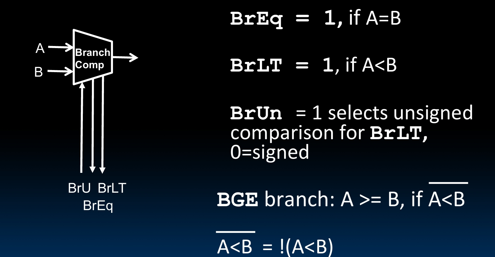

So the `BrEq` tells that if it's equal or not. And the `BrLT` tells that if the rs1 is less than rs2.

And before the comparison, there will be this `BrUn` signal from Control to tell the Branch Comp to do the `BrLT` signed or unsigned.

So the Control got the comparing result, it need to decide whether the branch is taken or not. To be specific, whether to let the ALU do the job with rs1 value, or calculate the target address with the current PC value. Of course, we have this brand new MUX to do the job. And Control will use this ASel signal to tell it what to do, according to the comparing result.

So if the branch is taken, the ALU will get the current PC value from the MUX. But it still needs the immediate. The Imm. Gen will be able to generate it from the instruction, when the control tell it it's the branch instruction with ImmSel signal.

Then the ALU got both data, it do the addition and output the next PC value. And the PC just update it? Well, if the branch is taken. But if not, it still need the old path to do $PC = PC + 4$. So another MUX, and a PCSel signal.

And that's it, the datapath currently looks like this.

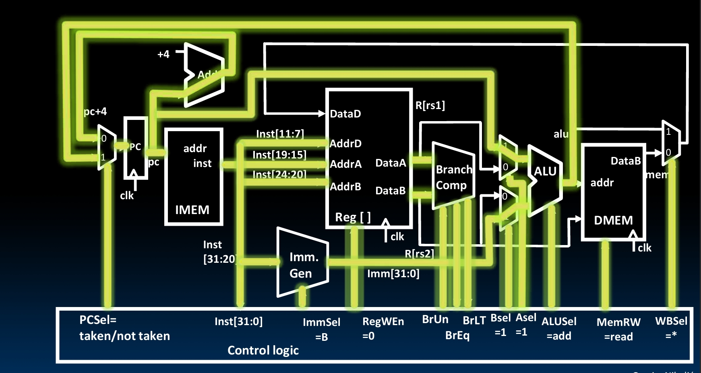

### Adding Jumps

I am tired of explaining why it is important. You fucking need it.

We have `jal` and `jalr` instructions. Let's see the `jalr` first, since it's I-Type which we already know.

So

```
jalr rd, rs1, imm
```

makes two changes to the machine's states.

It stores the address of the next instruction to rd. And then it jumps to the address of `Reg[rs1] + Imm`.

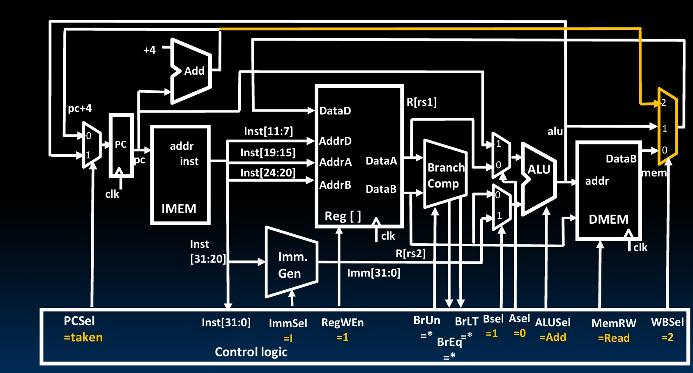

To do the first thing, we need to put the $PC + 4$ to the input of the regfile. So you remember the MUX before the regfile data input (DataD)? Let's make it no longer 2-to-1, but 3-to-1. The one more is the $PC + 4$ from the adder. And the WBSel signal will have a value to tell the MUX this case.

I don't even want to talk about the `Reg[rs1] + Imm` part, we have know how to do it for literally too long. Update it to the PC, not too long maybe, but with the MUX before the PC input, job can do!

Then the `jal`, which got it's own format, the J-Type.

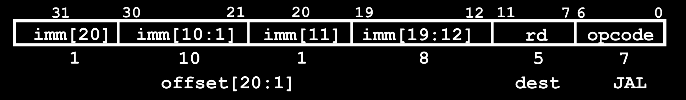

Again, odd immediate, but just let the Imm. Gen got a logic to generate it.

So this also stores the address of the next instruction to rd. But then, it doesn't jump to the address of `Reg[rs1] + Imm`. It jumps to the address of `PC + Imm`.

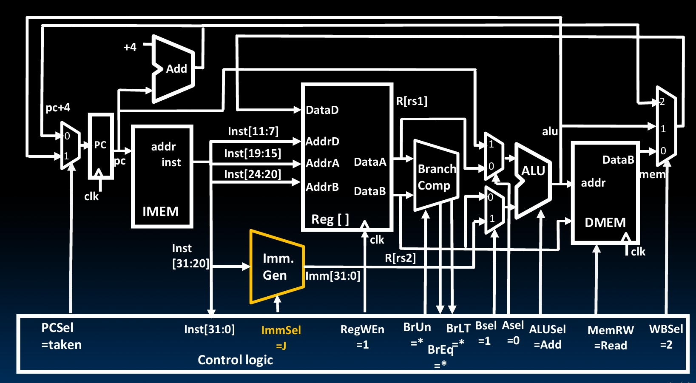

Anyway, actually no new datapath needed, just add a logic to the Imm. Gen.

So the whole datapath currently looks like this.

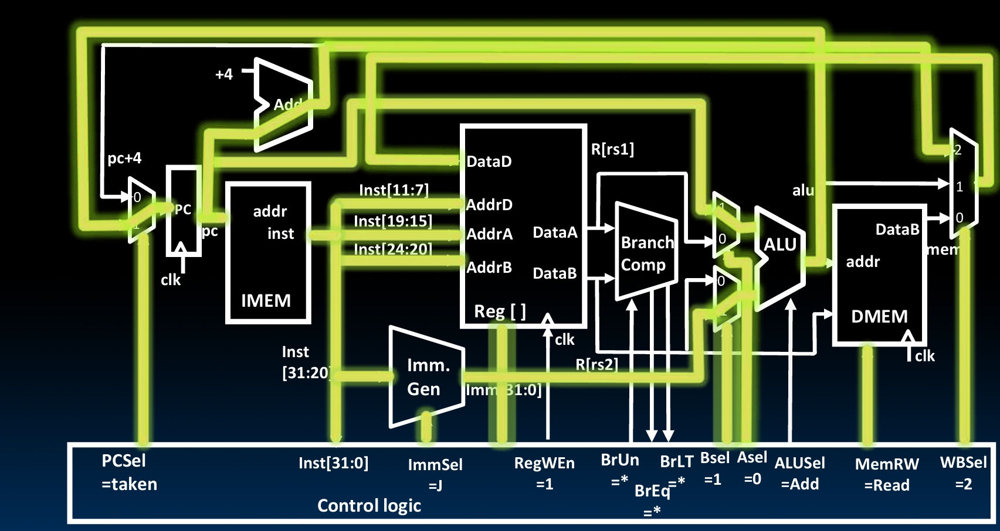

### Adding U-Type

Upper immediates! Super long 20-bit immediate!

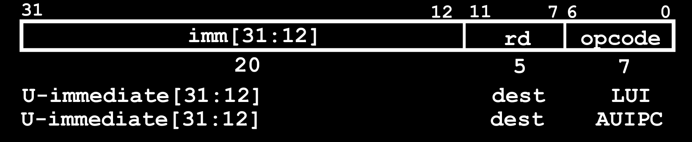

The jobs are super simple. For `lui`, just put the immediate to the upper 20 bits of the rd. For `auipc`, put the immediate to the upper 20 bits of a 32-bit word, add to the PC and put into the rd.

Anyway, the current datapath is more than qualified. Just add logic to the Imm. Gen so that it can generate the 32-bit immediate for `lui` and `auipc`.

No need for pictures anymore I guess?

### Datapath In Conclusion

I am just gonna put a picture here.

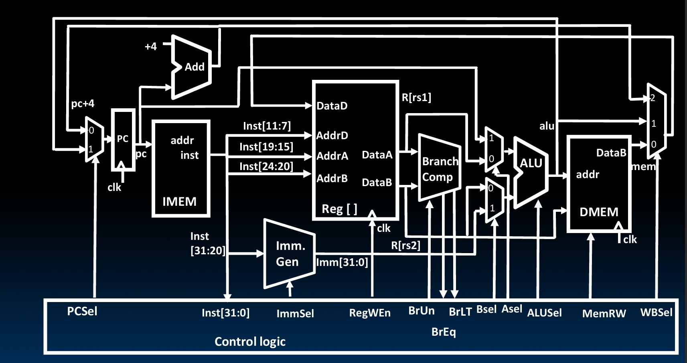

Isn't that cool? Tonight, try go to the bar and show it to the girls.

## Control

Yeah, it's not over. I know it's been a little long. But don't stop, almost there, almost there!

So we got the datapath, it's literally a lot of things. But not everything is used when executing one certain instruction. So we need something to control. Our goal of building a CPU is to fuck the world so good, now we got the dick, we still need a brain to move it right.

The control should be able to see the instruction, and automatically set all those signals and shits correctly.

Let's design it.

### Control and Status Registers (CSR)

We use control and status registers (CSR) to monitor the status and performance. To be clear, these registers are seperated from the regfile, not the same thing. Those are only 32, but there can be at most 4096 CSRs.

And to use them, we need CSR instructions. They are SYSTEM instructions, which are all in I-format.

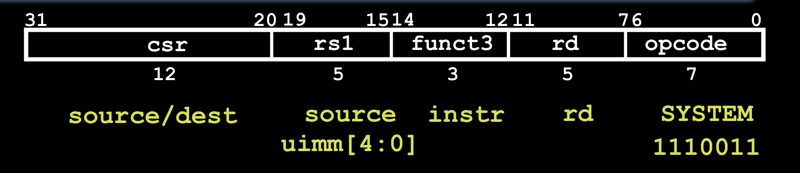

There are two types of CSR instructions.

One is the Register Operand.

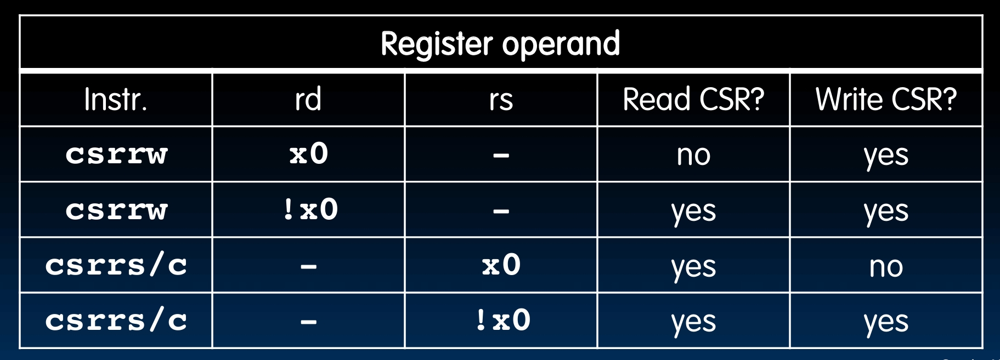

And another is the Immediate Operand.

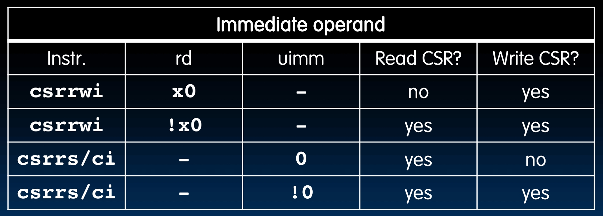

For immediate, the 5-bit uimm will be zero-extended to 32-bit.

Let's see an example, the `csrrw` instruction. This instruction 'atomically' swaps values of CSRs and integer registers. I will tell you about the 'atomically' part later.

Anyway, it reads the previous value of CSR and writes it into integer register `rd`. And it reads the value of integer register `rs1` and writes it into CSR.

Btw, when `rd` is `x0`, we only write rs1 to CSR.

```
csrrw rd, csr, rs1
csrrw csr, rs1      # Pseudo-instruction when rd=x0
```

And for the immediate version, the `csrrwi` instruction.

```
csrrwi rd, csr, uimm
csrrwi csr, uimm    # Pseudo-instruction when rd=x0
```

It just writes csr into rd, and then writes the uimm into csr.

There are also some other SYSTEM instructions that have nothing to do with registers, such as ecall, ebreak and fence. But we won't go deep into them.

### Datapath Control


You see this old friend? We haven't seen this picture for long. So the control got an input from the datapath, and it will output some signals to the datapath. And it also interact with the memory with enable read/write.


Check this out. The Control Logic gets the Inst[31:0] from the IMEM output, see it, and set all those signals up. So that the datapath will work fine.

With the previous talking, I think you are already pretty familiar with those signals manipulate everything stuff.

So that's the big idea.

### Instruction Timing

Before the control logic, I must say one more thing. The timing of instructions.

Let's see `add` as an example.

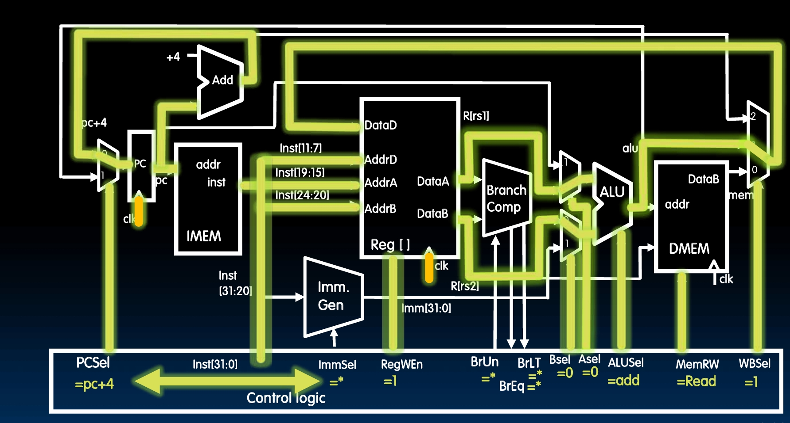

So in this datapath, what parts must run in order and what can run in parallel?

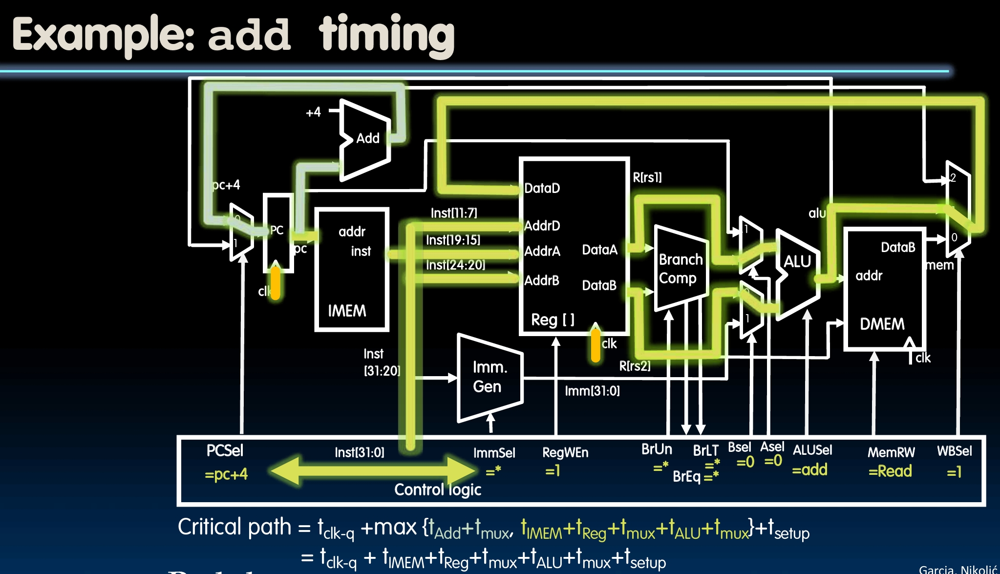

You see, obviously, at the same time of updating the PC, we do the five stages. So compare which takes longer, we get the critical path.

$$
Critical Path = t_{clk-q} + max\{ t_{Add} + t_{mux}, t_{IMEM} + t_{Reg} + t_{mux} + t_{ALU} + t_{mux} \} + t_{setup}
$$

Since the latter is longer

$$
Critical Path = t_{clk-q} + t_{IMEM} + t_{Reg} + t_{mux} + t_{ALU} + t_{mux} + t_{setup}
$$

Actually, not very bad. Of course, it doesn't interact with DMEM. Then what about the `lw` that does interact with DMEM?

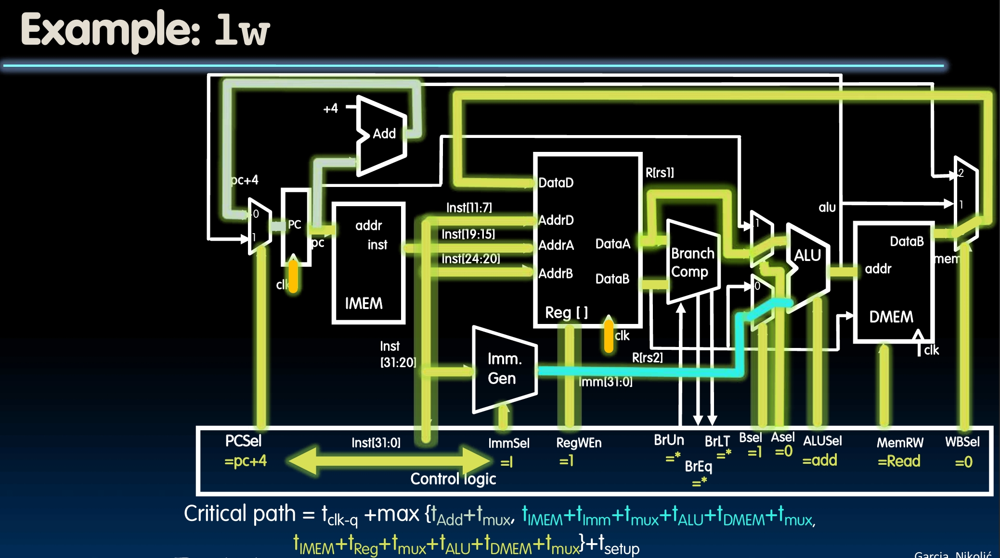

Will be longer ~

Maybe just outline some main stuff of the five stages and see the timing.

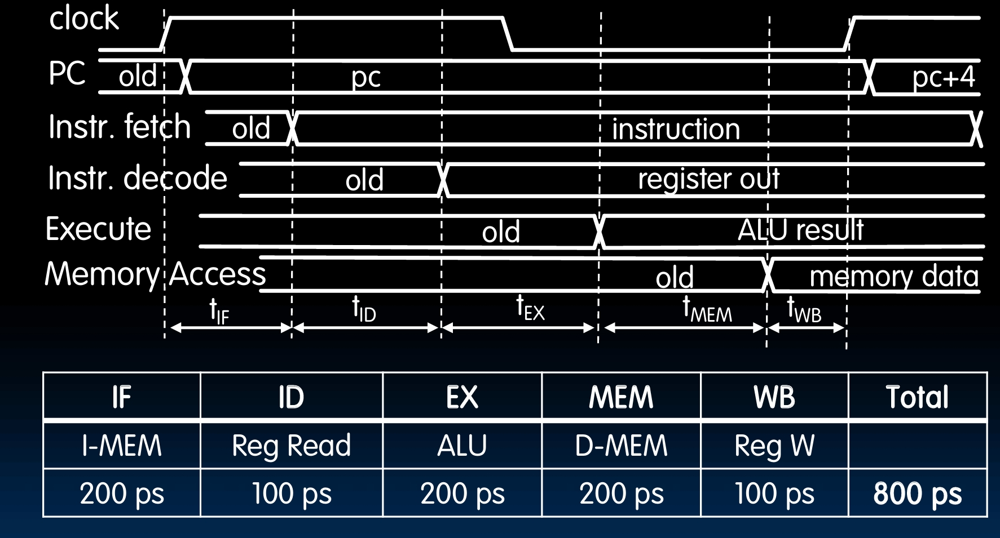

So you can see if someone use which of them.

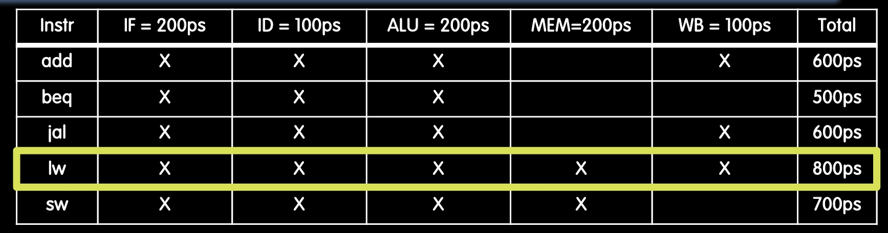

Wow, `lw` uses all of them? With these timing in the picture, the `lw` got 800ps in total? That is the longest. So for a clock cycle, we must be able to contain the longest one. The maximum clock frequency is $1/800ps = 1.25GHz$.

### Control Logic Design

We are finally getting there! So how, the fuck, does the control logic work?

Actually, what we are doing is implementing some sort of Truth Table. The ultimate truth table of Control Logic.

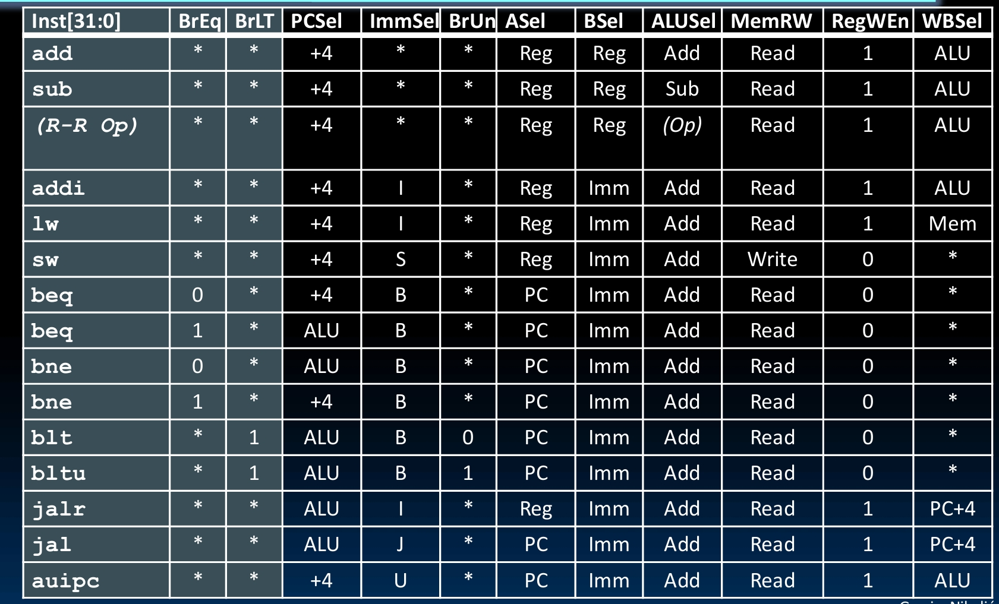

For every single instruction, we just write down the value of every single signal. Then we have this table.

To make it, there are two ways, the **ROM-based Control** and the **Combinational Logic**.

But before that, one thing significant. For both of them, you need to recognize the instruction. And RV32I is so good, that though its instructions are 32-bit, it only needs 9 bits to recognize what instruction it is.

The `Inst[30]`, the `Inst[14:12]` and the `Inst[6:2]`.

So let's get in, the ROM-based Control. It's basically checking table. It has an read-only memory, some sort of table in it. The inputs are the 9 bits, BrEq and BrLT, 11 bits in total. And it check the table and output a 15-bit control word, including all those signals.

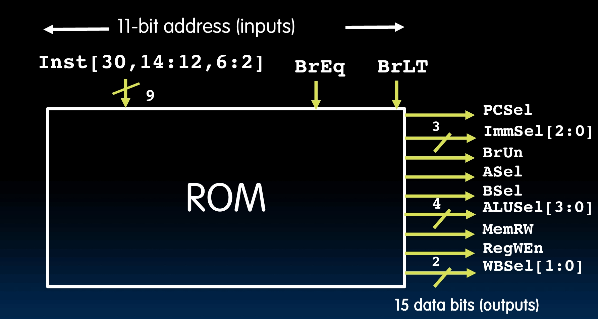

If you don't want to use ROM, you got to write a lot of combinational logic.

See this example，`bltu` and `bgeu` need to use unsigned comparison so the BrUn signal need to be 1.

How do we do that?

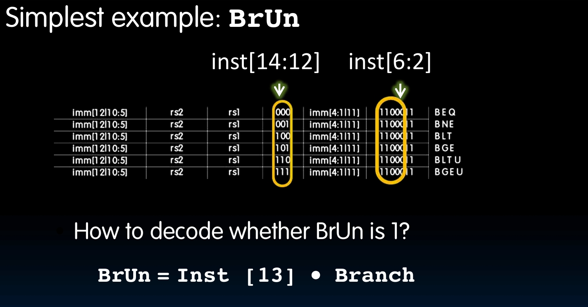

So to let BrUn be 1, got to be branch instruction. We see these branch instructions, only those two unsigned ones whose `inst[13]` is 1.

That would be easy to pick them up, just do a AND gate.

$$
BrUn = Inst[13] \times Branch
$$

This is actually the simplest one. Others might require more complex logic, but all can be done.

See this for decoding `add`.

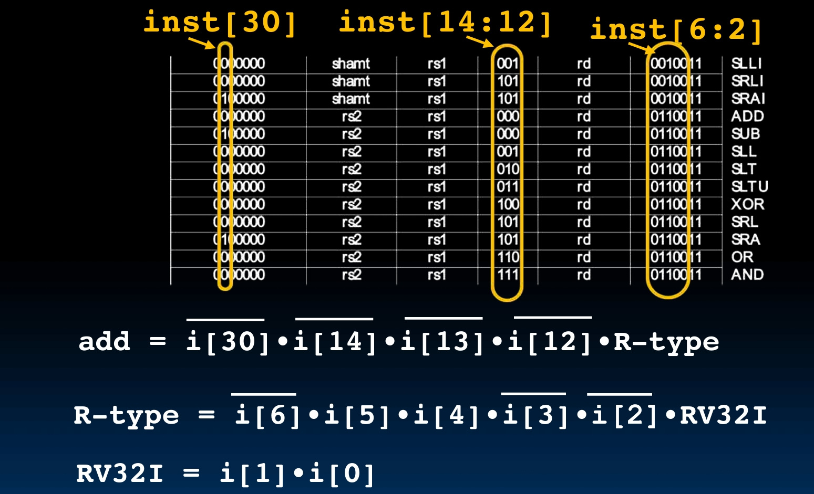

## Summary

Nothing to say, really, I have been saying too much.

Anyway, now we actually make the software and the hardware contact.

Cool, huh?
