# Synchronous Digital Systems

I learn this from these lectures:

[Lec14](https://www.learncs.site/resource/cs61c/lectures/lec14.pdf)  
[Lec15](https://www.learncs.site/resource/cs61c/lectures/lec15.pdf)  
[Lec16](https://www.learncs.site/resource/cs61c/lectures/lec16.pdf)  
[Lec17](https://www.learncs.site/resource/cs61c/lectures/lec17.pdf)

All the pictures are from the slides.

## Intro

We always start from the abstraction.

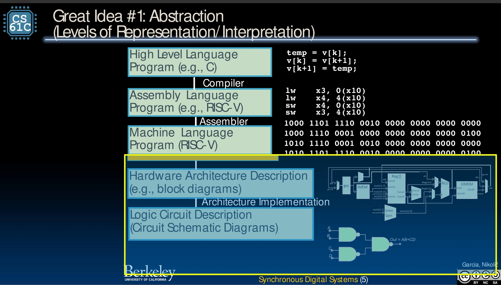

We have know about compile the C program into assembly language program, and we use assembler to turn the assembly language program into machine language program.

Why did we do that? Oh, yeah, because the hardware only knows shits of 1s and 0s. But how, how exactly does the hardware run those bunch of 1s and 0s?

So, we are gonna go down through the abstraction, to the level of Hardware Architecture Description and the one of Logic Circuit Description.

What we need is the **Synchronous Digital System (SDS)**. Synchronous means that all operations are coordinated by a central clock. And Digital means all values are represented by descrete values, electrical signals are treated as 1s and 0s and group up to form a word.

Modern processors, such as RISC-V, are Synchronous Digital Systems.

### Switches

So how do we represent the 1s and 0s with hardware? Intuitive approach is to use switches. In a simple circuit, you close it and turn on the light, that is 1. If you open it, the light is off, that is 0.

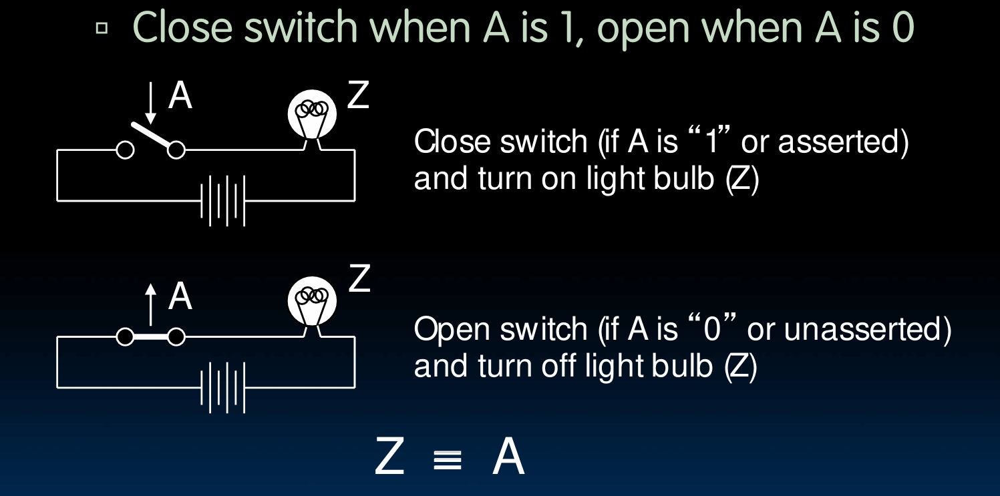

We can even compose them up to do more complex things. Like boolean functions. To connect them in series, we got `AND`, and in parallel, we got `OR`.

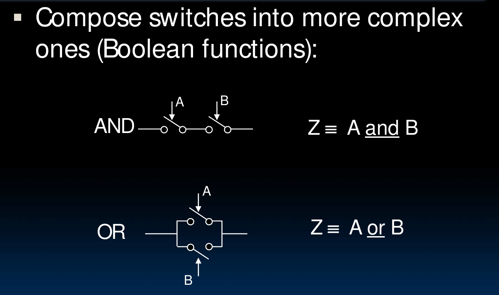

### Transistors

However, can you imagine you put like a million swithches into it when you try to build a computer? That would be just huge and slow!

We need something smaller and more efficient. And here it is, **transistors**.

Modern digital systems are designed in **CMOS**. MOS stands for Metal-Oxide on Semiconductor. C stands for Complementary, since we have normally-open and normally-closed switches.

MOS transistors act as voltage-controlled switches. There are three terminals on it, the **Drain**, the **Gate** and the **Source**. If voltage on gate terminal is higher than source terminal, then conducting path is established between drain and source.

There are two types of MOS transistors, as we talked about, the **n-channel** and the **p-channel**. The n-channel means its normally open and close when gate voltage is higher than source voltage. And the p-channel means its normally closed and open when gate voltage is higher than source voltage.

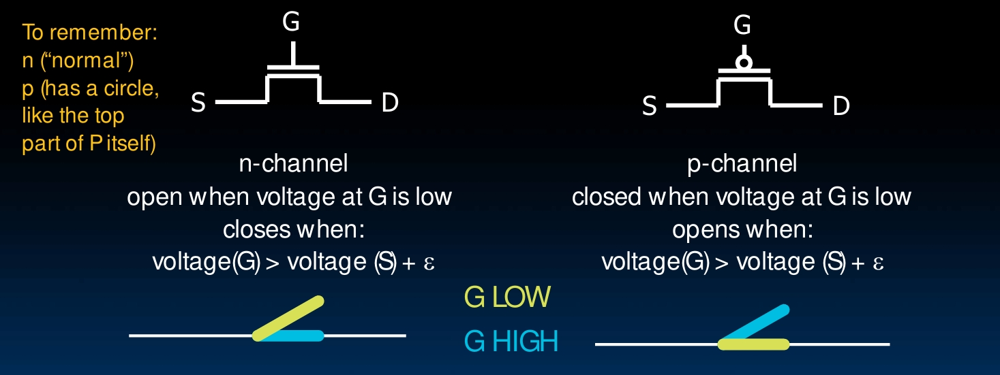

And by linking these little bros up, making some MOS networks, we can build some cool stuff. Look at this for an example.

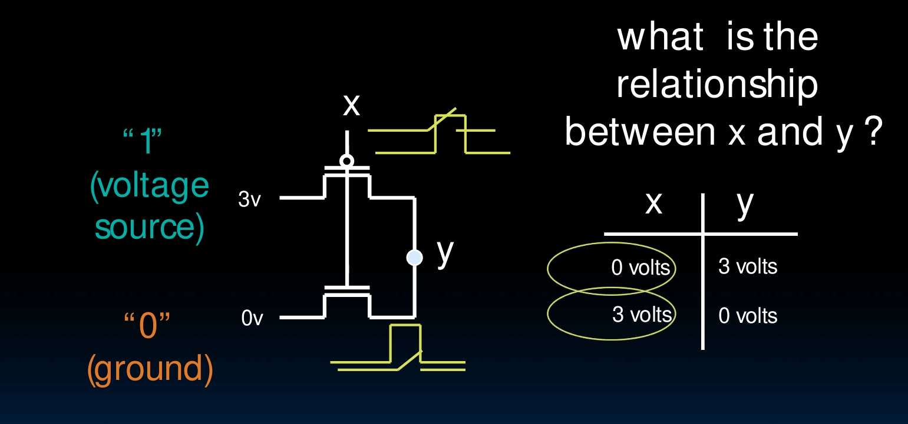

You can see the voltage source is 3v, and the ground is 0v. And we have this p-channel on the top and the n-channel on the bottom. Now when we input 0v at x, the p-channel is closed and the n-channel is open. So the output is 3v. When we input 3v at x, the p-channel is open and the n-channel is closed. So the output is 0v.

This is actually a **NOT gate**, an inverter. You give a True, you get a False, and vice versa.

Just like this, you use only transistors and wires to build useful bolcks, and then use them to build higher level stuffs. Kids, this is how I met you chips, chips are just transistors and wires.

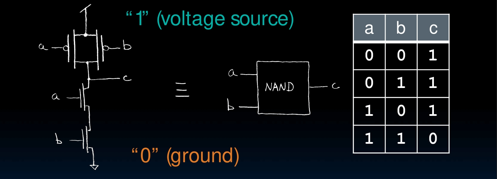

See this, on the left there is a CMOS network, two p-channels in parallel and two n-channels in series, two input a, b and a output c, stuff like that. Anyway, we can abstract it as this block **NAND**, you input a, b and you get c, c would be 0 only when a and b are both 1.

This NAND gate is the big bang point of our universe, you can actually make any logic gate with it. We have just make the NOT, but NAND itself is actually a NOT, if you input the same thing to a and b, you totally get the inverse of that thing. Though we have seen easier way to make it, but we can make it with only NAND gates.

How cool is that?

### Signals and Waveforms

We treat signals as only 1s and 0s, not caring that much about the exact voltage. Signal is transmitted through wires continuously. And it's effectively instant. Only 1 value got transmitted at a time.

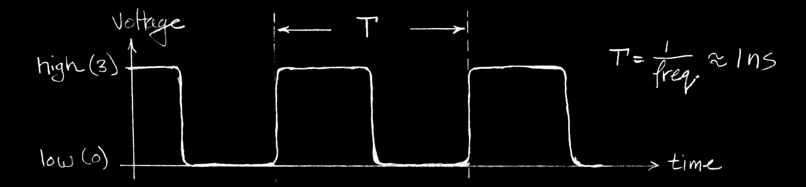

We have this clock signal. You can see the wave above, a T is 1ns. We use this to synchronize the whole system.

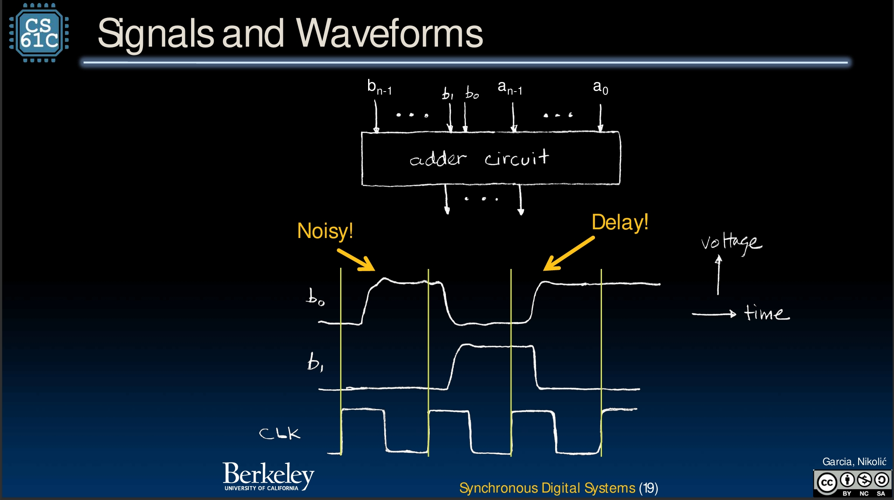

You can see in this picture that waves are not always look good. At the bottom there is CLK the clock wave for you to check the time. You can see the wave of $b_0$ got some shaking, that is the noisy because of different speed of defferent paths. And you can see a propagation delay.

Many wires group into one bus to show a binary number.

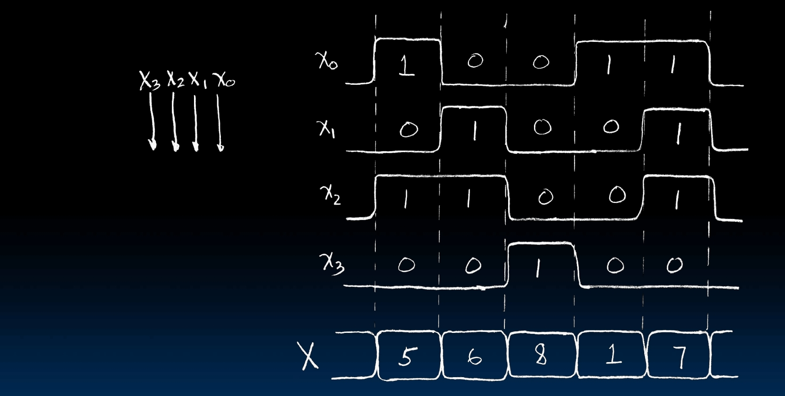

And there are some delays when doing some operations.

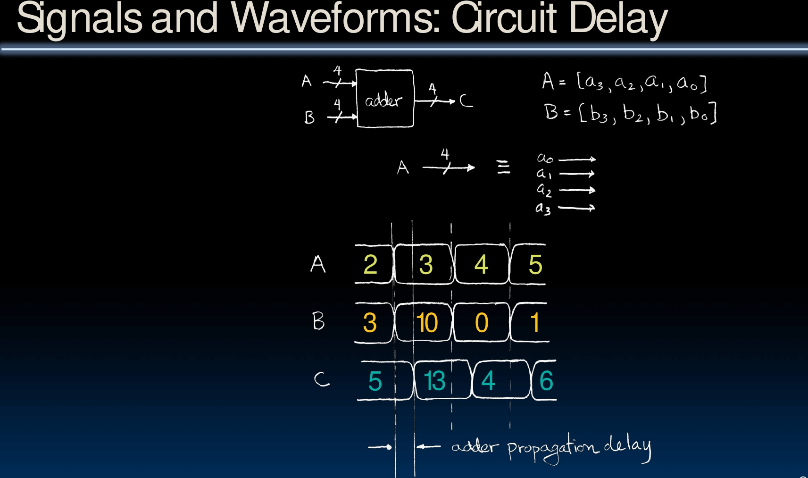

You see here the adder, we will talk about it later, add the two busses A and B up into C. But the C is a bit slower than A and B, since the adder need some propagation delay to do the addition.

### Types of Circuits

We have two types of circuits, the **Combinational Logic (CL)** and the **State Elements**. The combinational logic is like a function, output is determined by input only. But state elements store information.

Registers are typical state elements.

## State

### State Elements

Let's firstly talk about the state elements a little bit. It got two usages, one is to store information, like in registers, cache and memory. And another is to control the flow of information, holding up the movement of information at the inputs of combinational logic, so that you get some order or stuff.

See this example so that you can really understand what I mean. Say we have this accumulator program.

```
S = 0;
for (i = 0; i < n; i++) {
    S = S + Xi;
}
```

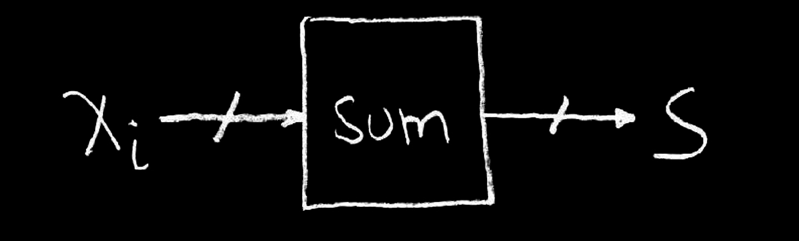

So you see `Xi` is applied in sussession, one per cycle. And we would finally get the sum `S` after `n` cycles.

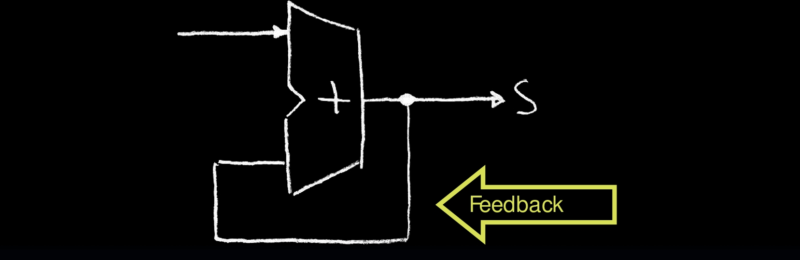

This is our naive first shot, what up? See this circuit in the above picture. We just simple feedback the output every cycle to the input.

This won't work, since there is no way to control the iteration of `for` loop, it got add up, it instantly input and keep adding up. You can't make it add once every clock, and not even able to stop it. Also, we can't represent the `S=0` kind of stuff in the circuit when we initialize it.

How do we fix it? The trick is to add a register.

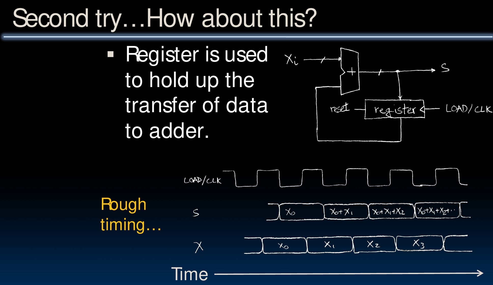

So now the register stores the value of `S` every cycle, and renew it exactly once every clock. And if we need to represent 0, we just reset the register.

Thank god, I can trust again.

### Flip-flop: Inside Registers

We have been really talking about the registers a lot, in RISC-V, and now in here. But we regard it as something highly abstracted, something that can store and load, not caring that much about how it actually works. Well, it's the time to really see it.

So inside a register, is actually n instances of a '**flip-flop**'. It's something that the output flips and flops between 0 and 1.

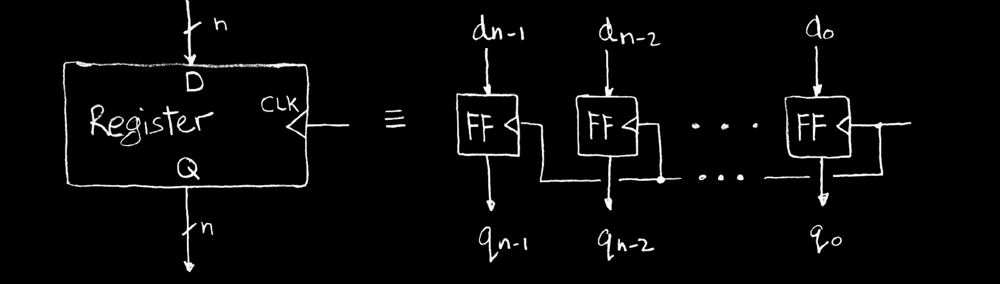

You can see there we got n flip-flops parallelly, can store n bits binary number.

Flip-flops are edge-triggered. Here we use D for data input and Q for output, so we called this D-type flip-flop. For D flip-flop, it's 'rising edge' triggered, meaning the input d is sample and transfer to the output q at the rising edge of the clock. All other times the input is ignored. There are also 'falling edge' triggered flip-flops, and 'both edge' triggered flip-flops, but we won't cover.

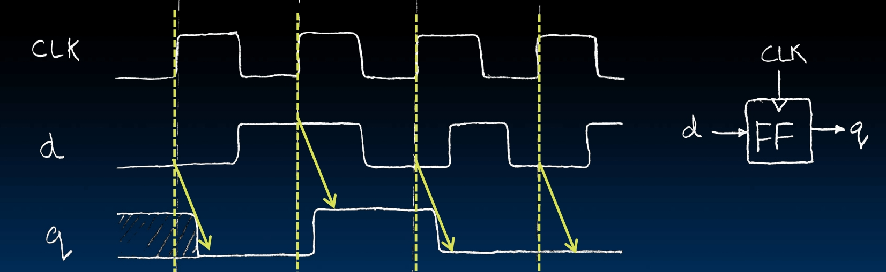

Of course things are sort of more complicated than this. The sampling done right requires the d to be stable for a while before the rising edge, which is the 'setup time', and stable for a while after the rising edge, which is the 'hold time'. And it takes a while to make a difference at q, which is the 'clk-to-q delay'. These are what you need to consider when designing a circuit.

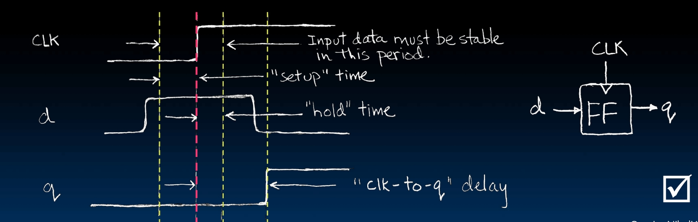

### Pipelining

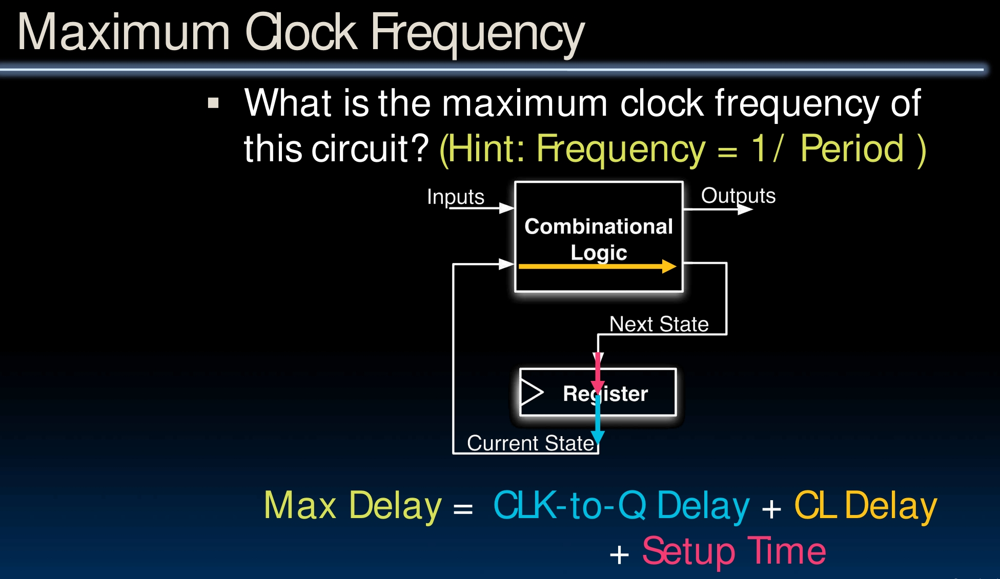

See this circuit above, this is pretty standard. Current state is stored in the register, and input to the combinational logic, then the output is stored in the register as next state.

We have know it pretty well, but now we got to see it's performance. Consider the max delay, there are CLK-to-Q delay, combinational logic delay and the setup time.

It's just too much time, that if we want it works out fine, we need a quite long clock. Then the frequency is low.

What we need is **pipelining**, whose big idea is to simply add extra registers to split a long combinational logic up. So that we can reduce the combinational logic delay that we need to consider in one clock. However, since we introduce some registers cost and stuff, the in total latency is increased. Got to make some trade off in real life bro.

See this example.

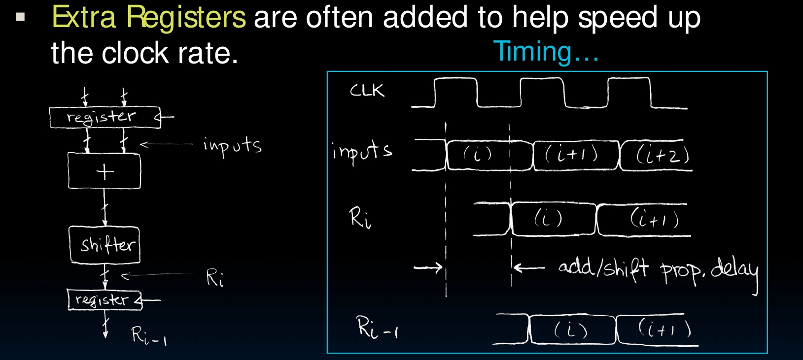

We have this combinational logic. Input goes through an adder and then a shifter. So in one clock, we must consider the delay of both of them.

But after we add a register between them.

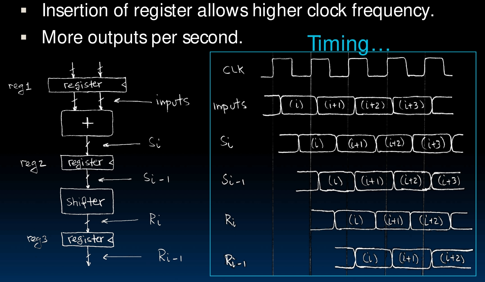

In one clock, we only need to consider the delay of one part, the larger one of course. Anyway, we got higher clock frequency now. More outputs per second!

### Finite State Machines (FSM)

To design complex circuits, we can't just write every transistors down or something. Got to have some abstraction. Combinationl logic and state elements are cool abstractions, but still can be abstracted into something simpler.

So we have this **Finite State Machine (FSM)**. The big idea is that the function can be represented with a 'state transition diagram'.

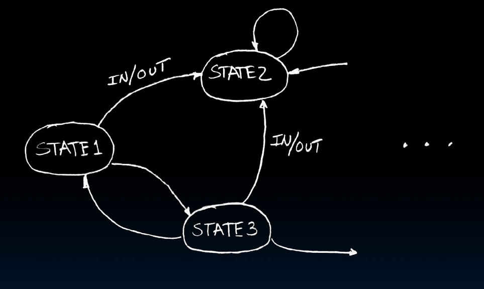

Right? Everything is basically just some states and how do you transition between them.

For example, if you want to detect the occurence of 3 consecutive 1s in the input, you can draw this FSM out.

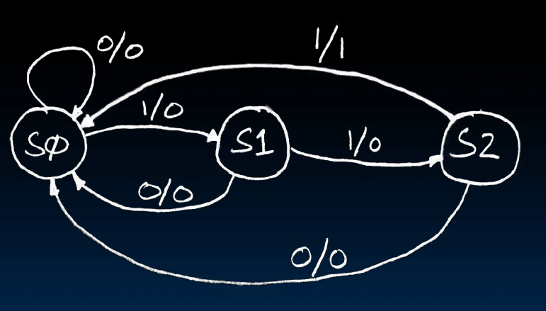

And with what we already have, the combinational logic and registers, we can build any FSM in hardware.

The register got to hold the representation of which state the machine is in, the **present state (PS)**. And the combinational logic circuit actually implement the function, mapping the PS and input into the **next state (NS)** and the output.

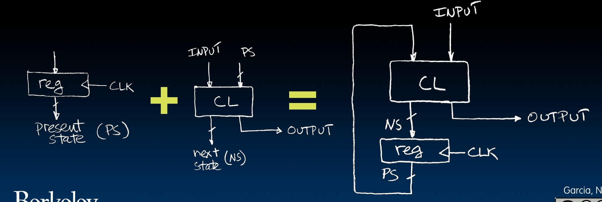

Combinational logic can be represented with a truth table form. Here is one example for the above 3-one FSM.

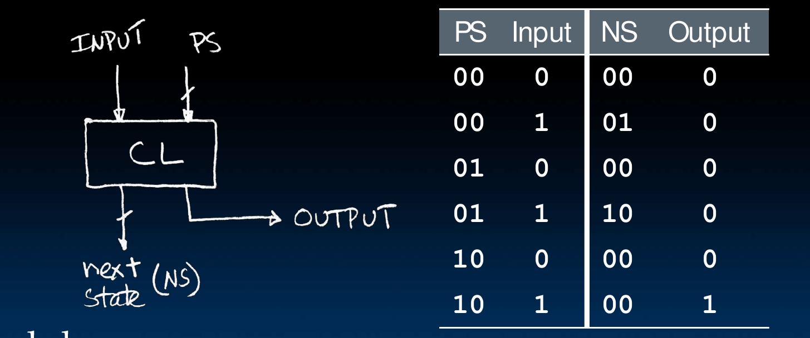

For the implementation detail, we will get there soon.

I think till now, we have known the SDS big picture pretty well. A SDS is a bunch of CLs and registers. Registers split the CLs up, CLK links to all of them to ensure synchronization. So information flows through the CLs, one block per clock, from register to register.

## Combinational Logic

Yeah, I just said we will get here soon a few lines ago. And by soon, I mean soon.

Let's dive deep into these CLs' implementation. It actually got three ways to represent them, you should understand them and the transformation between them well to design a good CL.

### Truth Table

TT! Which we have just seen.

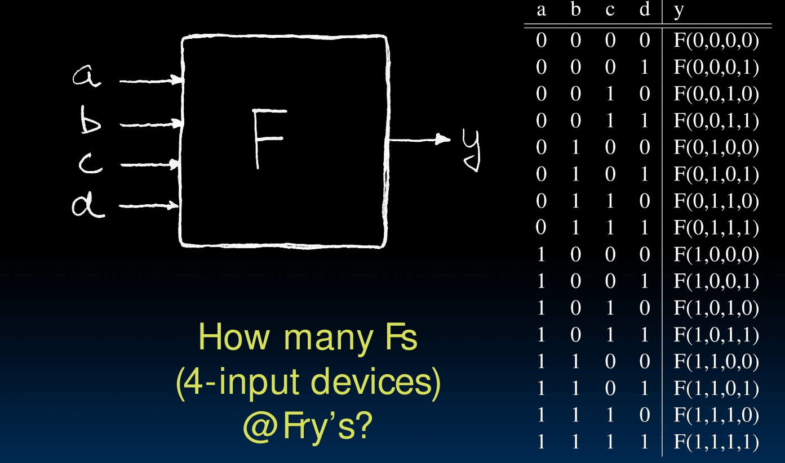

If your CL got $n$ bits of inputs, then you got $2^n$ rows in the truth table. It outlines all the possible input combinations and the corresponding output.

See I said n bits of inputs, not n inputs.

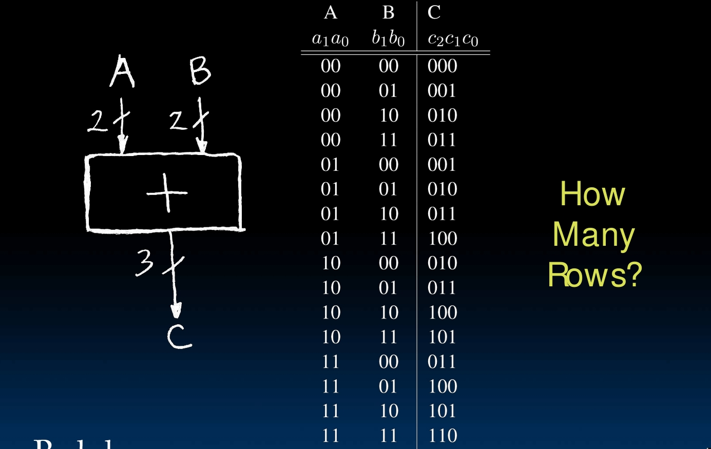

This is a 2-bit adder. It only got two inputs, but each input is 2 bits so 4 bits in total. That's why it got 16 rows in the truth table.

So this is simple, clear, but what is so bad is that there is an exponential growth of the number of rows in the truth table. If you got two inputs, both with 32 bits, then you got $2^{64}$ rows in the truth table. That's just insane to write those shits down when designing a circuit.

### Logic Gate

If truth table is too abstract, the logic gate is pretty realistic. It's basically drawing some abstract version of circuit down.

Here are some basic logic gates.

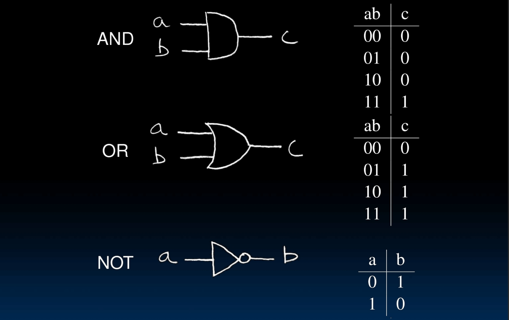

AND, OR and NOT. You can see the AND and OR look similar, but AND is more like a D while OR is not that much. See the picture and you got my point.

I believe you are already pretty familiar with them. AND means only output 1 when both inputs are 1. OR means only output 0 when both inputs are 0. NOT just gives the inverse of the input.

Here are some extension logic gates.

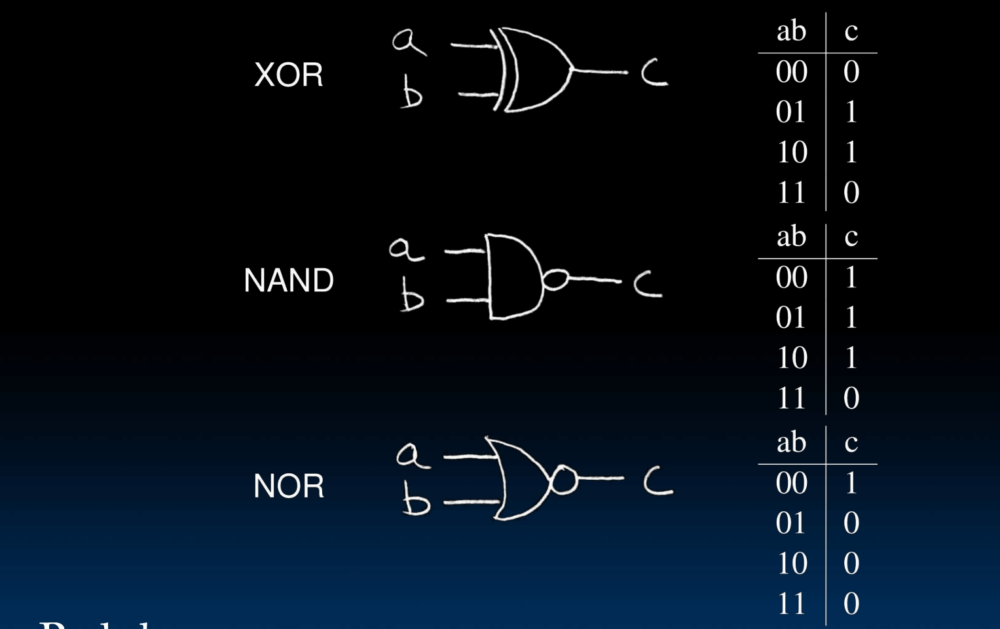

XOR means output 1 when two inputs are different. NAND literally means NOT AND, so only output 0 when both inputs are 1. NOR means NOT OR, so only output 1 when both inputs are 0.

Above are 2-input versions, you can also easily turn them into n-input versions.

Well, not that easy only when you do XOR. Actually, output 1 when the number of 1s in the input is odd.

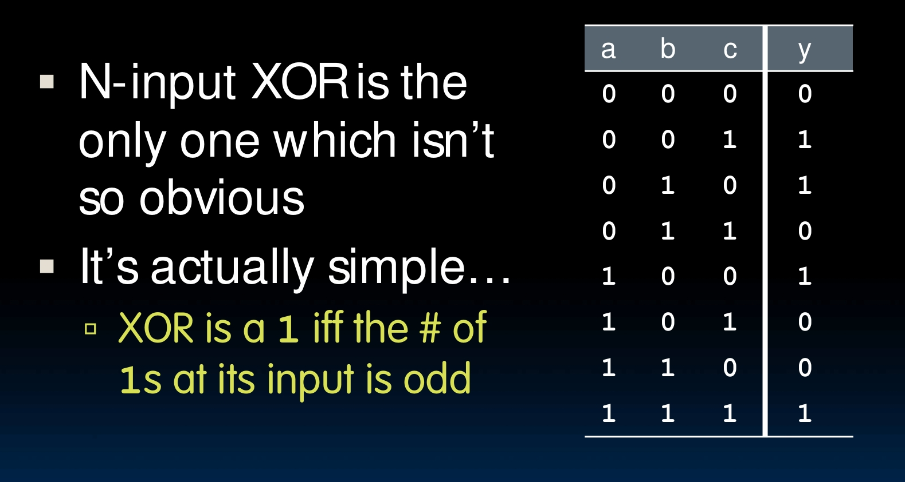

And here are two examples of transformation from truth tables to logic gates.

This is a majority circuit.

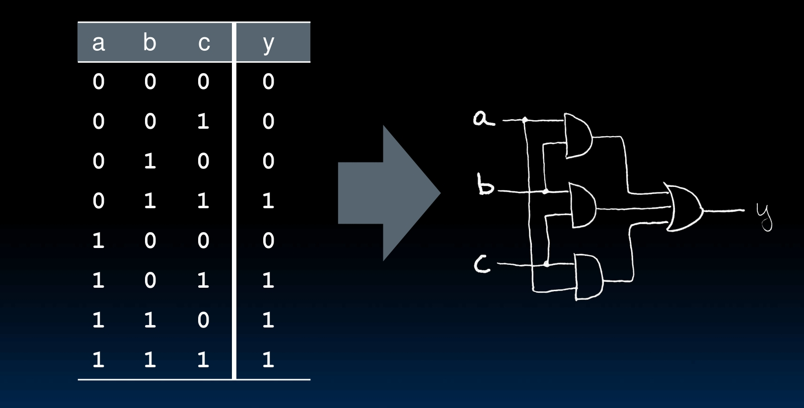

And this is the FSM circuit.

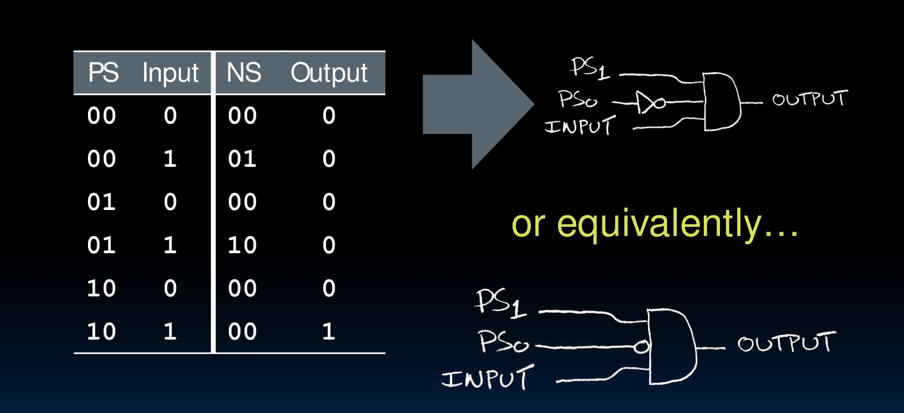

### Boolean Algebra

So now we got the truth table, and the logic gate. We can make it very clear and very realistic. But how do we know is it the best circuit for this certain function? Maybe we can build it with less gatea or something.

Obviously, what we need is something very math, you know what it means when used as an adjective. We can represent any circuit with a bunch of math operations and variables, and we have some rules that can be used to simplify the circuit.

Here you are the **Boolean Algebra**.

The reason of why it is so good is that there is an one-to-one correspondence between circuits made up by AND, OR and NOT gates and equations in Boolean Algebra.

Boolean Algebra is actually very simple, addition means OR, multiplication means AND, and complement (bar) means NOT.

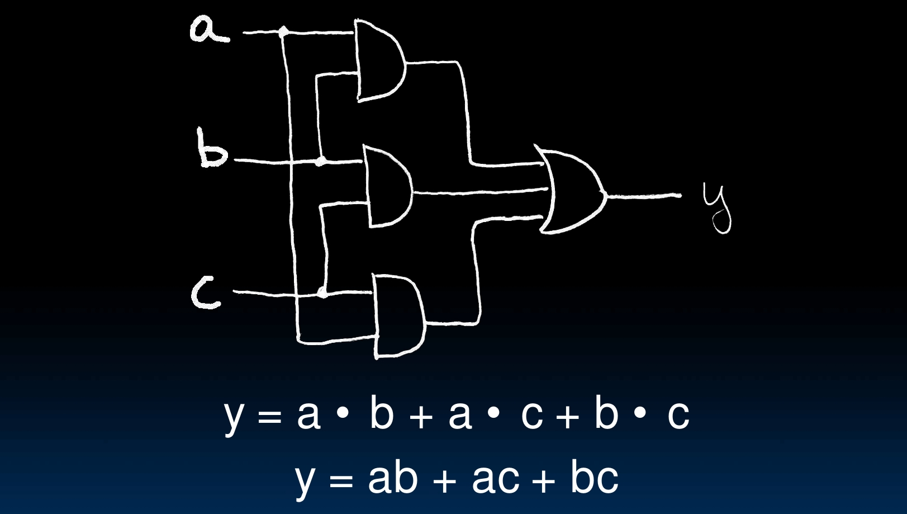

This is an example of the majority circuit in BA.

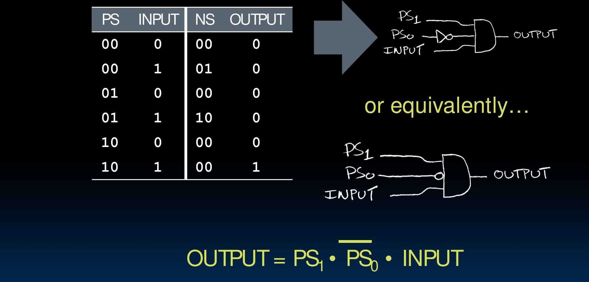

And this is for the FSM example.

About the simplify thing, I also have this example to show you my point.

Say the circuit is this in BA:

$$
y = ab + b + c
$$

Obviously, we can take b out:

$$
y = b(a + 1) + c
$$

And we know that $a + 1$ means a OR 1, which is definitely 1. So:

$$
y = b + c
$$

And we got a simpler circuit, actually, only an OR gate!

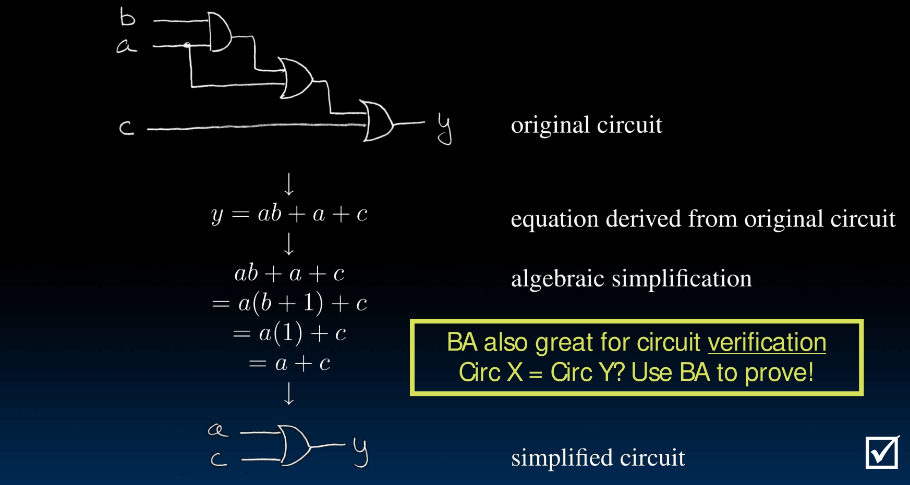

And its also good for verifying that if two circuits are equivalent, no example needed I guess, you must see my point.

Here is some laws in BA, I won't talk about them one by one, since you can easily understand them if you know what AND, OR and NOT means.

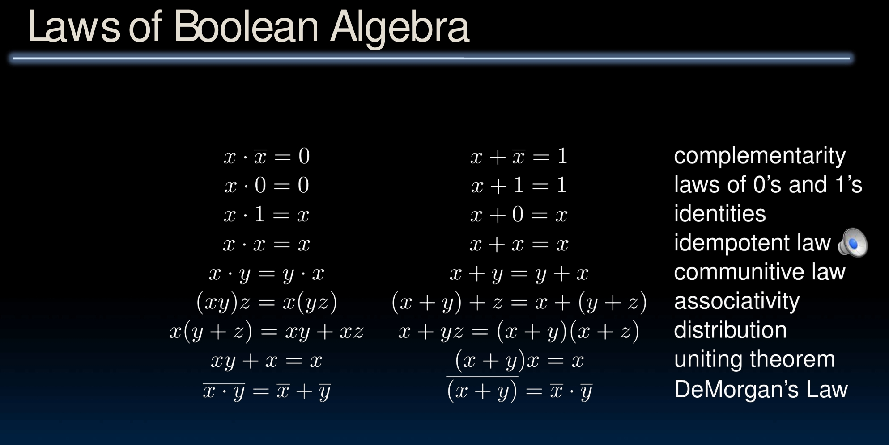

But we only see this is powerful, but we need a guarantee way to do this. So here is a standard way to turn a truth table into a circuit, the **Canonical Forms.**

We got actually two types of canonical forms, the **Sum of Products (SOP)** and the **Product of Sums (POS)**. They are basically the OR of ANDs and the AND of ORs. Let's just use SOP.

So the approach is that for every row in the truth tabe that has output 1, we write down an AND term for it, and then OR all of them up. I think you would understand my strange verb usage.

Here is an example.

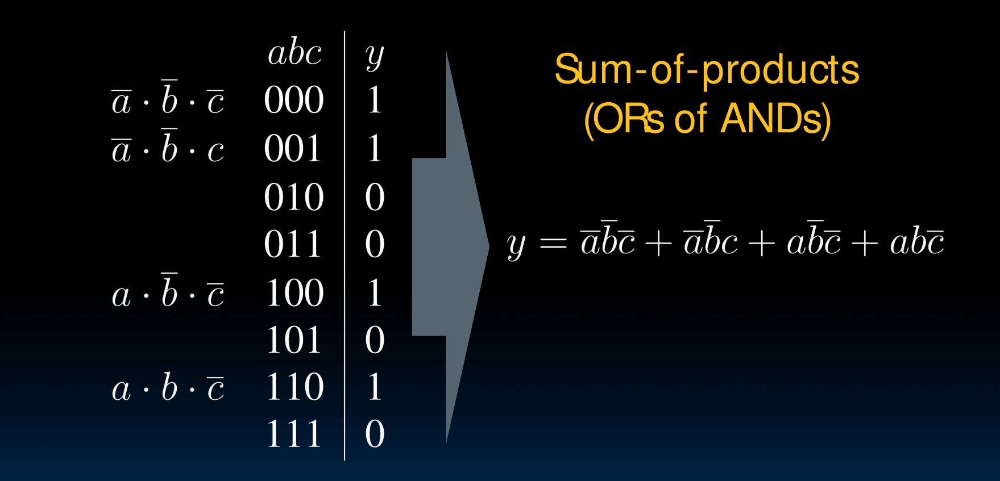

You can imagine the result is pretty complex at the first time, but it provide us a guarantee way to find a correct starting point. And then we do a little simplify, and we got this.

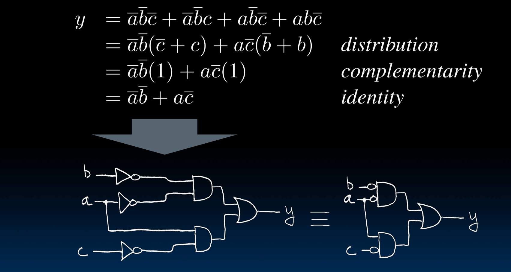

## CL Blocks

So we know CLs pretty well, but is it really that good? Why don't we really build some shits up? Also as examples for stuffs that we just learnt.

### Multipexer (MUX)

This is basically select one of the inputs to the output, according to a select signal.

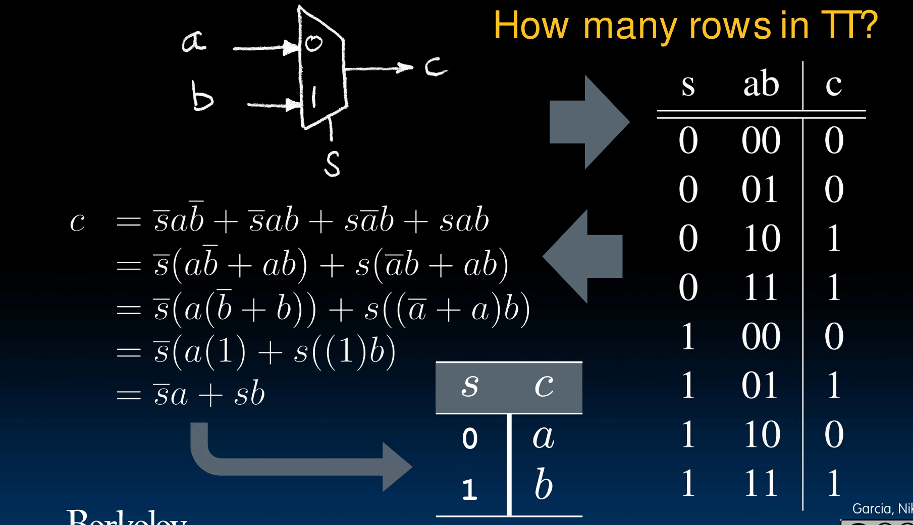

See this for the 2-to-1 MUX, look how we build the truth table, write the SOP and them simplify it into this $y = \bar{s}a + sb$.

And we can build this circuit according to this simplified expression.

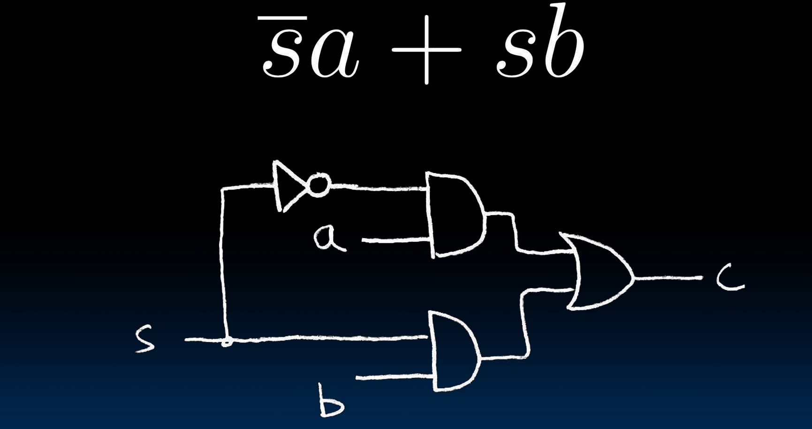

You can see it, right in your face with this exact meaning of the simplified expression. One NOT gate for $\bar{s}$, one AND gate for $\bar{s}a$ and one AND gate for $sb$. And finally an OR gate to combine them up.

We can also build a 4-to-1 MUX, but you can imagine the truth table would be super big. It could be pretty simple if you try to make it hierarchical.

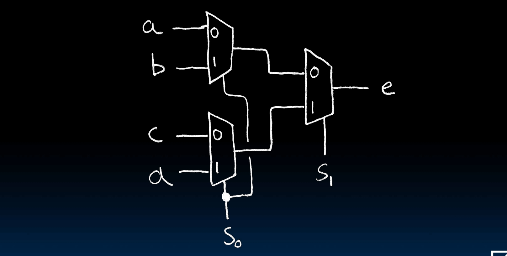

### Arithmetic Logic Unit (ALU)

So MUX is used to do selecting, but where? Actually, in most processors, there is this Arithmetic Logic Unit (ALU), which is used to do arithmetic and logic operations. By controling the select signal, we can use the muxes inside to make it do different operations.

We will talk with a simple one that do add, subtract, bitwise AND and bitwise OR.

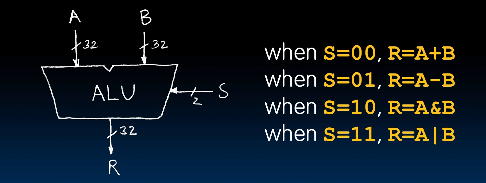

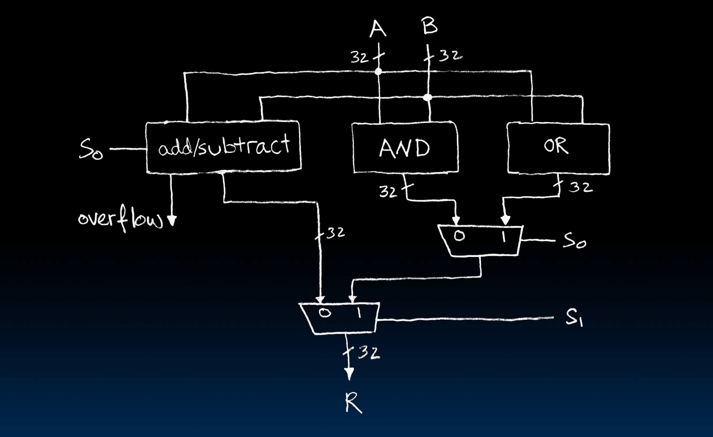

Let's make the adder and subtracter.

At first, for simplicity, we focus on the one-bit adder, which we can build with the truth table and canonical forms way.

For the lowest bit, it's the most simple one.

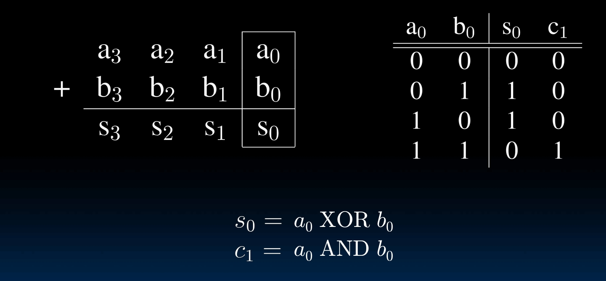

It's simple, right? Just $s_0 = a_0 XOR b_0$. And a carry $c_1 = a_0 AND b_0$ for further use.

For the higher bits, we got to consider the carry from lower bits.

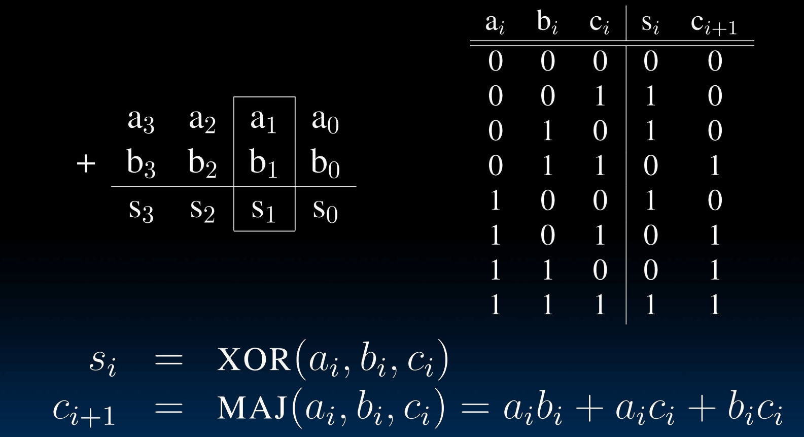

So we have $s_i = XOR(a_i, b_i, c_i)$. And $c_{i+1} = a_{i}b_{i} + a_{i}c_{i} + b_{i}c_{i}$.

And we can make the circuit with this.

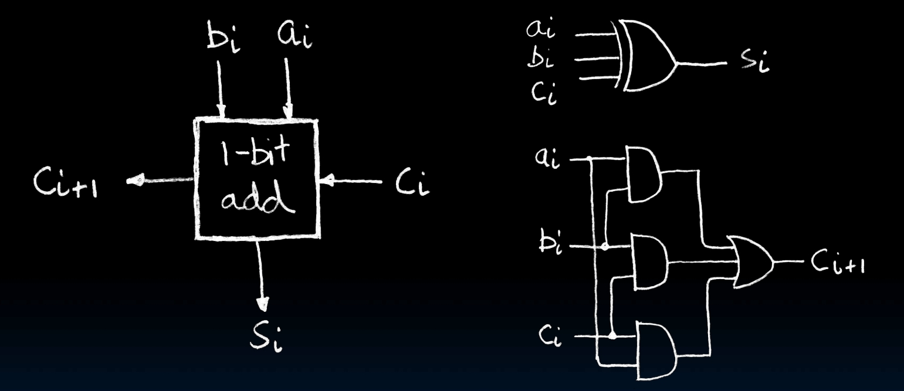

But finally, we must got an n-bit adder. To do that, we just link them in series, and make one bit's carry output the next bit's carry input.

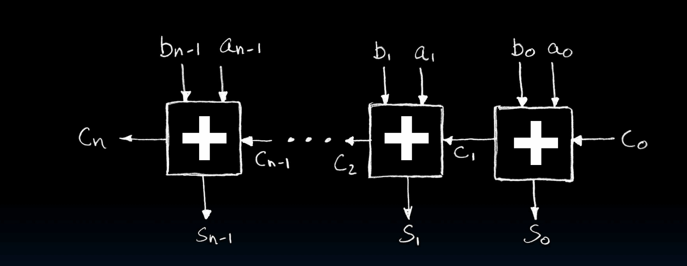

For subtracter, we can just use the adder, $A - B = A + (-B)$.
