# Virtual Memory

I learn this from these lectures:

[Lec28](https://www.learncs.site/resource/cs61c/lectures/lec28.pdf)  
[Lec29](https://www.learncs.site/resource/cs61c/lectures/lec29.pdf)  
[Lec30](https://www.learncs.site/resource/cs61c/lectures/lec30.pdf)

All the pictures are from the slides.

## Motivation: Operating System

So what we got so far is like this.

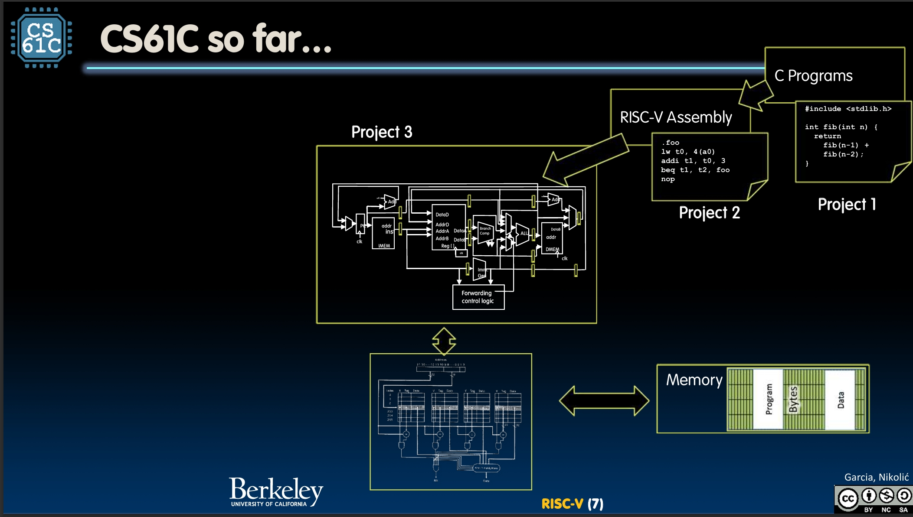

It still need an I/O (Input/Output) to interact with the outside world, like keyboard, screen, etc. But we will talk about this later.

The most important thing is, this is still not like my laptop at all!

With what we have built, we can only run one program. But opening my laptop, I can use my browser, my cursor, my PowerPoint and my telegram at the same time. Not only one program being run but a lot of them synchronously.

Yeah, but this is not about hardware, but only software. To be specific, the Operating System.

Well, I won't go very deep since this is another big course. But some basic ideas would be necessary.

### Operating System Basics

OS might be the biggest piece of software in your computer, with millions of lines of code. But really, what does it even do?

When you start your computer, OS is the first thing that runs. It finds and control all the devices in the machine, via some hardware called device drivers. And it starts tons of services, such as file system, network, etc.

More importantly, it loads, runs and manages all the programs. It needs to allow multiple programs run synchronously. It needs to isolate them from each other. And it needs to multiplex resources.

The core of OS is basically only doing two things: **Isolation** and **Interaction**. It makes sure that every running program runs in its own little world. And it provides interaction with the devices.

Since we are talking about hardware, what does OS need from the hardware?

### Operating System Functions

Let's first see how OS works.

Now if OS is just another software running on the CPU, how can we ensure that it manage all other programs, but not being affected by them? Like, why won't another application modify the memory of OS?

The trick is to give the CPU at least two running modes: **User Mode** and **Supervisor Mode**. Setting by a status bit in a special register.

Supervisor Mode is basically only for the OS. If a process was not in supervisor mode, it can only access a subset of instructions and physical memory. But it can't change anything else.

Sometimes, it does need to do something with higher privileges, like reading a file, launching another process, asking for more memory or sending some data. At this time, it needs to call an OS routine, to let the OS do for it. This is called **Syscall**.

OS will perform the operation under the supervisor mode, and return to user mode, continuing the process.

So we transition to supervisor mode when one of these happens, the **interrupt** and the **exception**.

Interrupt is external stuff to the running program. Exception is something done by the running program, like accessing a memory address it isn't supposed to.

And **trap** is what we called the action of switching to the supervisor mode and jumping to the interrupt or trap handler.

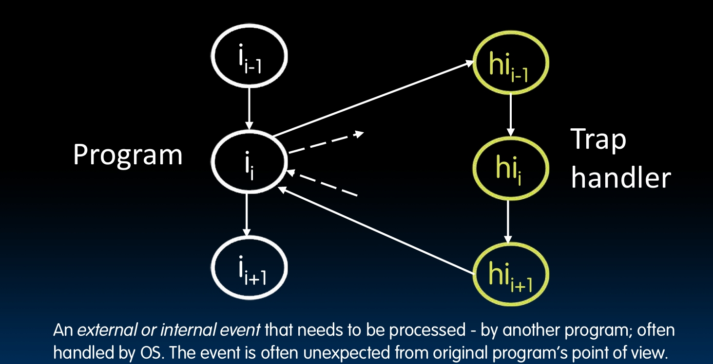

Now this **precise trap** is a serious requirement for hardware. You see the program runs to the instruction, and something must be processed by the OS happens. At this time, the CPU must make sure every instruction prior to the trapped one (e.g., memory error) has completed, and no instruction after the trap has executed. So go tothe trap handler, handle the interrupt or exception, and then return to the exact position and continue to run the next instruction.

If the hardware can't ensure this, the OS can't work. It's tricky for big complex CPUs, but is more than necessary. However, we won't go deep into this, just know this is quite enough.

Bisides the story between OS and process, we also got a story between process and process. You see, the OS runs all the programs synchronously, but really? Certainly no, unless you got an CPU for each process.

The reality is it does something called **multiprogramming**. Basically, it runs a program for sometime, maybe set a timer, and switch to another. This is called **context switching**. This switching thing happens hundreds of times per second, so it make you feel that all of them are running at the same time. To decide which to be run, it's called **scheduling**, we won't go deep into this.

Anyway, though I talk, talk and talk, these above are actually just let you know, quite useless. My real point is, supervisor mode is not good enough to totally isolate the process from each other or from the OS.

Application can overwrite another application's memory. But more importantly, the **address conflict**.

We have talked about that the CPU have the address of next instruction in PC. But start at what address is being written into PC by OS, copy from the executable file. How is that possible? How can it know the address of the start instruction in every computer?

So it have to assume that this program starts at a fixed address, e.g. 0x8FFFFFFF. But how can all those program use the same address?

Also, we may want to address more memory than we usually have. Just, don't ask me why.

So these three problems, the protection, the address conflict and the capacity.

We will nail them all by using **virtual memory**.

## Virtual Memory

The big idea of virtual memory is to provide a illusion of very large main memory for programs.

To do that, we must have two types of address: **virtual address** and **physical address**.

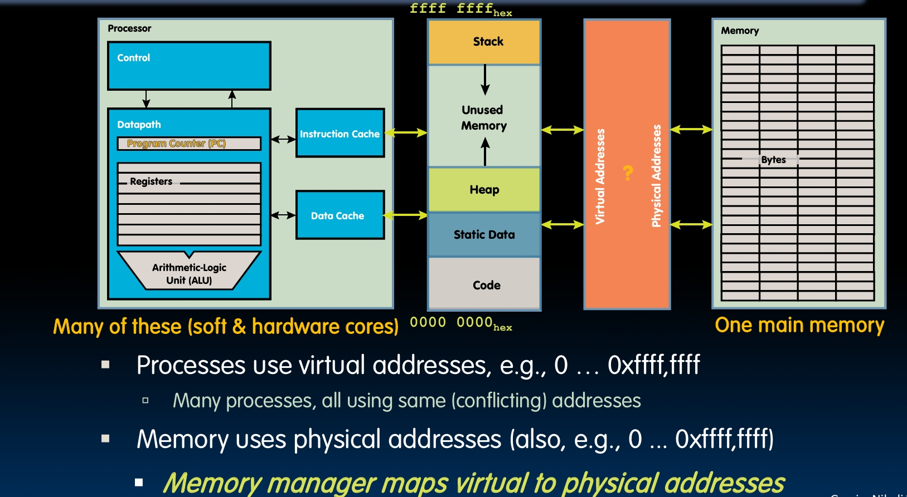

Processes use virtual addresses, and many processes can use same virtual addresses. Memory uses physical addresses. There is this memory manager to map virtual to physical addresses.

In other words, process has a virtual address space. And there is a certain piece of physical address space in the physical memory. The process don't know about the physical address space, the job of the memory manager is to map the virtual address to the physical address.

The virtual memory is all about implementing this memory manager.

### Memory Manager

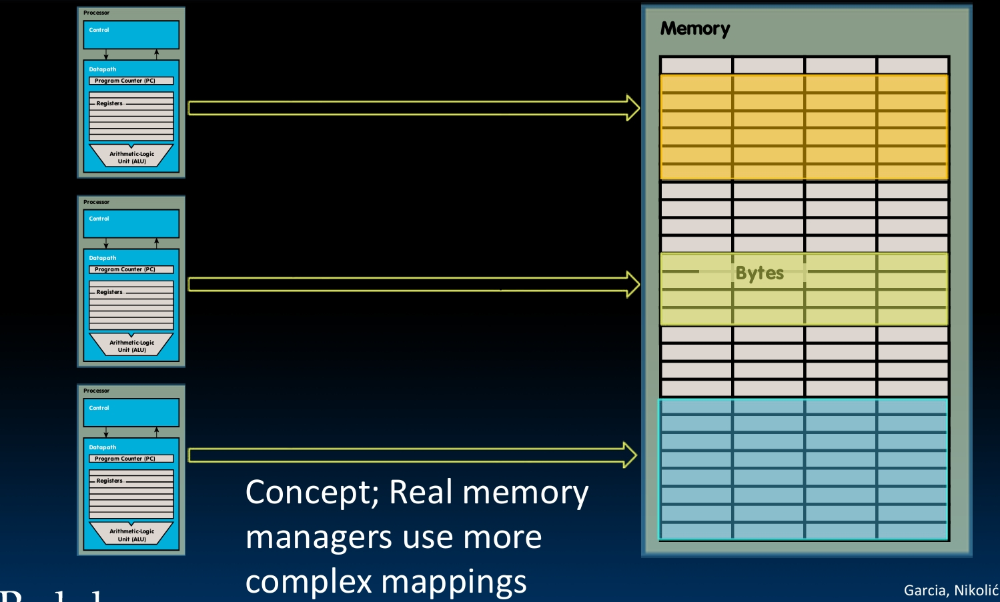

So, the memory manager maps each process to different part of physical memory. You can see this pictual for a conceptual idea, the reality would be more complex.

Anyway, so this needs to fix our three problems. It need to do the mapping so that no physical address conflict. It needs to do the protection, isolate the memory between processes so that they won't mess with each other. And to make the large memory illusion, it need to swap some memory to disk.

The trick to do these is the **Paged Memory**.

### Paged Memory

The super idea is to break the physical memory into 'pages'. Typical page size is 4KiB+. (Ki is 2^10, so KiB is 1024 Bytes)

It needs 12 bits to address 4KiB.

So the virtual address uses it's lowest 12 bits to be the offset, and the upper 20 bits to be the page number.

To be clear, this page number here is actually a **virtual page number**, since if it's the real physical page number, then we still got conflict.

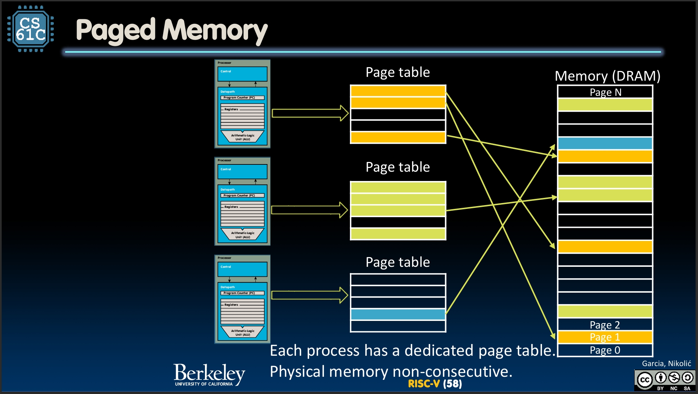

This is what real paged memory looks like. You can see that physical pages of each process are not even continuous. However, each process got it's own **page table**, which looks like a continuous memory.

The virtual page number is actually telling you which entry has my physical page number.

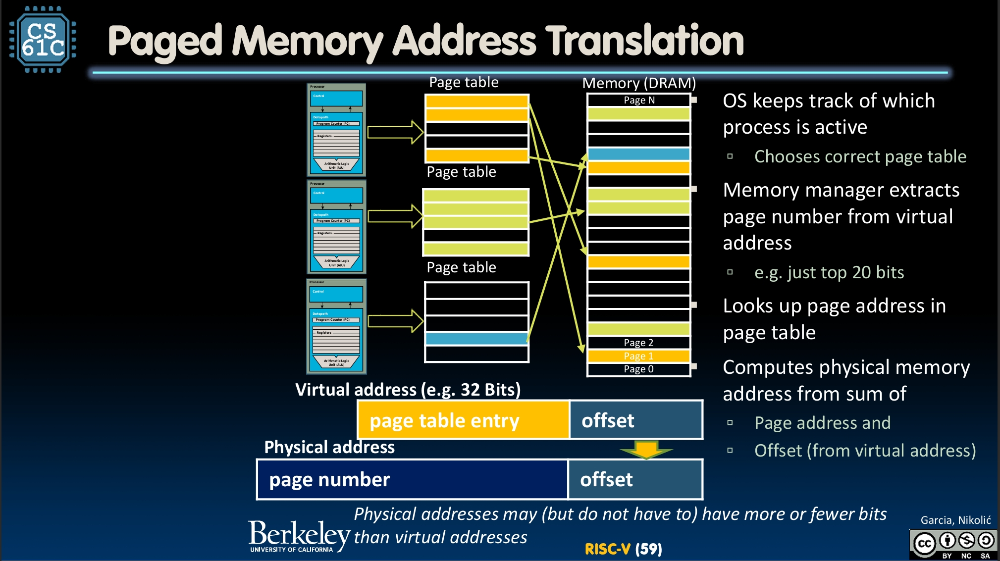

So OS keeps track of which process is active, so that it can choose the right page table. The process gives a virtual address, and the memory manager extracts the virtual page number, or in other words, the page table entry. Then it looks up page address in page table. Finally it computes physical memory address from sum of page address and the offset.

This each process has it's own page table thing also does the protection. It keeps processes from accessing each other's memory.

By the way, sharing is also possible. Like two processes might need to read the same library of C language. Just let the OS assign the same physical page to different processes.

Also, with this table, we can do the **write protection** easily. Just have a bit for each entry, to set whether this can be written or not. If write to a address that is protected, exception.

The page table itself is also stored in the main memory. So like when cache miss, we need to actually access memory twice. The first time to check the table, and then goes to the real data.

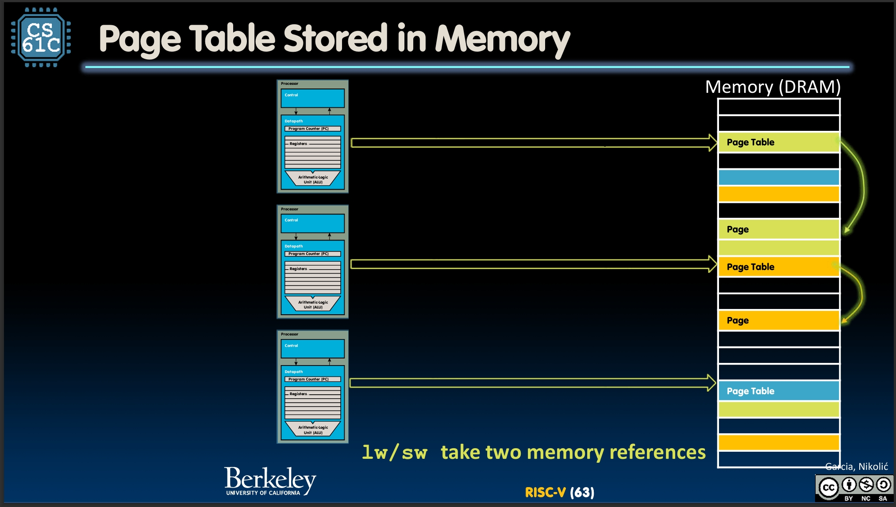

### Page Faults

And, let me see... We still have the problem of the capacity. How do we do that? Actually, the OS regard main memory as some sort of cache. You get me? Like cache is cache for the main memory, the main memory is cache for the disk.

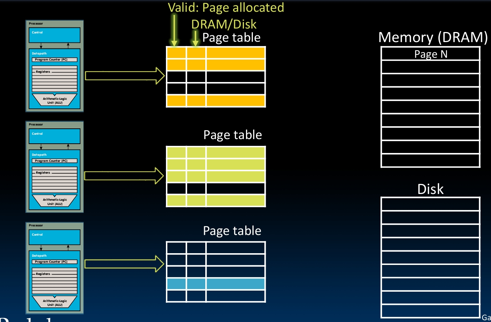

So each entry got this two bits. One is the valid bit, telling whether this page is allocated or not, in other words, is this information valid or not. Another is telling whether this page is in the main memory or the disk.

So we first check if it's valid. If valid, we see if it's in the main memory. If so, just access it. But if not, we got to go to the disk for it.

These two situations of not valid and not in the main memory both need to be handled by the OS, not the process it self. So we call this **page fault**, should be treated as exceptions.

By the way, since this is some sort of cache, we got the write problem. Write-through simple but slow, while write-back is a bit complex but faster. In real world, mostly write-back is used.

## Performance

So we are pretty done with how to do it, further would be how to do it better.

The space is quite bad. Since the page tables must be in the main memory, and the page table is quite large.

The time is not good either. Since we need to access the memory twice when cache miss.

Now we are going to nail them one by one.

### Hierarchical Page Tables

So the space problem!

There is an observation that most programs only use fraction of memory. But for those a lot of unused memory, we still need to have entries for them.

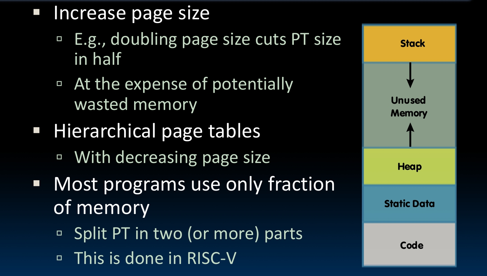

So the idea is to split the virtual page number into many parts, and have a table for each part. Then we have a hierarchical page table.

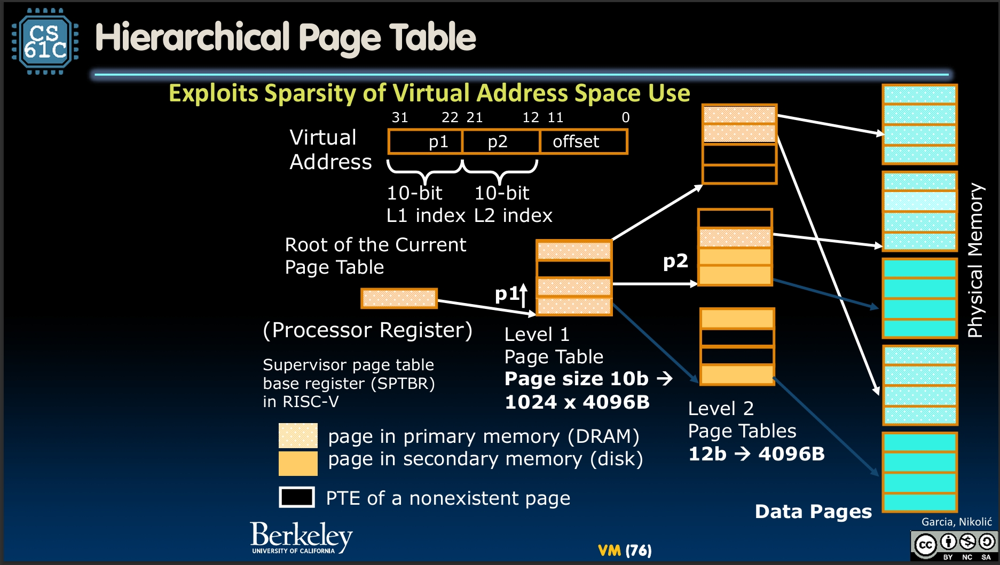

We look up p1 in L1 page table, it tell us the correct L2 page table, and we look up p2 there...

The trick is, some L1 entries might represent a lot of unused pages, so that no need for L2 table for them. In all, the page size would have a huge decrease.

### Translation Lookaside Buffers

Let's now see the time problem.

Now there's even more serious, with this hierarchical page table, we need to access the memory more than twice.

The solution is another cache, yeah, we really got lots of cache. The Locality is still valid, the program tends to visit the same page many times in a period. So why not just cache the translation result for a while?

This is called **Translation Lookaside Buffer**, or **TLB**.

TLB is only 32-128 entries, usually fully associative.

So when the program gives a virtual address, we see the TLB first. If hit, we got the physical address and we check the cahce. If miss, we go to the page table, got the physical address, update the TLB, and then check the cache.

Funny, we were actually kind of see VM as something between cache and main memory, but actually it's more like between CPU and cache.

We always check the TLB first, not cache. The reason is cache needs physical address, and TLB actually do the translation.

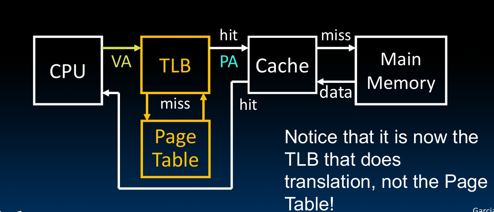

For the datapath, we got two memory, two cache, remember? The instruction and data. So of course we got two TLB.

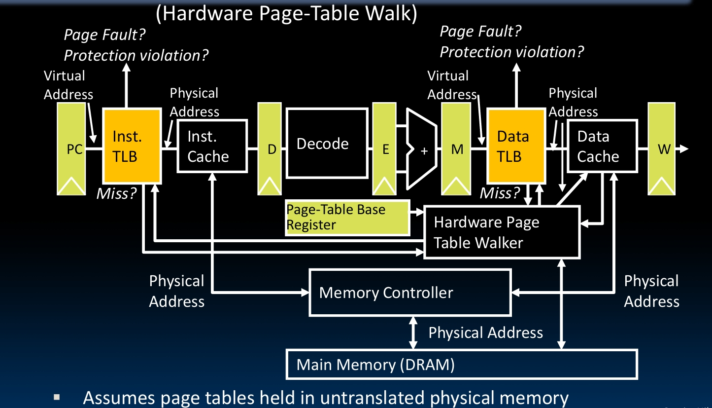

By the way, when the OS do the context switching, what we do with TLB is setting all those entries invalid.

## Summary

This note is not logically good and smooth as before. I think the reason is that I am not understanding everything very well. But damn I finish it. Suck my dk.
