# Application: DNS, HTTP

I learn this from these 2 lectures' slides:

[Lec16](https://docs.google.com/presentation/d/1FyxSEkm8iqlURHmbYs34bcLackqh3A3lEpY6x5jTXRc)

[Lec17](https://docs.google.com/presentation/d/1viTjRMTWn_-EFxJSsTMGB-0DaOgx_jhefQGQFjRapds)

Most pictures are from these slides.

## DNS

We have know Layer 3 the IP and Layer 4 the transport pretty well. Let's talk about the application layer, how do we interact with applications?

Now everybody knows how we use IP addresses to address end hosts, so that we can make routing scalable.

But IP addresses are basically just a string of random numbers. You can't expect people to remember `74.125.25.99` so that they can go to google application, they can only remember something called domain, `www.google.com`, stuff like that.

But the machine need to use `74.125.25.99`, how do we let it know the IP address everytime user goes for `www.google.com`?

This is the motivation of **DNS, Domain Name System**. We need this protocol to translate the domain name to the IP address. Everytime you type a domain in your browser, the computer do a DNS lookup to get the IP address, and send packets to it.

The naive approach, the original design, is simply just maintaining a `hosts.txt` file to map every domain to its IP address.

But the problems are obvious. You need everyone to have the same file, how do you do if someone still use a outdated version? And the file can get very large if there are a lot of computers in the Internet.

So we need to improve this. Basically, we have these three design goals:

- DNS must be **scalable**.
  - Many hosts/names. Many lookups. Many updates.
- DNS must be highly **available**.
  - No single point of failure.
- DNS must be **lightweight** and **fast**.
  - Connections often start with a name lookup (e.g. user typing domain in browser).
  - If DNS is slow, every connection is slow.

So let's design it.

We need these **name servers** that are servers responsible for answering DNS requests. To perform a DNS lookup, you (the client) send a DNS query: "What is the IP address of www.google.com?" The name server sends a DNS response with the answer: "The IP address of www.google.com is 74.125.25.99."

Name servers have their own domains and IP addresses too.

The problem is, one name server certainly cannot do the whole DNS. But if their are plenty of them, how do we know which one to contact?

Naive idea would be just send to anyone, but if it can't help you, it would be able to direct you to another. But this could be slow.

The solution is name server **hierarchy**. We arrange these name servers in a tree hierarchy. Every time we go down the tree until you get your answer.

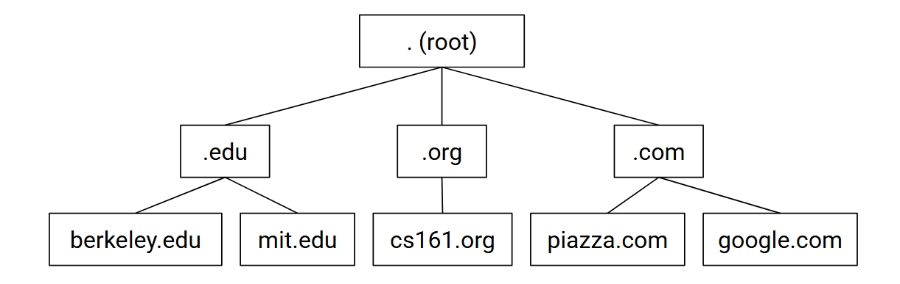

Let's go through a example of `eecs.berkeley.edu`. You first request to the root name server, which face everyone. It would respond with directing you to the right child name server, `.edu`. Then it respond with directing you to the right child name server, `berkeley.edu`. And finally, it respond 'The IP address of `eecs.berkeley.edu` is `23.185.0.1`'.

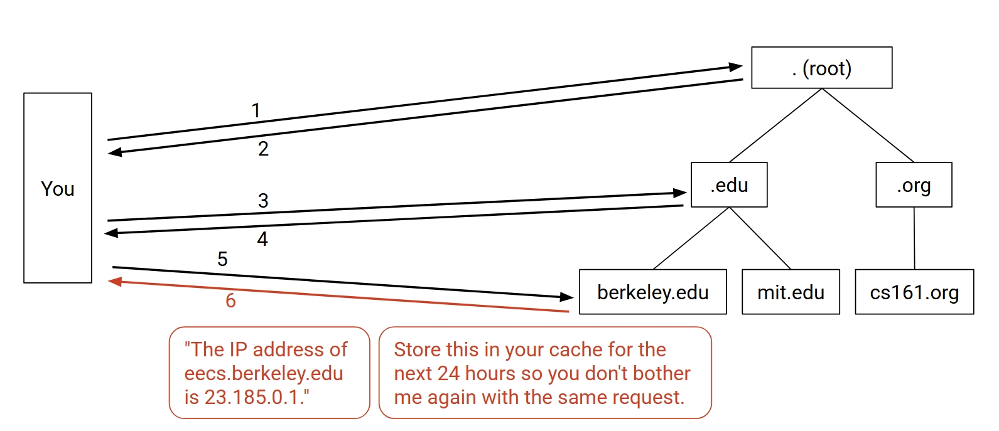

By the way, you can store the IP for a while like 24 hours or something, so that if you go there again, it would be faster. Everytime before the request, check the cache first.

In practice, you might only have a stub resolver, it tells the recursive resolver to do the job for it.

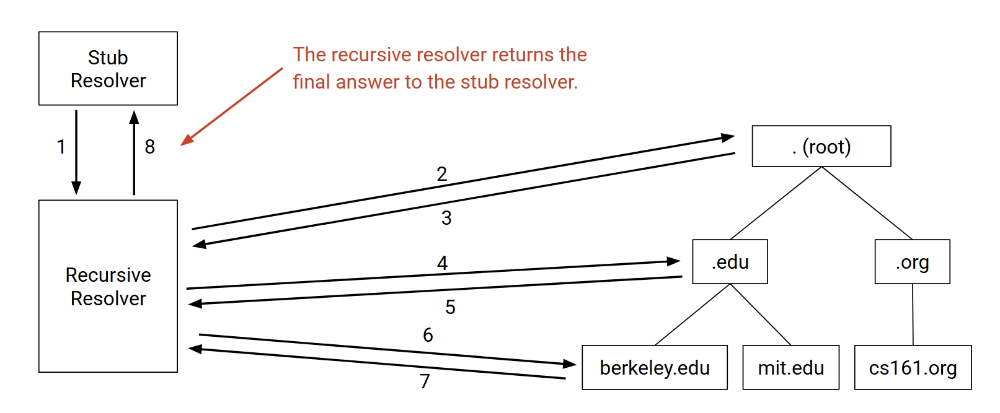

The recursive resolvers are operated by Google(8.8.8.8), Cloudflare(1.1.1.1), etc. You only need to remember these IP addresses. And it's more scalable because it ask once and can respond to many requests.

So we know about the design, let's dive deep into the implementation.

First, we send the DNS packets over what transport protocol? Let me remind you, there are UDP which is not reliable but faster, and TCP which is reliable but slower. We certainly use the UDP, because we want to be lightweight and fast so bad.

To deal with dropped packets, we just set a timer, if expired do the resending.

So let's see the detail of the DNS packet, the format, the UDP packet format.

The header has **sourse port** (up to the client), **destination port** (usually 53), **checksum** and **length** of the UDP payload.

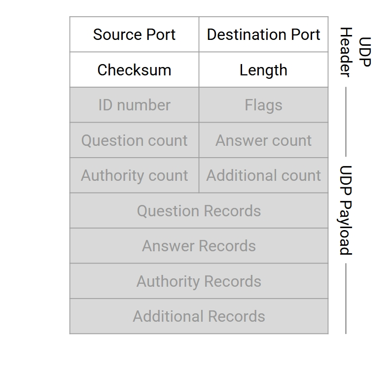

In the UDP payload, we have DNS header and the DNS payload. The DNS header has **ID** so that we can match the request and response. And it has **Flags** to control the behavior of the DNS query, basically is this a query or a response, do we want to do recursion or not, something like that. And a lot of counts, they are just counts of each types in the DNS payload.

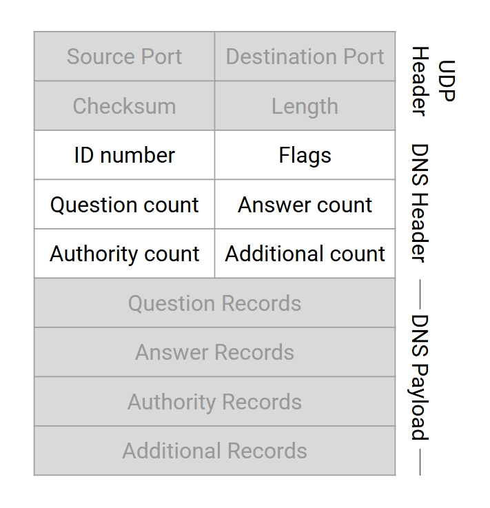

Then we finally get to the DNS payload. The DNS payload contains a bunch of **resource records (RRs)**, each is a name-value pair. And they are divided into 4 sections, **Questions**, **Answers**, **Authority**, **Additional**.

We have a lot of kinds of RRs, here are three common ones. **A (answer) type records** maps a domain name to a IPv4 address, while the **AAAA type records** maps a domain name to a IPv6 address. And the **NS (name server) type records** say we want another single name server to handle this domain. A RR sometimes has a TTL, which is the time this record should be cached.

So now we can see the four sections, what do they do and what type of RRs they contain. The **question section** is about what is being asked, basically is a A type record with the domain being looked up. The **answer section** is the answer to the question, so it should be empty in the request, and should be a A type record with the IP address in the response if the name server answer the question. The **authority section** is used when the name server doesn't know the answer, and it would direct you to the next name server, it should be a NS type record with the next name server domain of course. And the **additional section** is used to provide additional information that help the response, sometimes a A type record with domain and IP of the name server in the authority section.

Now let's see the whole DNS lookup walkthrough in the below pictures, so that we can really understand all the above stuff.

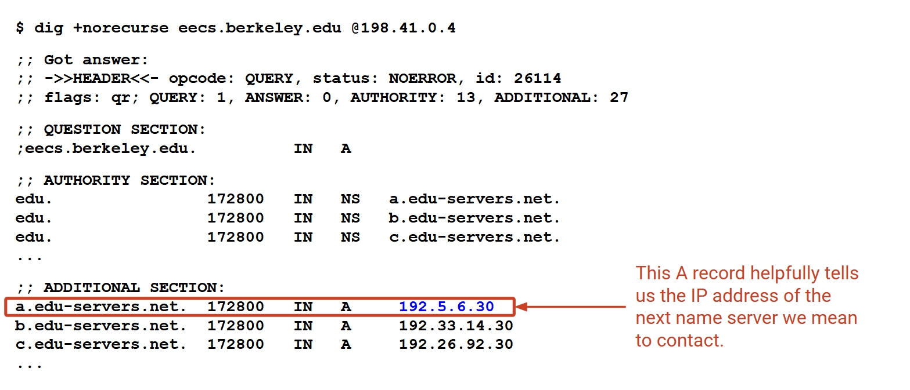

This is a response from the root name server. You can see we did a DNS lookup for `eecs.berkeley.edu`. In the header you see one query, no answer since the root doesn't know anything, and a lot of authority and addditional. In the payload, you see one A type in the question section, a lot of NS type in the authority section, and a lot of A types in the additional section. So we choose the first name server in the authority, and find a A type of it in the additional section, so we know the IP.

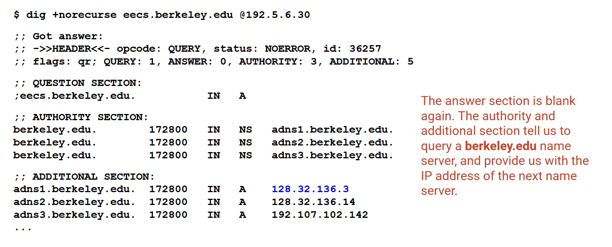

That should be one of the `.edu` name servers, and we get the response in the above picture. Still no answer, some authority name servers and their IP provided. So we choose the first one.

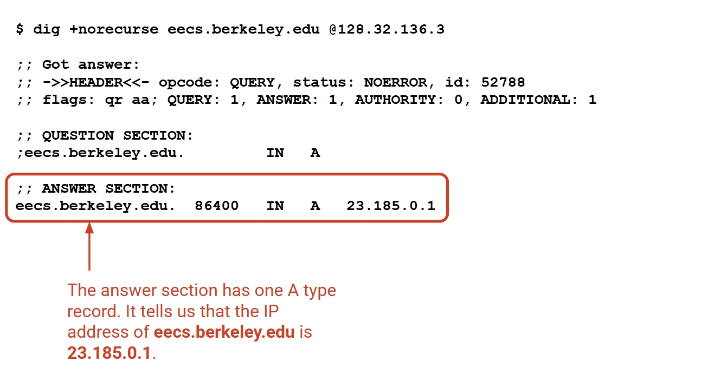

This is the response from the `berkeley.edu` name server. You can see we have one query and one answer, and in the answer section we have this A type record with the IP address of `eecs.berkeley.edu`, which is `23.185.0.1`.

So we have done it, this is basically how DNS works. It can do more than finding IP addresses for domains, it can also do other things like email, load-balancing, etc. But we won't go deep.

## HTTP

We have known DNS pretty well, we know how it tell you the IP address of your desired domain. But this is not enough, because we need to ask data from the IP address, so that we would get the website behind the domain on our browser.

The protocol we use to do this is **HTTP (Hypertext Transfer Protocol)**.

I believe you can see by the name, the main goal of HTTP is to transfer hypertext pages, with links to other pages.

HTTP is a **client-server protocol**. One user is your computer, or the browser, who is the client. Another is the server of the website.

It is build on top of **TCP**, do a handshake and send data through the bytestream towards each other, you should be familiar with this. It's a **request-response** protocol, the client send a request, and get exactly one response.

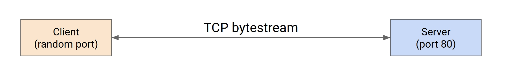

Let's see how the request looks like.

Typically, it got three parts. The HTTP **version** we are using, the **URL** which is basically the filepath to the resource we want to interact with on a remote server, and the **method** to tell what we are going to do with the resource.

The most common methods are **GET** and **POST**. GET is asking to be sent the resource, and POST is to send some data to the server. And we also have PUT, CONNECT, DELETE, OPTIONS, PATCH, TRACE, etc. Maybe we can talk about them later.

Then we see the HTTP response. It also has the **version** part. And a **status code** to tell us what happened with this request. Then a **description** of the status code. And finally the **content**, which is the resource the client requested.

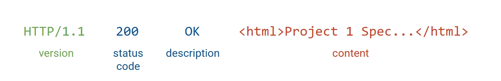

Status codes are clarified into some categories:

- **100s**: Informational responses.

- **200s**: Successful responses.

  - **200 OK**: The request is successful.
  - **201 Created**: The request is successful and a new resource is created.

- **300s**: Redirection messages.

  - **301 Moved Permanently**: Go check this resourse at somewhere else, forever.
  - **302 Found**: Go check this resourse at somewhere else now, but can come back to check in the future.

- **400s**: Client error.

  - **401 Unauthorized**: You need to authenticate (e.g. log in) to access this content.
  - **403 Forbidden**: You are authenticated (server knows your identity), but access is still forbidden.
  - **404 File Not Found**: You are requesting a file that doesn't exist. I believe you have seen 404 a lot in the experience of browsing the web.

- **500s**: Server error.
  - **500 Internal Server Error**: Server hit an error processing your request.
  - **503 Service Unavailable**: Server cannot respond at the current time.

Now let's talk about the HTTP headers. Sometimes, request and response need to carry extra metadata. It's not mandatory, unlike some other headers that we have seen before.

In the **request**, we use HTTP headers to pass some information about the client to the server.

- **Accept**: What file type the client is expecting in the response. Examples:
  - `Accept: text/html`
  - `Accept: application/json`
  - `Accept: image/*`
- **Host**: If a server is hosting multiple websites, identifies which website the client is aiming to access.
  - `Host: google.com:80`
- **Referer**: How the client triggered this request (e.g. clicking a link on Facebook).
- **User-Agent**: What program (e.g. Firefox, Chrome) the client is using.

In the **response**, we use HTTP headers to pass some information that are not directly related to the content.

- **Date**: When the server generated the response.
- **Location**: In 300 redirect responses, where the content moved to.
- **Server**: What software the server used to generate the response.

And we have these **representation headers** that are used in both request and response.

- **Content-Type**: File type of the response. (e.g. HTML, JPEG image, MP4 video...)
- **Content-Encoding**: How the response is encoded into bits.
  - `Content-Encoding: gzip` says the contents were compressed.

Now we can see how the HTTP works in practice, by the following pictures of a example.

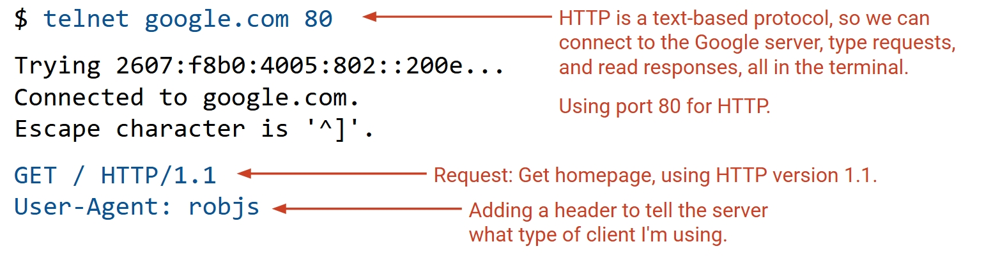

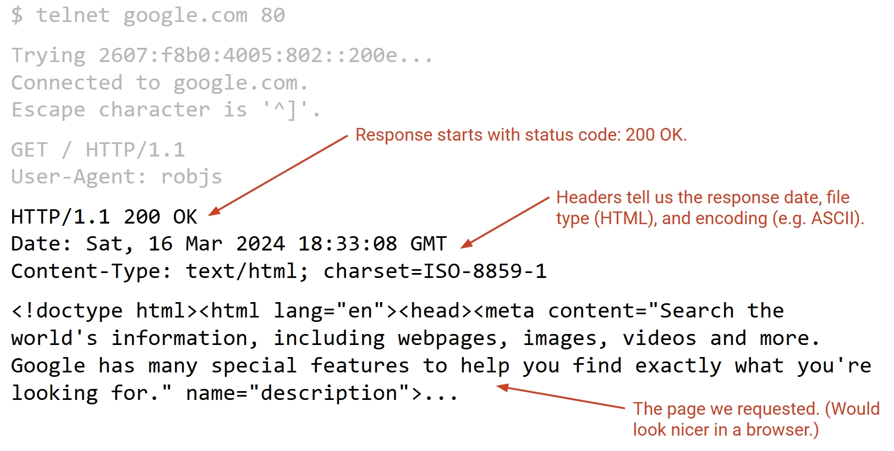

Sometimes the request has data and the response doesn't, like if you do POST or PUT or something like that.

So we know how the HTTP works pretty well, but now we need to speed it up. The problem is, to load a single website, you need to do multiple requests. One to get the hypertext, and a lot of them one for each image, and a lot to get those scripts so that the website would be interactive, etc.

If we do it one by one, every time we do a TCP three-way handshake, then send one request and get one response, it would be very slow.

So we need to speed it up, by **pipelining**, which is to allow multiple requests to be pipelined over the same TCP connection.

Bisides that, we can also do the **caching**, so that we don't need to request the same resource again and again.

We have **private caches**, which is in the client itself, like your browser cache, your browser just request its cache for a picture of a just read website.

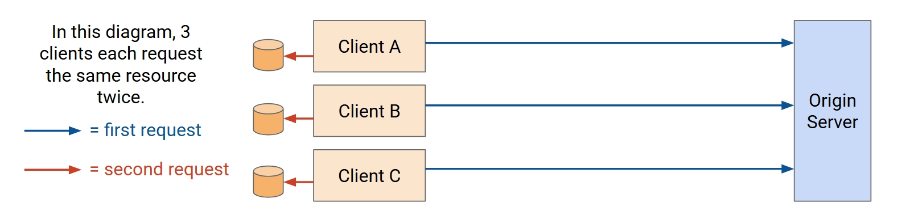

We have also **proxy caches**, which is in the middle of the client and the server. The first request goes to the origin server, and the response stored in the proxy cache. And the next request would be sent to the proxy cache, and the response would be returned from the proxy cache. You need to somehow redirect the following requests to the proxy cache, it's DNS's job.

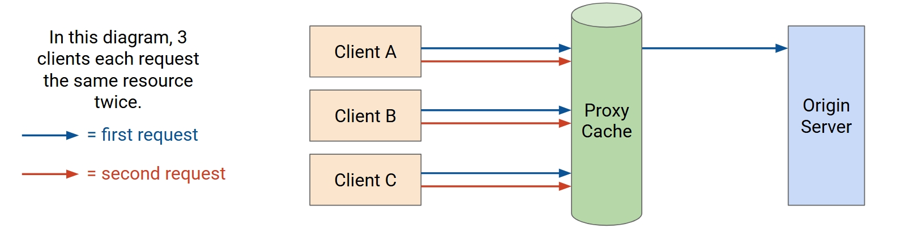

We have the **managed caches**, quite similar to the proxy caches but managed by the server, so that the server got more control, easily redirect the requests to the cache.

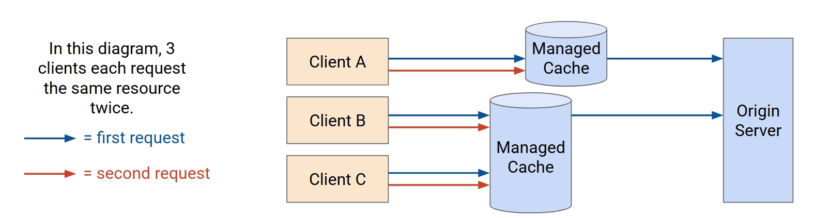

Both proxy and managed caches can be multiple in the network.

HTTP resources are not all static like the google logo image, some of them are dynamic like the google search result. So we should only cache the static resources, and we need to let the server somehow tell whether the resource should be cached and for how long.

To do that, we can use the HTTP headers.

- **Cache-Control**: How the resource should be cached.
- **Expires**: When the content can be cached until.

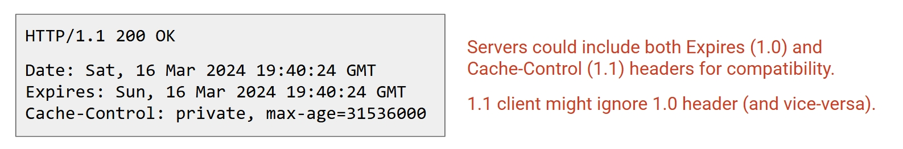

## CDN

Application providers need to somehow use caching to improve load time for users. You can actually feel this, go to google is always fast, but some small websites can be slow.

You can't deal with user's private caches, nor the proxy caches, so there remaining the managed caches. You can redirect users there by yourself.

So we are going to build **Content Delivery Network (CDN)** by this. It's the deployments of servers that can server HTTP resources. The big idea is to place the server close to the users, geographically or on the network perspective, like less hops.

Application providers can deploy CDNs at the 'edge' of their own network.

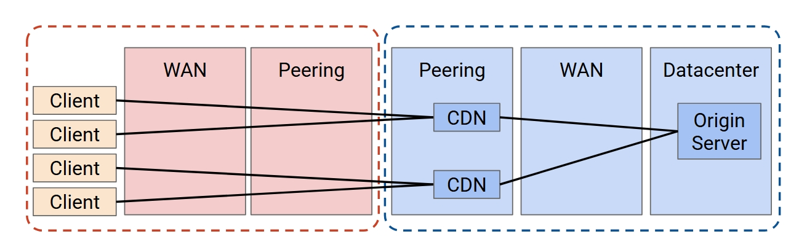

It can also be deployed at the ISP's network, helping the ISP to reduce the cost of infrastructure.

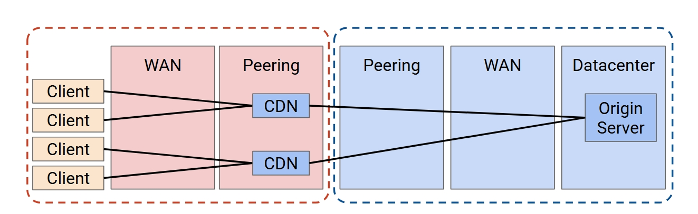

So you can push it deeper, but not too deep. You need to balance the cost of building a CDN and the cost it reduces. Deploy the CDNs at every user's home might not be a good idea.

CDNs benefit everyone. Content providers get more users because better performance, ISPs reduce the cost of infrastructure, and users get better using experience.

So the request go the original server for dynamic resources, and the original server would direct the user to a cache for static content. The remaining problem is, if there are multiple CDNs, which should the server direct the user to and how to do it automatically?

We got three approaches.

The anycast is to let many servers (CDNs) advertise the same IP prefix. Remember the least-cost routing? It would choose the closest one.

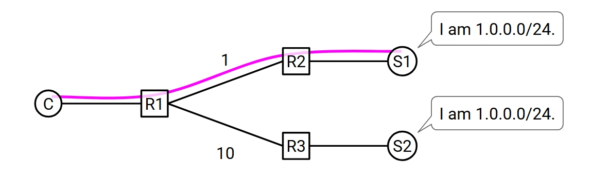

But it got this problem, if you use a connection for a period, and something happen to the network and cause some changes, it just route you to another server who has not this TCP connection.

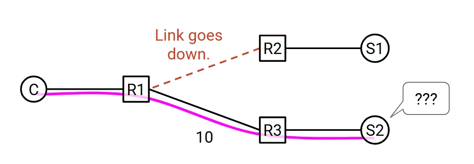

Another approach is the **DNS-based load balancing**. The DNS maps the domain to different IP addresses, depending on where the query comes from.

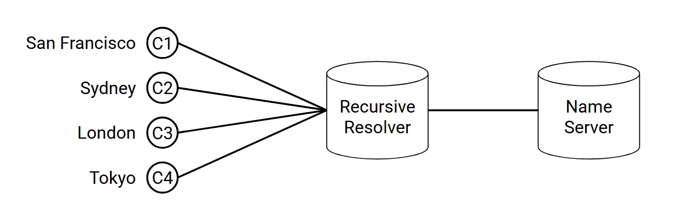

This might need some extension to add user information in the query.

And we also have **Application-Level Mapping**. Use the HTML content to direct the user to the closest CDN, because the application knows where the user is, better than the above one. For example, in the HTML page: "Load the video from `sfo-cache.google.com` / `mia-cache.google.com`."
