# End-to-End: Links

I learn this from these 2 lectures' slides:

[Lec18](https://docs.google.com/presentation/d/1YHmJL7eRy_Slzr57G4R2JsgCJwRQokyYUdxJIiJ_Gx8)

[Lec19](https://docs.google.com/presentation/d/18GA1wuD344dkbhfk5x2DLMz2Y6aFwgOZIYe2M1x1v7Y)

Most pictures are from these slides.

## Ethernet

We have talked about the IP, transport and application layer in very detail. Today we are going to go all the way down to take a deeper look into layer 2, the links.

Up till now, we assumed that a link only connects two hosts. But in reality, one wire might connect multiple hosts.

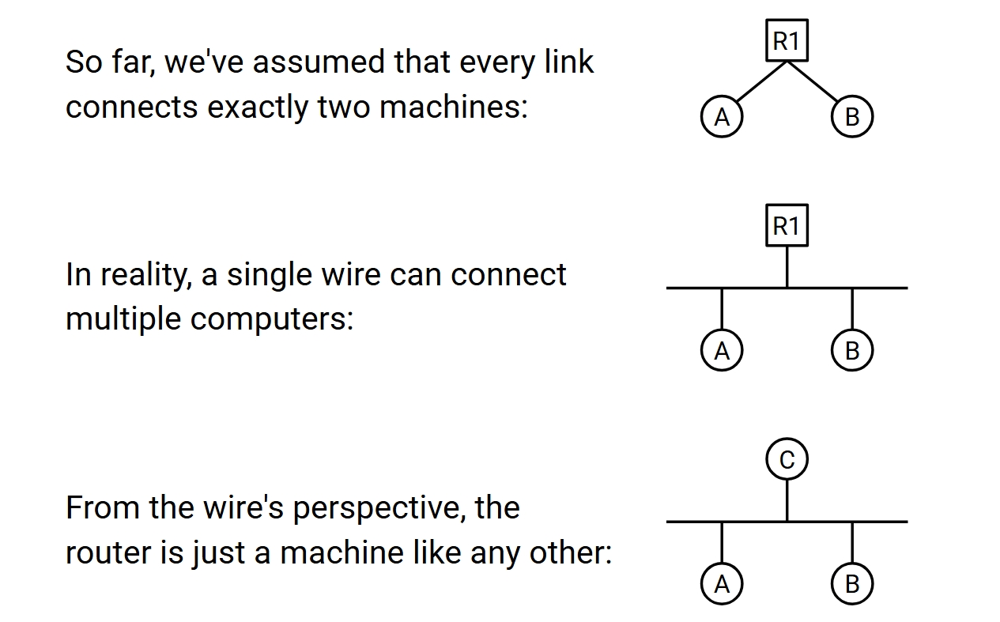

To connect all hosts in a local network up, we can use a naive approach called **mesh**. Mesh means there is a link between every pair of hosts. The problem is obvious, this can get super complicated and unscalable. Every time you want to add a new host, you need to add a bunch of new links.

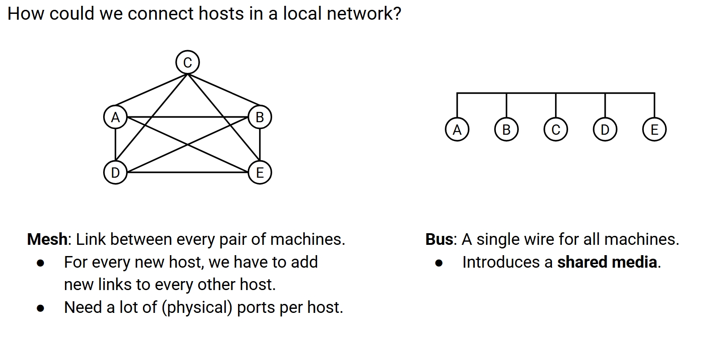

Better approach would be the **bus**, which means connect all hosts with one single wire. But this also has a problem, the **shared media**, if multiple hosts are sending data at the same time, signals would interfere or collide.

Not even need to be a wire, same problem would happen for optical fiber or wireless. It's just like everybody talks at the same time in your group online meeting, annoying.

So we need a **multiple access protocol** to allocate the shared media to solve this problem. There are three approaches to do that, and each has some different protocols.

The most straight forward approach is the **multiplexing**, which means allocate fixed slice for each host. There are two types of multiplexing protocols, **Frequency-based** and **Time-based**. It's basically just allocate a fixed frequency or time slot for each host.

The problem of this approach is that it's pretty wasteful. If one host has nothing to say, its frequency or time would just be there and doing nothing.

Another approach is **taking turns**, which is literally just let each host take turns to speak. You can do **polling**, which means let one coordinator decide who can speak.

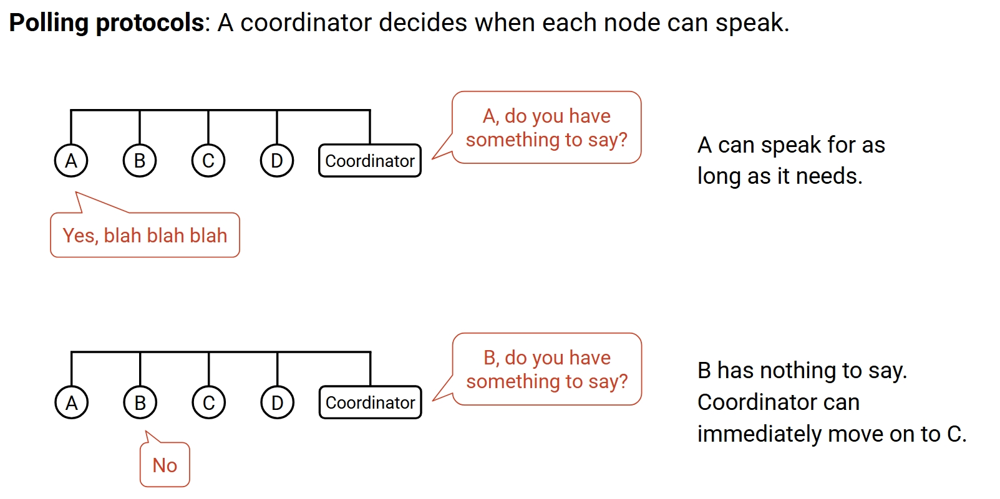

And the **token passing**, which means there is a token passed around, and only who holds the token can speak.

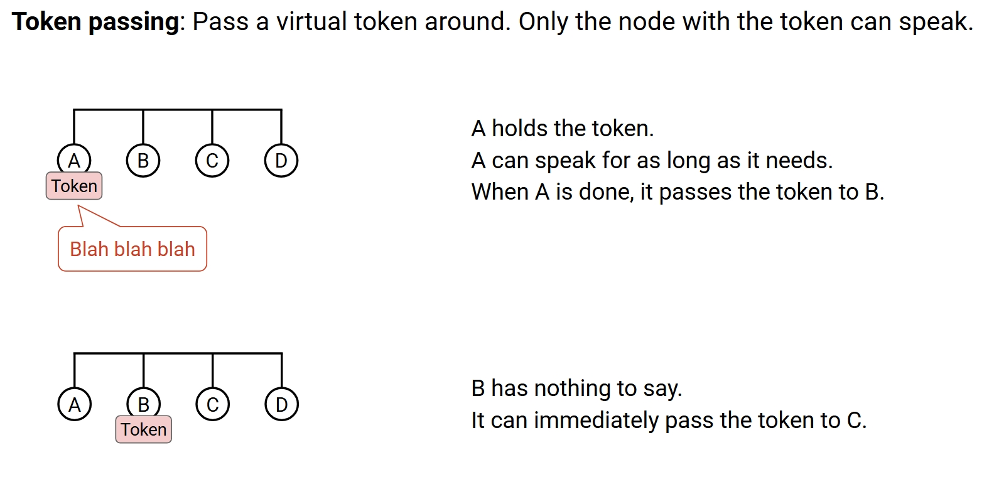

The taking turns are much better than multiplexing, when someone has nothing to say, it just move on to the next. In real world, bluetooth actually uses its polling protocol.

But it's still quite complex, you got to let the hosts communicate with each other, you got to find some way to elect the coordinator, you got to make sure only one host think it holds the very virtual token, blah blah blah.

The last approach is **random access**, which means each host can speak whenever it wants, and we deal with the collisions when it occurs. Yeah, why bother doing all those stuffs? How often would people all want to talk? Actually, I never have anything to say in a single online group meeting.

**ALOHA**, which uses the most naive way to deal with the collisions when it occurs. If you have anything to say, just send it anyway. If success, you got a ack from the recipient. If not, there might be a collision. So you wait for a random time to retry. It got to be random time, if you and the collision partner use the same fixed time, another collision!

Free speach is good, but sometimes people talks together got us in trouble. **CSMA (Carrier Sense Multiple Access)** is a more polite protocol, which means you first listen to see if anyone is sending and only send if no one is sending.

This can't totally avoid collisions due to the propagation delay, sometimes someone send something but haven't reached you yet, and you think it's safe to send, but it's not.

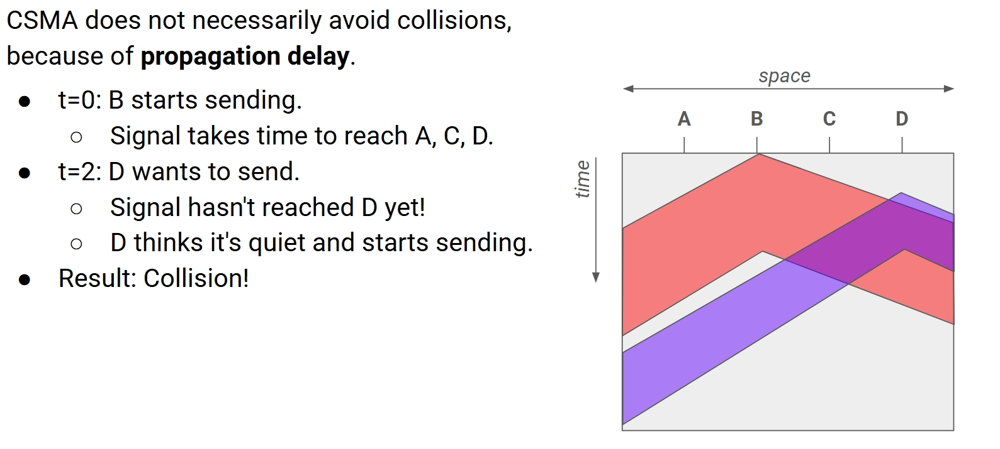

The final protocol is **CSMA/CD (Carrier Sense Multiple Access with Collision Detection)**, which means you not only listen before sending, but also listen during the sending. If you hear somebody sending, just stop. And it uses **binary exponential backoff**, which means you wait for a random time to retry, but after every collision, wait up to twice as long. For example, the first collision, you wait for a random time between 0 to 4s, the second collision, you wait for a random time between 0 to 8s.

So we solved the shared media problem. Now we can connect all hosts in a **local area network (LAN)**, which is basically what **Ethernet** means. Our goal is, to let machines in the Ethernet exchange data directly at layer 2, no need for IP or transport layer.

Firstly, we need to do the addressing without IP. Every machine has a **MAC address** stored permanently on it. This has 48 bits wirtten in hex like `f8:ff:c2:2b:36:16`, which is globally unique.

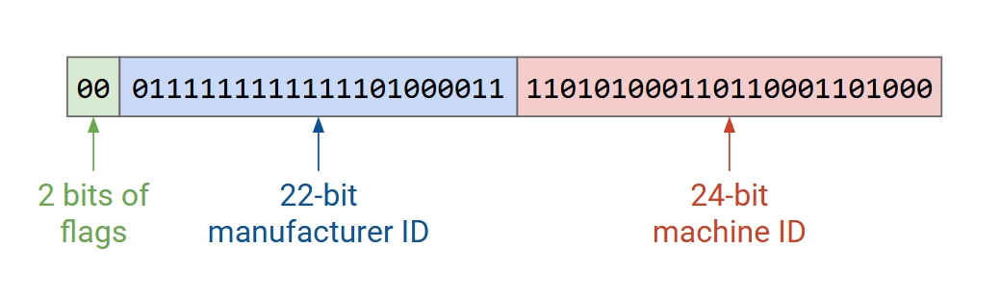

To communicate with each other in the LAN, there are three ways to do that, **unicast**, **broadcast** and **multicast**.

Unicast means send packets to one single recipient. You set the destination of that packet to the recipient's MAC address. Everybody would get that in the shared medium, so they would need to check the destination address to see if it's meant for them.

Broadcast is just sending it to everyone in the LAN. You set the destination of that packet to the broadcast address, which is `ff:ff:ff:ff:ff:ff`. With this, everybody knows it's meant for them.

Multicast is sending to a group of recipients, machines in LAN can join groups. Remember there are two bits of flags in the MAC address? If the first bit is 1, it's a group address. With this it can send to everyone in the group.

Let's see the packet that was been sent. In Ethernet, the packet is called **frame**. The structure is like this:

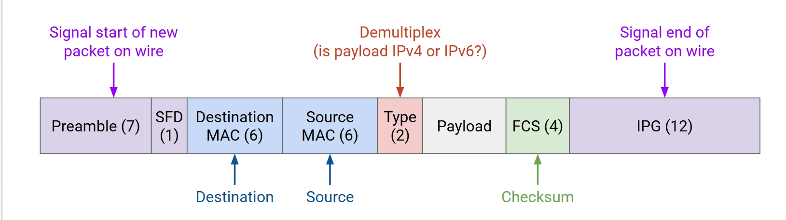

## Layer 2 Network

We can connect the local area network with one wire, but it gets pretty inefficient when the network is getting large. The collision would happen all the time.

So we kind of need to introduce the **switches** to forward the packets to the right place, since we might use multiple wires to connect the hosts. In practice, it's basically same device as router, but use different protocols to do jobs on different layer.

The we must do the routing again, just like we did in the IP layer. Can we just use the routing protocol of layer 3? We certainly can, but won't be as efficient. We now use the MAC address instead of IP address, but it can't be aggregated. The MAC addresses are allocated by manufacturers, not geographically like the IP addresses. All the devices in your house might share same part of their IP, but not their MAC. All the devices from Apple might share same part of their MAC. And this is also why the layer 2 can't scale to the Internet.

Let's why we need to invent this protocol again.

The most naive approach, just do the flooding. When you receive a packet, send it out through all ports, except the one it's from.

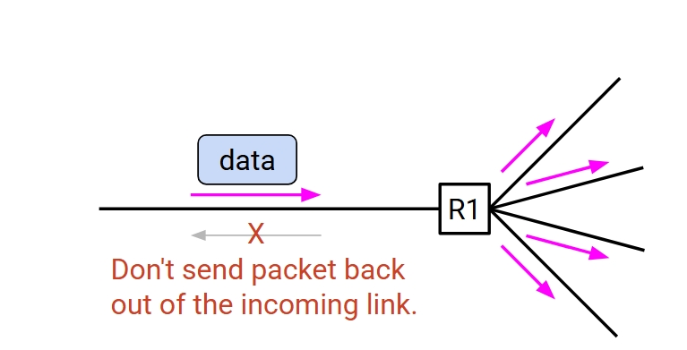

This would work fine, it would get to any host, including the destination. But it's a very big waste.

The two big problems that cause this waste are, it sends packets to all other hosts that are not the destination, and it might keep sending if there is a loop. Solving these two problems and we will got a good protocol.

We can use a routing protocol to solve the send to all problem, but way too complicated for a LAN. This **learning switches** approach is much simpler.

The big idea is, again, maintaining a table. Every time you get a packet, you get some information about the sender, so you create an entry for it.

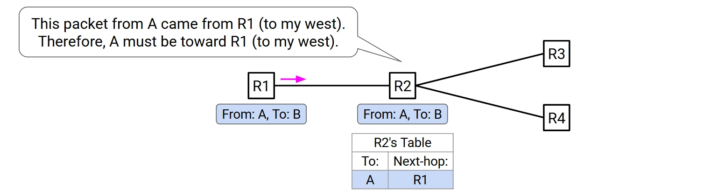

The packet from A is forwarded to me by R1, so I know if I am going to send to A, I can send to R1. Simple but useful idea.

The forwarding is destination-based, you just check the table, if it's there, you forward to the corresponding next hop. If not, you can flood it.

See the below pictures for an example.

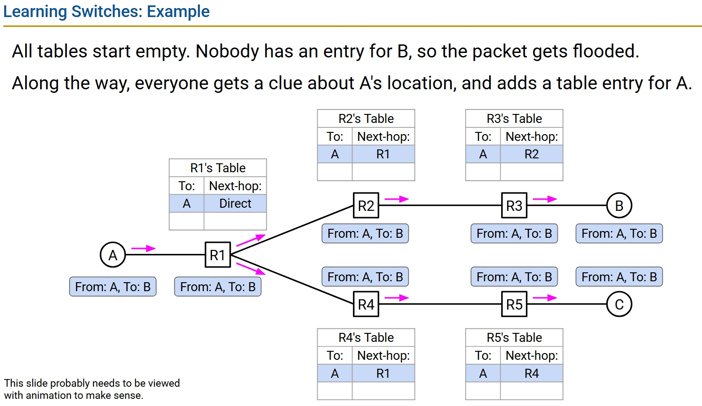

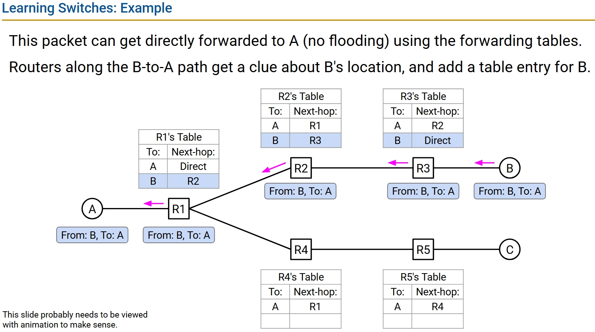

Also, we still got our old friend, a TTL for each entry. So if invalid routes, they will expire.

Now we can move on to solve the loop problem. You must have been to the Data Structures course, so I believe you know the spaning tree, which is a subgraph that connects all the nodes and guarantee no loop. Why not just find the spaning tree, and only send packets through edges in the spaning tree? For those links that are out of it, we sort of disable them. This is the big idea of **Spaning Tree Protocol (STP)**.

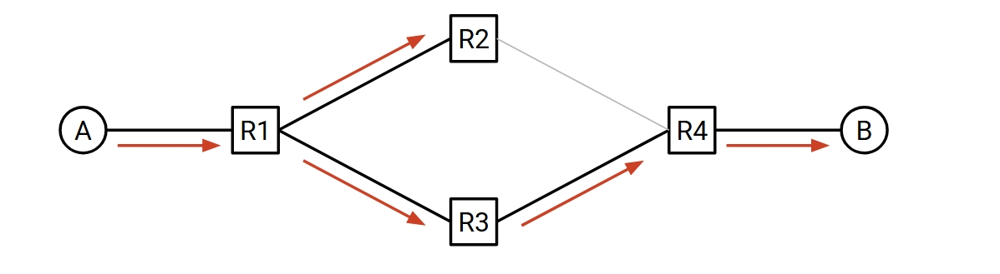

To be clear, we actually ignore the hosts in this group stuff, all the removing loops and disable links are between switches.

First we must pick a root switch, the spaning tree algorithm need a root, remember? We choose the switch with lowest ID. The ID is consisted with a priority that you can manually set and a MAC address. Usually we compare the priority first, and if they are the same, we compare the MAC address.

Then, how do we do the disable? Each router labels its ports with three types. The **Root Port** is the one with the least-cost path to the root. The **Blocked Ports** are the ones that lead to routers that are closer to the root, but not along the least-cost path. The **Designated Ports** are the ones that lead to routers that are further from the root.

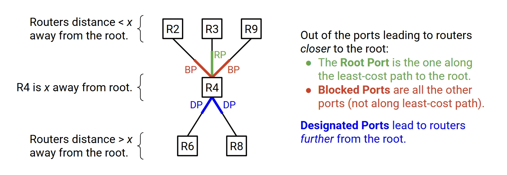

See this figure for an example.

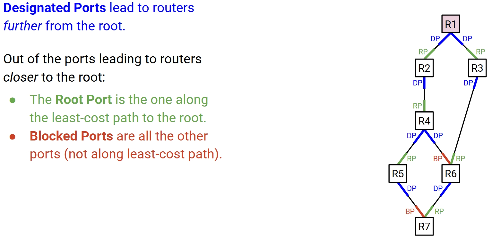

Then we stop sending and receiving packets through the blocked ports. Those links are disabled. And we got the spaning tree.

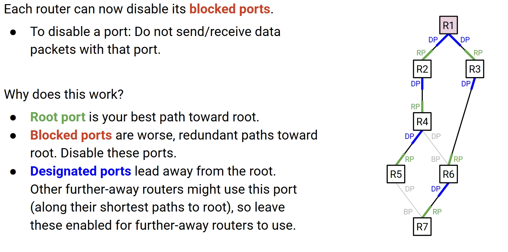

Fun observation is, links only got disabled on the further sides, since the reason is not along the least-cost path to the root.

What if there are multiple least-cost paths to the root? Choose the one with the lowest ID.

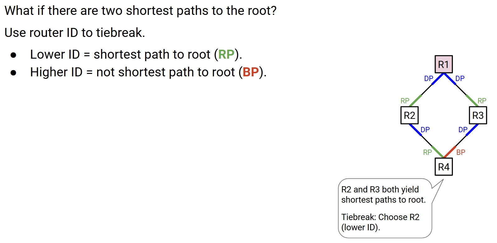

Same, if a link leads to a router that is as close to the root as you, see its ID. If higher, it's further, if lower, it's closer.

By the way, each link we were talking about can be a shared medium link, there are many hosts on it.

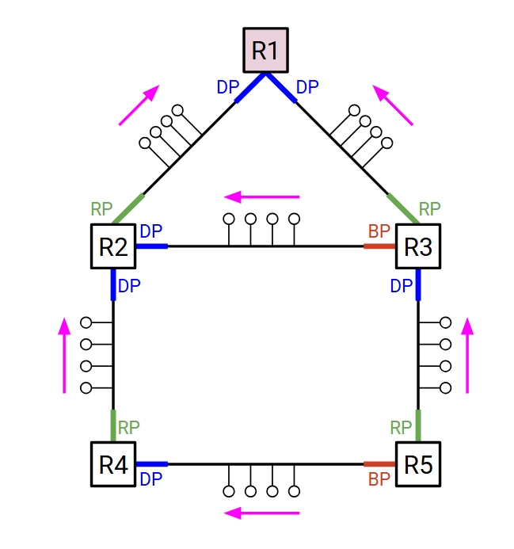

Whenever a host send stuff, it only goes to the Designated Port side of that link.

So we avoid loops, life is fantastic.

Let's go even deeper, see through the implementation of STP.

To implement STP, global knowledge is necessary. Who is the root? Is this link go closer to the root or further?

The solution is **Bridge Protocol Data Units (BPDUs)**, something quite similar to the advertisement in distance-vector that we used to talk about.

Routers exchange these BPDUs, with two information in it. One is who is the best to be the root that you currently know, and another is it's cost.

If you receive a BPDUs, you update yours. If the ID is lower, you change yours to it. And if the same root, but with lower cost, you update your cost.

Keep sending these to each other, since the real root has lowest ID, everybody would soon converge. After this, you can learn about your neighbors' cost to the root by periodic advertisement, and label your ports accordingly.

See this gif for a demo.

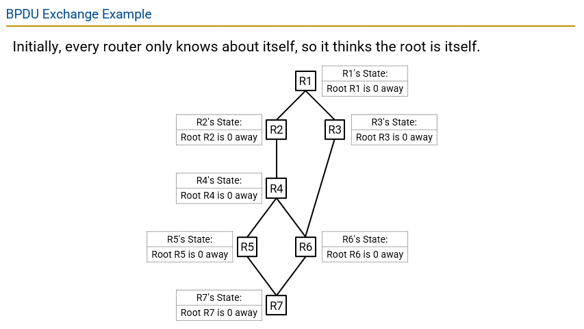

## ARP

We used to talk about how the Layer 3 fill in the destination IP in the header. But what about the destination MAC address?

When we are going to send a packet to google's server, we know it's IP address, but the next hop might be a router in our LAN. So we need to fill in the MAC address of the router. Or if the destination is a host in our LAN, we need to fill in the MAC address of the host.

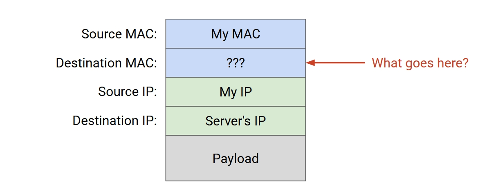

**Address Resolution Protocol (ARP)** is the protocol that translate the destination IP to the MAC address of the server or router.

We first check the cache to see if the MAC is already there. If so just use it, if not we do a broadcast to ask everyone in the LAN who the owner of that IP is and what your MAC is. Other people ignore and that guy would unicast to respond. Then we cache the MAC, maybe set a TTL.

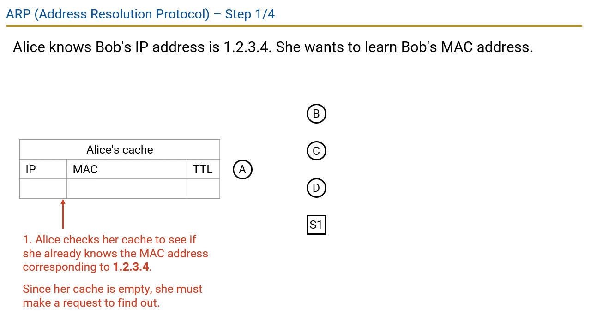

ARP is used in routers. The IP addreses are aggregated in the table, so if multiple hosts are on the same link, we use ARP to send it to the correct MAC address.

It'a also used in hosts, just like we talked about above.

So each hop changes the layer 2 destination, but the IP address should be fixed.

By the way, if we are going to translate IPv6 into MAC address, we need to use **Neighbor Discovery Protocol (NDP)**. Main difference is it uses multicast rather than broadcast.

## DHCP

When we connect to a new Ethernet network, we need to learn:

- Subnet mask: What range of addresses are local?
- Default gateway: Where is the router? So I can send non-local packets to them.
- DNS server: Where is the recursive resolver?
- We also need to get an IP address that we can use for this network.

We used to talk about manually configure stuffs for routers, but it's because they rarely move. But hosts usually need to join different networks, like your phone connect to a lot of WIFI everywhere.

So, we might need a protocol to learn about information automatically. And this is the **Dynamic Host Configuration Protocol (DHCP)**.

We need to have this **DHCP server**, who is basically your home router in smaller networks. But in larger networks, it could be a separate device. The DHCP server is configured with Subnet mask, gateway router IP address, DNS resolver IP address and a pool of usable IP addresses. It can be used to configure other stuff if you want.

So the precess of DHCP is like this. The client broadcast a request for configuration. Then the DHCP server respond with DHCP offer that contain all these information. There might be multiple servers to offer, so the client would have to broadcast which offer it chose. Those servers were not chosen would discard the offer. And the chosen one would send DHCP ack to confirms that this configuration is given to that client.

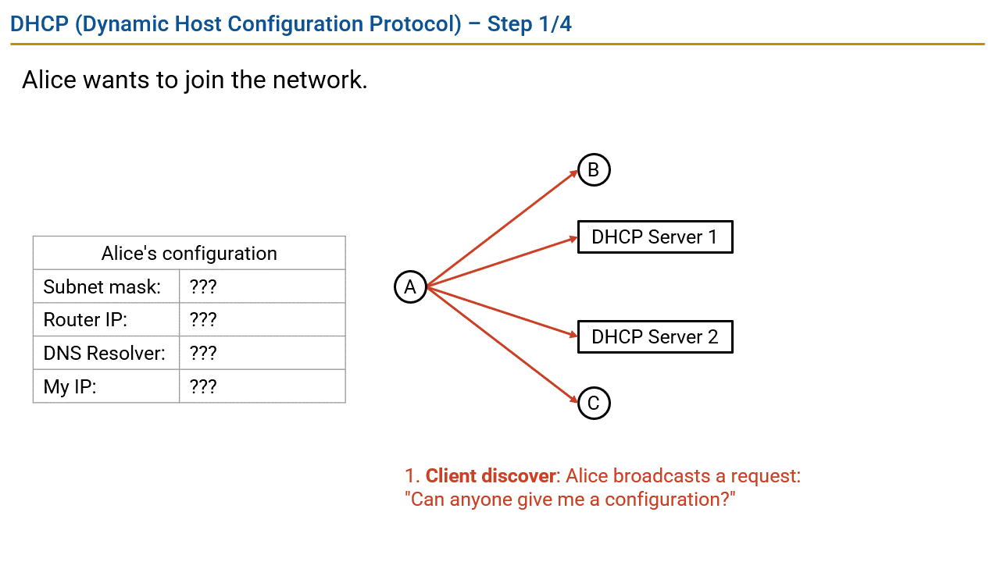

To be clear, the DHCP server only lease the IP to the client for a limited time. The client would need to renew the lease before it expires. This make IP address reuse possible.

DHCP is a layer 7 protocol, which runs on top of UDP/IP protocol.

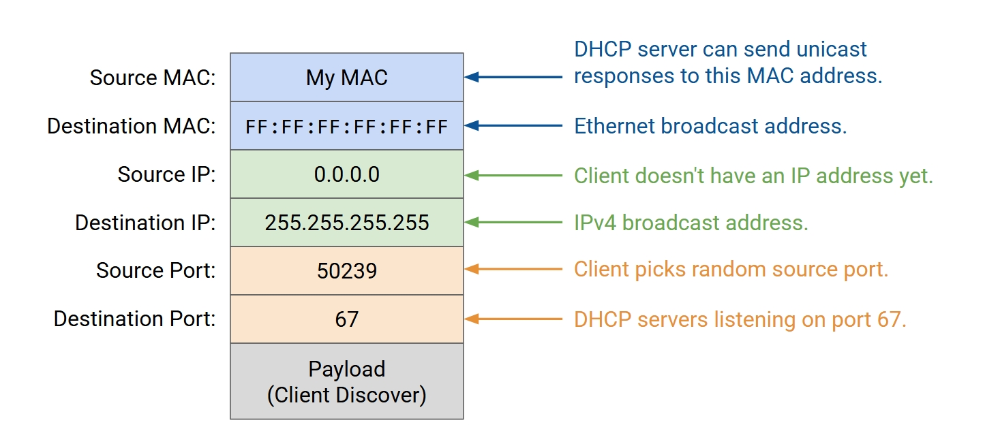

By the way, IPv6 uses SLAAC (Stateless Address Autoconfiguration) to give itself a unique IPv6 address. The trick is to copy the unique MAC as part of it and do some other things. Other information can be learnt by Neighbor Discovery.

## NAT

May I remind you the problem that we had talked about long ago? The IPv4 addresses are running out. The IPv6 is a ultimate solution, but it takes time. Therefore, we have this temporary solution, **Network Address Translation (NAT)**.

We could and we did use private IP addresses, however it can't be used if you need to connect to the Internet. Fun fact is, your home network uses private IP addresses, but you do need Internet access.

The NAT is simply just use one single public IP address to represent a group of private IP addresses. If there is incoming packets, the router changes the public IP into private one, otherwise changes the private IP into public one.

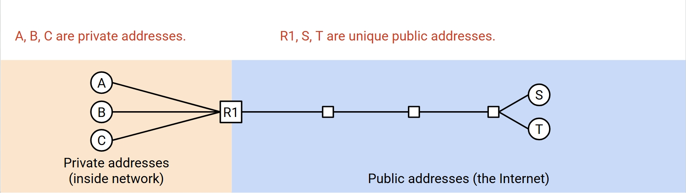

Of course, the router would keep a table so that it know which to send a reply to.

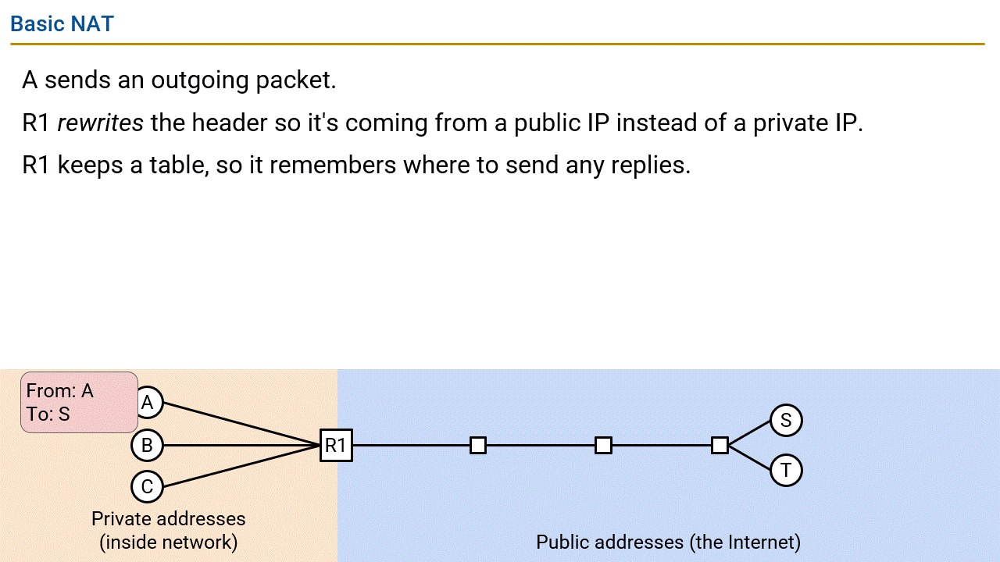

But this got problems, I believe you have seen it. What if A and B both want to talk to S? Then the table of that router would store two entries to send reply from S to. This is not good.

The solution is keeping track of the port number in the table. So the reply back to the router, you can check to see which port to send to the relative host.

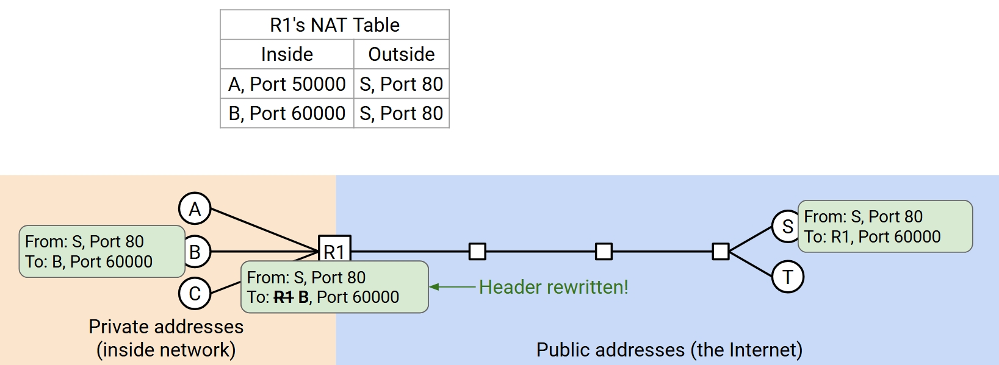

Not over, what if A and B both use the same inside port? This is tricky, isn't it? The IP all say R1, the inside ports are the same, only difference is the private IP, which had been rewitten. We are out of luck.

But what if we let the router be able to rewrite the inside ports too? If A and B use the same inside port, the router might fake a port number for B. So that for the incoming packets, if they got real port number, it's for A. If the fake one, it's for B.

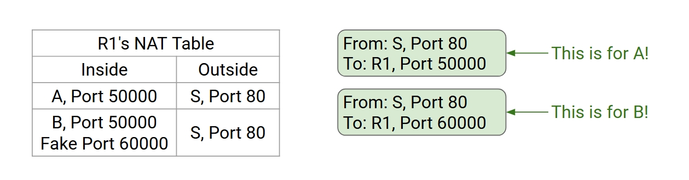

One big problem of NAT is that it doesn't support the outside to start the connection, since it can't send to a private IP address. But basically most of the connections are started by the hosts. Anyway, it breaks the end-to-end principle a little bit.

## TLS

When we make TCP, we didn't think a lot about the security.

Attacker can check and even change you TCP packets. If you are going to `www.somebank.com`, and attacker change the DNS response to map the domain to one of his IP address, you might go straight to his fake website and use your password there.

**TLS** is the protocol that we use to add security on top of TCP. It's base on Layer 4 the transport, and provides a secure bytestream to layer 7.

Remember we talked about HTTP and HTTPS? HTTPS is just HTTP over TLS.

What we use to make it is one more **handshake**. The purpose is to exchange secure keys and certificates, so that we can encrypt the data.

Firstly, they say hello to each other. They exchange some random numbers, and agree on cryptographic schemes. Usually the client sends a list of them, and the server pick one.

Then, the server send its certificate of authenticity. So that the client would be able to verify the server is real. Some other things might be done also to verify, but not gonna go deeper.

After that, the client and the server would use criptography to derive a secret key that only they know.

And the client and server each derive key based on random numbers and the shared secret. This step should be done locally.

Finally, the client and server would exchange acknowledgement, using the criptography to ensure that they derived the same secret key.

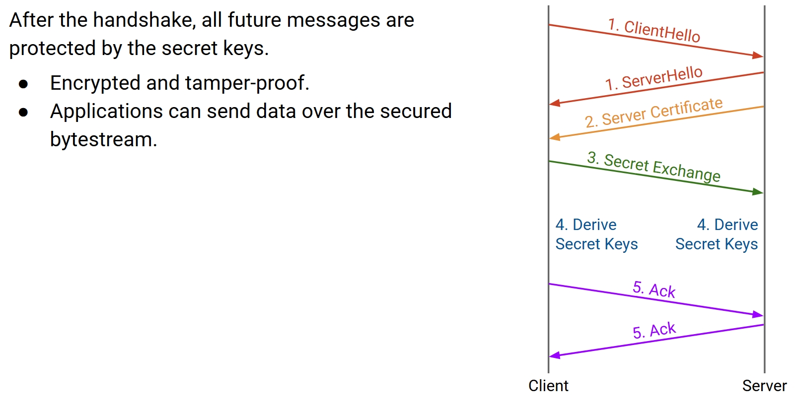

## End-to-End Walkthrough

After all these, we can see what happen when we plug our computer into a network and type `www.berkeley.edu` in our browser.

We first make a DHCP request and get all the information we need.

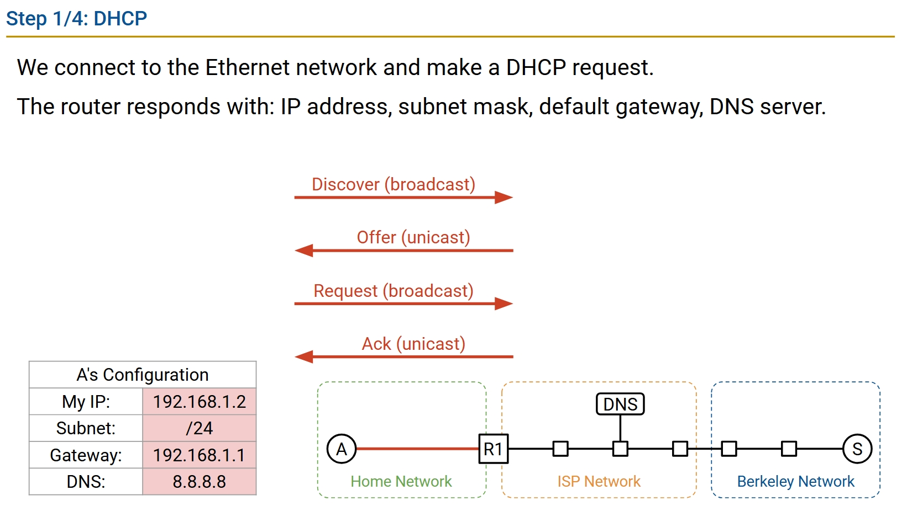

Then your computer need to send DNS request, but doesn't know the MAC address of that router. So we use ARP.

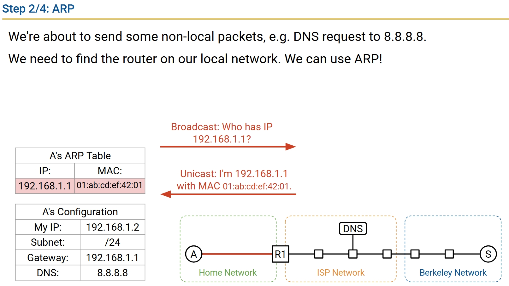

Now we can build the DNS packet, and do a DNS lookup to find the IP address of `www.berkeley.edu`. During this, some NAT stuff might be done, but you have no need to know.

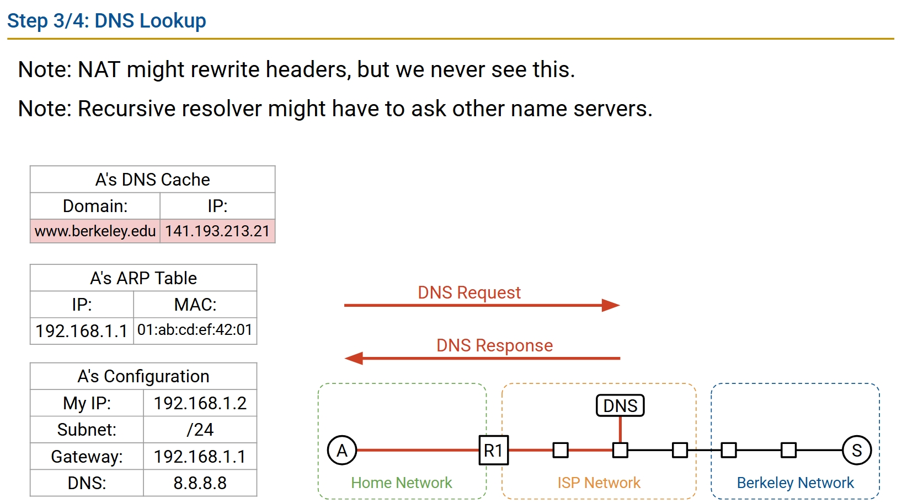

We got the IP address, try to connect! We use TCP, the three-way handshake, remember?

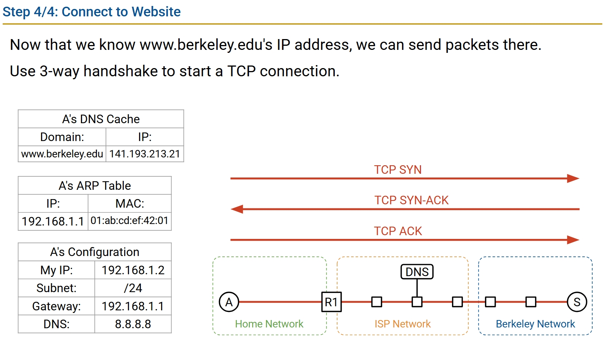

Now we build the HTTP packet, and send it to the server. Maybe we receive a HTML page as response.

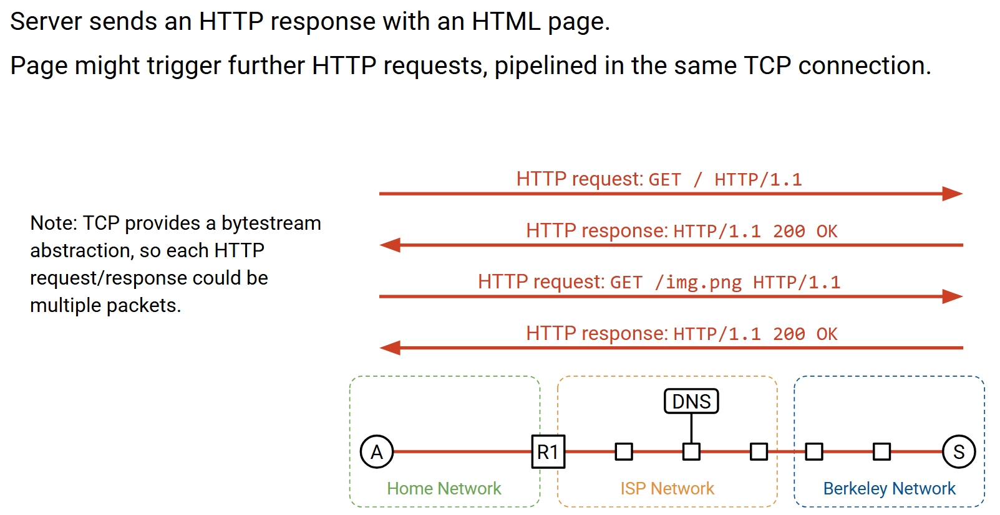

After the sending end, for a while, they finally decide to close the connection. The four-way handshake, remember?

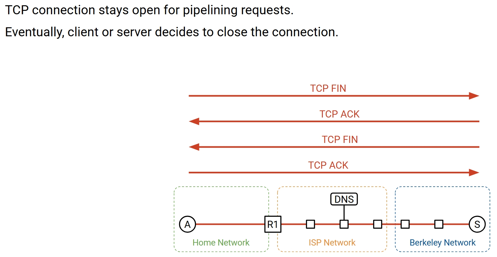

Things are all done. We now got the website page on our browser. How cool is that?
