# Introduction

I learn this from these 3 lectures' slides:

[Lec1](https://docs.google.com/presentation/d/1BHDgW1EqsSLO0N0qtB1hqZh6OPOR8phkh85Ef7woObs)
  
[Lec2](https://docs.google.com/presentation/d/1paPqaOFTFxi5zadIpFFFjANnUmapSlSt1G0CDcjqzcs)  

[Lec3](https://docs.google.com/presentation/d/1NLcHY6V47ebSJzaxgeVIR0ZIPDjgccAnKiJet701s1Y)

Most pictures are from these slides.

## What is the Internet?

Computer Networking is about the Internet.

No need to explain what the Internet is, I believe. What we actually care about is the infrastructure of the Internet. You never need to study what mail is, but you need to know how the mailbox was made, how to pick qualified mailmen and what road the truck with mails takes. We are going to study, not stuffs in the Internet, but what we must have so that people can build those stuffs in the Internet.

So basically, the Internet is all about designing protocols. Protocols are how people communicate with each other. 

For example, asking a question in lecture has this protocol: You should raise your hand, wait for the professor to call your name, and then ask your question. If the professor didn't see you, you can say 'Excuse me'. 

The Internet is just a lot of protocols so stuffs know how to communicate to make everything work.

## Layers of the Internet

### Layer 1: Move Bits across Space

Obviously, we want the information to be able to move across space. We need the mailman.

This is just about some physical stuffs that you already know, maybe not understand it's details but enough. Not what we really care about in Computer Networking.

These physical stuffs can be wires, optical fibers, wireless radio waves, etc.

So we have the mailman. And this is the **Physical Layer**.

### Layer 2: Local Networks

The mailman can go from one house to another. And things need to work the same in the Internet. We must use these physical stuffs as links to link one machine to another. And we need to finally link all local machines up. It's just like the mailman connects the small town up.

See the pic below if not clear:

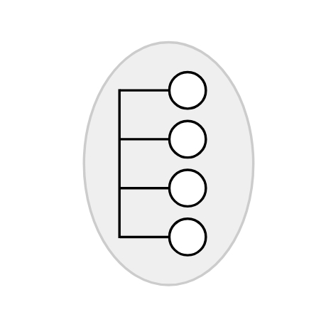

And this is the **Link Layer**.

### Layer 3: Connecting Local Networks

But the mailman can't go to another town. So what do we do if we need to send a mail to another town? Or in the Internet, how do we send stuffs from one local network to another?

Naive approach would be just use all those physical stuffs to connect all machines in both local networks. So that we can regard it as one. But this is not wise, quite expensive.

In the postal analogy, we got the post office. Use trucks to carry the mail to another town is much wiser. Same in the Internet.

See this pic below if not clear:

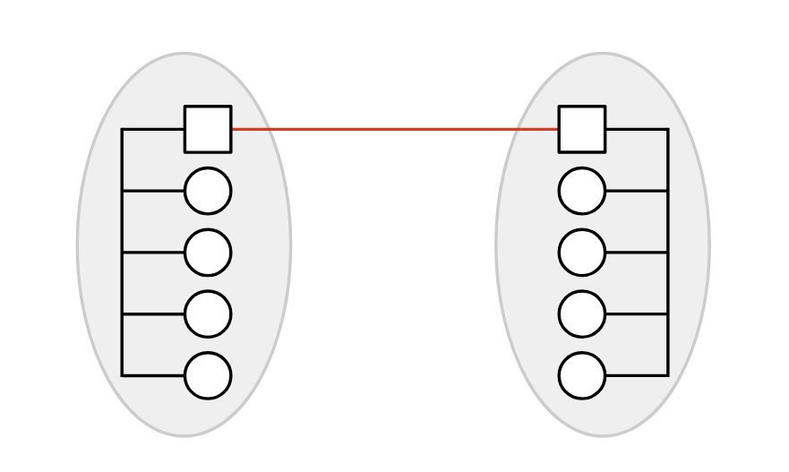

And naturally would us think, with enough post offices, we can connect all the towns up. 

See this pic below if not clear:

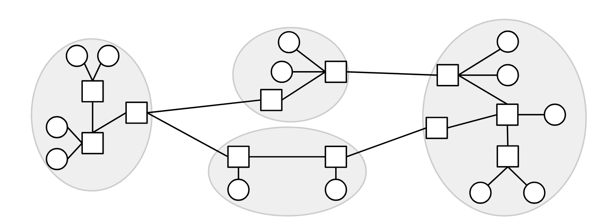

I think now is a good time to stop calling them houses and post offices. We have these terminologies: Those circles in the pic above are **end hosts**, the boxes are **switches**(or **routers**).

And this is the **Internet Layer**. You can see why people call the Internet 'a network of networks'.

In this layer we can see a little big picture. When you send stuffs to somewhere, not always a link go directly. It may go through multiple links. And these links can be different physical stuffs, because it's already layer 2 shits and we are abstracting stuffs to layer 3 level.

See this pic below if not clear:

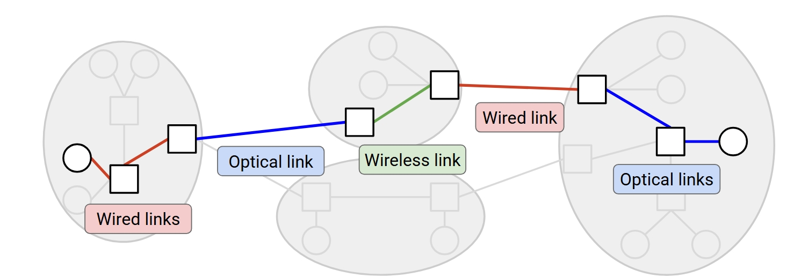

This quite cool huh? But layer 3 is actually offering only a best-effort service. Packets are limited in size. Packets could get lost, reordered, corrupted, etc. The network will try its best to deliver your packet, but no guarantee. The network won't tell you if the delivery failed. 

So if we stop here, you must deal with all failures yourself. We need to build more layers if we want to guarantee packet delivery.

### Layer 4: Reliability

This layer built on top of layer 3 is simply used to guarantee packet delivery. We are using layer 3 but adding some extra stuffs to make it reliable. Like we can keep resending packets until it gets there, split big data into small packets and do reassembly.

So we have this **Transport Layer**.

### Layer 7: Application

Yeah I know, the 5 and 6 are no longer used, they are old stuffs from the 70s, maybe 50s. People love them are all dead, they have no value to exist.

The layer 7 is just stuffs you build on top of the transport layer, like the websites, emails and even video streaming. Basically everything we can use thanks to those 4 layers of infrastructure.

This is the **Application Layer**.

So far we have seen all the layers of the Internet. See this pic below if not clear:

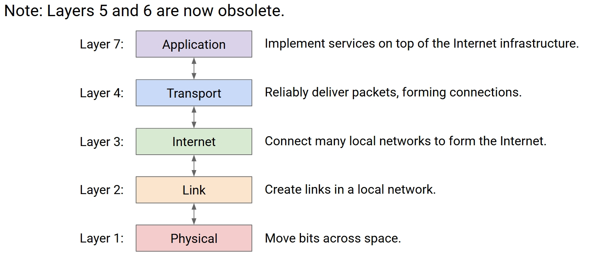

## Header

### Header and Payload

When we send mails, we don't just throw it towards the mailman. He would not know what to do with it unless we write something on top.

Basically, we need to write where it is sent to. Where it is from is not required but would be very helpful when people want to reply.

The same works for the Internet. So for all the packets, we need to add some **metadata**, which is this **header**. For those real data inside, we call it **payload**.

See this pic below if not clear:

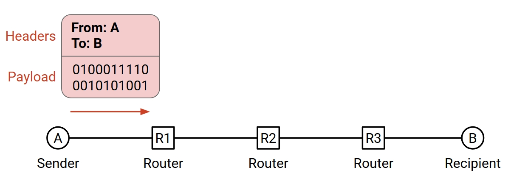

### Multiple Headers

Let's continue to do this postal analogy. Consider the case that a CEO of a company wants to send a letter to another CEO of another company, what is the process?

Well, the CEO would write a letter, and then hand it to the secretary, that's what this sort of people do. And the secretary would put on an envelope, and write

```
From: CEO A
To: CEO B
```

as the header.

Then the secretary would hand it to the mailroom, and the mailroom would put on another envelope, and write

```
From: 123 A St.
To: 456 B St.
```

as the header.

Afterward, the mailman would take it to the mailroom of the other company. And the mailroom would see the header and open it. Then saw it's for the CEO in the inside header, so hand it to the secretary of the CEO. The secretary would see the header and open it. Then hand to the CEO.

See this gif below if not clear:

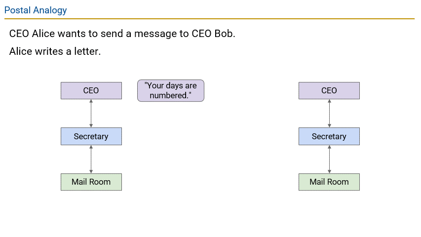

And I believe you have noticed that this header of any layer is only for the one in another company of the same layer. 

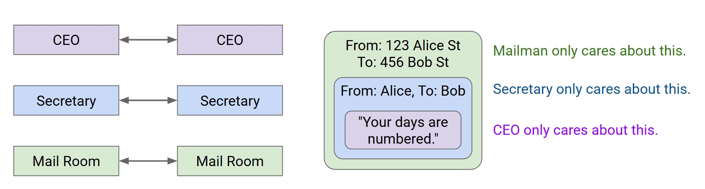

So it's quite the same in the Internet. See this gif below if not clear:

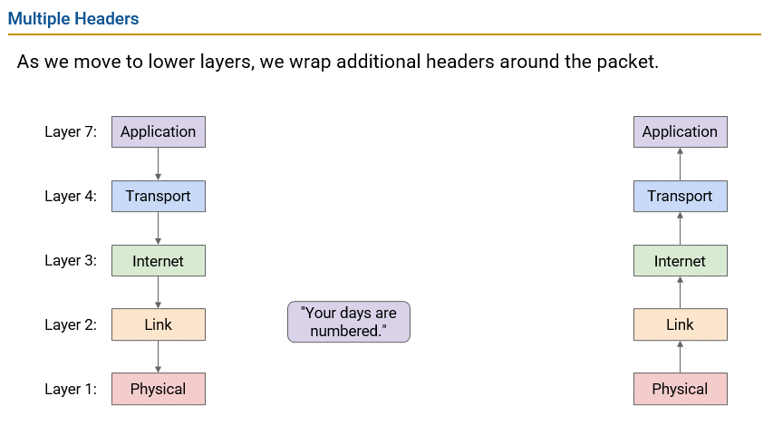

But the postal analogy can be a little bit more complicated, maybe these two companies are not in the same town, so there kind of need a lot of post offices between those two mailrooms.

And since that, every post office would need to open the envelope from the last one, and put on one themself.

See this gif below if not clear:

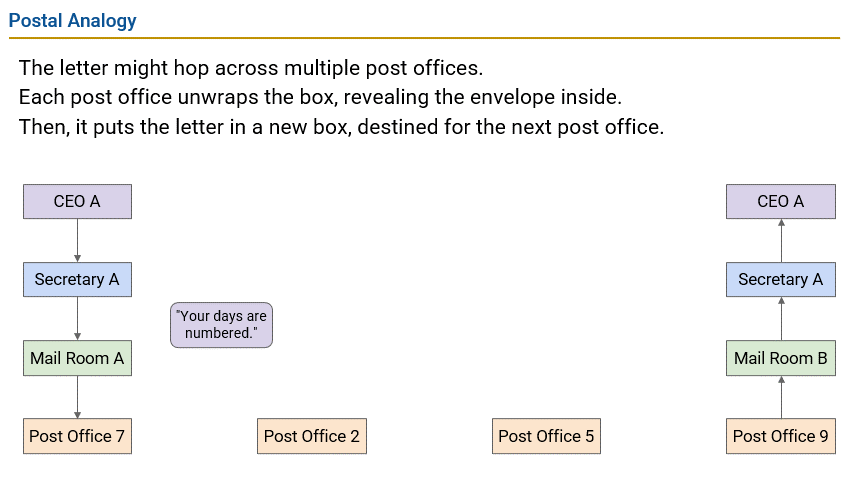

And it is quite the same in the Internet. See this pic below if not clear:

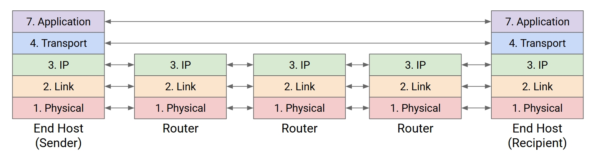

## Internet Design Principles

Now we have seen how the Internet works. But why does it be designed like this? Does there exist other ways to design it?

Well, actually there are some stuff like a guideline to design the Internet or some other systems. But it's not like some laws that you would go to jail if you don't follow them. In fact, people are still debating about some detail stuffs.

**The Internet Design Principles:**

**1. Decentralized control.**

There should not be someone who is in charge of everything. Or when my computer get broken, all over the world would lost connect to the Internet. Well, of course if there is one device in charge that would be my computer.

But there is also something like SDN(Software Defined Networking) that would be a central authority. Then some people build a DSDN(Distributed SDN) that go back to distribution again. Anyway, my point is this isn't law, just some sort of guideline.

**2. Best-effort service model.**

You have seen this in layer 3, where routers just do their best to deliver the packets. But never guarantee, stuffs still losses or broken.

**3. Route around trouble.**

Easy to understand. Some stuff got a mistake, packets still need to be about to arrive from other routes.

**4. Dumb infrastructure (with smart endpoints).**

Routers are dumb, they just see where the packet is going to and then forward it. They don't care about the payload.

Also not a law. People can try to make routers not only care about outside but check inside payloads to see if it's virus or not. Stuffs like that.

**5. End-to-end principle.**

Implement features in the end hosts, not in the routers.

**6. Layering.**

You have seen this in very detail. Each of them relies on the one below it, and support the one above it. So that people can focus on certain layer to develop stuffs, without disturbing other layers.

But still some people would make some protocols that spanning multiple layers. So still not a law.

**7. Federation via narrow-waist interface.**

You get it? Layer 3 is the waist. Federation works because they all follow the same protocol at layer 3.

### Narrow Waist, Demultiplexing

We kind of wanna go deeper into this narrow-waist stuff. Actually, there are multiple protocols exist at each layer. However, only at layer 3, we have only this one protocol called IP.

See this pic below if not clear:

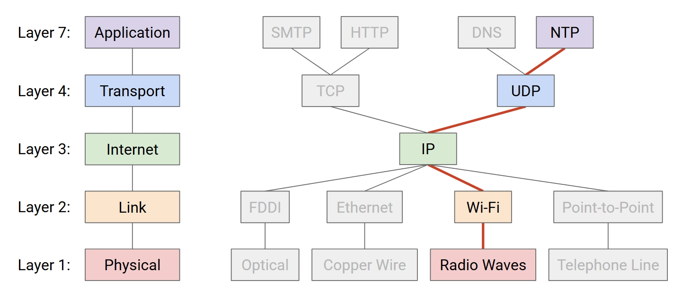

You get it? You get the waist analogy?

Well, it's actually not 100% randomly choice. For example, layer 1 and 2 are quite combined. If the physical stuff is radio waves, you probably must use Wi-Fi, nor Ethernet or stuffs. But basically, you have multiple choice at layers except layer 3.

The IP is basically the address of a single device. Every phone, computer, router, etc. has its own IP.

The IP is something all hosts and routers understand. So that the whole Internet can be unified and the federation can be enabled.

The routes from layer 1 to 3 are quite fixed. It just depends on the physical stuffs. However, how does the IP know to pass up to TCP or UDP? How does TCP know to pass up to the SMTP or HTTP?

To solve this, we must do some **demultiplexing**.

Basically, we just add a new header field to tell which next protocol at layer 4 to go. And also when go to layer 7, we add a specific header field to tell which application to use.

Each application has this thing called **port**, and that is what we put in the header field.

See this pic below if not clear:

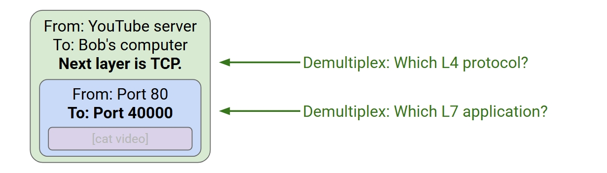

By the way, this **port** thing is just like IP, but not address to certain device, but address to certain application. And for some private applications, you can use you own random numbers. But if a public application, such as Youtube, Firefox, etc. you must use something fixed and well known.

We can also talk about where is each protocol. Layer 1 and 2 are just a computer chip or stuff like that. Layer 3 and 4 are in your operation system, and they are code that can actually be run. Layer 7 is in the application.

See this pic below if not clear:

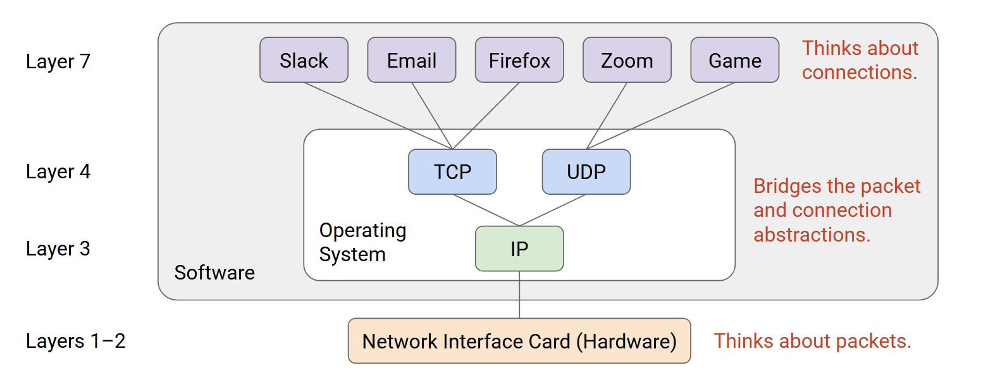

### End-to-End Principle

Another principle that we wanna go deep is the **End-to-End Principle**.

This principle is quite simple. It says that the features should be implemented in the end hosts, not in the routers.

But why? For example, the layer 4 is all about the reliability, and it could only be implemented in the end hosts. Why not in the routers?

Consider this. If we let the routers do some checking, see whether all the packets should be arrived actually arrived, wouldn't it be great? In this case, we have the routers guarantee fully success, if not they report failure. And the end hosts can just trust the routers.

See this pic below if not clear:

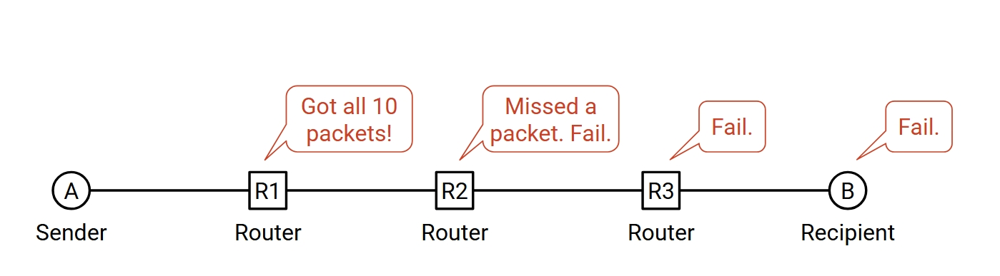

However, here is a huge problem. We can actually not guarantee the routers are always correct in real life. Imagine if one router is broken, and it always just report success anyway, what do we do? So we still need the end hosts to do the checking.

Since it must do that anyway, why bother to let the routers do that? 

I know you may say the end hosts can also not guarantee correctness. But the difference is, if you found one of your device broken, you can actually fix it. But if you found one of the routers broken, you can basically do nothing if it's not the one you own.

So just let the routers do the best-effort service, and have the end hosts do the checking.

See this pic below if not clear:

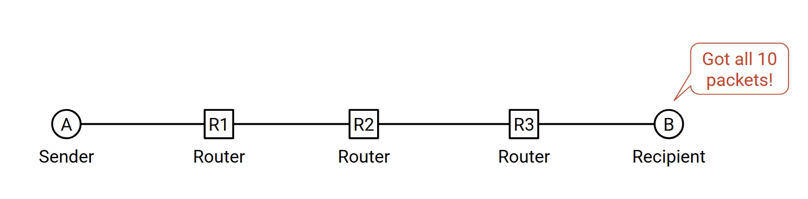

## Sharing Resources

Sometimes, the network must support different flows in the same route at the same time. The problem is, how do we do the resource allocation?

Two ways, either we allocate fixed resources for each application, or we allocate what they need at real time.

See this pic below if not clear:

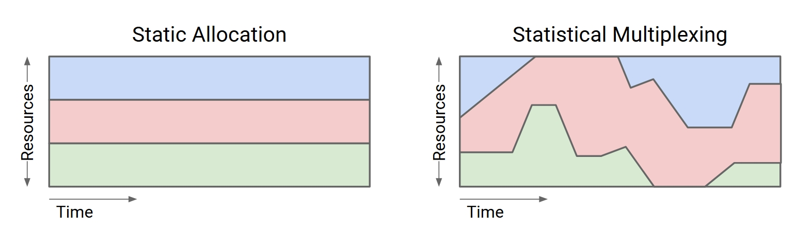

The first one is **Static Allocation**.

The second one is **Statistical Allocation**.

Obviously, the second one makes more sense. If we do the static one, we must allocate the peak value of resources for each application. But the peak value may be only in a short time and be very higher than the average value. If we do the statistical one, since the peak usually happen at different time, the whole stuff's peak value would be much lower, rather than the first case it's basically the sum of peak values.

See this pic below if not clear:

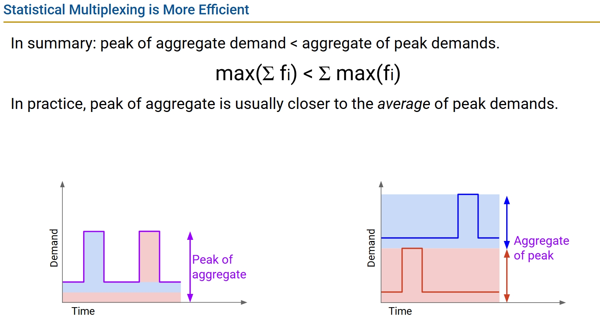

The following problem is, how do we do this dynamic allocation?

Also two ways, either we do reservation and let the routers keep enough resourses, or we just send stuffs anyway and it wait or drop if not enough resourses.

The first one is called **Circuit Switching**.

The second one is called **Packet Switching**.

Obviously, we will want circuit switching better. With that, we would have guarantee resources for our application as long as we reserve it.

However, packet switching is actually used in real life computer networks. Here are the reasons:

First, efficient. Similar problem happen again, if the flow is bursty, you still need to do the reservation with the peak value if you choose the circuit switching. That is not efficient.

See this pic below if not clear:

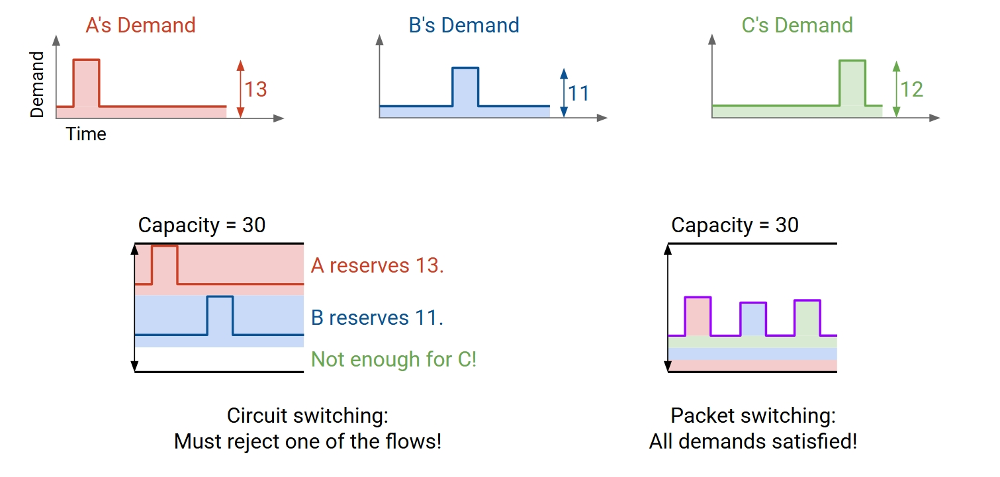

Second, how do you handle the failures if you do reservation? If one router in the middle is broken, or reject the reservation, what do you do to let others know? If you need to seek another working route, how to let all routers know?This is important.

Third, easy to implement. The packet switching is basically just send stuffs anyway. But if you do circuit, you must implement the reservation stuffs. A lot of trouble like what we talked above.

So that is way we just use packet switching.

## Links

Now we can dive into the details of the Internet. Let's start with the links.

### Properties

Here are some properties of the links:

- **Bandwidth**: Number of bits sent/received per unit time. "Width" of the link. Measured in bits per second (bps).

- **Propagation delay**: Time it takes a bit to travel along the link. "Length" of the link. Measured in seconds.

- **Bandwidth-delay product**: Bandwidth × delay. "Capacity" of the link. 

See this pic below if not clear:

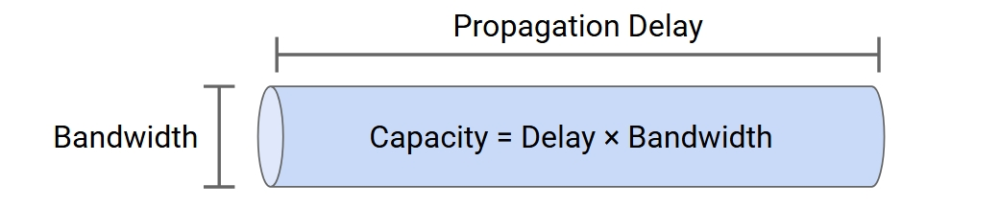

The process is, we send a packet with a lot of bits into the link, only bandwidth bits transmitted in unit time, and continue as bits forward. And the delay is the time it takes for the first bit to arrive at the end of the link.

See this pic below if not clear:

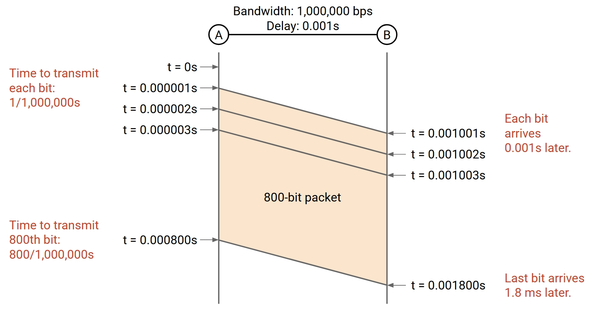

But you can see there is not only propagation delay, but also transmission delay. Some bits are not transmitted in the start time, but wait a while.

It takes (Packet Size / Bandwidth) time to transmit the packet, and this is the **transmission delay**.

The **Packet Delay** is the sum of the propagation delay and the transmission delay.

```
Packet Delay = Propagation Delay + Transmission Delay
Packet Delay = (Packet Size / Bandwidth) + Propagation Delay
```

Interesting question: Bandwidth or Propagation Delay, which is more important?

Actually, this is a trap one. It depends. If the packet is small, the transmission is negligible and propagation delay dominates. But if the packet is large, the transmission delay would be very important, so bandwidth is more important.

### Overload Links

We know routers do stuff like recieve flows and forward them to their destination. Consider this situation: Two links with incoming traffic, and the router send all outgoing traffic out of one link.

See this pic below if not clear:

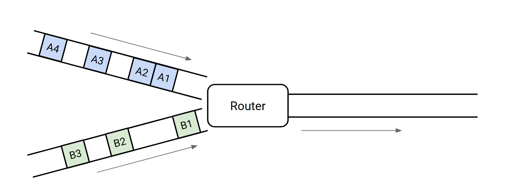

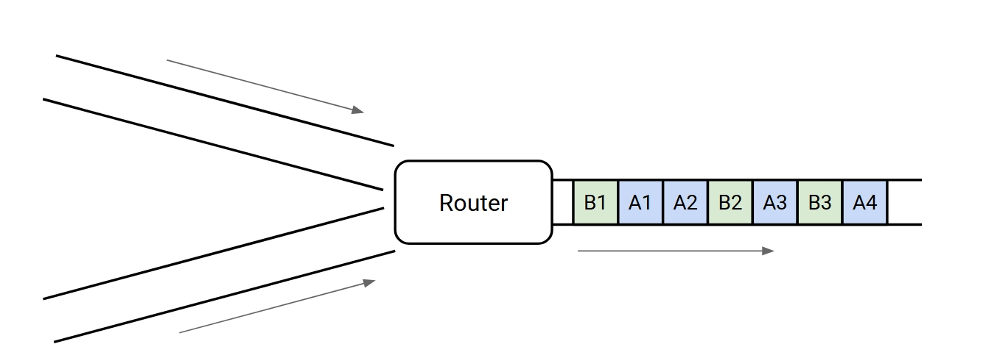

But what happen if two packets arrive at the same time?

Well, it would must queue one to wait and send that latter. 

See this gif below if not clear:

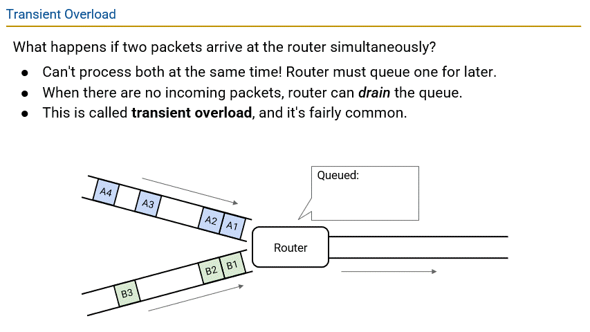

This is what we call **transient overload**.

But sometimes, the overload is not transient. It's persistent. Now the queue won't help, the router would just drop the packets. This is what we call **persistent overload** and we don't like it.

Anyway, if queue still works, it takes a while. So we have this **Queueing Delay**.

And now it would be like this:

```
Packet Delay = Propagation Delay + Transmission Delay + Queueing Delay
```

