# Routing: BGP

I learn this from these 2 lectures' slides:

[Lec9](https://docs.google.com/presentation/d/1Drzjne2Z-BfRmPN1irR-1fRuUTSdY4AQxLx91g376mI/edit?usp=sharing)

[Lec10](https://docs.google.com/presentation/d/1nxeKHVYRTFqAYwyuMZNrYWDCullpOzAlIkin9fB0H6E/edit?usp=sharing)

Most pictures are from these slides.

## Autonomous Systems

I believe we have talked about this word for 100 times: The Internet is the network of networks.

We have talked about Distance-Vector and Link-State protocols, they are both mainly used for intra-domain routing. Today we are going to focus on the inter-domain routing. How do we find paths between different networks?

The **Autonomous System(AS)** is a collection of networks under the same administrative control. And each AS has a unique AS number, called **ASN**.

We can abstract the individual routers and end hosts away to have this inter-domain topology, or AS graph. In this graph, each node is an AS.

See the pic below if not clear:

For AS, we have two types. One is **Stub AS**, it only sends and receives packets on behalf of its inside hosts. Most of the ASes are Stub ASes. It's quite like end hosts in the intra-domain routing. Another is **Transit AS**, it forwards packets for other ASes. Quite like routers in the intra-domain routing. But it can still send and receive packets for its inside hosts. The examples of transit ASes are AT&T, Verizon, etc.

Inter-domain topology is actually shaped between business relationships between different ASes. Two ASes can be related in two ways, **customer-provider** or **peering**. The customer pays and the provider forwards the traffic to or from the customer in exchange. Or they just exchange roughly equal traffic for free.

We use arrow in graph to show the customer-provider relationship. The arrow points from provider to customer, means providing service to this direction. However, it doesn't stand for the direction of traffic.

See this pic below if not clear:

And in this graph, we can clearly see that F, G and H are stub ASes, and A, B, C, D and E are transit ASes.

AS graph must be acyclic. Because that means you are paying yourself. So the peering cycle is okay, it doesn't mean a loop.

See this pic below if not clear:

In the AS graph, there is actually a hierarchy. The arrows are pointing from the higher level to the lower level. This means services go from up to down, while money goes from down to up.

Those ASes at the top of the hierarchy are called **Tier-1 ASes**. They have no providers, no traffic in. And they are peering connected with each other in the tier 1, so that the whole AS graph can be guarantee connected.

See this pic below if not clear:

Every non-tier-1 AS must have at least one provider. And you go up from a non-tier-1 AS must finally reach a tier-1 AS.

## Goals of Inter-Domain Routing

The goals of inter-domain routing are:

- **Scalability**: Routing must scale to the entire Internet. We use the hierarchical IP addressing to do this, we have talked about it.
- **Privacy**: ASes don't want to explicitly announce sensitive information. I shouldn't have to tell everybody who my provider is. Companies might not want to reveal information to rivals.
- **Autonomy**: ASes want the freedom to choose their own policies. Policy is usually based on business goals.

Let's focus on autonomy. To make a path valid, inter-domain routing is the same as intra-domain routing, just no loops and dead ends. However, to make a path good, intra-domain just need to make it lowest cost, but inter-domain routing need to make it respect every AS's policy.

An AS can have many kinds of policies. For example, I don't want to carry traffic from that guy, I prefer my traffic carry by these guys rather than those guys, and best never by that guy, Or even I want this guy to carry on weekdays, that guy on weekends.

We have to find paths that respect every AS's policy.

But setting any random policy they want is crazy, in practice ASes usually follow some standard conventions called **Gao-Rexford Rules**. The ideas of it is from the real world business experience, which are making money is good, and never do work for free.

It's base on Distance-Vector protocol, but not prefer the shortest path, but prefer the path that is the most profitable.

- **Best**: Path where the next hop is a customer. (They pay me.)
- **Less good**: Path where the next hop is a peer. (I don't make money.)
- **Worst**: Path where the next hop is a provider. (I have to pay.)

See this pic below if not clear:

To check if I get paid, I must look at my two neighbors, and I get paid if and only if one of them is a customer.

So if two neighbors are both customers, definitely participate in the path. If one of them is a customer, and the other is a peer, still okay. If one is a provider, one is a customer, still should participate in the path. But if two are peers, then I don't participate in the path, never do work for free, so peers don't provide transit between other peers.

See this pic below if not clear:

If two neighbors are both providers, definitely not participate in the path. Pay two neighbors? No thanks!

So these rules ensure that the path must be **single-peaked**. We first climb 0 or more uphill links, which means from customer to provider. Then we go through 0 or 1 peering links. Then we must go strictly downhill, which means from provider to customer, all the way to the destination. If any downhill then uphill show up, somebody lose money.

See this pic below if not clear:

As long as:

- Starting from any AS and moving up the hierarchy will lead to a Tier 1 AS.
- The AS graph has no cycles.
- All ASes follow the Gao-Rexford rules.

Then we can guarantee that any two ASes can find a path between them, and all ASes agree on the path. Without the Gao-Rexford rules, we can't guarantee this.

## BGP

So to build a new routing protocol, we already have the Distance-Vector and Link-State. Use one as a start point is natural choice, but which?

Remenber we talked about the privacy? The Link-State need you to flood your information to everybody, that's not private. But for the Distance-Vector, the advertisement is toward single destination, like one prefix.

Also, the Link-State require everybody to agree on the same cost metric, this is not good for autonomy.

So we choose the Distance-Vector protocol.

We have new terminology for BGP. **Export** means advertise the best route to one or more neighbors. **Import** means select the best route you hear about.

And we need to extends the Distance-Vector protocol so that we can use policy to decide what to export and what to import.

The import policy is the Gao-Rexford rules. You just pick the route advertised by customer, then peer, then provider.

See this pic below if not clear:

The export policy is just only export the routes that makes me money, so still, you need customer to be at least one side. If you receive a route from a customer, just advertise it to everybody, profitable anyway. But if you receive a route from a peer or a provider, you only advertise it to customers.

See this pic below if not clear:

We have another goal that is scalability, so we must do some change to aggregate prefix. BGP can combine multiple prefixes into one, which means combine multiple ranges into big range. And it can also deal with the multi-homing problem that we have talked about.

And we also have two big problems for Distance-Vector-based BGP. First is that without the lowest cost, we can't guarantee no loops. Second is that we can only support Gao-Rexford rules, not other policies like I don't want that guy to carry my traffic. I need to be able to check if a route against my policy.

To solve these, we need to modify the Distance-Vector protocol into Path-Vector protocol. Instead of advertising distance to destination, advertise the whole AS path. This can solve both problems.

By the way, if a stub AS is connected to a single provider, it doesn't need to run BGP. It would have on default route.

## BGP Implementation

So we already have these big ideas, we know how BGP let ASes talking to each other. But in real life, an AS is made up by a bunch of routers. We must make them act as one.

So we devide routers into these two types. **Border routers** are routers that have at least one link to a router in a different AS. And **interior routers** are routers that only link to routers in the same AS.

See this pic below if not clear:

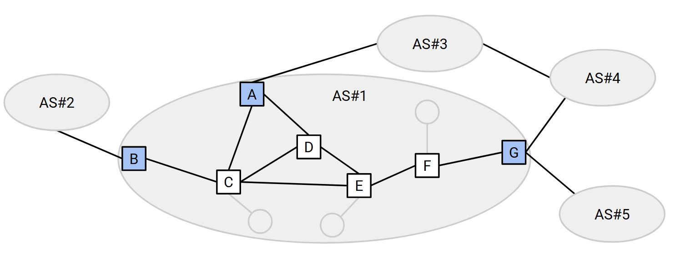

The border routers are BGP speakers, they advertise BGP paths to other ASes. They must understand BGP syntax and semantics.

Except for the border routers of stub ASes, they don't need to run BGP. They can just use the default route.

**BGP session** is two routers exchanging BGP information between each other.

**External BGP (eBGP) session** is between two routers in different ASes. Border routers use eBGP to exchange inter-domain routes.

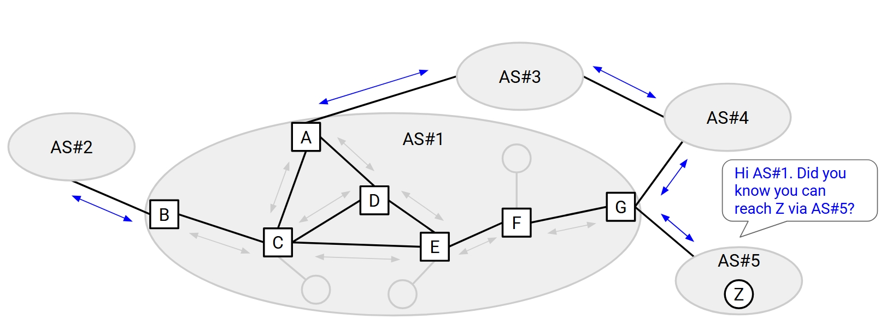

**Internal BGP (iBGP) session** is between two routers in the same AS. Border routers use iBGP to distribute the routes they discover to other routers in the same AS.

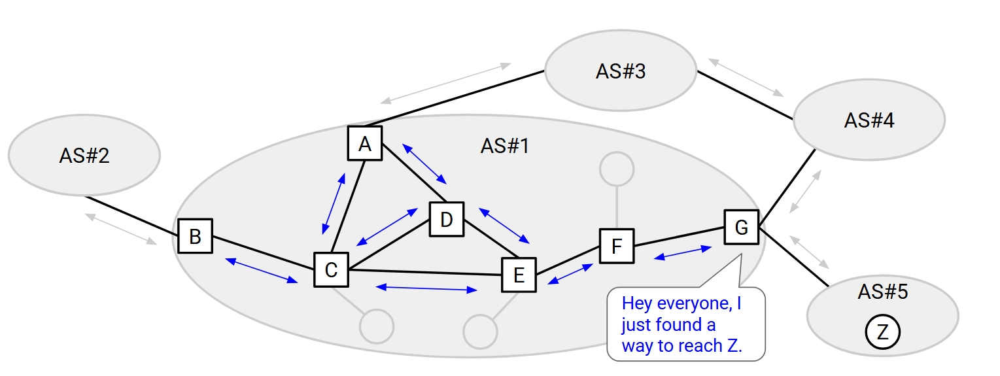

This is different from the Interior Gateway Protocol (IGP) that we have talked about. IGP is used to find paths within an AS. Distance-Vector and Link-State are IGPs.

So the process is, use IGP to find internal routes, then use eBGP to external routes to other ASes, and use iBGP to distribute the routes to other routers in the same AS.

See this pic below if not clear:

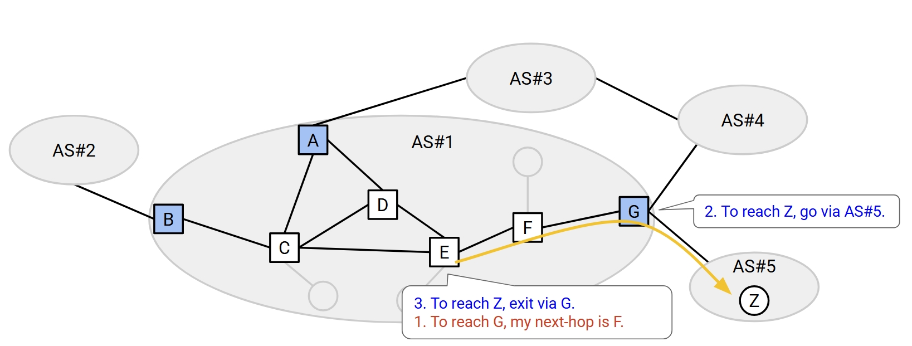

In the above picture, the router G is called an **egress router** for the destination Z. It's the border router who can reach the destination.

So to make this BGP works, we need every router to have two routing tables. One is the IGP table, which maps each internal destination to a next-hop router. The other is the BGP table, which maps each external destination to an egress router.

If the destination is internal, we just go for it on IGP table. If it's external, we find the egress router on BGP table, then go for it on IGP table.

See this pic below if not clear:

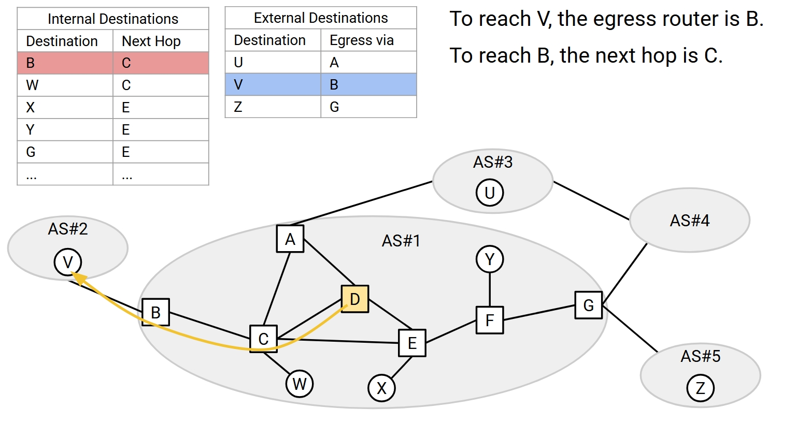

But is it really that simple? No, in the real world, it's normal that there are multiple paths between the same two ASes. So we still need a way to choose the best path. Since the next AS is the same anyway, the Gao-Rexford won't help.

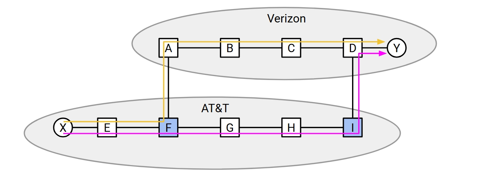

The standard is, ASes prefer the path that uses the least of their own resources. For the pic above, AT&T prefer the yellow path, where the packets mostly travel on Verizon's AS.

This is called the **hot potato routing**. Everyone just wants to get rid of the packet as fast as possible. So AS prefers the nearest egress router.

See this gif below if not clear:

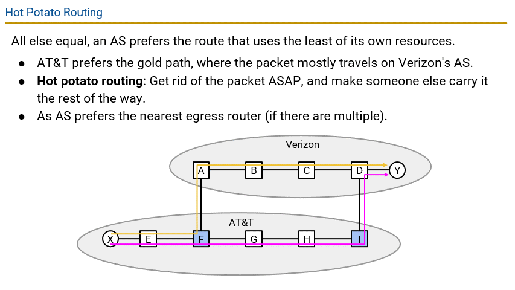

But sometimes there are two egress routers that are equally close. How do we choose now?

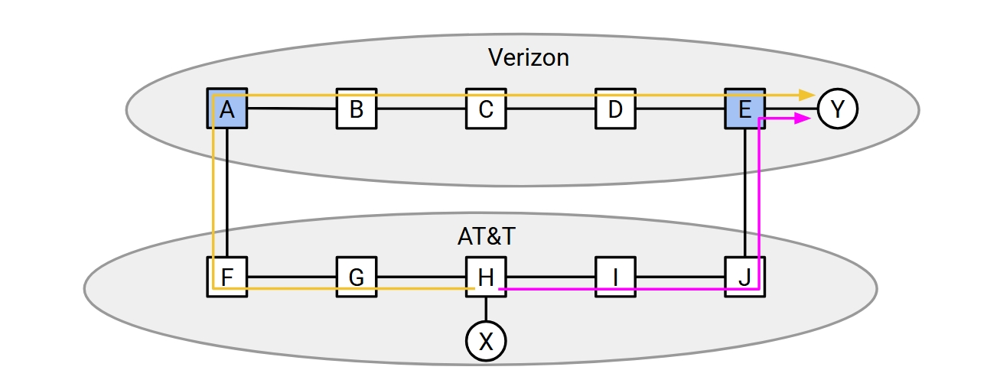

See this above pic, the two routes are all fine for AT&T. So now maybe we can find a way so that Verizon get to choose.

In the pic, Verizon would obviously prefer the pink route. So when Verizon's border routers use eBGP to announce routes to AT&T, they should add something called **Multi-Exit Discriminator(MED)** to show the distance to the destination.

So if anything else is equal, AT&T would choose the route with the smaller MED, which is preferred by Verizon.

See this gif below if not clear:

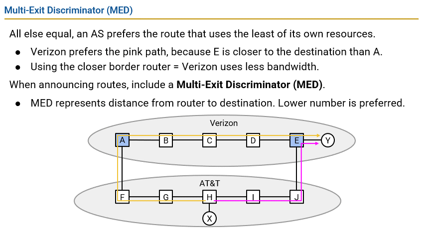

So when you do exporting, you need to use Gao-Rexford rules to decide who can receive your routes first, then you remember to add MED to the routes.

When you do importing, you first use Gao-Rexford rules to choose routes that makes more money, then you choose shorter paths, and you pic path with lower MED. If this still tied, just pick with some random tiebreaker like lower IP address or stuff.

To actually implement BGP, we need to specify the BGP syntax and semantics. There are 4 BGP messages types:

- **Open**: Start a BGP session.
- **KeepAlive**: I'm still here, don't close the BGP session.
- **Notification**: An error occurred.
- **Update**: Announce a route.
  - Could be a new route, an update to an old route, or withdrawing a route.
  - We'll focus on this one.

Update messages use the destination prefix and some route attributes to encode an announcement. Route attributes are things to show the routes' properties, mostly written as name-value pairs. It can be used to do import or export decisions. Some only for internal, some only for external.

We are going to see three attributes:

- **ASPATH**: List of all ASes in this route, in reverse order. This is global.

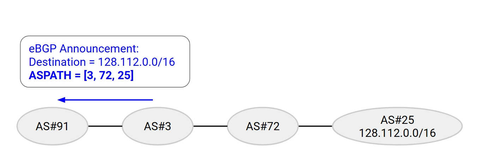

- **LOCAL PREFERENCE**: A higher is better number. This is local only. Used to encode policies preference like Gao-Rexford between AS paths.

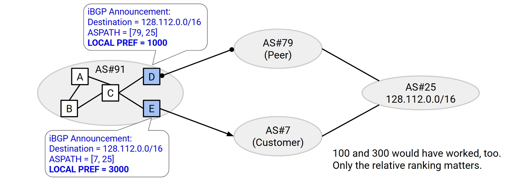

- **MED**: A lower is better number. This is global. We know it pretty well.

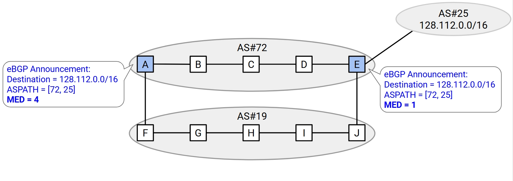

## IP header

Then we move on to the IP header.

See this pic below if not clear:

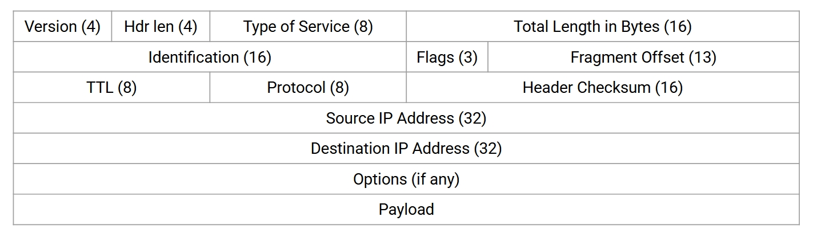

We are going to understand all fields of the IP header. And we are going to understand why design it like this.

To do this, we need to see through these fields by thinking what the IP header need to do.

Routers and destinations need to see the IP header to know how to **parse the packet**. So the IP header need a **Version** field to tell it's IPv4 or IPv6, a **Hdr len** field(measured in 4-byte words) to tell the header length and a **Total len**(measured in bytes) field to tell where the packet ends.

Routers need to see the IP header to know how to **forward the packet**. So the IP header need **Destination IP Address** to tell where to forward the packet.

And the destination need to see the IP header to see what to do next. So the IP header need a **Protocol** field to identify the Layer 4 protocol to pass the payload to.

See this pic below if not clear:

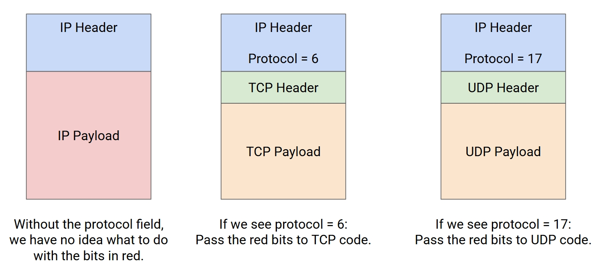

When it's TCP next, you set it to 6. When it's UDP next, you set it to 17.

Routers and destinations need to see the IP header to know how to **send response back to the source**. So the IP header need a **Source IP Address** to tell where the packet comes from.

Routers and destinations need to see the IP header to handle errors. Mostly forwarding loops, which cause packets to be forwarded infinitely. So the IP header need a **TTL** field to tell how many hops at most the packet can travel, and decremente it at every hop by the router. So that if router receives packet with TTL 1, it discard it and send back a time exceeded message.

Another error is that a packet can be corrupted in transit. So the IP header need a **Checksum** field to tell if the packet is corrupted, router or destination discard it if the checksum is incorrect. Notice that the checksum is just about the IP header, following the end-to-end principle, the payload should only be checked by the end host. We update the checksum every router, since the TTL is changed. Some decide to not include the TTL into the checksum computation, so that no need to recompute.

Our last problem is that sometimes the packet can by too large for a link, since every link has a number of bits that it can at most carry as one unit. So that sometimes the router need to fragment the packet, and the host need to recover the original packet. To do this, we need IP header to have a **Identification** field that each fragment of the same packet has the same identification. And we need a **Flags**, DF means don't fragment just drop it if too large, MF means more fragments in following. Also we need a **Fragment Offset** field to tell which bytes of the original packet are in the fragment.

See this pic below if not clear:

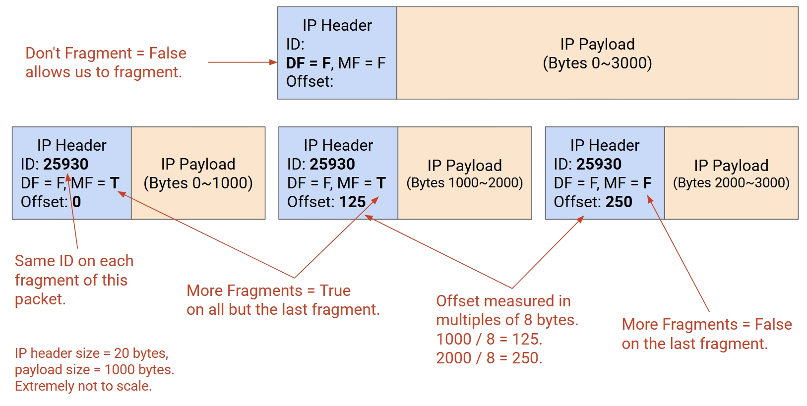

Routers and destinations need to see the IP header to see if there are any special requirement for handling the packet. So we need the IP header to have a **Type of Service** field to tell how the application or user need you to treat the packet, and a **Options** field to request some special treatment.

See this pic below for a big picture of IP header fields:

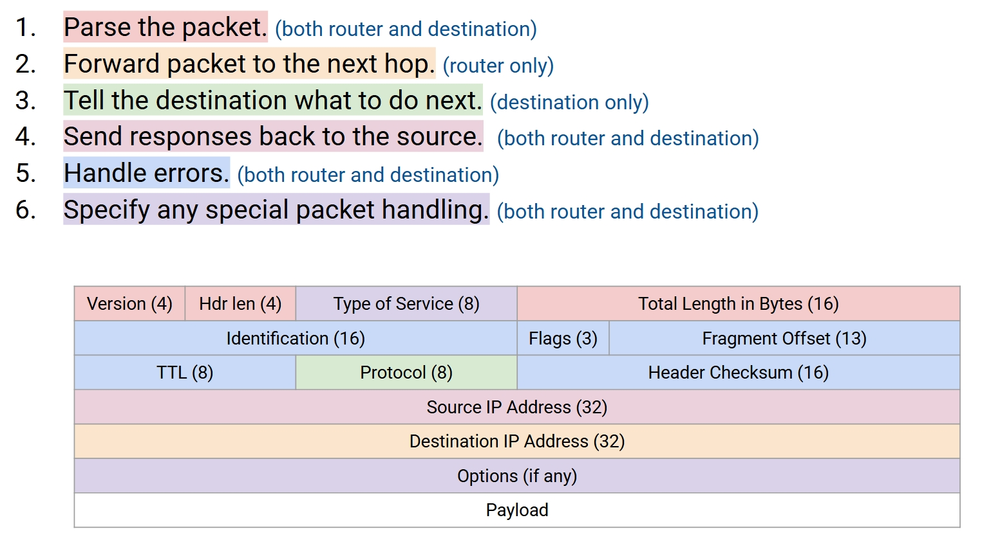

So we know IPv4 addresses are 32 bits long, which has only about 4.2 billion possibilities, and we are running out of it.

So we need IPv6 which is 128 bits long, the possibilities are basically not possible to run out. And with this oppotunity, we can make some change to the IP header, update and remove some outdated fields.

Firstly, we eliminate the checksums. Today our bandwidth is not in that shortage so that we can afford some corrupted packets to be sended through the network. Much less work to do for routers so that they can process faster.

And we eliminate the fragmentation. If a packet is too large, just drop it. It's the sender's responsibility to send a smaller packet. This way we also make routers live a easier life.

Then we eliminate options. If you need some special treatment, you put the protocol in the **next header** field. IPv6 will send it to that protocol, and send to Layer 4 after the special treatment.

Finally, we add a **Flow Label** field. It can be used to identify a flow. Original Layer 3 design send packets independently, let the higher layers deal with the flow. But sometimes routers need to check packets as flow, like when it need to block some malicious traffic.

See this pic below for the IPv6 changes:

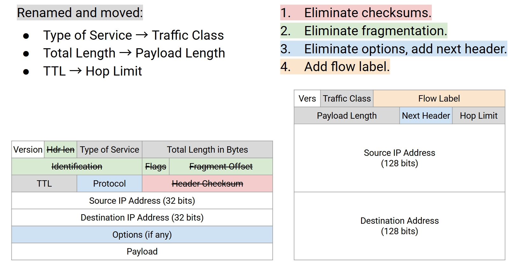

Basically, the philosophy is just less work for routers and let the hosts deal with them.
