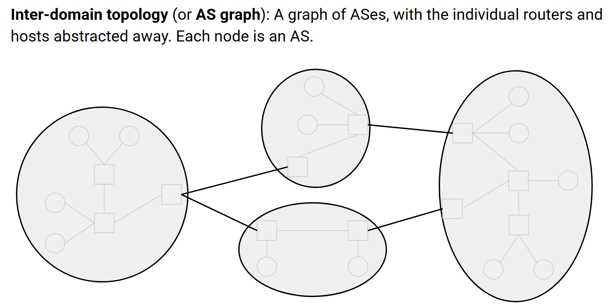
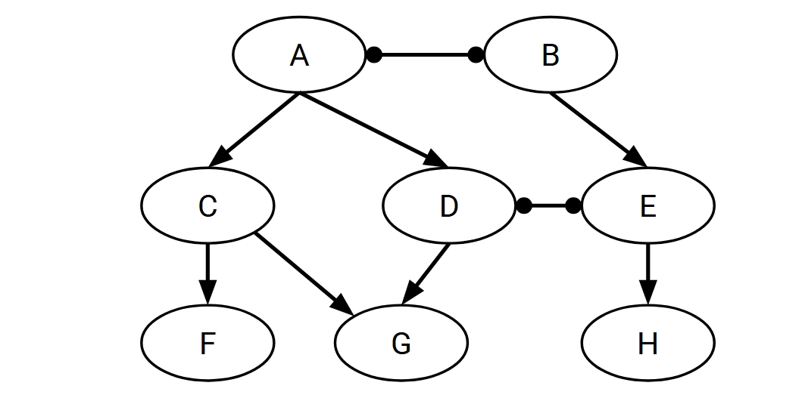
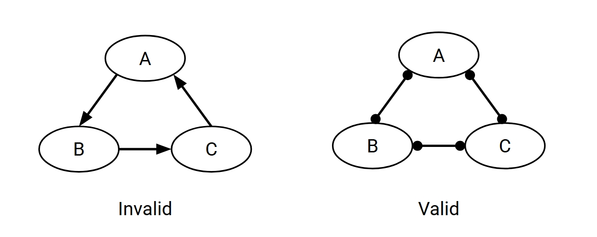
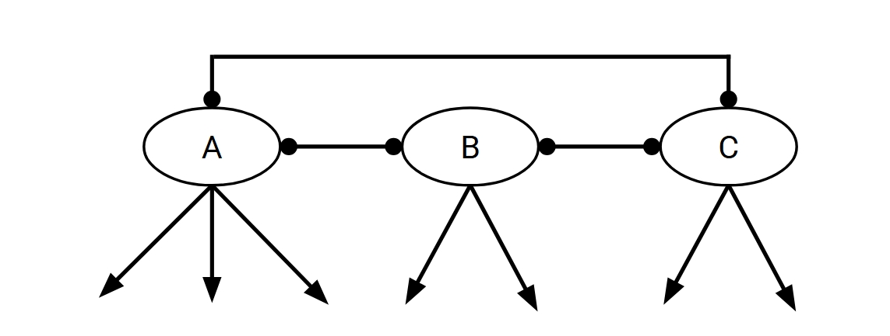
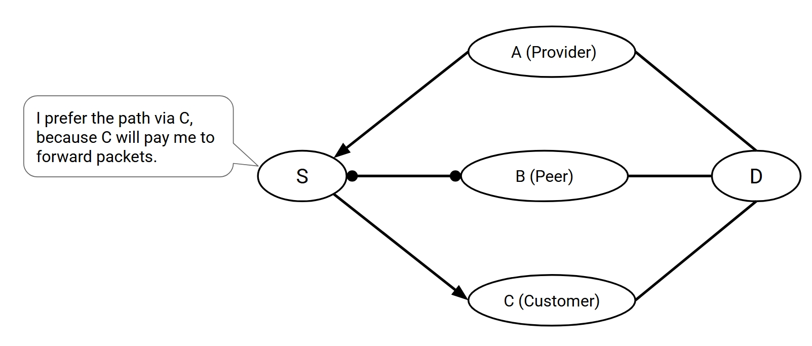
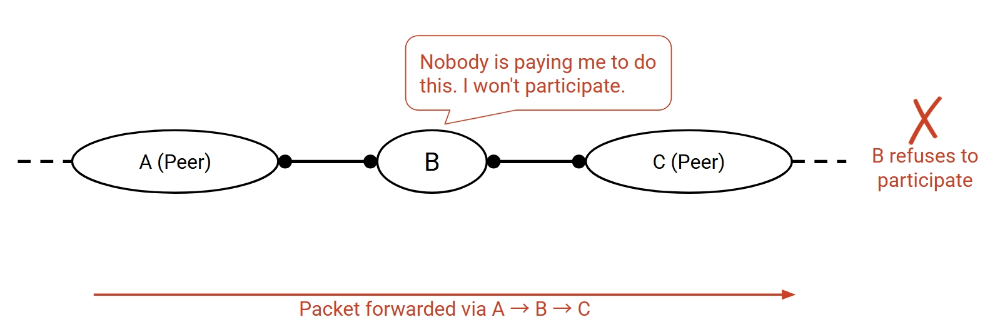
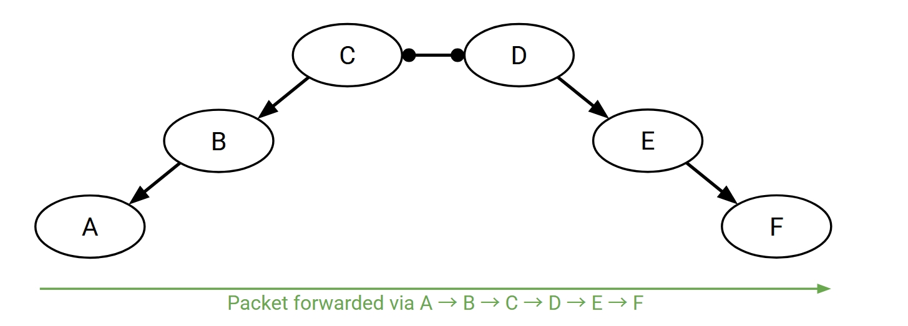
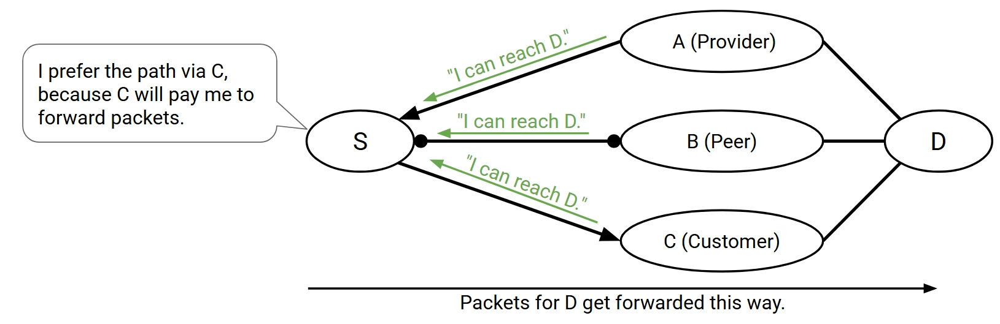
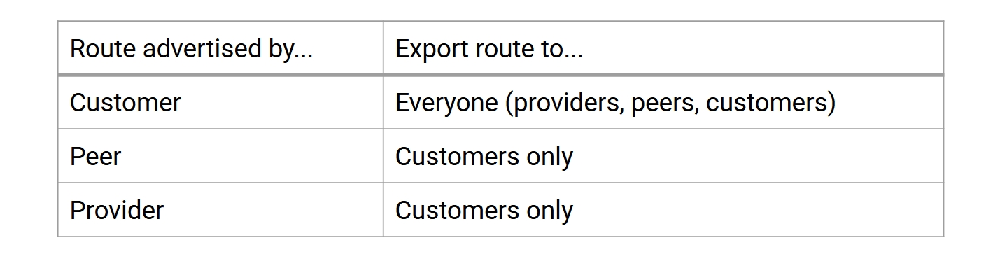

# Routing: BGP

I learn this from these 2 lectures' slides:

[Lec9](https://docs.google.com/presentation/d/1Drzjne2Z-BfRmPN1irR-1fRuUTSdY4AQxLx91g376mI/edit?usp=sharing)

[Lec10](https://docs.google.com/presentation/d/1nxeKHVYRTFqAYwyuMZNrYWDCullpOzAlIkin9fB0H6E/edit?usp=sharing)

Most pictures are from these slides.

## Autonomous Systems

I believe we have talked about this word for 100 times: The Internet is the network of networks.

We have talked about Distance-Vector and Link-State protocols, they are both mainly used for intra-domain routing. Today we are going to focus on the inter-domain routing. How do we find paths between different networks?

The **Autonomous System(AS)** is a collection of networks under the same administrative control. And each AS has a unique AS number, called **ASN**.

We can abstract the individual routers and end hosts away to have this inter-domain topology, or AS graph. In this graph, each node is an AS.

See the pic below if not clear:

For AS, we have two types. One is **Stub AS**, it only sends and receives packets on behalf of its inside hosts. Most of the ASes are Stub ASes. It's quite like end hosts in the intra-domain routing. Another is **Transit AS**, it forwards packets for other ASes. Quite like routers in the intra-domain routing. But it can still send and receive packets for its inside hosts. The examples of transit ASes are AT&T, Verizon, etc.

Inter-domain topology is actually shaped between business relationships between different ASes. Two ASes can be related in two ways, **customer-provider** or **peering**. The customer pays and the provider forwards the traffic to or from the customer in exchange. Or they just exchange roughly equal traffic for free.

We use arrow in graph to show the customer-provider relationship. The arrow points from provider to customer, means providing service to this direction. However, it doesn't stand for the direction of traffic.

See this pic below if not clear:

And in this graph, we can clearly see that F, G and H are stub ASes, and A, B, C, D and E are transit ASes.

AS graph must be acyclic. Because that means you are paying yourself. So the peering cycle is okay, it doesn't mean a loop.

See this pic below if not clear:

In the AS graph, there is actually a hierarchy. The arrows are pointing from the higher level to the lower level. This means services go from up to down, while money goes from down to up.

Those ASes at the top of the hierarchy are called **Tier-1 ASes**. They have no providers, no traffic in. And they are peering connected with each other in the tier 1, so that the whole AS graph can be guarantee connected.

See this pic below if not clear:

Every non-tier-1 AS must have at least one provider. And you go up from a non-tier-1 AS must finally reach a tier-1 AS.

## Goals of Inter-Domain Routing

The goals of inter-domain routing are:

- **Scalability**: Routing must scale to the entire Internet. We use the hierarchical IP addressing to do this, we have talked about it.
- **Privacy**: ASes don't want to explicitly announce sensitive information. I shouldn't have to tell everybody who my provider is. Companies might not want to reveal information to rivals.
- **Autonomy**: ASes want the freedom to choose their own policies. Policy is usually based on business goals.

Let's focus on autonomy. To make a path valid, inter-domain routing is the same as intra-domain routing, just no loops and dead ends. However, to make a path good, intra-domain just need to make it lowest cost, but inter-domain routing need to make it respect every AS's policy.

An AS can have many kinds of policies. For example, I don't want to carry traffic from that guy, I prefer my traffic carry by these guys rather than those guys, and best never by that guy, Or even I want this guy to carry on weekdays, that guy on weekends.

We have to find paths that respect every AS's policy.

But setting any random policy they want is crazy, in practice ASes usually follow some standard conventions called **Gao-Rexford Rules**. The ideas of it is from the real world business experience, which are making money is good, and never do work for free.

It's base on Distance-Vector protocol, but not prefer the shortest path, but prefer the path that is the most profitable.

- **Best**: Path where the next hop is a customer. (They pay me.)
- **Less good**: Path where the next hop is a peer. (I don't make money.)
- **Worst**: Path where the next hop is a provider. (I have to pay.)

See this pic below if not clear:

To check if I get paid, I must look at my two neighbors, and I get paid if and only if one of them is a customer.

So if two neighbors are both customers, definitely participate in the path. If one of them is a customer, and the other is a peer, still okay. If one is a provider, one is a customer, still should participate in the path. But if two are peers, then I don't participate in the path, never do work for free, so peers don't provide transit between other peers.

See this pic below if not clear:

If two neighbors are both providers, definitely not participate in the path. Pay two neighbors? No thanks!

So these rules ensure that the path must be **single-peaked**. We first climb 0 or more uphill links, which means from customer to provider. Then we go through 0 or 1 peering links. Then we must go strictly downhill, which means from provider to customer, all the way to the destination. If any downhill then uphill show up, somebody lose money.

See this pic below if not clear:

As long as:

- Starting from any AS and moving up the hierarchy will lead to a Tier 1 AS.
- The AS graph has no cycles.
- All ASes follow the Gao-Rexford rules.

Then we can guarantee that any two ASes can find a path between them, and all ASes agree on the path. Without the Gao-Rexford rules, we can't guarantee this.

## BGP

So to build a new routing protocol, we already have the Distance-Vector and Link-State. Use one as a start point is natural choice, but which?

Remenber we talked about the privacy? The Link-State need you to flood your information to everybody, that's not private. But for the Distance-Vector, the advertisement is toward single destination, like one prefix.

Also, the Link-State require everybody to agree on the same cost metric, this is not good for autonomy.

So we choose the Distance-Vector protocol.

We have new terminology for BGP. **Export** means advertise the best route to one or more neighbors. **Import** means select the best route you hear about.

And we need to extends the Distance-Vector protocol so that we can use policy to decide what to export and what to import.

The import policy is the Gao-Rexford rules. You just pick the route advertised by customer, then peer, then provider.

See this pic below if not clear:

The export policy is just only export the routes that makes me money, so still, you need customer to be at least one side. If you receive a route from a customer, just advertise it to everybody, profitable anyway. But if you receive a route from a peer or a provider, you only advertise it to customers.

See this pic below if not clear:

We have another goal that is scalability, so we must do some change to aggregate prefix. BGP can combine multiple prefixes into one, which means combine multiple ranges into big range. And it can also deal with the multi-homing problem that we have talked about.

And we also have two big problems for Distance-Vector-based BGP. First is that without the lowest cost, we can't guarantee no loops. Second is that we can only support Gao-Rexford rules, not other policies like I don't want that guy to carry my traffic. I need to be able to check if a route against my policy.

To solve these, we need to modify the Distance-Vector protocol into Path-Vector protocol. Instead of advertising distance to destination, advertise the whole AS path. This can solve both problems.

By the way, if a stub AS is connected to a single provider, it doesn't need to run BGP. It would have on default route.

## BGP Implementation

## IP header
