# Routing: Link-State, Addressing,Routers

I learn this from these 2 lectures' slides:

[Lec7](https://docs.google.com/presentation/d/12Zl53GNXpSC-tXg8Jk5hKHCUrvukJ_PbG7fOhfe-7D0)

[Lec8](https://docs.google.com/presentation/d/1XmAVR1WizmgTzua_36Yq_YQRXI2m2eqOpejtu7XWTeI)

Most pictures are from these slides.

## Link-State Protocols

We used to talk about routing protocols can be classified into IGPs(Interior Gateway Protocols) and EGPs(Exterior Gateway Protocols) by where they operate. It can actually also be classified by how they operate. So we have Distance-Vector that we already know, and Link-State, path-vector.

See this pic below if not clear:

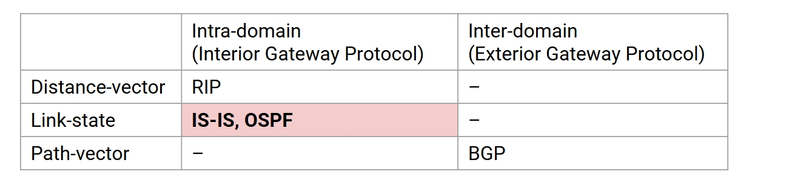

So the Link-State protocola are actually very common as Intra-domain protocols. Then what is it?

The Link-state protocols require routers to learn the full network graph, and then each router runs a shortest path algorithm to compute its forwarding table.

In other words, the main reason between Distance-Vector and Link-State is that Link-State protocals use global data and do local computation, while Distance-Vector protocols use local data and do global computation.

You may ask, what algorithm does Link-State protocols use? I believe you know a lot of them, if you have been to some data structure courses. We have Bellman-Ford, Dijkstra, BFS, etc. But it actually doesn't matter, every single algorithm would work.

But there still need to be some rules. Or no guarantee that all the routers will compute the same ways, and even cause some trouble.

See this pic below if not clear:

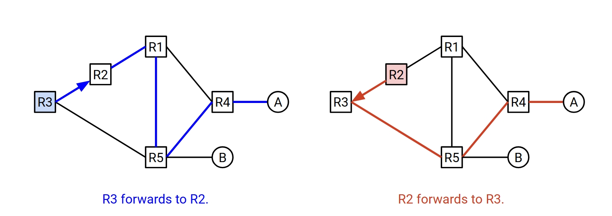

To make routers get valid and compatible results, we need them to all agree:

- Everyone agrees on the network topology.
- Everyone is minimizing the same cost metric.
- All costs are positive.
- All routers use the same tie-breaking rules.

As long as they do these, it really doesn't matter that they use different algorithms. Same would be a litter more convenient, of course.

Besides the algorithms, we also need routers to know the network topology. So how do they do that?

First, I think it's necessary to know the neighbors. It's pretty like you and your friends, you meet periodically and say hello, if not meet someone for a while, you know he may be dead, or married. So we just let the routers periodically say hello to their neighbors, if someone stop saying hello, assume it disappeared.

See this pic below if not clear:

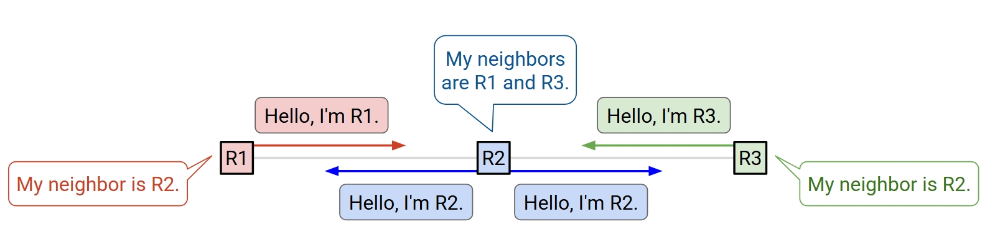

But we need to know the entire network, so how do we know the rest? The approach is to flood information across the entire network. When local information changes, or when you receive information from your neighbors, you send it to everyone.

This is a naive approach and it has problems. When there is a loop, copies of a message will be sent forever. This is called **amplification**.

See this pic below if not clear:

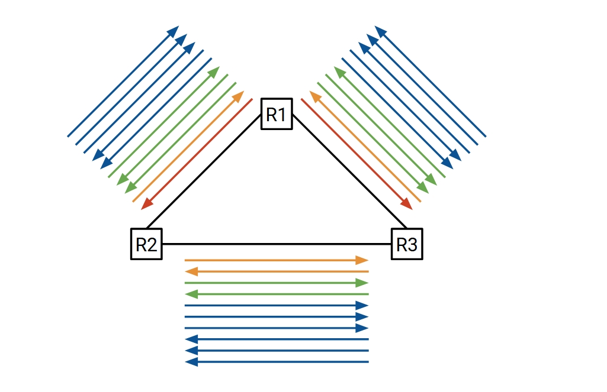

To solve this, we should do the following. When local information changes, we still need to send it to all neighbors. But when we receive a information from you neighbor, you need to see have you seen this packet before, you send it to everyone unless you have seen it.To identify you have seen before, you can add some unique identifier to the packet.

See this pic below if not clear:

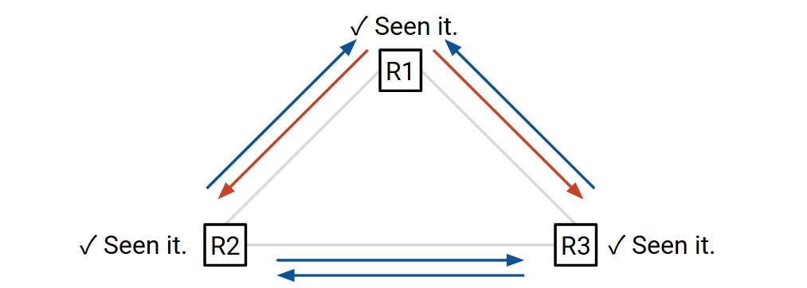

So we can ensure all information will be sent to everyone for once. But we still have an old problem, the network is only best-effort. The solution is also old, we just do the resending periodically.

## IP Addressing

So we have Distance-Vector and Link-State protocols, they all work well. However, you might have realized that maintain a table like this is crazy. Can we really scale routing or forwarding to every end hosts in the Internet? How is that even possible? I mean, if you do Distance-Vector, how many computations you need to do? If you do Link-State, how can one router store the entire network graph?

To solve this problem, we need to do addressing. The idea is to use more informative names in the forwarding table for all the destinations.

You remember that the Internet is a network of networks. So naturally, it leads to a hierarchy of addresses. You can give every network a unique number, and then every host in the network has a unique number.

See this pic below if not clear:

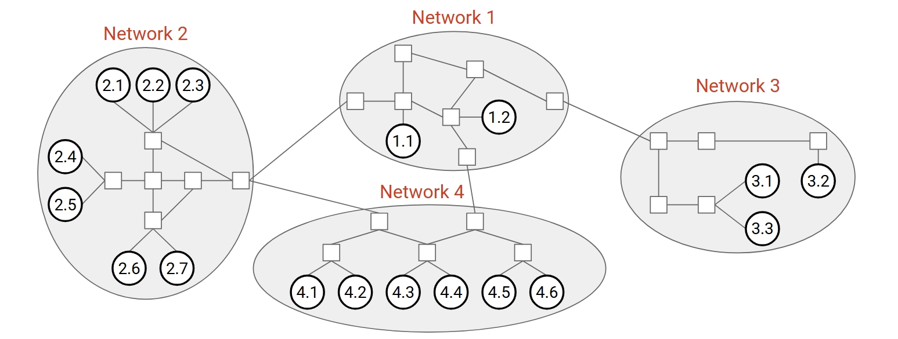

Easy to understand. But how does this help reducing the scale of the forwarding table? Well, for a bunch of end hosts that in the same network, no matter which one you are going to, your next hop might be the same router. So you can just store something like 'no matter where in network n to go, next hop is router r'. This is how you can reduce the scale of the forwarding table. You can summarize all the hosts in the same network into one single table entry.

See this pic below if not clear:

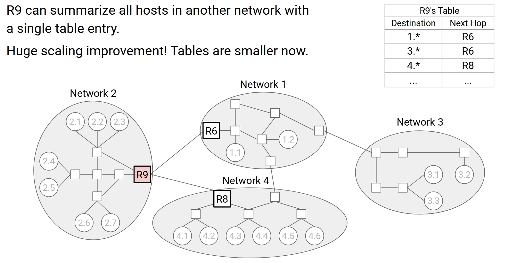

And this even has another very important advantage, which is that it limmits table churn. When a single host changes inside another network, no need to change your forwarding table! How good is that?

See this pic below if not clear:

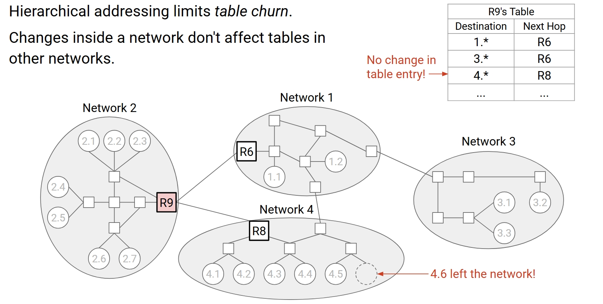

Now the forwarding table only scales with the number of hosts in the current network, and the number of other networks. You can imagine what a big improvement this is, compared to list all the end hosts in the Internet.

Sometimes, we can even do some more aggregation. Like for an router, any packet to the external networks has the same next hop router, it can also just store all of these external hosts in one entry, no matter how many networks they are in.

See this pic below if not clear:

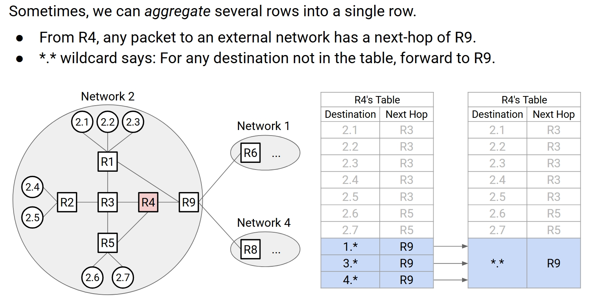

Or not only to those external hosts, sometimes you go to some hosts in the same network also need to go through the same next hop, you can also do this.

See this pic below if not clear:

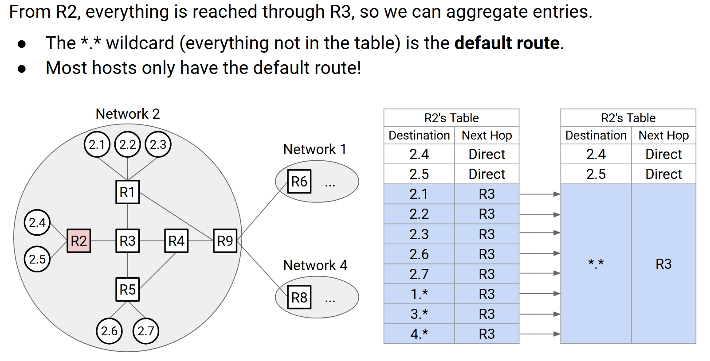

So we know that hierarchy of addresses can make forwarding tables scalable. But how do we actually do this address assigning?

If some addresses are in the same network, in some sense we can say they are quite close, we can make them share some part of their addresses. Its like in a hotel, all the rooms in the third floor start with the number 3. And if some hosts join a network, we need to assign now addresses to them.

The address has 31 bits long. So we have this naive approach, which is the top 8 bits for the network ID, and the rest for the host ID.

See this pic below if not clear:

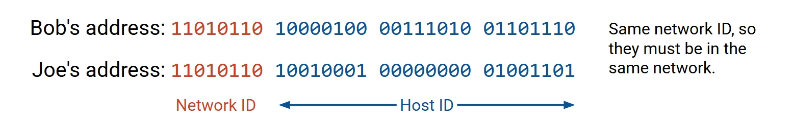

But this has problems, that's why we call it naive. For the network ID, 8 digits, each has 1 and 0 two possibilities, so $2^{8} = 256$ networks. Everyone can see that this is not enough. And if we have a tiny network, $2^{24} = 16777216$ addresses would be wasted.

To fix these, we might need a more dynamic approach. We can allocate different network size base on need! So we need to have a few top bits to tell how we allocate this, and then parts for network ID and host ID.

See this pic below if not clear:

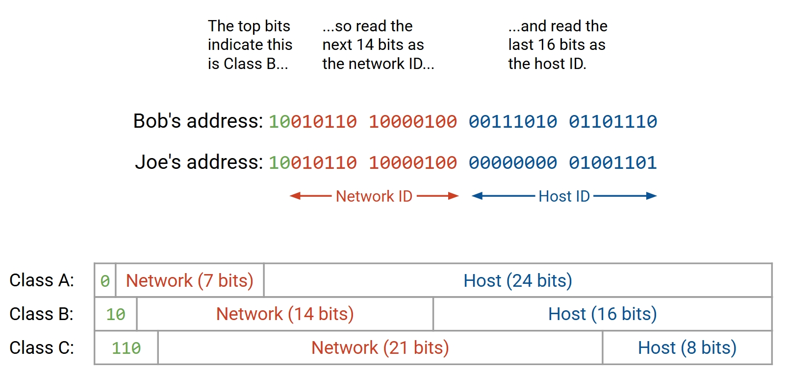

If you calculate, you see that:

- Class A: ~128 networks. ~16m hosts per network.
- Class B: ~16k networks. ~65k hosts per network.
- Class C: ~2m networks. ~256 hosts per network.

But different organizations have different needs. Sometimes you can't find a good choice in these three. It might be wasted for too many hosts addresses, or might be not enough. So we need a more flexible approach.

Why do we need to make these classes? We should be able to assign network IDs for any length! This is what we call **CIDR(Classless Inter-Domain Routing)**. And it's actually what we do in the real world.

See this pic below if not clear:

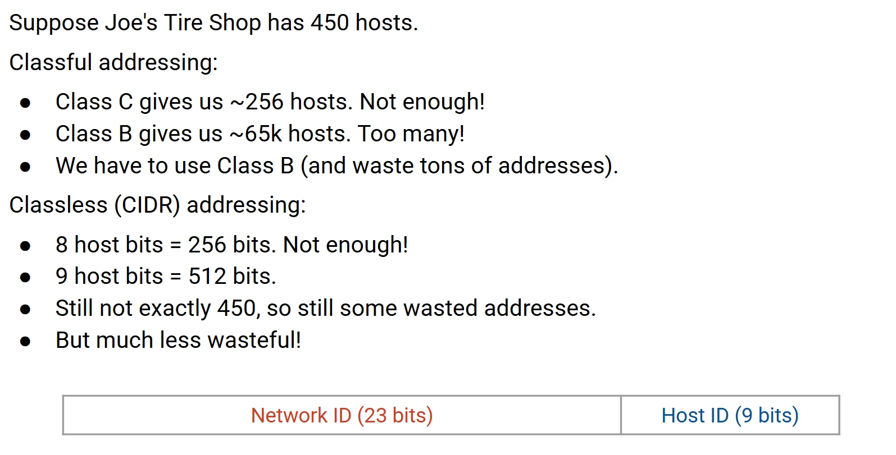

And because we can assign any length of network ID, it enables multi-layered hierarchical assignment of addresses.

- ICANN. (Internet Corporation for Names and Numbers)
  - Top-level organization that owns all the IP addresses.
  - They allocate blocks to...
- RIRs. (Regional Internet Registries)
  - Representing Europe (RIPE), North America (ARIN), Asia/Pacific (APNIC), South America (LACNIC), and Africa (AFRINIC).
  - They give out portions to...
- Large organizations or ISPs.
  - Sometimes called Local Internet Registries (especially in Europe).
  - They give out portions to...
- Small organizations and individuals.
  - Examples: UC Berkeley, Joe's Tire Shop.

See this pic below if not clear:

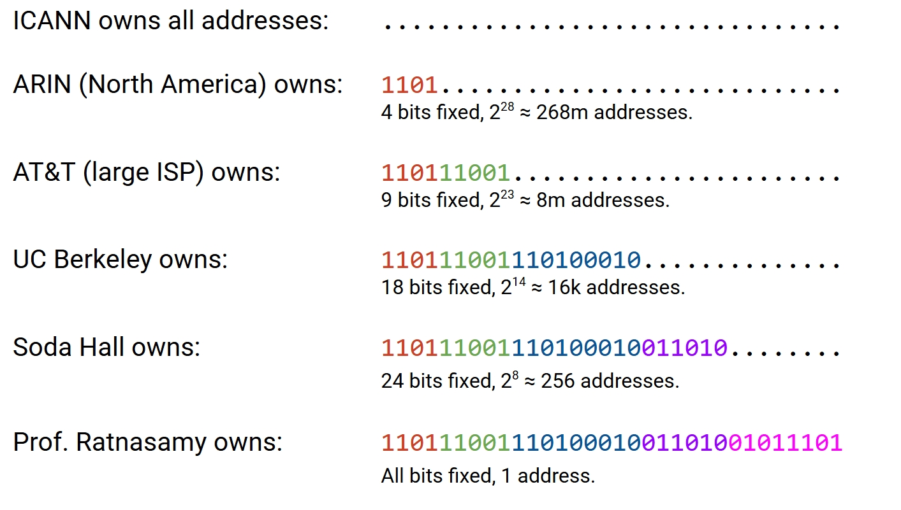

This kind of 32 bits stuffs are so not welcome to human, nobody would want to read it. So we need this **Dotted Quad notation**. We translate every 8 bits into a decimal number, and use dots to separate them.

See this pic below if not clear:

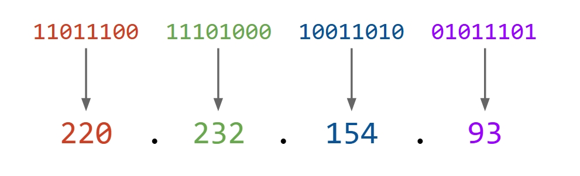

And to write ranges of addresses, we need this **Slash notation**. We set all unfixed bits to 0 and write it down with dotted quad. Then after a slash, we write the number of fixed bits.

See this pic below if not clear:

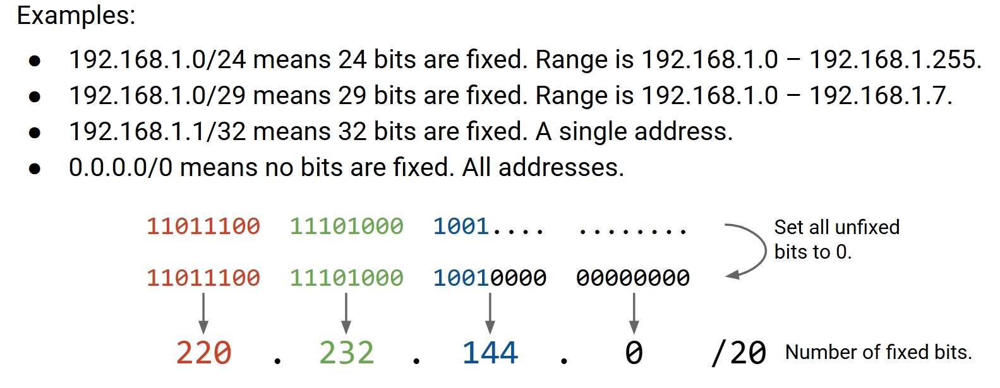

Besides the slash and fixed bits number, we can also use this **Netmask**. Set all fixed bits to 1, and all unfixed bits to 0. Write as a dotted quad. Actually this is more useful in code, but we don't talk about it here.

See this pic below if not clear:

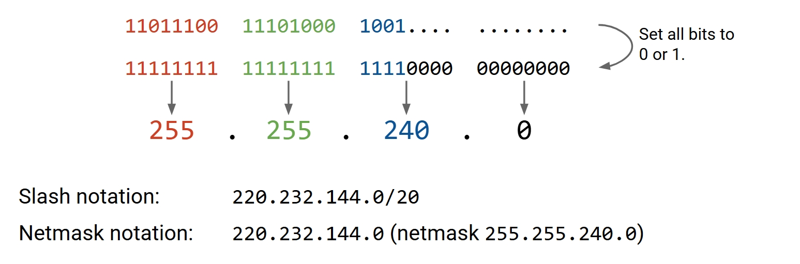

So we have the addressing, and with that, we can do more aggragations.

Like with CIDR, AT&T allocates parts of its ranges to UC Berkeley and Stanford. So we can just aggregate them into one single entry of AT&T.

See this pic below if not clear:

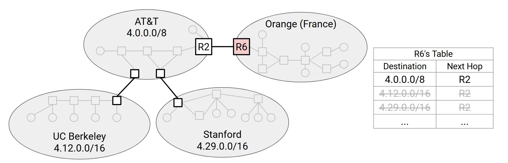

Sometimes things happen, like in the picture example, if one day Standford also wants to connect to the Orange directly, this is what we call **multi-homing**.

See this pic below if not clear:

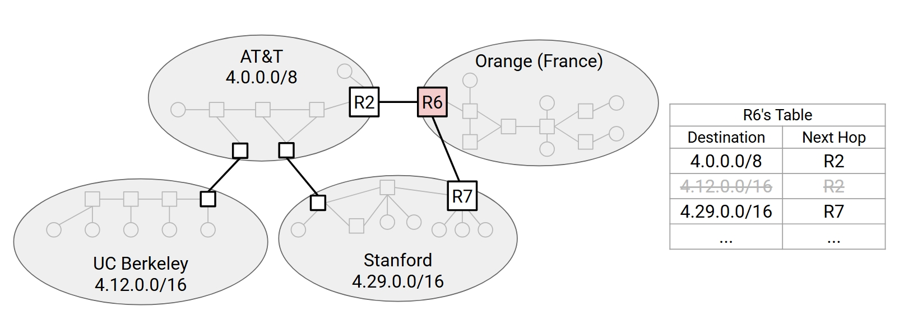

Now R6's table must store an entry for Standford also. So multi-homing sometimes actually limits the aggregation. But not a huge problem.

When we face this situation, we know the range 4.0.0.0/8 a little overlap. Of course, we need to use 4.29.0.0/16, because that is more specific, so that likely more direct. Always use the more specific range if one destination matches multiple ranges, this is called **longest prefix matching**.

By the way, 32 bits, or we call it IPv4, can also be not enough. So we have IPv6, which is basically just change to 128 bits. Some little differences in detail, but not gonna talk about it here.

## IP Routers

So we know that a router runs routing protocols to learn about routes, and it receives and forwards packets according to the forwarding table. But what do routers actually look like in real world?

A router is just a computer specialized for forwarding packets.

To measure the size of routers, we can see the physical size, number of ports or the bandwidth. There is this concept called capacity, which is number of ports $\times$ speed of each port. The speed of port is sometimes called **line rate**.

Because we always run out of physical space to add more ports, the innovation of routers' size focuses on increasing the line rate.

The components of a router are:

- The **Data Plane** handles forwarding packets. Nanosecond time scale.

- The **Control Plane** performs routing protocols. Second time scale.

- The **Management Plane** let the operator interact with the router. Second/minute time scale.

This is a big picture inside a router:

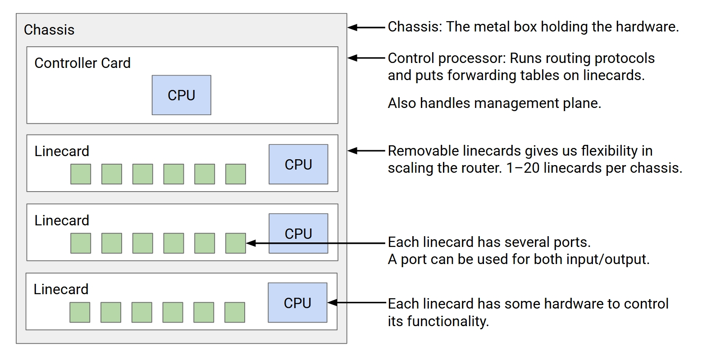

You can see there is a CPU called **Controller Card**, which is responsible for the control plane and management plane. And there are a lot of **linecards**, which have several ports. They are removable, so we have some flexibility in scaling. And each linecard has some hardware(CPU) to control its functionality.

We can also see in the view of links:

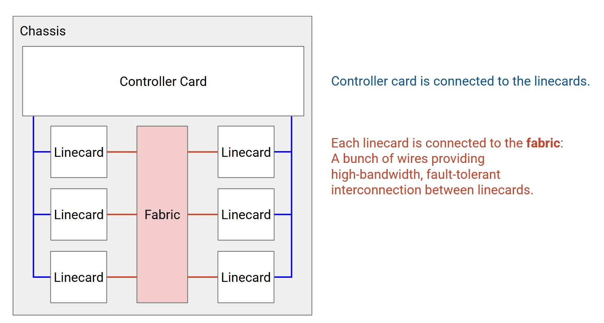

Controller card is connected to the linecards so that it can put forwarding table on them after running the protocol. And each linecard is connected to the fabric, so that they can communicate with each other.

Let's also see deeper into the linecards:

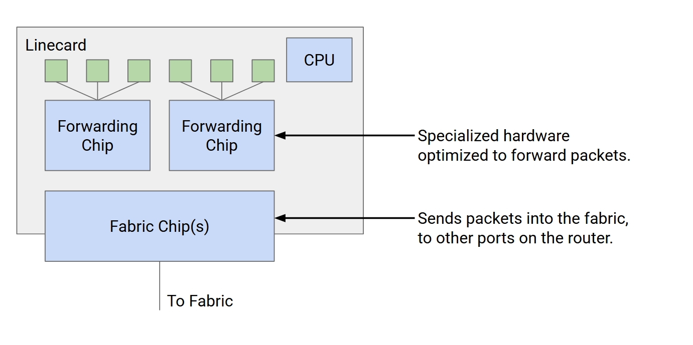

We have these forwarding chips that are connected to the ports, and it's hardware optimized to forward packets. And we also have this fabric chip, which is responsible for connecting to the fabric, so packets can get to other ports on the router. And of course, a CPU that we have talked about.

Now we can see a full view:

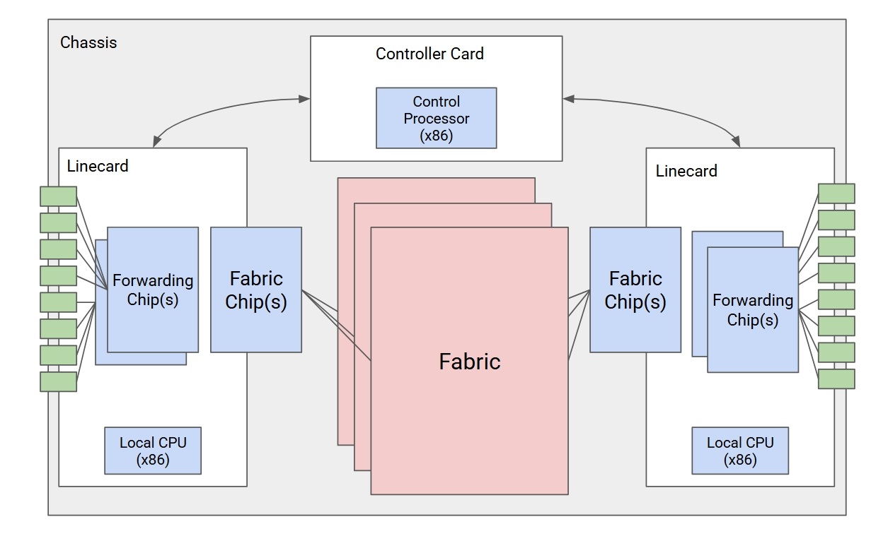

On the data plane, packets come in from one port and get out from another port. On the way, they go through the forwarding chips, fabric chips and fabric.

See this pic below if not clear:

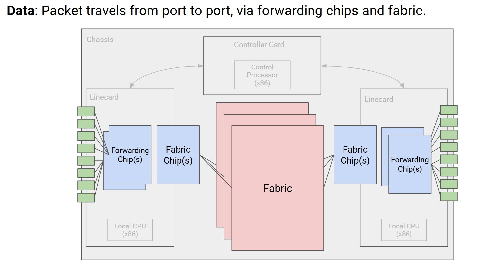

On the control plane, the controller card talks to other routers, then run the routing protocol to get the routing table, and talks to the local CPUs and forwarding chips of linecards to put the table on them.

See this pic below if not clear:

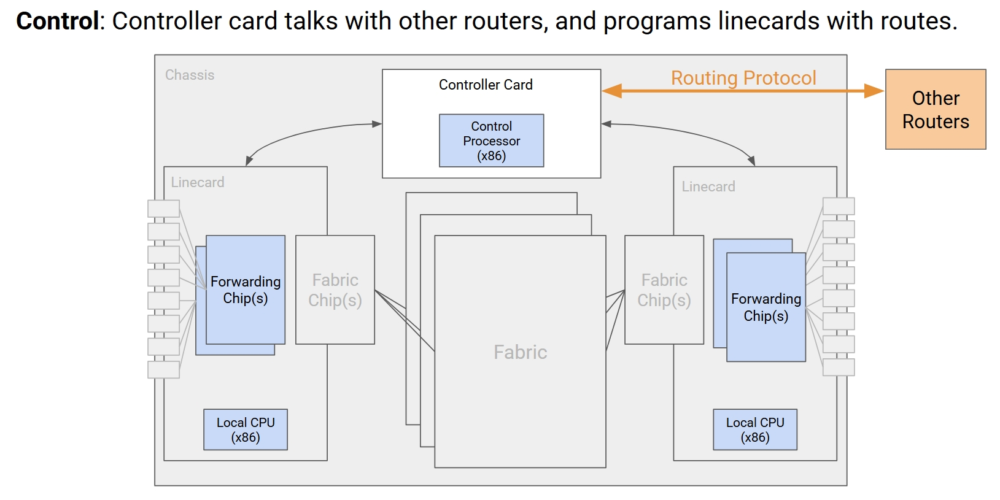

On the management plane, the controller card talks to the configuration system and the monitoring system. So that the operator can interact with the router.

See this pic below if not clear:

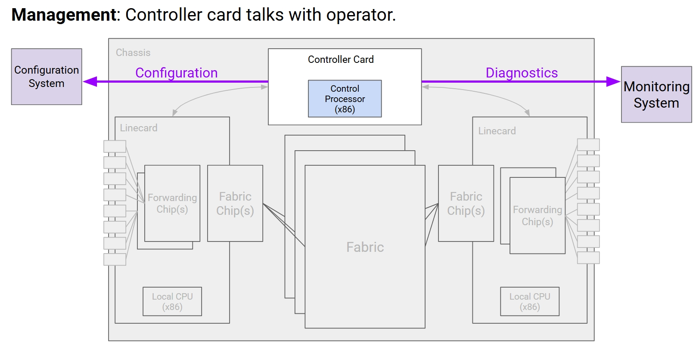

So we know a lot about inside the router. Let's talk about the packets. There are three types of packets that are possible to arrive at a router:

- **User Packet**: The router needs to forward this packet towards its destnation. Forwarding chip look up which port to go, if in another linecard, send it to the fabric.

- **Control plane traffic**: Packets intended for the router itself, like advertisements. Forwarding chip sends it to the controller card for processing.

- **Punt traffic**: Packets intended for the user, but requiring extra processing. Like when a TTL has expired, a error message is sent to the user. The Forwarding chip also needs to send it to the controller card.

Why we have to do this like this than just use a general purpose CPU? Well, the scale is too large for software to handle. So we must build functionality on hardware. The common user packets just go through the very fast hardware path, and only use the slow software path when it's necessary.

Let's go deeper into the forwarding in hardware. What should we do when a packet arrives?

First, the linecard should receive the packet. PHY (physical layer): Decode the optical/electrical signal into 1s and 0s. MAC (link layer): Perform link-layer operations. These are implemented in hardware.

Secondly, we need to process the packet. We parse the packet to understand the hearder, see IPv4 or IPv6, and get the destination, something like that. Then we look up the next hop in the forwarding table. And sometimes we need to update the packet, like decrement the TTL, update checksum, fragment packet if it's too big, etc.

Then we should send the packet through fabric chip to the fabric, and then go to another linecard.

See this pic below if not clear:

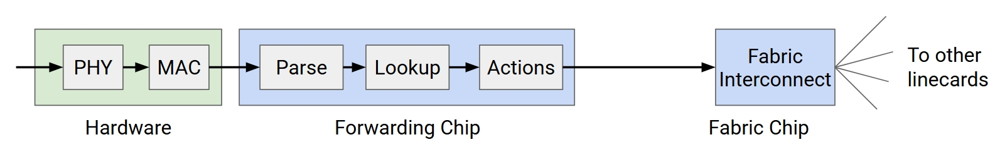

The biggest challenge of forwarding hardware is the speed. One CPU needs to deal with packets from a lot of ports, and needs multiple actions to send one packet. But what is the really hard part?

Parse and most of the actions are easy, some actions are hard but usually done with punting. So the most hard part is actually the loop up. How to do loop up efficiently is the key to the speed of forwarding.

The forwarding table is a map. Our big challenges are that entries can contain ranges of addresses, and a destination can match multiple entries.

So basically, we need a fast implementation of longest prefix matching. Let me first remind you what the longest prefix matching do. 

- If the address matches multiple prefixes, take the most specific (longest) match.
- If the address matches no prefixes, take the default route.
- If there's no default route, drop the packet.

See this pic below if not clear:

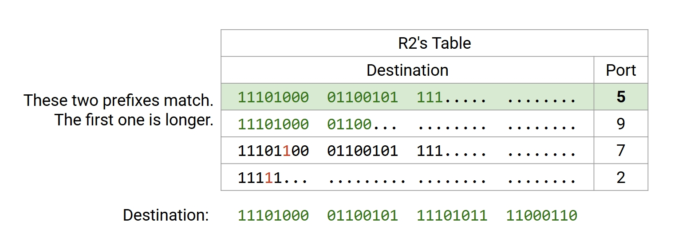

One naive implementation is that we just check if it matches for every prefix, if it matches, we put it into a list, then find the longest one. If it end up empty, we use the default route, or drop the packet.

Requires scanning every entry. O(N) runtime for table with N entries. Totally slow!

For a better implementation, we can use a data structure called **Trie**. It's a special kind of tree, each node is a bit, and the path from root to a node is the prefix.

See this pic below if not clear:

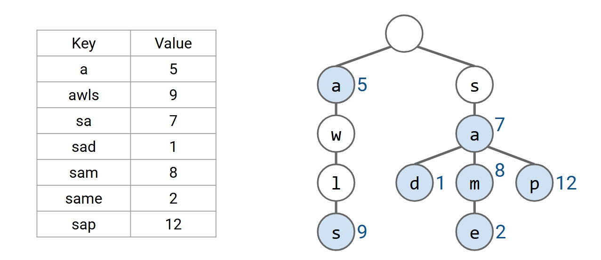

So it basically just spell out each key one letter or digit at a time. When the path forms a valid key, the node would be marked blue.

You can just start at the root, spell out the word, and always remember the most recent blue node. Stop when you are done or fall down the tree, then return the most recent blue node.

In this way, we at most visit 32 nodes, so it's $O(1)$ constant time.

