# Routing: Principles, Distance-Vector

I learn this from these 2 lectures' slides:

[Lec4](https://docs.google.com/presentation/d/1vog2mgvKPGx36gcLQF4gV1ebyGVEYBtOfnDRca9P7g0)

[Lec5-6](https://docs.google.com/presentation/d/1bwx7O8ZLDfFKeZzOrqcUg_X8F13j6SM62DHJ8gEk7ho/edit?usp=sharing)

Most pictures are from these slides.

## Routing Principles

### Define the problem

How do we make a lot of machines communicate with each other?

Here is a naive approach. We just add a link between every pair of machines. This is called full-mesh.

See this pic below if not clear:

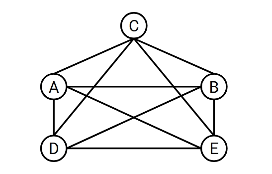

Obviously not a good one. Imagine you have much more machines, the number of links will be huge. Just try add one machine for a few times, you will see my point.

Here is another naive approach. We just use a single link to connect all machines.

See this pic below if not clear:

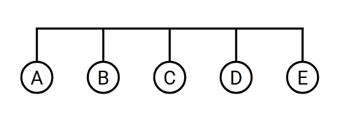

Still got some problems. The most important is less bandwidth because every machine has to share the same link.

To have less links than full-mesh topology, and more bandwidth than single-link topology, we need this wonderful thing called **router**. Which is basically a machine that can forward data.

Besides above benefits, if a link goes down, with routers we can still find other routes.

See this pic below if not clear:

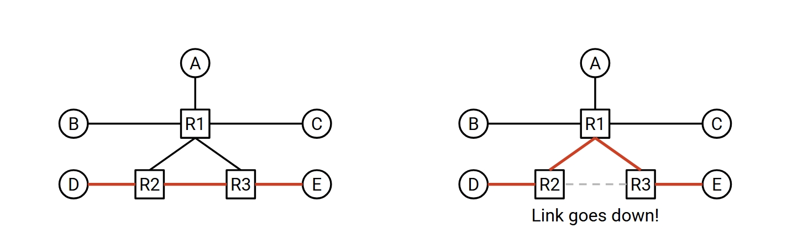

Now we have routers, we can go to the routing problem. How do we compute the path through the network?

Firstly, we need to model the network.

Let's just assume that there are only two types of machines.

- **End hosts** send and receive packets, to and from other end hosts. End hosts don't forward intermediate packets. Your computer is an end host.

- **Routers** forward intermediate packets. For now, assume routers don't send and receive packets of their own. I believe you have seen routers in your home or office.

We'll draw the network as a **graph**. Each edge represents a link. For now, assume a link connects exactly 2 machines and each machine is identified by a unique label.

See this pic below if not clear:

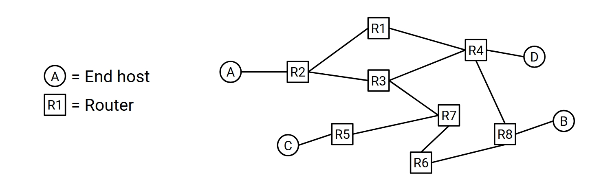

And **packets** are units of data that are sent in the network. We currently only care about where it is from and going in the header. The payload has nothing to do with routing.

See this pic below if not clear:

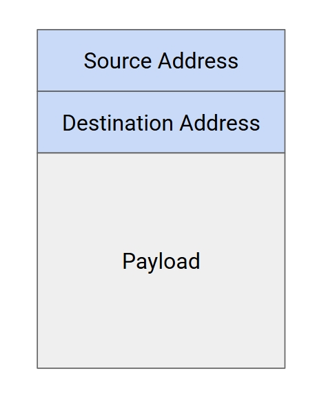

Now we can look deeply into the finding route problem, the **routing protocol**. What makes it difficult?

Well, how do you do if some routers suddenly got in or out of the network? How do you adjust your routes under this situation? Or like we talked about, if a link goes down, how do you find other routes?

Also, routers don't have a global view of the network. They only know their direct neighbors. So if stuffs happen far away, you can't expect it knows automatically. Therefore, we kind of need the routing protocol to be **distributed**.

What I mean is, like we used to talked about in previous notes, there is not a central mastermind. We must let the routers compute their own parts of anwsers and then coordinate with each other.

And don't forget, in layer 3, the links are only best-effort.

So what we must deal with are changing topology, no global view, and best-effort links.

By the way, the Internet is a network of networks. So there is actually not a single giant routing protocol. Every network gets to choose their own routing protocol bese on its own needs.

**Intra-domain** routing protocols compute routes within a single network. Sometimes called **Interior Gateway Protocols (IGPs)**.

See this pic below if not clear:

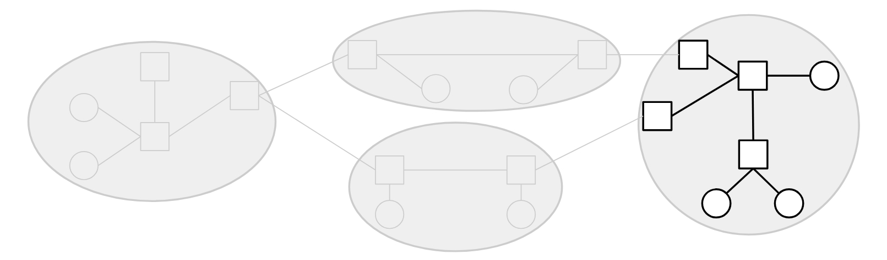

And to make the whole Internet work, everyone must agree with this **Inter-domain** routing protocols that compute routes between networks. Sometimes called **Exterior Gateway Protocols (EGPs)**. The Internet has used one called **BGP** since the 1990s.

See this pic below if not clear:

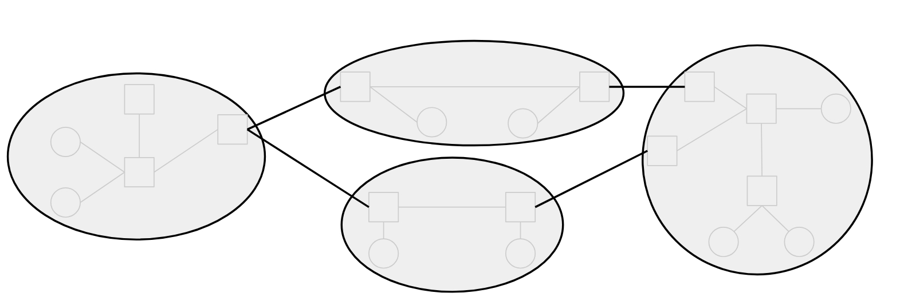

I think up till now the routing protocol problem is pretty clear.

### Routing States

So the basic challenge is, knowing the destination, how do a router decide where to send the packet next? Or we say, the **next hop**.

Still have some naive approaches, like send it randomly, or send it to all neighbors. Obviously it won't get the destination or too much bandwidth waste.

Actually, we use destination-based routing. Every router need to maintain a table that map destination to next hop. So the decision only depends on the destination.

See this pic below if not clear:

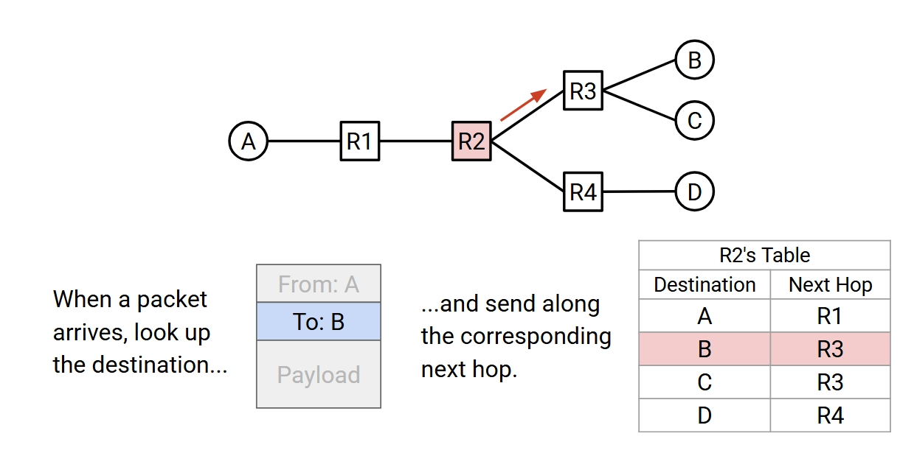

In reality, we use physical ports to represent the next hop.

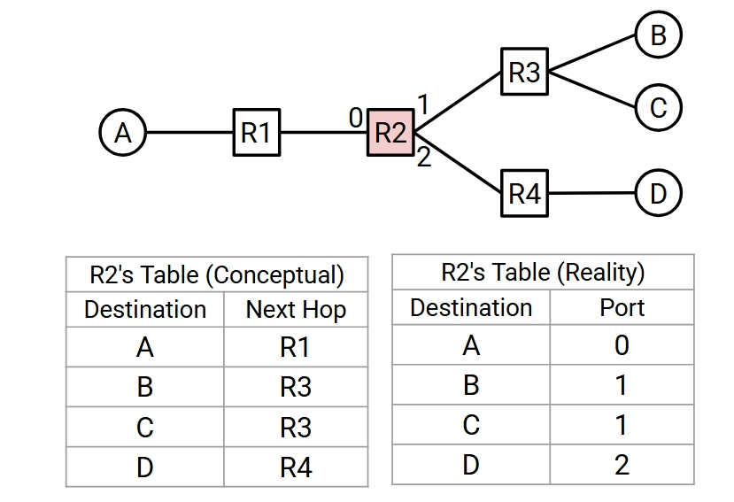

But we will keep using the next hop for simplicity.

Forwarding is a totally local action, you just take a look at the destination, then look up the table, and send it to the next hop. Routing is not a local action, it's a global action. You communicate with other routers to know how to maintain the table. You do this every time the topology changes.

The right table, or we say the **routing state validity**, is a global stuff. You can never see the table of a single router and know is it right or wrong. You see through the whole thing to know if all packets can get to their destinations.

The path a packet takes is actually decided by the global routing state, by the collection of a bunch of tables.

See this pic below if not clear:

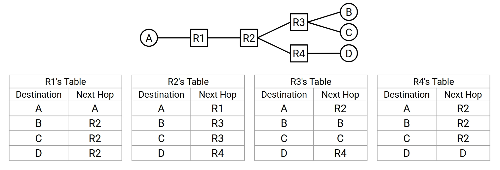

How can you see if this is valid or not? You can try every possible path and see if all packets can get to their destinations. But actually, we have this validity conditions.

A global routing state is valid `if and only if` there are no **dead ends** and no **loops**.

Dead ends mean the packet gets here, but no next hop to go. Loops mean a packet cycles around the same set of routers.

See this pic below if not clear:

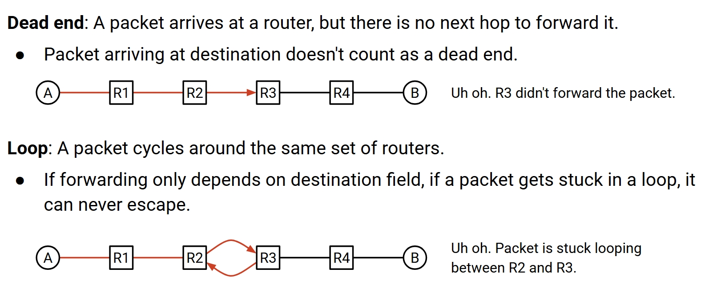

This is kind of hardcore, we are going to prove this.

The neccesary is simple. It's quite obvious that you can't get the destination if you hit a dead end. And since the destination-based routing has the same decision every time the packet arrives at a router, it's impossible to get rid of a loop. So the neccesary is proved, packets reach their destination **only if** there are no dead ends and loops.

The sufficient is even simpler. No dead ends ensures no packet will never stop unless getting to the destination. And no loops ensures no packet will hit a router twice. So since the number of routers is limited, the packet must reach the destination. The sufficient is also proved, if there are no dead ends and loops, packets will reach their destination.

We've proved both directions, the routing state validity condition is proved.

But how do we check this in real life?

If there is not dead ends and loops, when we draw outgoing arrows to all next hops, we get a **directed delivery tree** for each destination.

Every router has only one outgoing arrow for each destination. And once two paths meet, they never split. This is where the tree comes from.

See this pic below if not clear:

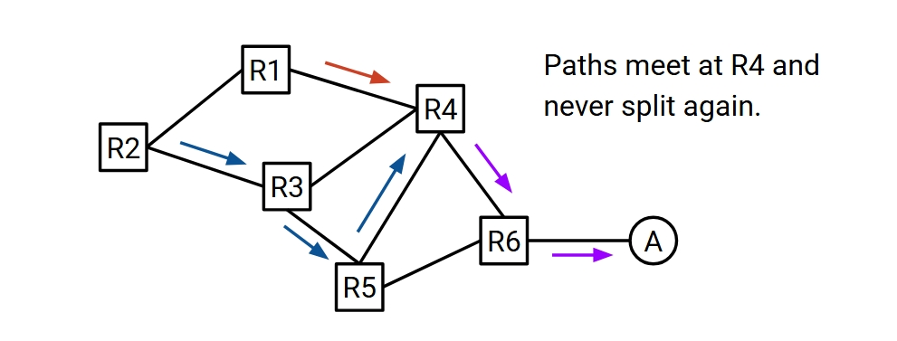

We have this SOP to check.

1. Pick a single destination.

2. For each router, draw an arrow to the next-hop.

3. Destination-based forwarding = there is only one outgoing arrow.

4. Delete all links with no arrows.

5. State is valid if and only if the remaining graph is a valid directed delivery tree.

- No dead ends. (Node with no outgoing arrow.)

- No loops. (Cycles in the graph.)

- A directed spanning(touches every node) tree(no cycles, no disconnected nodes) where all edges point toward the destination.

Repeat for every destination!

See this gif below if not clear:

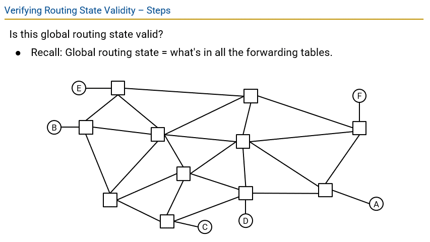

See this pic below to see a not valid example:

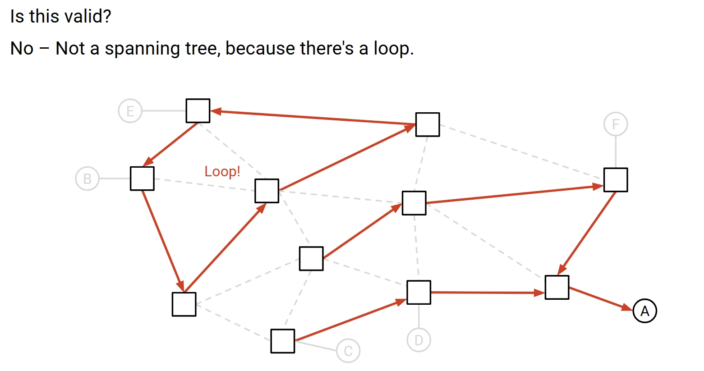

Now we already know what does a valid solution look like. But validity is not enough, we need it to be good. We need the least-cost routing.

The **least-cost routing** is assign costs to every link and find paths with lowest cost.

See this pic below if not clear:

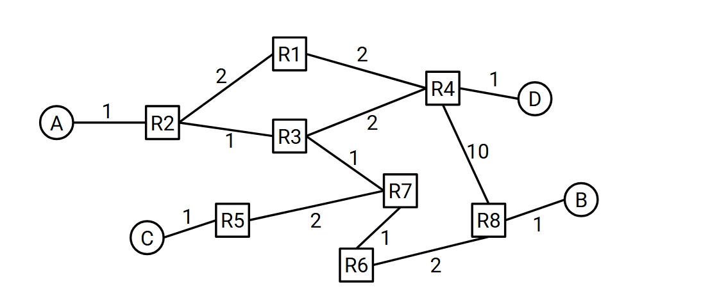

The costs are not always the price. Sometimes it can be distance, delay, or bandwidth. Depends on what you care the most.

Costs are local, every router knows the costs of its own links. It can be configured by operators or automatically by some of the routing protocols.

### Special Route Types

If the router is directly connected to the destination, it can be hard-coded on the table.

See this pic below if not clear:

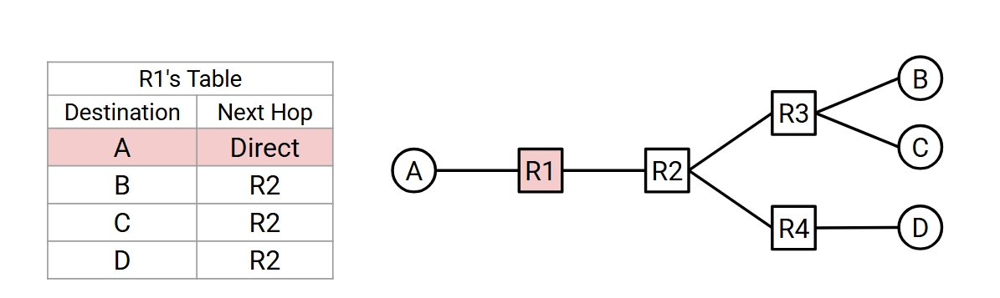

So no routing protocols are needed.

Besides that, some other entries that we always want it to be there can also be hard-coded. It is called **static route**. Router isn't necessarily directly connected to the destination.

## Distance-Vector Routing

So how do we maintain the routing table?

Simple thought: If you hear about a path to a destination, tell all your neighbors.

See this gif below if not clear:

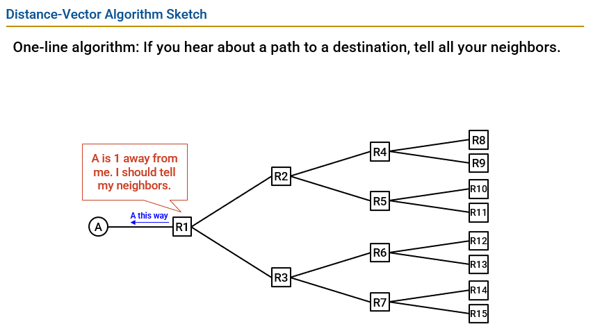

For multiple destinations, we just do this for every destination. So for simplicity, we focus on one destination now.

### Rule 1: Bellman-Ford Update

What do we do if we hear multiple paths to a destination? Well, obviously we should always pick the shortest one, or the lowest cost one, something like that.

So we always record the current best path to a destination in the forwarding table. If we here a path and there's no path to this destination in the table, we just accept it. If we already have one, we see whether the new one is better.

See this pic below if not clear:

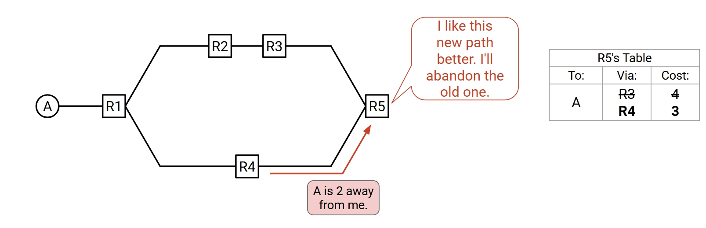

The Distance-Vector algorithm so far is like:

For each destination:
- If you hear about a path to that destination, update table if:
  - The destination isn't in the table.
  - The advertised cost is better than best-known cost.
- Then, tell all your neighbors.

This is very naive and we are going to improve it problem by problem. You can see that we currently assume that every link has cost 1, but it certainly not.

So every time you hear a path, you need to do this computation. You add up the cost of the link between you and your neighbor and the cost from you neighbor to the destination that it advertised. So that you can see the cost of the path.

See this pic below if not clear:

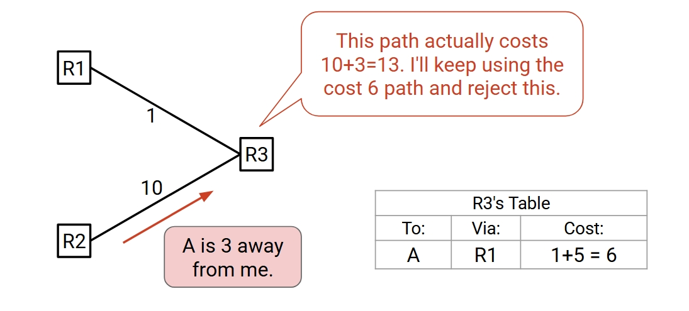

The Distance-Vector algorithm so far is like:

For each destination:
- If you hear about a path to that destination, update table if:
  - The destination isn't in the table.
  - Advertised cost **+ link cost to neighbor** < best-known cost. (#1)
- Then, tell all your neighbors.

What we use here is called **Bellman-Ford**. It's a kind of shortest path algorithm. You might be more familiar with Dijkstra's algorithm. The main differece is that Bellman-Ford doesn't require relaxing all edges in a specific order. And for Distance-Vector algorithm, it's actually do Bellman-Ford in a distributed and asynchronous way.

Here is a simple implementation of centralized Bellman-Ford for a single destination:

```python
def bellman_ford(dst, routers, links):
    # Everyone starts infinity away from the destination, 
    # except for the destination itself (0 away).
	distance = {};	nexthop  = {}
 
	for r in routers:
		distance[r] = INFINITY
		nexthop[r]  = None
	distance[dst] = 0
    # Bellman-Ford loops through nodes and relaxes repeatedly.
    # In distance-vector, each router relaxes in parallel, with no order between routers.
	for _ in range(len(routers)-1):
		for (r1, r2, linkcost) in links:
            # The relaxation operation.
			if distance[r1] + linkcost < distance[r2]:
				distance[r2] = distance[r1] + linkcost
				nexthop[r2] = r1

	return distance, nexthop
```

See this gif below if not clear:

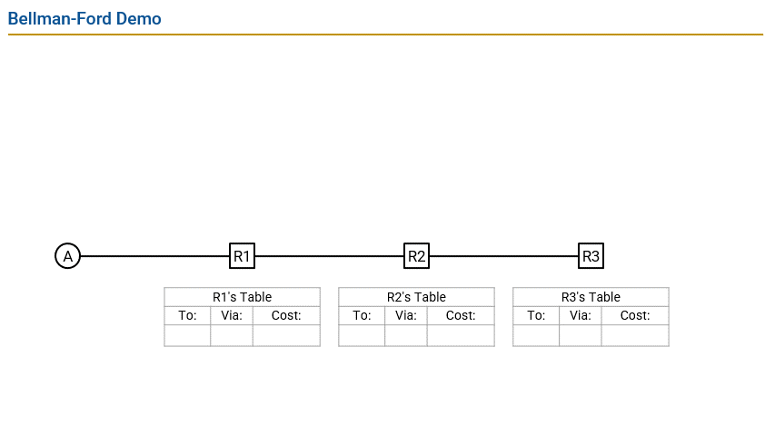

### Rule 2: Updates From Next-Hop

Let's go back to those problems we mentioned before. I remember one of them is that the topology changes. So how to make our algorithm work when the topology changes?

So far we only update if we hear a better path or we don't have one. But to fix this problem, we must accept it anyway if our current next hop sends us an announcement, even when the path is worse.

In this way, we can let the next hop notify us if the topology changed.

See this gif below if not clear:

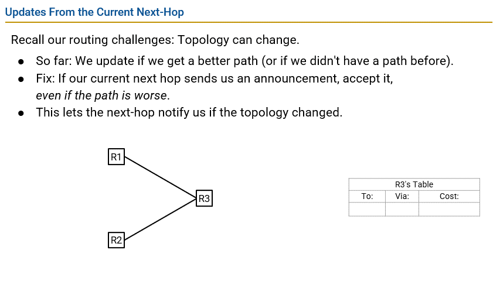

Now you run this protocol for a while, you will find that the routing table will converge. Which means it won't change anymore. Until there is a change of topology, some new announcement and update, then it will converge to a now routing state. 

The Distance-Vector algorithm so far is like:

For each destination:
- If you hear an advertisement, update table if:
  - The destination isn't in the table.
  - Advertised cost + link cost to neighbor < best-known cost. (#1)
  - **The advertisement is from current next-hop. (#2)**
- Then, advertise to all your neighbors.

### Rule 3: Resending

So I remember another problem we used to talk about, which is the best-effort links. Packets can get dropped, so that some announcements can be lost. So how to make it work reliable?

Well, just resend the announcements every X seconds. The X here is the **advertisement interval**.

The Distance-Vector algorithm so far is like:

For each destination:
- If you hear an advertisement, update table if:
  - The destination isn't in the table.
  - Advertised cost + link cost to neighbor < best-known cost. (#1)
  - The advertisement is from current next-hop. (#2)
- Then, advertise to all your neighbors when the table **updates, and periodically**. (#3)

### Rule 4: Expiring

I remember another problem we used to talk about, which is that the links and routers can fail, and at this time we need to find other paths. How do we make it?

Since we just make this periodic advertisements, we can totally use it to confirm that a route still exist. We can give each route a finite **time to live(TTL)**. And we reset this value every time we get an announcement. If one link or router goes down, we stop getting periodic announcements, then the TTL will expire. Then we can just delete this entry from the table.

See this gif below if not clear:

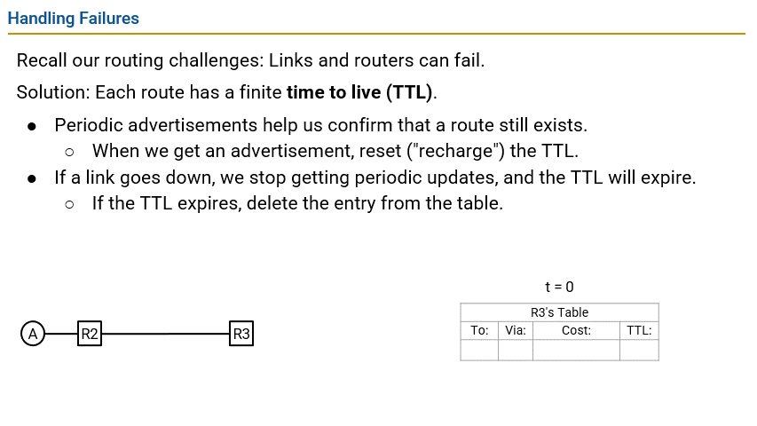

The Distance-Vector algorithm so far is like:

For each destination:
- If you hear an advertisement, update table and **reset TTL** if:
  - The destination isn't in the table.
  - Advertised cost + link cost to neighbor < best-known cost. (#1)
  - The advertisement is from current next-hop. (#2)
- Advertise to all your neighbors when the table updates, and periodically. (#3)
- **If a table entry expires, delete it. (#4)**

This is a mostly-functional protocol now. Let's add some optimizations for faster convergence.

### Rule 5: Poison Expired Routes

Where to optimize? Well, we still need to wait for expiring and it's slow. There is a time that a lot of things can happen. You still sending packets and may cause their loss. You may announce this busted path to your neighbors. 

See this gif below if not clear:

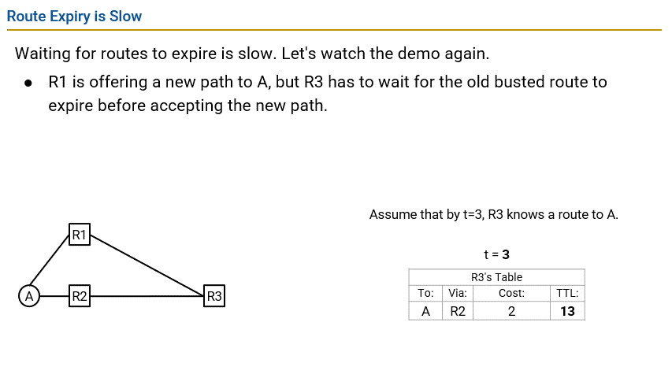

The key problem is, when something fails, nobody's reporting it! 

We must explicitly advertise that a path is busted. And our approach is called **poison**.

When a path is busted, we give it infinity cost. And the path will propagate as usual in the network. So that routers can accept them and invalidate the route. This will be much faster than waiting for the timeout.

See this gif below if not clear:

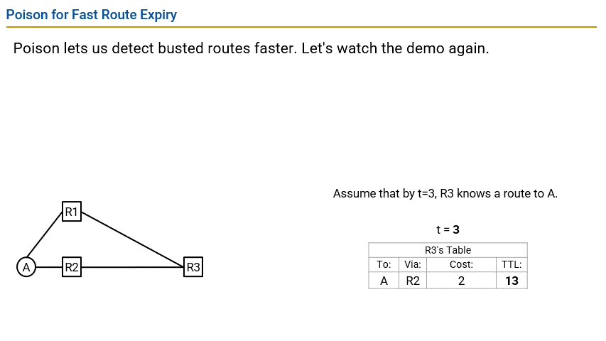

The Distance-Vector algorithm so far is like:

For each destination:
- If you hear an advertisement, update table and reset TTL if:
  - The destination isn't in the table.
  - Advertised cost + link cost to neighbor < best-known cost. (#1)
  - The advertisement is from current next-hop. (#2) **Includes poison advertisements. (#5)**
- Advertise to all your neighbors when the table updates, and periodically. (#3)
- If a table entry expires, **make the entry poison and advertise it. (#4, #5)**

### Rule 6A: Split Horizon

Actually, expiring can also cause some problems. Imagine one path is busted, and the router wait for the timeout to delete it. But it may had advertised this path to one of its neighbors, and the neighbor send it back after the timeout. So the router will think the neighbor is the next hop, and the neighbor will think the router is the next hop. We create a loop!

See this gif below if not clear:

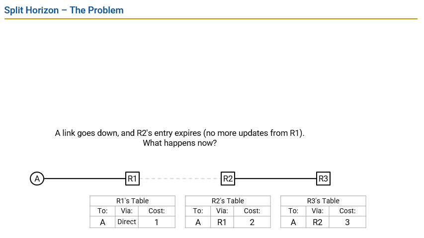

The solution is quite simple, you just never advertise a path back to who gave it to you.

The Distance-Vector algorithm so far is like:

For each destination:
- If you hear an advertisement, update table and reset TTL if:
  - The destination isn't in the table.
  - Advertised cost + link cost to neighbor < best-known cost. (#1)
  - The advertisement is from current next-hop. (#2)
	Includes poison advertisements. (#5)
- Advertise to all your neighbors when the table updates, and periodically. (#3)
	- **But don't advertise back to the next-hop. (#6A)**
- If a table entry expires, make the entry poison and advertise it. (#4, #5)

### Rule 6B: Poison Reverse

We actually have another approach to solve the loop problem. We can advertise poison back to who gave it to us, which means explicitly tell the next hop not to send packets to us.

See this pic below if not clear:

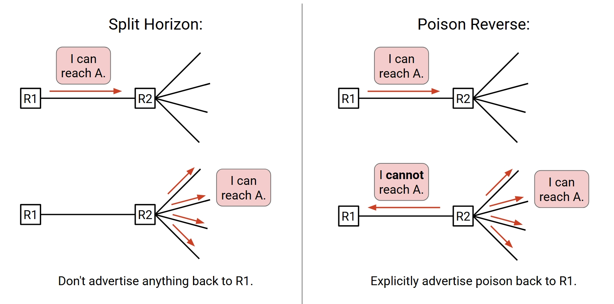

And you can see this gif for a poison reverse demo:

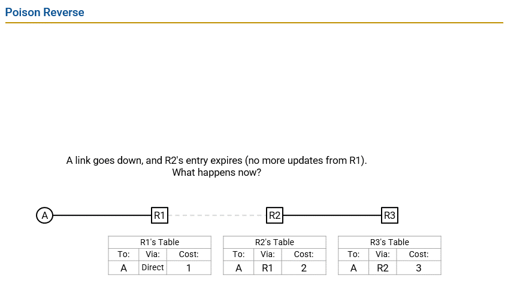

What's the difference between split horizon and poison reverse? Well, suppose we end up in a loop situation somehow, if you only do split horizon, it stay until expiring. But if you do poison reverse, it will send poison and kill the path very soon. If you look in this way, poison reverse is actually much better.

The Distance-Vector algorithm so far is like:

For each destination:
- If you hear an advertisement, update table and reset TTL if:
  - The destination isn't in the table.
  - Advertised cost + link cost to neighbor < best-known cost. (#1)
  - The advertisement is from current next-hop. (#2)
	Includes poison advertisements. (#5)
- Advertise to all your neighbors when the table updates, and periodically. (#3)
	- But don't advertise back to the next-hop. (#6A)
	- **...Or, advertise poison back to the next-hop. (#6B)**
- If a table entry expires, make the entry poison and advertise it. (#4, #5)

### Rule 7: Count to Infinity

So we had solved the loop problem, or had we? Split horizon or poison reverse can actually deal with the length 2 loops. But what if we have a length 3 or more loops?

This mainly happens when some packets are dropped while running the protocol. The process would be quite complicated. Basically, a router doesn't know that the path is busted but others know. So it keep advertising the path, and in a loop every body doing this one by one, then the cost will keep increasing. I think you must see this demo to understand what I was talking about.

See this gif below if not clear:

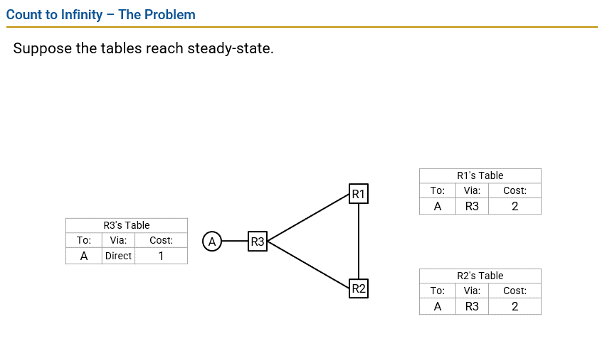

To solve this problem, we must have some limit to break the loop. We can set a limit to the cost, 15 is a common choice. So if the cost is greater than 15, we just regard it as infinity. So the busted path will expired, or be replaced by a not infinity cost path.

See this gif below if not clear:

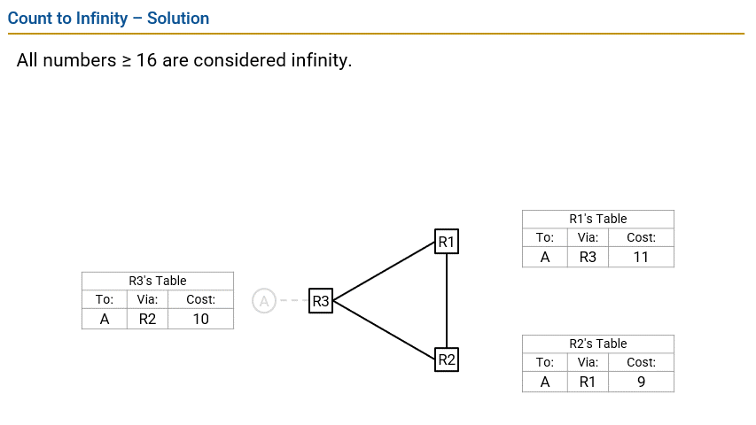

The Distance-Vector algorithm so far is like:

For each destination:
- If you hear an advertisement, update table and reset TTL if:
  - The destination isn't in the table.
  - Advertised cost + link cost to neighbor < best-known cost. (#1)
  - The advertisement is from current next-hop. (#2)
	Includes poison advertisements. (#5)
- Advertise to all your neighbors when the table updates, and periodically. (#3)
	- But don't advertise back to the next-hop. (#6A)
	- ...Or, advertise poison back to the next-hop. (#6B)
	- **Any cost ≥ 16 is advertised as $\infty$. (#7)**
- If a table entry expires, make the entry poison and advertise it. (#4, #5)

And I believe this is our complete Distance-Vector algorithm. This is now a pretty good routing protocol.