# Transport: Congestion Control

I learn this from these 2 lectures' slides:

[Lec13](https://docs.google.com/presentation/d/19Cs4ULAn6WsMroWbRzN4yg242Ji1RCmgTPzEAioTaK0)

[Lec14](https://docs.google.com/presentation/d/1FMZpbLeSNEQM93NaX1Ai5hOXHEY2hTPqPNcy5s8KbdQ)

Most pictures are from these slides.

## Congestion Control Principles

We talk about the congestion problem in last note. We need it to output the congestion window so that we can make the Internet work well. I let you just see it as magic at that time since it's too complecated. But today, we are going to complete the TCP with this part.

To know how to implement a congestion control algorithm, we need to first think about what is so hard to do this.

Say that in human words, the congestion control is to let the end host be able to decide in what rate should it send traffic. You need to see the bottlenect link along the path, and may need to share bandwidth with other flows.

So the first tricky thing is that it depends on the destination! With the destination, you know the path, and you can do everything. You may be able to send 10 Gbps in this path to that destination, but only 2 Gbps in the other.

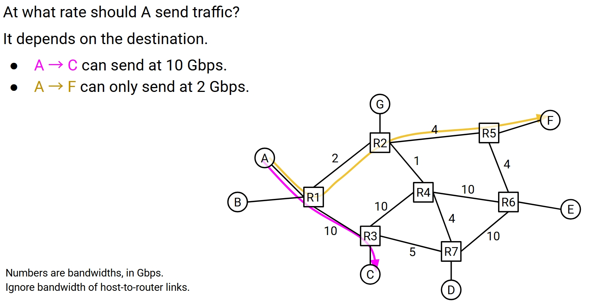

And also, even towards the same destination, there might be different paths.

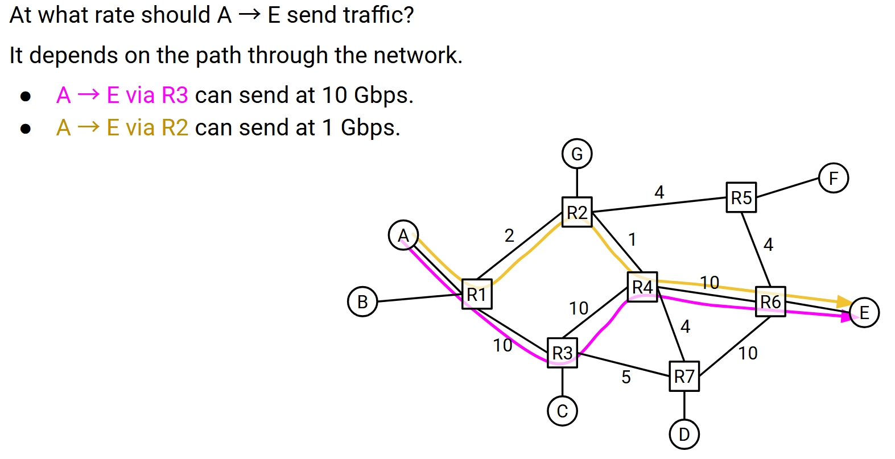

If there are some parts of the path are shared, you need to share the bandwidth with other flows.

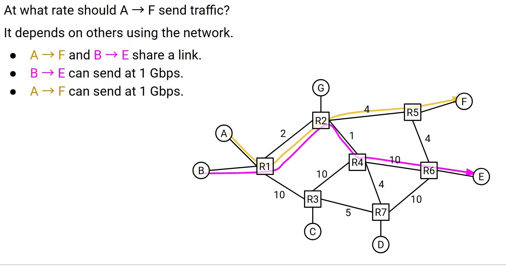

What is a path that has nothing to do with you, but compete with your competing flow somehow, start sending traffic? The competing flow might have to send less, and you therefore can send more. This also need to be considered.

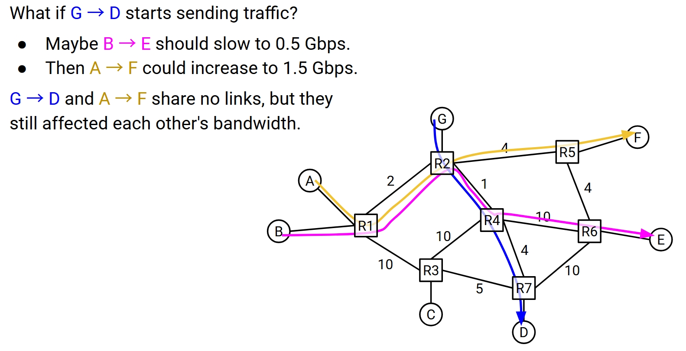

And so on and so on. Without doubt, this is a global problem. We definitely need global views to slove it.

But no, every end host has to solve it locally, since TCP in implemented inside the OS. So they must somehow coorperate with each other to make it work.

To design a good congestion control algorithm, what are we persuing? First of all, it need to avoid congestion, minimize the loss and delay, is literally in its name. And efficiency is also important, we don't want to waste the bandwidth too much. It also need to be fair, let connections share the bandwidth. We must be able to implement it, so scalable and decentralized, etc.

There many approaches.

One is letting connections reserve bandwidth at the start, and use it, release at the end. But this requires connections know all the bandwidth.

Another is do some pricing, let the price change dynamically according the the status of the network. If you pay a lot of money, everybody send your first. But this requires a super complex payment model.

The last is called **dynamic adjustment**, which is what the Internet currently uses, and is what we are going to focus on. This requires the end host to see the current congestion level, and adjust the sending rate accordingly. The good part is no need for bandwidth ahead of time.

## Dynamic Adjustment

The idea is, we the end host, pick an initial rate, and send traffic at that rate for a period. Then we do the dynamic adjustment. If we detect some congestion, we reduce the rate. If we detect no congestion, we increase the rate and see what happen. Do this through the whole connection.

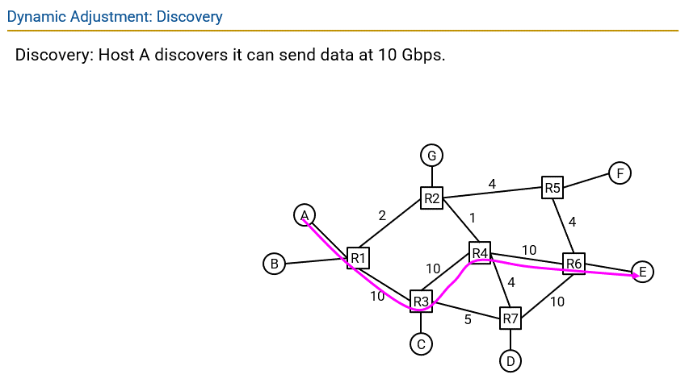

I believe you can see three basic problems in the above idea, and solving them is how we design the congestion control algorithm.

- How to detect congestion?
- How to find a initial rate?
- How to adjust the rate?

To detect congestion, TCP uses the **loss-based detection**. If we lose a packet, we just declare congestion. This is clear signal, and you can just use the ack without doing extra work. But it also got some problems, like the packet loss is not always caused by congestion.

An altinative is using delay-based detection. But that is quite tricky, so TCP didn't use it.

For the initial rate, TCP uses the **slow start**. We start with a small rate for safety, but increase it very fast for efficiency. To be specific, we increase it exponentially, double the rate each time until we detect some congestion. The safe rate is the last rate before congestion occurred, so just multiple with 0.5.

The most tricky part is how to adjust the rate, how do we react to the congestion. In other words, how much do we increase or decrease the rate by?

The keypoint is that we must keep it efficient, and also fair. Every flow should get equal share of the bandwidth.

Basically, if we want to change quickly, we do the multiplication. If we want to change slowly, we do the addition. So we have four choices in total.

- **AIAD**: Additive Increase, Additive Decrease.
- **AIMD**: Additive Increase, Multiplicative Decrease.
- **MIAD**: Multiplicative Increase, Additive Decrease.
- **MIMD**: Multiplicative Increase, Multiplicative Decrease.

To decide which to use, just use your intuition. Basically, sending too much is much worse than sending too little. Because sending too much cause congestion, but sending too little is just slow.

So intuitively, we would like to increase more carefully, and decrease more aggressively. So we use **AIMD**.

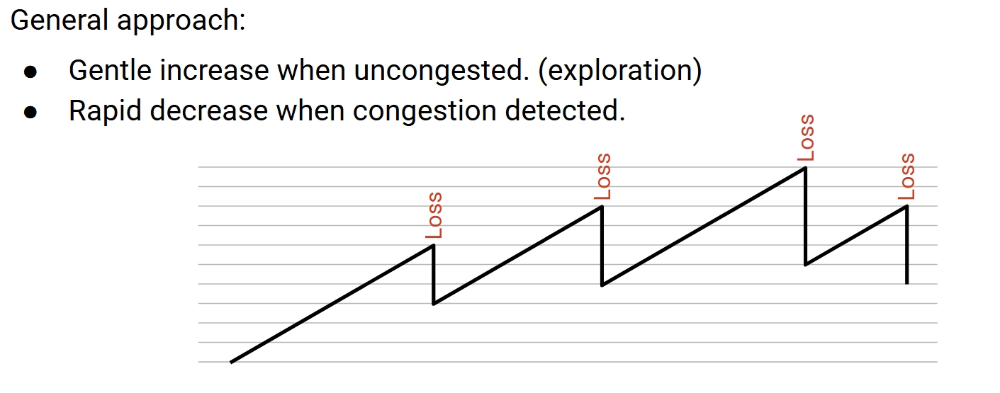

And bisides the efficiency, we also need to consider the fairness. The AIMD is the only one that can achieve fairness.

When there is no congestion, the rate will increase linearly, by the same amount for any flow. So though the fairness won't change, it doesn't get worse. And if there is congestion, the rate will decrease by the same factor for any flow, the flows with more bandwidth decrease more, so this improves fairness. And finally it would converge to the fair share.

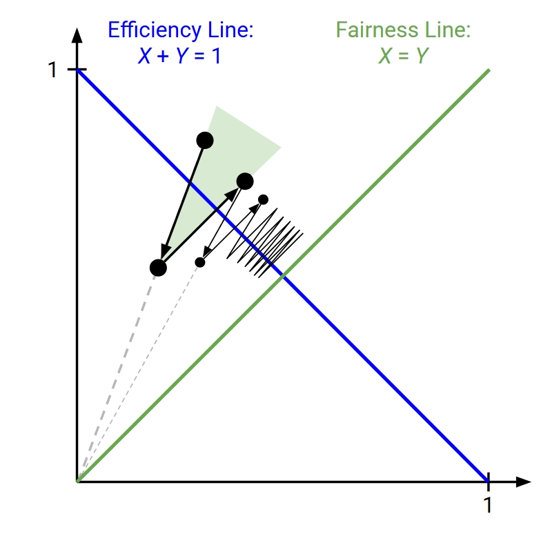

You can see clearly in the above diagram. When not congested, the point moves on a line that is parallel to the fairness line. And when congested, the point moves on a line to the original point, and getting closer to the fairness line. For a few times, it converges to the fair and efficient point.

You can do the same analysis to the other three algorithms. The result is that AIAD and MIMD retain the unfairness, and MIAD finally gets to the maximum of unfairness, one guy will finally get all the bandwidth.

So we have the whole host-based dynamic adjustment algorithm. First we pick a very small initial rate, then we do the slow start, increase it exponentially until the first congestion. Then we do the dynamic adjustment. If no congestion, we increase additively. If congestion, we decrease multiplicatively. And repeat and repeat.

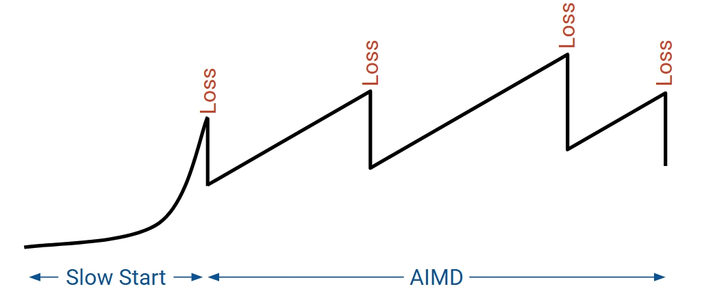

How is this happen in the real world? Remember we talked about that TCP uses window size to control the rate? It is the minimum of the congestion window(CWND) and the receiver window(RWND). Today we are gonna assume that RWND is larger than CWND, so the window size is basically just CWND, which also quite often to be true in reality.

And also for convenience, we measure the CWND in packets, not bytes.

We update the Rate by updating the CWND, since Rate = CWND / RTT. When we talked the algorithm, we said sending for a while, idally the while is just the RTT. But it's too hard to measure.

So in reality, we only update the CWND every time something interesting happens in TCP. This is called **event-driven update**.

Let's talk about the events. What could happen?

First is receiving an ack. This means there is no congestion, so we can increase the CWND. If we are still doing slow start, we increase it exponentially. If we are already doing the dynamic adjustment, we increase it additively.

Second is that we detect a packet loss, which is 3 duplicate acks. We should declare congestion according to the algorithm. So we decrease the CWND multiplicatively.

Third is that we hava a timer expires. This means that we have not received an ack for a while, might be quite serious. So we should abandon current rate and start over from slow start.

Now we have the whole picture. Let's talk about some detail problems.

When we do the slow start, we need to increase the CWND by 1 each time. So that every ack we receive, we can send two packets, and the rate is doubled.

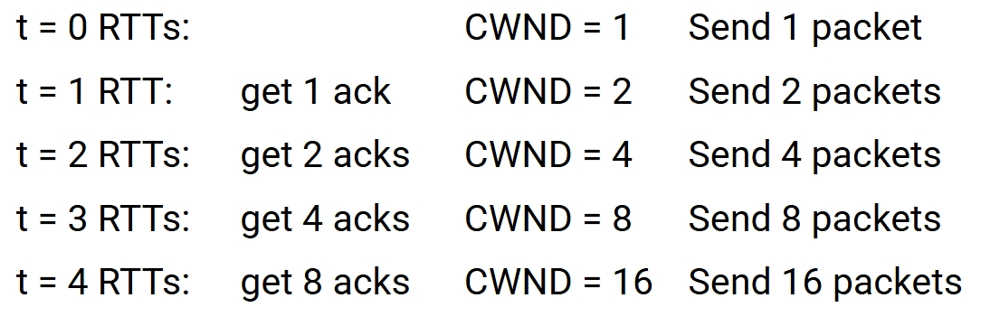

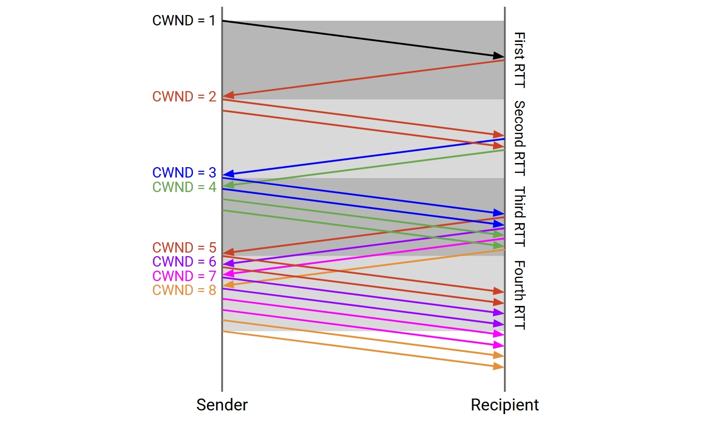

A period later, we detect a packet loss, and the slow start is over, we start the dynamic adjustment.

Now we should set the CWND = CWND / 2. And set a variable called `ssthresh` to the current CWND. So that we remember the last safe rate.

In the dynamic adjustment, we increase the CWND by 1 each RTT ideally. So in reality, we should set CWND = CWND + 1 / CWND each time we receive an ack. So that we can increase the CWND by 1 each RTT.

If we detect a packet loss, we should set the CWND = CWND / 2. And set the `ssthresh` to the current CWND.

When timeout occurs, we should abandon the current rate, and start over from slow start. So we set the `ssthresh` = CWND / 2. And set the CWND = 1.

In the process, the **ssthresh** is used to remember the last safe rate. For the second slow start, if CWND exceeds `ssthresh`, we should switch to the dynamic adjustment, and also slow starts afterwards.

See this pic for the whole process.

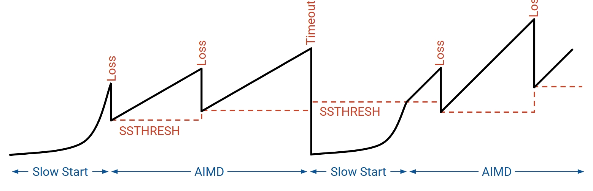

## Fast Recovery

Last but not least, we can still do one more improvement.

The problem of AIMD is that if it's only a single loss, we will decrease the CWND by half, and take a quite long time to recover.

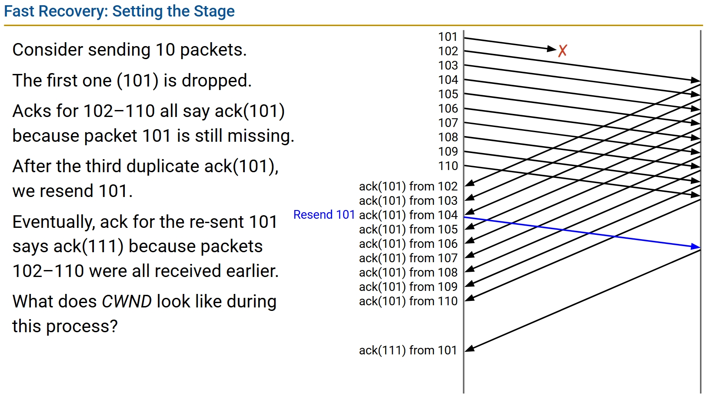

In the above picture, we send packets from 101 to 110, and the 101 is dropped. The acks for 102-110 will all say ack(101). After three duplicate acks, we know there might be a loss, so we resend the 101. Then the 101 arrives and we would get ack(111) finally.

This works, but it's just a little bit waste of bandwidth. You see under the current congestion control, we would reduce the CWND by half, it used to be 10, now it's 5. So bisides resending the 101, we can't send packets at all. Because before we get ack(111), there are still 10 packets in flight, larger than our CWND!

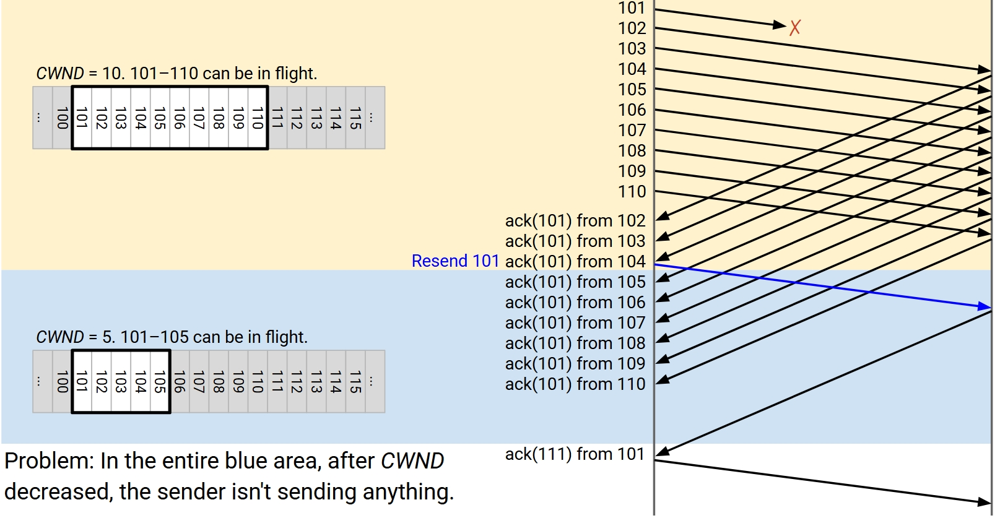

And after we get ack(111), we would be able to send 111-115 all at once. But after that, we must wait for the ack(112) to be able to send 116. This is another RTT of waste!

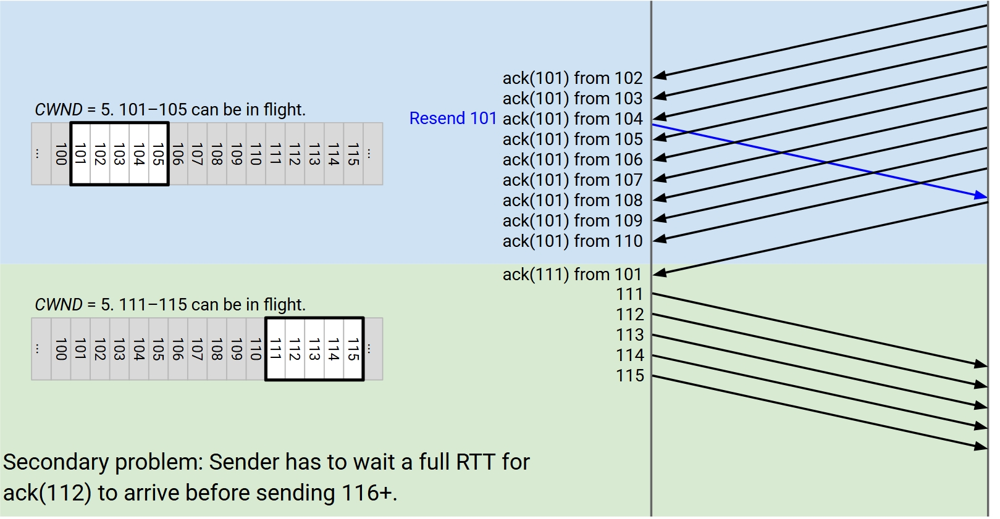

But do we really need to wait until the ack(111) to know that the rest of nine packets are already arrived, no longer in flight?

The key idea is that we can just count the number of duplicate acks!

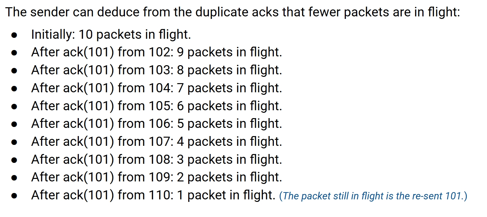

When a duplicate ack arrives, we know that there are one less packet in flight, and we can extend the window to let the sender send one more.

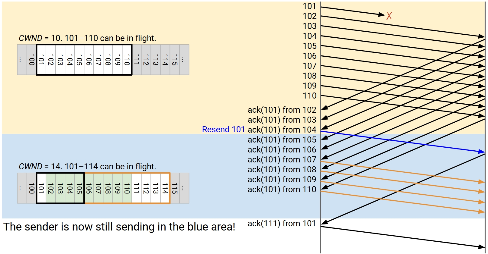

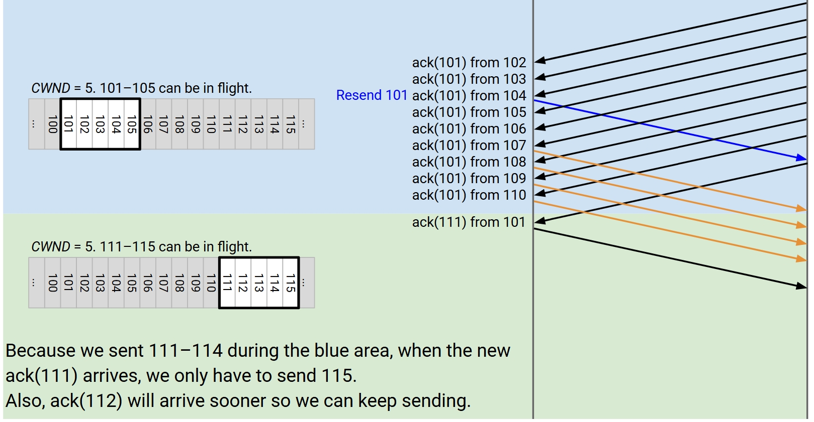

You can see clearly that we know use the time much more efficiently.

The implementation of fast recovery is like this:

- When we receive 3 duplicate acks:
  - **SSTHRESH ← CWND/2**
  - **CWND = CWND/2 + 3** (artificially extend for the 3 duplicate acks)
- While in fast recovery mode, when we receive a duplicate ack:
  - **CWND = CWND + 1** (artificially extend for each duplicate ack)
- Exit fast recovery when we receive a new, non-duplicate ack:
  - **CWND = SSTHRESH** (back to 0.5 × rate when the loss happened)

## TCP Summary

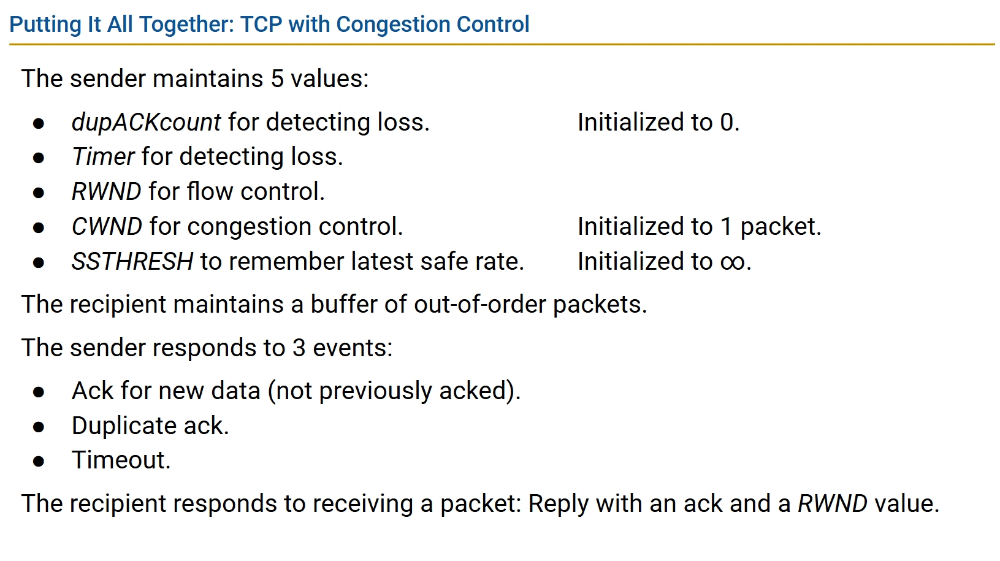

When we receive an ack for new data (not previously acked):

- If in slow-start mode:
  - CWND ← CWND + 1 packet (so CWND doubles per RTT)
- If in fast recovery mode:
  - CWND ← SSTHRESH (so we leave fast recovery)
- If in congestion avoidance mode:
  - CWND ← CWND + 1/CWND (so CWND increases by 1 per RTT)
- Reset timer.
- Reset duplicate ack count.
- If window allows, send new data.

When we receive a duplicate ack:

- Increment duplicate ack count.
- If dupACKcount = 3: Do fast retransmit.
  - SSTHRESH ← CWND / 2
  - CWND ← (CWND / 2) + 3 (the +3 is for fast recovery)
  - Resend leftmost packet in window.
- If dupACKcount > 3: Do fast recovery.
  - CWND ← CWND + 1

When the timer expires:

- SSTHRESH ← CWND / 2
- CWND ← 1 packet
- Switch to slow-start mode.
- Resend leftmost packet in window.

The whole big picture:

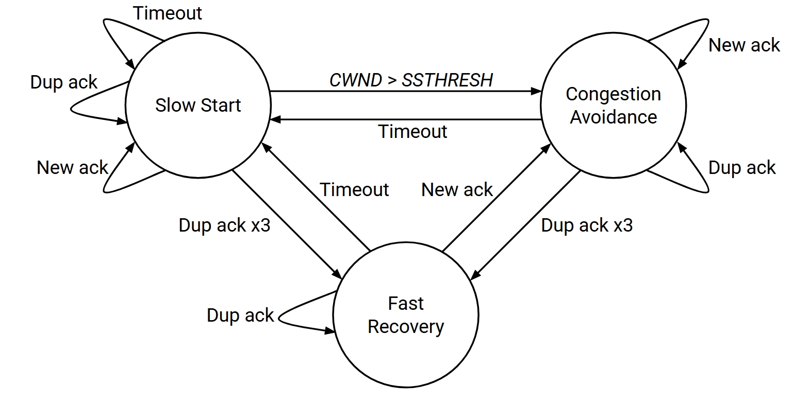
