# Transport: TCP

I learn this from these 2 lectures' slides:

[Lec11](https://docs.google.com/presentation/d/1yCNPp1QNTTj92HE4B_CbK7re8bRSQzYPWyW4IT9IlJI)

[Lec12](https://docs.google.com/presentation/d/1dYsV9_KsQfhyf3Hp8F9HlFnUGnJoKgdLwh7Xy9Cl9Us)

Most pictures are from these slides.

## Transport Layer Goal

We have done the Layer 3 (IP), and we are now able to send packets individually anywhere in the Internet. But the IP only offers best-effort delivery. And applications don't want to think about packets and best-effort stuff.

That's why we need Layer 4 (transport layer). We must build some extra features on top of Layer 3, to provide a more convenient abstraction.

The first feature we need to do is called **De-Multiplexing**.

You may remember in the IP header we have this protocol field, which is to support the de-multiplexing between Layer 4 protocols, or we can say to decide the packet should be pass to the TCP code or UDP code.

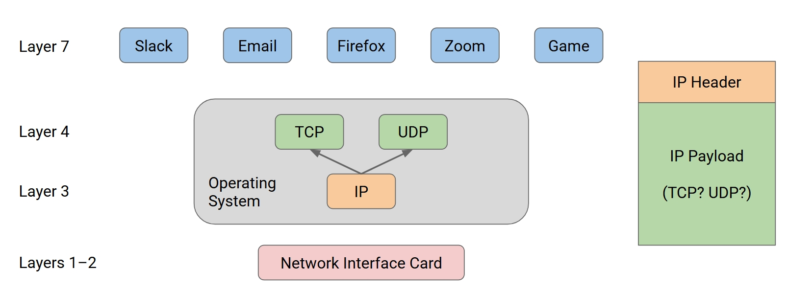

And in the TCP header, we will have this **Port** field, which is to support the de-multiplexing between different applications.

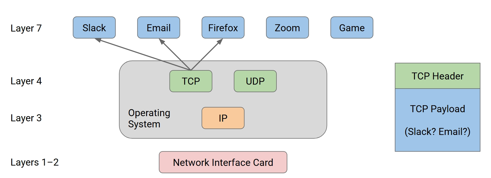

We can say that Layer 3 and Layer 4 together support the de-multiplexing through the whole Internet.

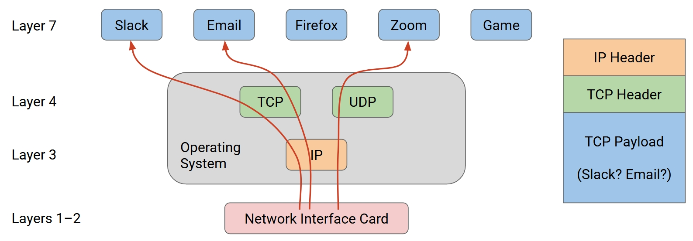

So in the Transport layer, we are going to make the de-multiplexing with ports.

Ports identify the attachment point between applications and Operation Systems. It's just like the room number in a hotel, if you regard IP as the address of the hotel.

Another feature we need to do is called **Reliability**. This is the keypoint of Layer 4. Actually it is only implemented in TCP, not in UDP. We are going to spend most of our time on implementing the reliability.

Last feature we need to do is better abstraction. One of them is called **Bytestream**, which means the sender can send an arbitrary length stream of bytes, and the receiver can receive it in the same order. This allow the applications to consider in terms of connections, not individual packets. And this is what TCP provides.

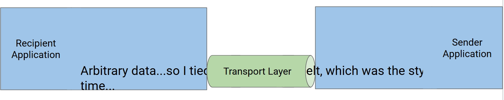

The UDP doesn't implement reliability, it provides the **Datagram** abstraction. Which is basically still the same thing as the Layer 3 abstraction, still best-effort.

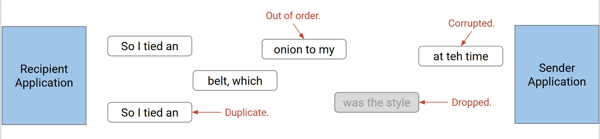

So we have two protocols to choose in the Layer 4, TCP and UDP. They both provide the de-multiplexing and some sort of abstraction, but only TCP provides the reliability.

Then why do we need UDP? Well, sometimes we need it to be faster and we can torlerant some loss, like live streaming.

We implement the Transport layer in the end hosts, not in any intermediate routers. The end-to-end principle, remember?

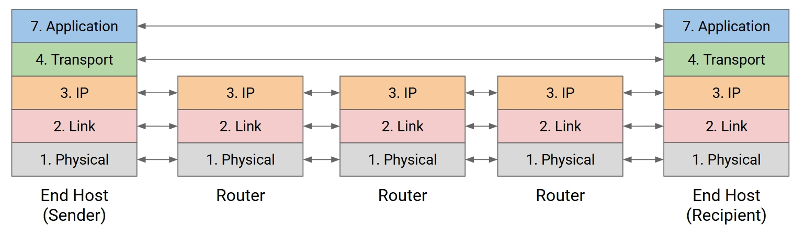

## Implementing Reliability

So we are going to build a reliable service on top of the unreliable IP service. Our main goals are the following:

- **Correctness**: The destination receives every packet, uncorrupted, in order.
- **Timeliness**: Minimize time until data is transferred.
- **Efficiency**: Minimize use of bandwidth.
  - Avoid sending packets unnecessarily.
  - Example of inefficient protocol: Send 1000 copies of every packet.

How do we define the reliability? The IP provides only the best-effort delivery. We can do a little better which is **at-least-once delivery**, which means every packet will arrive but some might arrive more than once. The best is the **exactly-once delivery**, which means every packet will arrive exactly once.

We plan to make it in this way. In the transport layer, we make at-least-once delivery on top of the IP. Then we get rid of the duplicates before passing to the applications. So we will provide the exactly-once delivery to applications.

So let's start with trying to provide at-least-once delivery for a single packet.

We have to deal with 5 problems from the best-effort service model:

- Packets can be dropped.
- Packets can be corrupted.
- Packets can be delayed.
- Packets can be duplicated.
- Packets can be reordered.

We need the sender to know if the packet arrives fine. To do that, the receiver needs to reply with an **acknowledgement (ACK)**.

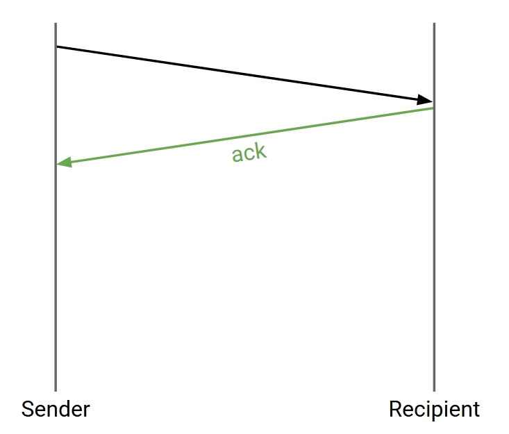

So to deal with the dropped packets problem, we just let the sender to set a timer. If the timer expires, still no ack, we just resend the packet.

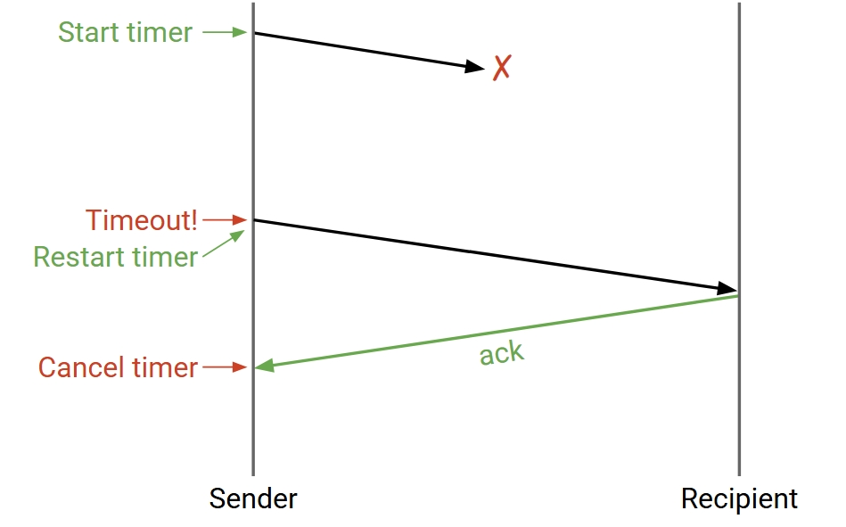

This also work even when the ack is dropped. The timer expires and we resend. Until the packet arrives, and the ack also arrives.

To deal with the corrupted packets problem, we just let the sender to add a checksum to the packet. The receiver can check the checksum to see if it's corrupted. Two ways to handle it, one is to reply with a negative acknowledgement (NACK), and the other is to just ignore it and wait for the timer to expire. Both work, TCP uses the latter.

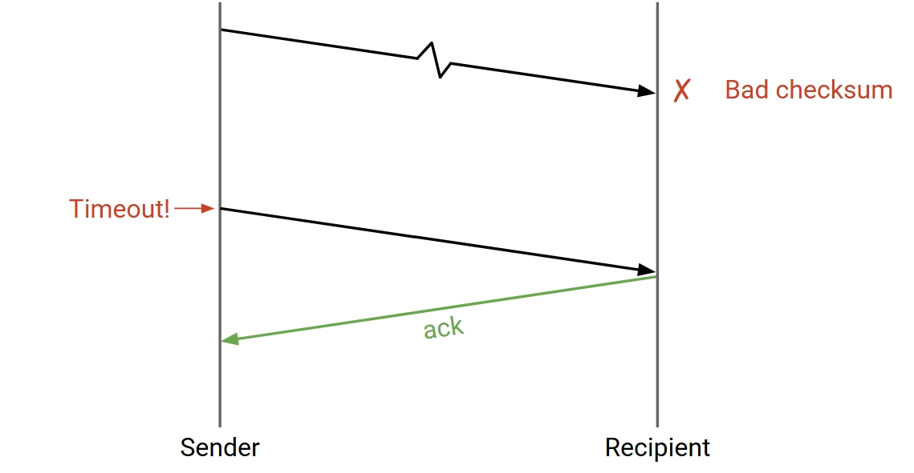

Then we need to deal with the delayed packets problem. If the delay is minor, no need for handling. But if it's longer, the sender just timeout and resend. It may cause two acks, but not a problem.

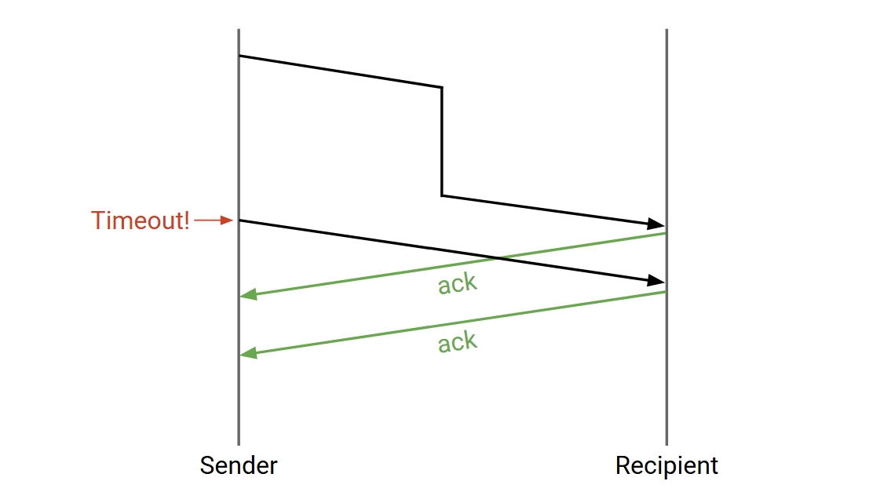

The next issue is the duplicated packets. Still no need for handling. Two packets received and two acks. Not problem.

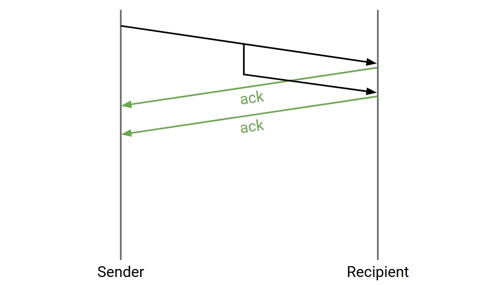

I don't think there is any reordered packets problem for our single packet case.

So you can see with simple ack and timer, we solve all problems.

And we are going to move on to the multiple packets case.

We need a new thing called **Sequence Number**. Which is a unique, increasing number for each packet. And we label each ack with the same number as the packet to be acknowledged.

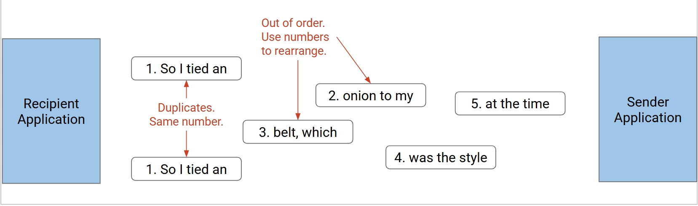

We just simply solved reordering. We can order it right with these sequence numbers anyway.

Naive approach for the multiple packets case is just to use the single packet protocol repeatly, start another packet after the previous one is acknowledged. But this is obviously not efficient.

The better idea is to allow multiple packets in flight simultaneously. We send more packets while waiting for the acks.

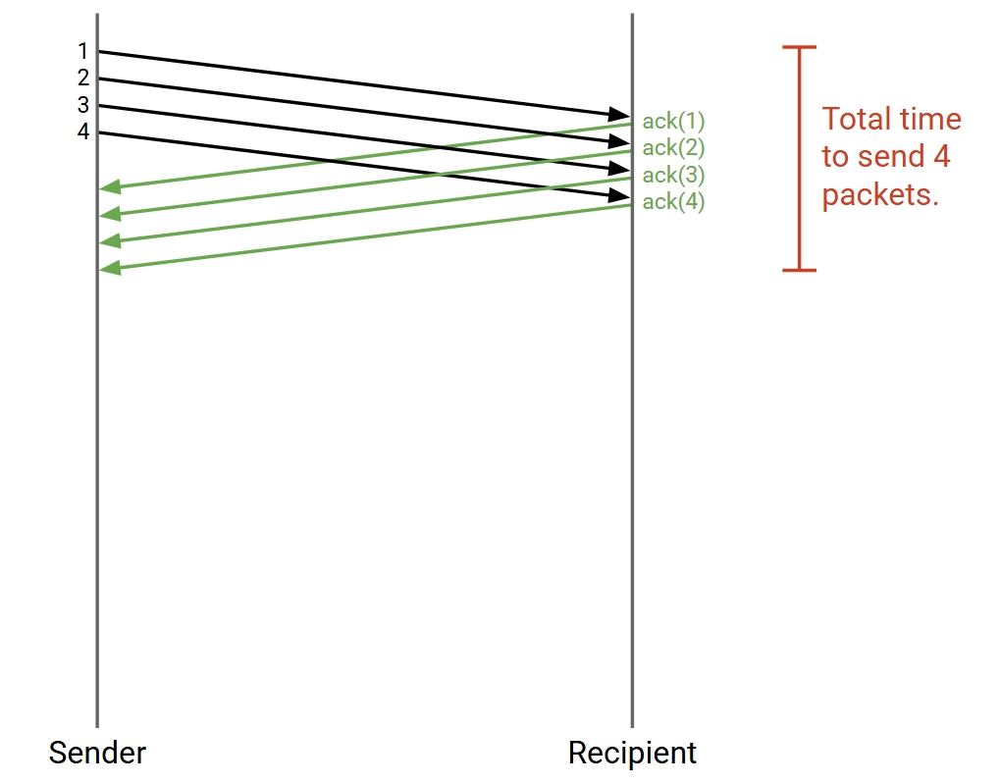

Can we juse send all the packets at once? No, no matter at senders, routers or destinations, the bandwidth is limited. We need a 'window', to limit the number of packets in flight. This is called the **Window-based Algorithm**. Maximum W packets can be in-flight (sent, but not acked) at any time, where W is the window size.

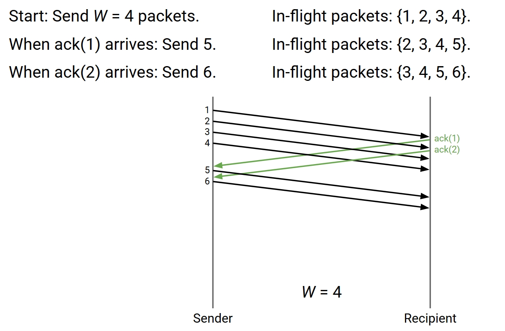

But how big should the W be? If it's too small, we are not using the bandwidth efficiently. If it's too large, we might overload the recipient and links.

We need to consider the **round-trip time (RTT)**, which is the time it takes for a packet to travel from sender to receiver and ack back.

To take advantage of the network's capacity, we should make the sender constantly busy. If the RTT is 5 seconds, and the bandwidth allow 10 packets per second, there won't be any ack in the first 5 seconds. We want the sender to be constantly busy in the first 5 seconds, so we set the W to 50.

More generally, W = RTT \* Bandwidth. If you want to fill the pipe.

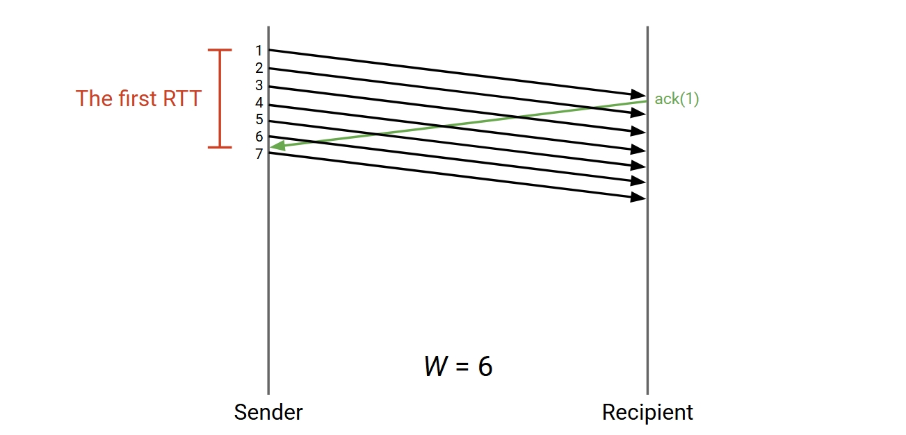

The bandwidth here is actually the bottleneck link bandwidth along the path.

This is actually just a upper bound. To make our other two goals, we may need to reduce a little bit.

How do we set the W to avoid overloading the recipient and links?

Consider the recipient first, since we must provide packets in order to the applications, the recipient must have a buffer to store the packets. It must hold all packets in the buffer until all missing packets are received.

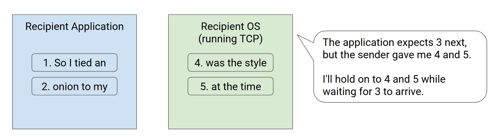

So we must do the **Flow Control** to ensure that the recipient has enough buffer for these out-of-order packets. The recipient need to send messages to the sender to tell how much space it has left. This is called the **Advertised Window**, which is carried by the ack packets. So that the sender can adjust the window size accordingly, to make the window less than the recipient's advertised window.

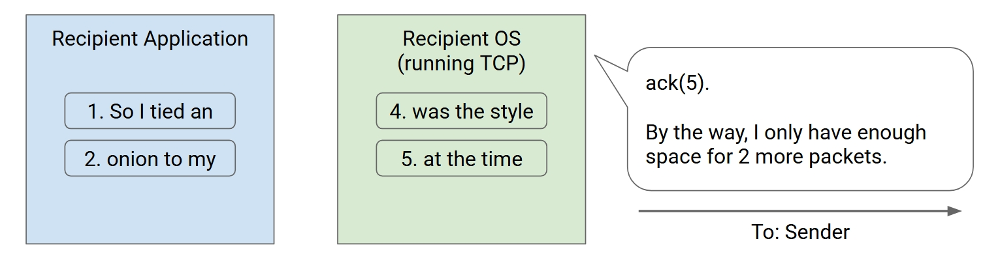

Then we should consider how to avoid overloading the network. Previously we set the W to RTT \* Bandwidth, use all the bandwidth of the bottleneck link along the path. But what if the link is shared by more flows?

That's why we need the **Congestion Control**. In fact, the sender's TCP code implements a pretty complex congestion control algorithm, which will dynamically adjust the window size to avoid overloading the network. But it is too complex to explain here, we will have a single note for it later. Just think it magically works, output a **Congestion Window (CWND)**.

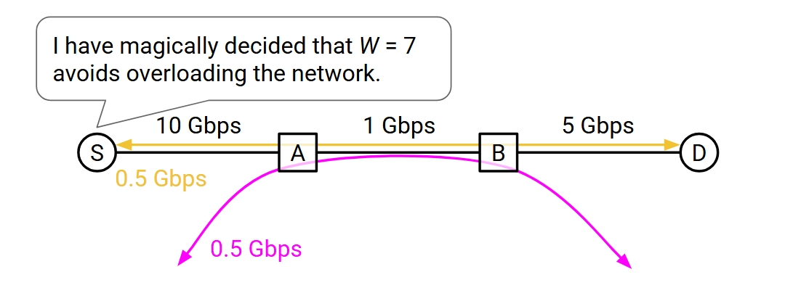

So we have the **Advertised Window** and the **Congestion Window**. The sender will use the smaller one as the actual window size. About the pipe-filling window, the sender can hardly find the bottleneck link and compute it, but it doesn't matter since it's the largest anyway.

Now we know how to handle the window, let's go back to see the ack thing again. The problem of the current individual packet acks is that if the ack is dropped, we need to wait for the resend. This would still work but unnecessary. We can avoid it by a smarter approach of ack.

The idea is the full information acks, which means we send an ack listing every packet received.

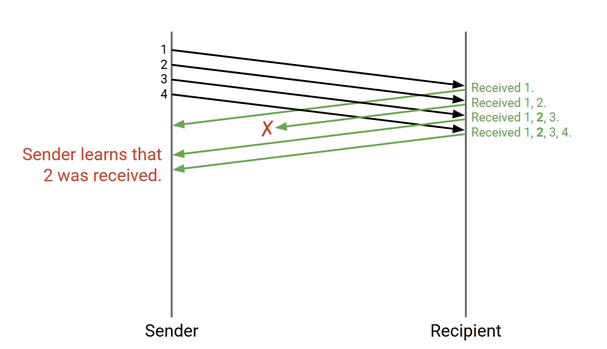

'I received all packets up to 12, plus 14, 15, 16.' This is clear and complete, but still not what the TCP actually use. Because the list can get long. We can do even better.

What the TCP actually use is the **Cumulative Acks**. Which is not 'I received all packets up to 12, plus 14, 15, 16', but only 'I received all packets up to 12'.

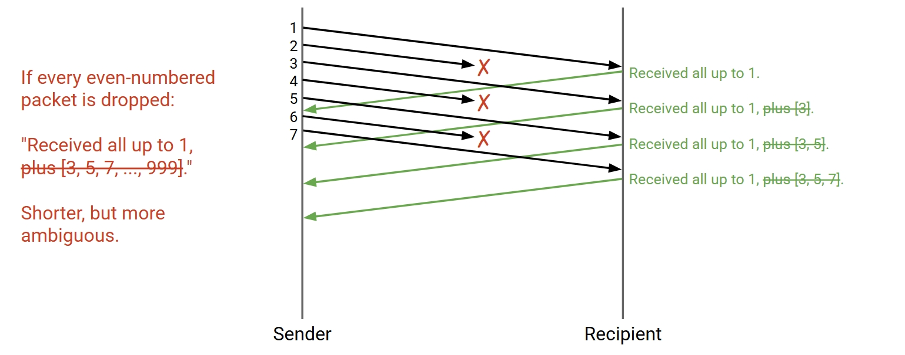

This is good because if the ack packet of packet 2 is dropped, we know packets up to 16 are received, we know it's received. But it also cause some problem, which is that if you didn't receive packet 3, no matter how many you received before, you can only send ack(3). TCP uses this, certainly they think this is already the best currently.

Then we see the loss detection again. Our current approach is to wait for timeout, which is quite slow. With cumulative acks, we can do better.

The idea is that if we receive ack(3) packet for k times, we know the packet 3 didn't arrive, but k other arrive to cause the ack. So packet 3 is probably lost.

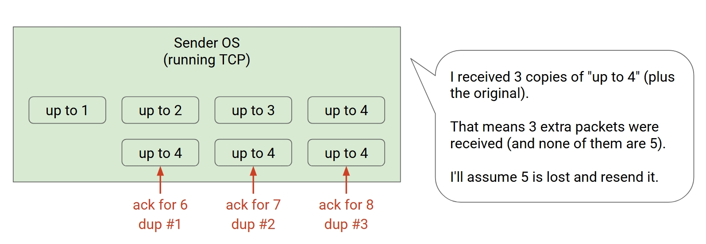

## Implementing TCP

We keep talking about packet, packet, packet. But in fact, TCP is implemented with **bytes** as primary unit of data. The bytestream abstraction, remember?

Each byte has a number. Packets are defined by the number of the first byte inside. ACKs reference byte numbers. Window size expressed in terms of number of bytes.

But we still need to split this bytestream into packets. So we need this concept called **Segment**. A segment is sent when the segment is full, or time out waiting for more data.

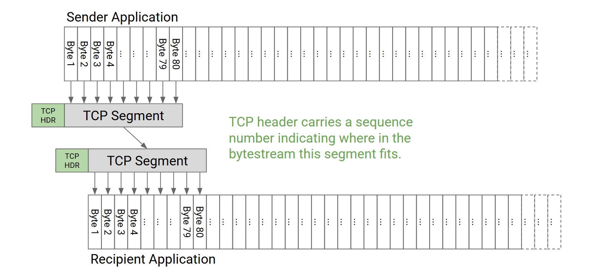

The TCP header carries a sequence number indicating where in the bytestream the segment fits.

A TCP/IP packet is a IP packet with TCP header and TCP data inside.

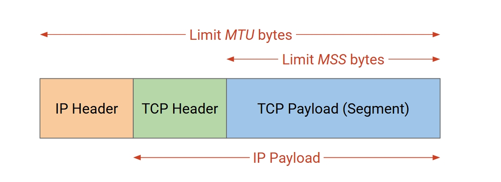

The sequence numbers starts at a randomly-generated number, called **Initial Sequence Number (ISN)**. Then every byte add 1. The sequence number of a segment is the number of the first byte in the segment.

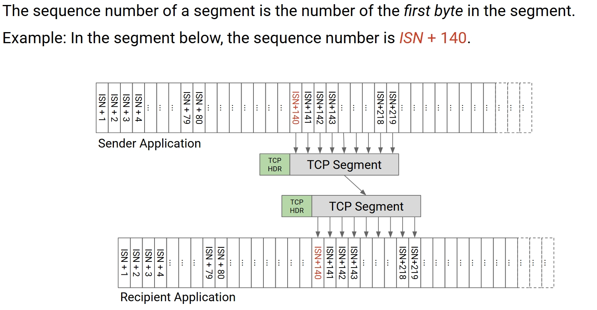

The ack number indicates the next expected byte.

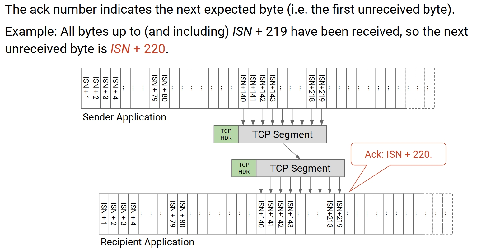

Then we are going to talk about the **TCP state**. TCP requires us to maintain a state at each end hosts. Sender has to remember which packet has been sent but not acked, how much longer is the timer before I resend, etc. Receiver has to buffer the out-of-order packets.

TCP is full-duplex, so both end hosts of a connection can send and receive data at the same time in the same connection. This requires that packets should carry both data and ack information.

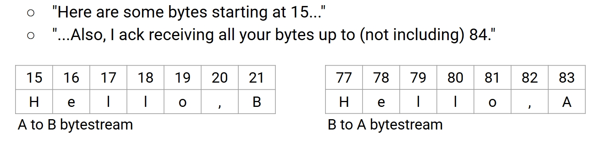

To set up a TCP connection, we need to do the **3-way handshake**. The goal is to tell the other one our ISN, so that we can start sending data to each other.

- Three-way handshake:
  - **SYN**. Client says: "Here's my ISN."
  - **SYN-ACK**. Server says: "I received your ISN. Also, here's my ISN."
  - **ACK**. Client says: "I received your ISN."

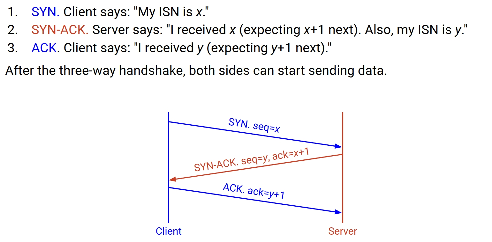

After this, both end hosts can start sending data and acks to each other, until they think it's time to teardown the connection.

The process is that one end host send a FIN packet to say that it will stop sending but still receiving. The FIN need to be acked. This will close the connection half-way. If both ends send FIN, they will wait for the ack, and then close the connection.

We call this **four-way handshake**.

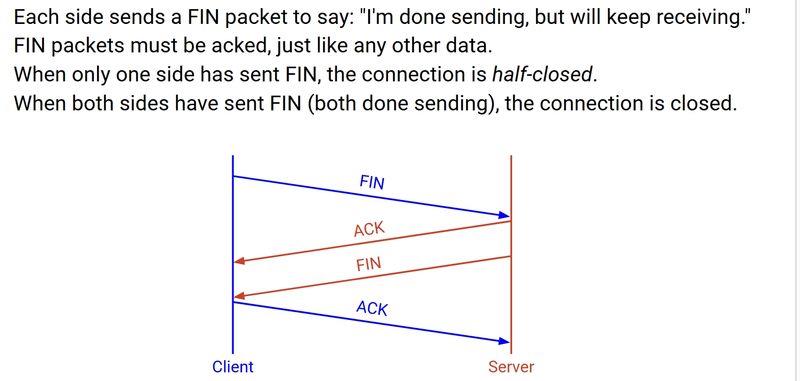

Let's see the whole TCP setup and teardown process in this diagram:

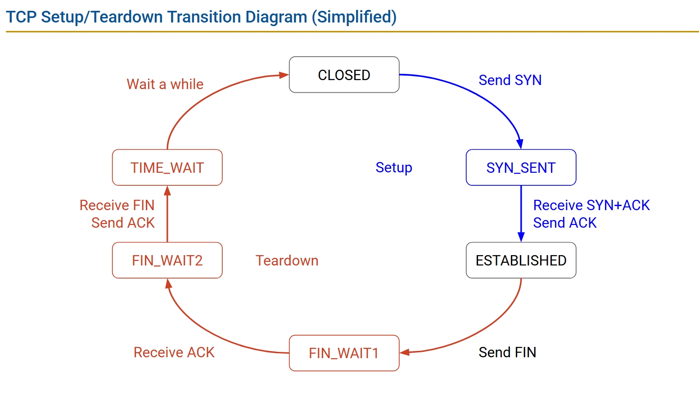

With full-duplex, when you receive a packet but nothing to send, you can send a pure ack packet, or wait for data to send together. The latter is called **piggybacking**. This is tough since the OS won't know when the application has new data to send. But the SYN-ACK always piggyback. This is just between OS and OS, nothing to do with the application.

After this, we are going to talk about the **TCP sliding window**. Now we are not talking about the number of packets, but the maximum number of contiguous bytes in flight. The window starts at the first unacked byte.

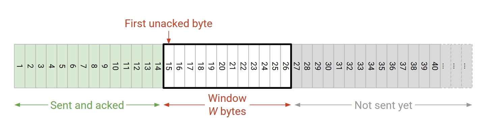

The window slides right if and only if its leftmost bytes are acked. When 15–18 arrive, we can send 27–30.

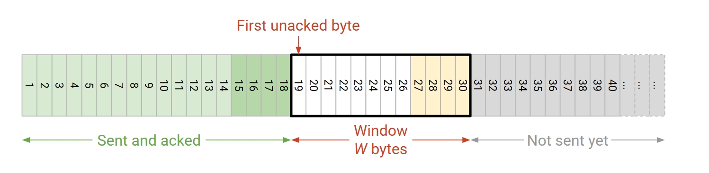

Acking non leftmost bytes in the window won't slide right. Only the leftmost bytes can slide right.

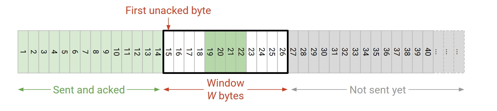

To summarize, TCP use cumulative acks, saying have acked everything up to 15, then the first unacked byte is 15, and the window size is the minimum of advertised window and congestion window, so we can get the [15, 15 + W].

And we also still detect the loss in two ways. If three duplicate acks received, resend the first unacked byte. If timeout, resend the first unacked byte.

Finally, we are going to see the **TCP header**. Just see the following picture would be pretty clear.

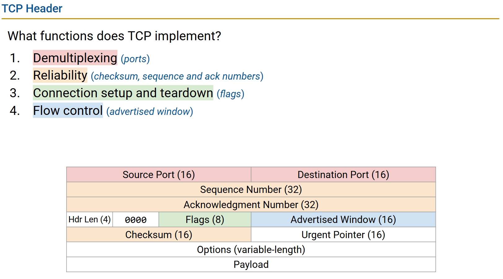
