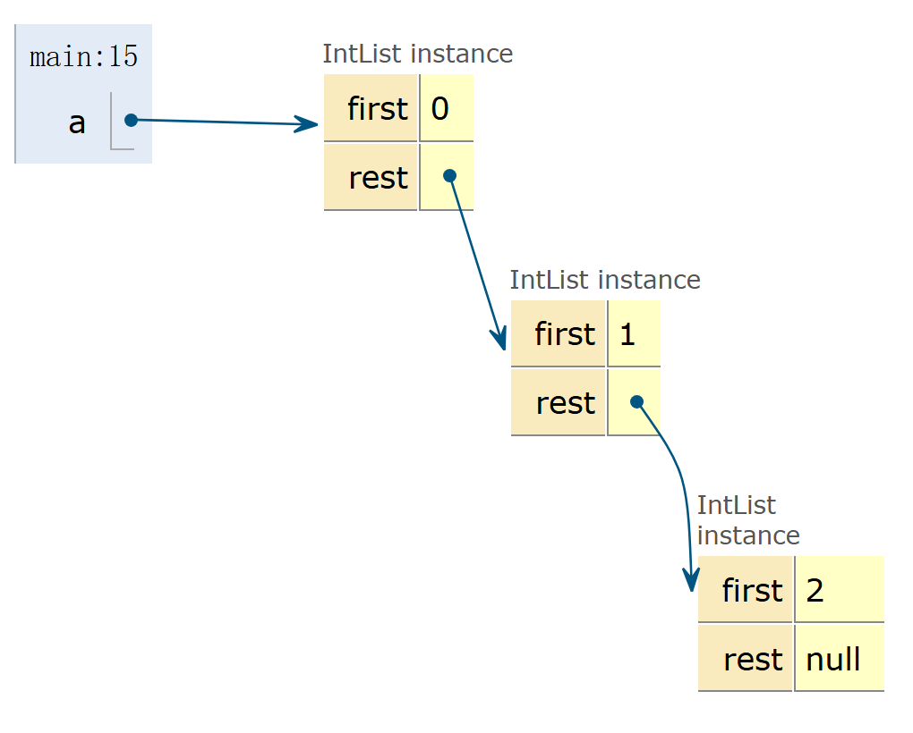

# Linked Lists

I write this note mainly based on these slides from UCB CS61B:

[Lec4](https://docs.google.com/presentation/d/1HQqHSA-h1vRHeResuxmDBGNQACkmxpUBHF3m4-oKU_Q/edit?slide=id.g1c268c8d38_0_2#slide=id.g1c268c8d38_0_2), [Lec5](https://docs.google.com/presentation/d/1q6p0spGPmj8rFrQnWKp_QZJRFHg-IkHE1L9BfZc0f0Q/edit?slide=id.g107e0abc84_0_305#slide=id.g107e0abc84_0_305), [Lec6](https://docs.google.com/presentation/d/1itxVVyJTxKaDod3L8_jasnlZ1LHu-KDeV6Njbqqgbfs/edit?slide=id.g829fe3f43_0_506#slide=id.g829fe3f43_0_506)

## Motivation: From Arrays to IntList

### Arrays

This is something we are all familiar with in Java.

```java
int[] x = new int[]{0, 1, 2, 95, 4};
```


We declare it and then instantiate it, so that it will be there. It is friendly for everyone.

However, I know there is some problem with it. I know Java very well, okay? If you are referenced by some variable, you are fine. But every single time when you got not referenced, you are dead to Java. Bro will just think you are garbage and throw you away.

This is not good enough because it means instantiated objects can be lost. Once we reassign the variable, we can never find our old sweet object back.

And this is why we need Linked Lists. Wait, what is this thing? Let's start easy, we got IntList here which basically does the same thing as arrays.

### IntList

The IntList is base on the idea of reference and recursion. It is consists of two parts, the first and the rest. The first is the first element of the list and the rest is the rest of the list. You know what I mean? Like the rest is actually another IntList.

There is this picture which may help you understand.



I think it would be pretty clear now. Everything is super cool and nice for no more lost objects. There are a lot of references here. The stories about changing the references and then the objects got lost will no longer happen.

## Users are Dumb: From IntList to SLList

However, things are getting too complicated. I mean how do you even use this IntList thing in real life?

That' do this real problem here. I will give you the code of IntList first.

```java
public class IntList {
   public int first;
   public IntList rest;
   public IntList(int f, IntList r) {
      first = f;
      rest = r;
   }
}
```

Now, I need a method to calculate the size of the list. And here is my implementation.

```java
/** Return the size of this IntList. */
   public int size() {
      if (rest == null) {
         return 1;
      }
   	return 1 + this.rest.size();
```

Recursion! What is more exciting than this? But won't it be too complicated if you have to do this every time? And for every time, I mean every time.

Let's see some more examples.

Method int get(int i) that returns the ith item in the list.
1.For simplicity, OK to assume the item exists.
2.Front item is the 0th item.

```java
    public int get(int i) {
        if (i == 0) {
            return this.first;
        }
        return this.rest.get(i - 1);
    }
```

public static IntList incrList(IntList L, int x);
1.Returns an IntList identical to L, but with all values incremented by x.
2.Values in L cannot change!

```java
    public static IntList incrList(IntList L, int x) {
        if (L == null) {
            return null;
        }
        return new IntList(L.first + x, incrList(L.rest, x));
    }
```

public static IntList dincrList(IntList L, int x);
1.Returns an IntList identical to L, but with all values incremented by x.
2.Not allowed to use ‘new’ (to save memory).

```java
    public static IntList dincrList(IntList L, int x) {
        if (L == null) {
            return null;
        }
        L.first += x;
        dincrList(L.rest, x);
        return L;
    }
```

Basically, using IntList is just about recursion, recursion, and recursion. Of course, I know you are as smart as me and can nail all of these implementations with ease. But, think of our users. They are literally dumb. And for dumb, I mean dumb. Java reference, they can never do it right. Recursion? Don't even mention it.

And that, kid, is how I met your mother, I mean, SLList.

### SLList

I got confused when I first saw this name. There are literally three capital letters in the front. That seems stupid.
