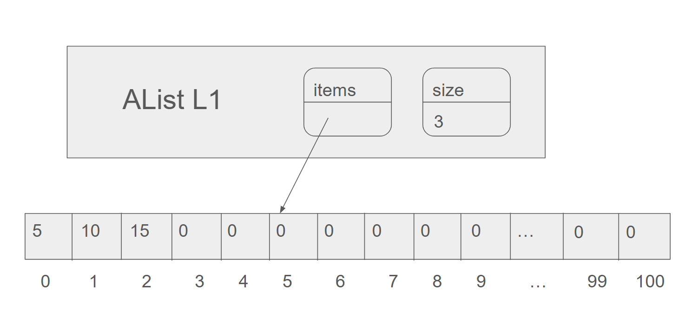
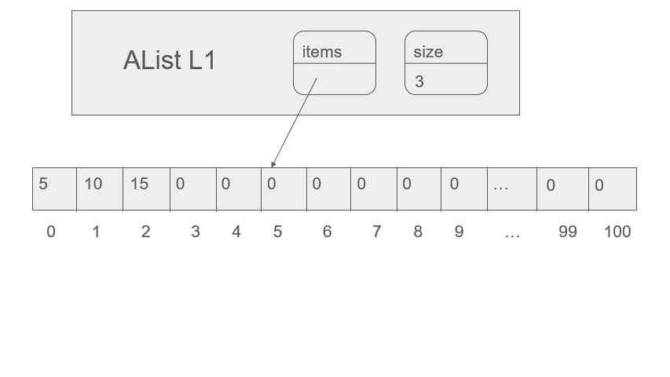
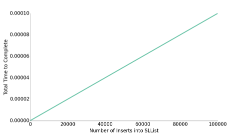
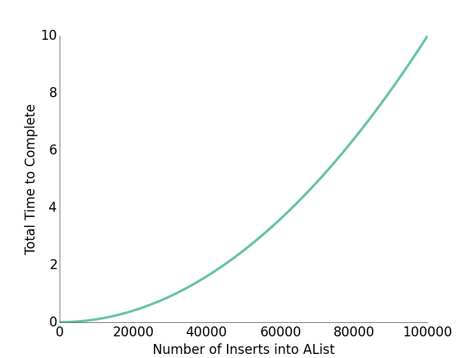
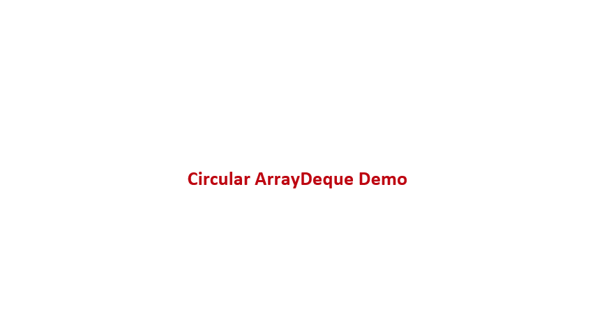
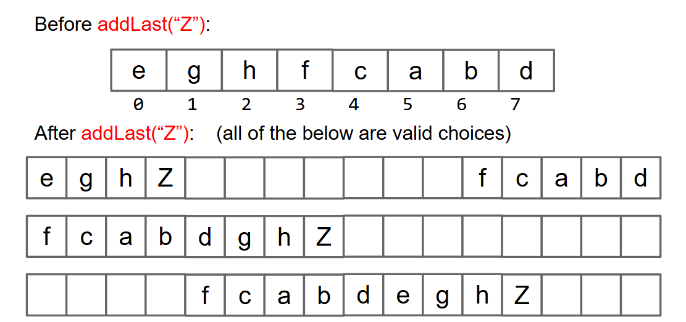

# Array Lists

I write this note mainly based on these slides from UCB CS61B:

[Lec7](https://docs.google.com/presentation/d/1ZKSPKdEjlLlzmf7LoQJlTUC3w0MPInSXy2DxTEva0yo/edit?slide=id.g108d20ae8c_0_452#slide=id.g108d20ae8c_0_452)

## Motivation: Linked Lists suck

I know we have made a lot of effort to make Linked Lists look great in [the previous note](./LinkedLists.md). But chicks won't fly no matter how hard you train them. The Linked Lists are still suck.

What do I mean? You know when we say a data structure sucks, we are talking about the time. The Linked Lists are SLOW.

How so? We had made all these addFirst, addLast, getFirst, getLast, removeFirst and removeLast shits so fast. I think some of my ancestors died for them.

However, if you wanna do a get(int i) method, you know it sucks. You always have to traverse the whole list from the first or the last node and the longer the list, the longer it takes.

But, remember, we used to want this shit to replace arrays. Arrays can do get(int i) in constant time! So naturally, we consider using arrays to do this list shit than linking some nodes up.

BANG! Here you are the Array Lists, which we will just call ALists.

### Naive ALists

I think after doing all these Linked List shit, we can do this straight forward. Still have the bureaucracy, store the size, and a 'items' variable which points to an array.

Notice that the length of an array is fixed, so we use a very long array and just set those unused positions to zero.

See this pic if not clear.



And here is the code.

```java
/**
 * Invariant:
 * The position of the next item to be inserted is always size.
 * size is always the number of items in the AList.
 * The last item in the list is always in position size - 1.
 */
public class AList {
  private int[] items;
  private int size;

  public AList() {
    items = new int[100];  size = 0;
  }

  public void addLast(int x) {
    items[size] = x;
    size += 1;
  }

  public int getLast() {
    return items[size - 1];
  }

  public int get(int i) {
    return items[i];
  }

  public int size() {
    return size;
  }
}
```

## Resizing: Break the ceiling

As we just mentioned, the length of an array is fixed. No matter how big the number you set, it can be not enough.

I am always worried about my bank account, not knowing what to do if one day I suddenly made a lot of money and the account is too full to save it.

So, as long as the ceiling exists, we can never feel safe.

On the other hand, if we, let's say, set it to a billion so we can be safe for a while, it would be pretty wasteful. Since we may only deal with some 20 items shits. Now this is really just like my bank account.

Okay, after a few hours of crying I am coming back to nail this problem. Obviously, we need to resize the array.

### Resize Implmentation

The idea is straight forward. Before we doing some operations that have something to do with the size, we first check if the array is too full or too empty. If it is too full, we make it bigger. If it is too empty, we make it smaller.

Just create a new array with the size we want, copy all shits from the old one to it and change the reference of items. This is the resize method.

See this gif if not clear.



And here is the code.

```java
private void resize(int capacity) {
  int[] a = new int[capacity];
  System.arraycopy(items, 0, a, 0, size);
  items = a;
}

/*Example of usage*/
public void addLast(int x) {
  if (size == items.length) {
	resize(size + 1);
  }
  items[size] = x;
  size += 1;
}
```

## The strategy of resizing

Now we have fixed the problem of the fixed length! What a funny sentence. I bet this is not a coincidence. Some guy invented English while using an AList, and this should be in the history book.

Now the AList can change the length dynamically, but does it really more efficient? Actually sometimes it is not.

### Geometric Resizing

You see how we set the capacity in the example addLast method? We just add 1 to the size, which is almost the dumbest idea. I believe even you would not do that.

We make Alist for better performance than Linked Lists, and Alist must do resize. You see the problem here, resize itself is a super slow shit. Every time you resize you create a brand new array and copy shits one by one. Now imagine we have a full array of size 100, and call addLast until size = 1000, roughly how many total array memory boxes will we need to create and fill?

Easy math. That would be

$$
101 + 102 + 103 + ... + 1000 = 495,050
$$

close to 500,000.

I think we can all agree under our current strategy, the resize will make us super slow. Actually, even much slower than Linked Lists.

You can see the two pictures which I smoothly stole from the UCB slide I mentioned at top.





This can't be more unpleasant. 

How do we fix this? Actually just a simple idea. Every time we resize, we don't add something, we multiply something. 

To be specific, change from this

```java
public void addLast(int x) {
  if (size == items.length) {
	resize(size + RFACTOR);
  }
  items[size] = x;
  size += 1;
}
```

to this

```java
public void addLast(int x) {
  if (size == items.length) {
	resize(size * RFACTOR);
  }
  items[size] = x;
  size += 1;
}
```

But why this works?

Well, buckle up, time for some math!

You see when we set the capacity to be (size + M), and we need to insert N items, the total number of memory boxes we need to create and fill is roughly

$$
\begin{aligned}
&M + 2*M + 3*M + ... + \frac{N}{M}*M \\
&= M * (1 + 2 + 3 + ... + \frac{N}{M}) \\
&= M * \frac{N}{M} * (\frac{N}{M} + 1) / 2 \\
&= \frac{N^2}{2M} + \frac{N}{2}
\end{aligned}
$$

And when we set the capacity to be (size * M), the total number of memory boxes we need to create and fill is roughly

$$
\begin{aligned}
&M + M^2 + M^3 + ... + M^{\log_M N} \\
&= M * (1 + M + M^2 + ... + M^{\log_M N - 1}) \\
&= M * \frac{M^{\log_M N} - 1}{M - 1} \\
&= M * \frac{N - 1}{M - 1}
\end{aligned}
$$

You see these two functions about N, one is quadratic, the other is linear. I assume you have been to junior high, so you see my point.

To be clear, the math above is not rigorous, I had done a lot of simplification, just hope this to be low pressured.

By the way, other than the situation that the array is too full, we also need to consider the situation that the array is too empty.

The typical solution is that we maintain a variable R, which defined as R = size / items.length the 'usage ratio'.

Strategy: Half array size when R < 0.25. Or some other number you feel comfortable with.

## ArrayDeque

We have seen such things before, when we do the DLList. It is something which is double ended, and we actually do it Double-Ended Queue, or Deque to be short. Oh, when you read the Linked Lists note, you may confuse why my implementation at the last is LinkedListDeque, now you know the reason.

Anyways, since we can do that with Linked Lists, why not do it with Array Lists?

For Linked Lists, we let the bureaucracy store two sentinels or link both ends to the prev and next of the one sentinel. But how do we make ALists double ended?

Well, a very natural idea would be regard the array as a circular one. Let the bureaucracy track the array index of both the first and the last item of the Deque by some way. When your first item is at index 0, and you addFirst, your first item loop back to the last position of the array, and same as the last item.

See this gif if not clear. Btw, I just stole everything from the UCB [proj1](https://docs.google.com/presentation/d/1XBJOht0xWz1tEvLuvOL4lOIaY0NSfArXAvqgkrx0zpc/edit?slide=id.g15cbbcb770b_47_0#slide=id.g15cbbcb770b_47_0) slide for it's too complicated to draw myself.



Still, this need resizing. But I guess you can see this would be a little tricky.

You can choose what the array turn into after add to a full one. See pic below.



Three ways, all works, I can assure you. This is not the tricky part.

The tricky part is implementing this data structure with real world code. For example, when you want to go to the next item, sice the array is circular, how do you know it is right next to you or need to loop to the first item? And so do when you want to go to the previous item.

As it always goes, I am here to save your world. Only a little math can make this smooth as hell. 

In an array of length N, the next item of the i-th item is either i + 1 or i - N + 1, it depends whether i is less than N or not. 

So, we can use a modulo operation to fix this.

To be specific, the next item of the i-th item is (i + 1) % N.

And the previous item of the i-th item is (i - 1 + N) % N.

So you see how we use this to do the addFirst and addLast for example.

```java
    public void addFirst(T item) {
        if (size == items.length) {
            resize(items.length * 2);
        }
        items[nextFirst] = item;
        nextFirst = (nextFirst - 1 + items.length) % items.length;
        size++;
    }

    public void addLast(T item) {
        if (size == items.length) {
            resize(items.length * 2);
        }
        items[nextLast] = item;
        nextLast = (nextLast + 1) % items.length;
        size++;
    }
```


## Some remaining stuffs to be done

### Generic ALists

Nothing new to say, totally same as what we had done to the Linked Lists. 

```java
public class AList<TigerKidIsPrettyCute> {
  private TigerKidIsPrettyCute[] items;    
  private int size;
 
  public AList() {
    items = (TigerKidIsPrettyCute []) new Object[8];  
    size = 0;
  }
 
  private void resize(int cap) {
    TigerKidIsPrettyCute[] a = (TigerKidIsPrettyCute []) new Object[cap];
    System.arraycopy(items, 0, 
                     a, 0, size);
    items = a;
  }

  public TigerKidIsPrettyCute get(int i) {
    return items[i];
  }
...
}
```

### Don't loiter outside

You see in Alists, when you removeLast, you don't actually delete the item. You just set the size to be one less.

That won't bother you if it is a integer, 0 or some other shits, not a problem. However, if it is some other things, maybe a picture or a video well who knows what would you do with my Alist, a lot of memory will be wasted.

So always remember to **set the unused positions to be null**. Then java will know the picture or video is garbage and it can never loiter outside anymore.

## Implementation in real Java code

Here is my implementation of the AList, actually ArrayDeque, for the CS61B project.

```java
package deque;

import java.util.Iterator;

public class ArrayDeque<T> implements Iterable<T>, Deque<T> {
    private T[] items;
    private int size;
    private int nextFirst;
    private int nextLast;

    public ArrayDeque() {
        items = (T[]) new Object[8];
        size = 0;
        nextFirst = 3;
        nextLast = 4;
    }

    private void resize(int capacity) {
        T[] newItems = (T[]) new Object[capacity];
        int toCopyIndex = (nextFirst + 1) % items.length;
        for (int i = 0; i < size; i++) {
            newItems[i] = items[toCopyIndex];
            toCopyIndex = (toCopyIndex + 1) % items.length;
        }
        items = newItems;
        nextFirst = items.length - 1;
        nextLast = size;
    }

    @Override
    public void addFirst(T item) {
        if (size == items.length) {
            resize(items.length * 2);
        }
        items[nextFirst] = item;
        nextFirst = (nextFirst - 1 + items.length) % items.length;
        size++;
    }

    @Override
    public void addLast(T item) {
        if (size == items.length) {
            resize(items.length * 2);
        }
        items[nextLast] = item;
        nextLast = (nextLast + 1) % items.length;
        size++;
    }

    @Override
    public int size() {
        return size;
    }

    @Override
    public void printDeque() {
        if (size == 0) {
            System.out.println();
            return;
        }
        int toPrintIndex = (nextFirst + 1) % items.length;
        for (int i = 0; i < size - 1; i++) {
            System.out.print(items[toPrintIndex] + " ");
            toPrintIndex = (toPrintIndex + 1) % items.length;
        }
        System.out.print(items[(nextLast - 1 + items.length) % items.length]);
        System.out.println();
    }

    @Override
    public T removeFirst() {
        if (size == 0) {
            return null;
        }
        int toRemoveIndex = (nextFirst + 1) % items.length;
        T toRemove = items[toRemoveIndex];
        items[toRemoveIndex] = null;
        nextFirst = (nextFirst + 1) % items.length;
        size--;
        if (size > 8 && (double) size / items.length < 0.25) {
            resize(items.length / 2);
        }
        return toRemove;
    }

    @Override
    public T removeLast() {
        if (size == 0) {
            return null;
        }
        int toRemoveIndex = (nextLast - 1 + items.length) % items.length;
        T toRemove = items[toRemoveIndex];
        items[toRemoveIndex] = null;
        nextLast = (nextLast - 1 + items.length) % items.length;
        size--;
        if (size > 8 && (double) size / items.length < 0.25) {
            resize(items.length / 2);
        }
        return toRemove;
    }

    @Override
    public T get(int index) {
        if (index < 0 || index >= size) {
            return null;
        }
        int realIndex = (nextFirst + 1 + index) % items.length;
        return items[realIndex];
    }

    @Override
    public Iterator<T> iterator() {
        return new DequeIterator();
    }

    private class DequeIterator implements Iterator<T> {
        private int position;
        private int count;

        DequeIterator() {
            position = (nextFirst + 1) % items.length;
            count = 0;
        }

        @Override
        public boolean hasNext() {
            return count < size;
        }

        @Override
        public T next() {
            T toReturn = items[position];
            position = (position + 1) % items.length;
            count++;
            return toReturn;
        }
    }

    @Override
    public boolean equals(Object o) {
        if (this == o) {
            return true;
        }
        if (!(o instanceof Deque)) {
            return false;
        }
        Deque<?> otherDeque = (Deque<?>) o;
        if (size != otherDeque.size()) {
            return false;
        }
        for (int i = 0; i < size; i++) {
            T thisItem = this.get(i);
            Object otherItem = otherDeque.get(i);
            if (thisItem == null) {
                if (otherItem != null) {
                    return false;
                }
            } else if (!thisItem.equals(otherItem)) {
                return false;
            }
        }
        return true;
    }
}
```
