# B Trees

I write this note mainly based on this slide from UCB CS61B:

[Lec17](https://docs.google.com/presentation/d/1NgaMi7IWs94sC_fhF7_UWx2O4LyPicvVJ9xkru9m2dU/edit#slide=id.g409413421_0637)

Such a long slide, with so many pictures, I am so not gonna draw it myself. Still steal it.

## Motivation: Make it BALANCED

### The 'bushy' and 'spindly'

In my [BST note](BinarySearchTrees.md), we talked about the performance of BST operations. But we just said that it is good if the BST is 'bushy', or balanced whatever. However, what if it's not? I didn't know did you find me ignore this int that note. Of course no, you can't be that smart.

Anyway, sometimes BSTs fuck up. Sometimes they are just 'spindly', pretty much like a linked list, and the performance is bad af. When it's balanced, you add 1 to add 1 height, then add 2, then you need 4, then 8... But for the 'spindly' case, every node add 1 height! So the performance is $\theta(N)$.

See this pic if not clear:

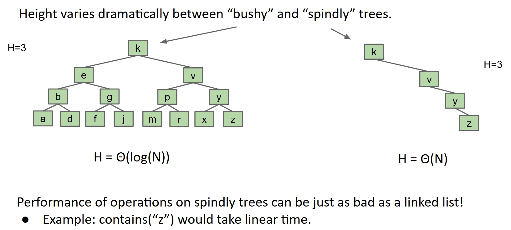

So what I mean is, the BST can work with a height of $\log N$, which is good,but it can also work with a height of $N$ in the worst case. That's why we need to make it balanced, to keep it good.

### Average Depth

You see, for a BST with $N$ nodes, if it's 'bushy', the height is $\log N$. But if it's 'spindly', the height is $N$. So you can't see the performance of the BST just by the height, because you don't know if it's a 'bushy' one with a lot of nodes or just a 'spindly' one with the height number of nodes.

Then what do we use? What can show how 'bushy' a $N$ nodes BST is? Well, the I am your shepherd; you shall not want. Let me tell you the average depth.

If we define this now concept called depth, which is how far a node is from the root, then we can calculate the average of all these nodes' depth. And this is the Average Depth.

I think it's easy to understand. If this value is large, it would be 'spindly', and if it's small, it would be 'bushy', I mean for the same $N$ of course.

See this pic if not clear:

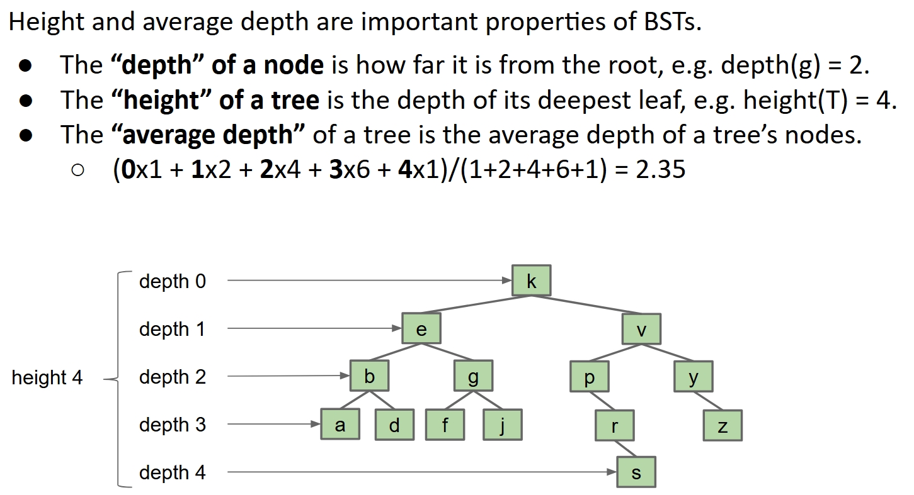

By the height 4, you can see the worst case, which is you may take 5 comparisons to do an action. And by the average depth 2.35, you can see the average case, which is the average number of comparisons you need is 3.35.

### Do random?

Why don't we just work on the insertions? Obviously, if we do it in order

`add(1), add(2), add(3), add(4), add(5), add(6), add(7)`

we get a 'spindly' BST. But if we do it randomly

`add(4), add(2), add(1), add(3), add(6), add(5), add(7)`

we get a 'bushy' BST.

Actually if you write some easy shit code to simulate, you will see trees build from random insertions got $\theta( \log N)$ average depth and height. GOOD AS FUCK!

So we just always do random! Problem solved! Let those data structure improvement shits go to hell!

I know you have this thought, since you are that stupid. But this won't always work.

You may be having like, 2000 kids in the future. And you need this BST to store their date of birth. You can't wait until the last one to do this, you would be forgotten about the first hundreds already. So you see, sometimes in real world, in real case like this, data comes in over time, not all at once.

My point is, we need something that can make it balanced no matter what order the data comes in, something good, something big, something totally different.

## B Tree

### No new leaves

Stop thinking, you won't get it right. Not because you are stupid, well maybe a little, but mostly because you have a normal brain. And the answer sounds crazy.

The problem that causes the possibility of 'spindly' BST is that we always add new leaves at the bottom. Then what about we don't do that? Close the camera because I can totally see your face.

What? If so what do we do to the new coming keys?

Obviously, well this time is real, we can only stuff the new coming keys into the existing leaves.

Like this:

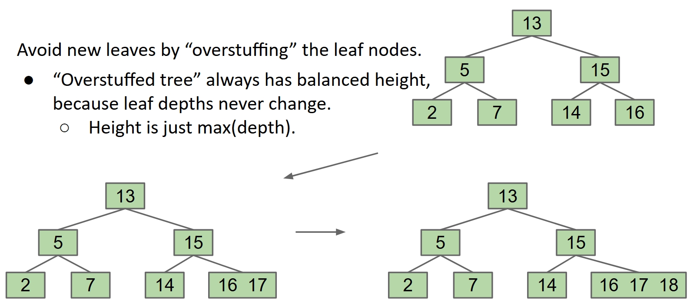

I know it looks extremely weird. I said this is a crazy idea.

Keep thinking, troubles are coming when we stuff and stuff. The leaves can be too 'juicy', like this:

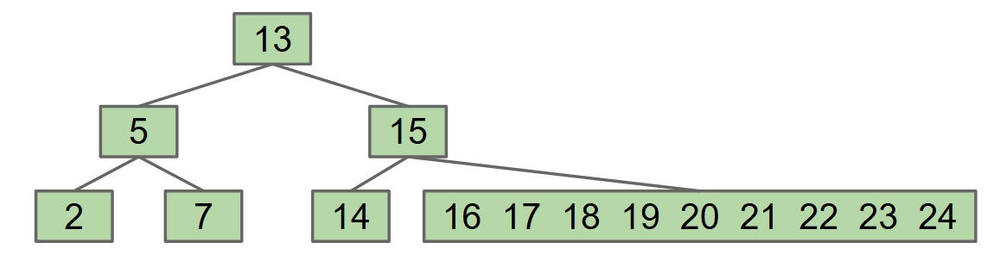

Yeah yeah yeah, I know you don't understand what is wrong with too juicy. Say we need to find 24, we enter from 13, it's bigger so we go right, which is 15. Still bigger, go right, than we arrive this really juicy leaf `16 17 18 19 20 21 22 23 24`. Now we have to go right one by one, this part of the BST degenerate to a stupid linked list or alist! We built BSTs to avoid these stupid shits, remember?

Then how do we deal with that? Well, naturally if we don't want too many keys in a leaf, we set a limit `L`.

Let's say `L = 3`, then the pic below which have a 4 keys leaf is hitting the limit：

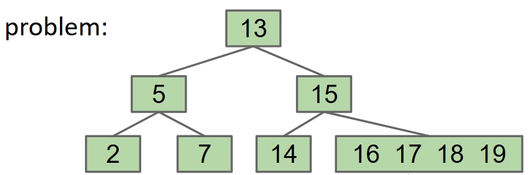

Let's just arbitrarily push one key up to its parent, say 17. Well, to keep things simple, we just always push the left middle one. Anyway, then we got this:

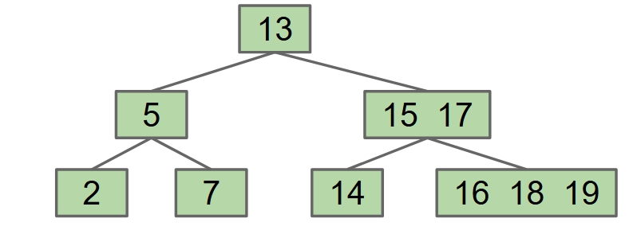

Now this looks not so weird, doesn't it? Wait, a minute, 16 is at the right of 17! We need to fix this. How? Seems the only choice is to split the `16 18 19` leaf.

Like this:

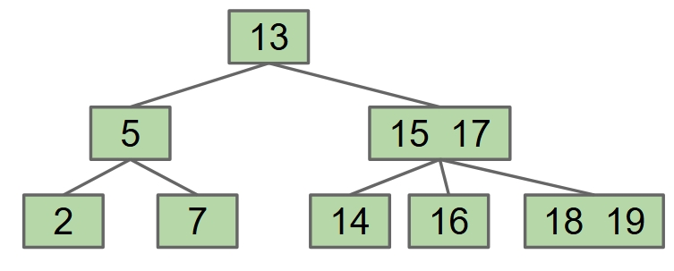

Now the parent has 3 children, but it also has 2 keys. It doesn't bother you when you try to decide which child to go, go the middle one if larger than 15 but smaller than 17, right?

### The process

To check if this works, I just show some pics of keeping adding new keys and see how everything goes, until we hit another problem. You can think what happen next and see the next step in the pic. Good way to check your understanding.

Now we add 20, 21:

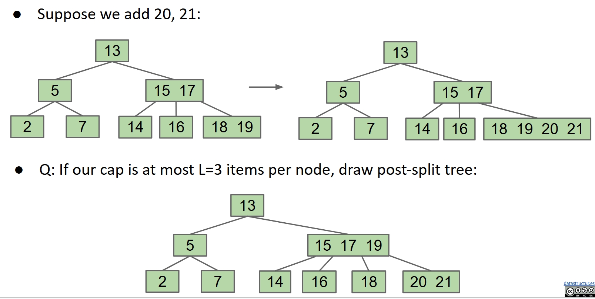

Just normal, it hit the limit L and the left middle one, which is 19, go up. And now our cute parent got full too.

We add 25, 26:

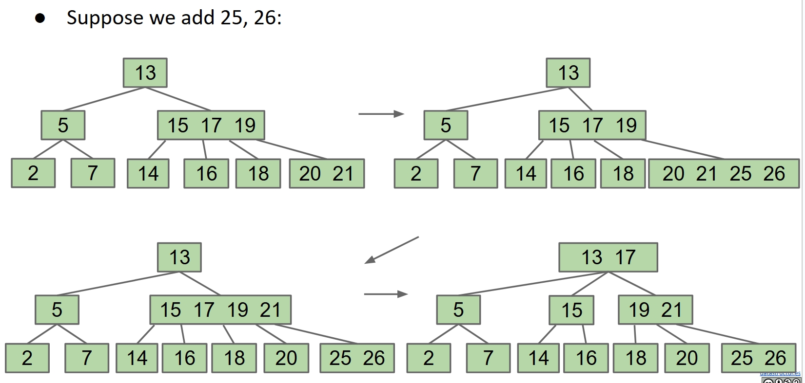

This causes something pretty like the chain reaction. Leaf is full and push up, then its parent is full and another push up. Anyway, our little process seems to work.

And we can add and add, our process will still work, ever until we got the root full. You don't have a parent to go!

To make it easy, consider this pic, that one above is already too messy.

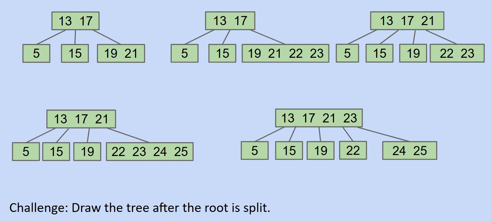

Here the root has 4 keys in it, and 5 children. Four is hitting the limit, and no parent for us to go. I think even you can figure out the only way is create a parent, which is going to be the new root, and split the old root to be children of the new root.

And now we got:

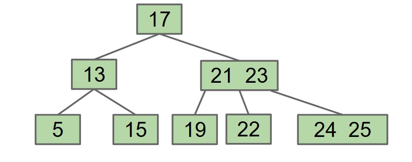

Okay, now we have the whole process done. It works fine, got the tree perfectly balanced all the time.

If you want to go deep, the process actually lead to these two rules, or say invariants, that guarantee the bushiness:

- All leaves must be the same distance from the source.
- A non-leaf node with k items must have exactly k+1 children.

Happy ending! This is the B Tree.

### Name stuff, terminology

Some thinks it would be better to call it Splitting tree. I don't actually give a fuck about the name stuff. But I know people with your intelligence love arguing shits like that, and will keep asking what the B stands for. However, the authors never explain that. Some thinks it's Balanced, Broad, Bushy or Bayer the name. I support BoringAsFuckYouStupidDataStructure.

By the way, it got some specific names up to the choice of limit L. We chose 3, so each node can have 2, 3 or 4 children, then we call it 2-3-4 tree. Same logic, if L=2, you got 2-3 tree.

## B Tree performance

If you try it out, you will find no matter what order the data comes in, the B Tree will always be balanced. Well the height can be a little vary, but always bushy.

For example, set the limit L=2, so this is a 2-3 tree. We add in the order of 1, 2, 3, 4, 5, 6 and 7.
Then we got:

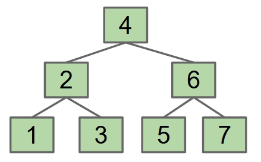

But if we add in the order 2, 3, 4, 5, 6, 1 and 7. Then we got:

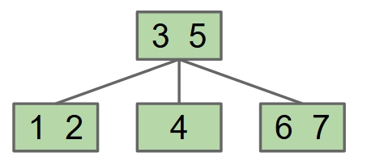

So the height may be 2 or 1, but the bushy is guaranteed.

We finally satisfied the requirement of motivation part, which is make BST balanced no matter what order the data comes in. Now, let's analysis the performance of the B Tree and see if it's really that good.

### The Height

We have a new constant here, which is the limit L.

Easy peasy. The best situation would be each node has L keys, and the height is $\log_{L+1} N$. And the worst is each has only one key, for that case we got height of $\log_{2} N$.

Actually, we computer guys are cool. Because we don't really cares those base shits. Let it bothers math nerds. For us, it's all $\theta(\log N)$.

### The Search

The S of BST stands for Search, and since we are working on improving the BST, we must care search.

Just consider the worst case. You do `contain(shit)` to see if `shit` is in the BST. For the most, we need to got through `Height+1` nodes, and each node can have at most L keys. So the worst case is $\theta(L \times (Height + 1))$.

We already know the height is $\theta(\log N)$, and L is a constant, so the performance of B tree search operation is $O(\log N)$.

### The Insertion

Still the worst case. You check `Height+1` nodes, and each node can have at most L keys. But remember, adding can cause a big chain reaction, mostly another `Height+1` split.

I think you may have already know this high school math, hope I am not wrong. It's basically still $O(\log N)$.

WOW! Everything got the worst case performance of $\theta(\log N)$! Like living in a sweet dream. This is GOOD AS FUCK! GOOD AS FUCK! GOOD AS FUCK!

## Remaining Stuff

I actually didn't do a lot thing complitely. I did not talk about how to push when it's not 2-3-4 tree. I think even you can figure out for 2-3 tree, just push the middle one. But for larger L, I mean to not talk about for it's not important at all. You want it you can google or ask LLMs.

And you may have noticed I didn't talk about the deletion at all. Well, if you haven't, try examin your IQ. But actually I am not going to ignore that, it's just a little tricky and I don't want to make it too long to see the performance. Now you know the B tree is wonderful, you should want to clear up the final detail problem with me.

### The Deletion

I hope you still remember the BST deletion, or the Hibbard deletion. I will have this pic as a reminder:

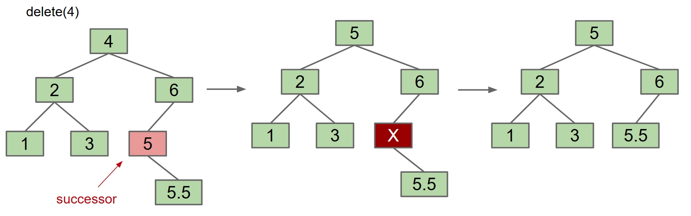

Quite tricky already, isn't it? Especially compare to the add or search. But for B tree, it's even more complicated.

If the key to be deleted is in a node with 2 or more children, then it's easy, quite similar to the BST deletion. We just:

- Swap the value of the successor with α.
- Then we delete the successor value.

The successor is guatanteed to be in a leaf, thanks to the exactly k+1 children rule.

See this pic if not clear:

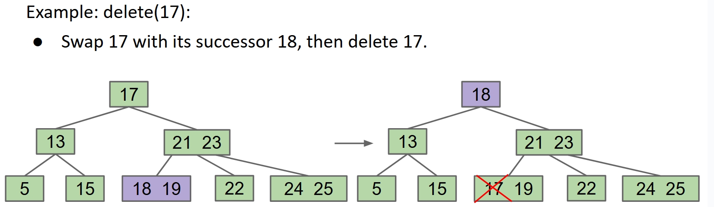

So we solve this case, actually didn't, but we turn it into the case of deleting a key in a leaf.

The case of deleting a key in a leaf is a little tricky. If it's in a multi-key leaf, then easy peasy, delete it and we are done.

But if it's in a single-key leaf, we can't delete the leaf directly. Don't forget the exactly k+1 children rule!

So we need to leave an empty leaf there, but this is strange, right? Look at this pic below, a stupid ugly red X in my cute green tree!

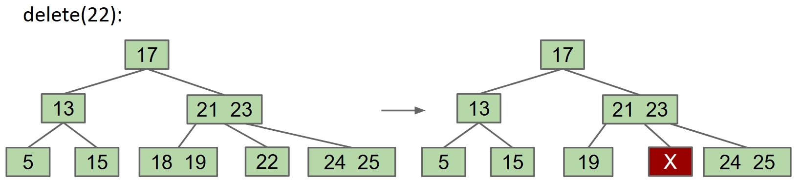

Finally, we turn the problem into how to fill the empty leaf, and we got the real tricky part.

For some reason you will see later, we won't regard the empty node as a leaf. We assume it can be in any position. And obviously, if it has child, at most one.
And to keep things simple, we will just see the 2-3 tree case.

**Case 1: Multi-key Sibling**

If a sibling of the empty node has two keys, then we can borrow one. Not directly, but we can borrow from the parent, and then the parent borrow from the sibling. And if the empty node is not a leaf, it must also steal a child from the sibling.

See this pic if not clear:

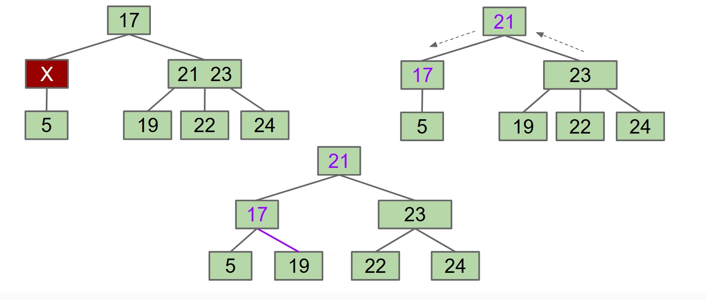

**Case 2: Multi-key Parent**

If all the siblings of the empty node has only one key, but parent has 2, then we can do some crazy things. The empty node and right sibling steal parent’s keys. Middle sibling moves into the parent. Subtrees are passed along so that every node has the correct children.

See this pic if not clear:

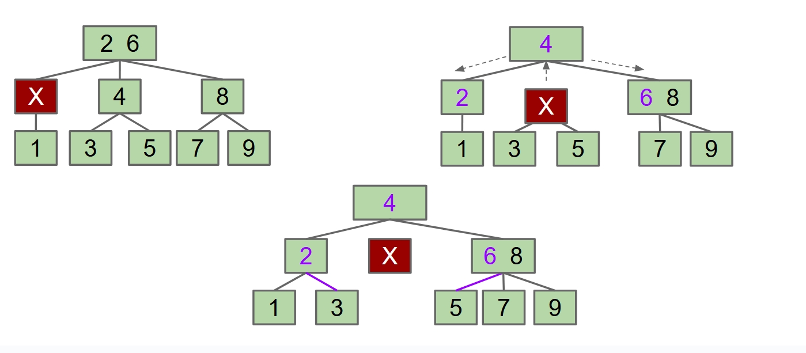

**Case 3: Single-Key Parent and Sibling**

What if the parent and all the siblings have only one key? Then we do even more crazy. We merge the parent and the sibling to replace the empty node, and we send the empty node up.

See this pic if not clear:

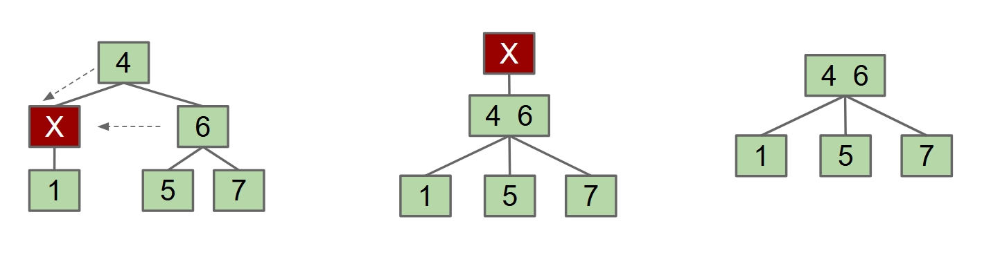

You see why I assume the empty node can be in any position? Because even it starts from the bottom, it got sent up.

This can cause a chain reaction, and either it turn into another case, or the empty node got sent up all the way to be a new root, then we can also just delete it.

See this pic if not clear:

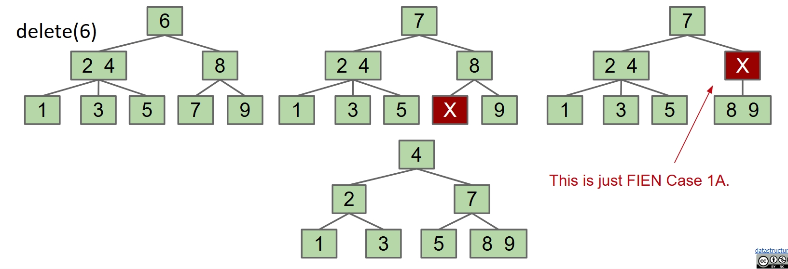

and the root case:

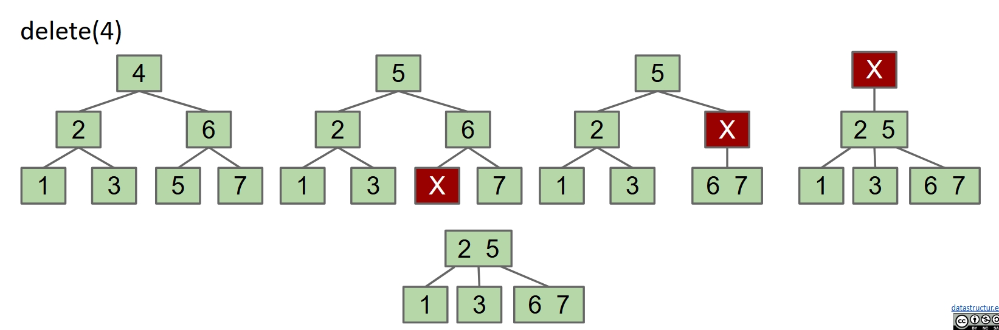

And we are finally done the B tree.

## Implementation

I am presenting this Java implementation here. I did't actually code it, Gemini 2.5 Pro generated it for me. Hope nothing wrong.

```java
import java.util.Arrays;

public class BTree {

    private static final int ORDER = 4;
    private Node root;

    private static class Node {
        int numKeys = 0;
        int[] keys = new int[ORDER - 1];
        Node[] children = new Node[ORDER];
        boolean isLeaf = true;

        // A helper method to find the position of a key or where a key should be inserted.
        int find(int key) {
            int i = 0;
            while (i < numKeys && keys[i] < key) {
                i++;
            }
            return i;
        }

        // A helper method to remove a key at a given index.
        void removeKey(int idx) {
            System.arraycopy(keys, idx + 1, keys, idx, numKeys - idx - 1);
            numKeys--;
        }

        // A helper method to remove a child at a given index.
        void removeChild(int idx) {
            System.arraycopy(children, idx + 1, children, idx, numKeys + 1 - idx);
        }
    }

    public BTree() {
        root = new Node();
    }

    // public method to check if a key exists in the tree
    public boolean contains(int key) {
        return search(root, key) != null;
    }

    private Node search(Node node, int key) {
        if (node == null) return null;
        int i = node.find(key);
        if (i < node.numKeys && node.keys[i] == key) {
            return node;
        }
        return node.isLeaf ? null : search(node.children[i], key);
    }

    // public method to insert a key
    public void insert(int key) {
        Node r = root;
        if (r.numKeys == ORDER - 1) {
            Node newRoot = new Node();
            root = newRoot;
            newRoot.isLeaf = false;
            newRoot.children[0] = r;
            splitChild(newRoot, 0);
            insertNonFull(newRoot, key);
        } else {
            insertNonFull(r, key);
        }
    }

    private void insertNonFull(Node node, int key) {
        int i = node.find(key);
        if (node.isLeaf) {
            System.arraycopy(node.keys, i, node.keys, i + 1, node.numKeys - i);
            node.keys[i] = key;
            node.numKeys++;
        } else {
            if (node.children[i].numKeys == ORDER - 1) {
                splitChild(node, i);
                if (key > node.keys[i]) {
                    i++;
                }
            }
            insertNonFull(node.children[i], key);
        }
    }

    private void splitChild(Node parentNode, int childIndex) {
        Node childToSplit = parentNode.children[childIndex];
        Node newSibling = new Node();
        newSibling.isLeaf = childToSplit.isLeaf;
        int midIndex = (ORDER - 1) / 2;

        // Move the middle key up to the parent
        System.arraycopy(parentNode.keys, childIndex, parentNode.keys, childIndex + 1, parentNode.numKeys - childIndex);
        parentNode.keys[childIndex] = childToSplit.keys[midIndex];
        parentNode.numKeys++;

        // Move children pointers in parent
        System.arraycopy(parentNode.children, childIndex + 1, parentNode.children, childIndex + 2, parentNode.numKeys - childIndex -1);
        parentNode.children[childIndex + 1] = newSibling;

        // Distribute keys to the new sibling
        newSibling.numKeys = ORDER - 1 - midIndex;
        System.arraycopy(childToSplit.keys, midIndex + 1, newSibling.keys, 0, newSibling.numKeys);

        // Distribute children to the new sibling if it's not a leaf
        if (!childToSplit.isLeaf) {
            System.arraycopy(childToSplit.children, midIndex + 1, newSibling.children, 0, newSibling.numKeys + 1);
        }
        childToSplit.numKeys = midIndex;
    }

    // public method to remove a key
    public void remove(int key) {
        remove(root, key);
        if (root.numKeys == 0 && !root.isLeaf) {
            root = root.children[0]; // The tree height shrinks
        }
    }

    private void remove(Node node, int key) {
        int idx = node.find(key);

        if (idx < node.numKeys && node.keys[idx] == key) { // Case 1: Key is in the current node
            if (node.isLeaf) { // Key is in a leaf node
                node.removeKey(idx);
            } else { // Key is in an internal node
                handleInternalNodeDeletion(node, idx);
            }
        } else { // Case 2: Key is not in the current node
            if (node.isLeaf) {
                return; // Key not found
            }
            Node child = node.children[idx];
            if (child.numKeys < ORDER / 2) { // Minimum keys is ceil(ORDER/2)-1
                ensureFullEnough(node, idx);
                // After ensuring, the child might have changed, re-find the correct one
                child = node.children[node.find(key)];
            }
            remove(child, key);
        }
    }

    private void handleInternalNodeDeletion(Node node, int keyIdx) {
        Node predChild = node.children[keyIdx];
        Node succChild = node.children[keyIdx + 1];

        if (predChild.numKeys >= ORDER / 2) { // Steal from predecessor
            int predecessor = getPredecessor(predChild);
            node.keys[keyIdx] = predecessor;
            remove(predChild, predecessor);
        } else if (succChild.numKeys >= ORDER / 2) { // Steal from successor
            int successor = getSuccessor(succChild);
            node.keys[keyIdx] = successor;
            remove(succChild, successor);
        } else { // Merge predecessor and successor
            merge(node, keyIdx);
            remove(predChild, key); // Key is now in the merged node
        }
    }

    private int getPredecessor(Node node) {
        while (!node.isLeaf) {
            node = node.children[node.numKeys];
        }
        return node.keys[node.numKeys - 1];
    }

    private int getSuccessor(Node node) {
        while (!node.isLeaf) {
            node = node.children[0];
        }
        return node.keys[0];
    }

    private void ensureFullEnough(Node parent, int childIdx) {
        Node child = parent.children[childIdx];

        // Try to borrow from left sibling
        if (childIdx > 0 && parent.children[childIdx - 1].numKeys >= ORDER / 2) {
            Node leftSibling = parent.children[childIdx - 1];
            // Move parent key down to child
            System.arraycopy(child.keys, 0, child.keys, 1, child.numKeys);
            child.keys[0] = parent.keys[childIdx - 1];
            child.numKeys++;
            // Move sibling key up to parent
            parent.keys[childIdx - 1] = leftSibling.keys[leftSibling.numKeys - 1];
            // Move sibling's child to child
            if (!leftSibling.isLeaf) {
                System.arraycopy(child.children, 0, child.children, 1, child.numKeys); // numKeys was already incremented
                child.children[0] = leftSibling.children[leftSibling.numKeys];
            }
            leftSibling.numKeys--;
        }
        // Try to borrow from right sibling
        else if (childIdx < parent.numKeys && parent.children[childIdx + 1].numKeys >= ORDER / 2) {
            Node rightSibling = parent.children[childIdx + 1];
            // Move parent key down to child
            child.keys[child.numKeys] = parent.keys[childIdx];
            child.numKeys++;
            // Move sibling key up to parent
            parent.keys[childIdx] = rightSibling.keys[0];
            rightSibling.removeKey(0);
            // Move sibling's child to child
            if (!rightSibling.isLeaf) {
                child.children[child.numKeys] = rightSibling.children[0];
                rightSibling.removeChild(0);
            }
        }
        // Must merge
        else {
            if (childIdx < parent.numKeys) {
                merge(parent, childIdx); // Merge with right sibling
            } else {
                merge(parent, childIdx - 1); // Merge with left sibling
            }
        }
    }

    private void merge(Node parent, int leftChildIdx) {
        Node leftChild = parent.children[leftChildIdx];
        Node rightChild = parent.children[leftChildIdx + 1];

        // Pull key down from parent into leftChild
        leftChild.keys[leftChild.numKeys] = parent.keys[leftChildIdx];
        leftChild.numKeys++;

        // Copy keys from rightChild to leftChild
        System.arraycopy(rightChild.keys, 0, leftChild.keys, leftChild.numKeys, rightChild.numKeys);
        // Copy children from rightChild to leftChild
        if (!rightChild.isLeaf) {
             System.arraycopy(rightChild.children, 0, leftChild.children, leftChild.numKeys, rightChild.numKeys + 1);
        }
        leftChild.numKeys += rightChild.numKeys;

        // Remove key and child pointer from parent
        parent.removeKey(leftChildIdx);
        parent.removeChild(leftChildIdx + 1);
    }

    // Helper for simple visualization
    @Override
    public String toString() {
        return toString(root, "", true);
    }

    private String toString(Node node, String prefix, boolean isTail) {
        StringBuilder sb = new StringBuilder();
        if (node != null) {
            sb.append(prefix).append(isTail ? "└── " : "├── ").append(Arrays.toString(Arrays.copyOf(node.keys, node.numKeys))).append("\n");
            if (!node.isLeaf) {
                for (int i = 0; i < node.numKeys + 1; i++) {
                    String childPrefix = prefix + (isTail ? "    " : "│   ");
                    boolean childIsTail = (i == node.numKeys);
                    sb.append(toString(node.children[i], childPrefix, childIsTail));
                }
            }
        }
        return sb.toString();
    }
}
```
