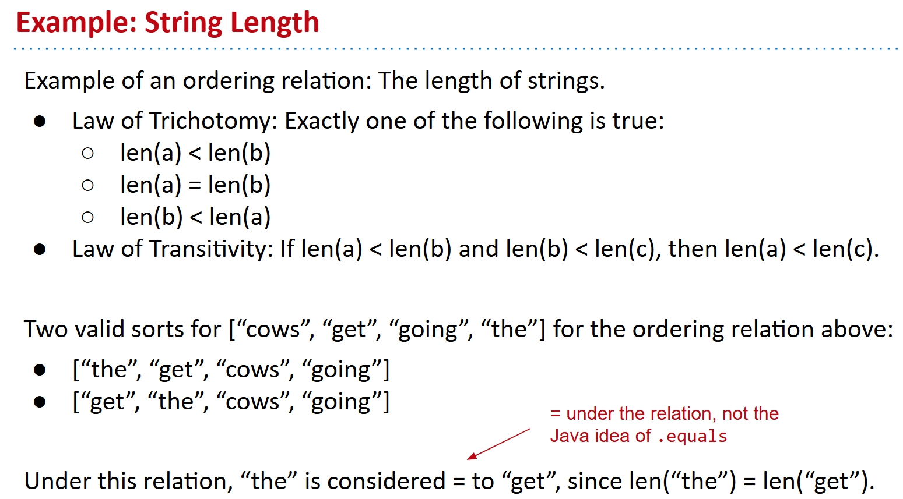
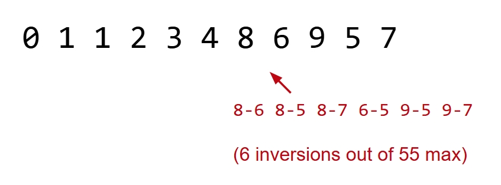
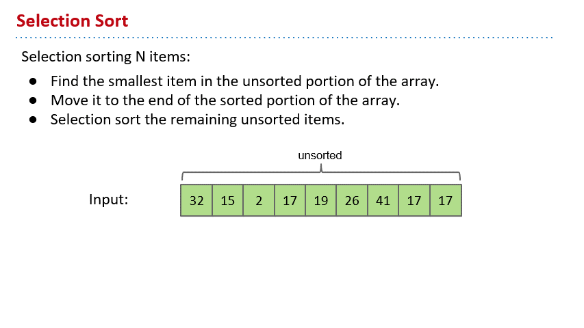
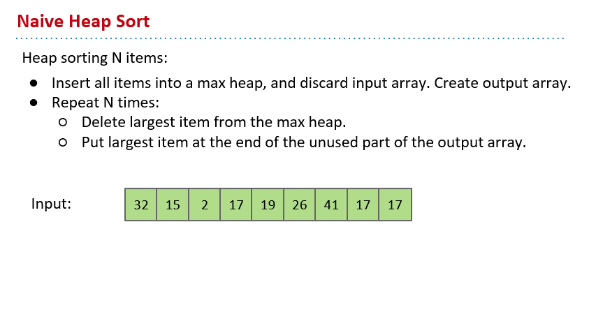
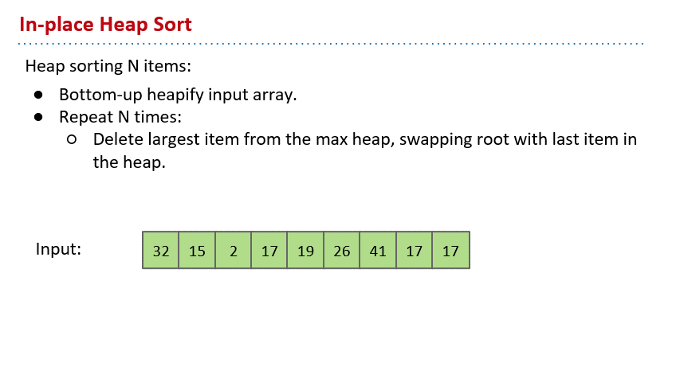
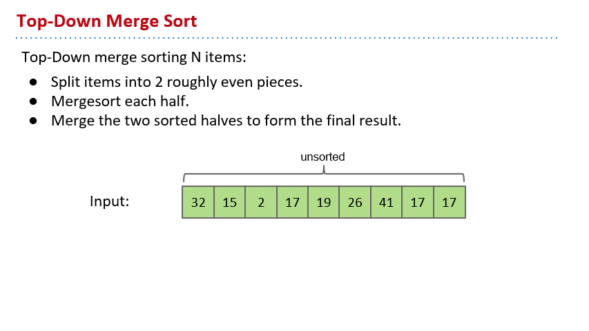
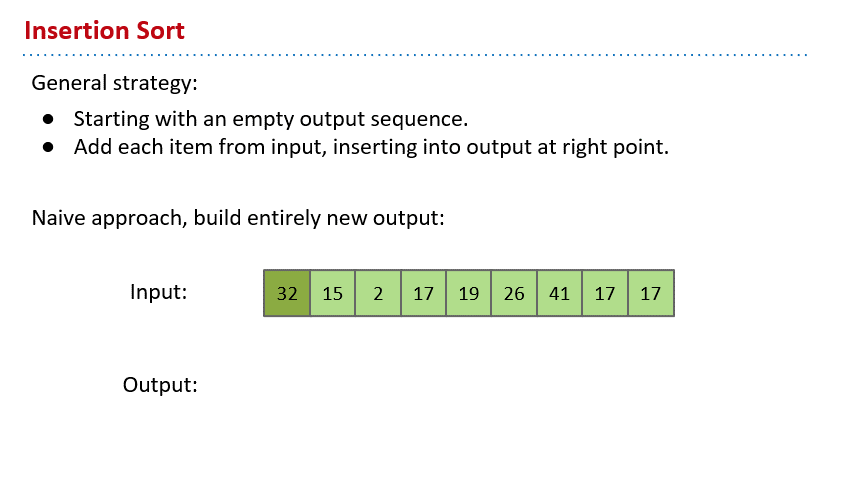
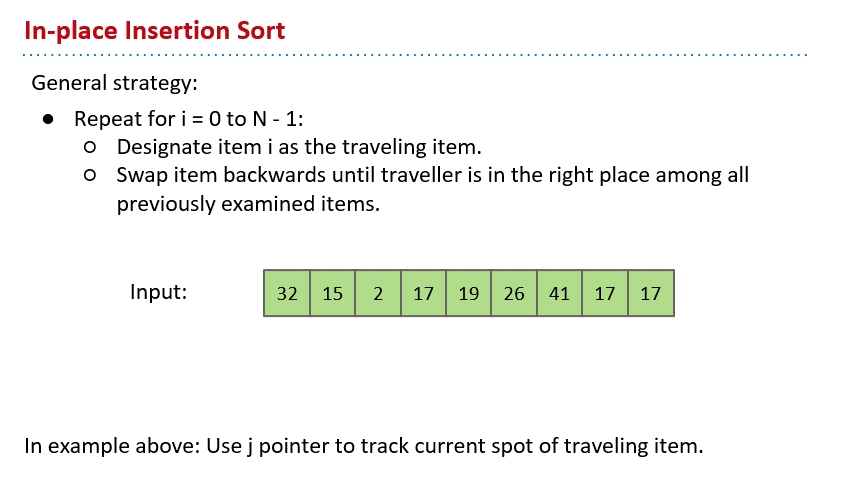
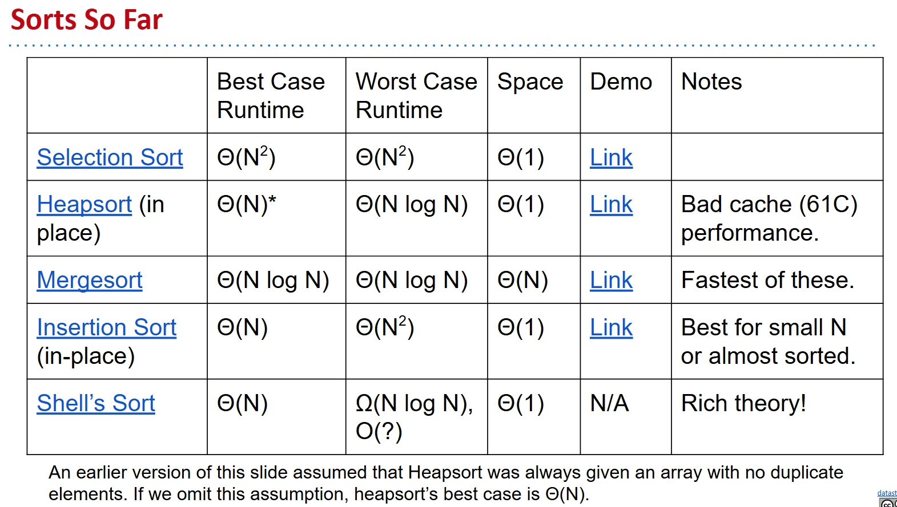

# Basic Sorts

I write this note mainly based on this slide from UCB CS61B:

[Lec29](https://docs.google.com/presentation/d/1YZseMX8zXLy4xBJ3ivp2zH4JhN116cFWjdOISUJZqJA/edit?usp=sharing)

Pictures in the note are all from the slide.

## Motivation

We have done a lot of data structures before, they are all very awesome. And we have done a lot of algorithms before, but they are basically for a single data structure. Such as Dijkstra's algorithm is for a graph. Today we are going to talk about a topic that is totally focused on algorithms, and it can use a lot of data structures we have learned to do a lot of wonderful things.

**The sorting problem** is the topic. To say it informally, it's just put given items in a certain order.

This is very useful. When you want to find same items in a list, just sort it and they would be adjacent. A lot of data structures that are good at searching are also need to be sorted.

Let's define the problem more formally.

An **ordering relation** < for keys a, b, and c has the following properties:

- Law of Trichotomy: Exactly one of a < b, a = b, b < a is true.
- Law of Transitivity: If a < b, and b < c, then a < c.

An ordering relation with the properties above is also known as a “**total order**”.

A **sort** is a permutation (re-arrangement) of a sequence of elements that puts the keys into **non-decreasing** order relative to a given ordering relation.

$x_1 ≤ x_2 ≤ x_3≤ ...≤ x_N$

See this pic below if not clear:

An **inversion** is a pair of elements that are out of order with respect to <.

So we can also regard the sorting problem as a process to reduce the number of inversions to zero.

## Selection Sort

Super easy, super naive. We just find the smallest item, swap it to the front and 'fix' it. Then we do the same thing for all the unfixed items until all items are fixed.

See this gif below for a selection sort demo:

But this is inefficient, we need to see through all the items to find the smallest one every single time. And the final time complexity is $O(N^2)$, if we use array or similar stuffd.

## Heapsort

We have this Heap data structure that can allow as to find the smallest always very fast!

Well to use a min heap can also work, but we are going to do some fancy trick only for max-oriented heap. So we are gonna use the max heap.

Heapsort, but still easy and naive version:

We insert all the items of input array into a max heap. Create an output array. Delete the largest item from the heap and put it at the end of the unused part of the output array. Repeat until the heap is empty(N times).

See this gif below for a naive heapsort demo:

Putting all items into the heap takes $O(NlogN)$ time. Selecting largest item is constant time. Removing it takes $O(logN)$ time. So the total time complexity is

$$O(NlogN) + N \times \theta(1) + N \times O(logN) = O(NlogN)$$

This is already far better than selection sort. Memory usage is $\theta(N)$ to build the additional copy of all of our data. This is a little worse than selection sort.

But we have this better approach to fix this problem. The **in-place heapsort** can perform the similar time complexity, but avoid the extra space usage.

The idea is that we regard the input array as a complete binary tree. And we heaplify it. Then we can do the almost same thing as the naive heapsort, but with some tricks so it would be in-place.

To heaplify it, we just sink(k) every nodes in reverse level order. After sinking, guaranteed that tree rooted at position k is a heap. Then to sort it, we delete the largest item from the heap and swap it with the last item in the heap. Repeat N times and we are done.

See this gif below for a in-place heapsort demo:

The botton-up heapification takes $O(N \log N)$ time. And the selectiong and deletion are also the same as the naive heapsort. So the total time complexity is still $O(N \log N)$.

But no more extra memory usage.

## Mergesort

We also have this recursive approach to sort. We split the array into roughly two halves, mergesort each half, and then merge the two halves together.

See this gif below for a mergesort demo:

This also cause extra memory, space complexity is $O(N)$.

The time complexity is $O(NlogN)$, theoretically the same as the in-place heapsort. But in practice, mergesort is faster.

## Insertion Sort

Basically, we start with an empty output sequence, then we insert each item from input at a right point.

See this gif below for a naive insertion sort demo:

But we can also make it in-place using swap.

We set item i as the traverling item, and swap it backs until traveller is in the right place among all the examined items. Repeat for i from 0 to N-1.

See this gif below for a in-place insertion sort demo:

The runtime is obviously $O(N^2)$. But it would be actually extremely fast for arrays with little inversions. Wonderful for those almost sorted arrays.

And we have a little empirical fact that when N < 15, insertion sort is the fastest.

## Shell's Sort

It's a magical optimization of insertion sort. The idea is that we don't have to always compare the adjacent items, but compare items that are one stride length h apart. Start with large stride, and decrease towards 1.

The runtime is up to the h sequence you choose. But you can do $O(N^ \frac{3}2{})$ time complexity.

See this pic below to see a comparison of different basic sorts:

