# Binary Search Tree

I write this note mainly based on this slide from UCB CS61B:

[Lec16](https://docs.google.com/presentation/d/1Bl-PTBfa5sp1vM1l0OSMpK_0JFQ-MT6je4O26-9ffpg/edit?slide=id.g50738e5fde_0_0#slide=id.g50738e5fde_0_0)

I am totally tired of drawing pictures myself, so I will just steal some from the slide most of the time.

## Motivation: Do the Map right

### Abstract Data Type(ADT)

When you try to build some shits, you care what it can do, not how it does it. You design a phone, you first want it be able to send your message to your mother, as for the way to do it is not the key problem. Maybe you use some wave thing, maybe link you two by a line, or the phone company just send a guy to your mom's place.

This is the idea of ADT. We have a definition of what the thing can do, and we don't care how it does it. For example, we have done Linked List and Array List, they are both implementation of List ADT. And for the Disjoint Sets ADT, we have so many many different implementation, but they all under the same interface.

And for Java, it is great about ADT, it was developed by some very smart guys, no body knows ADTs more than them. You can literally do

```java
List<Integer> L = new ArrayList<>();
```

for its syntax support the diffirentiation between ADT and implementation.

In java, we have a lot of ADTs. However, some of them are more important than others. Actually, we care those ADTs that extend the Collection ADT. Basically, they are List, Set, Map.

Since we have done a lot of shits about List and Set, let's focus on Map here.

Map is simple, it has a lot of keys, and each key has a value. I have a lot of children in the world that there are no enough names for them. So their are some repeated names. Map is very handy for me to count how many children are named for each this name. I love Map, how can I deal with so many children without it?

### Slow Search

A very common implementation of Map is TreeMap, actually, we have seen some tree shits when doing WeightedQuickUnionDS.

Why tree? Why not just linked list or array?

Well, shits we have done so far are mostly unordered, but since we always want to do the search, we need them to be ordered.

However, even a linked list is ordered, it is not good enough for us.

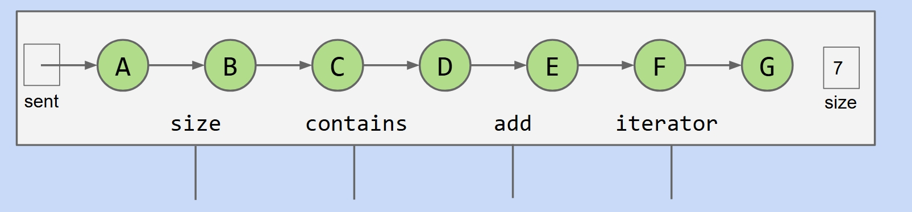

We still need to traverse the linked list to find the target, and the time complexity is still `O(N)`.

How do we improve? Simple idea, we move the entry pointer to the middle of the list.

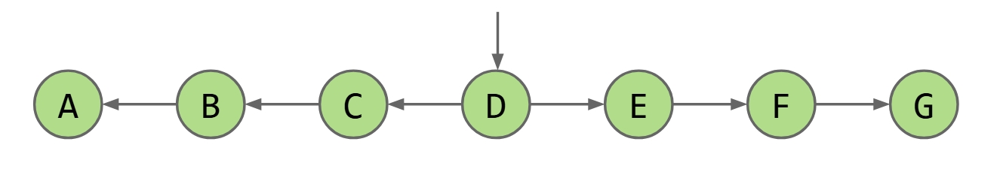

Now, we halve the search time!

Well, since we have set out, let's not stop here. Now we just need to decide the target is in the left or right part. Then why not move the two pointers of the middle one to the middle of the left and right part? We can halve the search time of each part!

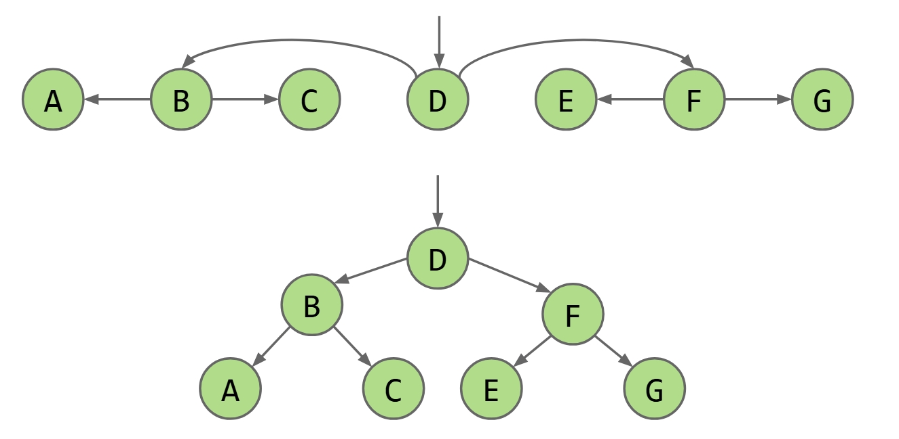

Do this repeat and repeat, you get trees. I think you may be not that stupid, you can understand and no need to show you more moves.

So that's why we care tree shits.

What we are going to nail today, Binary Search Tree(BST), is the basic idea behind the TreeSet and TreeMap.

## Definitions: What is all these shits?

### Trees

A tree consists of:

- A set of nodes.

- A set of edges that connect those nodes.

These are obvious. But the most important is this constraint:

There is **exactly one path between any two nodes**.

See this pic if not clear.

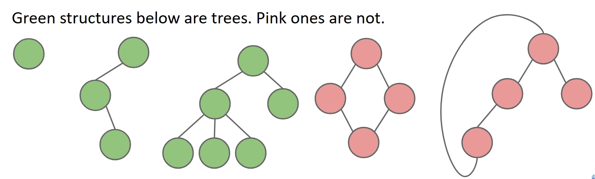

### Rooted Trees

In the motivation part we talk about the entry pointer thing. For that, we may need the tree to have a root.

A rooted tree is just a tree which we name one node as the root. And we have these concepts(or tips):

- Every node N except the root has exactly one **parent**, defined as the first node on the path from N to the root.

- Unlike (most) real trees, the root is usually depicted at the **top** of the tree.

- A node with no child is called a **leaf**.

### Rooted Binary Trees

In the motivation part we also talk about the halve the search time thing. For that, we need the tree to be binary.

In a rooted binare tree, every node has either 0, 1, or 2 children, or at some place we call it subtrees.

See this pic if not clear.

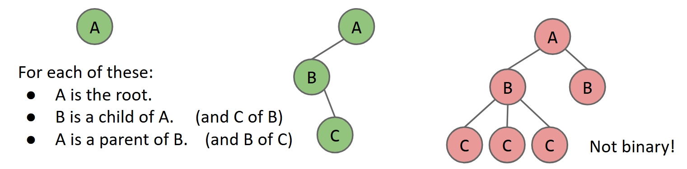

### Binary Search Trees(BSTs)

Besides the pointer and halve shits, the most important thing we talked about in the motivation for the search is the order, remember? To make the rooted binary trees, what we have so far, ordered, we need this `BST Property`. In other words, Binary Search Trees are rooted binary trees that satisfy the `BST Property`.

**BST Property**:

For every node X in the tree:

- Every key in the left subtree is less than X’s key.

- Every key in the right subtree is greater than X’s key.

See this pic if not clear.

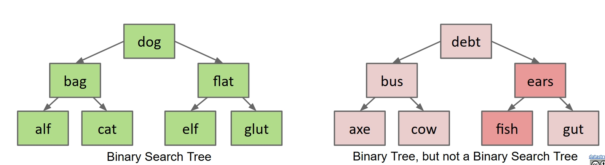

They have some math nerd shits about the order, basically like this:

Ordering must be **complete**, **transitive**, and **antisymmetric**. Given keys p and q:

- Exactly one of p ≺ q and q ≺ p are true.

- p ≺ q and q ≺ r imply p ≺ r.

But for most of the time, it just means **no repeated keys**.

## Operations: Let's these shits rock your world!

### Search

Search! This is what we do.

I think the algorithm is quite intuitive, just a simple recursion:

- If searchKey equals T.key, return.

- If searchKey ≺ T.key, search T.left.

- If searchKey ≻ T.key, search T.right.

You may want this Java code:

```java
static BST find(BST T, Key sk) {
   if (T == null)
      return null;
   if (sk.equals(T.key))
      return T;
   else if (sk ≺ T.key)
      return find(T.left, sk);
   else
      return find(T.right, sk);
}

```

I think for the simple data structure like this, we have done our best. Let's see its performance.

If the tree is 'bushy', or we may say balanced, like this pic below:

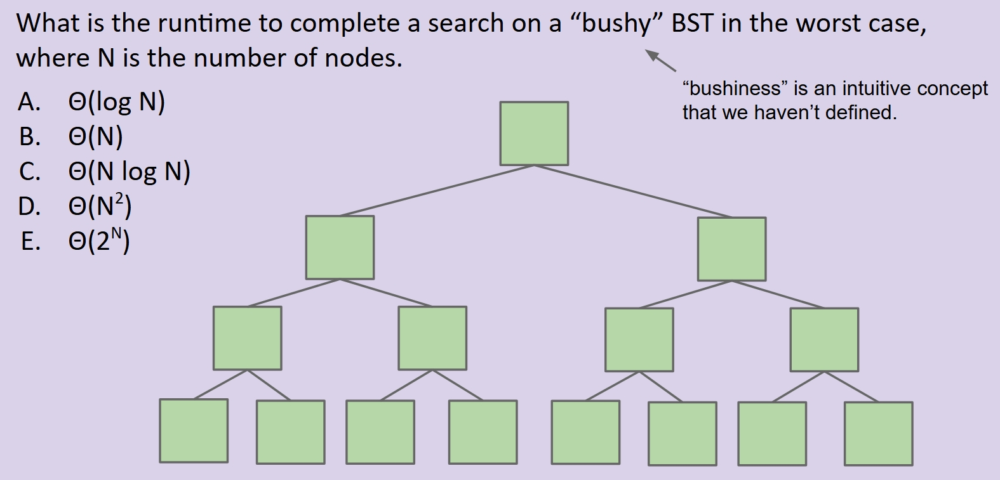

I think even you can tell that the number of search it need to do is exactly the height of the tree, which is $\log_2 N$.

So the time complexity is $\theta(\log N)$. It is basically extremely fast, though not constant.

### Insert

Sometimes we want to put some new shits into the tree. Since it's ordered, it is pretty tricky to do so.

For the no repeat rule, we must search first, if exists, just do nothing. If not, we can create a new node and insert it into the tree. The tricky part is to find this specific place to insert so that the BST Property is still satisfied.

How to find this specific place? We obviously need to do some recursion again. Compare the new key with the current key, if it is less, go left, if it is greater, go right. Once we find the way to go is empty, we know this is the place to insert.

The Java code is like this:

```java
static BST insert(BST T, Key ik) {
  if (T == null)
    return new BST(ik);
  if (ik ≺ T.key)
    T.left = insert(T.left, ik);
  else if (ik ≻ T.key)
    T.right = insert(T.right, ik);
  return T;
}
```

### Delete

Those upper two, though require some recursion, have pretty simple situations. But for the delete, it is a little bit complicated.

If you start using you little brain that has like 10% of my intelligence, which is quite impressive for human kind, you can easily find out that we need to deal with three situations:

- Deletion key has no children.

- Deletion key has one child.

- Deletion key has two children.

Let's nail them one by one.

#### Case 1: Deletion key has no children.

Can't be simpler, just break the link between the node and its parent. Java would know it's garbage and throw it away.

#### Case 2: Deletion key has one child.

Even you can see that if it is larger than its parent, then so does its child. And if it is smaller, then so does its child.

Once you see my point, you know what to do. Just set the parent's child to the child. The BST Property is still satisfied for what we have discussed above.

#### Case 3: Deletion key has two children.

Now this is the tricky part, the game is on!

To keep things simple, just consider deleting the root. If it's two children but not root, just see it as root of its own little subtree.

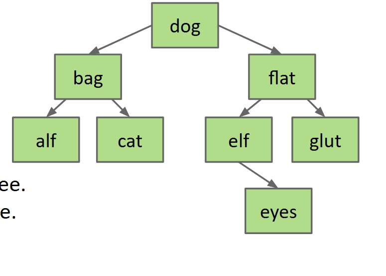

We need to delete the `dog` node in the pic above. Obviously, we need to find a node to replace it.

Would `bag` work? Certainly not, it has a child `cat` that is larger than it.

So it's quite clear that we can only use either the largest of the left subtree or the smallest of the right subtree. Actually, both of them are qualified.

See this pic if not clear.

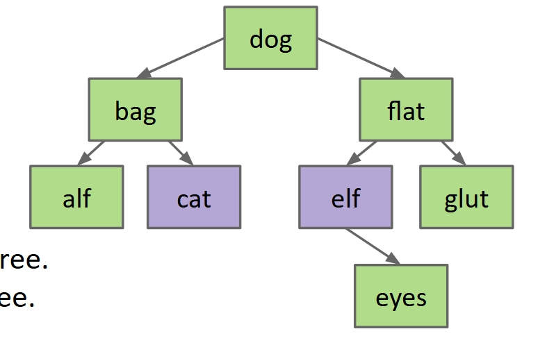

Say we use `cat` to replace `dog`, then we can just delete `cat` and put a copy of it at the position of root. Then we have solveed the problem, because deleting `cat` is definitely a case 1 or 2, and we have already nailed them.

Why guarantee case 1 or 2? I know you can never figure it out by yourself. You see, if it is a case 3, that `cat` has two children, then it's definitely not the largest of the left subtree. Because it got a right child that is larger than it. Same logic for the smallest of the right subtree.

People call this **Hibbard Deletion**, I guess it is named after some random guy who did not invent this.

Here is a gif of another usage example, may help you understand.

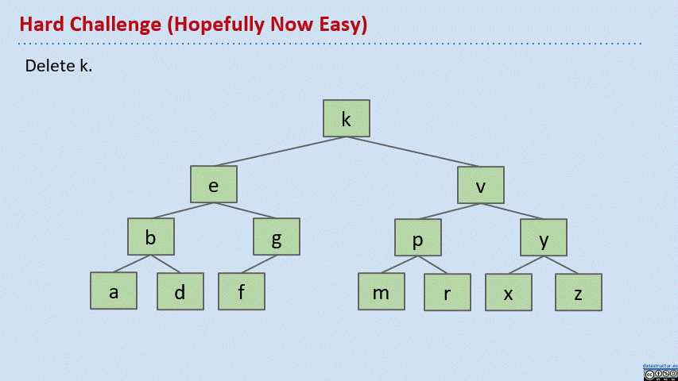

## Implementation

As we said in the motivation part, we can do these two shits with BST, which is Sets and Maps.

See this two slides for the difference.

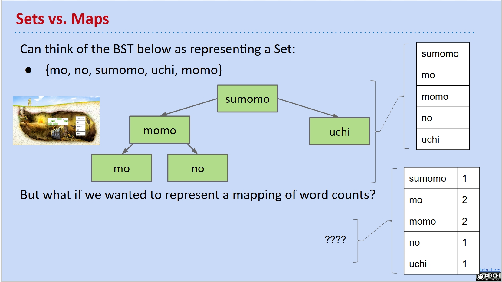

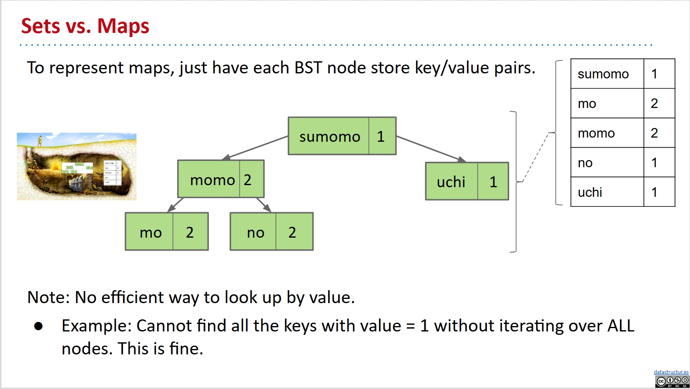

And I have this Java implementation of BSTMap for you. I do it for the [CS61B BSTMap Lab](https://sp21.datastructur.es/materials/lab/lab7/lab7).

```java
package bstmap;

import java.util.Iterator;
import java.util.Set;
import java.util.TreeSet;

public class BSTMap<K extends Comparable<K>, V> implements Map61B<K,V> {

    private int size = 0;
    private BSTNode root;

    private class BSTNode {
        private K key;
        private V value;
        private BSTNode left, right;
        private BSTNode parent;
    }

    public BSTMap() {
        root = new BSTNode();
    }

    @Override
    public void clear() {
        size = 0;
        root = new BSTNode();
    }

    @Override
    public boolean containsKey(K key) {
        return isNodeKey(key, root);
    }

    private boolean isNodeKey(K key, BSTNode node) {
        if (node == null || node.key == null) {
            return false;
        }
        int cmp = key.compareTo(node.key);
        if (cmp < 0) {
            return isNodeKey(key, node.left);
        } else if (cmp > 0) {
            return isNodeKey(key, node.right);
        } else {
            return true;
        }
    }

    @Override
    public V get(K key) {
        return getNodeVal(key, root);
    }

    private V getNodeVal(K key, BSTNode node) {
        if (node == null || node.key == null) {
            return null;
        }
        int cmp = key.compareTo(node.key);
        if (cmp < 0) {
            return getNodeVal(key, node.left);
        } else if (cmp > 0) {
            return getNodeVal(key, node.right);
        } else {
            return node.value;
        }
    }

    @Override
    public int size() {
        return size;
    }

    @Override
    public void put(K key, V value) {
        if (root.key == null) {
            root.key = key;
            root.value = value;
            size++;
            return;
        }
        put(key, value, root);
    }

    private void put(K key, V value, BSTNode node) {
        int cmp = key.compareTo(node.key);
        if (cmp < 0) {
            if (node.left == null) {
                BSTNode newNode = new BSTNode();
                newNode.key = key;
                newNode.value = value;
                node.left = newNode;
                newNode.parent = node;
                size++;
            } else {
                put(key, value, node.left);
            }
        } else if (cmp > 0) {
            if (node.right == null) {
                BSTNode newNode = new BSTNode();
                newNode.key = key;
                newNode.value = value;
                node.right = newNode;
                newNode.parent = node;
                size++;
            } else {
                put(key, value, node.right);
            }
        } else {
            node.value = value;
        }
    }

    public void printInOrder() {
        printInOrder(root);
    }

    private void printInOrder(BSTNode node) {
        if (node == null || node.key == null) {
            return;
        }
        printInOrder(node.left);
        System.out.println(node.key + ": " + node.value);
        printInOrder(node.right);
    }

    @Override
    public Set<K> keySet() {
        Set<K> keys = new TreeSet<>();
        keySetHelper(root, keys);
        return keys;
    }

    private void keySetHelper(BSTNode node, Set<K> keys) {
        if (node == null || node.key == null) {
            return;
        }
        keySetHelper(node.left, keys);
        keys.add(node.key);
        keySetHelper(node.right, keys);
    }

    @Override
    public V remove(K key) {
        BSTNode nodeToRemove = findNode(key, root);
        if (nodeToRemove == null) {
            return null;
        }
        V removedValue = nodeToRemove.value;
        deleteNode(nodeToRemove);
        size--;
        return removedValue;
    }

    @Override
    public V remove(K key, V value) {
        BSTNode nodeToRemove = findNode(key, root);
        if (nodeToRemove == null) {
            return null;
        }
        if (nodeToRemove.value.equals(value)) {
            return remove(key);
        }
        return null;
    }

    private BSTNode findNode(K key, BSTNode node) {
        if (node == null || node.key == null) {
            return null;
        }
        int cmp = key.compareTo(node.key);
        if (cmp < 0) {
            return findNode(key, node.left);
        } else if (cmp > 0) {
            return findNode(key, node.right);
        } else {
            return node;
        }
    }

    private void deleteNode(BSTNode p) {
        if (p.left != null && p.right != null) {
            BSTNode successor = min(p.right);
            p.key = successor.key;
            p.value = successor.value;
            deleteNode(successor);
            return;
        }

        BSTNode child = (p.left != null) ? p.left : p.right;

        if (p.parent == null) {
            if (child != null) {
                root = child;
                child.parent = null;
            } else {
                root.key = null;
                root.value = null;
            }
        } else {
            if (p == p.parent.left) {
                p.parent.left = child;
            } else {
                p.parent.right = child;
            }
            if (child != null) {
                child.parent = p.parent;
            }
        }
    }

    private BSTNode min(BSTNode node) {
        if (node.left == null) {
            return node;
        }
        return min(node.left);
    }

    @Override
    public Iterator<K> iterator() {
        return keySet().iterator();
    }
}
```
