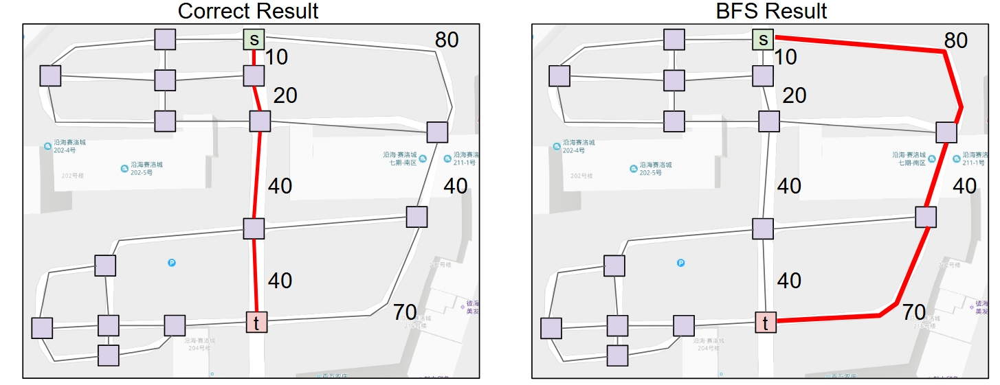
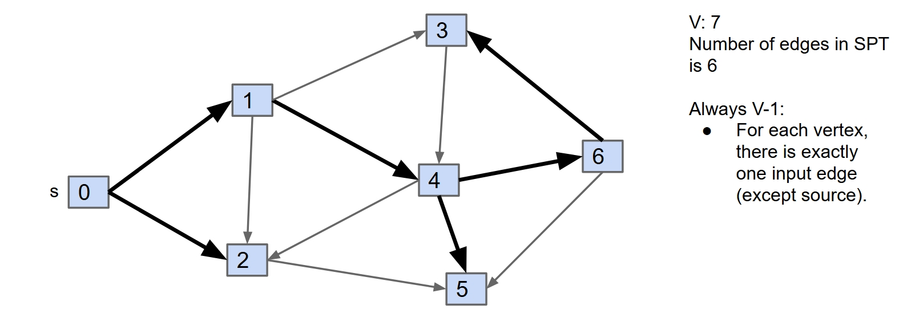
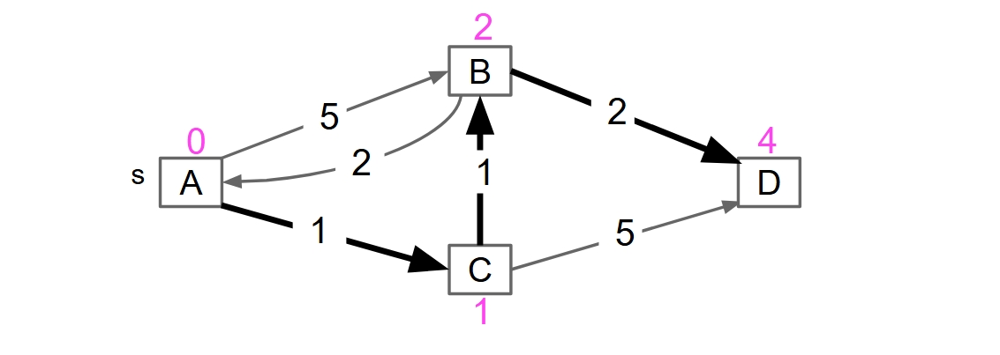
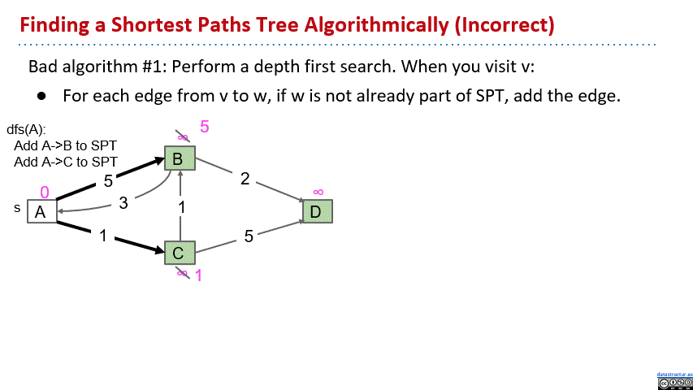
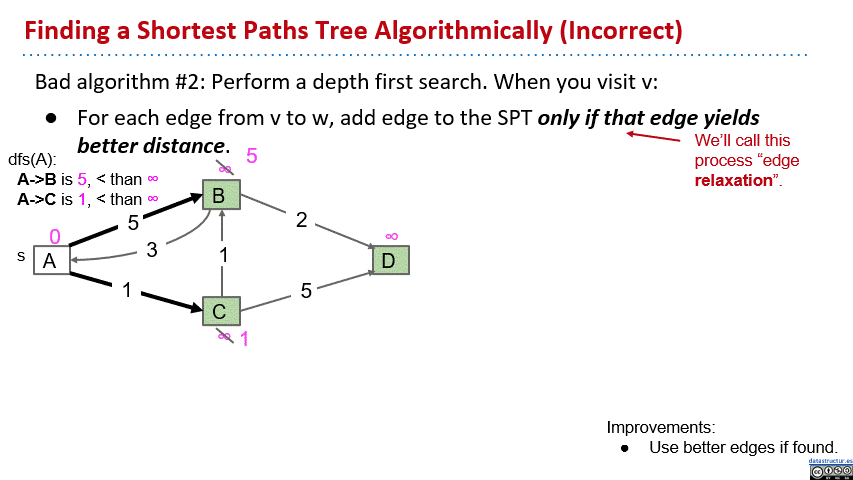
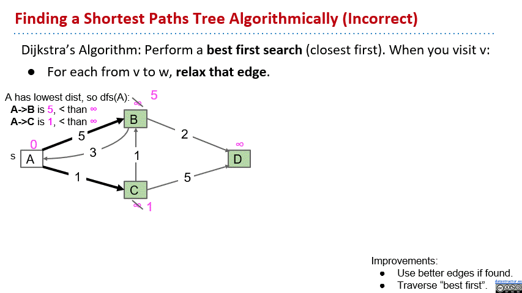
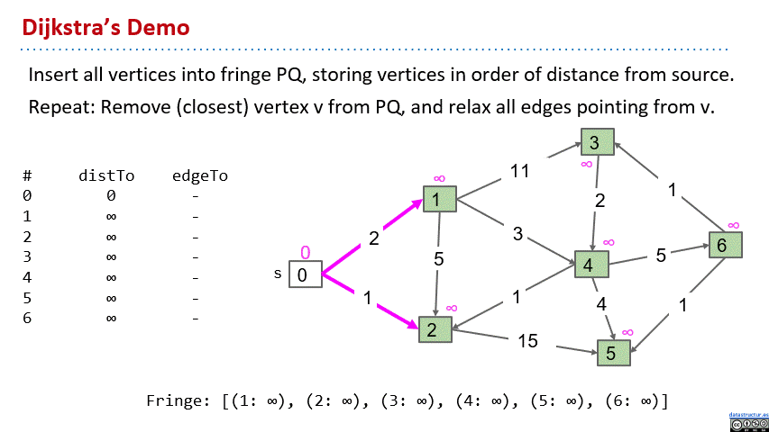
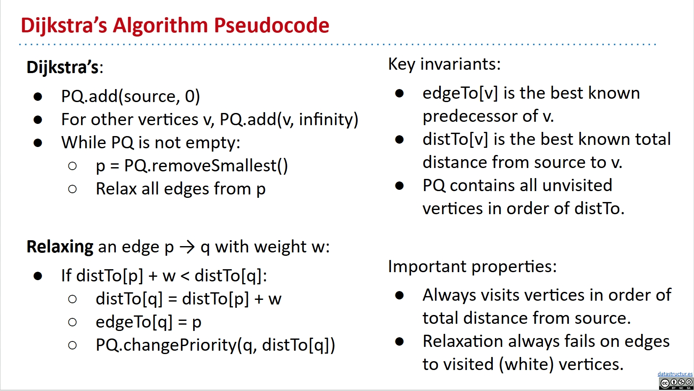
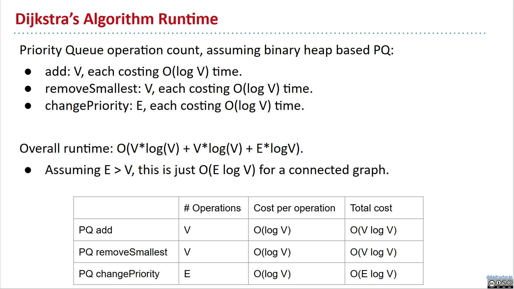

# Dijkstra's Algorithm

I write this note mainly based on this slide from UCB CS61B:

[Lec23](https://docs.google.com/presentation/d/1_x9UraVHfARN3aVX--yMZ3TSx6oW21lzGcqzQxzcoHU/edit?usp=sharing)

Pictures in the note are all from the slide.

## Motivation: The Google Map

So we know the DFS and BFS, is any of them better than the other? Well, for path finding problems, both of them can get the correct anwsers, and they have similar time efficiency. For the space efficiency, if the graph is spindly, the DFS would be worse, but if it's bushy, the BFS would be worse. The worse case performances are quite similar anyway. But BFS win for one single thing: it finds the path that guarantees to be the shortest. This is very important.

Why bother talking about the graphs shits? Find the shortest path, find path between two destinations, people know we are talking about the Google Map. Maybe you can use these shits for some other stuffs, but definitely need to use for the Google Map.

But is BFS good enough for the Google Map? Well, it's not. It is only when all the edges have the same length. But this is just insane.

The BFS always returns the path with the shortest number of edges.

See this pic below if not clear:

What we need know is an algorithm that can take into account the edge distances, also known as the edge weights.

## Dijkstra's Algorithm

Little observation: To find all the shortest paths from a source node to all the other nodes in a connected edge-weighted graph, the anwser will always be a tree.

See this pic below if not clear:

If there are v vertices, there will be v-1 edges in the tree. Because there is always exactly one input edge for each vertex.

Our goal is a algorithm to find this tree, we call it **SPT(Shorest Path Tree)**.

For convenience, we add a annotation on top of each vertex to show the total distance from the source vertex.

See this pic below if not clear:

Let's invent this algorithm with this example graph above, and the solution is already on it.

We first set all the annotations to infinity.

Then we start with a very naive approach: We just do depth first paths anyway. For each edge from v to w, if w is not already part of SPT, add the edge.

See this gif below if not clear:

You can see that we didn't get the correct tree. because we didn't take into account the edge weights.

To take into account the edge weights, we add edge to the SPT **only if that edge yields better distance** than the one in the annotation. This is what people call the **edge relaxation**.

See this gif below if not clear:

We still didn't get the correct tree. Because though we already use better edges, but we still use the order of depth first search to visit the vertices.

So we have this Dijkstra's algorithm: Perform a best first search, where the best actually means closest. We always visit the closest vertex first.

See this gif below if not clear:

The implementation is quite similar to the BFS, using the queue. Insert all vertices into fringe PQ, storing vertices in order of distance from source. Remove (closest) vertex v from PQ, and relax all edges pointing from v, repeat this process until the PQ is empty.

See this gif for a dijkstra's algorithm demo:

Dijkstra’s is guaranteed to return a correct result if all edges are non-negative.

See this pic below for a pesudocode of the Dijkstra's algorithm:

## Performance

See this pic for Dijkstra's algorithm runtime:

