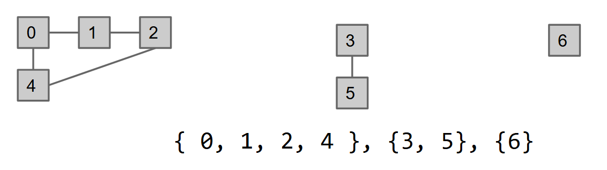
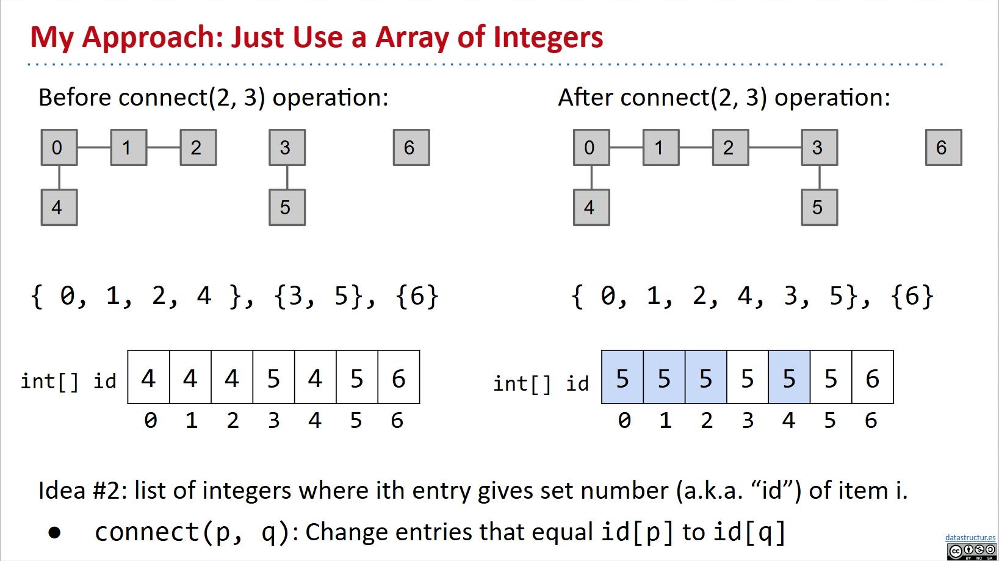
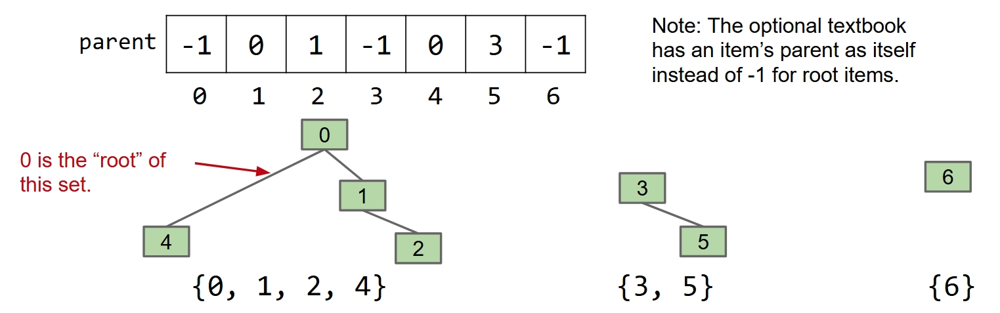
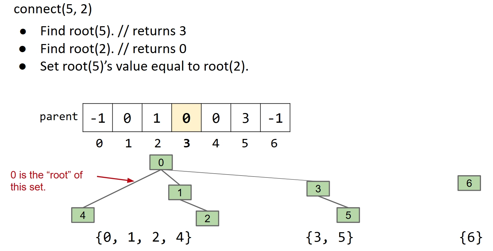
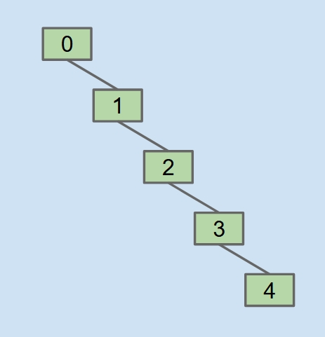
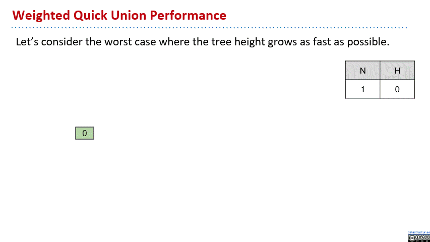

# Disjoint Sets

I write this note based on the following slides from UCB CS61B:

[Lec14](https://docs.google.com/presentation/d/1I9Jzt95GvxRqwGMzN7DSEIREKhMZ0qEUzPyWLl6CU5g/edit?slide=id.g5347e2c8f_210#slide=id.g5347e2c8f_210)

## Motivation: Dynamic Connectivity Problem

Consider this, sometimes we may need to keep track of a lot of individuals on whether or not they are connected through bloodline.

This can be tricky. You know sometimes I confuse about the relationship between my parents, obvously they were connected through bloodline by me. Then why this don't count as consanguine marriage?

Just kidding, but you see that my parents are not directly connected, but they are still connected. This is the tricky part, you don't know the path, but you must find a way to check if two individuals are connected.

For such demands in the real world, we abstract this Dynamic Connectivity Problem out. Let's define it.

Oh! To keep things simple, we’re going to:

- Force all items to be integers instead of arbitrary data.
- Declare the number of items in advance, everything is disconnected at start.


**The Dynamic Connectivity Problem:**

To develop a data type, which is the **Disjoint Sets**, that support the following operations on a fixed number N of objects:

- **connect(int p, int q)** (called **union** in some other places): Connects p and q.
- **isConnected(int p, int q)** (called **connected** in some other places): Returns true if p and q are connected. Connections can be transitive, i.e. they don’t need to be direct.

We do not care about finding the actual path between p and q. We care only about their connectedness.

Further more, I think it would be helpful to let you realize that saying objects connected is just like saying they are in the same bucket. Once you connect a outside object to one of the objects in the bucket, it's like throw it into the bucket and it connected to everything in the bucket suddenly. And if you connect two objects in two different buckets, it's like pouring the two buckets into one.

Some math nerds would say words like equivalence relation, equivalence class and blablabla to describe this but they are just showing their fancy words off, you are okay with the buckets.

Anyways, the topic today is about how to implement this Disjoint Sets efficiently solving the Dynamic Connectivity Problem.

The interface in java is like this:

```java
/**
 * Goal: Design an efficient DisjointSets implementation.
 * Number of elements N can be huge.
 * Number of method calls M can be huge.
 * Calls to methods may be interspersed (e.g. can’t assume it’s onlu connect operations followed by only isConnected operations).
 */
public interface DisjointSets {
	/** Connects two items P and Q. */
	void connect(int p, int q);

	/** Checks to see if two items are connected. */
	boolean isConnected(int p, int q);
}
```

## Initial thinking: the Connected Components

I, of course, know how to do this right. However, for innocents like you, start from the most naive approach is a must.

Naturally, we will think of just recording every single connecting line into some data structure whenever connect two objects. Then, we use some sort of algorithm to go through the whole data structure to check if two objects are connected.

You don't even need to try to know this is extremely stupid and the no matter what it is algorithm is going to be super complicated. So let's keep thinking.

The better approach is to use the buckets idea that we just mentioned, or in fancy words, the **Connected Components**. Rather than recording every single connecting line, just remembering which bucket each object belongs to is so simple and smart.

See this pic if not clear, from the mentioned slide.



So now we have turned the goal problem into a more specific one, which is how to remember which bucket each object belongs to and make it easy to use. Or we can say, how to track the connected component of each object efficiently.

## Implementation: Step by step

### ListOfSetsDS: Never Believe your Intuition

Now we have this goal to find a good data structure to track the connected component of each object. Intuitively, the bucket will make us think of set in real world java.

So here comes the first shot, ListOfSetsDS, which means we use a list of sets of integers, to be specific in Java,

```java
List<Set<Integer>>
```

Easy and clear, right? Of course, it's probably the only that person with your intelligence can come up with. That's why we call it intuitive.

However, it can't be the right one, or clever people like me will be useless. Let's see its performance.

Basically, you want to find anything, you iterate the whole thing, complicated and slow.

For constructor, the runtime has order of growth N no matter what.

For connect, you iterate, and combine two sets, the worst case would be N but some may be better.

For isConnected, it is similar, the worst case is N.

So here is the table of performance.

| implementation | constructor | connect | isConnected |
| -------------- | ----------- | ------- | ----------- |
| ListOfSetsDS   | $\theta(N)$ | $O(N)$  | $O(N)$      |

Later, you would see that this is almost the worst performance amoung all the implementations.

### Try with Map: Better isConnected

You may also consider this,

```java
Map<Integer, Integer>
```

since we were talking about tracking something of each something.

What about the first number represents set and second represents item?

Things won't be better, you have to iterate to see which set something belongs to.

Then we consider the first number represents the item, and the second is the set number.

Now it's pretty obvious that the isConnected would be extremely good, you just check two items and see if the map lead you to the same set. So the runtime is constant, or say $O(1)$, if the map is good.

However, the connect operation is still $O(N)$ because you have to iterate through the whole map to union two sets.

So here is the table of performance.

| implementation | constructor | connect | isConnected |
| -------------- | ----------- | ------- | ----------- |
| ListOfSetsDS   | $\theta(N)$ | $O(N)$  | $O(N)$      |
| MapDS   | $\theta(N)$ | $O(N)$  | $O(1)$      |

So now we got pretty good isConnected, very bad other stuffs. But before we try to improve the other stuffs, let's walk one step forward on isConnected.

### QuickFindDS: Guaranteed Good isConnected

MapDS is good, but it's not good enough. You see I said it's $O(1)$ for the access, but it's actually just an average when we use the map. The reason is complicated, later we will see deep into the map implementation, hashing and some shits.

My point is, we can make it guaranteed $O(1)$ for the access, by using Array! Just let the index be the key, which is the number representing the item. We do this list of integers where ith entry gives set number (a.k.a. “id”) of item i, and then the access will be almost guaranteed $O(1)$.

See this pic of slide if not clear.



And since now we first get to a classical implementation, I will give you some Java code.

```java
public class QuickFindDS implements DisjointSets {
	private int[] id;

	public QuickFindDS(int N) {
		id = new int[N];
		for (int i = 0; i < N; i++)
			id[i] = i;
		}
	}    

 
	public boolean isConnected(int p, int q) {
    	return id[p] == id[q];
	}
 
	public void connect(int p, int q) {
    	int pid = id[p];
        int qid = id[q];
       	for (int i = 0; i < id.length; i++) {
            if (id[i] == pid) {
              	id[i] = qid;
            }
    	}
	}
}
```

And the performance table now we achieve is like this:

| implementation | constructor | connect | isConnected |
| -------------- | ----------- | ------- | ----------- |
| ListOfSetsDS   | $\theta(N)$ | $O(N)$  | $O(N)$      |
| QuickFindDS   | $\theta(N)$ | $\theta(N)$  | $\theta(1)$      |

Then we can start working on improving the Connect.

### QuickUnionDS: Make it a tree

The reason why Connect is so slow in QuickFindDS is that it must change the value of connected components one by one to implement the action of pouring one bucket into another. So I guess this is where we need to make a difference.

It would be ideal enough if we can do this action by just changing one single value. And the approach is to make it a TREE.

Easy enough for even you to understand, want to turn two trees into one, only need to make one another's branch, no need to worry about every single leaves.

For these items, we still have the array whose index represents them, but the value's meaning is changed to represent the parent item. Every item got a parent, go and go until the root, for that just set the parent value to itself or -1 or whatever.

See this pic if not clear.



Then how do we do the Connect action? Well, we will have this root(x) method which finds the root item of item x.

When we do thing like Connect(5, 2), we set the value of root(5), which is 3, to a item in 2's tree, like 2 itself or root(2) which is 0.

See this pic if not clear.



The Java code is here, in which find(x) is what we just called root(x).

```java
public class QuickUnionDS implements DisjointSets {
	private int[] parent;
	public QuickUnionDS(int N) {
    	    parent = new int[N];
    	    for (int i = 0; i < N; i++) 
        	  {  parent[i] = -1; }
   	}
 
  	private int find(int p) {
    	    int r = p;
        while (parent[r] >= 0) 
        	  { r = parent[r]; }
       	return r;
    }

	public boolean isConnected(int p, int q) {
		return find(p) == find(q);
	}
	
	public void Connect(int p, int q) {
		int i = find(p);
		int j = find(q);
		parent[i] = j;
	}
}
```

Ok! Now we do connect by changing only one value! The runtime would be constant, happy ending!

But is it? Don't forget the root(x) method takes time! It still need to climb up the tree to find the root, potential trouble maker. If the tree being really tall, the worse case could be really bad.

Like we do these moves:
connect(4, 3)
connect(3, 2)
connect(2, 1)
connect(1, 0)

Then we get such a tall tree like this:



In this worst case, both Connect and isConnected takes $\theta(N)$ time, for they must climb up the whole tree. So the performance can be even worse than QuickFindDS.

The table of performance:

| implementation | constructor | connect | isConnected |
| -------------- | ----------- | ------- | ----------- |
| ListOfSetsDS   | $\theta(N)$ | $O(N)$  | $O(N)$      |
| QuickFindDS   | $\theta(N)$ | $\theta(N)$  | $\theta(1)$      |
| QuickUnionDS   | $\theta(N)$ | $O(N)$  | $O(N)$      |

But you can see if the tree is balanced, the performance would be pretty cool. So now we turn the core problem to the approach of keeping the tree balanced.

### WeightedQuickUnionDS: Balance done right

You just saw we always connect the first item’s tree below the second item’s tree, we can end up with a tree of height M after M operations. So natural thought, we can dynamicly decide set which root's parent to which by consider real time observation, like which tree have more items, always link root of smaller tree to larger tree.

To do so, we must find a way to track the trees' size, which is easy as hell. We can either maintain a seperate size array or just set the root items' parent value to that tree's size.

Let's see the worst case of height growth in the below gif.



In the worst case, now the Height = $\theta (\log N)$ rather than $\theta (N)$ in QuickUnionDS, so the performance of both Connect and isConnect now are $O(\log N)$.

The Java code is here:

```java
public class WeightedQuickUnionDS implements DisjointSets {
    private int[] parent; // parent[i] = parent of i
    private int[] size;   // size[i] = number of elements in subtree rooted at i

    /**
     * Initializes an empty disjoint sets data structure with N sites
     * 0 through N-1. Each site is initially in its own component.
     *
     * @param N the number of sites
     */
    public WeightedQuickUnionDS(int N) {
        parent = new int[N];
        size = new int[N];
        for (int i = 0; i < N; i++) {
            parent[i] = i; // Each site is its own root initially
            size[i] = 1;   // Each component has size 1
        }
    }

    /**
     * Returns the representative (root) of the component containing site p.
     *
     * @param  p the site to find
     * @return the representative of the component containing p
     */
    private int find(int p) {
        // Chase parent pointers until root is reached
        // (A root's parent is itself)
        while (p != parent[p]) {
            p = parent[p];
        }
        return p;
    }

    /**
     * Returns true if the two sites are in the same component.
     *
     * @param  p one site
     * @param  q the other site
     * @return true if the two sites p and q are in the same component;
     * false otherwise
     */
    @Override
    public boolean isConnected(int p, int q) {
        return find(p) == find(q);
    }

    /**
     * Merges the component containing site p with the
     * component containing site q.
     *
     * @param  p one site
     * @param  q the other site
     */
    @Override
    public void connect(int p, int q) {
        int rootP = find(p);
        int rootQ = find(q);

        if (rootP == rootQ) {
            return; // p and q are already in the same component
        }

        // Weighted union:
        // Attach smaller tree root to the larger tree root.
        if (size[rootP] < size[rootQ]) {
            parent[rootP] = rootQ;
            size[rootQ] += size[rootP];
        } else {
            parent[rootQ] = rootP;
            size[rootP] += size[rootQ];
        }
    }
}
```

The performance table:

| implementation | constructor | connect | isConnected |
| -------------- | ----------- | ------- | ----------- |
| ListOfSetsDS   | $\theta(N)$ | $O(N)$  | $O(N)$      |
| QuickFindDS   | $\theta(N)$ | $\theta(N)$  | $\theta(1)$      |
| QuickUnionDS   | $\theta(N)$ | $O(N)$  | $O(N)$      |
| WeightedQuickUnionDS   | $\theta(N)$ | $O(\log N)$  | $O(\log N)$      |

And now, it would be fast enough for most real world Dynamic Connectivity Problem.

By the way, we can also not use the Weight, which is the size of tree, but use the Height directly. And the performance of HeightedQuickUnionDS would be basically the same as WeightedQuickUnionDS. The only problem is the code implementation would be super hard that you can't make it, I can of course.

### Even better

We can actually even do better on the root(x), the idea is super easy: Every time you find root from one item, you set the parent of every item you pass by to the root item, and we can get almost constant runtime. We call this **Path Compression** and we won't go into detail since this may be too difficult for you to learn in the next, like five or six thousand years. So just go check the slide at top if interested.