# Graph: DFS and BFS

I write this note mainly based on this slide from UCB CS61B:

[Lec21](https://docs.google.com/presentation/d/1qfq21PwxzNkVyRZlir1-cN5ecI2MDpJ7uamR0tJMluE/edit?usp=sharing)
[Lec22](https://docs.google.com/presentation/d/1v5pLls6n5weicMenk_CXxNVC-9O-Uic1usRQYrdxBN0/edit?usp=sharing)

Pictures in the note are all from the slide.

## Motivation: Traversing, not Hierarchical

Let me remind me something about the tree. You should remember the tree if you have been through all those shits we used to talk about in the previous notes.

A **tree** consists of:
- A set of nodes.
- A set of edges that connect those nodes.
    - Constraint: There is exactly one path between any two nodes.

A **rooted tree** is a tree where we’ve chosen one node as the “root”.
- Every node N except the root has exactly one parent, defined as the first node on the path from N to the root.
- A node with no child is called a leaf.

We have done a lot of things with trees, such as search trees, heaps and disjoint sets. It is a very common concept, people see and use it every day. 

Sometimes we need to iterate over it, or people say, **traverse** it. Imagine you are an emperor, you have a lot of wives and children. You must have this data structure in your computer to record stuffs about them. Tree is a great choice, easy to keep track of each level of wives and who is who's child. But one day, you need to print a family list, you must find a way to traverse the tree, and must in order.

This is why people need an algorithm to traverse the tree. I am totally not lying to you.

What we use is called **Depth First Traversals**. I will use this tree in the pic below to show you.

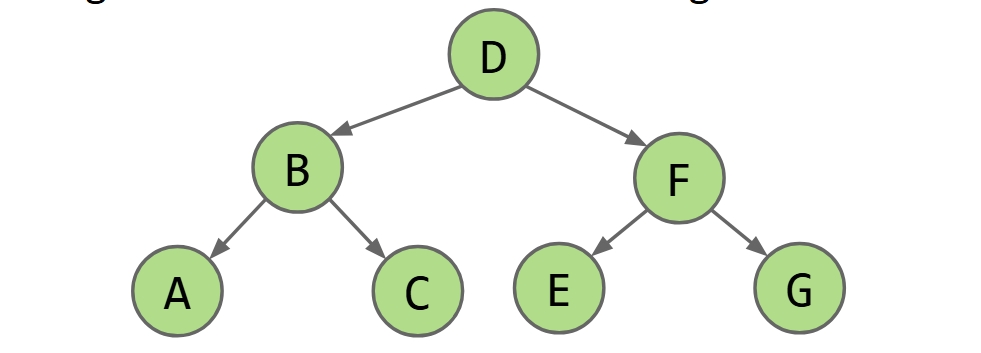

The rough idea is to traverse the deep nodes, then traverse the shallow ones. In detail, there are three ways to do this, **Preorder**, **Inorder** and **Postorder**.

The **Preorder** is that we 'visit' a node and them traverse its children. For our example, start at D, print it, then we traverse its children and print, children have children, so also visit and traverse. Get to A, there is no more children, so print, and traverse another children, do stuff like this. 

I know you are not as smart as I am to see this clearly only by words. I will give you this code for you to understand. And the print order is `D B A C F E G`, you can see the code and try imagining it to see if you get the same.

```java
preOrder(BSTNode x) {
    if (x == null) return;
    print(x.key)
    preOrder(x.left)
    preOrder(x.right)
}
```

The **Inorder** traversal is traverse the left child, then visit the node, and then the right child. For our example, the print order is `A B C D E F G`.

```java
inOrder(BSTNode x) {
    if (x == null) return;
    inOrder(x.left)
    print(x.key)
    inOrder(x.right)
}
```

The **Postorder** traversal is traverse the left child, then the right child, and then visit the node. For our example, the print order is `A C B E G F D`.

```java
postOrder(BSTNode x) {
    if (x == null) return;
    postOrder(x.left)
    postOrder(x.right)
    print(x.key)
}
```

These codes can make the computer do the stuff for you correctly. But sometimes you may need to use your very unreliable brain and eyes to do this, that may cause tragic results. To save the world from you, I have this trick for you.

You just trace a path around the graph, from the top and do counter-clockwise. 

For Preorder, visit every time we pass the **LEFT** of a node.

For Inorder, visit every time we cross the **BOTTOM** of a node.

For Postorder, visit every time we pass the **RIGHT** of a node.

See this pic below for a postorder case example:

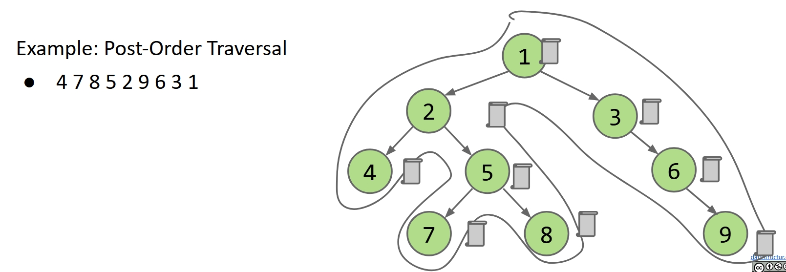

What goog are all these traversals?

Well, preorder is good for printing directory listing.See this pic below:

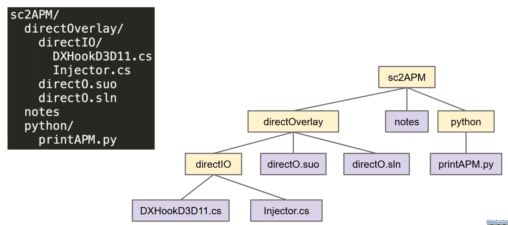

Postorder is good for gethering all the file sizes up. See this pic below:

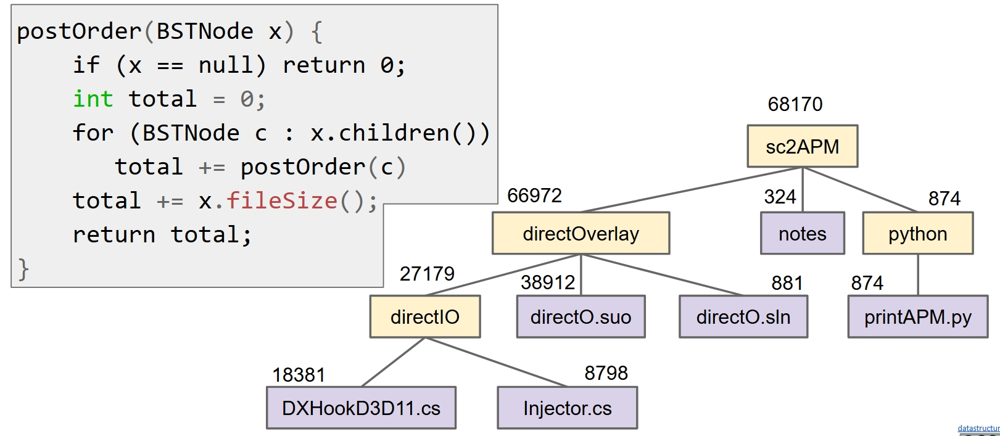

So we know about the tree traversal. But it still has some problems. The most important, trees are perfect for hierarchical data, but not everything in the real world is hierarchical, right? For example, the metro map of a city, it is not hierarchical, and it's not a tree because it probably has a lot of cycles.

This is why we need graph.

## Graph Definition

A graph consists of:
- A set of nodes.
- A set of zero or more edges, each of which connects two nodes.

I think even you can see that all the trees are graphs.

A **simple graph** is a graph with:
- No edges that connect a vertex to itself, i.e. no “loops”.
- No two edges that connect the same vertices, i.e. no “parallel edges”.

See this pic below if not clear:

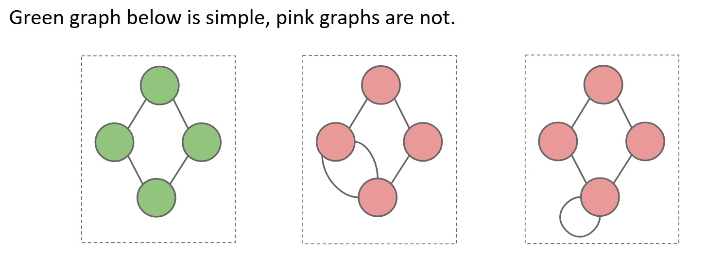

For simplicity, when we say graph, we usually mean simple graph, unless explicitly stated otherwise.

We have some terminology for graphs here:

- Graph:
    - Set of **vertices**, a.k.a. nodes.
    - Set of **edges**: Pairs of vertices.
    - Vertices with an edge between are **adjacent**.
    - Optional: Vertices or edges may have **labels** (or **weights**).
- A **path** is a sequence of vertices connected by edges.
    - A **simple path** is a path without repeated vertices.
- A **cycle** is a path whose first and last vertices are the same.
    - A graph with a cycle is **‘cyclic’**.
- Two vertices are **connected** if there is a path between them. If all vertices are connected, we say the graph is connected.
- And the edges are **directed** or **undirected**. 

See this pic below to see graph types:

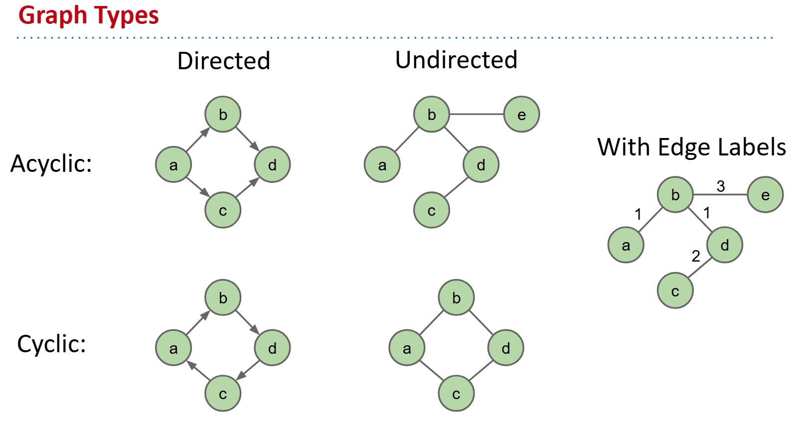

For the metro maps, of course they are connected, undirected and cyclic.

## Depth First Traversal

There are a lot of intresting problems about graph. Some well known graph problems and their common names:
- **s-t Path**. Is there a path between vertices s and t?
- **Connectivity**. Is the graph connected, i.e. is there a path between all vertices?
- **Biconnectivity**. Is there a vertex whose removal disconnects the graph?
- **Shortest s-t Path**. What is the shortest path between vertices s and t?
- **Cycle Detection**. Does the graph contain any cycles?
- **Euler Tour**. Is there a cycle that uses every edge exactly once?
- **Hamilton Tour**. Is there a cycle that uses every vertex exactly once?
- **Planarity**. Can you draw the graph on paper with no crossing edges?
- **Isomorphism**. Are two graphs isomorphic (the same graph in disguise)?

We are going to solve a classic s-t connectivity problem. Which is basically just want you to figure out if there is a path between vertices s and t.

I think even you can see that this require us to traverse the graph somehow. So that we can make connect(s, t) work.

A very obvious approach is just do this recursion. Check if `s == t`, if so, ruturn ture. Otherwise, if connect(v, t) for any neighbor v of s, return ture. Or return false.

This is a easy classic recursion, I mean those shits that even you can figure out. It certainly cause big problems. It can be easily caught in a infinity loop.

See this pic if not clear:

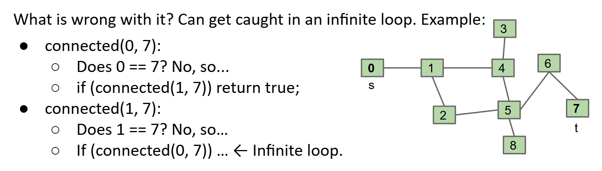

To fix this, we need to mark nodes to prevent multiple visits. So the algorithm is like this:

connected(s, t):
- Mark s.
- Does s == t? If so, return true.
- Otherwise, if connected(v, t) for any unmarked neighbor v of s, return true.
- Return false.

See this gif below for a s-t connectivity demo:

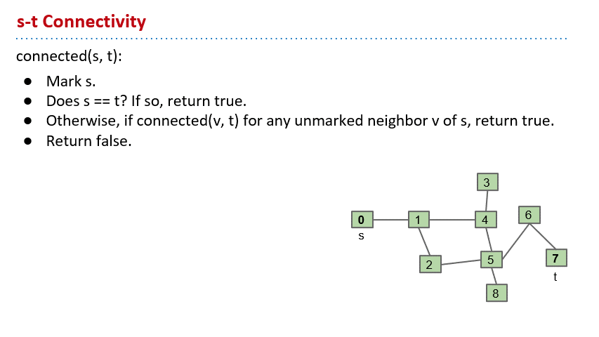

Basically, the idea is exploring one neighbor's entire subgraph before moving on to the next neighbor. It's what people call **Depth First Traversal**.

The depth first search is a very common algorithm in graph, it's powerful in many graph problems. For example, the s-t path problem, we have the Depth First Path algorithm.

dfs(v):
- Mark v.
- For each unmarked adjacent vertex w:
    - set edgeTo[w] = v. 
    - dfs(w)

See this gif below for a s-t path demo:

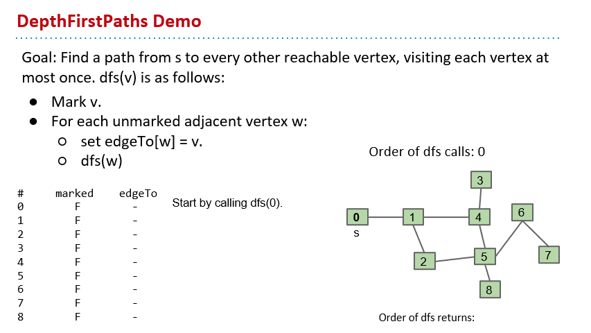

By the way, what we do here is actually DFS Preorder, we can also do DFS Postorder. The different is do you do the action before or after DFS calls to the neighbors.

## Breadth First Traversal

Here is a picture about the DFS Preorder and Postorder, and BFS of one example graph.

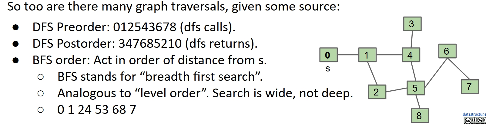

We have learnt DFS Preorder and Postorder. In this graph, DFS Preorder is `012543678`, and DFS Postorder is `347685210`.

Besides DFS, which stands for Depth First Search, we have another algorithm called **Breadth First Search**. It act in order of distance from s. Quite like 'level order'.

In the above graph, BFS is `0 1 24 53 68 7`.

We use the DFS to solve the s-t path problem, but to find the shortest path, we need to use BFS.

To do that, we need to use a data structure called **queue**.  It's a list with two operations: **removeFirst and addLast**. So clearly, first in first out. We call this queue our **fringe**.

So the Breadth First Search algorithm is like this:

We initialize the queue with the starting vertex s and mark it. 

The we do this while loop: Remove the first vertex from the front of the queue. For each of its unmarked neighbors, we mark it, edgeTo[n] = v, and distTo[n] = distTo[v] + 1 if you want to track the distance. Then add it to the end of the queue. Repeat this process until the queue is empty.

See this gif below for a BFS (BFP) demo:

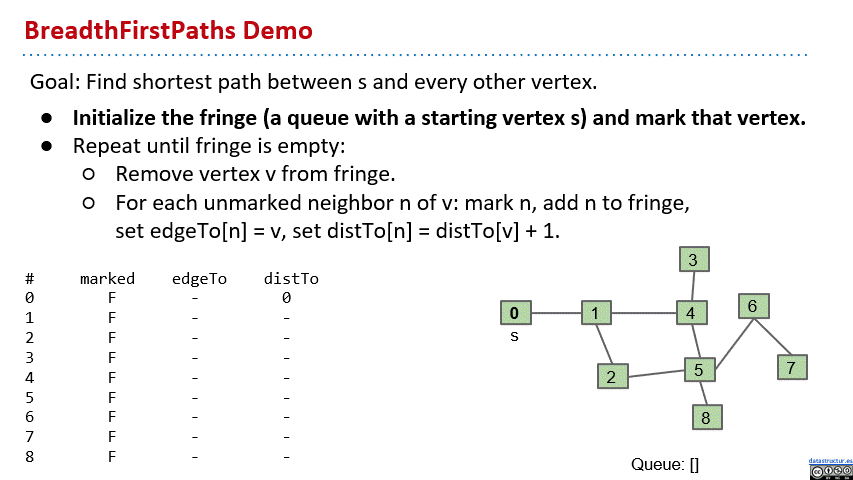

So we know the graphs and the algorithms. But how to implement them in programming languages?

## Graph API

First, of course, we need this API for graph.

It's a common choice to number it with integers, no matter what 'label' of node it is. To look up a vertex by its label, you need to use a `Map<Label, Integer>`.

See this pic below if not clear:

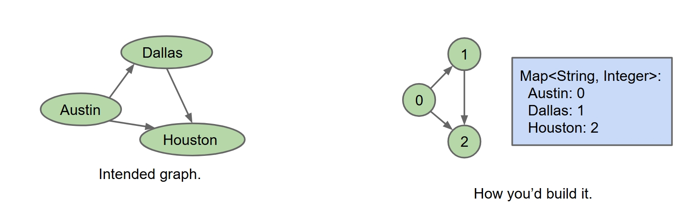

So we have the graph API roughly like this:

```java
public class Graph {
    public Graph(int V):                  Create empty graph with v vertices
    public void addEdge(int v, int w):    add an edge v-w
    Iterable<Integer> adj(int v):         vertices adjacent to v
    int V():                              number of vertices
    int E():                              number of edges
  ...
}
```

We can try to implement some methods. Like calculate the 'degree', which is the number of edges adjacent to a vertex.

```java
/** degree of vertex v in graph G */
public static int degree(Graph G, int v) {
	int degree = 0;
	for (int w : G.adj(v)) {
    	    degree += 1;
    	}
	return degree; }
```

Or we can build a method to print out the graph.

```java
public static void print(Graph G) {
	for (int v = 0; v < G.V(); v += 1) {
 	    for (int w : G.adj(v)) {
    	       System.out.println(v + “-” + w);
    	     }
    }
} 
```

Output is like:

```
$ java printDemo
0 - 1
0 - 3
1 - 0
1 - 2
2 - 1
3 - 0
```

And we need to do the implementation of DepthFirstPaths and BreadthFirstPaths. But before that, we need to see the underlying data structure.

## Graph Representation

The idea is using matrix to represent the graph, we call it **adjacency matrix**.

If there is an edge from s to t, then we set the matrix[s][t] = 1, or it's 0 if there is no edge. This is for the directed graphs, if its undirected, each edge might be represented twice and the matrix is symmetric.

See this pic below if not clear:

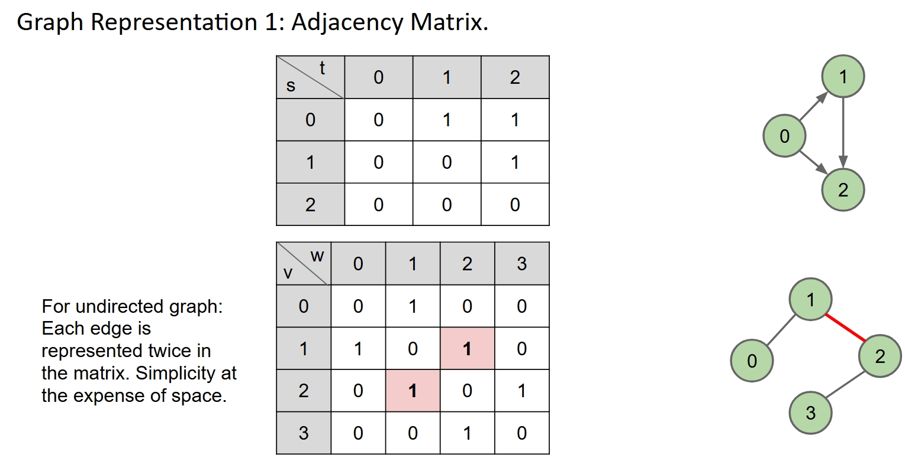

If you run G.adj(2) to the undirected graph above, it would return an iterator that can call next() through the row 2, return everytime it meets 1. So we get 1, 3.

The total runtime to iterate over all neighbors of v is $\theta (V)$.

We can also consider what the order of growth of the running time of the print client from before is if the graph uses an adjacency-matrix representation, where V is the number of vertices, and E is the total number of edges?

The total runtime is $\theta (V^2)$, since it should iterate over a whole triangle of the matrix.

Actually we have other data structures to represent the graph. Like this Edge Sets, which are the collections of all edges. A edge is a pair of ints.

This is not very common so we are not gonna talk about it in detail. But the following one is important, it's the most common one in real life.

The **adjacency list**. It's an array of lists indexed by vertex number. Each list stores neighbors of the vertex.

See this pic below if not clear:

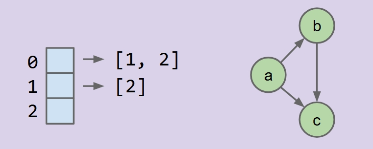

What is the order of growth of the running time of the print client if the graph uses an adjacency-list representation, where V is the number of vertices, and E is the total number of edges?

For the worst case, you have to do $\theta (V^2)$ since there are V vertices and each vertex has edges to all other vertices. For the best case, you only have to do $\theta (V)$, since the graph looks like a linked list.

But in general, for all cases, it's $\theta (V + E)$. Because you have to create V iterators and do print for E times.

Sometimes E is $\theta (V)$, $\theta ( \sqrt V)$, so the runtime is $\theta (V + E)$ is $\theta (V + V)$ or $\theta (V + \sqrt V)$, both still $\theta (V)$. But if E is $\theta (V^2)$, then the runtime is $\theta (V + V^2)$, which is $\theta (V^2)$.

See the below pic to see the comparison of some basic operations runtime for each representation:

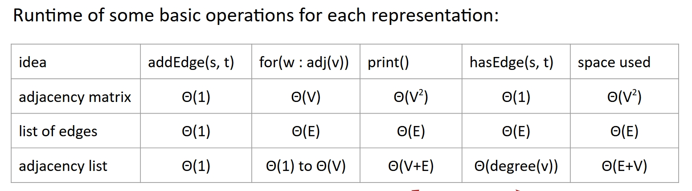

You can see adjacency list is good, especially for the adj(v), which is super important for most graph algorithms.

Here is an implementation of Graph with adjacency list:

```java
public class Graph {
	private final int V;  private List<Integer>[] adj;
	
	public Graph(int V) {
    	    this.V = V;
    	    adj = (List<Integer>[]) new ArrayList[V];
    	    for (int v = 0; v < V; v++) {
             adj[v] = new ArrayList<Integer>();
         }
	} 

	public void addEdge(int v, int w) {
         adj[v].add(w);   adj[w].add(v);
	}

	public Iterable<Integer> adj(int v) {
        return adj[v];
	}
}
```

## Graph Traversal Implementations

To implement these algorithms, the common choice is not make them methods of Graph class, but build a client class. When we use, we pass a graph object to the graph-processing method of the client class, and then query it for information.

The API would be like this:

```java
public class Paths {
    public Paths(Graph G, int s):    Find all paths from G
    boolean hasPathTo(int v):        is there a path from s to v?
    Iterable<Integer> pathTo(int v): path from s to v (if any)
}
```

See this pic below for a usage example:

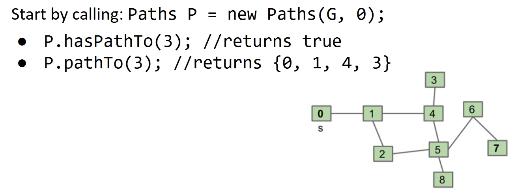

Now let's start implementing the DepthFirstPaths. First let me remind you the process with the gif demo:


First we must have an marked array of boolean, an edgeTo array of int, and a starting vertex s. So we declare these three variables in the class.

```java
public class DepthFirstPaths {
    private boolean[] marked;
    private int[] edgeTo;
    private int s;
}
```

And we need this to process the graph object:

```java
public DepthFirstPaths(Graph G, int s) {
      ...
      dfs(G, s);
  }
```

The initialization of data structures is not shown, but finally it calls the dfs method to find all the paths from s.

Then we must implement the dfs method, here is a recursive implementation:

```java
private void dfs(Graph G, int v) {
    marked[v] = true;
    for (int w : G.adj(v)) {
      if (!marked[w]) {
        edgeTo[w] = v;
        dfs(G, w);
      }        	
    } 
  }
```

You see it mark the starting vertex first, then do a for loop for all the neighbors. If it's unmarked, it do the edgeTo and call dfs with it. This is the recuision and we can finally find all paths.

Then we do the pathTo method.

```java
public Iterable<Integer> pathTo(int v) {
    if (!hasPathTo(v)) return null;
    List<Integer> path = new ArrayList<>();
    for (int x = v; x != s; x = edgeTo[x]) {
      path.add(x);
    }
    path.add(s);
    Collections.reverse(path);
    return path;
  }
```

First we check if there is a path to v with hasPathTo method, which we will do later. If there is a path, we create an array list to store the path. Then we do a for loop to add the path to the list. The iteration action is actually done by the edgeTo array. Finally we add s to the list, do a reverse, and ruturn it.

The last method to do is the hasPathTo method.

```java
public boolean hasPathTo(int v) {
    return marked[v];
}
```

Super easy, just see if v is marked or not.

The full java class is here:

```java
public class DepthFirstPaths {
    private boolean[] marked;
    private int[] edgeTo;
    private int s;
        
    public DepthFirstPaths(Graph G, int s) {
        ...
        dfs(G, s);
    }

    private void dfs(Graph G, int v) {
        marked[v] = true;
        for (int w : G.adj(v)) {
        if (!marked[w]) {
            edgeTo[w] = v;
            dfs(G, w);
        }        	
        } 
    }

    public Iterable<Integer> pathTo(int v) {
        if (!hasPathTo(v)) return null;
        List<Integer> path = new ArrayList<>();
        for (int x = v; x != s; x = edgeTo[x]) {
        path.add(x);
        }
        path.add(s);
        Collections.reverse(path);
        return path;
    }

    public boolean hasPathTo(int v) {
        return marked[v];
    }
}
```

Assume the graph uses adjacency list, let's see the runtime of the DepthFirstPaths.

First the constructor, the worst case is that the dfs method visits all vertices, each for once. And the edges can be considered at most each for twice. So the runtime is $O (V + E)$.

You might want to say that since we only go to a vertex because there is a edge to it, so the runtime should be $O (E)$. But actually, we have to consider the time to build the marked array, to give each vertex a false for start. This takes $\theta (V)$ time. So the total runtime is $O (V + E)$.

To summarize, our DepthFirstPaths implementation with graph use adjacency lists has $O (V + E)$ time complexity and $\theta (V)$ space complexity.

Now let's implement the BreadthFirstPaths.

I just show you the bfs method, the rest is not complicated or too different.

```java
public class BreadthFirstPaths {
    private boolean[] marked;
    private int[] edgeTo;
    ...
        
    private void bfs(Graph G, int s) {
        Queue<Integer> fringe = 
                new Queue<Integer>();
        fringe.enqueue(s);
        marked[s] = true;
        while (!fringe.isEmpty()) {
            int v = fringe.dequeue();
            for (int w : G.adj(v)) {
                if (!marked[w]) {
                    fringe.enqueue(w);
                    marked[w] = true;
                    edgeTo[w] = v;
                }
            }
        }
    }
}
```

So you can see we create a queue, and do the while loop as we talked about.

The runtime and space performance is the same as the DepthFirstPaths.

See this pic below if not clear:

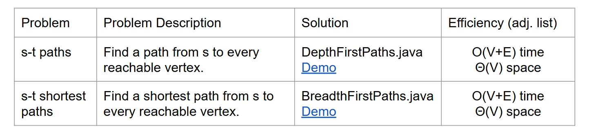

Above is based on the adjacency list representation. If you do graph with adjacency matrix, the runtime would be:

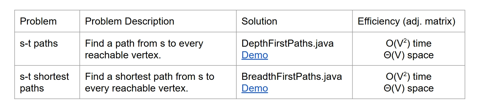

