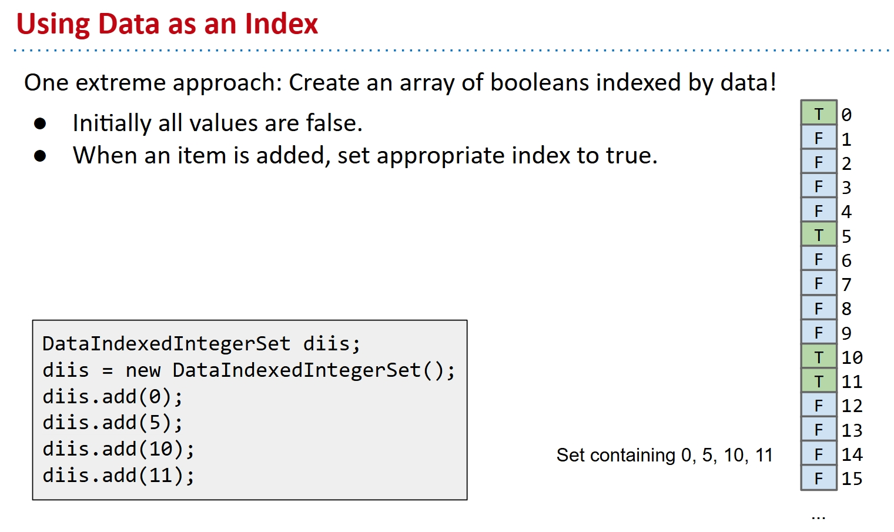
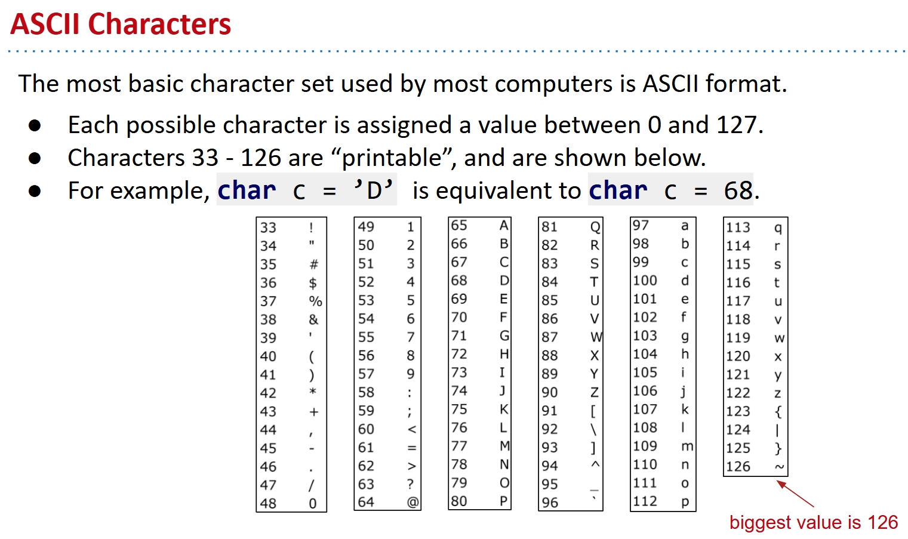
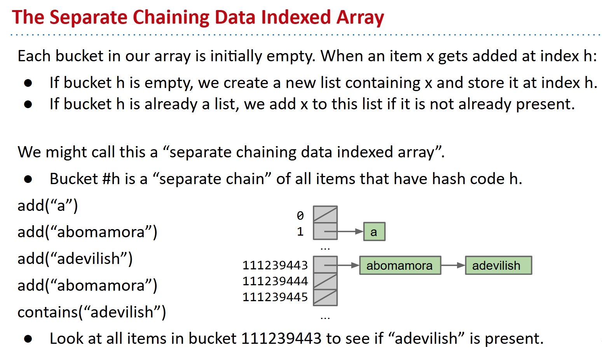
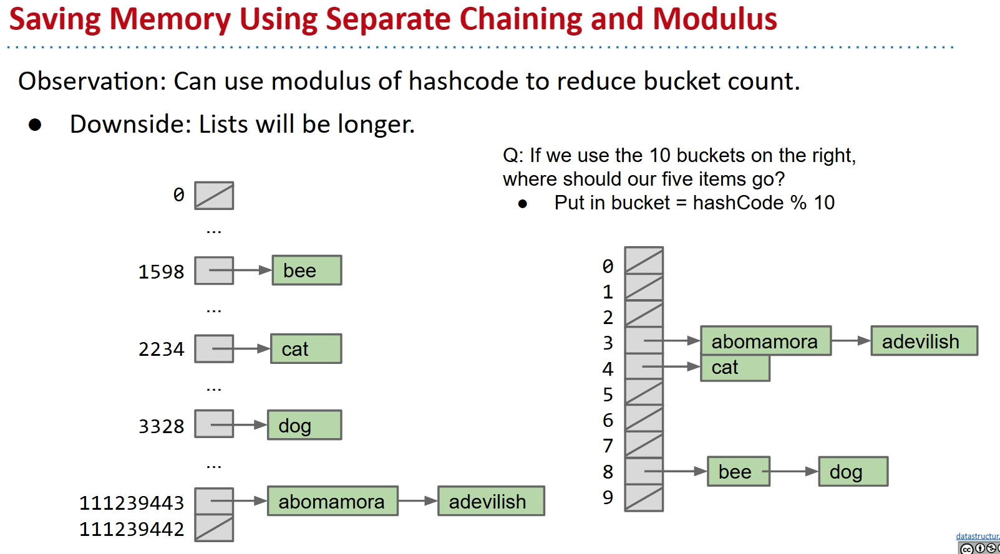
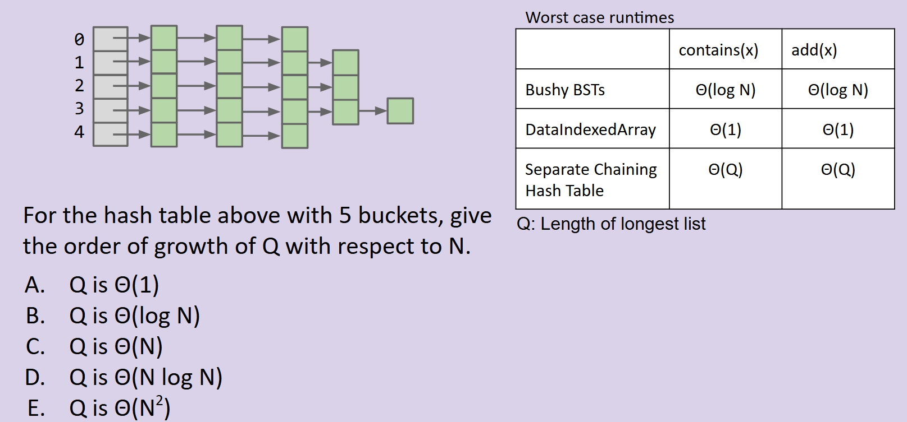
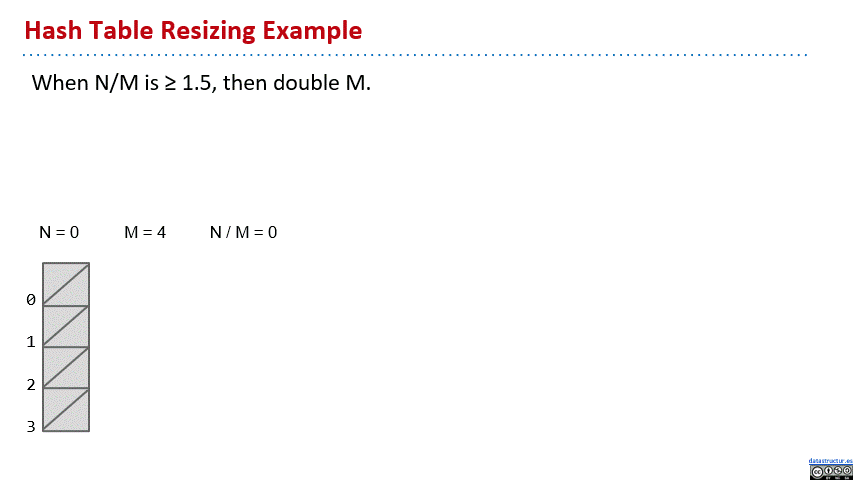

# Hashing

I write this note mainly based on this slide from UCB CS61B:

[Lec19](https://docs.google.com/presentation/d/1zflCuz_kENAP3VvurKJ0VsusEbejn5AZZIaoiNU14Xo/edit?usp=sharing)

Pictures in the note are all from the slide.

## Motivation: I am a greedy man

We talked about ADT's in a previous note, and we want implementations of ADTs like Set or Map. Now we have some, if you remember, we have ArraySet, BST, 2-3 tree and LLRB, they can all do Set and Map. And for 2-3 tree and LLRB, they can even hit $O(log N)$ performance.

Without doubt, $O(log N)$ is good, people told me if insert 1 million keys, the tree only got about 30 height. Well, of course I didn't try it myself, but people don't lie about data structures, right?

So extremely good huh? But could we do better? You know, after invented all these stuffs one by one, I am on fire now and can't stop at all. I want even $O(1)$. You heard $O(1)$ before? The constant time, the dream!

Okay, stop muttering, I heard you said good enough. You see, science make some progress, thanks to people like me who are always greedy. We always want more. You good enough people are the reason why science would die, understand?

Ah, besides that, all these stuffs require keys to be comparable, how stupid? We don't always deal with integers or strings in a modern world. Sometimes we have these audios, images, adult or not adult videos, and we also want to store them in a Set or Map.

So two goals here, brand new data structure to be the implementation of Set and Map ADTs, do a lot stuffs with constant time and allow uncomparable keys.

## Using data as an index

### DataIndexedIntegerSet

One crazy idea here to make it constant.

What about we have this very long array of initially false booleans, and we use the data as index? When we do add(someboringinteger), we can go to the box with index someboringinteger, and change the value to true.

See this pic if not clear.



Since we have this array, and we know arrays do find and insertion with constant time, so we make it.

But it got problems, obviously. You can't deal with all the integers, right? Java can only do like 2 billions, I believe, but a two billion booleans array is a huge memory waste. And you can't deal with anything besides integers, which is even further away from the goal.

No rush to quit, I see you sneaked out. Come back and I will fix it with you.

### Generalizing the idea

So we want it support all the data types. Natural idea: try to make other stuffs 'indexable'.

Let's start with strings.

Say we want to store `cat`, which boolean turnt into true? Simple approach, use the first letter, have `a` = 1, `b` = 2, `c` = 3, …, `z` = 26.

Now `cat`, so `c`, which is 3, so we change the boolean at index 3 to true.

Even you can see this is a stupid idea. When we want to store another string with first letter `c`, like `cubCuteTigerkid`, we find us fuck up. We meet this tricky collision problem. And sometimes, strings don't even start with a letter!

We must avoid this collision. I believe you have been to elementary school, though may not study well there. But you know the decimal system, this is where out spirit comes from.

In the decimal number system, we have 10 digits: 0, 1, 2, 3, 4, 5, 6, 7, 8, 9. Want numbers larger than 9? Use a sequence of digits.

Example: 7091 in base 10
$$ 7091\_{10} = (7 \times 10^3) + (0 \times 10^2) + (9 \times 10^1) + (1 \times 10^0) $$

Our system for strings is almost the same, but with letters.
$$cat_{27} = (3 \times 27^2) + (1 \times 27^1) + (20 \times 27^0) = 2234_{27}$$

Since we have only 26 letters, as long as we pick this base larger than 26, we can make every string index unique and avoid collisions so hard.

What we need is only a method like this:

```java
/** Converts ith character of String to a letter number.
   * e.g. 'a' -> 1, 'b' -> 2, 'z' -> 26 */
public static int letterNum(String s, int i) {
	int ithChar = s.charAt(i);
	if ((ithChar < 'a') || (ithChar > 'z'))
       { throw new IllegalArgumentException(); }
	return ithChar - 'a' + 1;
}

public static int englishToInt(String s) {
	int intRep = 0;
	for (int i = 0; i < s.length(); i += 1) {
       intRep = intRep * 27;
       intRep = intRep + letterNum(s, i);
	}
	return intRep;
}
```

And we can turn any English word into a number, and use it as an index.

But not all strings are English words, right? It may have some numbers, symbols or other stuffs in it, like `65$^*fnnogn((*&%jn))`.

Luckily, people do computer a few decades ago are smart, so we have this solution already, the ASCII code. The first some of them are control characters, and the rest are printable characters which are what we want.

See this pic if not clear.



With this table, choose 126 as the base, we can turn any string into a number by exactly the same approach.

Examples:

$$\text{bee}_{126} = (98 \times 126^2) + (101 \times 126^1) + (101 \times 126^0) = 1,568,675$$
$$\text{2pac}_{126} = (50 \times 126^3) + (112 \times 126^2) + (97 \times 126^1) + (99 \times 126^0) = 101,809,233$$
$$\text{eGg!}_{126} = (98 \times 126^3) + (71 \times 126^2) + (98 \times 126^1) + (33 \times 126^0) = 203,178,213$$

You can even do other language characters or symbols, just with another big table call `unicode`. We are not going to talk about the audios, images, videos, etc. Basically, what you need is a good table.

### Hashing

Seems we have solved this problem, but we got new trouble. Java can do only 2,147,483,647 integers, when you go over it, it back to -2,147,483,647 and go up again. This is the integer overflow problem.

So still repeat stuffs, because it easily go over this with base 126. When you want to map a lot stuff into not enough integers, you meet the situation that two stuffs have the same integer. Some people call it pigeonhole priciple, I just find it intuitive.

We did't really solve the collisions, and that's why we need this Hash Code. The definition is that hash code 'projects a value from a set with many (or even an infinite number of) members to a value from a set with a fixed number of (fewer) members.' Basically what I just told you.

Now we have a lot of different stuffs, and them have the same hash code. This is hard for us if we store only a boolean in that position of array. But what if we store a data structure in that position? Which is like a 'bucket' that we can put all these stuffs in?

What data structure? Totally up to you! LinkedList, ArrayList or ArraySet, whatever.

See this pic if not clear.



Now we can say we totally fixed the collision problem. And we don't even need 4 billion hash codes, we can use a lot less like 10 or 15, since now we allow a lot of stuffs in one bucket. We just use the old hash code and do stuff like `hash code % 10` to get the index.

See this pic if not clear.



And another observation would be that we don't guarantee constant time now, it actually depends on the largest bucket. If the longest bucket has size $Q$, then the time complexity is $O(Q)$.

Summary up, what we have created is a **Hash Table**. It has this **Hash Function** to turn any data into a integer, the **Hash Code**, and the hash code is then **reduced** to a valid index, usually using the modulus operator, e.g. 2348762878 % 10 = 8.

## Hash Table Performance

Now we have this data structure, it is so good that we can do it with little memory, not like a super long array. But the performance is not $O(1)$ anymore, not what we want. If the longest bucket has size $Q$, then it is $O(Q)$.

But in what rate does the $Q$ grow? Consider the problem in the below pic. We have this hash table with 5 buckets, what is the $Q$ with respect to $N$?



Obviously, it it go kind of average, which is certainly the good case, $Q$ is $N/5$. But if with super bad luck, it all go to the same bucket, then we got $N$. So $Q$ is $\theta(N)$.

This is super unpleasing, right? We want $O(1)$ performance, but now it is $O(N)$. And even in the best case, it is $O(N/M)$, in which $M$ is the number of buckets.

How do we fix this? Well, it's actually very easy, for me of course, not for people like you.

See, our goal can be making $N/M$ to be 1. But $N$ is a increasing number, $M$ is fixed. What about making $M$ increasing? As long as $M$ is $\theta(N)$, we can make $N/M$ to be 1.

So what we need is this resize strategy. When $N/M$ is $≥ 1.5$, then double $M$. This rule ensures that the average list is never more than 1.5 items long!

See this gif as a example.



What? I didn't realize even you can have this smart question. Yes, the resize itself takes $O(N)$ time, but it is not a problem. Pretty like the ArrayList resizing, most add is constant, some is $O(N)$, but the average is $O(1)$.

So we solve it, at least in the good case. For how to ensure the hash codes are evenly distributed? I think what you need is to design a good hash function. Like you can't just give all items 0, you must make it more random. You may want to check the implementation of hash code in Java.

## Implementation

This is a HashMap I implemented for CS61B lab.

```java
package hashmap;

import java.util.*;

/**
 *  A hash table-backed Map implementation. Provides amortized constant time
 *  access to elements via get(), remove(), and put() in the best case.
 *
 *  Assumes null keys will never be inserted, and does not resize down upon remove().
 *  @author YOUR NAME HERE
 */
public class MyHashMap<K, V> implements Map61B<K, V> {
    /**
     * Protected helper class to store key/value pairs
     * The protected qualifier allows subclass access
     */
    protected class Node {
        K key;
        V value;

        Node(K k, V v) {
            key = k;
            value = v;
        }
    }

    /* Instance Variables */
    private Collection<Node>[] buckets;
    // You should probably define some more!
    private int N;
    private int M;
    private double loadFactor;
    private HashSet<K> allKeys = new HashSet<>();


    /** Constructors */
    public MyHashMap() {
        buckets = createTable(16);
        N = 0;
        M = buckets.length;
        loadFactor = .75;
    }

    public MyHashMap(int initialSize) {
        buckets = createTable(initialSize);
        N = 0;
        M = buckets.length;
        loadFactor = .75;
    }

    /**
     * MyHashMap constructor that creates a backing array of initialSize.
     * The load factor (# items / # buckets) should always be <= loadFactor
     *
     * @param initialSize initial size of backing array
     * @param maxLoad maximum load factor
     */
    public MyHashMap(int initialSize, double maxLoad) {
        buckets = createTable(initialSize);
        N = 0;
        M = buckets.length;
        loadFactor = maxLoad;
    }

    /**
     * Returns a new node to be placed in a hash table bucket
     */
    private Node createNode(K key, V value) {
        return new Node(key, value);
    }

    /**
     * Returns a data structure to be a hash table bucket
     *
     * The only requirements of a hash table bucket are that we can:
     *  1. Insert items (`add` method)
     *  2. Remove items (`remove` method)
     *  3. Iterate through items (`iterator` method)
     *
     * Each of these methods is supported by java.util.Collection,
     * Most data structures in Java inherit from Collection, so we
     * can use almost any data structure as our buckets.
     *
     * Override this method to use different data structures as
     * the underlying bucket type
     *
     * BE SURE TO CALL THIS FACTORY METHOD INSTEAD OF CREATING YOUR
     * OWN BUCKET DATA STRUCTURES WITH THE NEW OPERATOR!
     */
    protected Collection<Node> createBucket() {
        return new HashSet();
    }

    /**
     * Returns a table to back our hash table. As per the comment
     * above, this table can be an array of Collection objects
     *
     * BE SURE TO CALL THIS FACTORY METHOD WHEN CREATING A TABLE SO
     * THAT ALL BUCKET TYPES ARE OF JAVA.UTIL.COLLECTION
     *
     * @param tableSize the size of the table to create
     */
    private Collection<Node>[] createTable(int tableSize) {
        return new Collection[tableSize];
    }

    @Override
    public void clear() {
        buckets = createTable(16);
        N = 0;
        M = buckets.length;
        loadFactor = .75;
    }

    /* Return the index of the bucket where the input key may be. */
    private int keyFromBucketIndex(K key, int M) {
        return Math.floorMod(key.hashCode(), M);
    }

    @Override
    public boolean containsKey(K key) {
        int bucketIndex = keyFromBucketIndex(key, M);
        Collection<Node> bucket = buckets[bucketIndex];
        if (bucket == null) {
            return false;
        }
        for (Node node : bucket) {
            if (node.key.equals(key)) {
                return true;
            }
        }
        return false;
    }

    @Override
    public V get(K key) {
        int bucketIndex = keyFromBucketIndex(key, M);
        Collection<Node> bucket = buckets[bucketIndex];
        if (bucket == null) {
            return null;
        }
        for (Node node : bucket) {
            if (node.key.equals(key)) {
                return node.value;
            }
        }
        return null;
    }

    @Override
    public int size() {
        return N;
    }

    /* Resize the HashMap to input M */
    private void resize(int sizeToRe) {
        Collection<Node>[] newBuckets = createTable(sizeToRe);
        int newM = newBuckets.length;
        for (K key : allKeys) {
            int bucketIndex = keyFromBucketIndex(key, sizeToRe);
            if (newBuckets[bucketIndex] == null) {
                newBuckets[bucketIndex] = createBucket();
            }
            Collection<Node> bucket = newBuckets[bucketIndex];
            Node newNode = new Node(key, get(key));
            bucket.add(newNode);
        }
        buckets = newBuckets;
        M = newM;
    }

    @Override
    public void put(K key, V value) {
        int bucketIndex = keyFromBucketIndex(key, M);
        if (buckets[bucketIndex] == null) {
            buckets[bucketIndex] = createBucket();
        }
        Collection<Node> bucket = buckets[bucketIndex];
        if (this.containsKey(key)) {
            for (Node node : bucket) {
                if (node.key.equals(key)) {
                    node.value = value;
                    return;
                }
            }
        }
        bucket.add(createNode(key, value));
        N ++;
        allKeys.add(key);
        if ((double) N / M >= loadFactor) {
            resize(M * 2);
        }
    }

    @Override
    public Set<K> keySet() {
        return allKeys;
    }

    @Override
    public V remove(K key) {
        throw new UnsupportedOperationException();
    }

    @Override
    public V remove(K key, V value) {
        throw new UnsupportedOperationException();
    }

    @Override
    public Iterator<K> iterator() {
        return new HashMapIterator();
    }

    private class HashMapIterator implements Iterator<K> {
        private Iterator<K> setIterator;

        public HashMapIterator() {
            setIterator = allKeys.iterator();
        }

        @Override
        public boolean hasNext() {
            return setIterator.hasNext();
        }

        @Override
        public K next() {
            return setIterator.next();
        }
    }
}
```
