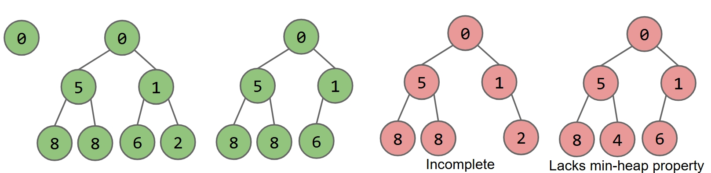
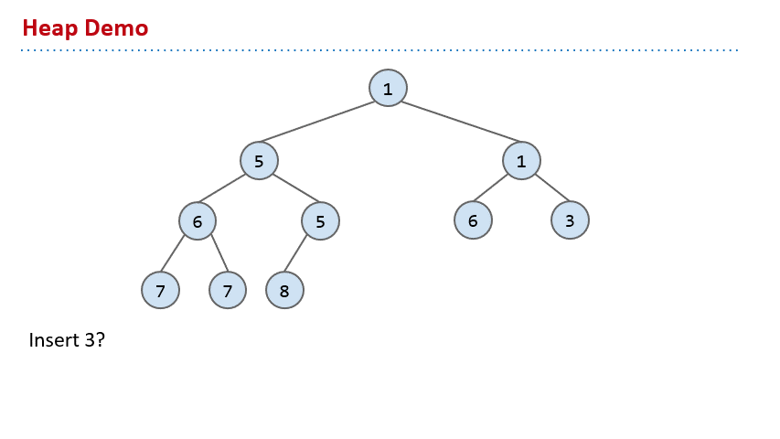
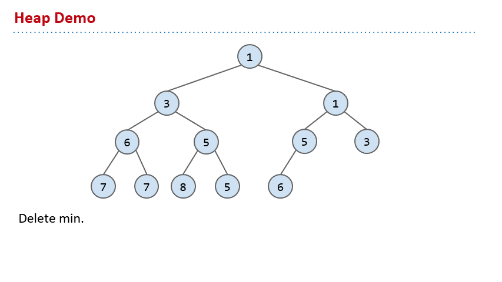
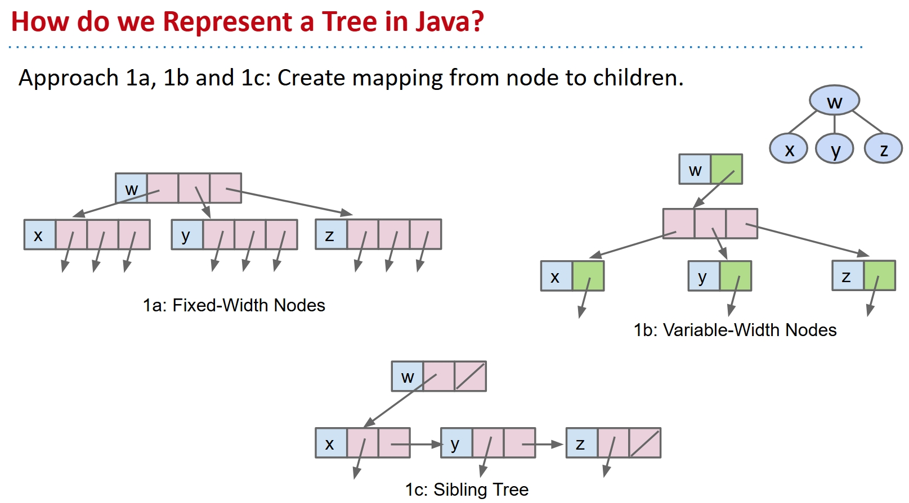
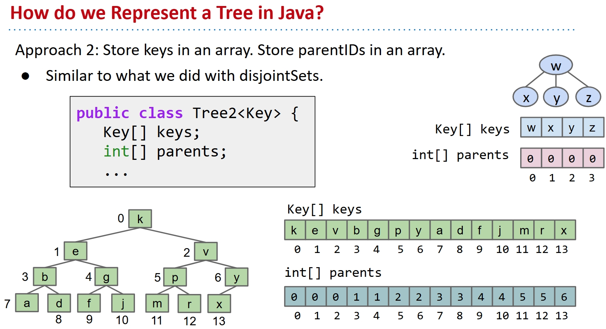
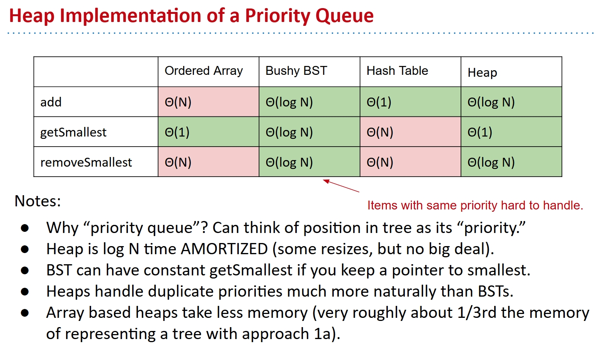

# Heaps and Priority Queues

I write this note mainly based on this slide from UCB CS61B:

[Lec20](https://docs.google.com/presentation/d/1ndWjXB4AeFpZlahpfQ9jkH9DiXxcOtzZEEUjOoC8Tm0/edit?usp=sharing)

Pictures in the note are all from the slide.

## Motivation: Dictatorship

Imagine you are a dictator, I know people like you love this job.

But this job is not easy, you must spend a little time to deal with stuffs, and most of the time to maintain rule and ensure obedience. You are not Hitler, he was lucky to be in a world without Internet and stuffs don't spread so fast. You live in a modern world, you must track what people are talking about online. It's not cool if they say they want to break into your palace and beat your craps out.

So you need a data structure, to collect all these posts in the Internet every single day and find out the most unharmonious ones, then arrest some bad people. But how do you do that?

Since your leadership in education is not very good, the computer scientists in your country are quite dumb, they only have ADTs like List, Map and Set. Not very useful, right? Of course you can do some naive approach, just create a list of all posts for the entire day, sort it using your comparator, then return the $M$ messages that are worst.

The best Java guy in your prison done this for you in a few minutes:

```java
public List<String> unharmoniousTexts(Sniffer sniffer, int M) {
    ArrayList<String> allMessages = new ArrayList<String>();

    for (Timer timer = new Timer(); timer.hours() < 24; ) {
        	allMessages.add(sniffer.getNextMessage());
    }

    Comparator<String> cmptr = new HarmoniousnessComparator();
    Collections.sort(allMessages, cmptr, Collections.reverseOrder());

return allMessages.sublist(0, M);
}
```

But that guy is dead now because you find this super disgusting to use. First, it wasted a lot of space, basically $\theta (N)$. Secondly, you always need to wait after all collected up to sort and find the worst $M$ posts. At that time, you already got beaten your craps out.

So what we want, is a $\theta (M)$ solution.

And this is when I show up, I invent this new ADT called Priority Queue for you, in trade of life-long free coca cola.

```java
/** (Min) Priority Queue: Allowing tracking and removal of the
  * smallest item in a priority queue. */
public interface MinPQ<Item> {
	/** Adds the item to the priority queue. */
	public void add(Item x);
	/** Returns the smallest item in the priority queue. */
	public Item getSmallest();
	/** Removes the smallest item from the priority queue. */
	public Item removeSmallest();
	/** Returns the size of the priority queue. */
	public int size();
}
```

In this queue, every item has a priority. For the above example code, the smaller the higher priority. With this ADT, we can store every posts in, and when the size is larger than $M$, we can just remove the most harmonious one. So in that way, we can get the $M$ most unharmonious posts in $\theta (M)$ memory cost.

```java
public List<String> unharmoniousTexts(Sniffer sniffer, int M) {
    Comparator<String> cmptr = new HarmoniousnessComparator();
    MinPQ<String> unharmoniousTexts = new HeapMinPQ<Transaction>(cmptr);
    for (Timer timer = new Timer(); timer.hours() < 24; ) {
        unharmoniousTexts.add(sniffer.getNextMessage());
        if (unharmoniousTexts.size() > M)
           { unharmoniousTexts.removeSmallest(); }
    }
    ArrayList<String> textlist = new ArrayList<String>();
    while (unharmoniousTexts.size() > 0) {
        textlist.add(unharmoniousTexts.removeSmallest());
    }
    return textlist;
}
```

Remember we have talked about a lot of ADTs, all of them need some kind of implementation. For this PQ, what do we use?

Some possibilities here, ordered array, BST and hash table. I don't know if people like you can see that, but I know all of them stupid with one look. Ordered array takes forever to add some stuff, keep BST balanced makes me want to suicide, and hash table is not even ordered, how do you deal with the priority stuff?

And this, is why we need Heap.

## Heap

If you only see performance, BSTs actually do the best job. But problem is, too hard to maintain bushiness, and can't deal with duplicated stuffs.

However, we can change the definition a little bit and try to make things better:

**Binary min-heap**: Binary tree that is **complete** and obeys **min-heap property**.

- Min-heap: Every node is **less than or equal to** both of its children.

- Complete: Missing items only at the bottom level (if any), all nodes are as far left as possible.

See this pic if not clear:



So this is like born to do getSmallest. Obvious even for you, hopefully. You just check the root!

How do you add an item? Quite simple, just add it to the last position, and then promote it as high as possible.

See this gif do two examples if not clear:



And what about removeSmallest? Even you can see that we need to remove the root, but what then? We must keep it still a heap. Quite simple too, we remove the root and replace it with the last item, then sink it as low as possible.

See this gif if not clear:



And obviously, these two actions are all $\theta (\log N)$ time, which is extremely good.

But how do we do it in Java?

## Tree representation

Trees in Java, how do we do that?

Naive people like you may think stuff like this with intuition: Create mapping from node to children.

See this slide if not clear:



But this is a huge waste, right? You have to store a lot of pointers, and didn't use the good property of complete tree.

So consider this, since it is a ordered tree, which goes from up to down, from left to right, maybe we can try an array.

We just put them into an array in order, and maintain another array to store which index is the parent of each position.

See this slide if not clear:



This is much better, right? But can we do even better? Maybe the parent array is not necessary, what do you think?

Yes, and we have a very neat way to direct to the parent and children. A way only smart people like me can come up with.

I will just tell you because you will never figure it out yourself. For any key `k`, the left child is at `2k + 1` , the right child is at `2k + 2`, and the parent is at `(k - 1) / 2`. The `/` here is integer division, which means we will ignore the remainder.

Actually I prefer to just ignore the index 0 and start from 1, so we can make computation of children/parents “nicer”.

- leftChild(k) = `2k`
- rightChild(k) = `2k + 1`
- parent(k) = `k/2`

So now we have this heap implementation to ADT Priority Queue. And the performance is the best of all.

See this pic if not clear:


