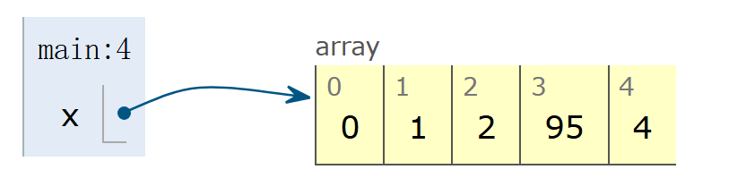
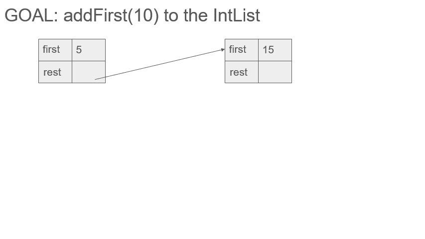
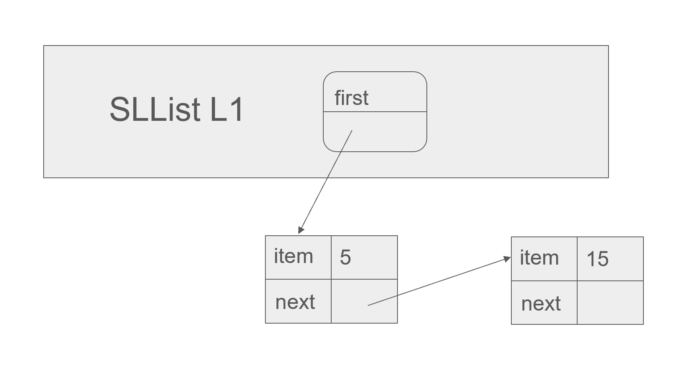
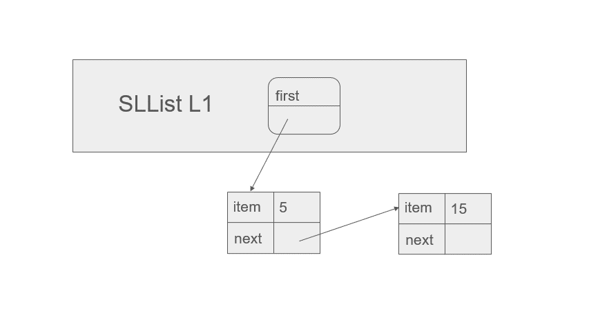
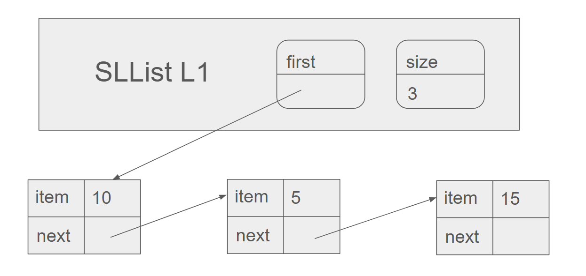
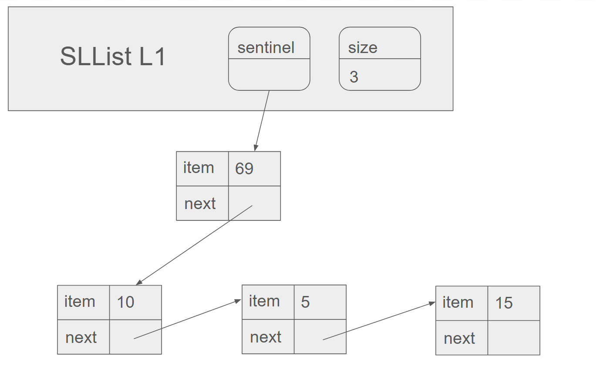
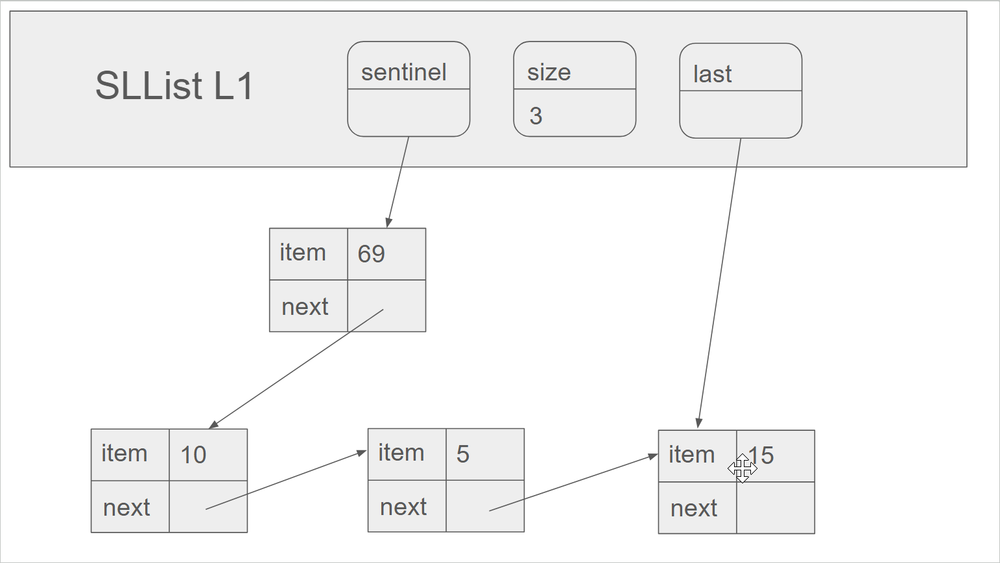
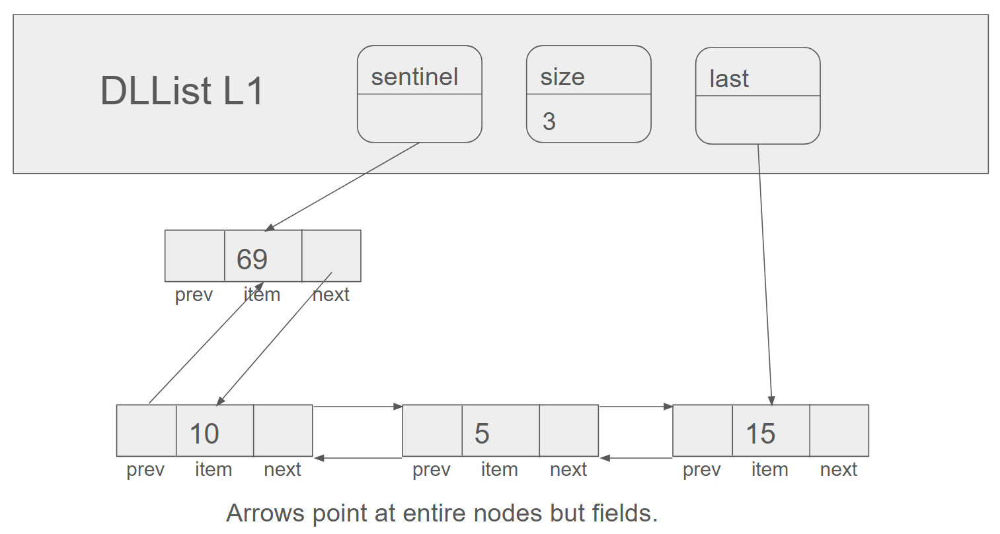
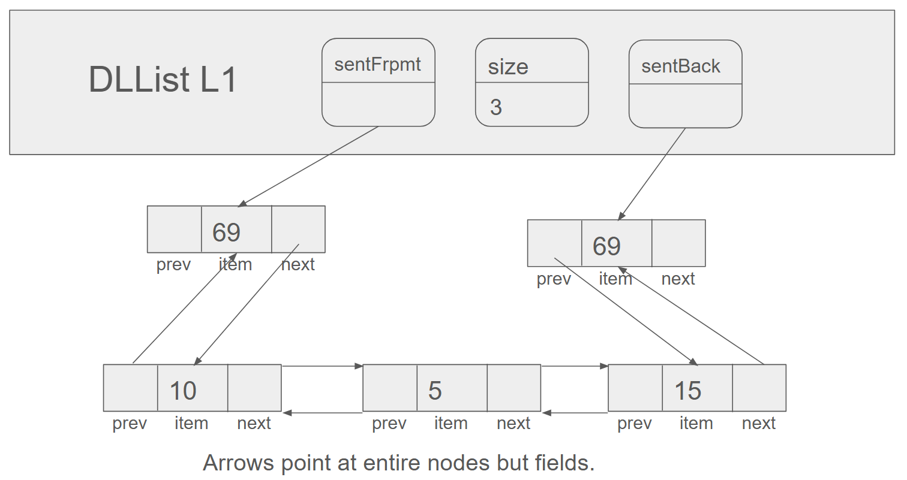
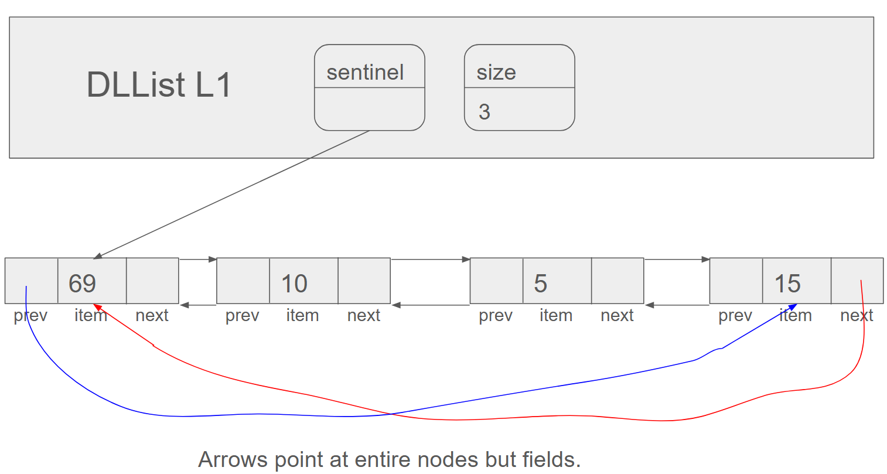

# Linked Lists

I write this note mainly based on these slides from UCB CS61B:

[Lec4](https://docs.google.com/presentation/d/1HQqHSA-h1vRHeResuxmDBGNQACkmxpUBHF3m4-oKU_Q/edit?slide=id.g1c268c8d38_0_2#slide=id.g1c268c8d38_0_2), [Lec5](https://docs.google.com/presentation/d/1q6p0spGPmj8rFrQnWKp_QZJRFHg-IkHE1L9BfZc0f0Q/edit?slide=id.g107e0abc84_0_305#slide=id.g107e0abc84_0_305), [Lec6](https://docs.google.com/presentation/d/1itxVVyJTxKaDod3L8_jasnlZ1LHu-KDeV6Njbqqgbfs/edit?slide=id.g829fe3f43_0_506#slide=id.g829fe3f43_0_506)

## Motivation: From Arrays to IntList

### Arrays

This is something we are all familiar with in Java.

```java
int[] x = new int[]{0, 1, 2, 95, 4};
```



We declare it and then instantiate it, so that it will be there. It is friendly for everyone.

However, I know there is some problem with it. I know Java very well, okay? If you are referenced by some variable, you are fine. But every single time when you got not referenced, you are dead to Java. Bro will just think you are garbage and throw you away.

This is not good enough because it means instantiated objects can be lost. Once we reassign the variable, we can never find our old sweet object back.

And this is why we need Linked Lists. Wait, what is this thing? Let's start easy, we got IntList here which basically does the same thing as arrays.

### IntList

The IntList is base on the idea of reference and recursion. It is consists of two parts, the first and the rest. The first is the first element of the list and the rest is the rest of the list. You know what I mean? Like the rest is actually another IntList.

There is this picture which may help you understand.


I think it would be pretty clear now. Everything is super cool and nice for no more lost objects. There are a lot of references here. The stories about changing the references and then the objects got lost will no longer happen.

## Users are Dumb: From IntList to SLList

However, things are getting too complicated. I mean how do you even use this IntList thing in real life?

That' do this real problem here. I will give you the code of IntList first.

```java
public class IntList {
   public int first;
   public IntList rest;
   public IntList(int f, IntList r) {
      first = f;
      rest = r;
   }
}
```

Now, I need a method to calculate the size of the list. And here is my implementation.

```java
/** Return the size of this IntList. */
   public int size() {
      if (rest == null) {
         return 1;
      }
   	return 1 + this.rest.size();
```

Recursion! What is more exciting than this? But won't it be too complicated if you have to do this every time? And for every time, I mean every time.

Let's see some more examples.

Method int get(int i) that returns the ith item in the list.

1.For simplicity, OK to assume the item exists.

2.Front item is the 0th item.

```java
    public int get(int i) {
        if (i == 0) {
            return this.first;
        }
        return this.rest.get(i - 1);
    }
```

public static IntList incrList(IntList L, int x);

1.Returns an IntList identical to L, but with all values incremented by x.

2.Values in L cannot change!

```java
    public static IntList incrList(IntList L, int x) {
        if (L == null) {
            return null;
        }
        return new IntList(L.first + x, incrList(L.rest, x));
    }
```

public static IntList dincrList(IntList L, int x);

1.Returns an IntList identical to L, but with all values incremented by x.

2.Not allowed to use ‘new’ (to save memory).

```java
    public static IntList dincrList(IntList L, int x) {
        if (L == null) {
            return null;
        }
        L.first += x;
        dincrList(L.rest, x);
        return L;
    }
```

Basically, using IntList is just about recursion, recursion, and recursion. Of course, I know you are as smart as me and can nail all of these implementations with ease. But, think of our users. They are literally dumb. And for dumb, I mean dumb. Java reference, they can never do it right. Recursion? Don't even mention it.

And that, kid, is how I met your mother, I mean, SLList.

### SLList

I got confused when I first saw this name. There are literally three capital letters in the front. That seems stupid.
But it actually stands for Singly Linked List.

Anyways, the motivation of this is clear. What we need is some abstraction, to make users free from a lot of references and recursive thinking.
But, how do we achieve that?
Let's just focus on a specific topic first, which is how do we add a node to the first of the list.
Or we can say the addFirst method.

For IntList, the class itself is a node, so when we say the first we actually mean the value of the first node.
There is no actually a reference to the first node.
So we can not just change the reference to another node and set the previous to its rest.
We can only copy the first node, change the value of itself, and then set its rest to the copy of it.

I think it would be more clear if you see this gif.



This is indeed not efficient at all. How can we improve it?
If the IntList class is just a node, why not just let it be a node?

```java
public class IntNode {
   public int item;
   public IntNode next;

   public IntNode(int i, IntNode n) {
      item = i;
      next = n;
   }
}
```

And we can make another class to be the list, in which we have the reference to the first node.

If you still don't get it, see the picture below.



And now we show the addFirst method, see the gif below.



It is clearly much more efficient!
We can now actually just add a node to the first and change the first reference, and then we are done.

I think it is time to show you the code.

```java
public class SLList {
   public class IntNode {
      public int item;
      public IntNode next;
      public IntNode(int i, IntNode n) {
         item = i;
         next = n;
      }
   }

   private IntNode first;
   public SLList(int x) {
      first = new IntNode(x, null);
   }
}
```

It is very naive, but that's the main idea of SLList.
The outside class is like, let's say, Bureaucracy, who handle all complicated stuffs.
And we can just ask them to serve us, use the provided methods, to be specific.

Now, let's implement some methods.

We may need the size of the list, here is one approach.

```java
    private int size(IntNode p) {
            if (p.next == null) {
                return 1;
            }

            return 1 + size(p.next);
        }

        public int size() {
            return size(first);
        }
```

Helper method, recursive, very cool. 
But it can still be slow! 
As we must travel the whole list to get the size, when the list is super big, 
say like 1000000000 nodes, it will take forever. 
And that's why the bureaucracy is great.

Why not just let them keep the record of the size?

If only we keep every add or remove method to update the size, we are good to go.
So the fast size method is just returning the size variable, no matter how big the list is, we get the size in constant time.

See this picture if not clear.



Next, we may need the addLast method.

```java
    public void addLast(int x) {
        size += 1;

        if (first == null) {
            first = new IntNode(x, null);
            return;
        }

        IntNode p = first;
        while (p.next != null) {
            p = p.next;
        }

        p.next = new IntNode(x, null);
        }
```

But this seem a bit messy.
There is this if statement dealing with the case that the list is empty, cause you can't add a node to the next of null.
Can't we just avoid this? 
I mean there's nothing wrong of you, you are just... ugly. 
And you waste some working memory, yeah, that's the reason. 

Just kidding, it matters if the data structure is complex and there may be a huge number of special cases, and that's why we have to control the complexity.

We can just let the bureaucracy not to store the first node, but a sentinel node. 
He is literally a sentinal, just standing there and doing nothing.
Nobody cares about him, you can just ignore him. 
But with him, even it's empty list, we have a node's next to set.

See the picture below if not clear.



The item of the sentinel node is actually not used, just any random value is okay, here we use my favorite integer, 69.

I think after seeing these two methods implemented, you would agree that the bureaucracy is indeed useful even for ourselves, don't mention the users. They can only see this interface and interact with it without thinking about those shits that they are too dumb to handle.

There are some other methods, like removeLast, removeFirst, etc. Just check it out online if you are interested. 

## It's Unfair: From SLList to DLList 

So the Singly Linked List! We did't name it Linked List, so you know there must be a Doubly Linked List.

But why? 
Well, there is this problem. When you do addLast, it is usually much slower than addFirst. 
So unfair, isn't it? 
And for myself, I actually use addLast more than addFirst. 
Naturally, we will hope to create something that addFirst and addLast are both fast. 

Okay, that seems easy to fix. 
We got the bureaucracy, why not just let it keep the last node? 
And than we can do it in constant time, happy ending!

See the picture below if not clear.



However, this is like only cure one of the symptoms of a serious disease. 
The real problem is not solved, not even be found. 

You see, now we can do addLast and addFirst in constant time. 
Even removeLast and removeFirst are fast. 
But sometimes, we try to delete the middle nodes. 
Then we found that delete the second node from the end is much slower than delete the second node from the beginning. 

The real problem is the singly way of listing! 
We can only go one way, so when delete the second node from the end, we have to travel the whole list to find it. 

And that is the motivation of DLList. 

### DLList

The meaning of doubly linked list is obvious. Before, we can only set a node to another's next, but now we can set it to both next and previous. 

See the picture below if not clear.



This a pretty naive implementation. 
The last reference some times point to a 'real' node, but just a sentinel when the list is empty. 
So that there is always this anoying special case! 
We may write a lot of if statements for this and we don't want that. 

So we can just use two sentinels, a sentFront and a sentBack. This is a natural and easy approach. 

See the picture below if not clear.



This will work out, but personally I prefer the other approach, only for it is fancier. 
We need only one sentinel, and only one reference to it, and the trick is making it circular. 

We can see in the naive implementation, the prev of sentinel and the next of the last node both have nothing to point to. 
So why not just let them point to each other? 

See the picture below if not clear.



Up till now, we have the Linked List pretty much done. I only focus on big ideas, there are some details remaining, but I think it is enough for now. 

## Not only integers: Generic Lists

Remember we started with IntList which do the same thing as arrays. 
Well, not exactly. 
Arrays can store many types of data, but our IntList, even the SLList and DLList, can only store integers. 

```java
int[] x = new int[]{0, 1, 2, 95, 4};
String[] y = new String[]{"I", "am", "a", "student"};
double[] z = new double[]{1.0, 2.0, 3.0};
char[] c = new char[]{'a', 'b', 'c'};
long[] l = new long[]{1L, 2L, 3L};
```

So we need to make it generic. 

Good news is, Java allows us not to defer the type when we do the class implementation. 
We can defer until we do the declaration. 
To be specific, we can just write some random shits to be the type at first. 

See the example below if not clear. 

```java
public class LinkedList<TigerKidIsPrettyCute> {
   public LinkedList<TigerKidIsPrettyCute> sentinel;
}
```

When use it. 

```java
LinkedList<String> l = new LinkedList<>();
```

## Implementation in real Java code

Here is my implementation of the Linked List with the circular DLList approach. It was actually written for the CS61B project. 

```java
package deque;

import java.util.Iterator;

public class LinkedListDeque<T> implements Iterable<T>, Deque<T> {

    private class TNode<T> {
        private T item;
        private TNode<T> next;
        private TNode<T> prev;

        TNode(TNode<T> prev, T item, TNode<T> next) {
            this.item = item;
            this.next = next;
            this.prev = prev;
        }
    }

    private int size;
    private TNode<T> sentinel;

    public LinkedListDeque() {
        sentinel = new TNode<>(null, null, null);
        sentinel.next = sentinel;
        sentinel.prev = sentinel;
        size = 0;
    }

    @Override
    public void addFirst(T item) {
        TNode<T> newNode = new TNode<>(sentinel, item, sentinel.next);
        sentinel.next.prev = newNode;
        sentinel.next = newNode;
        size++;
    }

    @Override
    public void addLast(T item) {
        TNode<T> newNode = new TNode<>(sentinel.prev, item, sentinel);
        sentinel.prev.next = newNode;
        sentinel.prev = newNode;
        size++;
    }

    @Override
    public int size() {
        return size;
    }

    @Override
    public void printDeque() {
        if (size == 0) {
            System.out.println();
            return;
        }
        TNode<T> current = sentinel.next;
        for (int i = 0; i < size - 1; i++) {
            System.out.print(current.item + " ");
            current = current.next;
        }
        System.out.println(current.item);
    }

    @Override
    public T removeFirst() {
        if (size == 0) {
            return null;
        }
        T toBeRemoved = sentinel.next.item;
        sentinel.next.next.prev = sentinel;
        sentinel.next = sentinel.next.next;
        size--;
        return toBeRemoved;
    }

    @Override
    public T removeLast() {
        if (size == 0) {
            return null;
        }
        T toBeRemoved = sentinel.prev.item;
        sentinel.prev.prev.next = sentinel;
        sentinel.prev = sentinel.prev.prev;
        size--;
        return toBeRemoved;
    }

    @Override
    public T get(int index) {
        if (index < 0 || index >= size) {
            return null;
        }
        TNode<T> current = sentinel.next;
        for (int i = 0; i < index; i++) {
            current = current.next;
        }
        return current.item;
    }

    private T getRecursiveHelper(TNode<T> current, int index) {
        if (index == 0) {
            return current.item;
        }
        return getRecursiveHelper(current.next, index - 1);
    }

    public T getRecursive(int index) {
        if (index < 0 || index >= size) {
            return null;
        }
        return getRecursiveHelper(sentinel.next, index);
    }

    @Override
    public Iterator<T> iterator() {
        return new LinkedListIterator();
    }

    private class LinkedListIterator implements Iterator<T> {
        private int currentPos;

        LinkedListIterator() {
            currentPos = 0;
        }

        @Override
        public boolean hasNext() {
            return currentPos < size;
        }

        @Override
        public T next() {
            T returnItem = get(currentPos);
            currentPos++;
            return returnItem;
        }
    }

    @Override
    public boolean equals(Object o) {
        if (this == o) {
            return true;
        }
        if (!(o instanceof Deque)) {
            return false;
        }
        Deque<?> otherDeque = (Deque<?>) o;
        if (size != otherDeque.size()) {
            return false;
        }
        for (int i = 0; i < size; i++) {
            T thisItem = this.get(i);
            Object otherItem = otherDeque.get(i);
            if (thisItem == null) {
                if (otherItem != null) {
                    return false;
                }
            } else if (!thisItem.equals(otherItem)) {
                return false;
            }
        }
        return true;
    }
}
```

Date: 2025-04-08
