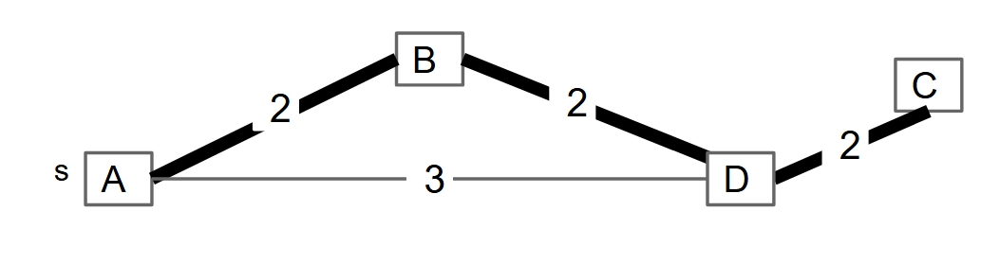
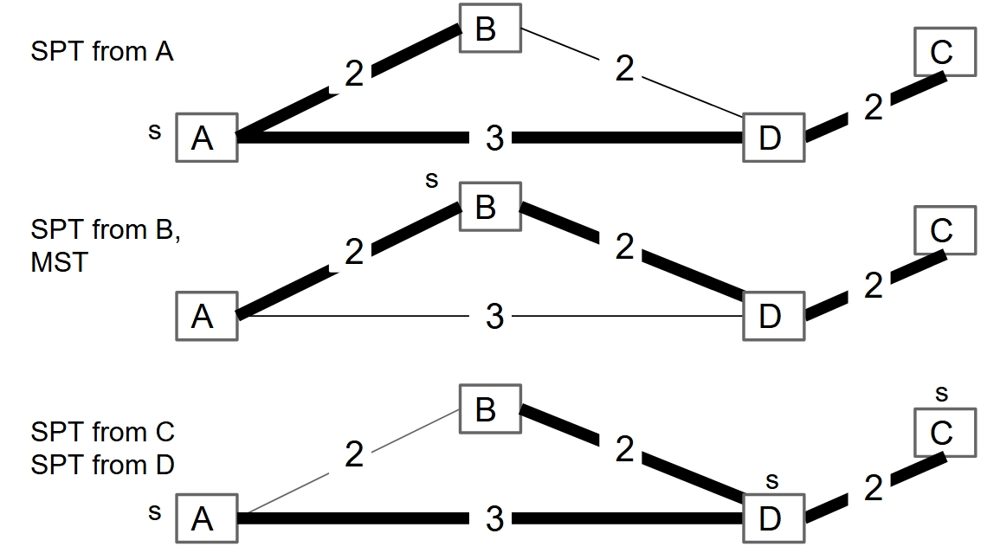
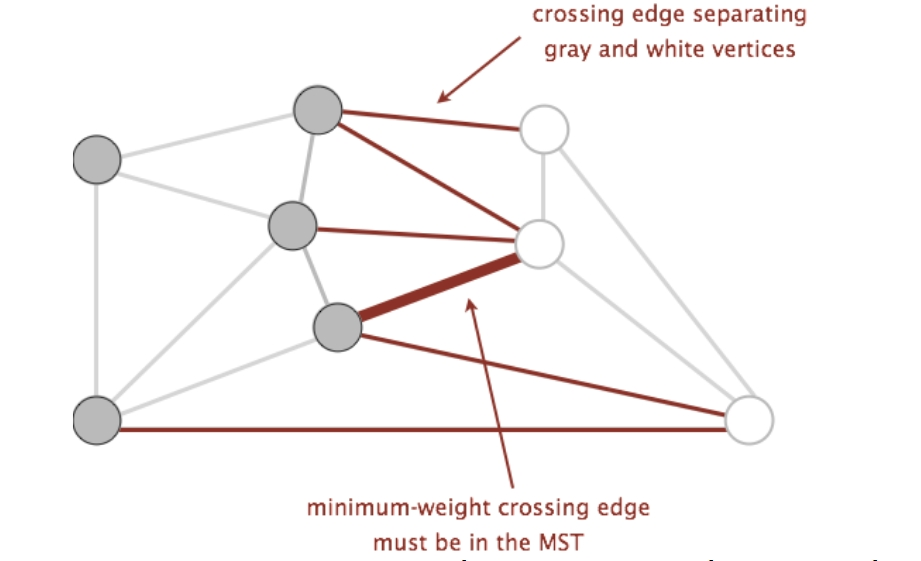
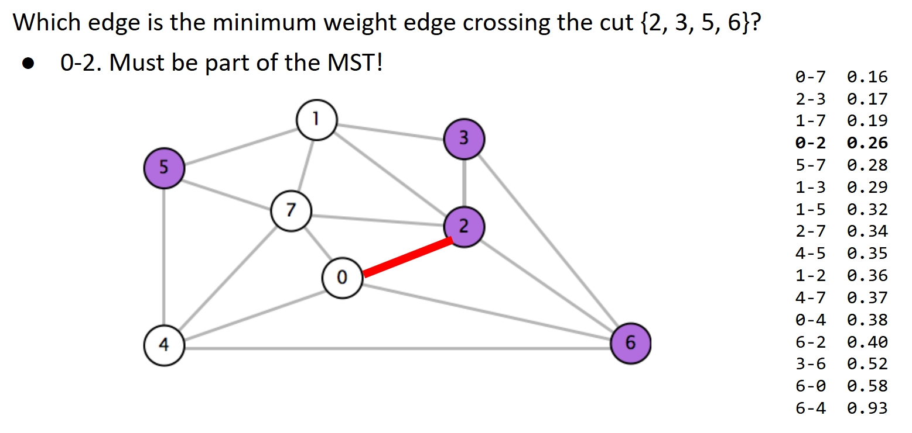
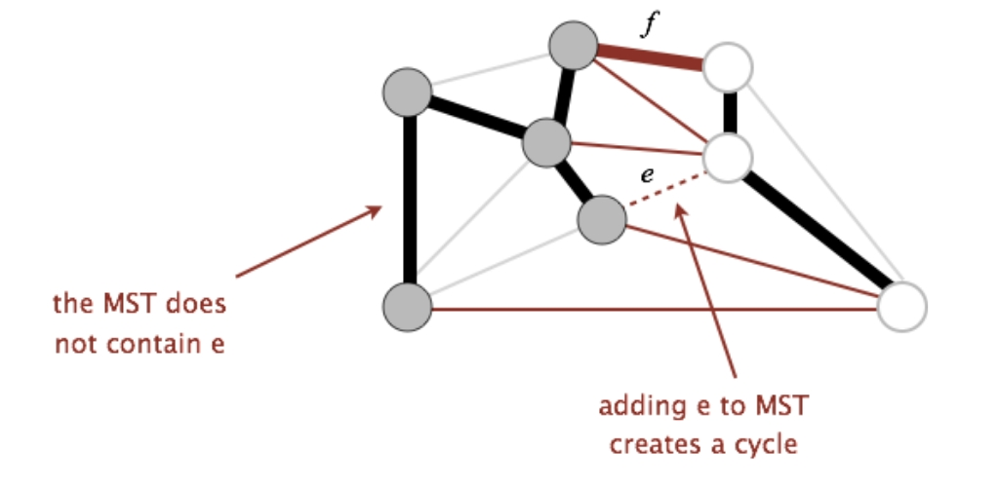
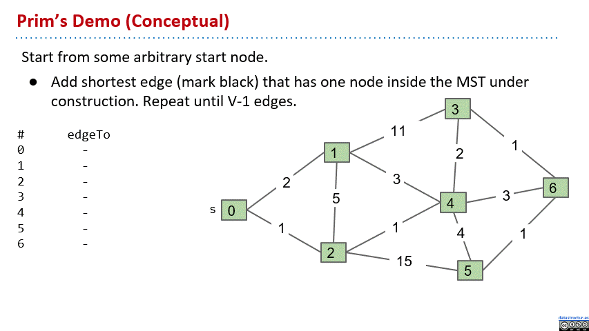
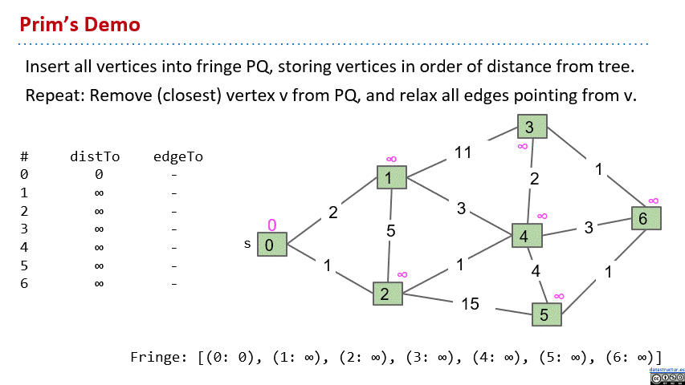
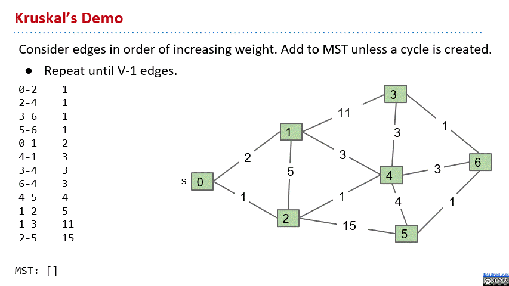
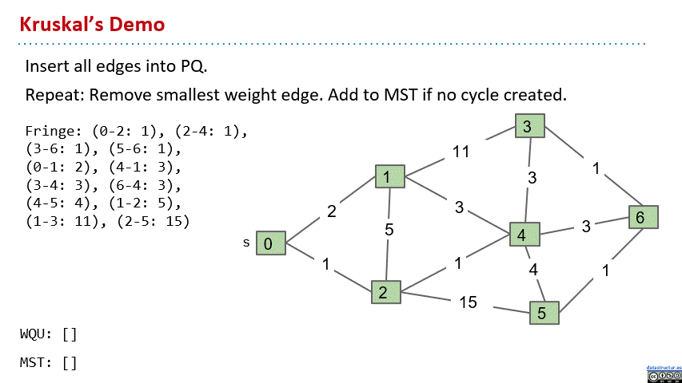
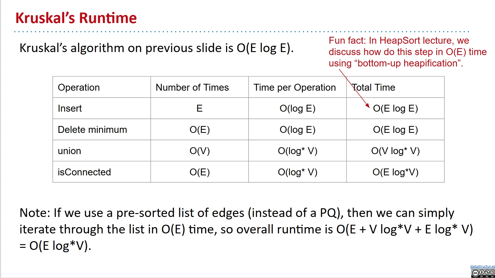

# Minimum Spanning Trees

I write this note mainly based on this slide from UCB CS61B:

[Lec24](https://docs.google.com/presentation/d/10hWbLAkop9DqwFXKn7d8u3bOZi5YuvhGUN7DKG24he4/edit?usp=sharing)

Pictures in the note are all from the slide.

## Motivation

We already have the shortest paths tree for a graph. This is from a source vertex to all other vertices and having the shortest path to each vertex. But sometimes, we are not just caring about a single vertex, but we want to connect all the vertices in the graph with the minimum cost.

We might want to connect all buildings in the area with power lines, so we need a way to make it the shortest in total.When you have cancer, you want some medical imaging to understand the cancer cells' arrangement. This is where the **Minimum Spanning Tree(MST)** comes in.

## MSTs

Given a undirected graph, a **spanning tree** is a subgraph of it. And the spanning tree is connected and acyclic, that's why we call it a tree. It's also including all the vertices in the graph, that's why we call it spanning.

A **minimum spanning tree** is a spanning tree of minimum total weight. And this is what we want.

See this pic below if not clear:



Sometimes the MST might happen to be a SPT(shortest paths tree) from a source vertex, but it's not always the case.

See this pic below:



But it doesn't have to be a SPT from a source vertex. It can also be that there is no a single SPT equal to the MST.

Our goal is to find the MST of a graph, we need a algorithm to do this.

To invent the algorithm, we might need this little observation about MST. Which is the **Cut Property**:

- A **cut** is an assignment of a graph’s nodes to two non-empty sets.
- A **crossing edge** is an edge which connects a node from one set to a node from the other set.
- **Given any cut, minimum weight crossing edge is in the MST.**





This is easy to prove. You can assume that there exists a MST that does not include the minimum weight crossing edge. Then there must be another crossing edge in it. And you can change it with the minimum weight crossing edge, and get a spanning tree with lower total weight! So we prove it.

See this pic below if not clear:



Now we know how to do this algorithm. We start with a MST with no edges in it. Find a cut that no crossing edge is in the MST. And then add the minimum weight crossing edge to the MST. We can repeat the above two steps until we have v-1 edges in the MST. Then we have the MST.

But now we need some way to find a cut that no crossing edge is in the MST!

## Prim's Algorithm

Very intuitive idea: We just start with a single vertex as the MST, and we always regard the current MST and the rest vertices as a cut. So we can use the cut property, just to repeatedly add the shortest edge which has one end in the MST into the MST, we always add a 'must be in' edge! Repeat untill we have v-1 edges in the MST.

See this gif below for a prim's demo:



The idea is quite similar to Dijkstra's algorithm. The difference is only that the Prim's focus on the distance from the tree, while the Dijkstra's focus on the distance from the source vertex. Anyway the implementation is still quite similar.

We also use the queue. Insert all vertices into fringe PQ, storing vertices in order of distance from tree. Remove (closest) vertex v from PQ, and relax all edges pointing from v. The visit order and the relaxation action is based on the distance from the tree, not the source vertex like Dijkstra's algorithm.

See this gif below for a prim's implementation demo:



Here is the pseudocode:

```java
public class PrimMST {
    public PrimMST(EdgeWeightedGraph G) {
        edgeTo = new Edge[G.V()];
        distTo = new double[G.V()];
        marked = new boolean[G.V()];
        fringe = new SpecialPQ<Double>(G.V());

        distTo[s] = 0.0;
        setDistancesToInfinityExceptS(s);
        insertAllVertices(fringe);

        /* Get vertices in order of distance from tree. */
        while (!fringe.isEmpty()) {
            int v = fringe.delMin();
            scan(G, v);
        }
    }

    private void scan(EdgeWeightedGraph G, int v) {
        marked[v] = true;
        for (Edge e : G.adj(v)) {
            int w = e.other(v);
            if (marked[w]) { continue; }
            if (e.weight() < distTo[w]) {
                distTo[w] = e.weight();
                edgeTo[w] = e;
                pq.decreasePriority(w, distTo[w]);
            }
        }
    }
}
```

Assume all PQ operations take $O( \log(V))$ time.

- Insertion: V, each costing $O(log V)$ time.
- Delete-min: V, each costing $O(log V)$ time.
- Decrease priority: O(E), each costing $O(log V)$ time.

Overall runtime: $O(V \times log(V) + V \times log(V) + E \times logV)$.

Assuming $E > V$, this is just $O(E log V)$.

## Kruskal's Algorithm

The basic idea is just the same as Prim's. Regard the current MST and the rest vertices as a cut. But we notice, to make the cut property work, we don't need one side of the cut to be connected!

So we can do it better. This time we consider edges in increasing order of weight. We always add the shortest edge that is not in the current MST, as long as it doesn't create a cycle. Repeat until V-1 edges.

See this gif below for a kruskal's demo:



And a implementation demo:



Pseudocode:

```java
public class KruskalMST {
    private List<Edge> mst = new ArrayList<Edge>();

    public KruskalMST(EdgeWeightedGraph G) {
        MinPQ<Edge> pq = new MinPQ<Edge>();
        for (Edge e : G.edges()) {
            pq.insert(e);
        }
        WeightedQuickUnionPC uf = new WeightedQuickUnionPC(G.V());
        while (!pq.isEmpty() && mst.size() < G.V() - 1) {
            Edge e = pq.delMin();
            int v = e.from();
            int w = e.to();
            if (!uf.connected(v, w)) {
                uf.union(v, w);
                mst.add(e);
            }
        }
    }
}
```

Assume all PQ operations take O(log(V)) time, all WQU operations take O(log\* V) time.

See this pic below for the Kruskal's runtime:


