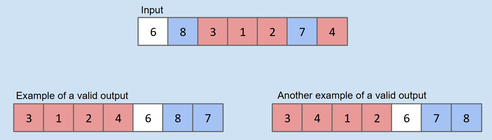
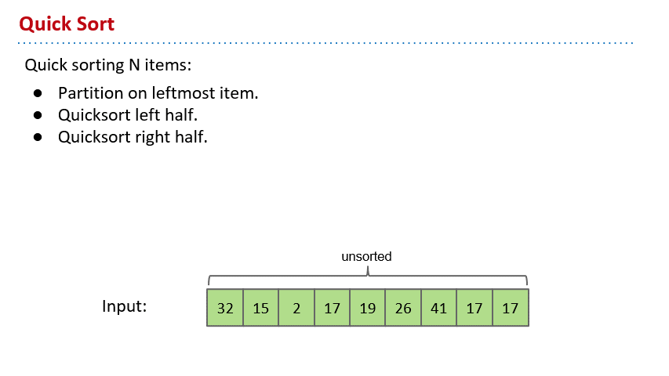
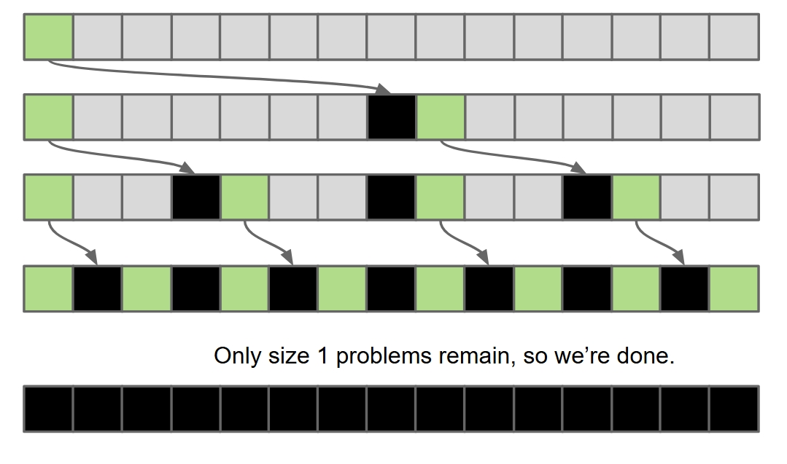
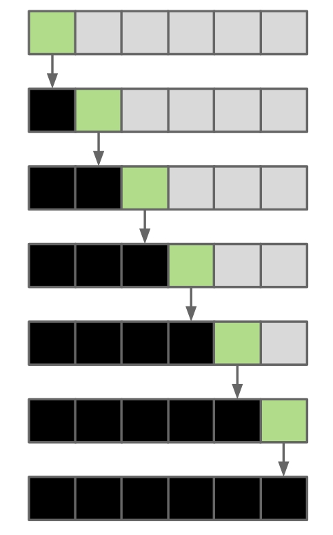

# Quick Sort

I write this note mainly based on this slide from UCB CS61B:

[Lec30](https://docs.google.com/presentation/d/1UNyJDLwpfBBtkaFiZgqnsYambK99Lr7MjE1P63Nr_4A/edit?usp=sharing)

Pictures in the note are all from the slide.

## Motivation

I can't figure out a single motivation for it. It is used to solve similar problems as previous sortings.

Someone called Tony just invented it. And it's pretty good. The runtime is also $O(N \log N)$, but the constant factor is smaller. So it's very fast.

That's why we are going to learn it.

## Quick Sort

The key idea of quick sort is **partition**.

To partition an array `a[]` on element `x=a[i]` is to rearrange `a[]` so that:

- x moves to position j (may be the same as i)
- All entries to the left of x are <= x.
- All entries to the right of x are >= x.

By the way, the x is called **pivot**.

See this pic below if not clear:

It's obvious that after doing this, the x element is exactly in the correct position of the array after sorting!

So naturally, we have this simple idea. If we do this partition **recursively**, we can get a sorted array!

This is quick sort.

To do this partition right, there are a lot of ways. We give this very simple, though may not the fastest, one here.

We just scan the input array for three times. First, we find all the elements that are smaller than the pivot and copy them into output array. Then, we copy the pivot. Finally, we find all the elements that are larger than the pivot and copy them into output array.

So we can do partition, then let's do the quick sort.

The algorithm is simple:

- Partition on leftmost element
- QuickSort on left half
- QuickSort on right half

See this gif below for a quick sort demo:

Tony just name it, but it proved to be the fastest sorting algorithm under most common situations, empirically.

## Runtime

The partition always uses $\theta (K)$ time. K is the number of elements being partitioned.

The whole quick sort, let's see the best case first. Obviously, if the pivot always lands in the middle, it would be wonderful.

This is $\theta (N \log N)$.

And the worst case is that the pivot always lands in the leftmost of array.

This is $\theta (N^2)$.

So how can it be the fastest empirically?

Well, it's basically just the bad cases have little possibility to show up. So the average is $\theta (N \log N)$. And the constant factor is very small.

And we can somehow avoid the worst case. There are a lot of things you can do. You can not always choose the leftmost element as the pivot, but the median one or random. Or you can shuffle the array before sorting so that it would be a random array no matter what order it was in.
