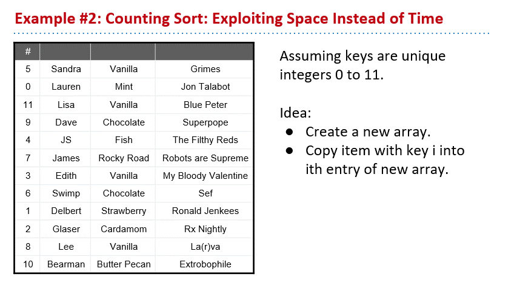
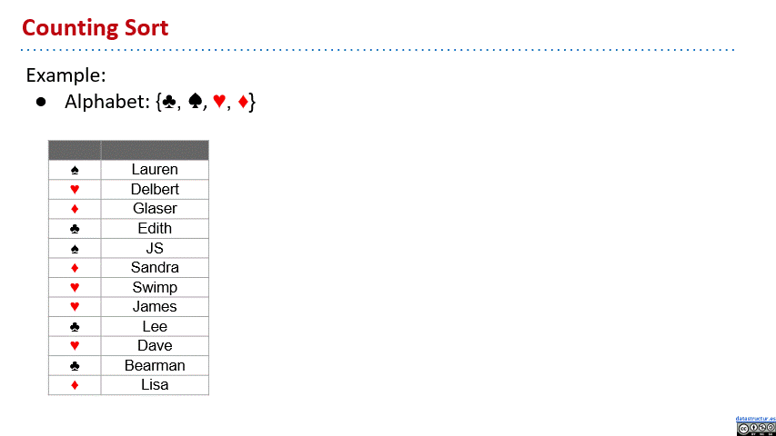
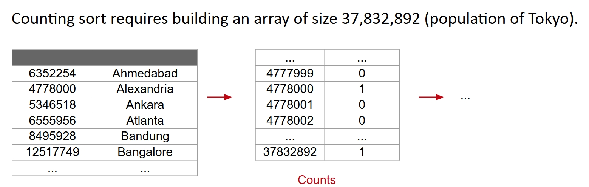
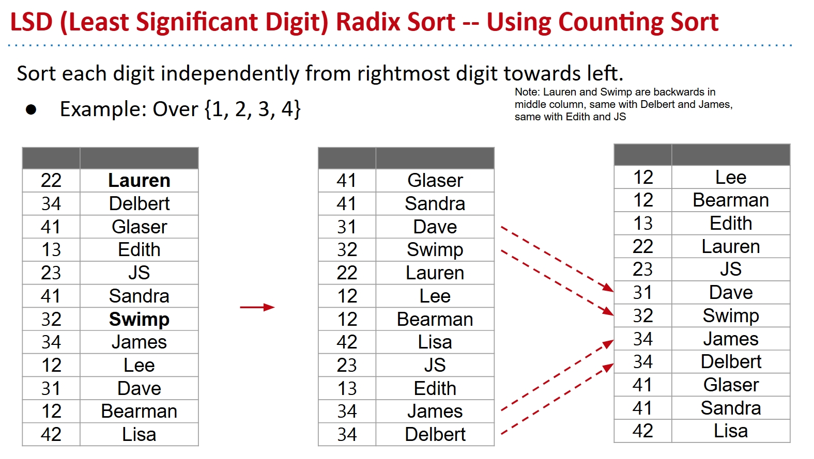
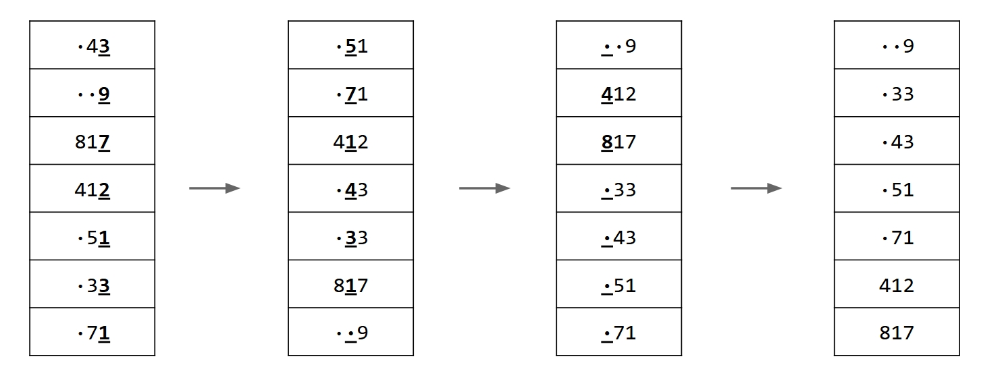
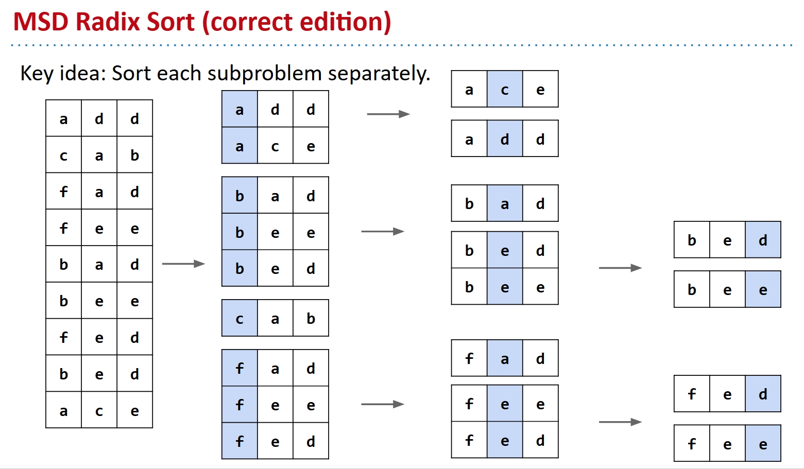
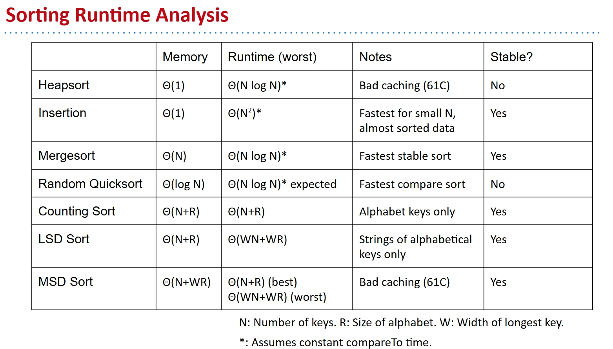

# Radix Sorts

I write this note based on this slide from UCB CS61B:

[lec35](https://docs.google.com/presentation/d/1gKtqmsvYWLeUue5aACaaJ6LV_T1pUOQpR7VDAL2t9X4/edit?usp=sharing)

Pictures in the note are all from the slide.

## Motivation

We have seen a lot of sortings, the common idea is to compare the elements. And since sorting requires $\Omega (N \log N)$ compares in the worst case, it has worst case runtime $\theta (N \log N)$. So people can never do better than this, even the smartest people like me.

But, this is under the comparison, that if we don't do that? The sorting algorithms without comparison that have better performance, this is what we are going to invent.

## Counting Sort

First, for simplicity, we only consider this problem of sorting unique integers from 0 to 11. The idea is to create an new array, and copy item with key i into ith entry of new array.

See this gif below if not clear:

In this way, we can sort the array in $\theta (N)$ time. But things won't always be that easy, the keys might not be unique, might not be consecutive, might not be numerical, etc.

So we need to find a way to generalize this idea.

The way is counting, we first count the number of occurrences of each item, then we iterate the array and use the count array to decide where to put everything.

See this gif below for a counting sort demo:

The runtime is $\theta (N + R)$, where $R$ is the size of alphabet. For example, if we are going to sort 100 cities by population, then we must create a array, with the size of the largest number of population. In that way the R would be very large so that QuickSort is better. But when N is very large, or we can say N > R, then counting sort is just better.

## Radix Sort

So we can deal with pretty long alphabet though very slow, but not all keys belong to finite alphabet. If keys belong to infinite alphabet, then we can't use counting sort.

Like strings, we can't use counting sort directly. But strings consist of characters that are from a finite alphabet. So the idea is, we do counting sort for each digit independently from right to left. Not only strings, also integers or something like that from infinite alphabet.

This is called the **LSD(Least Significant Digit) Radix Sort**.

See this pic below if not clear:

By the way, when keys are of different length, we can treat the empty spaces as less than any other characters.

The runtime of LSD sort is $\theta (WN + WR)$, where $W$ is the width of each item in number of digits. Since we actually do counting sort for W times.

The LSD is quite against people's intuition, can we do the MSD(Most Significant Digit) Radix Sort?

If you just do it anyway, you won't get the right answer. Obviously, when you do counting sort to the second digit, you mess the order of the first digit.

To make things work, our approach is to counting sort each subproblem separately.

See this pic below if not clear:

Certainly the best case would be that you just do it right all at the first digit, so we got $\theta (N + R)$ time. The worst case would be just also $\theta (WN + WR)$ time.

## Sorting Summary

