# Red Black Trees

I write this note mainly based on this slide from UCB CS61B:

[Lec18](https://docs.google.com/presentation/d/1S27xlCPX0Up8WAHZPBqmbcrcKo4FNbyG6eTHamOxzgA/edit?usp=sharing)

Pictures in the note are all from the slide.

## Motivation: B tree is too hard

We invented BST from scratch together, and then we found it get pretty slow in some cases. To deal with that, we invented B tree, which is guaranteed to be balanced no matter how new keys are inserted. And the performance seems almost perfect.

However, if you try to implement B tree, you will find it is actually very hard to implement. You can see the Java code I provided in the B tree note, which I was so not writting it myself, and you would find it super complicated.

This is actually quite disappointing, for it is so elegant but not so easy to implement and use. What, wait, I didn't mean to make you cry. Okay, stop it, please. We have better way to do it.

So in this note, we are going to go back to the problem of BST, and figure out a smarter way to fix it.

## Tree Rotation

### Idea

Our super big problem is when a series of keys coming to you, what BST you get depends on the order of insertion. And we totally fix it by inventing B tree. However, it's hard to implement, and we must keep thinking other ways to guarantee the balance of the tree.

Just, consider this simple case to kick off the discussion. If we are going to insert 1, 2 and 3, how many possible BSTs we can get?

Easy math, there are 123, 132, 213, 231, 312 and 321, all of 6 possibilities. However, 213 and 231 actually get the same tree, so 5 trees in total.

See this pic if not clear:

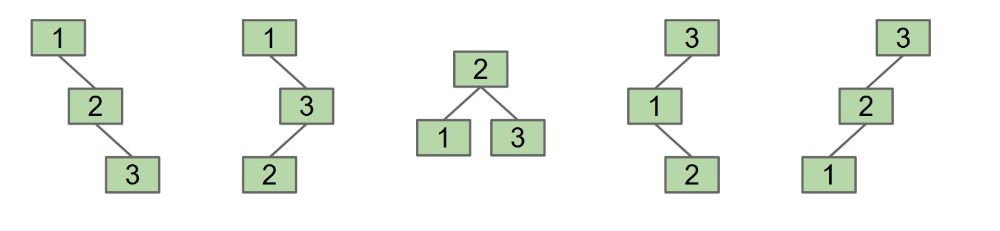

Yeah, I can see on your face that you don't get my point. Well, smart people like me have this kind of observation. Which is, you can have the middle one, if you do a little rotation to the first and last one.

Actually, people who invented this approach are almost as smart as me. They did some incredible job, define the rotation action very well, and they do some math stuff which you will never understand, to show that it's possible to turn a configuration in to any another one in a few rotations.

So in that way, we can also guarantee the balance of the tree, no matter how new keys are inserted. And for there is only this one move, maybe quite easy to implement.

### Definition

For 'Rotation', we have two directions obviously.

- If you do `rotateLeft(G)`, we define this move as:

G has this right child x, and we make G the new left child of x.

See this pic if not clear:

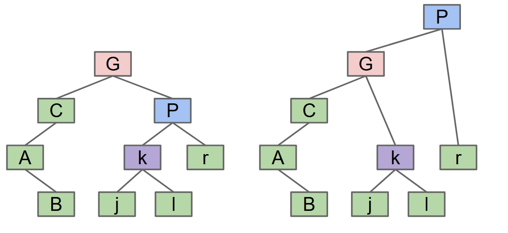

You can see we move the G to be the P's left child. And P used to had this left child K, and its whole subtree, we move it to be the right child of G. This is a very natural move, even you can understand it. Hope I am right.

If it is still quite hard to understand, you can think of this middle move, which is we kind of merge G and P together, and then sending G down to the left child position.

See this pic if not clear:

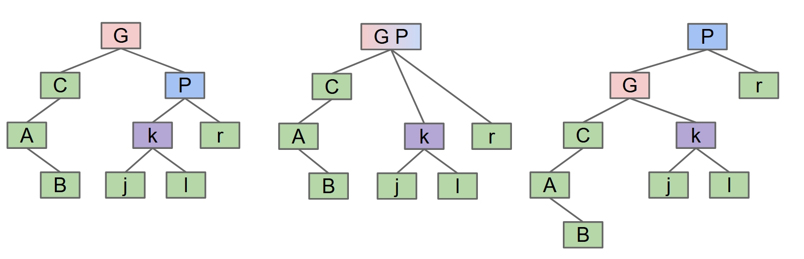

Anyway, you can see this move doesn't break the BST property at all.

- And we have this `rotateRight(P)`, we define this move as:

P has this left child x, and we make P the new right child of x.

Nothing quite different from the `rotateLeft(G)` except the direction.

See this pic if not clear:

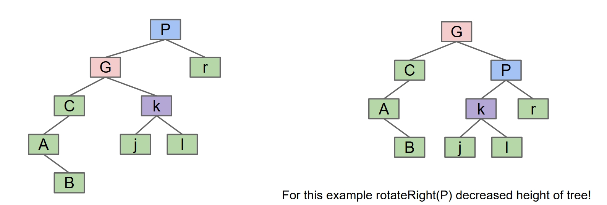

I think I have made this super clear, easy to understand for people with your IQ. So now we know what exactly the rotation is, then we can start trying to use it to balance the tree.

### Rotation for Balance

See this problem in the below pic:

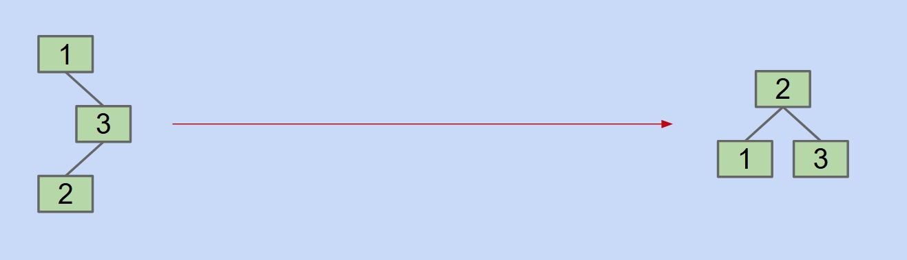

How do you rotate it to the goal?

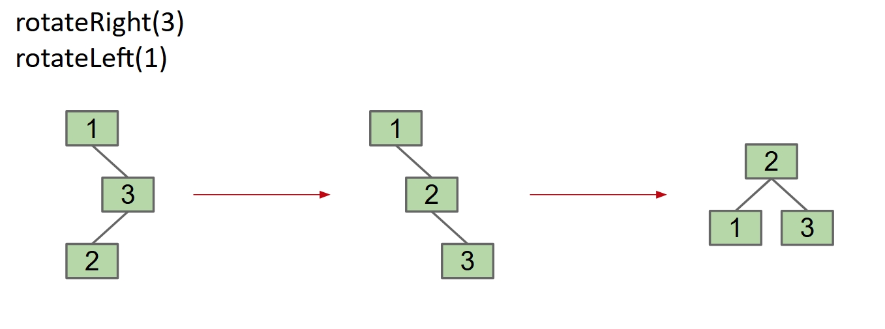

Actually, there are other ways. But I just want you to get the point that we can do this rotation to balance the BST.

More complicated example in this gif:

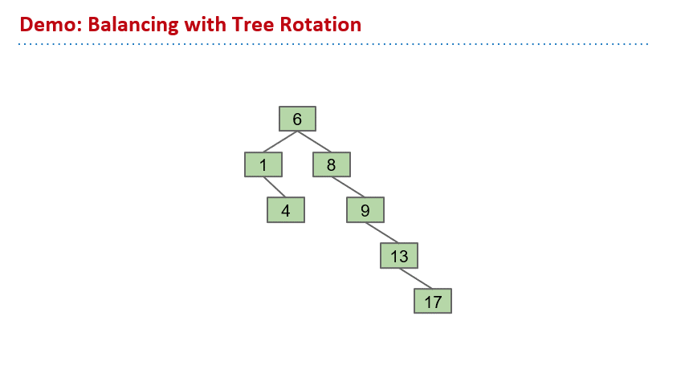

And some math job says we can totally do that in any case, basically in $O(N)$ moves.

So two problems here:

- We don't have this super algorithm to do this
- $O(N)$ is slow as fuck

## Red Black Tree

### Identical Twin

Yeah, I lied. We don't really give a fuck about the algorithm because we have a better idea to do everything. Rotation is just a tool to help us, we are so not going to do everything with it.

We have this BST, which can balance using rotation. And this, to keep things simple, only focus on 2-3 tree, guaranteed to be balanced, but super hard to implement.

Crazy thought here. Since 2-3 tree is hard mainly because there are different kinds of nodes to be maintained, maybe we can build a kind of BST that is structually an identical twin of 2-3 tree. If so, this kind of special BST can be also balanced, and easy to implement.

Yeah, okay, this time I admit people who invented this are a little bit smarter than me.

### The Red Links

The difference between 2-3 tree and BST is the type of node with 2 keys and 3 children.

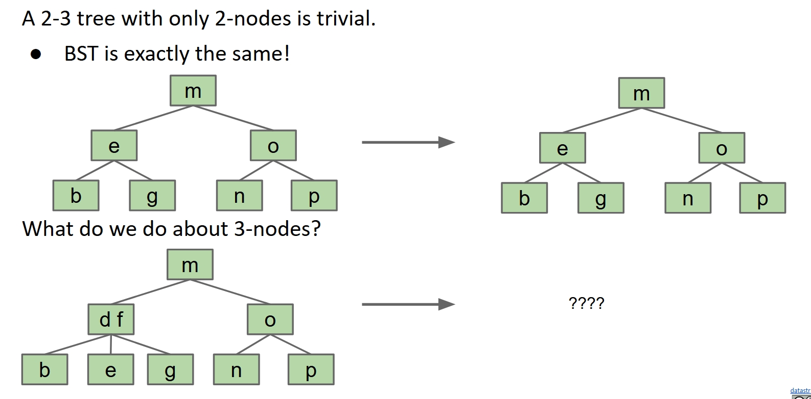

Remember in the rotation definition we do this temporary merge and send down thing? Well, similar here. We can create this 'glue' links with the smaller item off to the left.

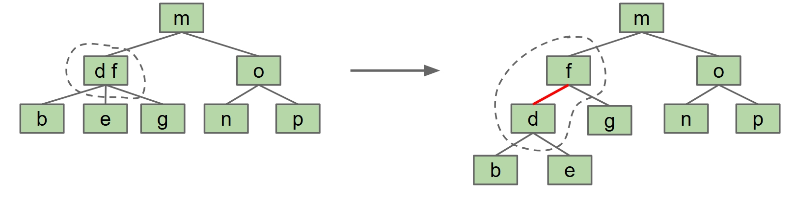

We will always mark this kind of links as red. And that is why this tree is called 'Red Black Tree'.

A BST with left glue links that represents a 2-3 tree is often called a “Left Leaning Red Black Binary Search Tree” or LLRB. They are just BSTs, they can be implemented easily, and they have 1-1 correspondence with their equivalent 2-3 tree.

See this pic if not clear:

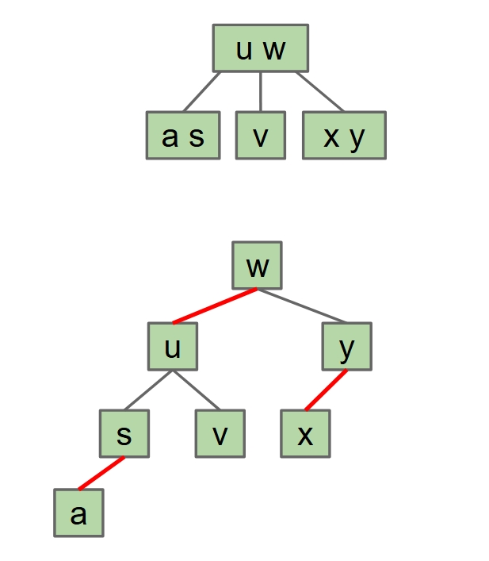

Here are some handy LLRB properties, though I doubt you can figure out yourself so I show:

- No node has two red links, otherwise it’d be analogous to a 4 node, which are disallowed in 2-3 trees.

- Every path from root to a leaf has same number of black links, because 2-3 trees have the same number of links to every leaf. LLRBs are therefore balanced.

### Insertion

Wait, how do we construct this LLRB? I know you are thinking about building a 2-3 tree first, and then convert it to a LLRB. That's why I call you stupid, because it's even more complicated than the B tree.

Smart people like me have this approach. We must maintain the 1-1 correspondence between the LLRB and the 2-3 tree, all the operations. To be specific, we do everything like a normal BST, then we use some rotations to keep it identical to the 2-3 tree.

Right, this is where we actually need rotation.

So first, big question, when we insert, do we use a normal black link or a red link?

Consider you are inserting a key E to a tree with only key S, you get a node `E S`. In 2-3 tree, it always goes to a leaf node at first. So it obviously linked by a red link.

See this pic if not clear:

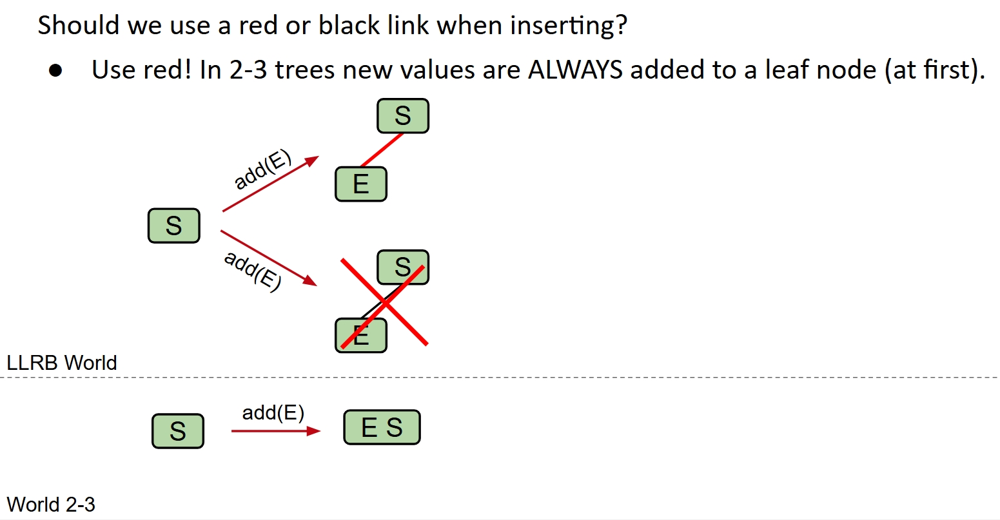

However, we got this little problem. If we insert to the right, there will be a red link to a node's right child! This is crazy, what do we do? Well, just a little rotate left to the node it add to.

See this pic if not clear:

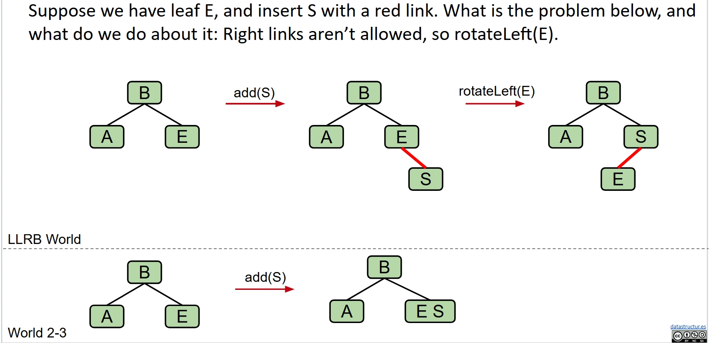

Now we are good, it will be at the left anyway. Wait, what if we insert to the right when it already has a red link at the left? Which represents a temporary node with 3 keys in a 2-3 tree, by the way.

See this pic if not clear:

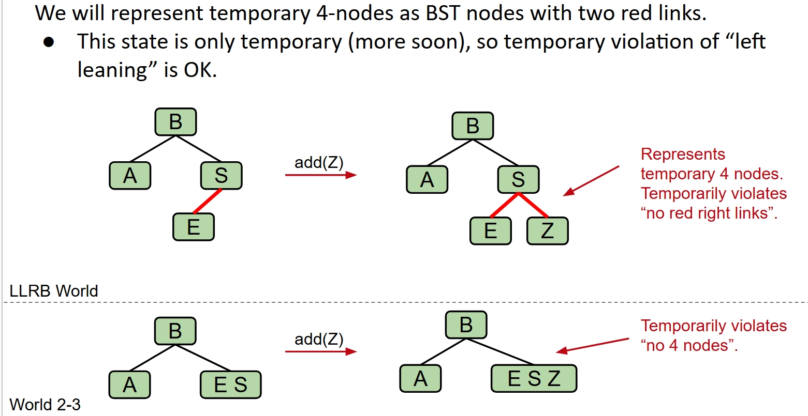

I know you are eager to see how smart people like me split the temporary 4-nodes, but let's see another case first.

What if you insert a key to the left of whom is linked to by a red link? Well, still fix by rotation. The one it add to, do a rotate right to its parent. Then we won't fix it, but we can turn it into the above case. That's why I want you to see this case first.

See this pic if not clear:

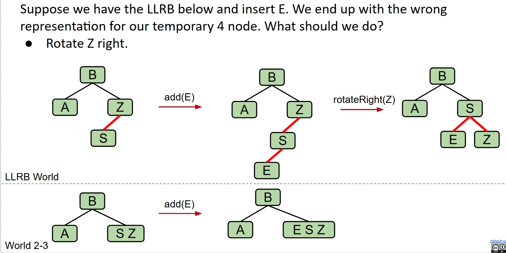

Now we can split the temporary 4-nodes. Remember we are maintaining this 1-1 correspondence between the LLRB and the 2-3 tree, so always think what the 2-3 tree would do.

We push the middle one up and merge it with the parent, the the remaining two can split natually. So as for LLRB, we make the link from the parent to the middle one red, and turn the two red black. Or say in a simpler way, we flip the color of links that touch the middle one.

See this pic if not clear:

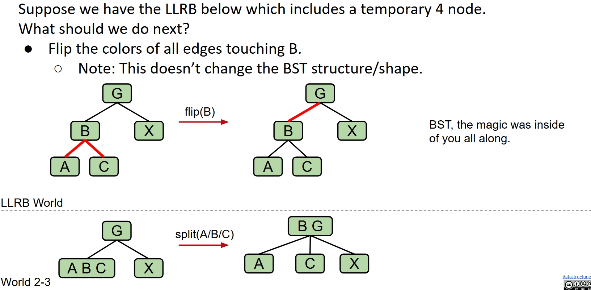

If the it's not in the parent's left, still do so, won't solve it but must turn into existing cases. Just a rotateLeft would make it work.

See this pic if not clear:

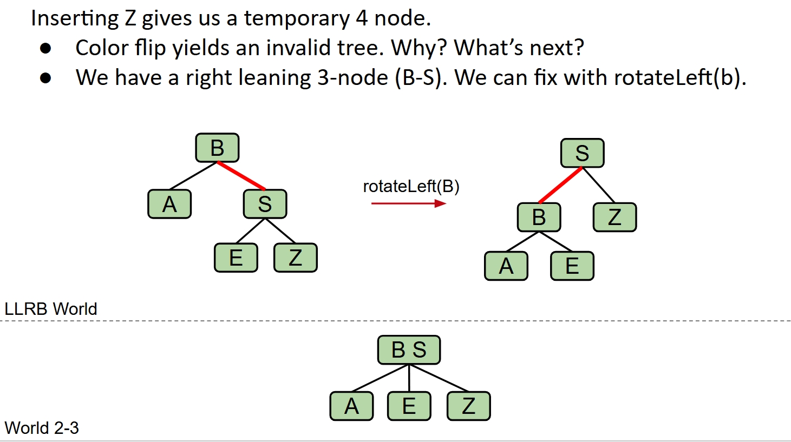

See, even people like you can successfully invent Red Black BST with my guidance.

Little summary:

- When inserting: Use a red link.
- If there is a right leaning “3-node”, we have a Left Leaning Violation.
  - Rotate left the appropriate node to fix.
- If there are two consecutive left links, we have an Incorrect 4 Node Violation.
  - Rotate right the appropriate node to fix.
- If there are any nodes with two red children, we have a Temporary 4 Node.
  - Color flip the node to emulate the split operation.

And we have this gif here to show the insertion process:

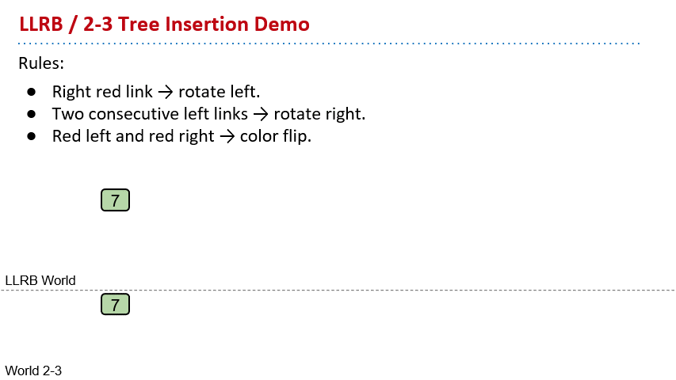

By the way, not gonna cover deletion here, just because CS61B didn't cover it. Not interesting enough, they said.

## Performance

Basically the same as B tree:

- LLRB tree has height $O(log N)$.
- Contains is trivially $O(log N)$.
- Insert is $O(log N)$.
  - $O(log N)$ to add the new node.
  - $O(log N)$ rotation and color flip operations per insert.

So nothing worth to say specifically.

## Implementation

Turning a BST to a LLRB costs only 3 lines of code.

```java
if (isRed(h.right) && !isRed(h.left))      { h = rotateLeft(h);  }
if (isRed(h.left)  &&  isRed(h.left.left)) { h = rotateRight(h); }
if (isRed(h.left)  &&  isRed(h.right))     { flipColors(h);      }
```

So here I provide a implementation based on the code in our [BST note](\BinarySearchTrees.md).

```java
package bstmap;

import java.util.Iterator;
import java.util.Set;
import java.util.TreeSet;

public class LLRBMap<K extends Comparable<K>, V> implements Map61B<K, V> {

    private static final boolean RED = true;
    private static final boolean BLACK = false;

    private Node root;
    private int size = 0;

    private class Node {
        private K key;
        private V value;
        private Node left, right;
        private boolean color; // Color of parent link

        Node(K key, V value, boolean color) {
            this.key = key;
            this.value = value;
            this.color = color;
        }
    }

    // Helper to check color of a node, null links are black
    private boolean isRed(Node h) {
        if (h == null) {
            return false;
        }
        return h.color == RED;
    }

    // Right-leaning red link to left-leaning
    private Node rotateLeft(Node h) {
        Node x = h.right;
        h.right = x.left;
        x.left = h;
        x.color = h.color;
        h.color = RED;
        return x;
    }

    // Left-leaning red link to right-leaning
    private Node rotateRight(Node h) {
        Node x = h.left;
        h.left = x.right;
        x.right = h;
        x.color = h.color;
        h.color = RED;
        return x;
    }

    // Flip colors to split a temporary 4-node
    private void flipColors(Node h) {
        h.color = RED;
        h.left.color = BLACK;
        h.right.color = BLACK;
    }

    @Override
    public void put(K key, V value) {
        root = put(root, key, value);
        // The root of the whole tree must be black
        root.color = BLACK;
    }

    private Node put(Node h, K key, V value) {
        // Base case: insert a new red node at the bottom
        if (h == null) {
            size++;
            return new Node(key, value, RED);
        }

        int cmp = key.compareTo(h.key);
        if (cmp < 0) {
            h.left = put(h.left, key, value);
        } else if (cmp > 0) {
            h.right = put(h.right, key, value);
        } else {
            h.value = value;
        }

        // Fix-up any right-leaning links
        if (isRed(h.right) && !isRed(h.left)) {
            h = rotateLeft(h);
        }
        // Fix-up two reds in a row
        if (isRed(h.left) && isRed(h.left.left)) {
            h = rotateRight(h);
        }
        // Split 4-nodes
        if (isRed(h.left) && isRed(h.right)) {
            flipColors(h);
        }

        return h;
    }

    @Override
    public V get(K key) {
        Node node = get(root, key);
        if (node == null) {
            return null;
        }
        return node.value;
    }

    private Node get(Node h, K key) {
        if (h == null) {
            return null;
        }
        int cmp = key.compareTo(h.key);
        if (cmp < 0) {
            return get(h.left, key);
        } else if (cmp > 0) {
            return get(h.right, key);
        } else {
            return h;
        }
    }

    @Override
    public boolean containsKey(K key) {
        return get(key) != null;
    }

    @Override
    public int size() {
        return size;
    }

    @Override
    public void clear() {
        root = null;
        size = 0;
    }

    public void printInOrder() {
        printInOrder(root);
    }

    private void printInOrder(Node h) {
        if (h == null) {
            return;
        }
        printInOrder(h.left);
        System.out.println("{Key: " + h.key + ", Value: " + h.value + ", Color: " + (isRed(h) ? "RED" : "BLACK") + "}");
        printInOrder(h.right);
    }

    @Override
    public Set<K> keySet() {
        Set<K> keys = new TreeSet<>();
        keySetHelper(root, keys);
        return keys;
    }

    private void keySetHelper(Node h, Set<K> keys) {
        if (h == null) {
            return;
        }
        keySetHelper(h.left, keys);
        keys.add(h.key);
        keySetHelper(h.right, keys);
    }

    @Override
    public Iterator<K> iterator() {
        return keySet().iterator();
    }

    /**
     * LLRB Deletion is quite complex and not covered in the tutorial.
     * As such, remove() methods are not implemented to maintain the LLRB invariants.
     */
    @Override
    public V remove(K key) {
        throw new UnsupportedOperationException("Remove operation not supported.");
    }

    @Override
    public V remove(K key, V value) {
        throw new UnsupportedOperationException("Remove operation not supported.");
    }
}
```
