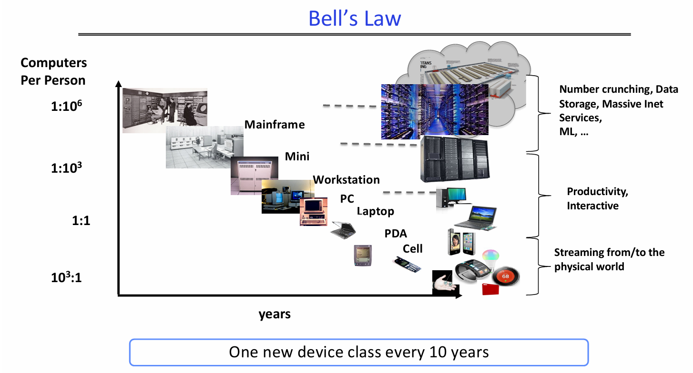
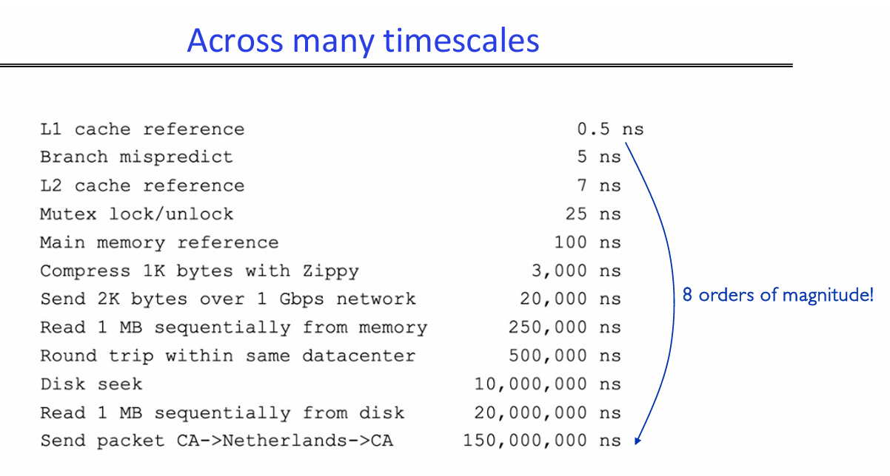
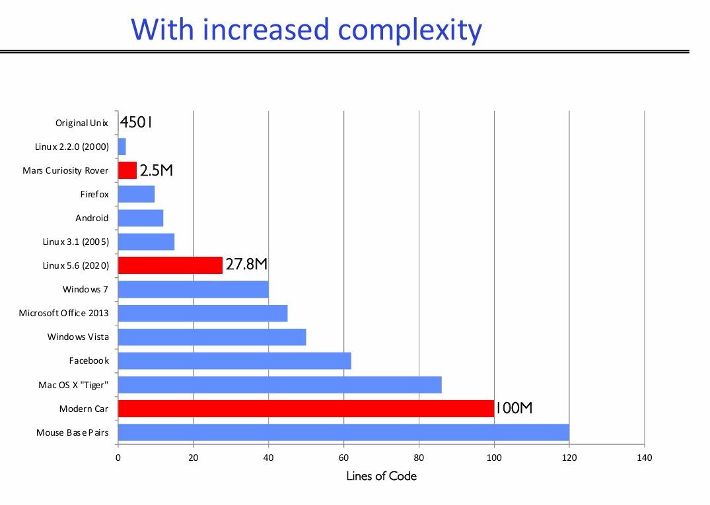
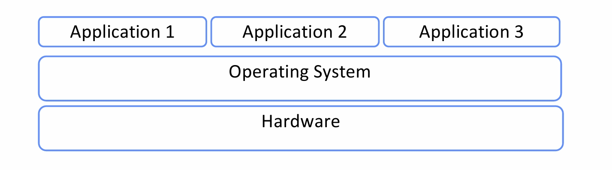
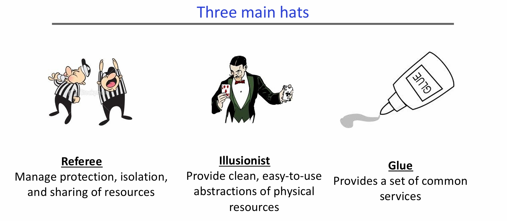
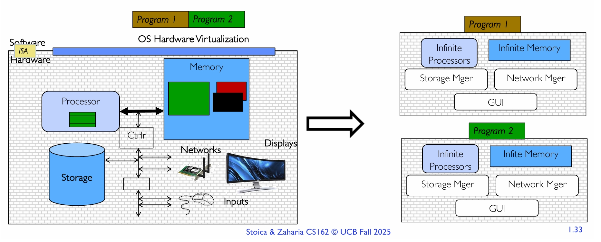
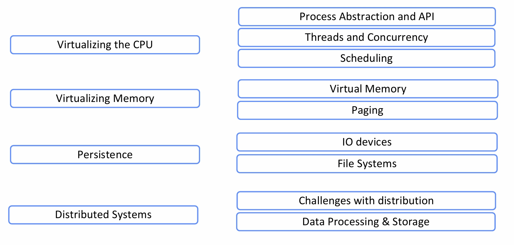

# Introduction

I learn this from this lecture:

[Lec1](./slides%20backup/1.pdf)

All the pictures are from the slides.

## Why care this OS shit?

It's literally everywhere.

Every device, from your smart watch, your smart light bulb, to your mobile phone and laptop runs an operating system.

Every program you will ever write will run on an operating system.

It's performance and execution behavior will depend on the operating system.

## Why is designing an OS hard?

Works for a lot of different devices.

Bell's law tells that basically every decade, there will be one new device class.

Besides the scale of devices number, the OS has to work across many timescales. For a L1 cache inference, it's maybe 0.5ns, but for sending a packet to another country and get it back, might be hundreds of millions of ns. The OS must be able to handle all of these.

And there is larger and larger complexity.

You can see that nowadays it's basically 100 million lines of code.

## What is this OS shit anyway?

So it's useful and complex, I get it. What is it exactly?

There are two version of definition of OS.

**V1:** An operating system is the layer of software that **interfaces** (many) **applications** running on a machine with (diverse) **hardware resources** of that machine.

**V2:** An operating system implementing a **virtual machine** for the application whose interface is more **convienient** than the raw hardware interface.  
(convienient = portability, reliability, security)

So basically, it does three jobs.

The **Referee**, who manages protection, isolation and sharing of resources.

The **Illusionist**, who provides clean, easy-to-use abstractions of physical resources.

And the **Glue**, who provides a set of common services.

We will talk about these one by one and then you will got a good understanding of OS.

### Referee

In one sentence, the job of this referee guy is to allow multiple untrusted applications to run concurrently.

To do that, the first thing is **Fault Isolation**.

We have to isolate application from application, so that one application's fault won't affect another application. We abstract the applications into something called **process** to do that.

Besides, we have to isolate the operating system from the applications. The approach is **Dual Mode Execution**.

The second thing to do is **Resource Sharing**. We need to decide which process to run next, and how to split physical resources. To do that, the OS has to do this **scheduling** job.

But though you need isolation, applications still need to share data or shit sometimes. So the OS need to have a way for them to do that, the **pipes/sockets** shit.

### Illusionist

The hardware got restrictions, so the OS need to do some virtualization and provide some illusions to keep things simple.

The **all alone** illusion is to make the application thinks that it got exclusive use of resources.

The **all powerful** illusion is to make the application thinks that it got infinite resources.

And the **all expressive** illusion is to provide some hardware capabilities that are not physically present.

### Glue

Provide some common services.

The common services means something that most applications would use, such as filesystem, use interface and network.

---

So if we do these three jobs very well, we will got a easy to use virtual machine.

Anyway, we are gonna cover all these things in this course.

