# Protection

I learn this from these lectures:

[Lec2](./slides%20backup/2.pdf)

[Lec3](./slides%20backup/3.pdf)

All the pictures are from the slides.

## Four Foundamental OS Concepts

### Thread of Control

So we talked about that we need to run multiple programs at the same time. But how?

The idea is **multiplexing in time**. Basically, we run many programs in turn, but very fast. This is how we provide the illusion of multiple processors, so that every program thinks it can use its own processor exclusively.

So we jump from one to another very fast, then we have to define what are we jumping between. Wait, what? Isn't it just the programs? 

To be exact, for a processor, it's more like the context of programs' execution.

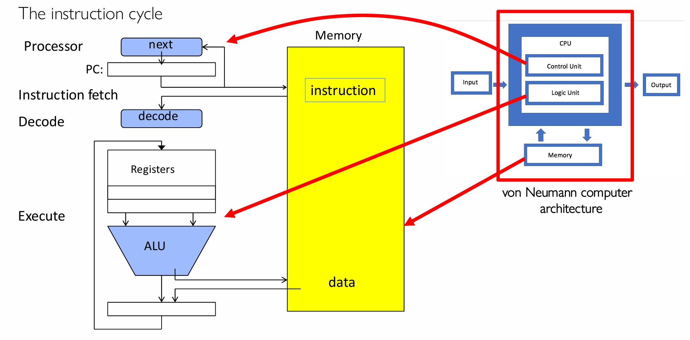

I believe you have known well about how a program is executed by the CPU. You have some instruction and data in the memory, a program counter (PC) register to hold the next instruction, some datapath to decode the instruction and do some calculation or something.

A **thread** is basically the context of this execution. It includes the PC, the registers, the stack, the execution flags and memory state.

If the registers is holding the context, then this thread is being executed on the processor. I mean the PC is point at the next instruction, the registers are holding the data (immediates or pointers to data in memory), everything like that.

A thread is not executing, or say **suspended** when the context is not resident in the processor. Probably some other program is running. Often, a copy of last values of these context is stored in memory, waiting for continuing execution.

So when we want to provide the illusion of multiple processors, doing the multiplex in time, we are basically jumping from thread to thread.

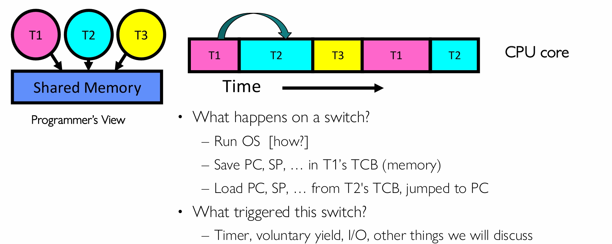

When the thread is running, the context is in the real physical core. But when it's not, we need to store the context in memory. There will be a chunk of memory for it called its **Thread Control Block (TCB)**.

So what we are doing is, run T1 for a while, save the PC, SP and shit in T1's TCB, and load PC, SP and shit from T2's TCB, jump to PC and run...

I think this is pretty easy to understand.

### Address Space

So doing the multiplex in time is good, I know. But there is a huge problem, which is that we are still sharing the same memory without any protection!

One thread got a bug, it can mess up the data or instructions of another thread. Bad guy like me can use come spy program to read the data of other threads, or why so conservative, I am totally gonna crash your operating system so bad that you want me to teach you CS162.

Anyway, not good huh?

So OS has to protect user programs from one another. But how? How do we do this protection?

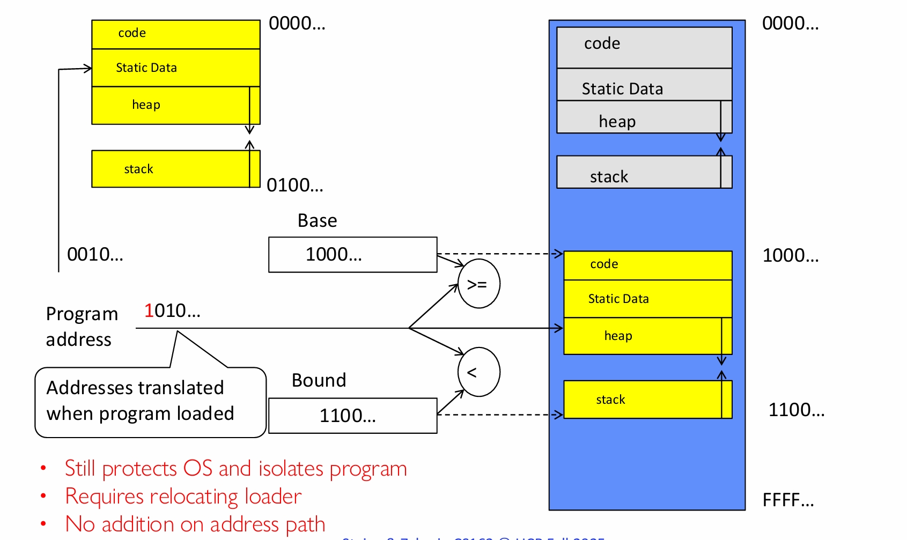

The naive approach is called **Base and Bound (B&B)**. We have two registers that can only be operated by the OS, the **Base** and the **Bound**. We add the base to the address, and if the address is larger than the base and less than the bound, it's a valid address and we can access. By the way, the address translation can be also done later, when the bound is the length of it's memory, not the real upper bound.

The B&B can do the basic job, but not good enough. The simplixity makes it not flexible. For example, sometimes we still need multiple programs to share memory. With B&B, we can't do that.

Another approach is **Address Space Translation**.

The **Address Space** is a set of addresses that the program can access, and some state associated with them.

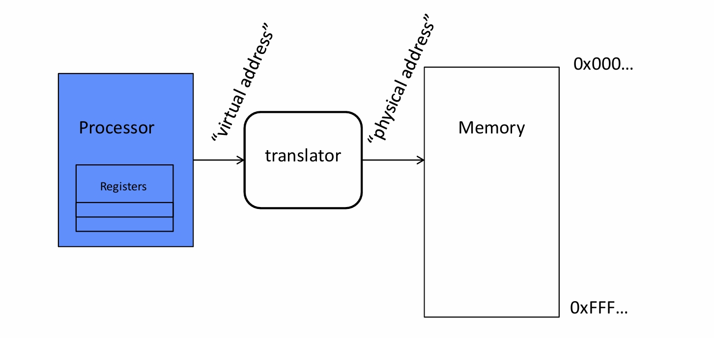

The big idea is to let the program operates in a address space that is distinct from the physical memory space of the machine.

Then we translate the virtual space into physical address, and access. How the translation is done? We have talked about it in the Virtual Memory part of CS61C, it's some hardware stuff.

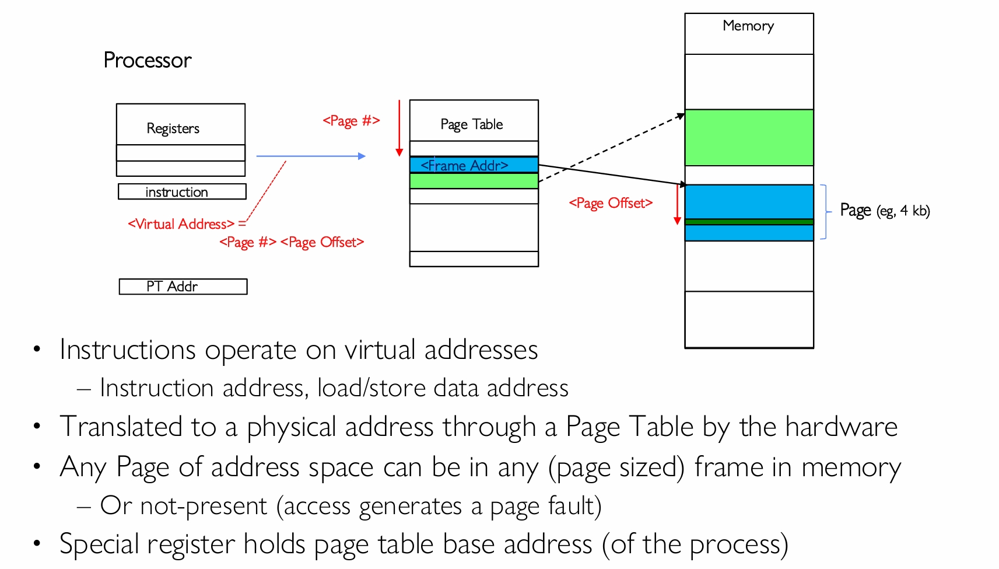

Basically, the virtual address has two parts, the **page number** and the **offset**. The OS got a page table for each program, it check out the page number and get the physical address of that page, then add up the offset to get the final physical address.

### Process

so now we protexted the context of program from each other, and protexted the address space of program from each other. Maybe we can capsulate the address space and the threads of a program into one **process**.

The definition of **process** is the execution environment for a program with restricted rights. It owns memory (address space), owns file descriptors and file system context and stuff, and it encapsulates one or more threads sharing process resources.

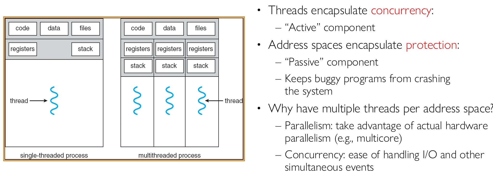

### Dual Mode Operation

Are we fully done the protection? Not really. We can still fuck up. Though the address space only contains its own data, why can't a process change the page table pointer or something?

Hardware must support privilege levels, which basically means that there are something that can only be done by the OS, not the processes.

So the **Dual Mode Operation** requires the hardware to provide at least two modes, the **kernel** mode (**supervisor** mode) and the **user** mode.

Some certain operations are banned in user mode, like changing the page table pointer, disabling interrupts, interacting directly with hardware, writing to the kernel memory and etc.

In kernel mode, you got full control.

So usually, processes run in user mode, when system calls, interrupts or exceptions happen, switch to kernel mode and let the OS deal with it.

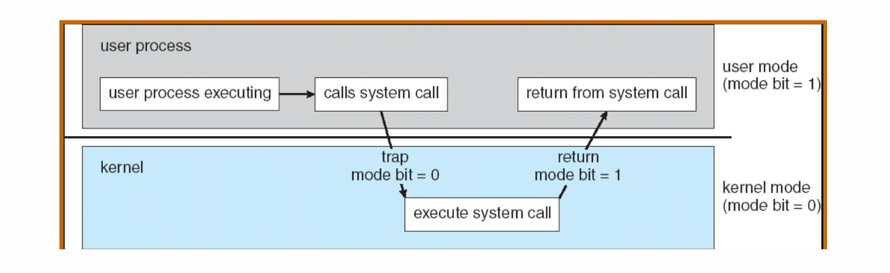

## Threads and Processes

So we have know the basic concepts of these four things. Why don't we dive deeper into how the operating system manages the threads and processes?

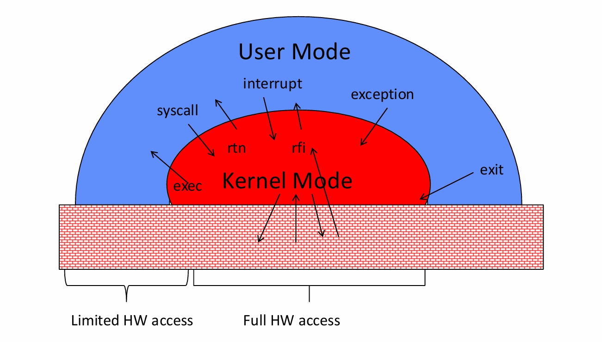

We have talked about the user and kernel mode thing. OS can do anything in kernel mode, process can only do limited stuff in user mode. When a process want to do some system stuff or shit, it ask the OS to do for it in kernel mode.

But what exactly happens? How does the operating system run a process, and interrupt it to do it's priviledge stuff or switch to another process?

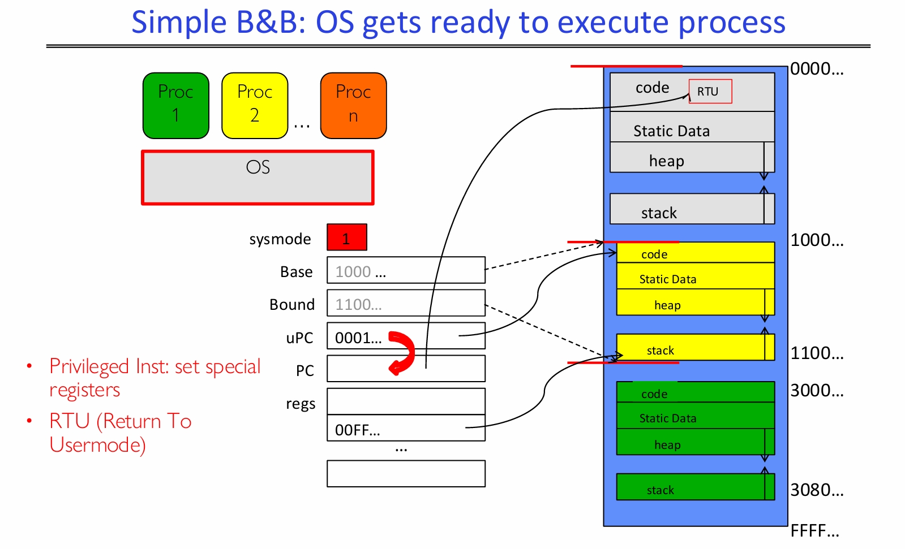

Well, initially, the OS is in charge under the kernel mode. It use some privileged instructions to set special registers, loads the process. And then it use a privileged RTU (Return To Usermode) inst to switch to user mode and execute the process.

This is simple, but only half job. How does kernel switch between processes? How do we even return to the system?

### Unprogrammed Control Transfer

I mean, the process guy is totally not gonna give you a instruction to say that he wants to stop and let you be in charge. He got no privilege, can't do that anyway.

So we need some **Unprogrammed Control Transfer**, which means switching to OS without a direct instruction from the running process.

There are three types of that, the **Syscall**, the **Interrupt** and the **Trap or Exception**.

- **Syscall** means the process asking for some system services. It's pretty like a function call. For example, a process wants to exit or read a file.

- **Interrupt** is external asynchronous event triggers context switch. For example, remember the OS is switching around the processes? Before it run the process, it set a timer to interrupt it after a while so that it can switch to another process.

- **Trap** or **Exception** is internal synchronous event in the process trigers context switch. Divide by a zero or shit, something like that.

So when these unprogrammed control transfers happen, the CPU got to jump to some certain operating system kernel code to deal with it. But where can we get the address of this certain code?

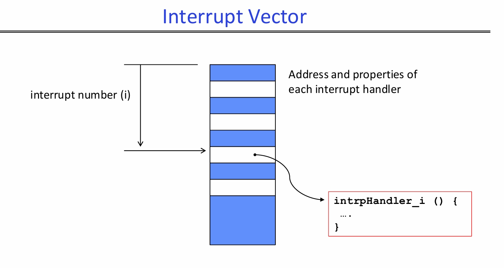

So the solution is this **Interrupt Vector**. Basically, it's an array of pointers. The interrupt number is the index, so we can check out the address and properties of each interrupt handler.

### Process Control Block (PCB)

So now we can return to the system. Then we may want to switch to another process. 

We have talked about that roughly. Basically we need to save registers and set up system stack. But how do we do that exactly?

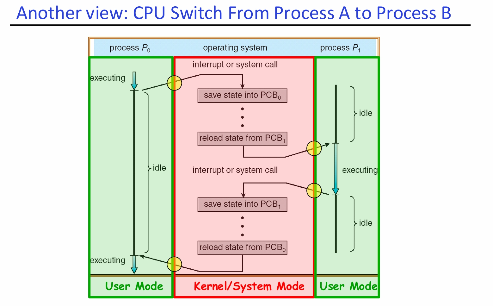

The solution is that the kernel represents each process with a **process control block (PCB)**.

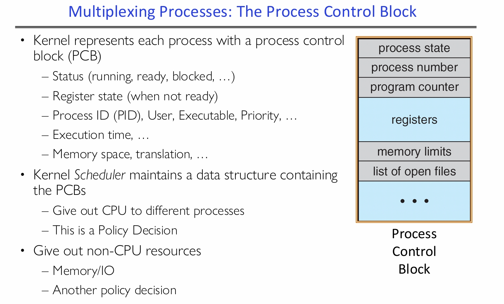

It's some sort of data structure that stores everything important about a process. It got the **status**, say it's running, ready, blocked or what. And the **register state**, that's where we save the registers, well, not really, mostly some pointers. It also got process ID (PID), and stuff about memory, etc.

Then Kernel Scheduler maintains a data structure containing the PCBs. This guy decide which process can use the CPU, and for how long. It does the **scheduling** job, by some certain policy of course. We will talk about it later.

### Multithreaded Process

I have given you a definition of thread, a single unique execution context. This is how we view the thread from the OS's perspective. If you see it in a programmer's view, it may have another definition which is a execution sequence that represents a seperately **scheduable task**. 

Protection is about processes, but a process may have one or multiple threads.

Threads are a machanism for concurrency, they can run in parallel of course, but don't have to. By saying threads can be run concurrently, it means scheduler can run threads in any order and interleaving.

It's handling multiple things at once, different from parallel, which means simultaneously. Two threads on a single-core CPU, concurrency but not parallelism, clear enough.

But why, why bother? We have processes and the OS switching around, why is it still not enough? Why we have to run many threads in a process concurrently?

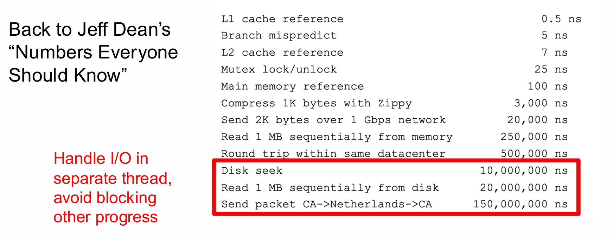

The reason is I/O latency. Remember these numbers? Accessing the main memory might take about 100 ns, while accessing the disk might take millions of ns.

If a process got only one thread, when it's waiting for an I/O to finish, the CPU can do nothing. But if we can let different threads handle different I/O, when one is waiting, we just switch to another.

To do that, we need to give a thread three states.

- **RUNNING**, which is literally running.  

- **READY**, which is ready to run, but not currently running.  

- **BLOCKED** means can't be run right now.

If a thread is waiting for an I/O to finish, the OS marks it as BLOCKED. Once the I/O is finished, the OS marks it as READY.

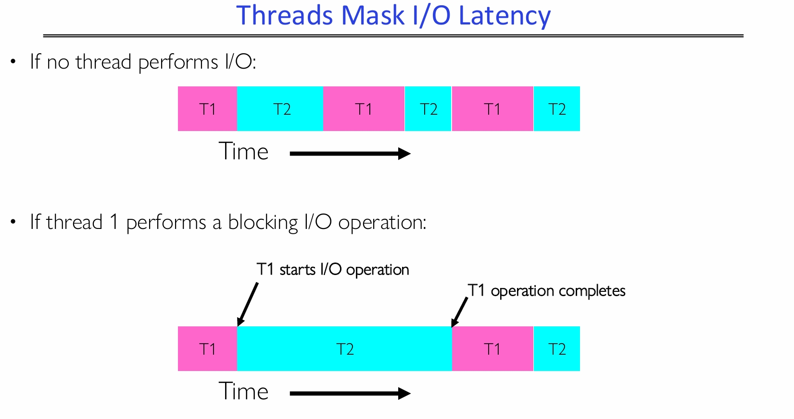

So when you complie a C language program into executable, it create a process. Initially, it got only one main thread running in its own address space. How does it create more threads?

Once the process starts, it issues Syscalls to create more threads, which are parts of the process and shares the same address space.

You probably won't see these syscalls, since it was issued by OS library which used by language runtime.

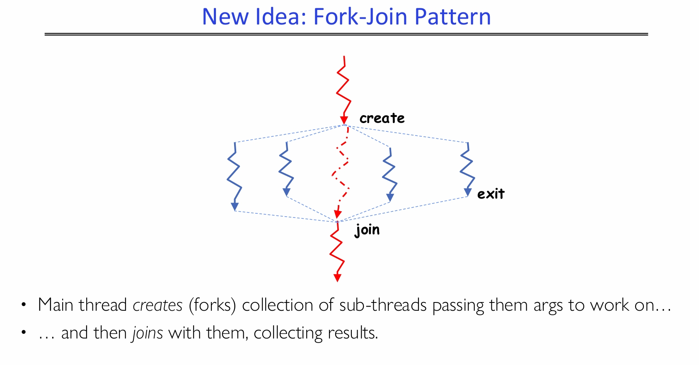

Anyway, main thread creates collection of sub-threads passing them args to work on, and then joins with them to collect results.

### Thread States

Some states of threads are shared by all threads in process or address space. For example, content of memory and I/O states.

There are also some states that are private to each thread, which will be kept in something called **Thread Control Block (TCB)**. For example, the CPU registers and stack.

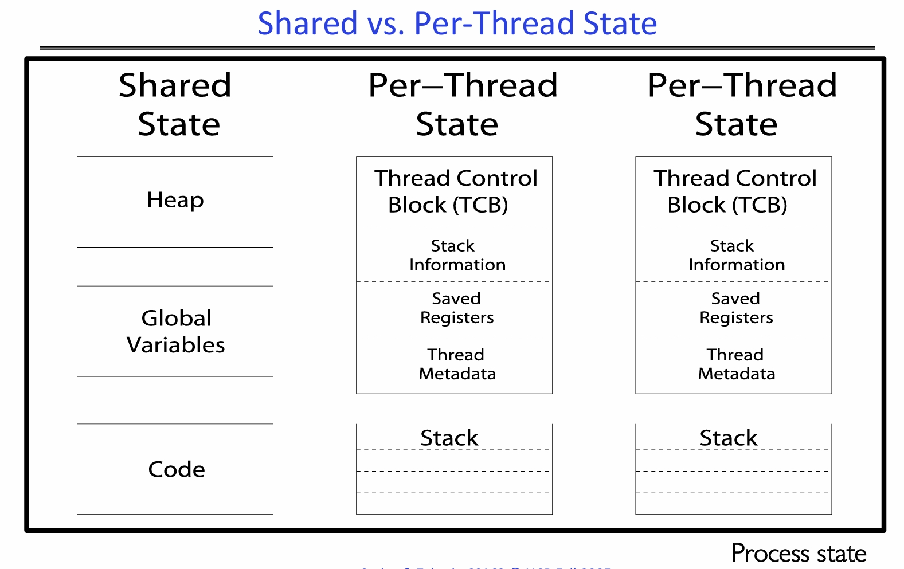

See this as an example of memory layout with two threads.

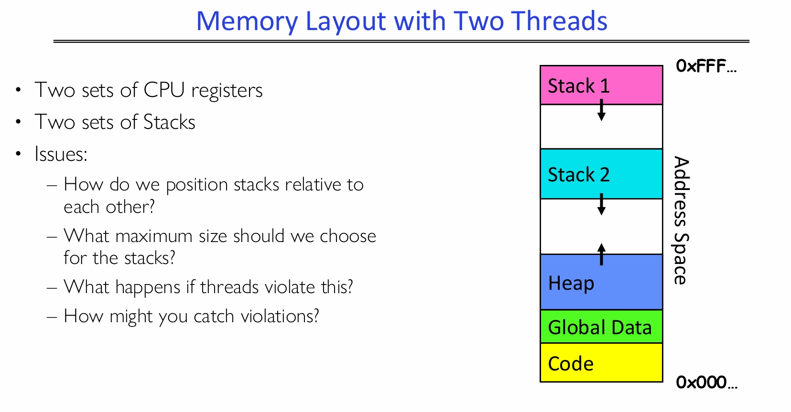

We have some issues with handling these stacks, but will get to that later.

### Interleaving and Non-determinism

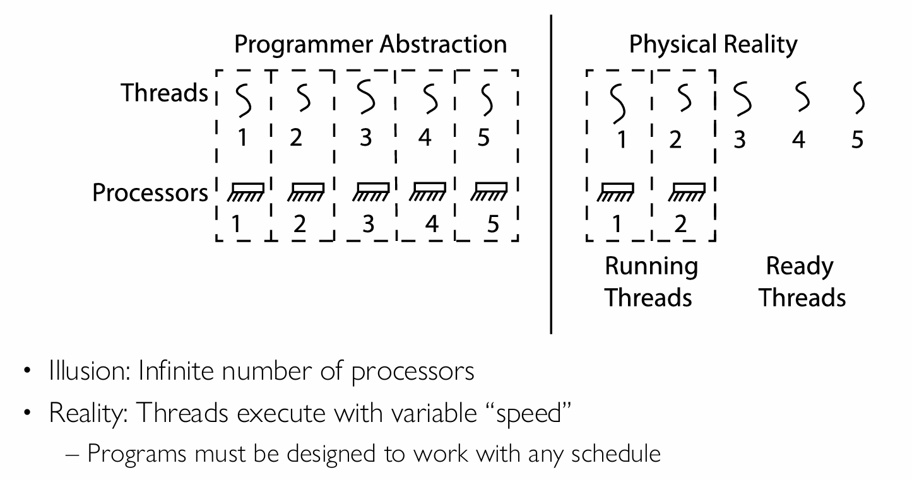

Now we have many threads in one process, this cause another problem. If the scheduler can run threads in any order and interleaving, then the order of the program to be executed is not determined!

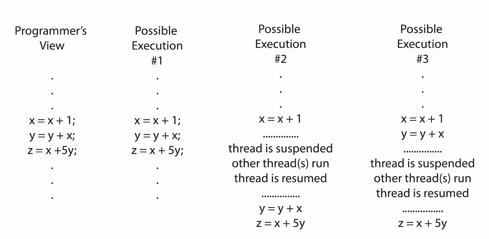

If threads are independent, no shared states, then it would be fine. But if they shared some data or stuff, it can be a mess.

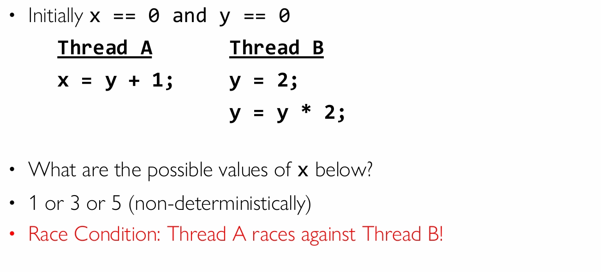

With different schedules, there might be defferent result for one variable in this situation. This is called **Race Condition**.

Our goal is correctness by design, programs have to be designed to work with any schedule.

So we need to do **Synchronization**, which means coordination between threads, usually regarding shared data.

To do that, we must ban race condition. We have to ensure that only one thread does a particular thing at a time, excluding the others. This is called **Mutual Exclusion**.

Code to access shared resources that exact one thread can execute at once is called **Critical Section**.

A **lock** is an object only one thread can hold at once. This is the solution of synchronization, providing mutual exclusion.

We will talk about how to build that later.